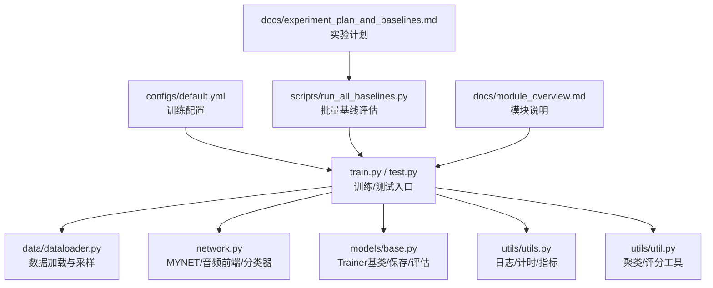
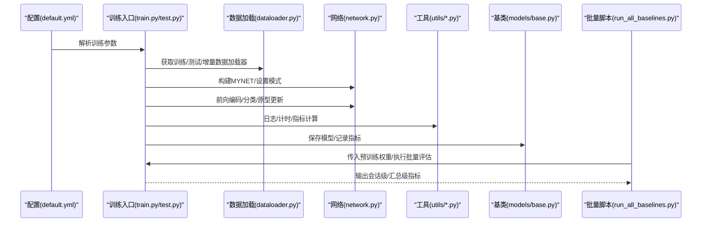
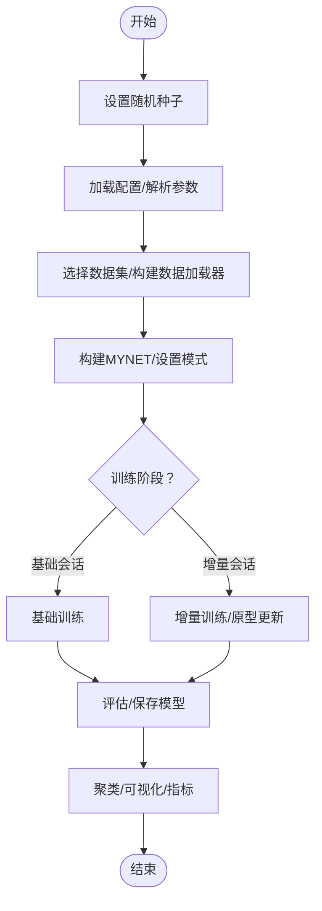
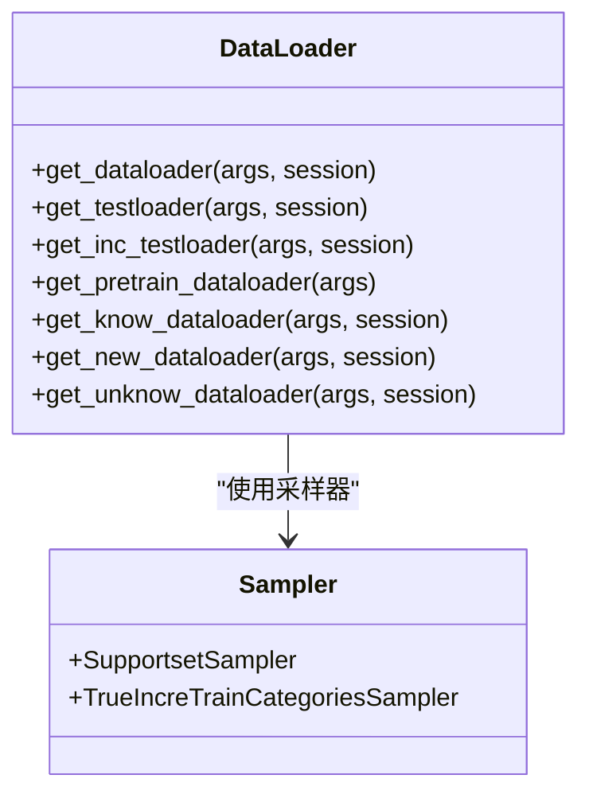
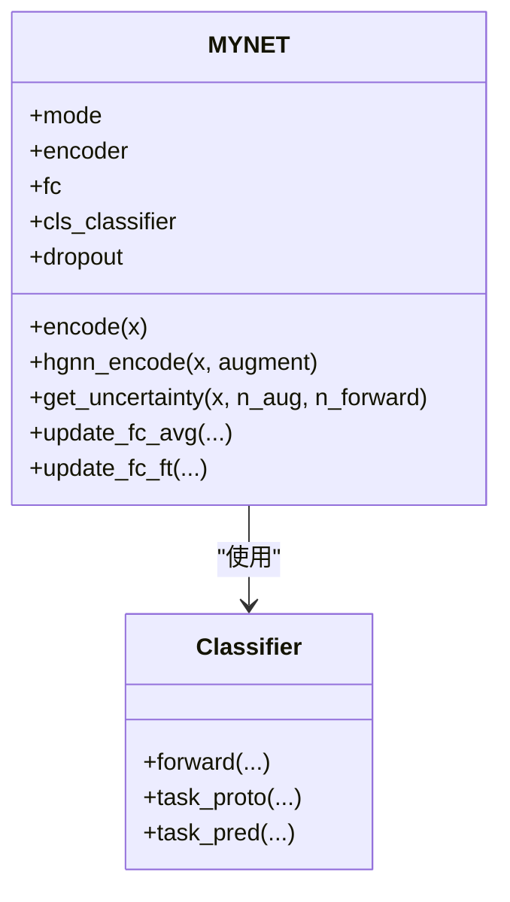
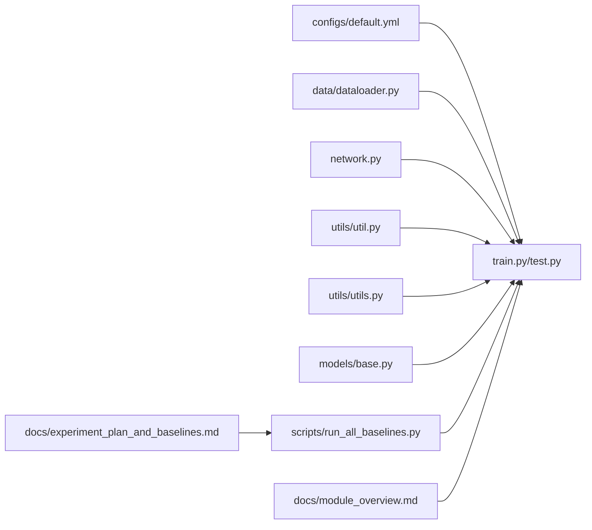

# 故障排除和调试

<cite>
**本文引用的文件**
- [train.py](file://train.py)
- [test.py](file://test.py)
- [configs/default.yml](file://configs/default.yml)
- [data/dataloader.py](file://data/dataloader.py)
- [models/base.py](file://models/base.py)
- [network.py](file://network.py)
- [utils/util.py](file://utils/util.py)
- [utils/utils.py](file://utils/utils.py)
- [scripts/run_all_baselines.py](file://scripts/run_all_baselines.py)
- [docs/experiment_plan_and_baselines.md](file://docs/experiment_plan_and_baselines.md)
- [docs/module_overview.md](file://docs/module_overview.md)
</cite>

## 目录
1. [简介](#简介)
2. [项目结构](#项目结构)
3. [核心组件](#核心组件)
4. [架构总览](#架构总览)
5. [详细组件分析](#详细组件分析)
6. [依赖关系分析](#依赖关系分析)
7. [性能考虑](#性能考虑)
8. [故障排除指南](#故障排除指南)
9. [结论](#结论)
10. [附录](#附录)

## 简介
本指南聚焦于VAZE项目的故障排除与调试实践，覆盖安装与环境准备、配置与路径问题、训练异常、日志与可视化、性能监控与优化、版本兼容性、社区支持与问题反馈渠道，以及单元与集成测试指导。内容基于仓库中的训练脚本、配置文件、数据加载器、网络与工具模块等源文件进行系统梳理，帮助开发者快速定位与解决问题。

## 项目结构
VAZE项目采用模块化组织，核心目录与职责如下：
- configs：训练配置（YAML）
- data：数据集与采样器、数据加载器
- models：模型基类、分类器、元训练器、不确定性模块等
- utils：通用工具、日志、指标计算
- scripts：批量运行与可视化脚本
- docs：实验计划与模块概览文档
- save/save_result：中间产物与结果输出
- 根目录脚本：训练、测试、开集评估等入口

图表来源
- [configs/default.yml:1-88](file://configs/default.yml#L1-L88)
- [train.py:799-1296](file://train.py#L799-L1296)
- [test.py:780-1314](file://test.py#L780-L1314)
- [data/dataloader.py:1-351](file://data/dataloader.py#L1-L351)
- [network.py:1-724](file://network.py#L1-L724)
- [models/base.py:1-254](file://models/base.py#L1-L254)
- [utils/utils.py:1-566](file://utils/utils.py#L1-L566)
- [utils/util.py:1-75](file://utils/util.py#L1-L75)
- [scripts/run_all_baselines.py:1-282](file://scripts/run_all_baselines.py#L1-L282)
- [docs/module_overview.md:1-51](file://docs/module_overview.md#L1-L51)
- [docs/experiment_plan_and_baselines.md:1-30](file://docs/experiment_plan_and_baselines.md#L1-L30)

章节来源
- [configs/default.yml:1-88](file://configs/default.yml#L1-L88)
- [docs/module_overview.md:1-51](file://docs/module_overview.md#L1-L51)

## 核心组件
- 训练入口与流程控制：train.py/test.py提供训练、测试、增量会话、聚类与原型更新等主流程，包含随机种子设置、设备与数据加载、模型前向与损失计算、评估与保存等。
- 数据加载与采样：data/dataloader.py提供预训练、元训练、增量测试等不同阶段的数据加载器，并使用worker初始化与生成器确保可复现性。
- 网络与音频前端：network.py定义MYNET，包含Log-Mel谱图提取、ResNet18编码、分类头、不确定性估计、原型更新与多头注意力等模块。
- 工具与指标：utils/utils.py提供日志记录、计时器、聚类与指标计算；utils/util.py提供聚类准确率、F1评分等。
- 基类与保存：models/base.py提供Trainer基类，封装数据初始化、替换分类头、保存模型、记录指标等通用逻辑。
- 批量评估：scripts/run_all_baselines.py统一驱动CIL+OSR组合的全流程评估，便于对比实验与消融分析。

章节来源
- [train.py:799-1296](file://train.py#L799-L1296)
- [test.py:780-1314](file://test.py#L780-L1314)
- [data/dataloader.py:1-351](file://data/dataloader.py#L1-L351)
- [network.py:1-724](file://network.py#L1-L724)
- [utils/utils.py:1-566](file://utils/utils.py#L1-L566)
- [utils/util.py:1-75](file://utils/util.py#L1-L75)
- [models/base.py:1-254](file://models/base.py#L1-L254)
- [scripts/run_all_baselines.py:1-282](file://scripts/run_all_baselines.py#L1-L282)

## 架构总览
下图展示了从配置到训练/测试、再到评估与可视化的整体流程，以及关键模块之间的交互关系。

图表来源
- [configs/default.yml:1-88](file://configs/default.yml#L1-L88)
- [train.py:799-1296](file://train.py#L799-L1296)
- [test.py:780-1314](file://test.py#L780-L1314)
- [data/dataloader.py:1-351](file://data/dataloader.py#L1-L351)
- [network.py:1-724](file://network.py#L1-L724)
- [utils/utils.py:1-566](file://utils/utils.py#L1-L566)
- [models/base.py:1-254](file://models/base.py#L1-L254)
- [scripts/run_all_baselines.py:1-282](file://scripts/run_all_baselines.py#L1-L282)

## 详细组件分析

### 训练入口与流程控制（train.py/test.py）
- 随机种子与确定性：提供set_seed与check_randomness，确保可复现实验。
- 数据集选择：set_up_datasets根据参数动态导入数据模块。
- 训练主循环：包含基础会话训练、增量会话训练、测试与评估、原型更新等。
- 可视化与聚类：提供特征t-SNE、相关性热图、分布直方图、聚类指标计算与决策边界可视化。
- 不确定性估计：在测试模式下使用MC Dropout与特征掩码计算不确定性。

图表来源
- [train.py:114-141](file://train.py#L114-L141)
- [train.py:156-172](file://train.py#L156-L172)
- [train.py:799-1296](file://train.py#L799-L1296)

章节来源
- [train.py:114-141](file://train.py#L114-L141)
- [train.py:156-172](file://train.py#L156-L172)
- [train.py:799-1296](file://train.py#L799-L1296)

### 数据加载与采样（data/dataloader.py）
- 多数据集支持：根据参数选择FMC、NSynth、LibriSpeech等数据集。
- 可复现性：通过worker_init_fn与Generator确保多进程数据加载一致。
- 采样策略：支持支持集/查询集采样、增量类采样、课程式采样等。
- 测试加载：提供增量测试与全类测试的数据加载器。

图表来源
- [data/dataloader.py:19-254](file://data/dataloader.py#L19-L254)

章节来源
- [data/dataloader.py:19-254](file://data/dataloader.py#L19-L254)

### 网络与音频前端（network.py）
- MYNET：包含Log-Mel谱图提取、ResNet18编码、分类头、多头注意力、不确定性估计等。
- 模式切换：支持encoder、openmeta等模式，分别用于特征提取与元训练。
- 原型更新：支持基于平均嵌入的分类头替换与增量会话的原型更新。
- 不确定性：通过MC Dropout与特征掩码计算样本不确定性。

图表来源
- [network.py:18-518](file://network.py#L18-L518)

章节来源
- [network.py:18-518](file://network.py#L18-L518)

### 工具与指标（utils/utils.py、utils/util.py）
- 日志与计时：Logger类提供文件与控制台日志；Timer提供耗时统计。
- 指标计算：提供聚类准确率、混淆矩阵、各类别准确率、Top-k准确率等。
- 可视化：提供TSNE、聚类指标计算与保存等辅助函数。
- 通用工具：Averager、AverageMeter、DAverageMeter等统计容器。

章节来源
- [utils/utils.py:534-566](file://utils/utils.py#L534-L566)
- [utils/utils.py:360-488](file://utils/utils.py#L360-L488)
- [utils/util.py:12-75](file://utils/util.py#L12-L75)

### 基类与保存（models/base.py）
- Trainer基类：封装数据初始化、替换分类头、保存模型、记录指标等通用逻辑。
- 替换分类头：基于训练集平均嵌入更新fc权重，支持临时训练场景。
- 指标输出：提供综合性能指标（CPI、PD、AR、MSR）计算与Excel输出。

章节来源
- [models/base.py:27-254](file://models/base.py#L27-L254)

### 批量评估（scripts/run_all_baselines.py）
- 统一驱动：对CIL与OSR方法组合执行完整增量流程，输出会话级与汇总级指标。
- 评估流程：特征编码→OSR评分→未知/已知划分→KMeans聚类→CIL原型注册→评估。
- 结果汇总：生成文本报告与CSV对比表，便于消融与泛化分析。

章节来源
- [scripts/run_all_baselines.py:1-282](file://scripts/run_all_baselines.py#L1-L282)

## 依赖关系分析
- 配置驱动：default.yml决定训练超参、数据加载参数、网络与优化器设置等。
- 训练入口依赖：train.py/test.py依赖data/dataloader.py、network.py、utils/*.py与models/base.py。
- 批量评估：run_all_baselines.py依赖训练入口与数据加载器，统一输出评估结果。
- 文档支撑：module_overview.md与experiment_plan_and_baselines.md提供模块说明与实验计划，便于理解与复现实验。

图表来源
- [configs/default.yml:1-88](file://configs/default.yml#L1-L88)
- [train.py:799-1296](file://train.py#L799-L1296)
- [test.py:780-1314](file://test.py#L780-L1314)
- [data/dataloader.py:1-351](file://data/dataloader.py#L1-L351)
- [network.py:1-724](file://network.py#L1-L724)
- [utils/util.py:1-75](file://utils/util.py#L1-L75)
- [utils/utils.py:1-566](file://utils/utils.py#L1-L566)
- [models/base.py:1-254](file://models/base.py#L1-L254)
- [scripts/run_all_baselines.py:1-282](file://scripts/run_all_baselines.py#L1-L282)
- [docs/module_overview.md:1-51](file://docs/module_overview.md#L1-L51)
- [docs/experiment_plan_and_baselines.md:1-30](file://docs/experiment_plan_and_baselines.md#L1-L30)

章节来源
- [configs/default.yml:1-88](file://configs/default.yml#L1-L88)
- [docs/module_overview.md:1-51](file://docs/module_overview.md#L1-L51)
- [docs/experiment_plan_and_baselines.md:1-30](file://docs/experiment_plan_and_baselines.md#L1-L30)

## 性能考虑
- 随机性与可复现：通过set_seed与固定生成器确保实验可复现，避免因随机性导致的性能波动。
- 数据加载效率：使用pin_memory、num_workers与worker_init_fn提升数据加载吞吐，减少I/O瓶颈。
- 模型与显存：合理设置batch_size与温度参数，避免显存溢出；必要时降低分辨率或批大小。
- 可视化成本：t-SNE与相关性热图在大数据集上耗时较长，建议在小样本或阶段性采样时使用。
- 不确定性估计：MC Dropout与多次前向会显著增加推理时间，建议在调试阶段启用，在生产阶段按需使用。

## 故障排除指南

### 安装与环境问题
- CUDA与PyTorch版本不匹配
  - 症状：导入失败、运行时报设备不匹配或算子不支持。
  - 排查：确认CUDA与PyTorch版本组合，检查环境变量CUDA_VISIBLE_DEVICES。
  - 参考：网络模块中存在对CUDA可用性的判断与设备迁移。
- 依赖缺失
  - 症状：导入torchlibrosa、speechbrain或sklearn失败。
  - 排查：安装相应依赖包；确认Python路径包含项目根目录。
  - 参考：network.py导入了torchlibrosa与speechbrain工具。

章节来源
- [network.py:6-9](file://network.py#L6-L9)

### 配置与路径问题
- 配置文件路径错误
  - 症状：无法加载默认配置或参数未生效。
  - 排查：确认configs/default.yml路径与相对路径；检查参数字段拼写。
  - 参考：训练入口通过命令行参数指定配置文件路径。
- 数据路径与权限
  - 症状：数据加载器报找不到文件或权限不足。
  - 排查：确认dataroot指向正确数据集目录；检查读写权限。
  - 参考：数据加载器在构造时使用root参数与索引列表。

章节来源
- [configs/default.yml:175-181](file://configs/default.yml#L175-L181)
- [data/dataloader.py:13-17](file://data/dataloader.py#L13-L17)

### 训练异常
- 模式切换导致的前向异常
  - 症状：模型在不同模式下行为不一致，导致特征维度或损失异常。
  - 排查：检查mode设置与分支逻辑；确保在不确定性估计时恢复原始mode。
  - 参考：网络模块中存在mode切换与恢复逻辑。
- 原型更新异常
  - 症状：分类头权重更新后评估下降或NaN。
  - 排查：确认类别索引范围与设备一致性；检查是否越界访问。
  - 参考：原型更新在训练与测试阶段均有实现。
- 数据维度不匹配
  - 症状：卷积/池化/注意力层报维度错误。
  - 排查：检查音频参数（采样率、窗长、步长、Mel-bin）与网络期望一致。
  - 参考：音频前端参数在配置文件中定义。

章节来源
- [network.py:37-49](file://network.py#L37-L49)
- [network.py:405-461](file://network.py#L405-L461)
- [configs/default.yml:77-84](file://configs/default.yml#L77-L84)

### 日志分析与可视化
- 日志记录
  - 使用Logger类将训练过程写入文件与控制台，便于离线分析。
  - 参考：utils/utils.py中的Logger类。
- 可视化问题
  - 症状：t-SNE或热图显示异常或崩溃。
  - 排查：检查数据规模与perplexity设置；确保标签与特征维度一致。
  - 参考：训练入口中的可视化函数与聚类指标计算。

章节来源
- [utils/utils.py:534-553](file://utils/utils.py#L534-L553)
- [train.py:238-376](file://train.py#L238-L376)

### 性能监控与内存泄漏检测
- 性能监控
  - 使用Timer统计每轮耗时；结合Averager/DAverageMeter记录指标。
  - 参考：utils/utils.py中的计时与统计工具。
- 内存泄漏检测
  - 症状：长时间运行后显存持续增长。
  - 排查：确保with torch.no_grad()/torch.enable_grad()正确使用；及时释放中间变量。
  - 参考：训练与测试中广泛使用no_grad上下文。

章节来源
- [utils/utils.py:368-381](file://utils/utils.py#L368-L381)
- [train.py:769-780](file://train.py#L769-L780)

### 版本兼容性问题
- Python与PyTorch版本
  - 建议使用与仓库依赖匹配的Python与PyTorch版本；若升级后出现不兼容，优先回退至已知兼容版本。
- 第三方库版本
  - 症状：torchlibrosa/speechbrain接口变更导致导入失败。
  - 排查：锁定第三方库版本；必要时使用虚拟环境隔离依赖。
- 数据集格式
  - 症状：数据加载器读取失败或标签不一致。
  - 排查：确认数据集目录结构与索引文件；检查数据预处理脚本。

章节来源
- [network.py:6-9](file://network.py#L6-L9)

### 社区支持与问题反馈渠道
- 仓库文档：参考docs/module_overview.md与docs/experiment_plan_and_baselines.md获取模块说明与实验计划。
- 批量评估：使用scripts/run_all_baselines.py进行对比实验与消融分析，便于问题定位与复现。
- 输出与报告：利用utils/utils.py中的指标与可视化工具生成报告，辅助问题描述与分析。

章节来源
- [docs/module_overview.md:1-51](file://docs/module_overview.md#L1-L51)
- [docs/experiment_plan_and_baselines.md:1-30](file://docs/experiment_plan_and_baselines.md#L1-L30)
- [scripts/run_all_baselines.py:1-282](file://scripts/run_all_baselines.py#L1-L282)

### 单元测试与集成测试指导
- 单元测试建议
  - 随机种子与确定性：使用set_seed确保测试可复现。
  - 数据加载：针对dataloader.py编写小规模数据集测试，验证worker初始化与采样逻辑。
  - 网络前向：对MYNET的关键前向分支（encode、hgnn_encode、get_uncertainty）进行断言测试。
- 集成测试建议
  - 端到端训练：使用小规模配置与数据集运行一次完整训练/测试流程，验证各模块协同工作。
  - 批量评估：使用scripts/run_all_baselines.py对CIL+OSR组合进行快速评估，检查输出稳定性。
- 指标与可视化
  - 使用utils/util.py与utils/utils.py中的指标函数与可视化工具，验证输出是否符合预期。

章节来源
- [train.py:114-141](file://train.py#L114-L141)
- [data/dataloader.py:5-12](file://data/dataloader.py#L5-L12)
- [network.py:471-518](file://network.py#L471-L518)
- [utils/util.py:12-75](file://utils/util.py#L12-L75)
- [utils/utils.py:360-488](file://utils/utils.py#L360-L488)
- [scripts/run_all_baselines.py:103-186](file://scripts/run_all_baselines.py#L103-L186)

## 结论
本指南基于仓库源码梳理了VAZE项目的故障排除与调试要点，涵盖安装、配置、训练、日志、性能与版本兼容等方面，并提供了单元与集成测试的实践建议。建议在日常开发中：
- 始终使用固定随机种子与生成器，确保可复现；
- 严格检查配置文件与数据路径；
- 在训练/测试中正确使用no_grad与模式切换；
- 利用日志与可视化工具进行问题定位；
- 通过批量评估脚本进行对比实验与消融分析。

## 附录
- 关键文件路径与用途
  - configs/default.yml：训练配置
  - train.py/test.py：训练/测试入口
  - data/dataloader.py：数据加载与采样
  - network.py：网络与音频前端
  - utils/util.py、utils/utils.py：工具与指标
  - models/base.py：基类与保存
  - scripts/run_all_baselines.py：批量评估
  - docs/module_overview.md、docs/experiment_plan_and_baselines.md：模块说明与实验计划