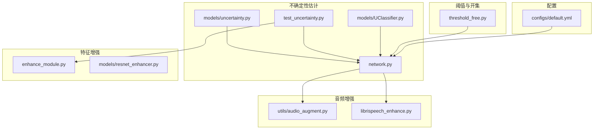
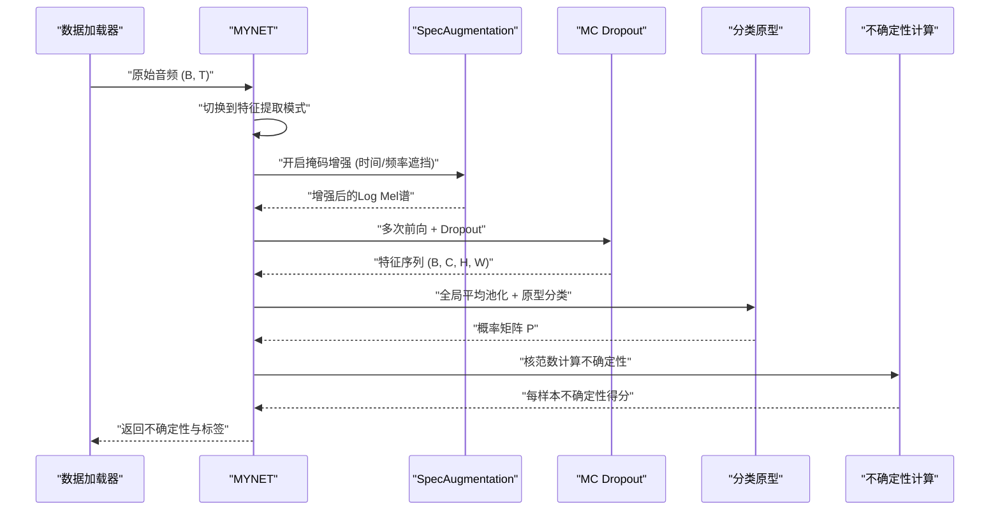
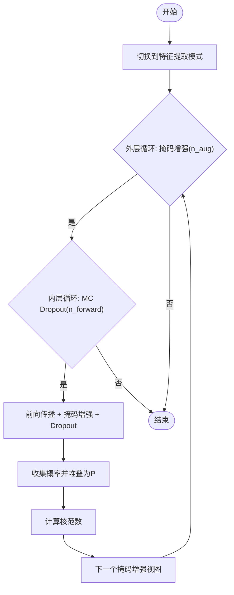
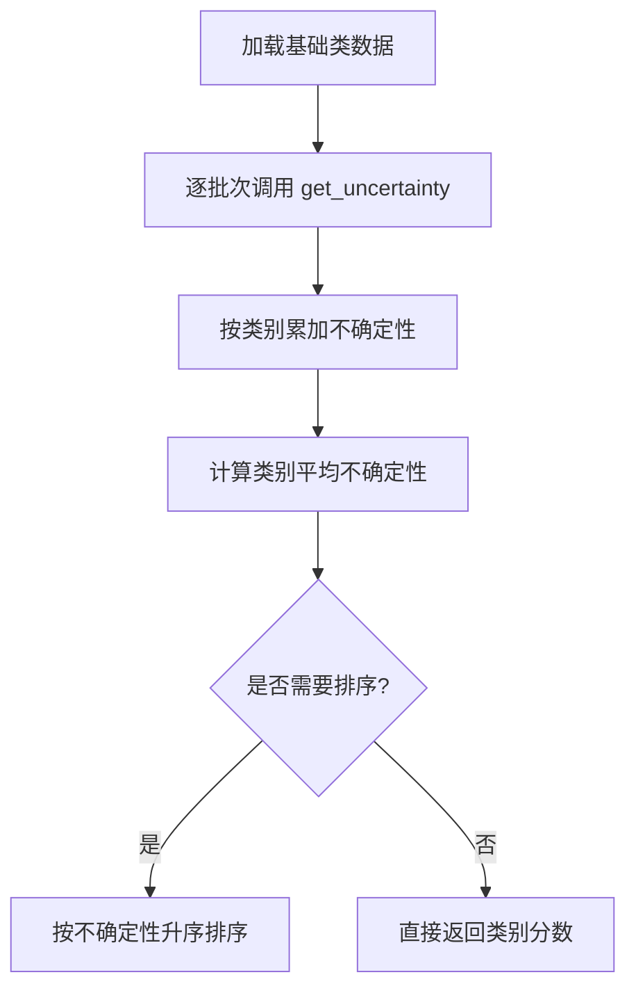
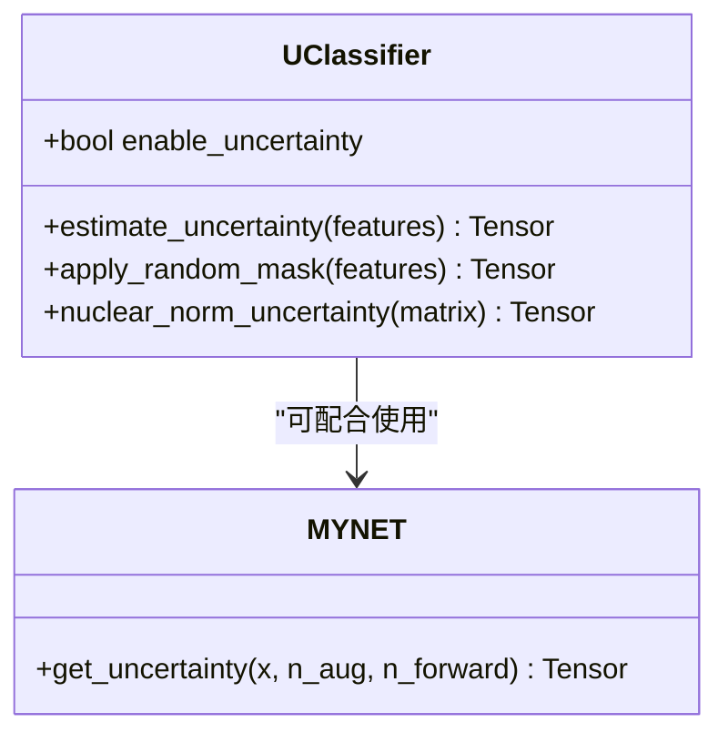
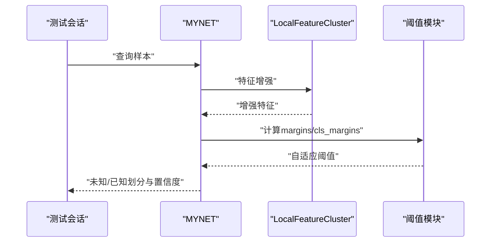
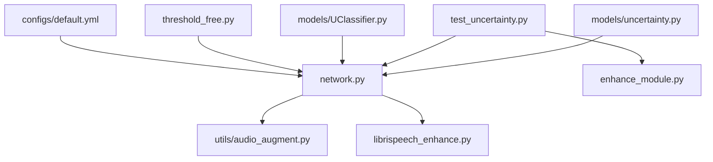

# 不确定性估计

<cite>
**本文引用的文件**
- [models/uncertainty.py](file://models/uncertainty.py)
- [test_uncertainty.py](file://test_uncertainty.py)
- [network.py](file://network.py)
- [models/UClassifier.py](file://models/UClassifier.py)
- [enhance_module.py](file://enhance_module.py)
- [models/resnet_enhancer.py](file://models/resnet_enhancer.py)
- [configs/default.yml](file://configs/default.yml)
- [threshold_free.py](file://threshold_free.py)
- [utils/audio_augment.py](file://utils/audio_augment.py)
- [librispeech_enhance.py](file://librispeech_enhance.py)
</cite>

## 目录
1. [简介](#简介)
2. [项目结构](#项目结构)
3. [核心组件](#核心组件)
4. [架构总览](#架构总览)
5. [详细组件分析](#详细组件分析)
6. [依赖关系分析](#依赖关系分析)
7. [性能考量](#性能考量)
8. [故障排查指南](#故障排查指南)
9. [结论](#结论)
10. [附录](#附录)

## 简介
本文件系统性阐述 VAZE 项目的不确定性估计模块，重点围绕蒙特卡洛 Dropout（MC Dropout）的实现原理与工程实践，覆盖前向传播流程、多次采样策略、不确定性量化方法，并结合增量学习场景给出新类别检测、置信度校准与模型可靠性评估的应用路径。同时解析音频增强在不确定性估计中的作用，以及不确定性阈值设定策略与最佳实践，帮助读者理解如何利用不确定性信息提升模型性能。

## 项目结构
不确定性估计相关代码主要分布在以下模块：
- 不确定性计算与聚合：models/uncertainty.py、test_uncertainty.py
- 模型接口与MC Dropout开关：network.py
- 特征级不确定性估计（可选）：models/UClassifier.py
- 特征增强与空间感知：enhance_module.py、models/resnet_enhancer.py
- 音频增强工具：utils/audio_augment.py、librispeech_enhance.py
- 阈值与开集/未知样本判定：threshold_free.py
- 配置参数：configs/default.yml

**图表来源**
- [models/uncertainty.py:1-55](file://models/uncertainty.py#L1-L55)
- [test_uncertainty.py:1-120](file://test_uncertainty.py#L1-L120)
- [network.py:50-101](file://network.py#L50-L101)
- [models/UClassifier.py:42-112](file://models/UClassifier.py#L42-L112)
- [enhance_module.py:70-160](file://enhance_module.py#L70-L160)
- [models/resnet_enhancer.py:51-172](file://models/resnet_enhancer.py#L51-L172)
- [utils/audio_augment.py:1-31](file://utils/audio_augment.py#L1-L31)
- [librispeech_enhance.py:55-113](file://librispeech_enhance.py#L55-L113)
- [threshold_free.py:178-230](file://threshold_free.py#L178-L230)
- [configs/default.yml:1-88](file://configs/default.yml#L1-L88)

**章节来源**
- [models/uncertainty.py:1-55](file://models/uncertainty.py#L1-L55)
- [test_uncertainty.py:1-120](file://test_uncertainty.py#L1-L120)
- [network.py:50-101](file://network.py#L50-L101)
- [models/UClassifier.py:42-112](file://models/UClassifier.py#L42-L112)
- [enhance_module.py:70-160](file://enhance_module.py#L70-L160)
- [models/resnet_enhancer.py:51-172](file://models/resnet_enhancer.py#L51-L172)
- [utils/audio_augment.py:1-31](file://utils/audio_augment.py#L1-L31)
- [librispeech_enhance.py:55-113](file://librispeech_enhance.py#L55-L113)
- [threshold_free.py:178-230](file://threshold_free.py#L178-L230)
- [configs/default.yml:1-88](file://configs/default.yml#L1-L88)

## 核心组件
- 不确定性计算入口：MYNET.get_uncertainty，负责将原始音频转换为声谱图、执行掩码增强与MC Dropout多次采样，并基于概率矩阵的核范数计算不确定性。
- 不确定性聚合器：get_base_class_uncertainty，按类别汇总样本不确定性，用于课程排序与困难样本加权。
- 特征级不确定性估计：UClassifier.estimate_uncertainty，提供基于核范数的不确定性度量，适用于特征空间的不确定性评估。
- 音频增强与特征增强：SpecAugmentation、LocalFeatureCluster 等，为不确定性估计提供数据扰动与空间感知增强。
- 阈值与开集判定：threshold_free.run_test_fsl，基于自适应阈值与会话感知平滑，实现新类别检测与置信度校准。

**章节来源**
- [models/uncertainty.py:5-55](file://models/uncertainty.py#L5-L55)
- [network.py:50-101](file://network.py#L50-L101)
- [models/UClassifier.py:42-112](file://models/UClassifier.py#L42-L112)
- [enhance_module.py:70-160](file://enhance_module.py#L70-L160)
- [models/resnet_enhancer.py:51-172](file://models/resnet_enhancer.py#L51-L172)
- [threshold_free.py:178-230](file://threshold_free.py#L178-L230)

## 架构总览
不确定性估计在VAZE中的端到端流程如下：

**图表来源**
- [network.py:50-101](file://network.py#L50-L101)
- [utils/audio_augment.py:9-31](file://utils/audio_augment.py#L9-L31)
- [librispeech_enhance.py:55-113](file://librispeech_enhance.py#L55-L113)

## 详细组件分析

### 蒙特卡洛Dropout（MC Dropout）实现
- 前向传播过程
  - 模型切换至“特征提取模式”，禁用分类头，仅输出特征。
  - 对每个样本重复 n_aug 次掩码增强（SpecAugmentation），并在每次增强后重复 n_forward 次前向传播以引入Dropout随机性。
  - 将各视图的概率堆叠为矩阵 P，计算核范数作为不确定性度量。
- 多次采样策略
  - 外层循环控制掩码增强次数（n_aug），内层循环控制MC Dropout采样次数（n_forward）。
  - 通过多次采样降低模型确定性，使不确定性反映模型对输入扰动的敏感度。
- 不确定性量化方法
  - 基于概率矩阵的核范数（trace of singular values），衡量预测分布的散布程度。
  - 支持批量与单样本两种返回形式，便于下游模块统一处理。

**图表来源**
- [network.py:50-101](file://network.py#L50-L101)

**章节来源**
- [network.py:50-101](file://network.py#L50-L101)

### 不确定性聚合与类别级难度评估
- 类别级不确定性聚合
  - get_base_class_uncertainty 遍历基础类数据加载器，调用模型内置不确定性计算，按类别累加并取均值，形成“类-不确定性”映射。
- 难度排序与课程设计
  - 基于类别平均不确定性从小到大排序，指导“零样本初始排序”与“困难感知全量训练”的采样权重设计。
  - 通过加权随机采样器提高困难类样本的出现频率，缓解灾难性遗忘并提升泛化。

**图表来源**
- [models/uncertainty.py:5-55](file://models/uncertainty.py#L5-L55)
- [test_uncertainty.py:654-706](file://test_uncertainty.py#L654-L706)

**章节来源**
- [models/uncertainty.py:5-55](file://models/uncertainty.py#L5-L55)
- [test_uncertainty.py:654-706](file://test_uncertainty.py#L654-L706)

### 特征级不确定性估计（可选）
- UClassifier.estimate_uncertainty
  - 在特征空间上进行MC Dropout与随机掩码，构建预测矩阵并计算核范数不确定性。
  - 适用于需要在特征层面进行不确定性建模的场景，如异常检测或特征聚类。

**图表来源**
- [models/UClassifier.py:42-112](file://models/UClassifier.py#L42-L112)
- [network.py:50-101](file://network.py#L50-L101)

**章节来源**
- [models/UClassifier.py:42-112](file://models/UClassifier.py#L42-L112)

### 音频增强与特征增强对不确定性的贡献
- 音频增强
  - SpecAugmentation：在Log Mel谱上施加时间/频率遮挡，模拟数据扰动，提高模型鲁棒性。
  - 自定义增强：librispeech_enhance 提供时域/频域增强组合（裁剪、变速、变调、加噪等），进一步强化不确定性估计对噪声与变化的敏感性。
- 特征增强
  - LocalFeatureCluster：引入位置编码与空间权重，对特征图进行动态聚类与加权融合，提升空间一致性与稳定性。
  - resnet_enhancer：针对中间层特征的增强模块，支持残差连接与批量KMeans聚类，改善特征表达的局部细节与全局结构平衡。

**图表来源**
- [network.py:486-518](file://network.py#L486-L518)
- [enhance_module.py:70-160](file://enhance_module.py#L70-L160)
- [models/resnet_enhancer.py:51-172](file://models/resnet_enhancer.py#L51-L172)
- [utils/audio_augment.py:9-31](file://utils/audio_augment.py#L9-L31)
- [librispeech_enhance.py:55-113](file://librispeech_enhance.py#L55-L113)

**章节来源**
- [network.py:486-518](file://network.py#L486-L518)
- [enhance_module.py:70-160](file://enhance_module.py#L70-L160)
- [models/resnet_enhancer.py:51-172](file://models/resnet_enhancer.py#L51-L172)
- [utils/audio_augment.py:1-31](file://utils/audio_augment.py#L1-L31)
- [librispeech_enhance.py:55-113](file://librispeech_enhance.py#L55-L113)

### 增量学习中的不确定性应用
- 新类别检测
  - 基于会话感知阈值（margins 与 cls_margins）自适应划分未知/已知样本，避免固定阈值导致的性能波动。
- 置信度校准
  - 使用核范数不确定性作为样本可靠性度量，对低置信度样本进行重试或拒绝决策，提升整体鲁棒性。
- 模型可靠性评估
  - 通过类别级不确定性排序与加权采样，引导模型在困难样本上投入更多资源，缓解灾难性遗忘并提升增量性能。

**图表来源**
- [threshold_free.py:178-230](file://threshold_free.py#L178-L230)
- [test_uncertainty.py:241-259](file://test_uncertainty.py#L241-L259)

**章节来源**
- [threshold_free.py:178-230](file://threshold_free.py#L178-L230)
- [test_uncertainty.py:241-259](file://test_uncertainty.py#L241-L259)

## 依赖关系分析
- 模块耦合
  - MYNET.get_uncertainty 依赖 SpecAugmentation 与 Dropout 层，输出概率矩阵用于不确定性计算。
  - get_base_class_uncertainty 依赖 MYNET.get_uncertainty，负责批量不确定性聚合。
  - LocalFeatureCluster 与 resnet_enhancer 作为特征增强模块，可选接入不确定性估计流程。
- 外部依赖
  - 配置文件提供关键超参数（温度、批次大小、采样次数等），影响不确定性估计的稳定性与效率。

**图表来源**
- [models/uncertainty.py:5-55](file://models/uncertainty.py#L5-L55)
- [test_uncertainty.py:1-120](file://test_uncertainty.py#L1-L120)
- [network.py:50-101](file://network.py#L50-L101)
- [models/UClassifier.py:42-112](file://models/UClassifier.py#L42-L112)
- [enhance_module.py:70-160](file://enhance_module.py#L70-L160)
- [utils/audio_augment.py:1-31](file://utils/audio_augment.py#L1-L31)
- [librispeech_enhance.py:55-113](file://librispeech_enhance.py#L55-L113)
- [threshold_free.py:178-230](file://threshold_free.py#L178-L230)
- [configs/default.yml:1-88](file://configs/default.yml#L1-L88)

**章节来源**
- [models/uncertainty.py:5-55](file://models/uncertainty.py#L5-L55)
- [test_uncertainty.py:1-120](file://test_uncertainty.py#L1-L120)
- [network.py:50-101](file://network.py#L50-L101)
- [models/UClassifier.py:42-112](file://models/UClassifier.py#L42-L112)
- [enhance_module.py:70-160](file://enhance_module.py#L70-L160)
- [utils/audio_augment.py:1-31](file://utils/audio_augment.py#L1-L31)
- [librispeech_enhance.py:55-113](file://librispeech_enhance.py#L55-L113)
- [threshold_free.py:178-230](file://threshold_free.py#L178-L230)
- [configs/default.yml:1-88](file://configs/default.yml#L1-L88)

## 性能考量
- 计算复杂度
  - MC Dropout 与掩码增强的组合显著增加前向计算次数，建议在评估阶段适度降低 n_aug 与 n_forward，或采用分批采样策略。
- 内存占用
  - 概率矩阵 P 的维度为 (n_aug × n_forward, B, C)，需关注显存上限，必要时减小批次或采样次数。
- 稳定性与可重复性
  - 通过固定随机种子与确定性算法设置，保证不确定性估计的可重复性，便于对比实验与阈值调优。

[本节为通用性能讨论，无需特定文件引用]

## 故障排查指南
- 模型模式错误
  - 若未正确切换到特征提取模式，分类头仍参与推理，会导致不确定性计算异常。请确认在调用 get_uncertainty 前后恢复原始模式。
- Dropout 未生效
  - MC Dropout 需要在 eval 模式下手动开启 Dropout 层。若模型未进入 train(Dropout) 状态，采样多样性不足，不确定性将偏低。
- 数据维度不匹配
  - 输入音频需满足模型期望的维度与设备，确保在 GPU 上进行推理，避免数据迁移带来的额外开销。
- 阈值漂移
  - 会话感知阈值在早期会话可能不稳定，建议使用默认 blend=0，或在稳定后启用历史统计平滑。

**章节来源**
- [network.py:50-101](file://network.py#L50-L101)
- [test_uncertainty.py:37-57](file://test_uncertainty.py#L37-L57)
- [threshold_free.py:148-169](file://threshold_free.py#L148-L169)

## 结论
VAZE 的不确定性估计模块以 MC Dropout 为核心，结合掩码增强与核范数度量，在增量学习场景中实现了可靠的不确定性量化。通过类别级不确定性聚合与加权采样，有效缓解了灾难性遗忘；借助自适应阈值与特征增强，提升了新类别检测与置信度校准的稳定性。建议在实际部署中根据硬件条件与任务需求，合理设置采样次数与阈值策略，以获得更优的性能与鲁棒性。

[本节为总结性内容，无需特定文件引用]

## 附录
- 关键参数参考
  - 温度参数：configs/default.yml 中 temperature 控制余弦分类的锐利度。
  - 批次大小与采样次数：dataloader.train_batch_size、n_aug、n_forward 影响不确定性估计的速度与稳定性。
  - 会话感知阈值：session_thr_blend 控制历史统计对当前阈值的影响强度。

**章节来源**
- [configs/default.yml:42-88](file://configs/default.yml#L42-L88)
- [threshold_free.py:148-169](file://threshold_free.py#L148-L169)