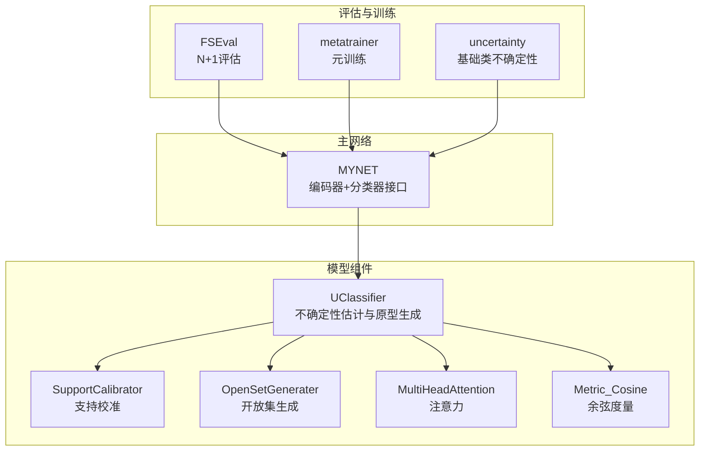
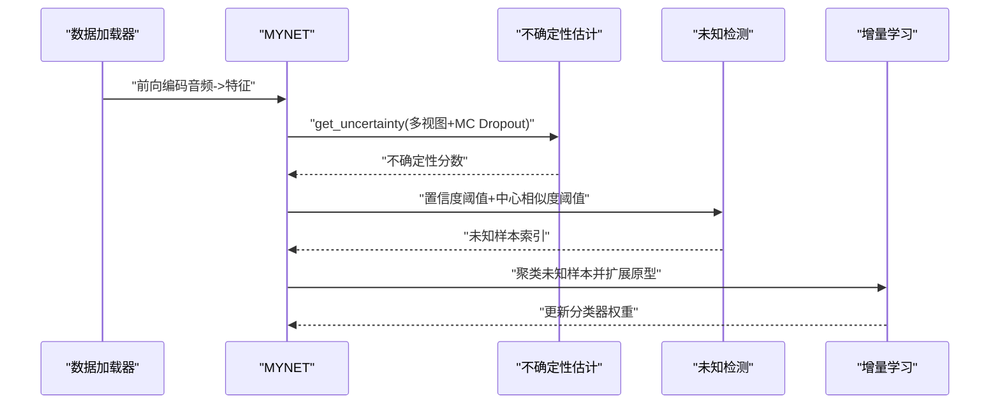
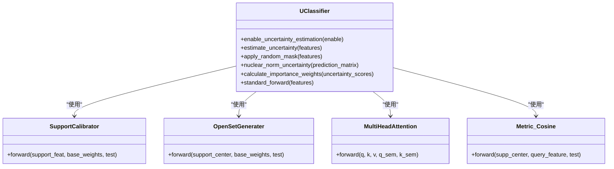
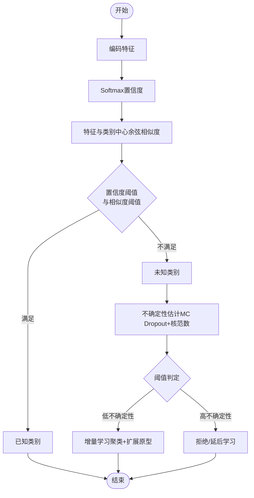
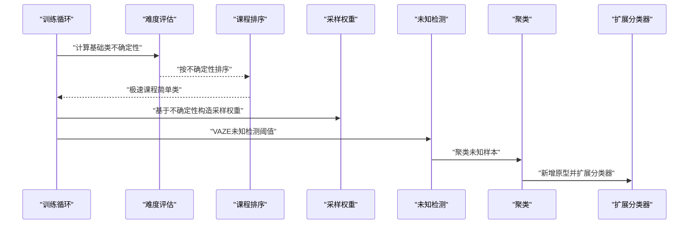
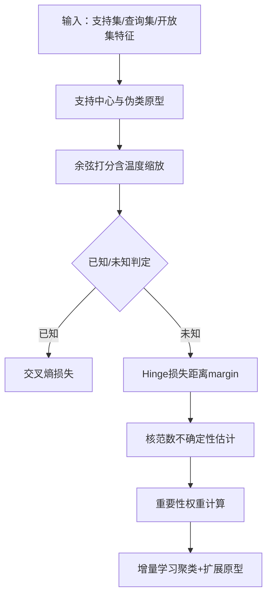
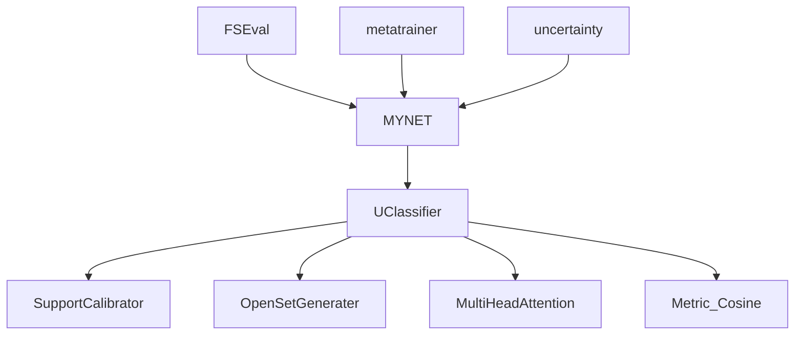

# 不确定性分类器

<cite>
**本文引用的文件**
- [models/UClassifier.py](file://models/UClassifier.py)
- [models/uncertainty.py](file://models/uncertainty.py)
- [network.py](file://network.py)
- [models/FSEval.py](file://models/FSEval.py)
- [models/metatrainer.py](file://models/metatrainer.py)
- [configs/default.yml](file://configs/default.yml)
- [test_uncertainty.py](file://test_uncertainty.py)
- [models/baselines/osr_methods/__init__.py](file://models/baselines/osr_methods/__init__.py)
- [models/baselines/cil_methods/__init__.py](file://models/baselines/cil_methods/__init__.py)
</cite>

## 目录
1. [简介](#简介)
2. [项目结构](#项目结构)
3. [核心组件](#核心组件)
4. [架构总览](#架构总览)
5. [详细组件分析](#详细组件分析)
6. [依赖分析](#依赖分析)
7. [性能考虑](#性能考虑)
8. [故障排查指南](#故障排查指南)
9. [结论](#结论)
10. [附录](#附录)

## 简介
本文件面向VAZE项目的不确定性分类器，系统阐述UClassifier类的设计原理与实现机制，覆盖以下主题：
- 开放集识别的理论基础与算法实现
- 不确定性度量方法：置信度计算、阈值设定策略、未知类别检测机制
- 如何利用不确定性分数区分已知与未知类别
- 在增量学习场景下的应用与实践
- 数学模型与算法流程
- 实际代码示例与使用场景说明

VAZE采用“闭集分类器 + 开放集决策规则”的思路：先用高质量的闭集分类器进行训练，再通过置信度与特征中心相似度阈值进行未知样本检测，并将检测到的未知样本聚类后增量加入原型，从而提升系统鲁棒性与泛化能力。

## 项目结构
围绕不确定性分类器的关键文件与职责如下：
- models/UClassifier.py：定义UClassifier及其子模块（支持校准、开放集生成、注意力与余弦度量等），新增MC Dropout不确定性估计与重要性权重缓存
- models/uncertainty.py：提供基础类不确定性分数批量计算工具
- network.py：MYNET主网络，包含音频特征提取、编码器、分类器接口与不确定性计算入口
- models/FSEval.py：开放集评估流程（N+1任务），输出AUROC等指标
- models/metatrainer.py：元训练流程，驱动openmeta模式下的原型与损失计算
- configs/default.yml：训练与网络配置（温度、方式、批次等）
- test_uncertainty.py：不确定性课程顺序、困难感知采样与增量评估流程
- models/baselines/osr_methods/__init__.py 与 models/baselines/cil_methods/__init__.py：开放集与类增量学习基线注册

**图表来源**
- [models/UClassifier.py:7-134](file://models/UClassifier.py#L7-L134)
- [network.py:18-36](file://network.py#L18-L36)
- [models/FSEval.py:17-42](file://models/FSEval.py#L17-L42)
- [models/metatrainer.py:17-84](file://models/metatrainer.py#L17-L84)
- [models/uncertainty.py:5-55](file://models/uncertainty.py#L5-L55)

**章节来源**
- [models/UClassifier.py:7-134](file://models/UClassifier.py#L7-L134)
- [network.py:18-36](file://network.py#L18-L36)
- [models/FSEval.py:17-42](file://models/FSEval.py#L17-L42)
- [models/metatrainer.py:17-84](file://models/metatrainer.py#L17-L84)
- [models/uncertainty.py:5-55](file://models/uncertainty.py#L5-L55)

## 核心组件
- UClassifier（不确定性估计与原型生成）
  - 支持校准模块：SupportCalibrator，融合视觉与语义特征，生成支持集中心
  - 开放集生成模块：OpenSetGenerater，基于注意力与语义门控生成伪类原型
  - 度量模块：Metric_Cosine，余弦相似度打分并乘以温度参数
  - 不确定性估计：MC Dropout + 掩码增强 + 核范数，输出不确定性分数
  - 重要性权重缓存：用于增量学习中的加权更新
- MYNET（主网络）
  - 提供音频特征提取、编码器、分类器接口与不确定性入口
  - get_uncertainty：基于MC Dropout与掩码的不确定性计算
- 不确定性工具
  - get_base_class_uncertainty：批量计算基础类不确定性，用于课程排序与采样权重

**章节来源**
- [models/UClassifier.py:7-134](file://models/UClassifier.py#L7-L134)
- [network.py:50-101](file://network.py#L50-L101)
- [models/uncertainty.py:5-55](file://models/uncertainty.py#L5-L55)

## 架构总览
VAZE的不确定性分类器由“不确定性估计 + 开放集决策 + 增量学习”三部分构成：
- 不确定性估计：在推理时临时开启Dropout，多次采样并结合随机掩码，计算预测矩阵的核范数作为不确定性分数
- 开放集决策：基于置信度阈值与特征中心相似度阈值判断未知样本
- 增量学习：将检测到的未知样本聚类，新增原型并扩展分类器权重

**图表来源**
- [network.py:50-101](file://network.py#L50-L101)
- [models/UClassifier.py:42-76](file://models/UClassifier.py#L42-L76)
- [test_uncertainty.py:169-239](file://test_uncertainty.py#L169-L239)

**章节来源**
- [network.py:50-101](file://network.py#L50-L101)
- [models/UClassifier.py:42-76](file://models/UClassifier.py#L42-L76)
- [test_uncertainty.py:169-239](file://test_uncertainty.py#L169-L239)

## 详细组件分析

### UClassifier类设计与实现
- 支持校准（SupportCalibrator）
  - 输入支持集特征与语义信息，通过多头注意力融合视觉与语义，生成支持中心
  - 支持多种负样本生成策略（semang/attg/att），并可选择是否进行语义校准
- 开放集生成（OpenSetGenerater）
  - 基于支持中心与基础权重，通过注意力生成伪类原型
  - 支持聚合策略（avg/mlp），并可对未知样本进行动态标签分配
- 度量（Metric_Cosine）
  - 余弦相似度打分，乘以可学习温度参数，控制分布锐利程度
- 不确定性估计（MC Dropout + 掩码增强 + 核范数）
  - 通过多次MC Dropout采样与随机掩码，构建预测矩阵
  - 使用奇异值分解的核范数作为不确定性度量
- 重要性权重缓存
  - 基于不确定性分数计算权重，低不确定性样本赋予更高权重，用于增量学习加权更新

**图表来源**
- [models/UClassifier.py:7-134](file://models/UClassifier.py#L7-L134)

**章节来源**
- [models/UClassifier.py:7-134](file://models/UClassifier.py#L7-L134)

### 不确定性度量与阈值策略
- 置信度计算
  - 使用MYNET的分类器输出，经softmax得到类别置信度
- 阈值设定策略
  - 基于置信度阈值与特征中心相似度阈值二选一判定未知样本
  - 可在VAZE脚本中调整prob_thresh与cos_thresh
- 未知类别检测机制
  - 若max softmax < prob_thresh 或 max cosine < cos_thresh，则判定为未知
- 不确定性分数
  - 通过MC Dropout与掩码增强，计算预测矩阵核范数作为不确定性度量
  - 低不确定性样本优先学习，高不确定性样本可延后或拒绝

**图表来源**
- [network.py:134-170](file://network.py#L134-L170)
- [models/UClassifier.py:42-76](file://models/UClassifier.py#L42-L76)

**章节来源**
- [network.py:134-170](file://network.py#L134-L170)
- [models/UClassifier.py:42-76](file://models/UClassifier.py#L42-L76)

### 增量学习场景下的应用
- 课程顺序与困难感知
  - 零样本初始排序：基于特征紧凑度排序
  - 极速课程阶段：先训练最简单类别
  - 困难感知全量训练：基于不确定性分数计算采样权重，提高困难类学习频率
- 增量原型扩展
  - 检测未知样本，聚类形成新原型
  - 扩展分类器权重，支持新增类别

**图表来源**
- [test_uncertainty.py:604-706](file://test_uncertainty.py#L604-L706)
- [test_uncertainty.py:169-239](file://test_uncertainty.py#L169-L239)

**章节来源**
- [test_uncertainty.py:604-706](file://test_uncertainty.py#L604-L706)
- [test_uncertainty.py:169-239](file://test_uncertainty.py#L169-L239)

### 数学模型与算法流程
- 不确定性度量（核范数）
  - 对预测矩阵P∈R^{K×A×N}，逐样本计算奇异值之和作为不确定性分数
- 置信度与相似度阈值
  - 置信度：max softmax
  - 相似度：max cosine similarity
- 动态标签分配
  - 未知样本的正类分数最高者作为硬正样本，对应负原型索引用于动态标签

**图表来源**
- [models/UClassifier.py:153-202](file://models/UClassifier.py#L153-L202)
- [models/UClassifier.py:97-112](file://models/UClassifier.py#L97-L112)

**章节来源**
- [models/UClassifier.py:153-202](file://models/UClassifier.py#L153-L202)
- [models/UClassifier.py:97-112](file://models/UClassifier.py#L97-L112)

## 依赖分析
- UClassifier依赖SupportCalibrator、OpenSetGenerater、MultiHeadAttention与Metric_Cosine
- MYNET依赖UClassifier进行openmeta模式的原型与概率计算
- FSEval提供N+1评估流程，输出AUROC等指标
- metatrainer驱动元训练，计算损失并更新模型
- uncertainty工具用于基础类不确定性分数批量计算

**图表来源**
- [models/UClassifier.py:7-134](file://models/UClassifier.py#L7-L134)
- [network.py:18-36](file://network.py#L18-L36)
- [models/FSEval.py:17-42](file://models/FSEval.py#L17-L42)
- [models/metatrainer.py:17-84](file://models/metatrainer.py#L17-L84)
- [models/uncertainty.py:5-55](file://models/uncertainty.py#L5-L55)

**章节来源**
- [models/UClassifier.py:7-134](file://models/UClassifier.py#L7-L134)
- [network.py:18-36](file://network.py#L18-L36)
- [models/FSEval.py:17-42](file://models/FSEval.py#L17-L42)
- [models/metatrainer.py:17-84](file://models/metatrainer.py#L17-L84)
- [models/uncertainty.py:5-55](file://models/uncertainty.py#L5-L55)

## 性能考虑
- 计算复杂度
  - 不确定性估计涉及多次前向与SVD，建议合理设置MC采样次数与掩码比例
  - 注意力与余弦度量的矩阵运算规模与温度参数影响数值稳定性
- 内存占用
  - 预测矩阵P的存储与SVD计算需关注显存
  - 建议在批量数据上进行不确定性估计，避免一次性加载过多样本
- 训练稳定性
  - 温度参数与margin需结合具体数据集调优
  - 增量学习中聚类数量与中心扩展需谨慎，防止灾难性遗忘

## 故障排查指南
- 不确定性估计异常
  - 确认推理模式下Dropout已被临时开启
  - 检查掩码比例与采样次数是否合理
- 未知检测阈值不当
  - 调整prob_thresh与cos_thresh，观察AUROC与精度变化
- 增量学习效果不佳
  - 检查聚类数量与聚类质量，必要时增加聚类迭代或调整距离度量
  - 关注分类器权重扩展是否正确

**章节来源**
- [network.py:50-101](file://network.py#L50-L101)
- [models/UClassifier.py:42-76](file://models/UClassifier.py#L42-L76)
- [test_uncertainty.py:169-239](file://test_uncertainty.py#L169-L239)

## 结论
VAZE的不确定性分类器通过MC Dropout与核范数实现稳健的不确定性估计，结合置信度与相似度阈值完成开放集检测，并在增量学习中以重要性权重指导学习顺序与样本选择。该框架在保证已知类别性能的同时，有效提升了未知类别的检测与学习能力，具备良好的鲁棒性与泛化潜力。

## 附录
- 使用场景
  - 基础训练阶段：使用MYNET进行标准分类训练
  - 开放集评估阶段：使用FSEval进行N+1评估，输出AUROC
  - 不确定性课程阶段：基于不确定性分数进行课程排序与加权采样
  - 增量学习阶段：检测未知样本并聚类扩展原型

**章节来源**
- [models/FSEval.py:17-42](file://models/FSEval.py#L17-L42)
- [test_uncertainty.py:604-706](file://test_uncertainty.py#L604-L706)
- [models/metatrainer.py:17-84](file://models/metatrainer.py#L17-L84)