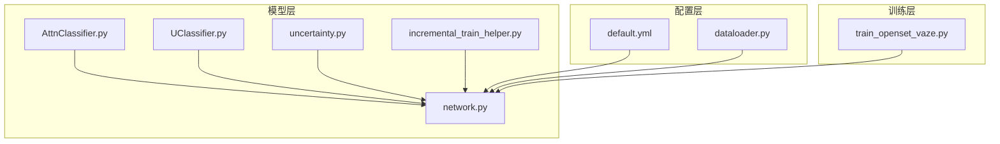
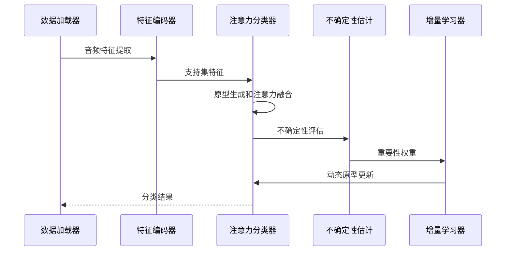
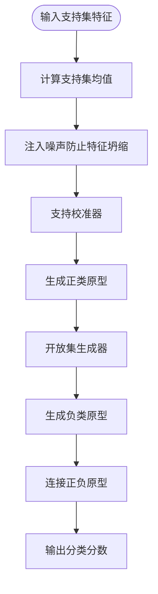
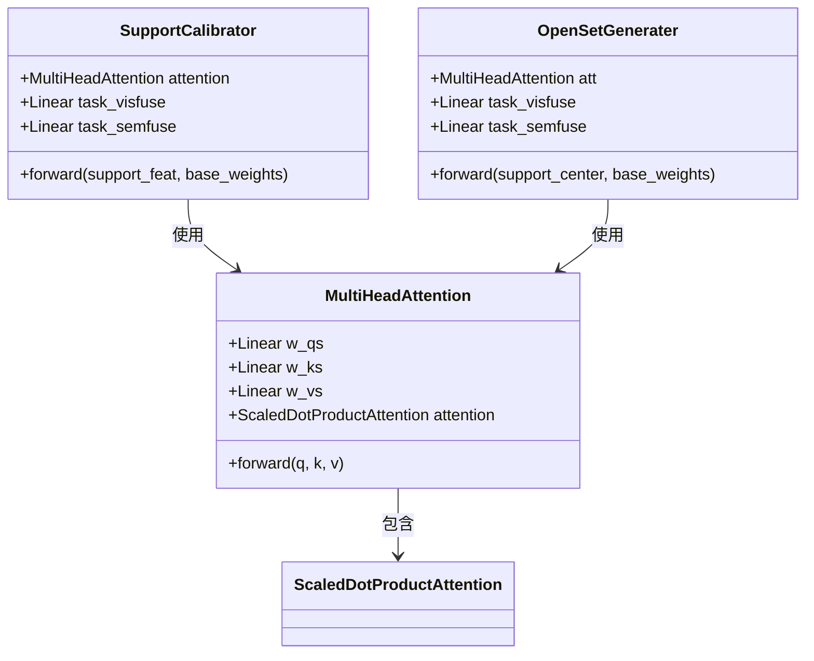
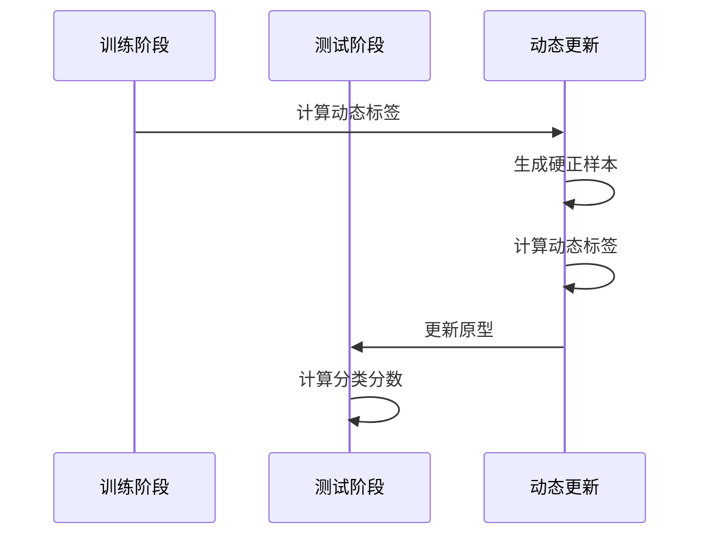
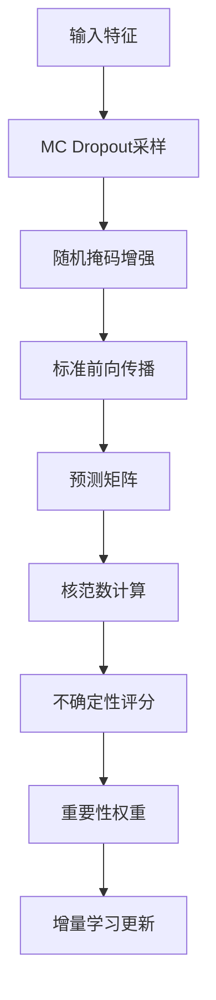
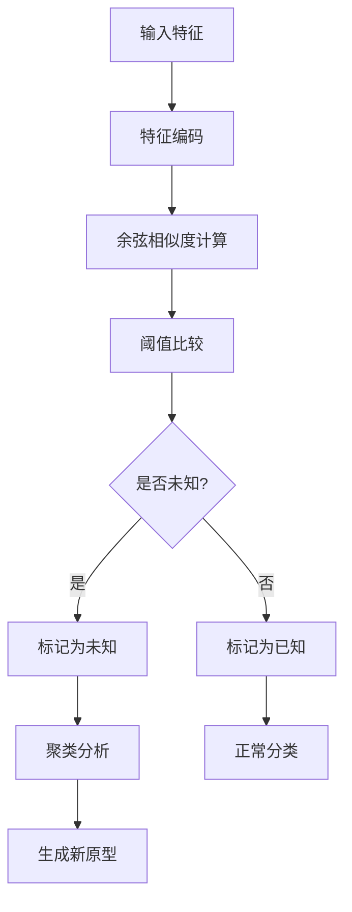
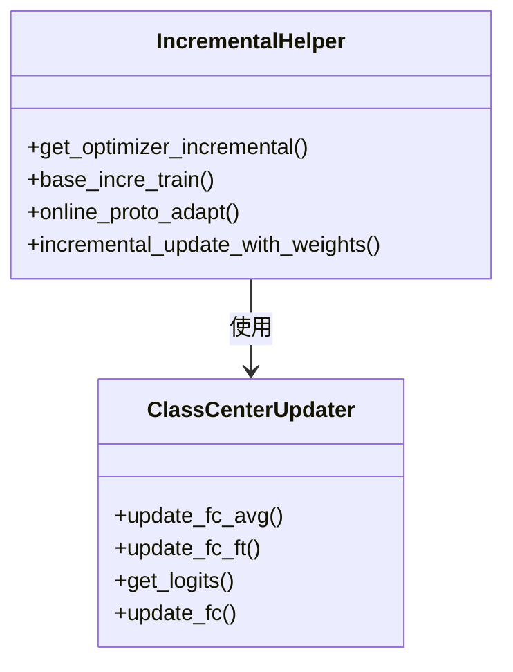
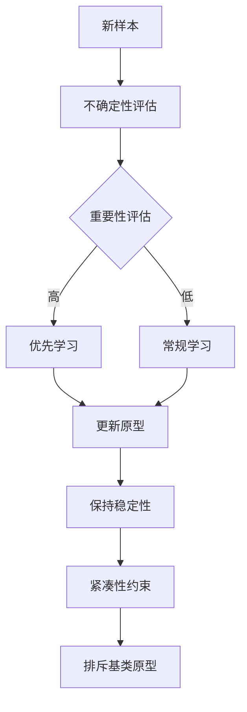
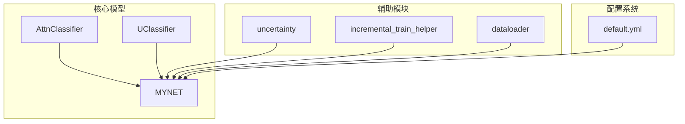

# 原型学习系统

<cite>
**本文档引用的文件**
- [AttnClassifier.py](file://models/AttnClassifier.py)
- [UClassifier.py](file://models/UClassifier.py)
- [network.py](file://network.py)
- [train_openset_vaze.py](file://train_openset_vaze.py)
- [default.yml](file://configs/default.yml)
- [dataloader.py](file://data/dataloader.py)
- [uncertainty.py](file://models/uncertainty.py)
- [incremental_train_helper.py](file://models/incremental_train_helper.py)
</cite>

## 目录
1. [简介](#简介)
2. [项目结构](#项目结构)
3. [核心组件](#核心组件)
4. [架构概览](#架构概览)
5. [详细组件分析](#详细组件分析)
6. [依赖关系分析](#依赖关系分析)
7. [性能考虑](#性能考虑)
8. [故障排除指南](#故障排除指南)
9. [结论](#结论)

## 简介

VAZE项目是一个基于原型学习的少样本分类系统，专注于开放集识别和增量学习场景。该系统通过注意力机制实现特征表示的改进，结合原型生成和动态更新策略，在保持已知类别性能的同时有效检测未知类别。

系统的核心创新包括：
- **注意力分类器（AttnClassifier）**：通过多头注意力机制实现原型生成和特征融合
- **不确定分类器（UClassifier）**：集成MC Dropout和核范数不确定性估计
- **增量学习辅助工具**：提供类中心更新和原型维护策略
- **开放集识别机制**：基于阈值的未知类别检测和原型扩展

## 项目结构

**图表来源**
- [network.py:18-34](file://network.py#L18-L34)
- [AttnClassifier.py:38-45](file://models/AttnClassifier.py#L38-L45)
- [UClassifier.py:7-16](file://models/UClassifier.py#L7-L16)

**章节来源**
- [network.py:18-34](file://network.py#L18-L34)
- [default.yml:1-88](file://configs/default.yml#L1-L88)

## 核心组件

### 注意力分类器（AttnClassifier）

注意力分类器是系统的核心组件，负责：
- **原型生成**：通过支持集特征生成正类原型
- **负原型生成**：利用开放集生成负原型（伪类）
- **注意力融合**：结合视觉和语义特征进行注意力融合
- **动态更新**：支持增量学习中的原型动态调整

### 不确定分类器（UClassifier）

UClassifier扩展了传统分类器，增加了：
- **MC Dropout不确定性估计**：通过蒙特卡洛采样评估模型不确定性
- **核范数不确定性度量**：基于奇异值分解计算预测矩阵的核范数
- **重要性权重缓存**：为增量学习提供样本重要性评估
- **不确定性感知的增量更新**：根据不确定性调整学习权重

### 增量学习辅助工具

提供完整的增量学习支持：
- **类中心更新**：动态调整分类器权重
- **原型维护策略**：保持原型稳定性和有效性
- **重要性加权学习**：基于不确定性的重要样本优先学习
- **在线原型适应**：实时适应新出现的类别

**章节来源**
- [AttnClassifier.py:38-101](file://models/AttnClassifier.py#L38-L101)
- [UClassifier.py:7-405](file://models/UClassifier.py#L7-L405)
- [incremental_train_helper.py:1-156](file://models/incremental_train_helper.py#L1-156)

## 架构概览

**图表来源**
- [network.py:102-151](file://network.py#L102-L151)
- [AttnClassifier.py:47-93](file://models/AttnClassifier.py#L47-L93)
- [UClassifier.py:42-76](file://models/UClassifier.py#L42-L76)

系统采用分层架构设计：
1. **特征提取层**：ResNet18编码器提取音频特征
2. **注意力融合层**：多头注意力机制融合视觉和语义信息
3. **原型生成层**：生成正类和负类原型
4. **不确定性估计层**：评估样本不确定性
5. **增量学习层**：动态更新原型和分类器

## 详细组件分析

### 注意力分类器设计原理

#### 原型生成机制

注意力分类器通过以下流程生成原型：

**图表来源**
- [AttnClassifier.py:53-82](file://models/AttnClassifier.py#L53-L82)

原型生成的关键特性：
- **噪声注入**：防止Center Loss导致的特征坍缩
- **注意力融合**：结合视觉和语义特征
- **动态调整**：支持增量学习中的原型更新

#### 注意力融合策略

系统实现了多种注意力融合策略：

**图表来源**
- [AttnClassifier.py:121-185](file://models/AttnClassifier.py#L121-L185)
- [AttnClassifier.py:188-271](file://models/AttnClassifier.py#L188-L271)
- [AttnClassifier.py:274-326](file://models/AttnClassifier.py#L274-L326)

注意力融合的具体实现：
- **多头注意力**：并行处理多个注意力头
- **门控机制**：通过sigmoid门控控制视觉和语义特征的融合比例
- **残差连接**：保持特征信息的完整性

#### 动态更新算法

系统支持动态原型更新：

**图表来源**
- [network.py:163-202](file://network.py#L163-L202)

动态更新的关键步骤：
1. **硬正样本识别**：从开放集特征中找到最相似的已知类别
2. **动态标签生成**：为未知样本生成对应的负原型标签
3. **联合损失计算**：同时优化已知和未知样本的分类效果

**章节来源**
- [AttnClassifier.py:121-368](file://models/AttnClassifier.py#L121-L368)
- [network.py:153-202](file://network.py#L153-L202)

### 不确定分类器工作原理

#### 开放集识别实现

UClassifier集成了多种不确定性估计技术：

**图表来源**
- [UClassifier.py:42-112](file://models/UClassifier.py#L42-L112)

不确定性估计的核心机制：
- **MC Dropout采样**：通过多次前向传播评估模型不确定性
- **掩码增强**：随机掩码提高模型鲁棒性
- **核范数度量**：基于奇异值分解计算预测变化程度

#### 未知类别检测机制

系统通过以下策略检测未知类别：

**图表来源**
- [train_openset_vaze.py:134-170](file://train_openset_vaze.py#L134-L170)

**章节来源**
- [UClassifier.py:7-405](file://models/UClassifier.py#L7-L405)
- [uncertainty.py:5-55](file://models/uncertainty.py#L5-L55)

### 增量学习辅助工具

#### 类中心更新机制

系统提供了完整的类中心更新策略：

**图表来源**
- [incremental_train_helper.py:11-25](file://models/incremental_train_helper.py#L11-L25)
- [network.py:405-460](file://network.py#L405-L460)

类中心更新的关键特性：
- **平均嵌入更新**：基于支持集特征计算新的类中心
- **微调学习**：对新增类别进行专门的微调训练
- **温度缩放**：通过温度参数控制分类决策的锐利程度

#### 原型维护策略

系统实现了多种原型维护策略：

**图表来源**
- [UClassifier.py:114-121](file://models/UClassifier.py#L114-L121)
- [train_unopenset.py:343-370](file://train_unopenset.py#L343-L370)

**章节来源**
- [incremental_train_helper.py:28-156](file://models/incremental_train_helper.py#L28-L156)
- [network.py:405-460](file://network.py#L405-L460)

## 依赖关系分析

**图表来源**
- [network.py:18-34](file://network.py#L18-L34)
- [AttnClassifier.py:38-45](file://models/AttnClassifier.py#L38-L45)
- [UClassifier.py:7-16](file://models/UClassifier.py#L7-L16)

系统的主要依赖关系：
- **MYNET**：作为主框架，集成所有子模块
- **AttnClassifier**：提供核心的原型学习能力
- **UClassifier**：扩展不确定性估计功能
- **数据加载器**：提供训练和测试数据支持
- **配置系统**：管理超参数和训练设置

**章节来源**
- [network.py:18-34](file://network.py#L18-L34)
- [dataloader.py:1-200](file://data/dataloader.py#L1-L200)

## 性能考虑

### 计算复杂度分析

系统的关键性能指标：

1. **原型生成复杂度**：O(B × N × D)，其中B为批次大小，N为类别数量，D为特征维度
2. **注意力计算复杂度**：O(L² × D)，其中L为序列长度，D为特征维度
3. **不确定性估计复杂度**：O(K × A × B × C)，其中K为MC采样次数，A为掩码次数，B为批次大小，C为类别数量

### 内存优化策略

- **特征归一化**：减少内存占用和数值不稳定
- **渐进式原型扩展**：避免一次性加载大量原型
- **混合精度训练**：降低显存需求

### 并行化优化

- **多头注意力并行**：充分利用GPU并行计算能力
- **批量处理**：最大化硬件利用率
- **异步数据加载**：减少I/O等待时间

## 故障排除指南

### 常见问题及解决方案

#### 原型坍缩问题
**症状**：所有原型收敛到相同点
**原因**：Center Loss导致的特征压缩
**解决方案**：
- 注入噪声防止特征坍缩
- 调整Center Loss权重
- 使用注意力机制增强特征多样性

#### 不确定性估计异常
**症状**：不确定性评分异常高或低
**原因**：MC Dropout参数设置不当
**解决方案**：
- 调整MC采样次数和掩码比率
- 检查Dropout层的启用状态
- 验证核范数计算的数值稳定性

#### 增量学习性能下降
**症状**：已知类别性能显著下降
**原因**：新类别学习影响旧知识
**解决方案**：
- 实施知识蒸馏保护机制
- 调整学习率和权重衰减
- 使用正则化技术防止灾难性遗忘

**章节来源**
- [AttnClassifier.py:56-65](file://models/AttnClassifier.py#L56-L65)
- [UClassifier.py:36-40](file://models/UClassifier.py#L36-L40)
- [train_unopenset.py:343-370](file://train_unopenset.py#L343-L370)

## 结论

VAZE原型学习系统通过创新的注意力机制和不确定性估计，实现了在开放集识别和增量学习场景下的高性能表现。系统的主要优势包括：

1. **强大的特征表示**：多头注意力机制有效融合视觉和语义信息
2. **稳健的原型生成**：通过噪声注入和注意力融合防止特征坍缩
3. **智能的不确定性估计**：基于MC Dropout和核范数的可靠不确定性度量
4. **灵活的增量学习**：支持动态原型更新和重要性加权学习

系统的不足之处主要体现在：
- 计算复杂度较高，需要优化的硬件资源
- 不确定性估计的参数调节较为复杂
- 增量学习的长期稳定性仍需进一步验证

未来的研究方向包括：
- 实现更高效的注意力机制
- 优化不确定性估计的计算效率
- 探索更稳定的增量学习策略
- 扩展到更大规模的开放集识别任务