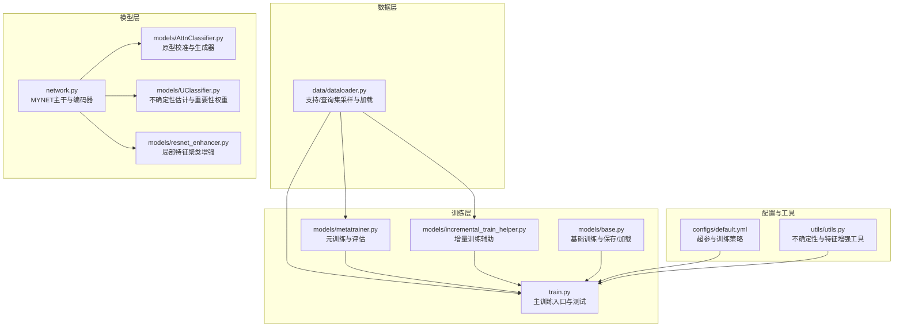
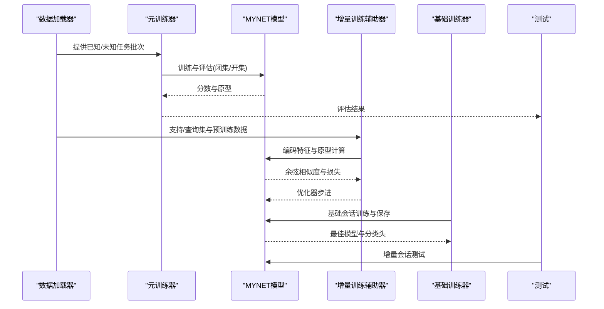
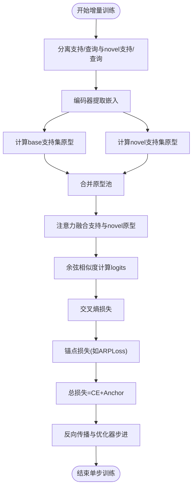
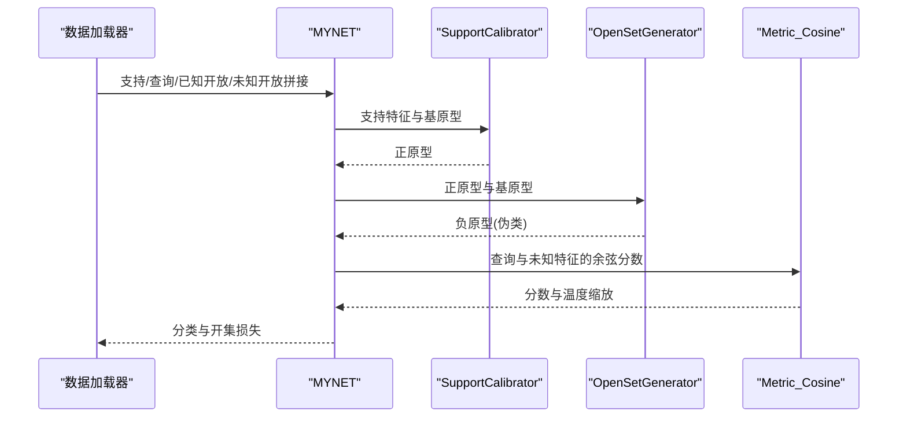
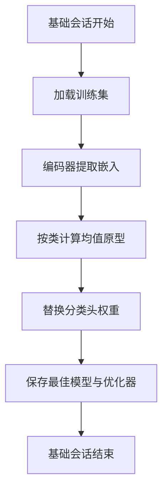
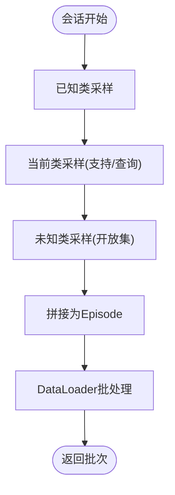
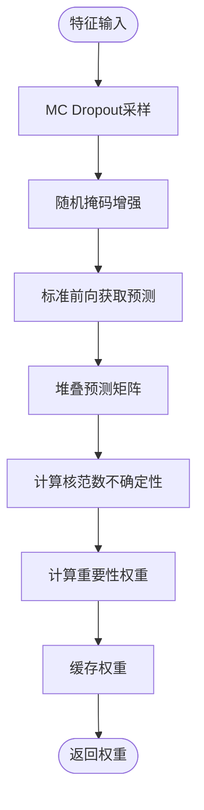
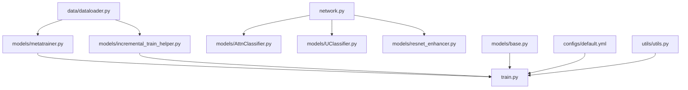

# 增量学习辅助工具

<cite>
**本文档引用的文件**
- [models/incremental_train_helper.py](file://models/incremental_train_helper.py)
- [models/metatrainer.py](file://models/metatrainer.py)
- [models/base.py](file://models/base.py)
- [data/dataloader.py](file://data/dataloader.py)
- [train.py](file://train.py)
- [network.py](file://network.py)
- [models/UClassifier.py](file://models/UClassifier.py)
- [models/AttnClassifier.py](file://models/AttnClassifier.py)
- [models/resnet_enhancer.py](file://models/resnet_enhancer.py)
- [configs/default.yml](file://configs/default.yml)
- [utils/utils.py](file://utils/utils.py)
</cite>

## 目录
1. [简介](#简介)
2. [项目结构](#项目结构)
3. [核心组件](#核心组件)
4. [架构总览](#架构总览)
5. [详细组件分析](#详细组件分析)
6. [依赖分析](#依赖分析)
7. [性能考虑](#性能考虑)
8. [故障排除指南](#故障排除指南)
9. [结论](#结论)
10. [附录](#附录)

## 简介
本文件面向VAZE项目的增量学习辅助工具，系统阐述以下内容：
- 类中心更新机制：原型维护策略、动态类中心计算方法
- 增量训练数据流管理：支持集与查询集的动态更新、批次处理策略
- 类中心漂移检测与校正机制：新类引入与旧类遗忘的平衡
- 在线学习策略与记忆保持机制
- 不重新训练整个模型即可适应新类别的方法与使用路径

本指南兼顾工程落地与可读性，既提供代码级分析，也给出流程图与实践建议。

## 项目结构
项目采用分层组织，围绕“数据加载-模型-训练器-增量工具”展开：
- 数据层：负责构造支持集/查询集、已知/未知类划分、课程式采样
- 模型层：音频特征提取、原型计算、注意力与度量模块
- 训练层：元训练、增量训练、基础训练与测试
- 工具层：增量训练辅助、不确定性估计、特征增强

**图表来源**
- [data/dataloader.py:13-132](file://data/dataloader.py#L13-L132)
- [models/metatrainer.py:17-84](file://models/metatrainer.py#L17-L84)
- [models/incremental_train_helper.py:11-25](file://models/incremental_train_helper.py#L11-L25)
- [models/base.py:27-110](file://models/base.py#L27-L110)
- [train.py:799-800](file://train.py#L799-L800)
- [configs/default.yml:1-88](file://configs/default.yml#L1-L88)
- [utils/utils.py:1-200](file://utils/utils.py#L1-L200)

**章节来源**
- [data/dataloader.py:13-132](file://data/dataloader.py#L13-L132)
- [models/metatrainer.py:17-84](file://models/metatrainer.py#L17-L84)
- [models/incremental_train_helper.py:11-25](file://models/incremental_train_helper.py#L11-L25)
- [models/base.py:27-110](file://models/base.py#L27-L110)
- [train.py:799-800](file://train.py#L799-L800)
- [configs/default.yml:1-88](file://configs/default.yml#L1-L88)
- [utils/utils.py:1-200](file://utils/utils.py#L1-L200)

## 核心组件
- 增量训练辅助器：封装增量阶段的优化器、学习率调度、原型计算与损失组合
- 元训练器：支持已知/未知任务的联合训练，计算闭集准确率与开集AUROC
- 基础训练器：负责基础会话的训练、保存、替换分类头原型
- 数据加载器：支持支持集/查询集采样、已知/未知类划分、课程式采样
- 主训练入口：整合数据、模型、训练器，执行增量会话与测试

**章节来源**
- [models/incremental_train_helper.py:11-156](file://models/incremental_train_helper.py#L11-L156)
- [models/metatrainer.py:17-178](file://models/metatrainer.py#L17-L178)
- [models/base.py:111-175](file://models/base.py#L111-L175)
- [data/dataloader.py:134-230](file://data/dataloader.py#L134-L230)
- [train.py:799-800](file://train.py#L799-L800)

## 架构总览
VAZE的增量学习由“元训练-增量训练-测试”三段式构成，数据与模型通过统一接口对接，支持在不重新训练整个模型的前提下，逐步引入新类别并维持旧类性能。

**图表来源**
- [models/metatrainer.py:87-178](file://models/metatrainer.py#L87-L178)
- [models/incremental_train_helper.py:28-111](file://models/incremental_train_helper.py#L28-L111)
- [models/base.py:250-254](file://models/base.py#L250-L254)
- [train.py:763-780](file://train.py#L763-L780)

## 详细组件分析

### 增量训练辅助器（类中心更新与动态原型）
- 优化器与学习率：针对编码器、注意力模块、原型模块与损失分别设置学习率，支持Step/Milestone调度
- 增量训练流程：
  - 将支持集与查询集拼接，经编码器得到嵌入
  - 支持集按shot-way重组，计算原型（均值）
  - novel支持集与base支持集合并，统一作为原型池
  - 通过注意力融合支持集与novel原型，得到最终原型
  - 余弦相似度计算查询与原型的logits，交叉熵损失
  - 与锚点损失（如ARPLoss）相加，反向传播更新

**图表来源**
- [models/incremental_train_helper.py:28-111](file://models/incremental_train_helper.py#L28-L111)

**章节来源**
- [models/incremental_train_helper.py:11-156](file://models/incremental_train_helper.py#L11-L156)

### 元训练器（支持集/查询集与开集联合训练）
- 数据组织：支持集、查询集、已知开放集、未知开放集四路拼接，标签统一处理
- 原型计算与生成：
  - 正原型：支持集经校准器生成
  - 负原型（伪类）：基于正原型与已知基原型，经生成器得到
- 动态标签分配：对未知样本，依据其“硬正例”动态分配伪类标签
- 损失组合：分类损失、开集Hinge损失、伪类一致性损失

**图表来源**
- [models/metatrainer.py:87-178](file://models/metatrainer.py#L87-L178)
- [models/AttnClassifier.py:38-101](file://models/AttnClassifier.py#L38-L101)

**章节来源**
- [models/metatrainer.py:17-178](file://models/metatrainer.py#L17-L178)
- [models/AttnClassifier.py:38-101](file://models/AttnClassifier.py#L38-L101)

### 基础训练器（原型替换与保存）
- 替换分类头：在基础会话结束后，用支持集的平均嵌入替换分类头权重
- 保存与加载：保存最佳模型与优化器状态，便于增量会话继续

**图表来源**
- [models/base.py:111-175](file://models/base.py#L111-L175)

**章节来源**
- [models/base.py:111-175](file://models/base.py#L111-L175)

### 数据加载器（支持集/查询集与课程式采样）
- 支持集/查询集采样：支持已知类与增量类的组合采样
- 已知/未知划分：通过类索引控制，支持课程式采样
- 课程式数据集：将已知、当前、未知三部分组合，形成三段式Episode

**图表来源**
- [data/dataloader.py:263-351](file://data/dataloader.py#L263-L351)
- [data/dataloader.py:134-230](file://data/dataloader.py#L134-L230)

**章节来源**
- [data/dataloader.py:134-230](file://data/dataloader.py#L134-L230)
- [data/dataloader.py:263-351](file://data/dataloader.py#L263-L351)

### 主训练入口（会话推进与测试）
- 会话推进：每轮会话递增已标注类别数，更新测试范围
- 测试：在当前遇到的所有类别上进行增量测试，计算闭集准确率

**章节来源**
- [train.py:763-780](file://train.py#L763-L780)

### 不确定性估计与重要性权重（增量学习记忆保持）
- 不确定性估计：基于MC Dropout与掩码增强，计算核范数不确定性
- 重要性权重：根据不确定性计算权重，用于重要性加权的增量更新
- 重要性缓存：在分类器中缓存权重，供后续增量学习使用

**图表来源**
- [models/UClassifier.py:42-122](file://models/UClassifier.py#L42-L122)
- [utils/utils.py:23-60](file://utils/utils.py#L23-L60)

**章节来源**
- [models/UClassifier.py:42-122](file://models/UClassifier.py#L42-L122)
- [utils/utils.py:23-60](file://utils/utils.py#L23-L60)

### 特征增强与局部聚类（类中心稳定性）
- 局部特征聚类：对中间层特征进行KMeans聚类，结合空间权重与注意力融合
- 位置编码：增强空间感知，提升聚类中心代表性
- 残差融合：聚类特征与原特征加权融合，保持结构稳定性

**章节来源**
- [models/resnet_enhancer.py:51-172](file://models/resnet_enhancer.py#L51-L172)
- [utils/utils.py:61-131](file://utils/utils.py#L61-L131)

## 依赖分析
- 模块耦合
  - 数据加载器与训练器解耦，通过统一接口提供批次
  - 模型内部通过模式切换（encoder/openmeta/incre）适配不同阶段
  - 增量训练辅助器依赖数据加载器与损失模块
- 外部依赖
  - PyTorch优化器与调度器
  - sklearn用于聚类与评估指标
  - tqdm用于进度条

**图表来源**
- [data/dataloader.py:13-132](file://data/dataloader.py#L13-L132)
- [models/metatrainer.py:17-84](file://models/metatrainer.py#L17-L84)
- [models/incremental_train_helper.py:11-25](file://models/incremental_train_helper.py#L11-L25)
- [models/base.py:27-110](file://models/base.py#L27-L110)
- [train.py:799-800](file://train.py#L799-L800)
- [configs/default.yml:1-88](file://configs/default.yml#L1-L88)
- [utils/utils.py:1-200](file://utils/utils.py#L1-L200)

**章节来源**
- [data/dataloader.py:13-132](file://data/dataloader.py#L13-L132)
- [models/metatrainer.py:17-84](file://models/metatrainer.py#L17-L84)
- [models/incremental_train_helper.py:11-25](file://models/incremental_train_helper.py#L11-L25)
- [models/base.py:27-110](file://models/base.py#L27-L110)
- [train.py:799-800](file://train.py#L799-L800)
- [configs/default.yml:1-88](file://configs/default.yml#L1-L88)
- [utils/utils.py:1-200](file://utils/utils.py#L1-L200)

## 性能考虑
- 批次与内存
  - 支持集/查询集重组与原型计算为O(KW)级别，注意显存占用
  - 注意力融合与余弦相似度计算可利用广播，减少显存峰值
- 训练稳定性
  - 温度缩放与余弦度量有助于稳定梯度
  - 动态标签分配与负原型生成降低开集冲突
- 计算效率
  - 局部聚类采用批量KMeans，减少CPU-GPU交互
  - 重要性权重缓存避免重复计算

## 故障排除指南
- 类中心漂移
  - 症状：新增类别导致旧类准确率下降
  - 处理：在增量阶段引入负原型推离损失，限制与基原型的相似度
  - 参考路径：[train_unopenset.py:392-410](file://train_unopenset.py#L392-L410)
- 学习率不收敛
  - 症状：损失震荡或停滞
  - 处理：检查Step/Milestone调度配置，适当降低学习率
  - 参考路径：[models/incremental_train_helper.py:19-23](file://models/incremental_train_helper.py#L19-L23)
- 显存不足
  - 症状：CUDA OOM
  - 处理：减小batch size或缩短序列长度；使用注意力融合时注意内存峰值
- 不确定性估计异常
  - 症状：不确定性为常数或NaN
  - 处理：检查Dropout开关与掩码比率；确认设备一致性

**章节来源**
- [models/incremental_train_helper.py:19-23](file://models/incremental_train_helper.py#L19-L23)
- [train.py:763-780](file://train.py#L763-L780)

## 结论
VAZE的增量学习辅助工具通过“原型维护+动态类中心计算+不确定性估计+特征增强”的组合，实现了在不重新训练整个模型的前提下对新类别的自适应。支持集与查询集的动态更新、课程式采样与负原型生成，共同保障了新类引入与旧类遗忘的平衡。配合重要性权重与记忆保持机制，可在长期增量场景中维持稳定性能。

## 附录
- 使用建议
  - 增量会话前先进行基础会话，替换分类头原型
  - 在增量阶段使用注意力融合与负原型生成，抑制灾难性遗忘
  - 结合不确定性估计与重要性权重，实施重要性加权的增量更新
- 关键实现路径
  - 增量训练：[models/incremental_train_helper.py:28-111](file://models/incremental_train_helper.py#L28-L111)
  - 元训练与评估：[models/metatrainer.py:87-178](file://models/metatrainer.py#L87-L178)
  - 基础会话与原型替换：[models/base.py:111-175](file://models/base.py#L111-L175)
  - 数据加载与课程式采样：[data/dataloader.py:263-351](file://data/dataloader.py#L263-L351)
  - 不确定性估计与重要性权重：[models/UClassifier.py:42-122](file://models/UClassifier.py#L42-L122)
  - 特征增强与局部聚类：[models/resnet_enhancer.py:51-172](file://models/resnet_enhancer.py#L51-L172)