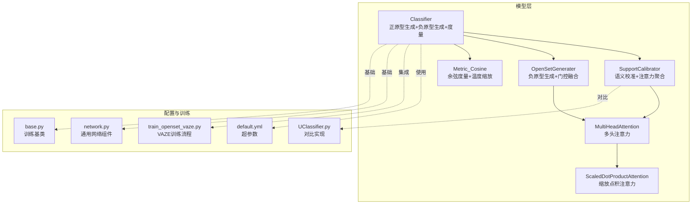
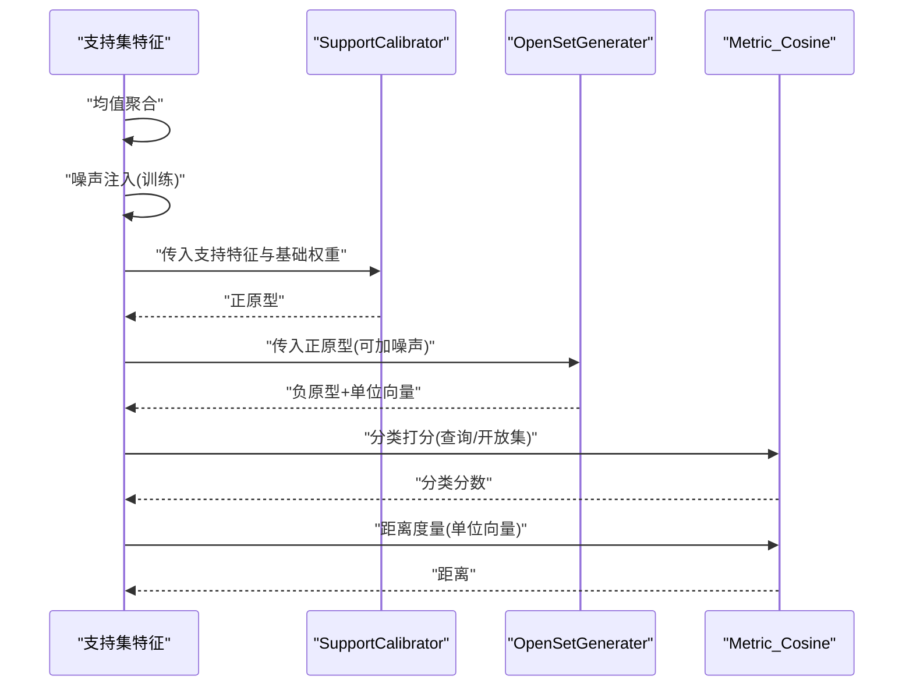
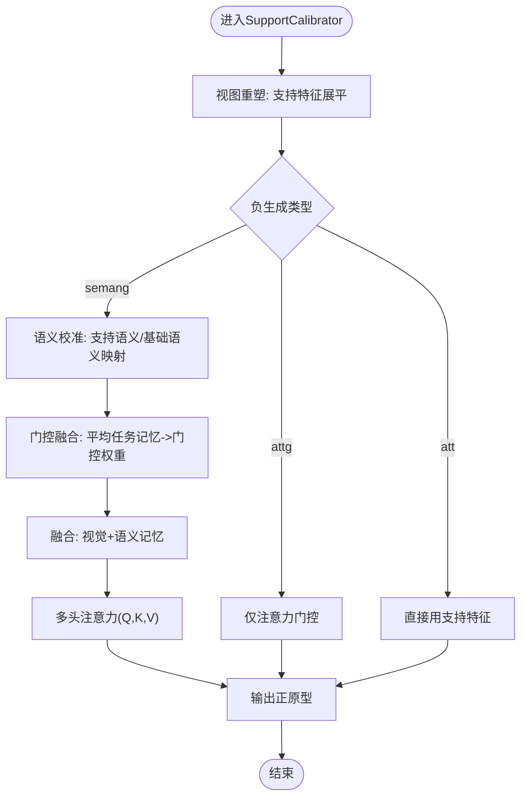
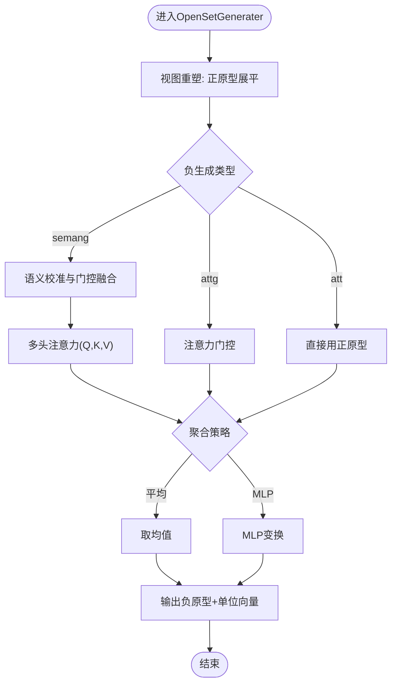
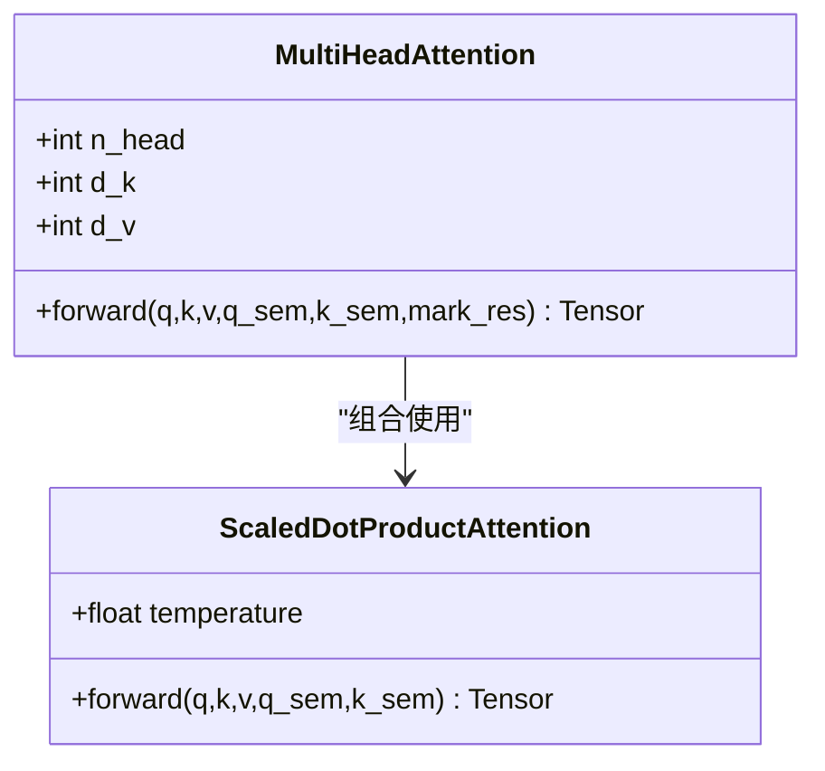
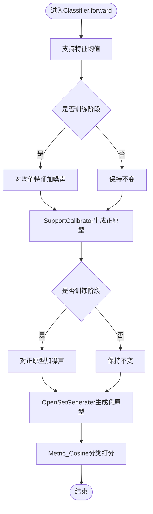
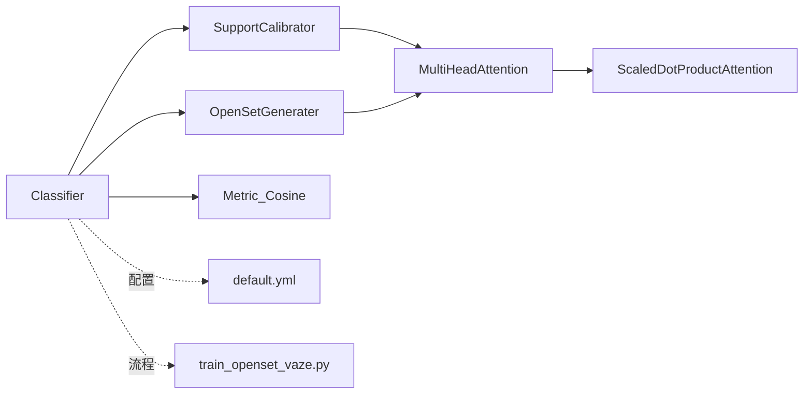

# 注意力分类器

<cite>
**本文引用的文件**
- [AttnClassifier.py](file://models/AttnClassifier.py)
- [default.yml](file://configs/default.yml)
- [train_openset_vaze.py](file://train_openset_vaze.py)
- [UClassifier.py](file://models/UClassifier.py)
- [network.py](file://network.py)
- [base.py](file://models/base.py)
</cite>

## 目录
1. [简介](#简介)
2. [项目结构](#项目结构)
3. [核心组件](#核心组件)
4. [架构总览](#架构总览)
5. [详细组件分析](#详细组件分析)
6. [依赖分析](#依赖分析)
7. [性能考量](#性能考量)
8. [故障排查指南](#故障排查指南)
9. [结论](#结论)
10. [附录](#附录)

## 简介
本文件面向VAZE项目的注意力分类器，系统性阐述Classifier类及其两大核心子模块SupportCalibrator与OpenSetGenerater的设计与实现，深入解析注意力机制（MultiHeadAttention与ScaledDotProductAttention）的数学原理与代码映射，详解原型生成流程（正原型与负原型）及噪声注入策略如何缓解特征坍缩，并给出训练与测试阶段的差异化处理策略。文档同时提供关键流程的序列图、类图与流程图，帮助读者快速理解并应用该注意力分类器。

## 项目结构
本项目围绕“支持集特征聚合—语义校准—负原型生成—度量分类”的主干流程展开，核心代码集中在模型目录中：
- models/AttnClassifier.py：定义Classifier、SupportCalibrator、OpenSetGenerater、MultiHeadAttention、ScaledDotProductAttention与Metric_Cosine等模块
- configs/default.yml：训练与评估超参数配置（如n_ways、n_shots、temperature等）
- train_openset_vaze.py：VAZE开放集检测与增量原型添加的训练脚本（与分类器配合使用）
- models/UClassifier.py：另一套相似实现（对比参考）
- network.py：通用网络组件与温度缩放等基础逻辑
- models/base.py：训练基类与数据初始化逻辑（与分类器协同）

图表来源
- [AttnClassifier.py:38-118](file://models/AttnClassifier.py#L38-L118)
- [default.yml:1-88](file://configs/default.yml#L1-L88)
- [train_openset_vaze.py:1-200](file://train_openset_vaze.py#L1-L200)
- [UClassifier.py:121-218](file://models/UClassifier.py#L121-L218)
- [network.py:420-441](file://network.py#L420-L441)
- [base.py:111-151](file://models/base.py#L111-L151)

章节来源
- [AttnClassifier.py:38-118](file://models/AttnClassifier.py#L38-L118)
- [default.yml:1-88](file://configs/default.yml#L1-L88)
- [train_openset_vaze.py:1-200](file://train_openset_vaze.py#L1-L200)

## 核心组件
- Classifier：主分类器，负责对支持集进行均值聚合，注入噪声后送入SupportCalibrator生成正原型；随后将正原型与噪声扰动后的版本送入OpenSetGenerater生成负原型，最后通过Metric_Cosine进行分类打分与距离度量。
- SupportCalibrator：基于多头注意力的语义校准模块，支持“语义+视觉”门控融合与不同负生成类型（semang/attg/att）。
- OpenSetGenerater：负原型生成器，同样支持语义+视觉门控融合，可选择平均聚合或MLP聚合。
- MultiHeadAttention：多头注意力，将Q/K/V线性投影后按头拆分，执行缩放点积注意力，再拼接与残差连接。
- ScaledDotProductAttention：缩放点积注意力，计算注意力权重并加dropout后与V相乘。
- Metric_Cosine：余弦相似度度量，支持训练/测试两种不同的矩阵转置方式，并内置可学习温度参数。

章节来源
- [AttnClassifier.py:38-118](file://models/AttnClassifier.py#L38-L118)
- [AttnClassifier.py:121-185](file://models/AttnClassifier.py#L121-L185)
- [AttnClassifier.py:188-271](file://models/AttnClassifier.py#L188-L271)
- [AttnClassifier.py:274-350](file://models/AttnClassifier.py#L274-L350)
- [AttnClassifier.py:352-368](file://models/AttnClassifier.py#L352-L368)

## 架构总览
下图展示了Classifier在一次前向中的数据流：支持集特征均值化→噪声注入→正原型生成→负原型生成→度量打分→距离度量。

图表来源
- [AttnClassifier.py:47-93](file://models/AttnClassifier.py#L47-L93)
- [AttnClassifier.py:121-185](file://models/AttnClassifier.py#L121-L185)
- [AttnClassifier.py:188-271](file://models/AttnClassifier.py#L188-L271)
- [AttnClassifier.py:352-368](file://models/AttnClassifier.py#L352-L368)

## 详细组件分析

### Classifier类
- 功能职责
  - 对支持集特征按way维求均值，作为支持特征
  - 训练阶段对支持特征与正原型分别注入噪声，防止特征坍缩
  - 通过SupportCalibrator生成正原型，通过OpenSetGenerater生成负原型
  - 使用Metric_Cosine对查询与开放集进行分类打分，并计算单位向量距离
- 关键实现要点
  - 支持特征均值：将support_feat沿shot维取均值
  - 噪声注入策略：支持特征与正原型分别加高斯噪声，系数可调
  - 正原型生成：调用SupportCalibrator，返回支持类原型
  - 负原型生成：将正原型或支持特征送入OpenSetGenerater，返回伪类原型与单位向量
  - 度量打分：Cosine相似度，训练/测试采用不同的矩阵转置策略
- 训练与测试差异
  - 训练：支持特征与正原型加噪声；OpenSetGenerater输出为负原型
  - 测试：不加噪声；Metric_Cosine采用不同的转置策略

章节来源
- [AttnClassifier.py:47-93](file://models/AttnClassifier.py#L47-L93)
- [AttnClassifier.py:352-368](file://models/AttnClassifier.py#L352-L368)

### SupportCalibrator（语义校准与正原型生成）
- 功能职责
  - 将支持特征与基础权重进行语义+视觉门控融合，再经多头注意力生成正原型
  - 支持三种负生成类型：semang（语义+视觉）、attg（仅注意力门控）、att（直接用支持特征）
- 语义校准与门控融合
  - 将支持语义与基础语义映射到统一空间，拼接后计算平均任务记忆
  - 通过task_visfuse与task_semfuse生成门控权重，分别作用于视觉与语义分支
  - 门控结果用于加权基础权重与语义，形成融合后的记忆
- 多头注意力
  - Q/K/V分别由支持特征与融合后的记忆计算
  - 按头拆分后执行缩放点积注意力，再拼接与残差连接

图表来源
- [AttnClassifier.py:121-185](file://models/AttnClassifier.py#L121-L185)

章节来源
- [AttnClassifier.py:121-185](file://models/AttnClassifier.py#L121-L185)

### OpenSetGenerater（负原型生成与聚合）
- 功能职责
  - 基于正原型与基础权重生成负原型（伪类原型）
  - 支持两种聚合策略：平均聚合与MLP聚合
  - 同样支持语义+视觉门控融合与多种负生成类型
- 聚合策略
  - 平均聚合：对每个任务的输出取均值得到负原型
  - MLP聚合：通过非线性变换提升特征表达能力
- 单位向量输出
  - 返回负原型的同时，也返回用于距离度量的单位向量

图表来源
- [AttnClassifier.py:188-271](file://models/AttnClassifier.py#L188-L271)

章节来源
- [AttnClassifier.py:188-271](file://models/AttnClassifier.py#L188-L271)

### MultiHeadAttention与ScaledDotProductAttention
- MultiHeadAttention
  - 输入：Q、K、V（可选语义Q/K）
  - 线性投影：将Q/K/V映射到多头空间
  - 拆分与拼接：按头拆分后执行注意力，再拼接与残差连接
  - 初始化：权重初始化遵循正态分布与Xavier初始化
- ScaledDotProductAttention
  - 计算注意力分数：QK^T
  - 缩放：除以sqrt(d_k)
  - 归一化：Softmax
  - 加dropout：抑制过拟合
  - 加权求和：注意力×V

图表来源
- [AttnClassifier.py:274-326](file://models/AttnClassifier.py#L274-L326)
- [AttnClassifier.py:331-349](file://models/AttnClassifier.py#L331-L349)

章节来源
- [AttnClassifier.py:274-326](file://models/AttnClassifier.py#L274-L326)
- [AttnClassifier.py:331-349](file://models/AttnClassifier.py#L331-L349)

### 原型生成流程（正原型与负原型）
- 正原型（SupportCalibrator）
  - 输入：支持集特征与基础权重
  - 过程：语义+视觉门控融合→多头注意力→输出正原型
- 负原型（OpenSetGenerater）
  - 输入：正原型（可加噪声）
  - 过程：语义+视觉门控融合→多头注意力→聚合（平均或MLP）→输出负原型与单位向量
- 数学公式（概要）
  - 语义+视觉门控融合：gate = σ(W_avg(avg_task_mem)) + 1，融合权重为gate_vis/gate_sem
  - 多头注意力：AttnHead(q,k,v) = Softmax((QK^T)/√d_k)·V
  - 聚合：Avg或MLP(·)

章节来源
- [AttnClassifier.py:121-185](file://models/AttnClassifier.py#L121-L185)
- [AttnClassifier.py:188-271](file://models/AttnClassifier.py#L188-L271)

### 噪声注入机制与特征坍缩防护
- 目标：缓解Center Loss导致的特征坍缩，提升原型多样性
- 实施策略
  - 支持特征噪声：训练时对均值后的支持特征加高斯噪声，噪声幅度与特征标准差相关
  - 正原型噪声：训练时对正原型加小幅度高斯噪声，保证生成器看到“云团”
- 训练与测试差异
  - 训练：均值特征与正原型均加噪声
  - 测试：不加噪声，确保生成器输出确定性，便于稳定评估

图表来源
- [AttnClassifier.py:56-80](file://models/AttnClassifier.py#L56-L80)
- [AttnClassifier.py:47-93](file://models/AttnClassifier.py#L47-L93)

章节来源
- [AttnClassifier.py:56-80](file://models/AttnClassifier.py#L56-L80)
- [AttnClassifier.py:47-93](file://models/AttnClassifier.py#L47-L93)

### 度量与分类打分（Metric_Cosine）
- 余弦相似度：对正负原型与查询/开放集特征进行归一化后计算
- 温度缩放：内置可学习温度参数，用于调节决策边界锐利度
- 训练/测试差异：训练与测试采用不同的矩阵转置策略，以适配批内/跨批次比较

章节来源
- [AttnClassifier.py:352-368](file://models/AttnClassifier.py#L352-L368)

## 依赖分析
- 模块耦合
  - Classifier依赖SupportCalibrator与OpenSetGenerater，二者共享MultiHeadAttention与ScaledDotProductAttention
  - SupportCalibrator与OpenSetGenerater均依赖语义映射与门控融合机制
- 外部依赖
  - 配置文件default.yml提供n_ways、n_shots、temperature等超参数
  - train_openset_vaze.py提供VAZE开放集检测与增量原型添加流程，与Classifier协同

图表来源
- [AttnClassifier.py:38-118](file://models/AttnClassifier.py#L38-L118)
- [default.yml:1-88](file://configs/default.yml#L1-L88)
- [train_openset_vaze.py:1-200](file://train_openset_vaze.py#L1-L200)

章节来源
- [AttnClassifier.py:38-118](file://models/AttnClassifier.py#L38-L118)
- [default.yml:1-88](file://configs/default.yml#L1-L88)
- [train_openset_vaze.py:1-200](file://train_openset_vaze.py#L1-L200)

## 性能考量
- 计算复杂度
  - MultiHeadAttention：O(B·L·D·H)，其中B为batch、L为序列长度、D为特征维度、H为头数
  - ScaledDotProductAttention：O(B·L^2·D)，主要由注意力矩阵乘法主导
- 内存占用
  - 多头拆分与拼接带来额外内存开销，建议合理设置n_head与d_k
- 训练稳定性
  - 噪声注入有助于缓解特征坍缩，提高原型多样性
  - 温度参数可学习，有助于动态调整决策边界

## 故障排查指南
- 正原型为空或退化
  - 检查SupportCalibrator的语义映射与门控融合是否正确
  - 确认训练阶段已启用噪声注入
- 负原型质量差
  - 检查OpenSetGenerater的聚合策略（平均vs MLP）
  - 确认基础权重与语义权重的维度一致
- 分类分数异常
  - 检查Metric_Cosine的温度参数与归一化
  - 确认训练/测试阶段的矩阵转置策略
- 开放集检测不稳定
  - 结合train_openset_vaze.py中的阈值策略与增量原型添加逻辑进行调试

章节来源
- [AttnClassifier.py:121-185](file://models/AttnClassifier.py#L121-L185)
- [AttnClassifier.py:188-271](file://models/AttnClassifier.py#L188-L271)
- [AttnClassifier.py:352-368](file://models/AttnClassifier.py#L352-L368)
- [train_openset_vaze.py:134-170](file://train_openset_vaze.py#L134-L170)

## 结论
VAZE注意力分类器通过“语义+视觉”门控融合与多头注意力实现了稳健的正原型生成，并结合噪声注入有效缓解特征坍缩问题。负原型生成器进一步扩展了原型空间，提升了开放集检测能力。整体设计在训练与测试阶段采用差异化策略，兼顾性能与稳定性。建议在实际部署中根据数据规模与资源限制调整n_head、d_k与温度参数，并结合VAZE的阈值与增量原型策略实现端到端的开放集识别。

## 附录
- 超参数参考
  - n_ways/n_shots：元训练/测试的类别数与样本数
  - temperature：余弦度量的温度缩放参数
  - neg_gen_type/agg：负生成类型与聚合策略
- 对比实现
  - UClassifier.py提供了类似的实现路径，可作为对照参考

章节来源
- [default.yml:1-88](file://configs/default.yml#L1-L88)
- [UClassifier.py:121-218](file://models/UClassifier.py#L121-L218)