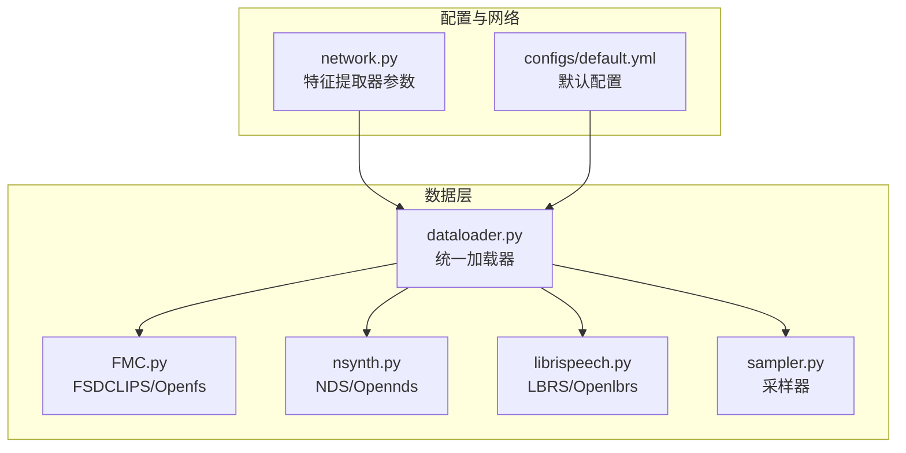
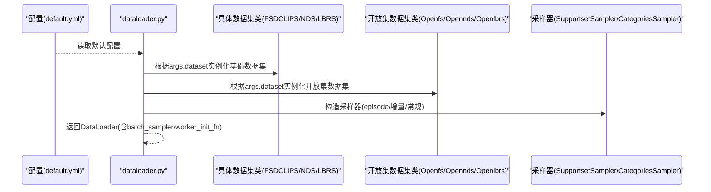
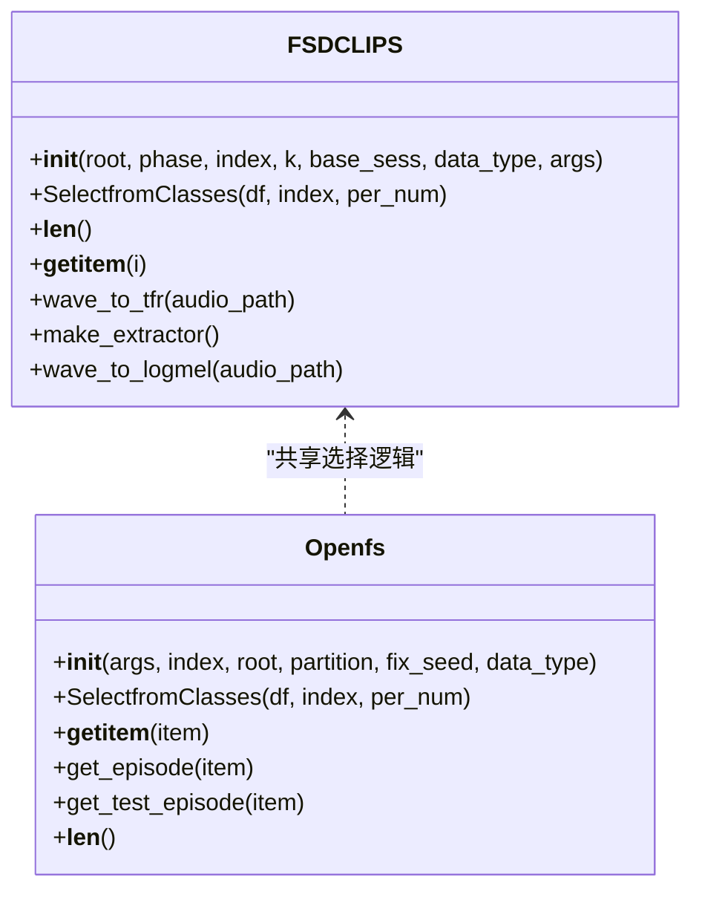
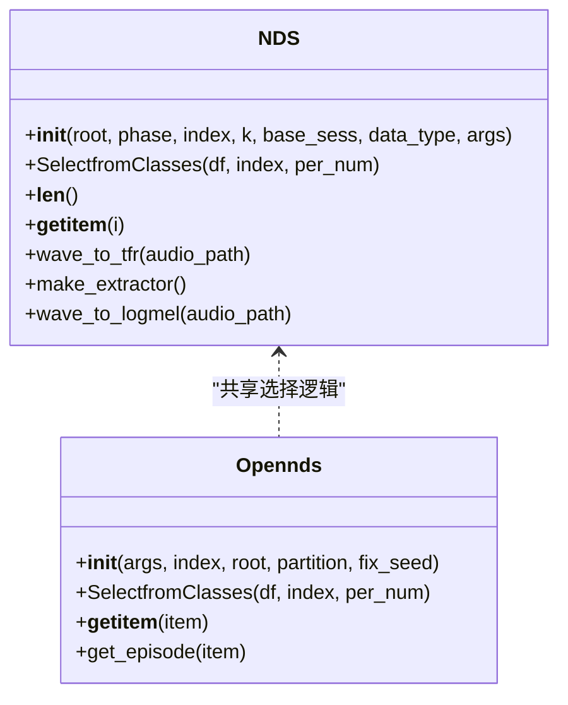
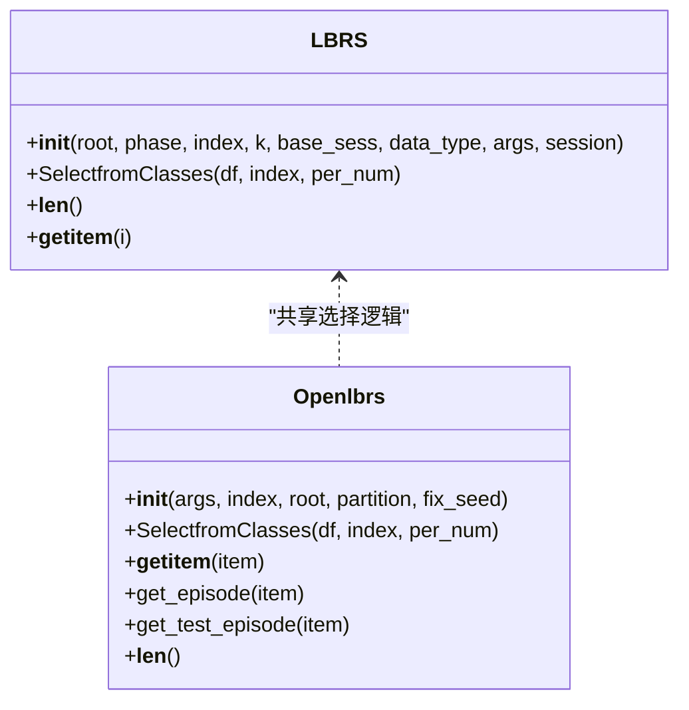
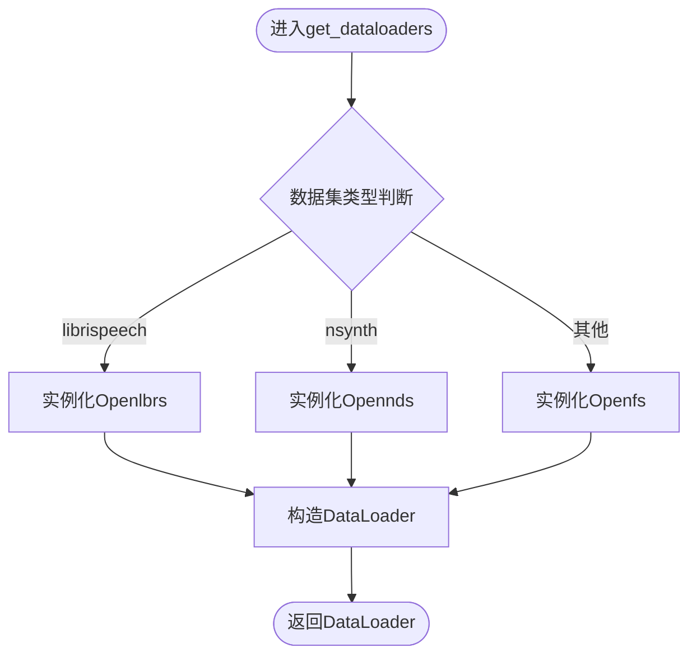
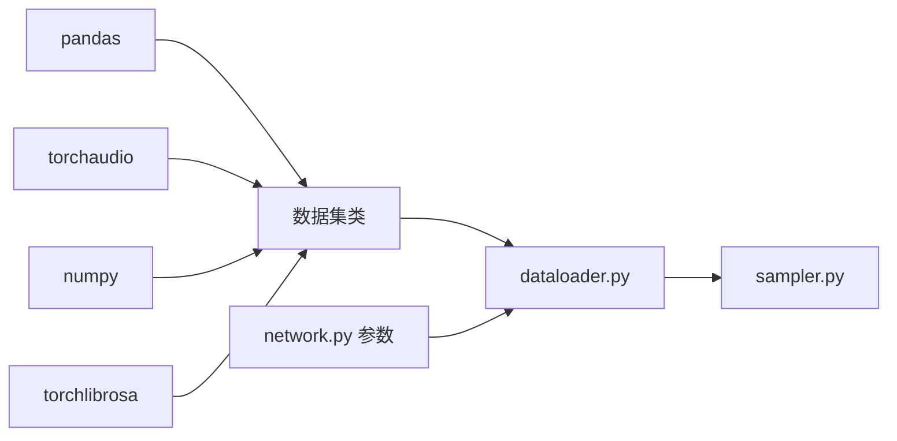

# 多数据集支持

<cite>
**本文引用的文件**
- [FMC.py](file://data/FMC.py)
- [nsynth.py](file://data/nsynth.py)
- [librispeech.py](file://data/librispeech.py)
- [dataloader.py](file://data/dataloader.py)
- [sampler.py](file://data/sampler.py)
- [default.yml](file://configs/default.yml)
- [network.py](file://network.py)
</cite>

## 目录
1. [简介](#简介)
2. [项目结构](#项目结构)
3. [核心组件](#核心组件)
4. [架构总览](#架构总览)
5. [详细组件分析](#详细组件分析)
6. [依赖关系分析](#依赖关系分析)
7. [性能考量](#性能考量)
8. [故障排查指南](#故障排查指南)
9. [结论](#结论)
10. [附录](#附录)

## 简介
本文件面向VAZE项目的多数据集支持系统，系统性梳理了对FMC、NSynth、LibriSpeech三类音频数据集的加载与预处理实现，解释其数据格式、标签体系、预处理流程与抽象层设计。文档重点覆盖：
- 统一的数据接口与数据转换
- 标准化特征提取与增强
- 数据集抽象层的设计模式与扩展方法
- 配置项、路径设置与数据验证机制
- 不同数据集的差异对比与选择策略
- 添加新数据集支持的实际步骤与注意事项

## 项目结构
多数据集支持主要集中在data目录下的三个数据集模块与统一的数据加载器、采样器，以及configs中的默认配置文件。网络模块中也包含针对不同数据集的特征提取器参数。

图表来源
- [FMC.py:1-367](file://data/FMC.py#L1-L367)
- [nsynth.py:1-287](file://data/nsynth.py#L1-L287)
- [librispeech.py:1-278](file://data/librispeech.py#L1-L278)
- [dataloader.py:1-351](file://data/dataloader.py#L1-L351)
- [sampler.py:1-201](file://data/sampler.py#L1-L201)
- [default.yml:1-88](file://configs/default.yml#L1-L88)
- [network.py:361-388](file://network.py#L361-L388)

章节来源
- [FMC.py:1-367](file://data/FMC.py#L1-L367)
- [nsynth.py:1-287](file://data/nsynth.py#L1-L287)
- [librispeech.py:1-278](file://data/librispeech.py#L1-L278)
- [dataloader.py:1-351](file://data/dataloader.py#L1-L351)
- [sampler.py:1-201](file://data/sampler.py#L1-L201)
- [default.yml:1-88](file://configs/default.yml#L1-L88)
- [network.py:361-388](file://network.py#L361-L388)

## 核心组件
- 数据集抽象层：每个数据集均提供两类接口
  - 基础数据集类（如FSDCLIPS/NDS/LBRS）：面向标准训练/验证/测试阶段，负责从CSV元数据读取路径与标签，按会话/基类/新类划分数据。
  - 开放集数据集类（如Openfs/Opennds/Openlbrs）：面向元学习/开放集场景，按episode组织支撑集、查询集、开放集样本，支持固定种子以保证可复现。
- 统一数据加载器：根据args.dataset动态选择对应数据集类，构造DataLoader；同时提供课程学习/增量训练等专用加载器。
- 采样器：支持常规分类采样、增量训练混合采样、支撑集episode采样与课程学习采样。
- 特征提取与增强：使用torchaudio/torchlibrosa进行音频加载与梅尔谱特征提取，部分模块保留TFR提取逻辑。

章节来源
- [FMC.py:21-101](file://data/FMC.py#L21-L101)
- [nsynth.py:21-109](file://data/nsynth.py#L21-L109)
- [librispeech.py:21-79](file://data/librispeech.py#L21-L79)
- [dataloader.py:13-81](file://data/dataloader.py#L13-L81)
- [sampler.py:6-140](file://data/sampler.py#L6-L140)

## 架构总览
多数据集支持采用“数据集类 + 加载器 + 采样器”的分层设计，统一通过args.dataset与args.Dataset进行解耦。下图展示了数据加载与采样在不同数据集上的调用关系。

图表来源
- [dataloader.py:13-81](file://data/dataloader.py#L13-L81)
- [dataloader.py:134-230](file://data/dataloader.py#L134-L230)
- [sampler.py:6-140](file://data/sampler.py#L6-L140)
- [default.yml:1-88](file://configs/default.yml#L1-L88)

## 详细组件分析

### FMC（FSD-MIX-CLIPS）数据集
- 数据格式与来源
  - 使用CSV元数据文件记录音频文件名、起始时间、数据文件夹等字段，最终拼接为音频绝对路径。
  - 支持mini版本的FSC-89元数据，包含训练/验证/测试划分。
- 标签体系
  - 直接使用数字标签列，无需额外映射。
- 预处理流程
  - 音频加载：使用torchaudio.load，返回单通道波形张量。
  - 可选特征提取：保留fbank/logmel提取逻辑，便于后续替换。
- 开放集episode组织
  - 支撑集/查询集/开放集分别采样，固定种子保证可复现。
  - 测试阶段将支撑集与开放集拼接作为输入，便于统一评估。

图表来源
- [FMC.py:21-101](file://data/FMC.py#L21-L101)
- [FMC.py:151-351](file://data/FMC.py#L151-L351)

章节来源
- [FMC.py:21-101](file://data/FMC.py#L21-L101)
- [FMC.py:151-351](file://data/FMC.py#L151-L351)

### NSynth（NSynth-100-FS）数据集
- 数据格式与来源
  - 使用CSV元数据文件记录乐器类型、音频源、文件名等，结合词汇表JSON进行标签映射。
  - 提供训练/验证/测试划分CSV与词汇表。
- 标签体系
  - 将乐器字符串映射为数字标签，便于神经网络处理。
- 预处理流程
  - 音频加载：使用torchaudio.load。
  - 可选特征提取：fbank/logmel提取逻辑保留。
- 开放集episode组织
  - 与FMC类似，按支撑/查询/开放集组织episode，支持训练/测试两种模式。

图表来源
- [nsynth.py:21-109](file://data/nsynth.py#L21-L109)
- [nsynth.py:160-272](file://data/nsynth.py#L160-L272)

章节来源
- [nsynth.py:21-109](file://data/nsynth.py#L21-L109)
- [nsynth.py:160-272](file://data/nsynth.py#L160-L272)

### LibriSpeech数据集
- 数据格式与来源
  - 使用CSV元数据文件记录文件名与标签，根目录下包含训练/验证/测试划分CSV。
  - 音频路径基于根目录与子目录拼接。
- 标签体系
  - 直接使用数字标签列。
- 预处理流程
  - 音频加载：使用torchaudio.load。
  - 可选特征提取：fbank/logmel提取逻辑保留。
- 开放集episode组织
  - 支撑/查询/开放集采样，测试阶段将支撑集与开放集拼接。

图表来源
- [librispeech.py:21-79](file://data/librispeech.py#L21-L79)
- [librispeech.py:82-263](file://data/librispeech.py#L82-L263)

章节来源
- [librispeech.py:21-79](file://data/librispeech.py#L21-L79)
- [librispeech.py:82-263](file://data/librispeech.py#L82-L263)

### 统一数据加载器与采样器
- 统一加载器
  - 根据args.dataset选择对应数据集类，构造DataLoader；支持基础训练、增量训练、测试等多种场景。
  - 支持课程学习数据集包装，按已知/当前/未知三段组织episode。
- 采样器
  - CategoriesSampler：常规分类任务的类别与样本采样。
  - TrueIncreTrainCategoriesSampler：增量训练阶段的基类与新类混合采样。
  - SupportsetSampler：支撑集episode采样，支持顺序采样与随机采样。
  - CurriculumSampler：课程学习采样器，支持动态更新活跃类别集合。

图表来源
- [dataloader.py:19-46](file://data/dataloader.py#L19-L46)

章节来源
- [dataloader.py:13-81](file://data/dataloader.py#L13-L81)
- [dataloader.py:134-230](file://data/dataloader.py#L134-L230)
- [dataloader.py:263-351](file://data/dataloader.py#L263-L351)
- [sampler.py:6-140](file://data/sampler.py#L6-L140)

## 依赖关系分析
- 数据集类依赖
  - 共同依赖：pandas读取CSV、torchaudio加载音频、numpy进行索引与随机采样。
  - 可选依赖：torchlibrosa提供STFT与Logmel提取器，部分模块保留TFR提取逻辑。
- 加载器与采样器
  - 加载器根据args.dataset动态导入对应数据集模块，避免硬编码耦合。
  - 采样器独立于具体数据集，仅依赖标签数组与配置参数。
- 网络模块
  - network.py中定义了不同数据集的特征提取器参数（采样率、窗长、hop、mel_bins、fmax等），便于在模型侧适配不同数据集。

图表来源
- [FMC.py:1-20](file://data/FMC.py#L1-L20)
- [nsynth.py:1-18](file://data/nsynth.py#L1-L18)
- [librispeech.py:1-18](file://data/librispeech.py#L1-L18)
- [dataloader.py:1-9](file://data/dataloader.py#L1-L9)
- [sampler.py:1-5](file://data/sampler.py#L1-L5)
- [network.py:361-388](file://network.py#L361-L388)

章节来源
- [FMC.py:1-20](file://data/FMC.py#L1-L20)
- [nsynth.py:1-18](file://data/nsynth.py#L1-L18)
- [librispeech.py:1-18](file://data/librispeech.py#L1-L18)
- [dataloader.py:1-9](file://data/dataloader.py#L1-L9)
- [sampler.py:1-5](file://data/sampler.py#L1-L5)
- [network.py:361-388](file://network.py#L361-L388)

## 性能考量
- 并行与内存
  - DataLoader使用多进程num_workers与pin_memory提升吞吐；采样器batch_sampler减少不必要的数据搬运。
- 特征提取
  - 保留fbank/logmel提取逻辑，可在GPU上加速；注意不同数据集的采样率与窗长差异。
- 可复现性
  - 通过worker_init_fn与固定随机种子确保episode结果稳定。

[本节为通用指导，无需特定文件来源]

## 故障排查指南
- 路径与权限
  - 确认CSV元数据路径与音频文件存在且可读；检查根目录与子目录拼接是否正确。
- 标签映射
  - NSynth需要词汇表JSON；若映射失败，检查JSON键值与CSV乐器类型一致性。
- 数据加载错误
  - torchaudio.load可能因音频损坏或格式不支持报错；建议先用librosa验证音频完整性。
- episode组织问题
  - 若支撑/查询/开放集数量不足，采样器会抛出断言错误；检查CSV中每类样本数与args.n_shots/n_queries设置。
- 课程学习/增量训练
  - CurriculumSampler与SupportsetSampler依赖标签数组；若类别数不足，采样器会自动填充或报错。

章节来源
- [FMC.py:57-98](file://data/FMC.py#L57-L98)
- [nsynth.py:185-212](file://data/nsynth.py#L185-L212)
- [librispeech.py:125-141](file://data/librispeech.py#L125-L141)
- [sampler.py:6-140](file://data/sampler.py#L6-L140)

## 结论
VAZE的多数据集支持通过统一的数据集类、加载器与采样器实现了对FMC、NSynth、LibriSpeech的无缝接入。抽象层设计使得新增数据集只需遵循相同的接口规范即可快速集成。建议在扩展新数据集时：
- 明确元数据格式与标签体系
- 实现基础数据集类与开放集数据集类
- 在dataloader中注册对应分支
- 根据需要调整特征提取器参数
- 完善测试与验证流程

[本节为总结，无需特定文件来源]

## 附录

### 数据集配置选项与路径设置
- 关键配置项（来自默认配置）
  - 训练与评估超参：way、shot、num_session、num_base、num_novel、num_all、n_ways、n_shots、n_queries、n_test_runs、n_train_runs等。
  - 批大小与工作进程：dataloader.train_batch_size、dataloader.test_batch_size、dataloader.num_workers。
  - 课程学习与增量训练：episode.train_episode、episode.episode_way、episode.episode_shot、episode.episode_query、low_way、low_shot。
  - 音频特征提取器：extractor.sample_rate、extractor.window_size、extractor.hop_size、extractor.mel_bins、extractor.fmin、extractor.fmax、extractor.window。
- 路径设置
  - args.dataroot：数据根目录
  - 各数据集CSV元数据文件：训练/验证/测试划分
  - NSynth词汇表：乐器到数字标签映射

章节来源
- [default.yml:1-88](file://configs/default.yml#L1-L88)
- [network.py:361-388](file://network.py#L361-L388)

### 数据集差异对比与选择策略
- 数据规模与领域
  - FMC：合成混合片段，适合细粒度音频事件检测与少样本学习。
  - NSynth：乐器音色分类，标签为乐器类型，适合音色识别与少样本学习。
  - LibriSpeech：语音文本转写，适合语音识别与少样本学习。
- 标签体系
  - FMC/NSynth：数字标签直接可用；NSynth需词汇表映射。
  - LibriSpeech：数字标签直接可用。
- 预处理与特征
  - 三者均支持fbank/logmel提取；NSynth与FMC的采样率与fmax不同，需在网络侧匹配。
- 选择策略
  - 若关注音色/乐器：优先NSynth。
  - 若关注语音：优先LibriSpeech。
  - 若关注复杂音频事件：优先FMC。

章节来源
- [FMC.py:31-35](file://data/FMC.py#L31-L35)
- [nsynth.py:31-35](file://data/nsynth.py#L31-L35)
- [librispeech.py:31-33](file://data/librispeech.py#L31-L33)
- [network.py:361-388](file://network.py#L361-L388)

### 如何添加新的数据集支持（步骤指引）
- 准备元数据
  - 准备训练/验证/测试CSV文件，包含音频文件名与标签列。
- 实现数据集类
  - 实现基础数据集类：继承Dataset，实现__init__/__len__/__getitem__，并在__init__中读取CSV与划分数据。
  - 实现开放集数据集类：按episode组织支撑/查询/开放集，支持训练/测试两种模式。
- 注册加载器
  - 在dataloader.py中添加分支，根据args.dataset选择新数据集类。
- 配置参数
  - 在default.yml中设置相关超参；必要时在network.py中补充特征提取器参数。
- 验证与测试
  - 使用最小化args进行快速验证，确认DataLoader与episode输出符合预期。

章节来源
- [dataloader.py:19-46](file://data/dataloader.py#L19-L46)
- [default.yml:1-88](file://configs/default.yml#L1-L88)
- [network.py:361-388](file://network.py#L361-L388)