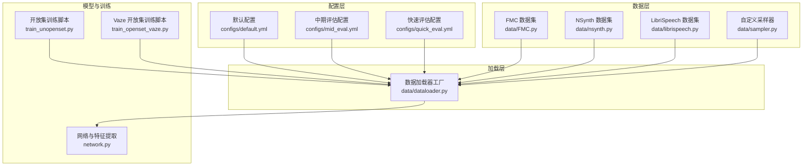
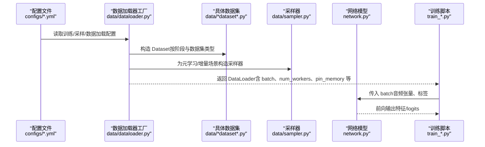
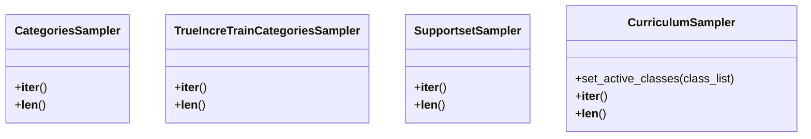
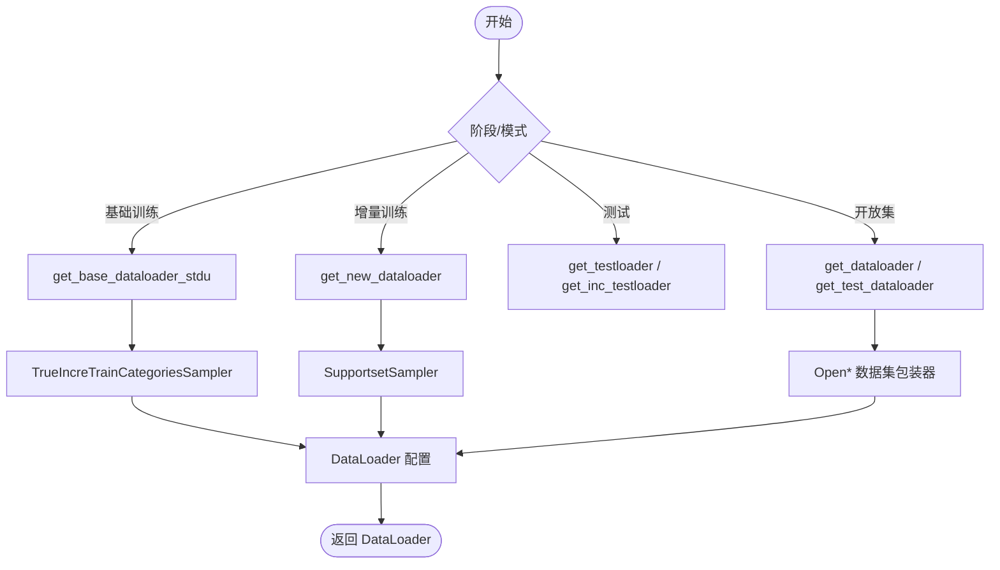
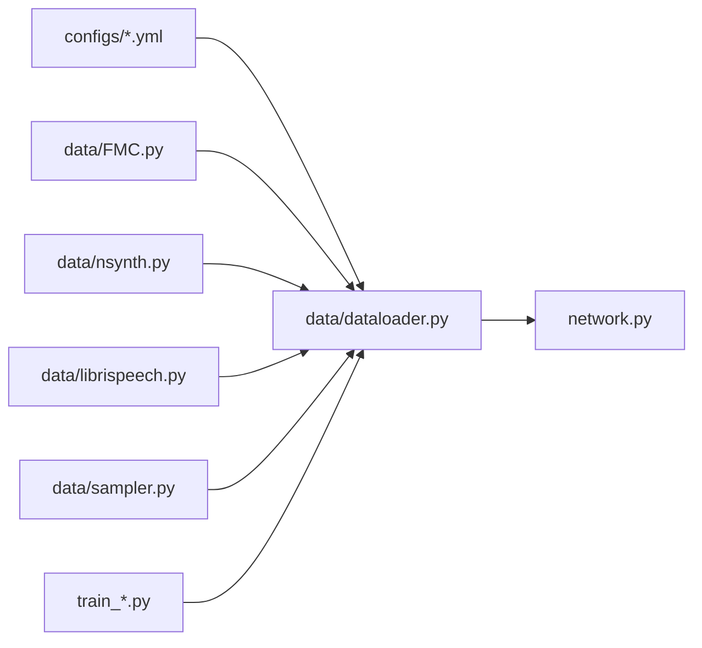

# 数据加载管道

<cite>
**本文引用的文件**
- [data/dataloader.py](file://data/dataloader.py)
- [data/librispeech.py](file://data/librispeech.py)
- [data/nsynth.py](file://data/nsynth.py)
- [data/FMC.py](file://data/FMC.py)
- [data/sampler.py](file://data/sampler.py)
- [configs/default.yml](file://configs/default.yml)
- [configs/mid_eval.yml](file://configs/mid_eval.yml)
- [configs/quick_eval.yml](file://configs/quick_eval.yml)
- [network.py](file://network.py)
- [utils/audio_augment.py](file://utils/audio_augment.py)
- [train_unopenset.py](file://train_unopenset.py)
- [train_openset_vaze.py](file://train_openset_vaze.py)
</cite>

## 目录
1. [简介](#简介)
2. [项目结构](#项目结构)
3. [核心组件](#核心组件)
4. [架构总览](#架构总览)
5. [详细组件分析](#详细组件分析)
6. [依赖分析](#依赖分析)
7. [性能考虑](#性能考虑)
8. [故障排查指南](#故障排查指南)
9. [结论](#结论)
10. [附录](#附录)

## 简介
本文件系统性梳理 VAZE 项目的“数据加载管道”，覆盖从原始音频文件到模型输入的完整数据流，以及不同训练阶段（基础训练、增量训练、测试与评估）的数据加载策略。文档重点解释：
- 数据加载器在基础训练、增量训练、测试与评估阶段的实现差异与配置要点
- 关键配置项：批次大小、并行加载、内存管理、随机种子
- 性能优化技巧：数据预加载、缓存策略、I/O 优化
- 如何扩展数据加载器以适配大规模数据集

## 项目结构
VAZE 的数据加载相关代码主要集中在 data/ 目录，配合 configs/ 中的配置文件与训练脚本共同完成端到端的数据流。

图表来源
- [data/dataloader.py:1-351](file://data/dataloader.py#L1-L351)
- [data/FMC.py:1-367](file://data/FMC.py#L1-L367)
- [data/nsynth.py:1-287](file://data/nsynth.py#L1-L287)
- [data/librispeech.py:1-278](file://data/librispeech.py#L1-L278)
- [data/sampler.py:1-201](file://data/sampler.py#L1-L201)
- [configs/default.yml:1-88](file://configs/default.yml#L1-L88)
- [configs/mid_eval.yml:1-88](file://configs/mid_eval.yml#L1-L88)
- [configs/quick_eval.yml:1-88](file://configs/quick_eval.yml#L1-L88)
- [network.py:1-200](file://network.py#L1-L200)
- [train_unopenset.py:1-200](file://train_unopenset.py#L1-L200)
- [train_openset_vaze.py:1-200](file://train_openset_vaze.py#L1-L200)

章节来源
- [data/dataloader.py:1-351](file://data/dataloader.py#L1-L351)
- [configs/default.yml:1-88](file://configs/default.yml#L1-L88)

## 核心组件
- 数据集实现：FMC、NSynth、LibriSpeech 三类数据集，均继承自 PyTorch Dataset，提供 __getitem__ 读取音频路径并加载音频，返回波形张量与标签。
- 自定义采样器：支持小样本元学习场景的采样策略，如基础/增量联合采样、支持集采样等。
- 数据加载器工厂：根据任务类型与阶段（基础、增量、测试、评估）选择对应 Dataset 与 DataLoader，并统一配置并行与内存参数。
- 配置系统：通过 YAML 文件集中管理训练、采样、数据加载等参数，便于在不同评估阶段切换。
- 网络与特征提取：MYNET 在 forward 中集成音频特征提取模块，与 DataLoader 输出的音频张量对接。

章节来源
- [data/FMC.py:21-101](file://data/FMC.py#L21-L101)
- [data/nsynth.py:21-109](file://data/nsynth.py#L21-L109)
- [data/librispeech.py:21-79](file://data/librispeech.py#L21-L79)
- [data/sampler.py:6-141](file://data/sampler.py#L6-L141)
- [data/dataloader.py:13-351](file://data/dataloader.py#L13-L351)
- [configs/default.yml:57-88](file://configs/default.yml#L57-L88)
- [network.py:326-353](file://network.py#L326-L353)

## 架构总览
下图展示了从配置到数据加载再到模型推理的整体流程。

图表来源
- [data/dataloader.py:13-351](file://data/dataloader.py#L13-L351)
- [data/FMC.py:21-101](file://data/FMC.py#L21-L101)
- [data/nsynth.py:21-109](file://data/nsynth.py#L21-L109)
- [data/librispeech.py:21-79](file://data/librispeech.py#L21-L79)
- [data/sampler.py:6-141](file://data/sampler.py#L6-L141)
- [network.py:326-353](file://network.py#L326-L353)
- [configs/default.yml:57-88](file://configs/default.yml#L57-L88)

## 详细组件分析

### 数据集组件
- FSD-MIX-CLIPS（FMC）：从 CSV 注释中解析片段路径，按标签筛选样本，__getitem__ 加载音频并返回波形与标签。
- NSynth：从 JSON 词汇表映射乐器标签，按标签筛选样本，__getitem__ 加载音频并返回波形与标签。
- LibriSpeech：从 CSV 注释中解析片段路径，按标签筛选样本，__getitem__ 加载音频并返回波形与标签。

这些数据集均采用 torchaudio.load 读取音频，返回单通道波形张量与整型标签，供 DataLoader 组装为 mini-batch。

章节来源
- [data/FMC.py:21-101](file://data/FMC.py#L21-L101)
- [data/nsynth.py:21-109](file://data/nsynth.py#L21-L109)
- [data/librispeech.py:21-79](file://data/librispeech.py#L21-L79)

### 采样器组件
- CategoriesSampler：常规分类采样，按 n_cls 与 n_per 从每个类中随机抽取样本，拼接成 batch。
- TrueIncreTrainCategoriesSampler：面向增量场景，分别从基础类与增量类中采样，控制每类样本数与批次拼接顺序。
- SupportsetSampler：支持小样本元学习的“支持集/查询集”采样，保证每个 episode 的类别与样本数固定。
- CurriculumSampler：课程学习采样器，可动态更新活跃类别集合，实现从易到难的学习路径。

图表来源
- [data/sampler.py:6-201](file://data/sampler.py#L6-L201)

章节来源
- [data/sampler.py:6-201](file://data/sampler.py#L6-L201)

### 数据加载器工厂
- 基础训练/增量训练：通过 get_base_dataloader_stdu 与 get_new_dataloader 构建，结合 TrueIncreTrainCategoriesSampler 与 SupportsetSampler，支持小样本元学习与增量场景。
- 测试/评估：get_testloader 与 get_inc_testloader 支持对已遇到类别的全量测试与增量阶段的增量测试。
- 开放集训练：get_dataloader 与 get_test_dataloader 面向开放集场景，使用 Openlbrs/Opennds/Openfs 等开放集数据集包装器，支持 episode 采样与支持/查询/开放集划分。
- 预训练：get_pretrain_dataloader 提供基础会话的训练/验证集，便于后续微调。

图表来源
- [data/dataloader.py:48-254](file://data/dataloader.py#L48-L254)
- [data/sampler.py:38-141](file://data/sampler.py#L38-L141)

章节来源
- [data/dataloader.py:13-351](file://data/dataloader.py#L13-L351)
- [data/sampler.py:38-141](file://data/sampler.py#L38-L141)

### 配置与参数
- dataloader 配置：num_workers、train_batch_size、test_batch_size 控制并行度与批量大小。
- 采样与训练：episode.* 控制元学习 episode 数、way、shot、query 等；strategy.* 控制数据初始化与验证集策略。
- 音频特征：extractor.* 控制 STFT/Log-mel 参数，影响网络前级特征提取。

章节来源
- [configs/default.yml:57-88](file://configs/default.yml#L57-L88)
- [configs/mid_eval.yml:57-88](file://configs/mid_eval.yml#L57-L88)
- [configs/quick_eval.yml:57-88](file://configs/quick_eval.yml#L57-L88)
- [network.py:326-353](file://network.py#L326-L353)

### 与模型的衔接
- 网络 MYNET 在 set_module_for_audio 中初始化音频特征提取模块（Spectrogram、Logmel、SpecAugmentation 等），DataLoader 输出的音频张量经网络前级转为 log-mel 图谱，再进入编码器。
- 训练脚本通过 DataLoader 迭代 batch，传入模型进行前向与反向。

章节来源
- [network.py:326-353](file://network.py#L326-L353)
- [train_unopenset.py:1-200](file://train_unopenset.py#L1-L200)
- [train_openset_vaze.py:86-199](file://train_openset_vaze.py#L86-L199)

## 依赖分析
- 数据集与加载器：FMC、NSynth、LibriSpeech 作为底层数据源，被 data/dataloader.py 的工厂函数统一装配为 DataLoader。
- 采样器与加载器：采样器直接作用于 Dataset 的索引，DataLoader 通过 batch_sampler 或 batch_size 控制批次。
- 配置与运行：YAML 配置驱动数据加载器参数；训练脚本负责调度 DataLoader 与模型。

图表来源
- [data/dataloader.py:13-351](file://data/dataloader.py#L13-L351)
- [data/FMC.py:1-367](file://data/FMC.py#L1-L367)
- [data/nsynth.py:1-287](file://data/nsynth.py#L1-L287)
- [data/librispeech.py:1-278](file://data/librispeech.py#L1-L278)
- [data/sampler.py:1-201](file://data/sampler.py#L1-L201)
- [configs/default.yml:1-88](file://configs/default.yml#L1-L88)
- [network.py:1-200](file://network.py#L1-L200)
- [train_unopenset.py:1-200](file://train_unopenset.py#L1-L200)
- [train_openset_vaze.py:1-200](file://train_openset_vaze.py#L1-L200)

章节来源
- [data/dataloader.py:13-351](file://data/dataloader.py#L13-L351)
- [data/sampler.py:1-201](file://data/sampler.py#L1-L201)
- [configs/default.yml:1-88](file://configs/default.yml#L1-L88)

## 性能考虑
- 并行与内存
  - num_workers：建议与 CPU 核心数匹配，避免过多线程导致上下文切换开销。
  - pin_memory：启用页锁定内存，可加速 GPU 数据传输，适合 GPU 训练场景。
  - batch_size：在显存允许前提下尽量增大，减少 I/O 占比。
- I/O 优化
  - 预加载：将常用数据集路径与标签预处理到内存或 SSD 缓存，减少磁盘寻道。
  - 数据集分片：按类别或会话切分数据，降低采样器扫描成本。
- 随机性与可复现
  - 通过 seed_worker 与全局随机种子设置，保证不同进程的可复现性。
  - 训练脚本中设置了确定性环境变量与算法开关，建议在生产环境中保持一致。
- 特征提取
  - 网络前级特征提取（STFT/Logmel）可在 CPU 上并行，建议与 DataLoader 并行度协调。

章节来源
- [data/dataloader.py:5-8](file://data/dataloader.py#L5-L8)
- [configs/default.yml:57-60](file://configs/default.yml#L57-L60)
- [train_unopenset.py:123-140](file://train_unopenset.py#L123-L140)

## 故障排查指南
- DataLoader 无法返回 batch
  - 检查 num_workers 与 pin_memory 设置，必要时降为 0 排查磁盘/权限问题。
  - 确认 Dataset.__len__ 与 __getitem__ 返回值格式与模型期望一致。
- 内存不足
  - 降低 batch_size 或 num_workers；关闭 pin_memory；检查是否存在重复数据副本。
- 随机性不一致
  - 确认 seed_worker 与全局随机种子设置已在训练脚本中应用。
- 采样异常
  - 若采样器类别数不足，CurriculumSampler 会自动填充，注意日志提示。
- 开放集测试结果异常
  - 确认 get_testloader/get_inc_testloader 的 class_new 范围与 session 对应正确。

章节来源
- [data/dataloader.py:13-351](file://data/dataloader.py#L13-L351)
- [data/sampler.py:161-179](file://data/sampler.py#L161-L179)
- [train_unopenset.py:123-140](file://train_unopenset.py#L123-L140)

## 结论
VAZE 的数据加载管道围绕“配置驱动 + 自定义采样 + 多数据集适配”的设计，实现了从基础训练到增量训练再到测试/评估的全链路支持。通过合理的 DataLoader 配置与采样策略，能够在小样本与开放集场景下高效稳定地提供数据流。建议在大规模数据集上优先采用预加载、合理并行度与确定性设置，以获得最佳性能与可复现性。

## 附录

### 不同训练阶段的数据加载策略
- 基础训练（base session）
  - 使用 get_base_dataloader_stdu，结合 TrueIncreTrainCategoriesSampler，按 episode 配置采样基础类与增量类样本。
- 增量训练（session > 0）
  - 使用 get_new_dataloader 或 get_unknow_dataloader，结合 SupportsetSampler，分别构建支持集与查询集（或仅支持集）。
- 测试/评估
  - 使用 get_testloader（全量已遇类）或 get_inc_testloader（仅增量类）。
- 开放集训练
  - 使用 get_dataloader 或 get_test_dataloader，结合 Open* 包装器，支持 episode 采样与支持/查询/开放集划分。

章节来源
- [data/dataloader.py:48-254](file://data/dataloader.py#L48-L254)

### 数据加载器配置选项速览
- dataloader.num_workers：并行工作进程数
- dataloader.train_batch_size / test_batch_size：训练/测试批次大小
- episode.*：元学习 episode 数、类别数、样本数等
- strategy.*：数据初始化与验证集策略
- extractor.*：STFT/Logmel 参数

章节来源
- [configs/default.yml:57-88](file://configs/default.yml#L57-L88)
- [configs/mid_eval.yml:57-88](file://configs/mid_eval.yml#L57-L88)
- [configs/quick_eval.yml:57-88](file://configs/quick_eval.yml#L57-L88)

### 扩展数据加载器与处理大规模数据集的实践
- 新增数据集
  - 继承 Dataset，实现 __len__/__getitem__，并在 data/dataloader.py 中注册对应的工厂方法。
- 自定义采样策略
  - 在 data/sampler.py 中新增采样器类，或复用现有采样器并调整参数。
- 大规模数据集优化
  - 预处理：将音频路径与标签写入索引文件，减少 CSV 解析开销。
  - 缓存：对频繁访问的特征或中间结果进行缓存，避免重复计算。
  - 并行：根据硬件资源调整 num_workers 与 batch_size，平衡吞吐与延迟。
- 随机性与稳定性
  - 使用 seed_worker 与全局随机种子，确保跨进程一致性。
  - 在训练脚本中启用确定性算法与禁用 benchmark，避免非确定行为。

章节来源
- [data/dataloader.py:13-351](file://data/dataloader.py#L13-L351)
- [data/sampler.py:1-201](file://data/sampler.py#L1-L201)
- [train_unopenset.py:123-140](file://train_unopenset.py#L123-L140)