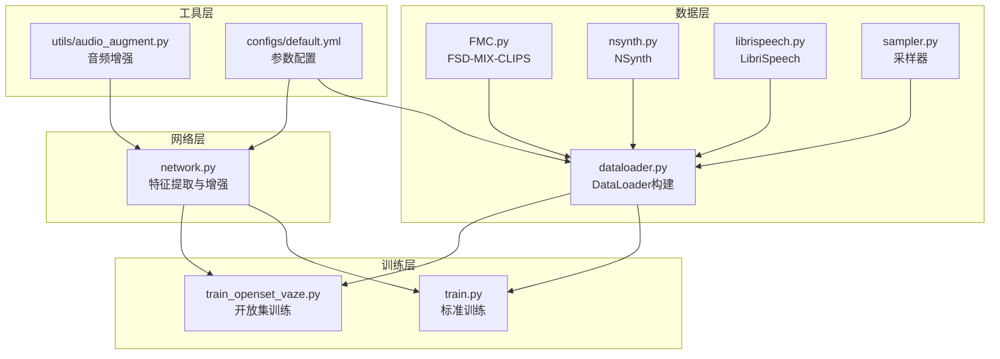
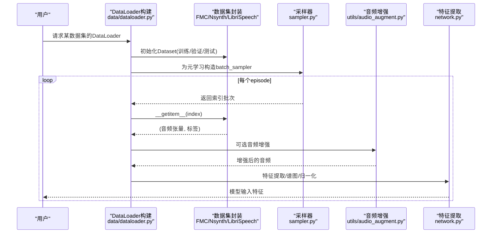
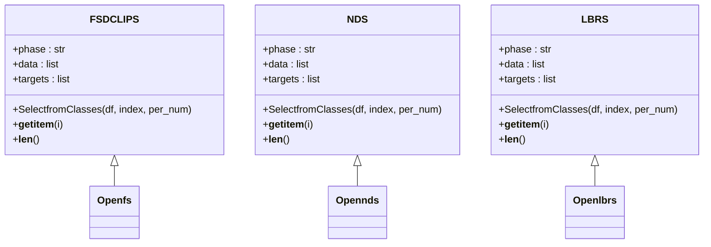
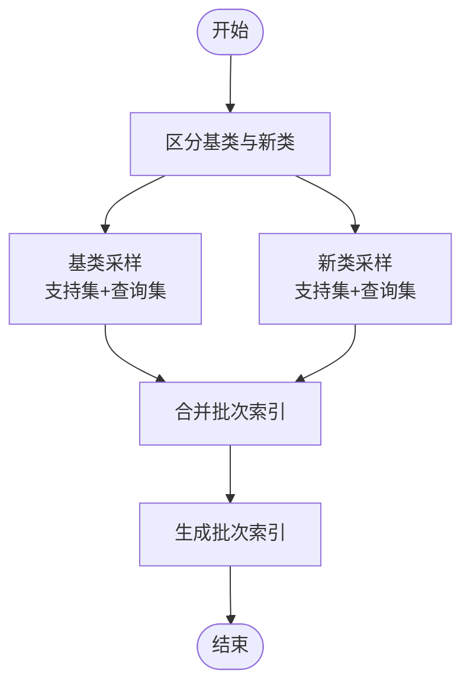
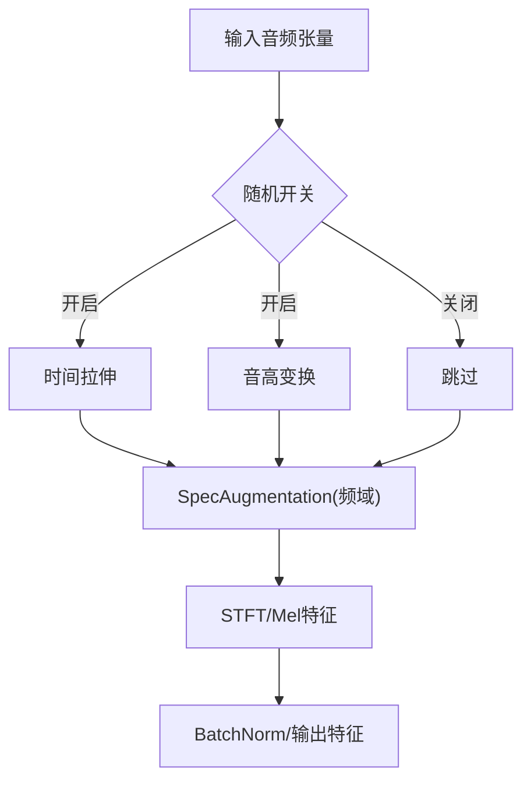
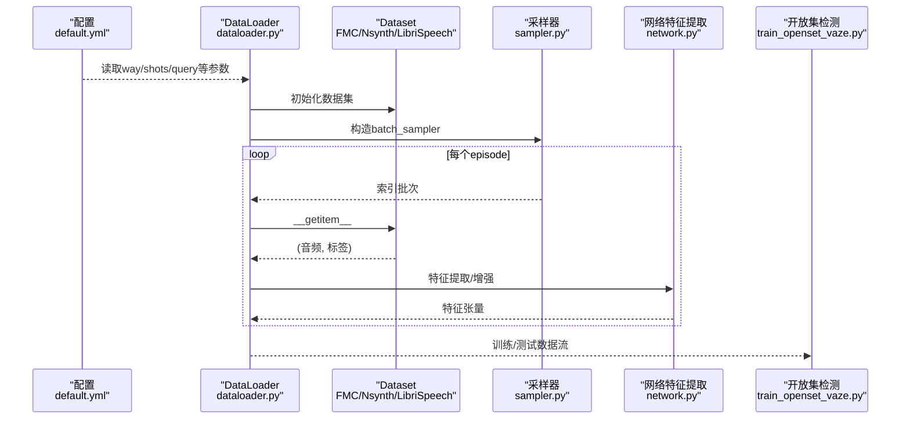
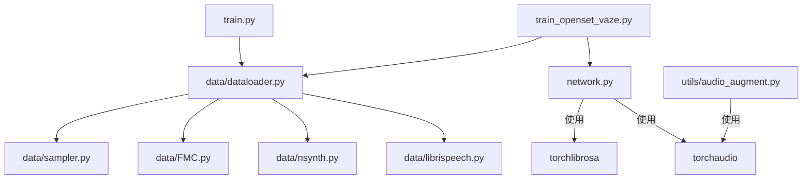

# 数据处理系统

<cite>
**本文档引用的文件**
- [data/dataloader.py](file://data/dataloader.py)
- [data/FMC.py](file://data/FMC.py)
- [data/nsynth.py](file://data/nsynth.py)
- [data/librispeech.py](file://data/librispeech.py)
- [data/sampler.py](file://data/sampler.py)
- [utils/audio_augment.py](file://utils/audio_augment.py)
- [configs/default.yml](file://configs/default.yml)
- [network.py](file://network.py)
- [train.py](file://train.py)
- [train_openset_vaze.py](file://train_openset_vaze.py)
</cite>

## 目录
1. [简介](#简介)
2. [项目结构](#项目结构)
3. [核心组件](#核心组件)
4. [架构总览](#架构总览)
5. [详细组件分析](#详细组件分析)
6. [依赖分析](#依赖分析)
7. [性能考虑](#性能考虑)
8. [故障排除指南](#故障排除指南)
9. [结论](#结论)
10. [附录](#附录)

## 简介
本文件面向VAZE项目的多数据集音频数据处理系统，系统支持FMC、NSynth、LibriSpeech等多个数据集，采用元学习（few-shot）范式，提供支持集与查询集的动态采样、批次采样策略、以及可扩展的数据增强能力。本文档将深入解析以下方面：
- 多数据集加载与预处理流程
- 支持集/查询集的动态生成与批次采样逻辑
- 数据增强技术（音频变换、时间频率扰动等）
- 完整数据管道工作流程（从原始音频到模型输入）

## 项目结构
数据处理相关的核心目录与文件如下：
- data/：数据集封装与采样器
  - FMC.py、nsynth.py、librispeech.py：各数据集的Dataset实现
  - sampler.py：支持多种采样策略的采样器
  - dataloader.py：构建训练/测试/增量会话的DataLoader
- utils/：通用工具
  - audio_augment.py：音频增强工具
- configs/：配置文件
  - default.yml：训练与数据处理参数
- network.py：网络模块中的特征提取器与增强器
- train.py、train_openset_vaze.py：训练入口与开放集训练流程

**图表来源**
- [data/dataloader.py:1-351](file://data/dataloader.py#L1-L351)
- [data/FMC.py:1-367](file://data/FMC.py#L1-L367)
- [data/nsynth.py:1-287](file://data/nsynth.py#L1-L287)
- [data/librispeech.py:1-278](file://data/librispeech.py#L1-L278)
- [data/sampler.py:1-201](file://data/sampler.py#L1-L201)
- [utils/audio_augment.py:1-31](file://utils/audio_augment.py#L1-L31)
- [configs/default.yml:1-88](file://configs/default.yml#L1-L88)
- [network.py:337-388](file://network.py#L337-L388)
- [train.py:156-200](file://train.py#L156-L200)
- [train_openset_vaze.py:31-83](file://train_openset_vaze.py#L31-L83)

**章节来源**
- [data/dataloader.py:1-351](file://data/dataloader.py#L1-L351)
- [data/FMC.py:1-367](file://data/FMC.py#L1-L367)
- [data/nsynth.py:1-287](file://data/nsynth.py#L1-L287)
- [data/librispeech.py:1-278](file://data/librispeech.py#L1-L278)
- [data/sampler.py:1-201](file://data/sampler.py#L1-L201)
- [utils/audio_augment.py:1-31](file://utils/audio_augment.py#L1-L31)
- [configs/default.yml:1-88](file://configs/default.yml#L1-L88)
- [network.py:337-388](file://network.py#L337-L388)
- [train.py:156-200](file://train.py#L156-L200)
- [train_openset_vaze.py:31-83](file://train_openset_vaze.py#L31-L83)

## 核心组件
- 多数据集Dataset实现
  - FSDCLIPS：FMC数据集的训练/验证/测试划分与样本选择
  - NDS/Opennds：NSynth数据集的训练/测试封装
  - LBRS/Openlbrs：LibriSpeech数据集的训练/测试封装
- 采样器
  - CategoriesSampler：常规分类采样
  - TrueIncreTrainCategoriesSampler：增量训练阶段的基类与新类混合采样
  - SupportsetSampler：支持集/查询集的固定批次采样
  - CurriculumSampler：课程学习采样器（动态活跃类别池）
- DataLoader构建
  - 支持不同数据集的切换与分阶段（base/known/new/unknown）数据加载
  - 支持元学习episode的batch_sampler
- 音频增强
  - utils/audio_augment.py：时间拉伸、音高变换等随机增强
  - network.py：SpecAugmentation、STFT、Mel滤波器等

**章节来源**
- [data/FMC.py:21-367](file://data/FMC.py#L21-L367)
- [data/nsynth.py:21-287](file://data/nsynth.py#L21-L287)
- [data/librispeech.py:21-278](file://data/librispeech.py#L21-L278)
- [data/sampler.py:6-201](file://data/sampler.py#L6-L201)
- [data/dataloader.py:13-351](file://data/dataloader.py#L13-L351)
- [utils/audio_augment.py:4-31](file://utils/audio_augment.py#L4-L31)
- [network.py:337-388](file://network.py#L337-L388)

## 架构总览
数据处理系统围绕“数据集封装 + 采样策略 + DataLoader + 网络特征提取”展开，形成从原始音频到模型输入的完整流水线。

**图表来源**
- [data/dataloader.py:134-230](file://data/dataloader.py#L134-L230)
- [data/FMC.py:95-101](file://data/FMC.py#L95-L101)
- [data/nsynth.py:103-109](file://data/nsynth.py#L103-L109)
- [data/librispeech.py:76-79](file://data/librispeech.py#L76-L79)
- [data/sampler.py:97-140](file://data/sampler.py#L97-L140)
- [utils/audio_augment.py:9-27](file://utils/audio_augment.py#L9-L27)
- [network.py:337-388](file://network.py#L337-L388)

## 详细组件分析

### 多数据集支持与加载流程
- FMC（FSD-MIX-CLIPS）
  - 训练/验证/测试划分：根据CSV标注文件选择样本；支持base-session与session内混合
  - 采样：__getitem__直接返回音频张量与标签
- NSynth
  - 使用JSON词表映射乐器标签；__getitem__返回音频张量与数字标签
- LibriSpeech
  - 基于CSV标注的片段路径拼接；__getitem__返回音频张量与标签

**图表来源**
- [data/FMC.py:21-367](file://data/FMC.py#L21-L367)
- [data/nsynth.py:21-287](file://data/nsynth.py#L21-L287)
- [data/librispeech.py:21-278](file://data/librispeech.py#L21-L278)

**章节来源**
- [data/FMC.py:21-367](file://data/FMC.py#L21-L367)
- [data/nsynth.py:21-287](file://data/nsynth.py#L21-L287)
- [data/librispeech.py:21-278](file://data/librispeech.py#L21-L278)

### 支持集与查询集的动态生成与批次采样
- 增量训练阶段
  - TrueIncreTrainCategoriesSampler：按基类与新类分别采样，控制每类样本数（支持集+查询集）
- 元学习episode
  - SupportsetSampler：固定n_cls×n_per的批次，支持顺序采样与随机采样
- 测试/开放集
  - Openfs/Opennds/Openlbrs：在测试阶段动态生成支持集与查询集，并可加入开放集样本

**图表来源**
- [data/sampler.py:38-93](file://data/sampler.py#L38-L93)
- [data/sampler.py:97-140](file://data/sampler.py#L97-L140)

**章节来源**
- [data/sampler.py:38-93](file://data/sampler.py#L38-L93)
- [data/sampler.py:97-140](file://data/sampler.py#L97-L140)
- [data/FMC.py:231-351](file://data/FMC.py#L231-L351)
- [data/nsynth.py:160-273](file://data/nsynth.py#L160-L273)
- [data/librispeech.py:82-263](file://data/librispeech.py#L82-L263)

### 数据增强技术实现
- 随机时域增强
  - 时间拉伸、音高变换：utils/audio_augment.py
- 频域增强
  - SpecAugmentation：network.py中定义，对时间/频率条带进行掩码
- 特征提取
  - STFT、Mel滤波器：network.py中定义，支持不同数据集的采样率与窗口参数

**图表来源**
- [utils/audio_augment.py:9-27](file://utils/audio_augment.py#L9-L27)
- [network.py:337-388](file://network.py#L337-L388)

**章节来源**
- [utils/audio_augment.py:4-31](file://utils/audio_augment.py#L4-L31)
- [network.py:337-388](file://network.py#L337-L388)

### 数据管道完整工作流程
- 数据加载
  - 根据args.dataset选择对应Dataset模块，构造训练/验证/测试集
  - 使用batch_sampler（SupportsetSampler/TrueIncreTrainCategoriesSampler）生成episode批次
- 特征提取与标准化
  - 通过网络中的Logmel/STFT提取频谱特征
  - 应用SpecAugmentation进行时间频率扰动
- 开放集检测与增量
  - 训练阶段计算类别中心，使用阈值策略识别未知样本
  - 对未知样本聚类并扩展分类器原型

**图表来源**
- [configs/default.yml:1-88](file://configs/default.yml#L1-L88)
- [data/dataloader.py:134-230](file://data/dataloader.py#L134-L230)
- [data/FMC.py:95-101](file://data/FMC.py#L95-L101)
- [data/nsynth.py:103-109](file://data/nsynth.py#L103-L109)
- [data/librispeech.py:76-79](file://data/librispeech.py#L76-L79)
- [data/sampler.py:97-140](file://data/sampler.py#L97-L140)
- [network.py:337-388](file://network.py#L337-L388)
- [train_openset_vaze.py:86-198](file://train_openset_vaze.py#L86-L198)

**章节来源**
- [configs/default.yml:1-88](file://configs/default.yml#L1-L88)
- [data/dataloader.py:134-230](file://data/dataloader.py#L134-L230)
- [data/sampler.py:97-140](file://data/sampler.py#L97-L140)
- [network.py:337-388](file://network.py#L337-L388)
- [train_openset_vaze.py:86-198](file://train_openset_vaze.py#L86-L198)

## 依赖分析
- 组件耦合
  - dataloader.py依赖sampler.py与各数据集模块
  - 各数据集模块依赖torchaudio/pandas等库
  - network.py提供特征提取与增强器，被训练脚本调用
- 外部依赖
  - torchaudio：音频加载与STFT/Mel变换
  - torchlibrosa：SpecAugmentation、Spectrogram、LogmelFilterBank
  - sklearn：KMeans聚类（开放集增量）

**图表来源**
- [data/dataloader.py:1-46](file://data/dataloader.py#L1-L46)
- [data/sampler.py:1-5](file://data/sampler.py#L1-L5)
- [data/FMC.py:10-18](file://data/FMC.py#L10-L18)
- [data/nsynth.py:10-18](file://data/nsynth.py#L10-L18)
- [data/librispeech.py:10-18](file://data/librispeech.py#L10-L18)
- [network.py:337-388](file://network.py#L337-L388)
- [utils/audio_augment.py:1-31](file://utils/audio_augment.py#L1-L31)
- [train.py:10-11](file://train.py#L10-L11)
- [train_openset_vaze.py:86-198](file://train_openset_vaze.py#L86-L198)

**章节来源**
- [data/dataloader.py:1-46](file://data/dataloader.py#L1-L46)
- [data/sampler.py:1-5](file://data/sampler.py#L1-L5)
- [data/FMC.py:10-18](file://data/FMC.py#L10-L18)
- [data/nsynth.py:10-18](file://data/nsynth.py#L10-L18)
- [data/librispeech.py:10-18](file://data/librispeech.py#L10-L18)
- [network.py:337-388](file://network.py#L337-L388)
- [utils/audio_augment.py:1-31](file://utils/audio_augment.py#L1-L31)
- [train.py:10-11](file://train.py#L10-L11)
- [train_openset_vaze.py:86-198](file://train_openset_vaze.py#L86-L198)

## 性能考虑
- 并行化
  - DataLoader使用多进程（num_workers）与pin_memory提升I/O吞吐
- 内存管理
  - 优先使用Tensor而非Python列表，避免频繁拷贝
- 特征提取
  - 使用freeze_parameters冻结特征提取器参数，减少前向开销
- 增强策略
  - SpecAugmentation与随机时域增强在训练时启用，推理时禁用

[本节为通用指导，无需特定文件分析]

## 故障排除指南
- 数据集路径与标签映射
  - 确认CSV标注文件路径与字段一致；NSynth需检查JSON词表映射
- 批次大小与采样数量
  - 若n_cls×n_per超过某类样本数，采样器会抛出断言错误；请调整way/shots或per_num
- 设备与dtype
  - 增强与特征提取需在相同设备上进行；确保输入张量维度与增强器期望一致
- 开放集检测
  - 未知样本聚类数量可能小于新增类别数，注意分类器权重扩展维度匹配

**章节来源**
- [data/nsynth.py:175-176](file://data/nsynth.py#L175-L176)
- [data/sampler.py:124-125](file://data/sampler.py#L124-L125)
- [utils/audio_augment.py:11-13](file://utils/audio_augment.py#L11-L13)
- [train_openset_vaze.py:173-198](file://train_openset_vaze.py#L173-L198)

## 结论
VAZE的数据处理系统通过模块化的Dataset封装、灵活的采样策略与可插拔的特征提取/增强模块，实现了对多数据集的统一支持。结合元学习的episode采样与开放集检测流程，系统在few-shot场景下具备良好的可扩展性与稳定性。建议在实际部署中关注数据路径一致性、批次采样边界与设备一致性，以获得最佳性能。

[本节为总结，无需特定文件分析]

## 附录
- 关键参数参考
  - way/shots/query：元学习与增量训练的关键超参
  - extractor：采样率、窗口大小、hop长度、Mel bins等
  - dataloader：num_workers、batch_size等

**章节来源**
- [configs/default.yml:2-88](file://configs/default.yml#L2-L88)