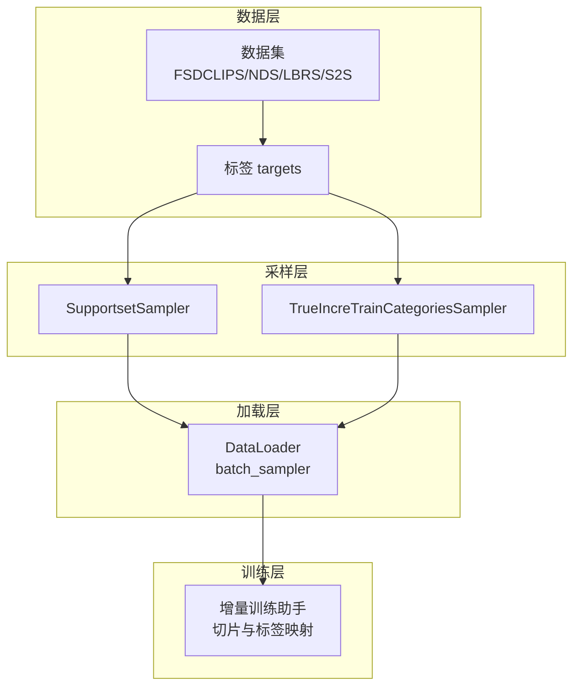
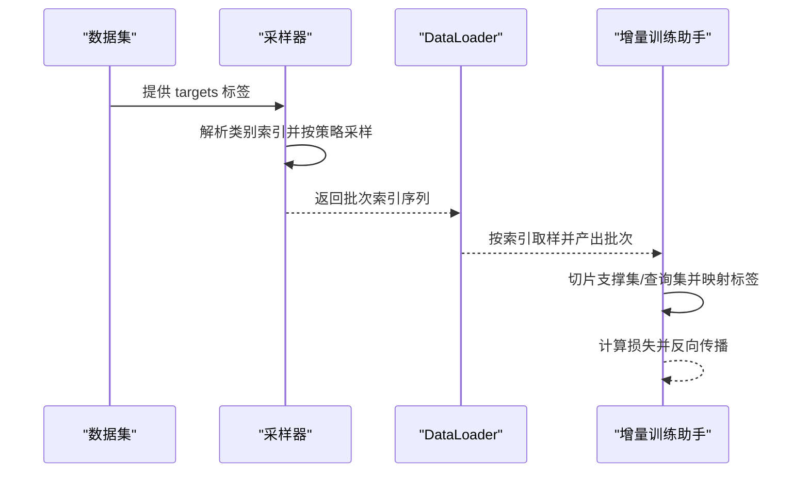
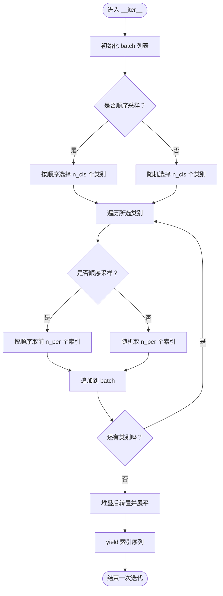
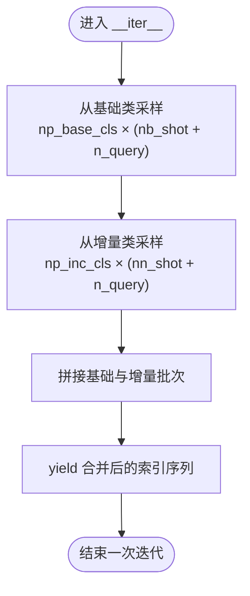
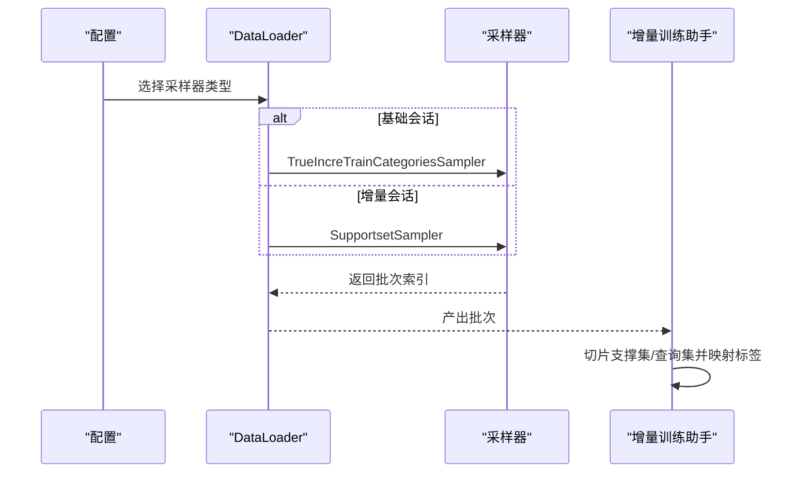
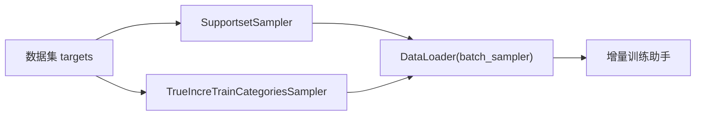

# 采样策略

<cite>
**本文引用的文件**
- [data/sampler.py](file://data/sampler.py)
- [data/dataloader.py](file://data/dataloader.py)
- [configs/default.yml](file://configs/default.yml)
- [models/incremental_train_helper.py](file://models/incremental_train_helper.py)
- [data/FMC.py](file://data/FMC.py)
</cite>

## 目录
1. [简介](#简介)
2. [项目结构](#项目结构)
3. [核心组件](#核心组件)
4. [架构总览](#架构总览)
5. [详细组件分析](#详细组件分析)
6. [依赖分析](#依赖分析)
7. [性能考虑](#性能考虑)
8. [故障排查指南](#故障排查指南)
9. [结论](#结论)
10. [附录](#附录)

## 简介
本文件面向VAZE项目的采样策略系统，重点解析两类采样器：
- SupportsetSampler：支持固定/顺序采样与随机采样的通用N-way K-shot采样器，常用于增量会话的支撑集与查询集划分。
- TrueIncreTrainCategoriesSampler：面向增量学习的“基础会话+增量会话”联合采样器，将基础类与新类分别采样并拼接，形成统一批次。

同时，本文将阐述支持集与查询集的动态生成机制、N-way K-shot采样策略、批次采样逻辑与类别平衡机制；解释增量学习场景下基础会话与增量会话的采样差异；给出采样参数配置指南与边界情况处理建议，并提供可直接定位到源码的路径指引以帮助读者快速查阅实现细节。

## 项目结构
采样策略相关的核心文件分布如下：
- data/sampler.py：采样器实现（SupportsetSampler、TrueIncreTrainCategoriesSampler等）
- data/dataloader.py：数据加载与采样器集成（基于PyTorch DataLoader的batch_sampler）
- configs/default.yml：采样与训练参数配置（如episode、way、shot、query等）
- models/incremental_train_helper.py：增量训练阶段的数据切片与标签映射逻辑
- data/FMC.py：数据集实现，提供targets标签供采样器使用

图表来源
- [data/dataloader.py:158-164](file://data/dataloader.py#L158-L164)
- [data/sampler.py:97-140](file://data/sampler.py#L97-L140)
- [data/sampler.py:38-94](file://data/sampler.py#L38-L94)
- [models/incremental_train_helper.py:28-111](file://models/incremental_train_helper.py#L28-L111)

章节来源
- [data/sampler.py:1-201](file://data/sampler.py#L1-L201)
- [data/dataloader.py:1-351](file://data/dataloader.py#L1-L351)
- [configs/default.yml:1-88](file://configs/default.yml#L1-L88)
- [models/incremental_train_helper.py:1-156](file://models/incremental_train_helper.py#L1-L156)
- [data/FMC.py:1-200](file://data/FMC.py#L1-L200)

## 核心组件
- SupportsetSampler
  - 作用：在给定标签集合上，按N-way K-shot策略随机或顺序采样支撑集与查询集索引，输出打乱后的样本索引序列。
  - 关键参数：n_cls（每轮类别数）、n_per（每类样本数）、n_batch（批次数）、seq_sample（是否顺序采样）。
  - 输出：每次迭代返回一个一维张量，表示该批次的样本索引排列，便于DataLoader按索引取样。
- TrueIncreTrainCategoriesSampler
  - 作用：在基础会话与增量会话联合场景下，分别从基础类与增量类中采样，拼接为统一批次。
  - 关键参数：na_base_cls/na_inc_cls（基础类/增量类总数）、np_base_cls/np_inc_cls（每轮采样基础类/增量类数）、nb_shot/nn_shot（基础/增量支撑集样本数）、n_query（每类查询集样本数）。
  - 输出：每次迭代返回一个一维张量，包含基础类与增量类的支撑集+查询集索引拼接。

章节来源
- [data/sampler.py:97-140](file://data/sampler.py#L97-L140)
- [data/sampler.py:38-94](file://data/sampler.py#L38-L94)

## 架构总览
采样策略在训练流程中的位置如下：
- 数据集提供targets标签
- 采样器根据配置与标签生成批次索引
- DataLoader使用batch_sampler产出批次
- 增量训练助手对批次进行切片与标签映射，供模型训练使用

图表来源
- [data/dataloader.py:158-164](file://data/dataloader.py#L158-L164)
- [data/sampler.py:97-140](file://data/sampler.py#L97-L140)
- [models/incremental_train_helper.py:28-111](file://models/incremental_train_helper.py#L28-L111)

## 详细组件分析

### SupportsetSampler 分析
- 设计要点
  - 维护每个类别的样本索引列表，按n_cls随机或顺序选择类别，再对每个类别随机或顺序选择n_per个样本索引。
  - 使用转置与重塑保证标签顺序为“abcdabcd…”而非“aaaabbbbcccc…”。
  - 支持seq_sample开关，控制是否按顺序采样，便于调试与可重复性。
- 复杂度与性能
  - 时间复杂度：O(B × W × K)，其中B为n_batch，W为n_cls，K为n_per；空间复杂度：O(W × K)用于临时存储。
  - 顺序采样在n_per较大时可能降低多样性，但提升可重复性。
- 边界情况
  - 若某类样本数不足n_per，顺序采样会截断；随机采样会抛出断言错误（assert）。
  - n_cls必须等于实际可用类别数（由标签统计决定）。

图表来源
- [data/sampler.py:118-140](file://data/sampler.py#L118-L140)

章节来源
- [data/sampler.py:97-140](file://data/sampler.py#L97-L140)

### TrueIncreTrainCategoriesSampler 分析
- 设计要点
  - 将标签划分为基础类与增量类两部分，分别按np_base_cls与np_inc_cls采样。
  - 每类采样nb_shot+query与nn_shot+query，分别作为支撑集与查询集。
  - 最终将基础类与增量类的批次拼接，保证基础类与增量类的支撑集+查询集在同一批次内。
- 复杂度与性能
  - 时间复杂度：O(B × (Wb+Wn) × (sb+sq+sn+sq))，B为n_batch，Wb/Wn为每轮采样基础/增量类数，sb/sn为基础/增量支撑集样本数，sq为每类查询集样本数。
  - 空间复杂度：O((Wb+Wn) × (sb+sq+sn+sq))。
- 边界情况
  - 若基础类或增量类总数小于np_base_cls/np_inc_cls，将无法满足每轮采样需求，需在上游配置中确保na_base_cls≥np_base_cls且na_inc_cls≥np_inc_cls。

图表来源
- [data/sampler.py:70-94](file://data/sampler.py#L70-L94)

章节来源
- [data/sampler.py:38-94](file://data/sampler.py#L38-L94)

### 增量学习场景下的采样策略
- 基础会话（session=0）
  - 使用TrueIncreTrainCategoriesSampler，从基础类与增量类（本会话为0）中采样，np_inc_cls=0，仅采样基础类。
  - DataLoader通过batch_sampler直接产出批次，无需额外切片。
- 增量会话（session>0）
  - 使用SupportsetSampler，针对当前session新增的类进行支撑集与查询集采样。
  - 增量训练助手对批次进行切片与标签映射，区分基础类与增量类的支撑集/查询集。

图表来源
- [data/dataloader.py:48-54](file://data/dataloader.py#L48-L54)
- [data/dataloader.py:158-164](file://data/dataloader.py#L158-L164)
- [data/dataloader.py:222-227](file://data/dataloader.py#L222-L227)
- [models/incremental_train_helper.py:28-111](file://models/incremental_train_helper.py#L28-L111)

章节来源
- [data/dataloader.py:48-54](file://data/dataloader.py#L48-L54)
- [data/dataloader.py:158-164](file://data/dataloader.py#L158-L164)
- [data/dataloader.py:222-227](file://data/dataloader.py#L222-L227)
- [models/incremental_train_helper.py:28-111](file://models/incremental_train_helper.py#L28-L111)

## 依赖分析
- SupportsetSampler依赖
  - 输入标签targets（来自数据集），按类别索引组织样本索引列表。
  - 依赖PyTorch的随机数生成与张量操作。
- TrueIncreTrainCategoriesSampler依赖
  - 输入标签targets，按基础类与增量类分别建立索引列表。
  - 依赖PyTorch的张量拼接与随机采样。
- DataLoader集成
  - 通过batch_sampler接口将采样器与DataLoader解耦，支持不同采样策略灵活切换。
- 增量训练助手
  - 依赖DataLoader产出的批次，按配置切片支撑集与查询集，并映射标签。

图表来源
- [data/dataloader.py:158-164](file://data/dataloader.py#L158-L164)
- [data/sampler.py:97-140](file://data/sampler.py#L97-L140)
- [data/sampler.py:38-94](file://data/sampler.py#L38-L94)
- [models/incremental_train_helper.py:28-111](file://models/incremental_train_helper.py#L28-L111)

章节来源
- [data/dataloader.py:158-164](file://data/dataloader.py#L158-L164)
- [data/sampler.py:97-140](file://data/sampler.py#L97-L140)
- [data/sampler.py:38-94](file://data/sampler.py#L38-L94)
- [models/incremental_train_helper.py:28-111](file://models/incremental_train_helper.py#L28-L111)

## 性能考虑
- 随机采样与顺序采样
  - 随机采样更利于探索，但牺牲可重复性；顺序采样便于调试与复现实验。
- 类别平衡
  - SupportsetSampler通过每类固定n_per，天然保证每类样本数一致；TrueIncreTrainCategoriesSampler通过np_base_cls与np_inc_cls控制每轮采样类别数，结合nb_shot/nn_shot与n_query实现支撑集+查询集平衡。
- 批次大小与迭代次数
  - n_batch决定每轮迭代次数；train_episode控制训练阶段的采样轮数；较大的n_batch会增加内存占用与I/O开销。
- 数据加载器并行
  - DataLoader配置num_workers与pin_memory有助于加速数据读取，建议与batch_sampler配合使用。

## 故障排查指南
- 类别数不足
  - SupportsetSampler在n_cls大于可用类别数时会触发断言；请检查标签分布与n_cls配置。
- 样本数不足
  - SupportsetSampler在顺序采样时若某类样本数不足n_per会截断；随机采样时会触发断言。请调整n_per或检查数据集。
- 增量类总数不足
  - TrueIncreTrainCategoriesSampler若na_inc_cls小于np_inc_cls将导致无法满足每轮采样需求。请检查基础配置与会话类数。
- 标签一致性
  - 确保数据集的targets与采样器输入一致；若targets缺失，DataLoader将无法正确构造batch_sampler。

章节来源
- [data/sampler.py:124-128](file://data/sampler.py#L124-L128)
- [data/sampler.py:74-78](file://data/sampler.py#L74-L78)
- [data/sampler.py:82-86](file://data/sampler.py#L82-L86)

## 结论
SupportsetSampler与TrueIncreTrainCategoriesSampler分别面向增量学习的基础会话与增量会话场景，提供了灵活可控的N-way K-shot采样能力。通过DataLoader的batch_sampler接口，二者与数据加载与训练流程解耦，便于在不同阶段切换采样策略。合理配置episode参数与batch_sampler，可在保证类别平衡的同时兼顾训练效率与可重复性。

## 附录

### 采样参数配置指南
以下参数来自配置文件，直接影响采样行为与批次构成：
- episode.train_episode：训练阶段的采样轮数
- episode.episode_way：每轮采样的类别数
- episode.episode_shot：每类支撑集样本数
- episode.episode_query：每类查询集样本数
- episode.low_way：基础会话采样类别数
- episode.low_shot：基础会话支撑集样本数
- dataloader.train_batch_size：训练批次大小
- dataloader.test_batch_size：测试批次大小
- strategy.seq_sample：是否启用顺序采样（SupportsetSampler）

章节来源
- [configs/default.yml:50-60](file://configs/default.yml#L50-L60)
- [configs/default.yml:10-11](file://configs/default.yml#L10-L11)
- [configs/default.yml:49-49](file://configs/default.yml#L49-L49)

### 实际使用示例（路径指引）
- 基础会话（session=0）采样器使用
  - 位置：[data/dataloader.py:158-164](file://data/dataloader.py#L158-L164)
  - 说明：使用TrueIncreTrainCategoriesSampler，np_inc_cls=0，仅采样基础类。
- 增量会话（session>0）采样器使用
  - 位置：[data/dataloader.py:222-227](file://data/dataloader.py#L222-L227)
  - 说明：使用SupportsetSampler，对当前session新增类进行支撑集与查询集采样。
- 增量训练助手的批次切片与标签映射
  - 位置：[models/incremental_train_helper.py:33-48](file://models/incremental_train_helper.py#L33-L48)
  - 说明：依据配置计算支撑集/查询集索引边界并切片，随后进行标签映射。

章节来源
- [data/dataloader.py:158-164](file://data/dataloader.py#L158-L164)
- [data/dataloader.py:222-227](file://data/dataloader.py#L222-L227)
- [models/incremental_train_helper.py:33-48](file://models/incremental_train_helper.py#L33-L48)