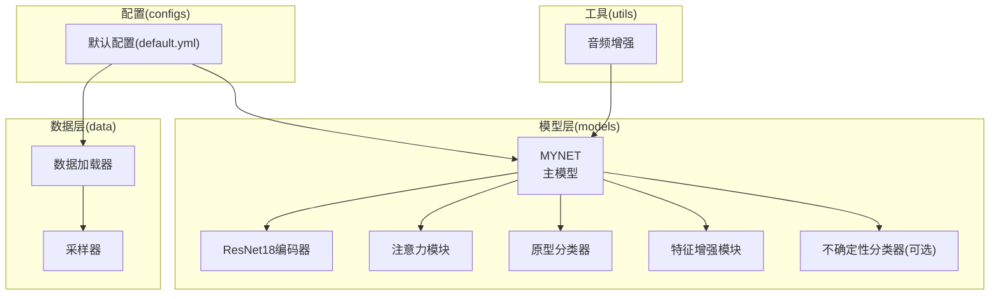
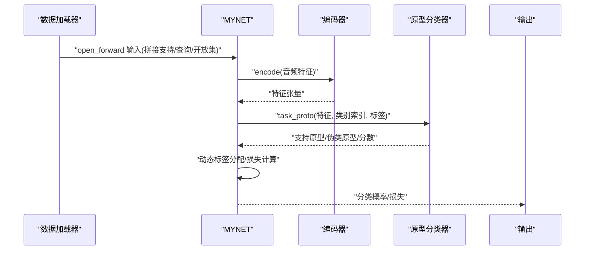
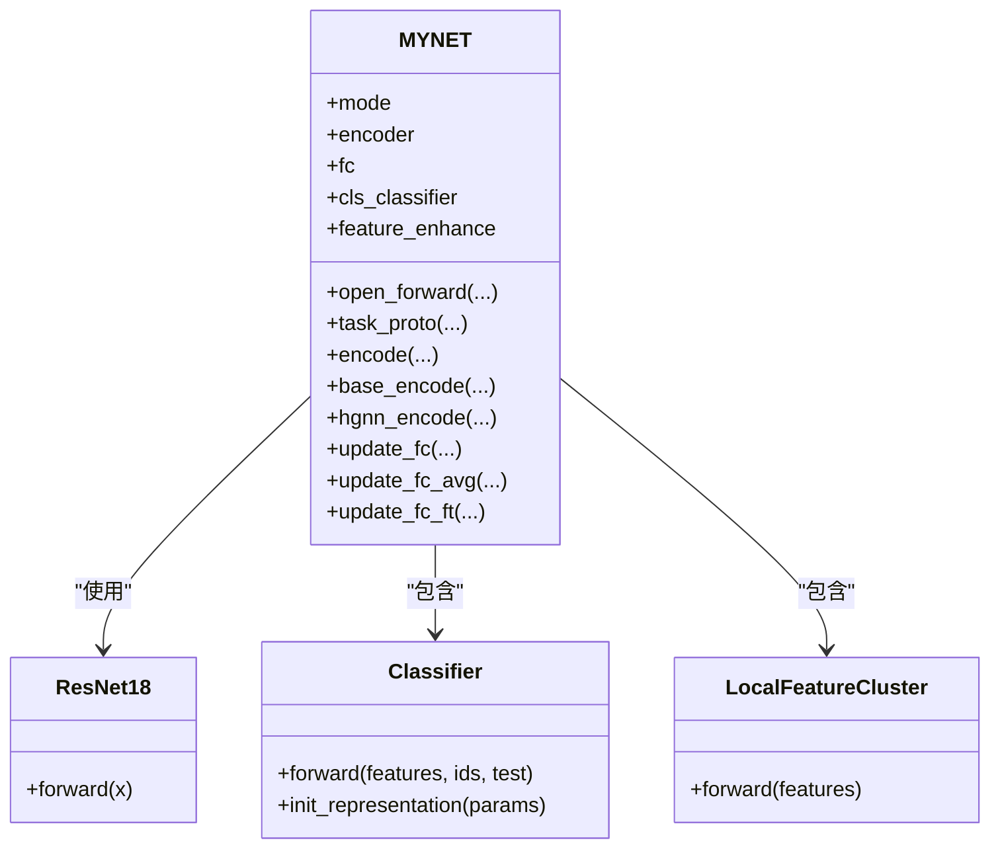
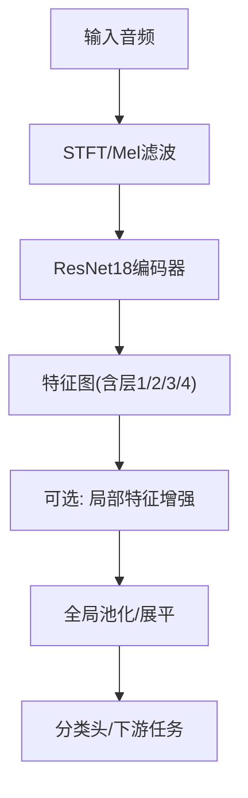
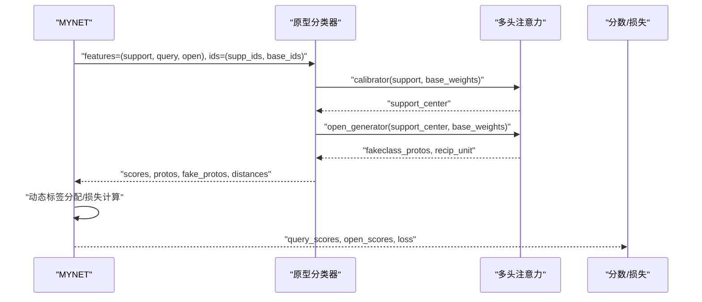
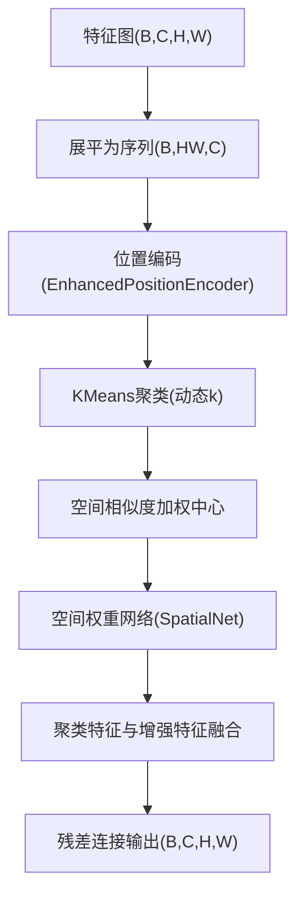
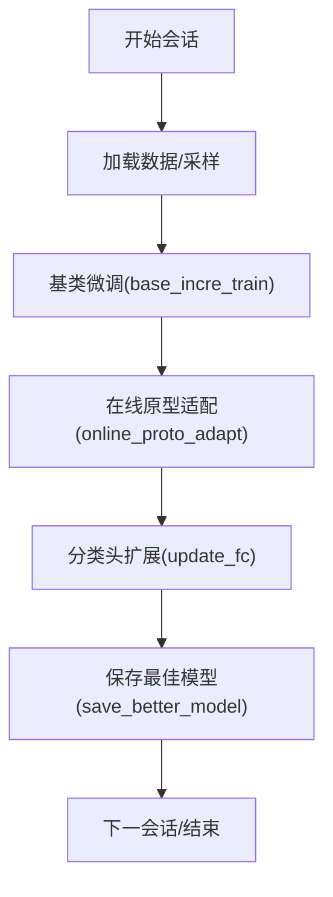
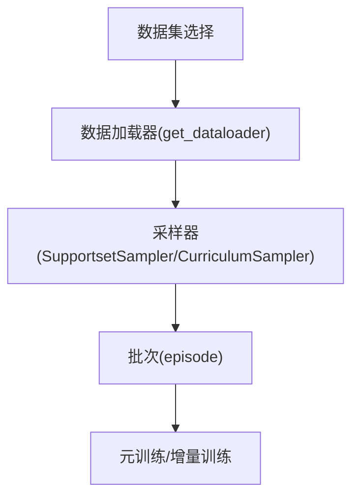
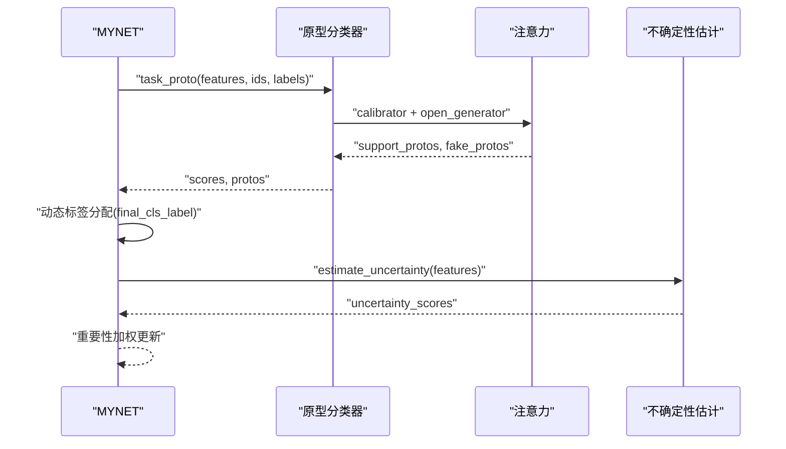
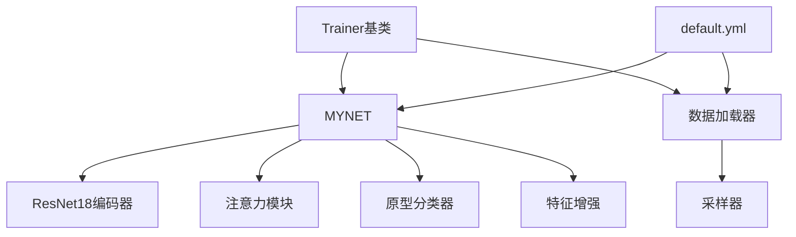

# 核心功能模块

<cite>
**本文引用的文件**
- [models/resnet18_encoder.py](file://models/resnet18_encoder.py)
- [models/resnet_enhancer.py](file://models/resnet_enhancer.py)
- [models/feature_enhancer.py](file://models/feature_enhancer.py)
- [models/base.py](file://models/base.py)
- [models/metatrainer.py](file://models/metatrainer.py)
- [models/AttnClassifier.py](file://models/AttnClassifier.py)
- [models/UClassifier.py](file://models/UClassifier.py)
- [models/baselines/base.py](file://models/baselines/base.py)
- [data/dataloader.py](file://data/dataloader.py)
- [data/sampler.py](file://data/sampler.py)
- [models/incremental_train_helper.py](file://models/incremental_train_helper.py)
- [network.py](file://network.py)
- [configs/default.yml](file://configs/default.yml)
- [utils/audio_augment.py](file://utils/audio_augment.py)
</cite>

## 目录
1. [简介](#简介)
2. [项目结构](#项目结构)
3. [核心组件](#核心组件)
4. [架构总览](#架构总览)
5. [详细组件分析](#详细组件分析)
6. [依赖分析](#依赖分析)
7. [性能考虑](#性能考虑)
8. [故障排查指南](#故障排查指南)
9. [结论](#结论)
10. [附录](#附录)

## 简介
本文件面向VAZE项目的核心功能模块，围绕MYNET主模型展开，系统阐述以下内容：
- MYNET主模型设计理念与实现细节：ResNet18编码器、注意力机制、特征增强模块
- 训练框架架构：基类设计、增量学习实现、模型保存机制
- 数据处理系统：多数据集支持能力与数据增强策略
- 原型学习系统：注意力融合与动态更新策略
- 代码示例与使用模式：模块间的协作关系与调用流程

## 项目结构
VAZE项目采用“模块化+分层”的组织方式：
- models：核心模型与训练器，包含编码器、分类器、增量训练辅助等
- data：数据加载与采样器，支持多数据集与课程学习
- configs：默认配置文件
- utils：工具与音频增强
- save/save_result：实验结果与中间产物存储

图表来源
- [network.py:18-504](file://network.py#L18-L504)
- [models/resnet18_encoder.py:240-334](file://models/resnet18_encoder.py#L240-L334)
- [models/resnet_enhancer.py:51-172](file://models/resnet_enhancer.py#L51-L172)
- [models/AttnClassifier.py:39-101](file://models/AttnClassifier.py#L39-L101)
- [data/dataloader.py:19-46](file://data/dataloader.py#L19-L46)
- [data/sampler.py:6-201](file://data/sampler.py#L6-L201)
- [configs/default.yml:1-88](file://configs/default.yml#L1-L88)
- [utils/audio_augment.py:4-31](file://utils/audio_augment.py#L4-L31)

章节来源
- [network.py:18-504](file://network.py#L18-L504)
- [data/dataloader.py:19-46](file://data/dataloader.py#L19-L46)
- [configs/default.yml:1-88](file://configs/default.yml#L1-L88)

## 核心组件
- MYNET主模型：封装编码器、注意力、原型分类器、特征增强与音频前端，支持多种模式（编码、元训练、增量等）
- ResNet18编码器：提供音频到特征的映射，支持预训练权重加载
- 注意力模块：多头注意力用于原型与查询的融合与打分
- 原型分类器：支持语义校准、负原型生成与余弦度量
- 特征增强模块：局部特征聚类与位置编码，提升空间感知
- 数据加载与采样：支持多数据集、课程学习与Episode采样
- 增量训练辅助：基类微调、在线原型适配与损失策略
- 不确定性估计：基于MC Dropout与核范数的不确定性度量（可选）

章节来源
- [network.py:18-504](file://network.py#L18-L504)
- [models/resnet18_encoder.py:240-334](file://models/resnet18_encoder.py#L240-L334)
- [models/resnet_enhancer.py:51-172](file://models/resnet_enhancer.py#L51-L172)
- [models/AttnClassifier.py:39-101](file://models/AttnClassifier.py#L39-L101)
- [data/dataloader.py:19-46](file://data/dataloader.py#L19-L46)
- [data/sampler.py:6-201](file://data/sampler.py#L6-L201)
- [models/incremental_train_helper.py:28-156](file://models/incremental_train_helper.py#L28-L156)
- [models/UClassifier.py:7-405](file://models/UClassifier.py#L7-L405)

## 架构总览
MYNET在不同模式下执行不同的前向流程：
- 编码模式：仅提取特征，便于下游任务
- 元训练模式：将支持/查询/开放集拼接，经编码后进入原型分类器，产出分类分数与损失
- 标准训练模式：通过分类器计算交叉熵损失
- 增量模式：替换/扩展分类头，结合原型与注意力进行微调

图表来源
- [network.py:102-151](file://network.py#L102-L151)
- [models/AttnClassifier.py:47-93](file://models/AttnClassifier.py#L47-L93)

章节来源
- [network.py:102-151](file://network.py#L102-L151)
- [models/AttnClassifier.py:47-93](file://models/AttnClassifier.py#L47-L93)

## 详细组件分析

### MYNET主模型
- 设计要点
  - 音频前端：STFT与Mel滤波器，SpecAugment增强
  - 编码器：ResNet18，支持预训练权重加载
  - 注意力：多头注意力用于原型与查询的融合
  - 原型分类：支持语义校准与负原型生成
  - 特征增强：局部特征聚类与位置编码
  - 模式切换：encoder/openmeta/_forward等模式
- 关键接口
  - open_forward：元训练模式的完整前向
  - task_proto：原型计算与动态标签分配
  - encode/base_encode/hgnn_encode：不同粒度的特征提取
  - update_fc/update_fc_avg/update_fc_ft：增量阶段分类头更新

图表来源
- [network.py:18-504](file://network.py#L18-L504)
- [models/resnet18_encoder.py:240-334](file://models/resnet18_encoder.py#L240-L334)
- [models/AttnClassifier.py:39-101](file://models/AttnClassifier.py#L39-L101)
- [models/resnet_enhancer.py:51-172](file://models/resnet_enhancer.py#L51-L172)

章节来源
- [network.py:18-504](file://network.py#L18-L504)

### ResNet18编码器
- 功能：构建ResNet18骨干网络，支持预训练权重加载与自定义分支
- 特性：模块化结构，支持不同block类型；提供预训练URL与下载逻辑
- 与MYNET协作：作为音频特征提取骨干，输出空间特征图

图表来源
- [models/resnet18_encoder.py:240-334](file://models/resnet18_encoder.py#L240-L334)
- [network.py:471-503](file://network.py#L471-L503)

章节来源
- [models/resnet18_encoder.py:240-334](file://models/resnet18_encoder.py#L240-L334)
- [network.py:471-503](file://network.py#L471-L503)

### 注意力机制与原型分类器
- 注意力模块：多头注意力用于原型与查询的融合，支持残差与层归一化
- 原型分类器：支持语义校准、负原型生成与余弦度量；提供动态标签分配
- 与MYNET协作：在元训练模式中计算支持/伪类原型与分类分数

图表来源
- [models/AttnClassifier.py:47-93](file://models/AttnClassifier.py#L47-L93)
- [models/AttnClassifier.py:121-185](file://models/AttnClassifier.py#L121-L185)
- [models/AttnClassifier.py:188-271](file://models/AttnClassifier.py#L188-L271)
- [models/AttnClassifier.py:274-369](file://models/AttnClassifier.py#L274-L369)

章节来源
- [models/AttnClassifier.py:47-93](file://models/AttnClassifier.py#L47-L93)
- [models/AttnClassifier.py:121-185](file://models/AttnClassifier.py#L121-L185)
- [models/AttnClassifier.py:188-271](file://models/AttnClassifier.py#L188-L271)
- [models/AttnClassifier.py:274-369](file://models/AttnClassifier.py#L274-L369)

### 特征增强模块
- 局部特征聚类：基于KMeans的空间位置相似度加权聚类，融合位置编码与空间权重
- 时间约束与时序注意：对展平特征序列进行LSTM与时序注意力聚合
- 与MYNET协作：在编码路径中插入局部特征增强，提升空间细节与全局结构的融合

图表来源
- [models/resnet_enhancer.py:51-172](file://models/resnet_enhancer.py#L51-L172)
- [models/feature_enhancer.py:27-93](file://models/feature_enhancer.py#L27-L93)

章节来源
- [models/resnet_enhancer.py:51-172](file://models/resnet_enhancer.py#L51-L172)
- [models/feature_enhancer.py:27-93](file://models/feature_enhancer.py#L27-L93)

### 训练框架与增量学习
- 基类设计：Trainer抽象基类统一训练/验证/测试流程、日志记录与模型保存
- 增量学习：基类微调、在线原型适配、分类头扩展与温度缩放
- 模型保存：按会话保存最佳模型与优化器状态

图表来源
- [models/base.py:27-254](file://models/base.py#L27-L254)
- [models/incremental_train_helper.py:28-156](file://models/incremental_train_helper.py#L28-L156)

章节来源
- [models/base.py:27-254](file://models/base.py#L27-L254)
- [models/incremental_train_helper.py:28-156](file://models/incremental_train_helper.py#L28-L156)

### 数据处理系统与多数据集支持
- 多数据集：FMC、NSynth、LibriSpeech、S2S等
- 采样策略：支持/查询采样、课程学习采样、增量采样
- 数据增强：SpecAugment、音频时移/音高扰动等

图表来源
- [data/dataloader.py:19-46](file://data/dataloader.py#L19-L46)
- [data/dataloader.py:206-254](file://data/dataloader.py#L206-L254)
- [data/sampler.py:97-140](file://data/sampler.py#L97-L140)
- [data/sampler.py:141-201](file://data/sampler.py#L141-L201)
- [utils/audio_augment.py:4-31](file://utils/audio_augment.py#L4-L31)

章节来源
- [data/dataloader.py:19-46](file://data/dataloader.py#L19-L46)
- [data/dataloader.py:206-254](file://data/dataloader.py#L206-L254)
- [data/sampler.py:97-140](file://data/sampler.py#L97-L140)
- [data/sampler.py:141-201](file://data/sampler.py#L141-L201)
- [utils/audio_augment.py:4-31](file://utils/audio_augment.py#L4-L31)

### 原型学习系统与动态更新
- 动态标签分配：根据未知样本与已知类的正类分数，为其分配对应负原型
- 注意力融合：支持原型与查询的多头注意力融合，提升判别力
- 不确定性估计：基于MC Dropout与核范数的不确定性度量，指导增量更新

图表来源
- [network.py:153-202](file://network.py#L153-L202)
- [models/AttnClassifier.py:47-93](file://models/AttnClassifier.py#L47-L93)
- [models/UClassifier.py:42-122](file://models/UClassifier.py#L42-L122)

章节来源
- [network.py:153-202](file://network.py#L153-L202)
- [models/AttnClassifier.py:47-93](file://models/AttnClassifier.py#L47-L93)
- [models/UClassifier.py:42-122](file://models/UClassifier.py#L42-L122)

## 依赖分析
- MYNET依赖ResNet18编码器、注意力模块、原型分类器与特征增强模块
- 数据层依赖采样器与多数据集实现
- 训练层依赖基类Trainer与增量训练辅助模块
- 配置文件贯穿训练/数据/模型参数

图表来源
- [network.py:18-504](file://network.py#L18-L504)
- [data/dataloader.py:19-46](file://data/dataloader.py#L19-L46)
- [data/sampler.py:6-201](file://data/sampler.py#L6-L201)
- [models/base.py:27-254](file://models/base.py#L27-L254)
- [configs/default.yml:1-88](file://configs/default.yml#L1-L88)

章节来源
- [network.py:18-504](file://network.py#L18-L504)
- [data/dataloader.py:19-46](file://data/dataloader.py#L19-L46)
- [data/sampler.py:6-201](file://data/sampler.py#L6-L201)
- [models/base.py:27-254](file://models/base.py#L27-L254)
- [configs/default.yml:1-88](file://configs/default.yml#L1-L88)

## 性能考虑
- 计算复杂度
  - 注意力模块：O((N+N')·D)（N为原型数，N'为查询数，D为特征维）
  - KMeans聚类：O(B·HW·k·I·C)，其中I为迭代次数
  - 余弦相似度：O(B·(N+N')·D)
- 内存优化
  - 使用自适应池化与展平，避免大矩阵操作
  - 在线原型适配与增量扩展，减少显存峰值
- 并行与加速
  - 数据加载使用多进程与pin_memory
  - 采样器支持顺序/随机采样，平衡收敛与效率

## 故障排查指南
- 模式错误导致崩溃
  - 症状：训练/推理模式混用
  - 处理：确保在不确定性估计前后恢复原始模式
- 维度不匹配
  - 症状：聚类/注意力/融合时维度异常
  - 处理：检查特征图尺寸与位置编码通道数一致性
- 学习率与调度
  - 症状：收敛缓慢或震荡
  - 处理：检查配置中的学习率策略与步长
- 数据集/采样问题
  - 症状：Episode采样类别不足
  - 处理：确认采样器的活跃类别集合与n_cls设置

章节来源
- [network.py:50-101](file://network.py#L50-L101)
- [models/resnet_enhancer.py:162-172](file://models/resnet_enhancer.py#L162-L172)
- [configs/default.yml:22-41](file://configs/default.yml#L22-L41)
- [data/sampler.py:141-201](file://data/sampler.py#L141-L201)

## 结论
VAZE通过MYNET主模型整合ResNet18编码器、注意力机制与特征增强，构建了面向增量与开放集学习的统一框架。配合多数据集支持、课程学习采样与不确定性估计，实现了稳健的原型学习与动态更新。建议在实际部署中关注模式切换与维度一致性，合理配置学习率与采样策略以获得最佳性能。

## 附录
- 使用模式参考
  - 元训练：设置mode为openmeta，传入拼接后的支持/查询/开放集数据
  - 增量：先基类微调，再在线原型适配，最后扩展分类头
  - 数据加载：根据数据集选择对应的Dataset与采样器
- 关键配置项
  - way/shot/query：Episode采样参数
  - epochs：标准/元训练/增量等阶段的训练轮数
  - lr/optimizer：学习率与优化器配置
  - extractor：音频特征提取参数

章节来源
- [configs/default.yml:1-88](file://configs/default.yml#L1-L88)
- [models/metatrainer.py:17-85](file://models/metatrainer.py#L17-L85)
- [models/incremental_train_helper.py:28-156](file://models/incremental_train_helper.py#L28-L156)
- [data/dataloader.py:19-46](file://data/dataloader.py#L19-L46)