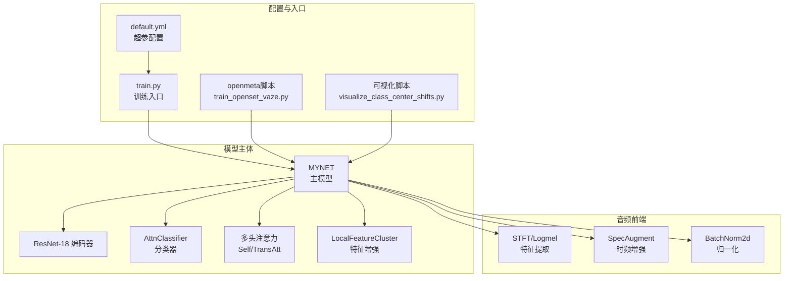
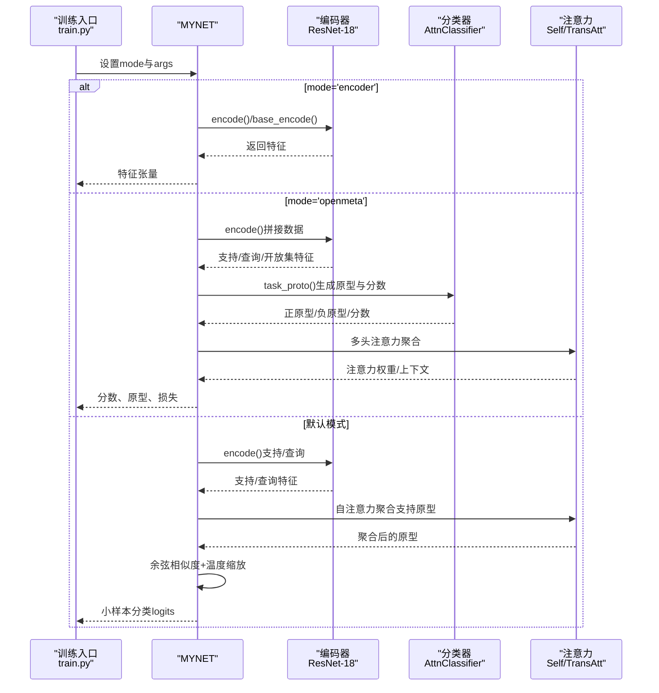
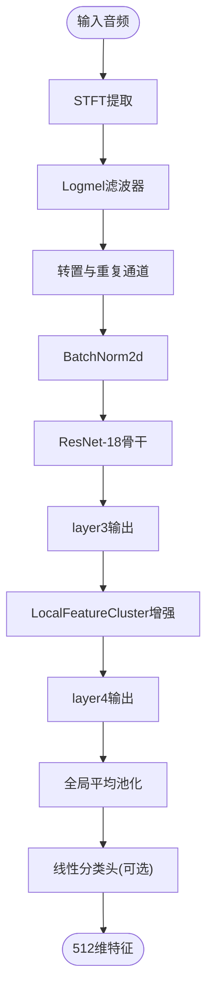
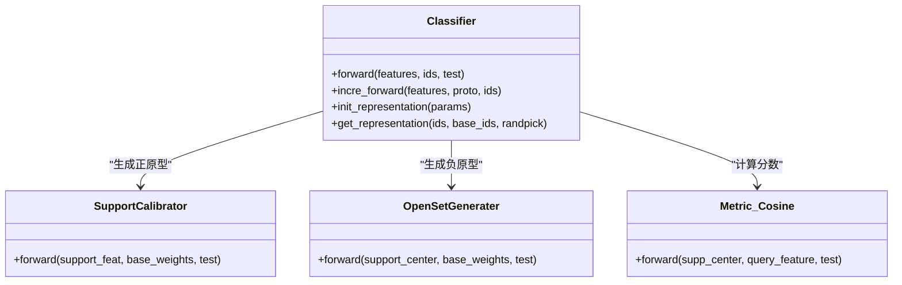
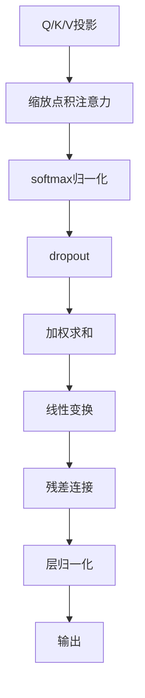
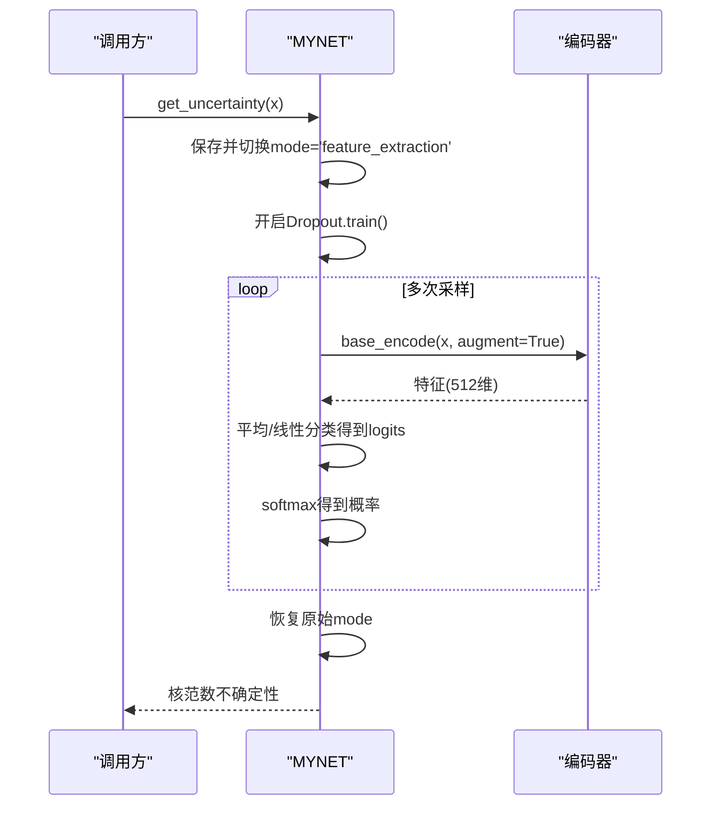
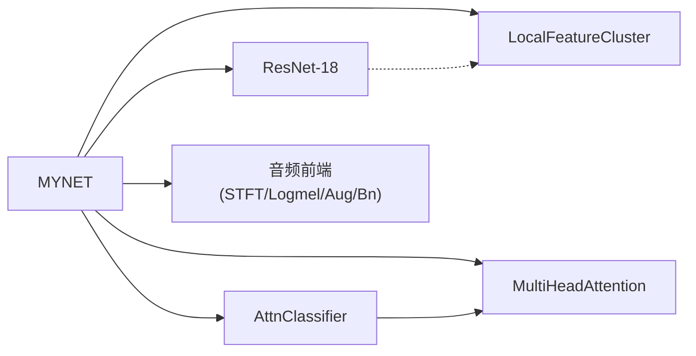

# MYNET主模型架构

<cite>
**本文档引用的文件**
- [network.py](file://network.py)
- [AttnClassifier.py](file://models/AttnClassifier.py)
- [resnet18_encoder.py](file://models/resnet18_encoder.py)
- [resnet_enhancer.py](file://models/resnet_enhancer.py)
- [default.yml](file://configs/default.yml)
- [train.py](file://train.py)
- [train_openset_vaze.py](file://train_openset_vaze.py)
- [visualize_class_center_shifts.py](file://scripts/visualize_class_center_shifts.py)
</cite>

## 目录
1. [简介](#简介)
2. [项目结构](#项目结构)
3. [核心组件](#核心组件)
4. [架构总览](#架构总览)
5. [详细组件分析](#详细组件分析)
6. [依赖关系分析](#依赖关系分析)
7. [性能考量](#性能考量)
8. [故障排查指南](#故障排查指南)
9. [结论](#结论)
10. [附录](#附录)

## 简介
本文件系统性梳理MYNET主模型架构，围绕初始化参数、模块组件配置、前向传播流程设计展开，并重点对比三种工作模式（encoder、openmeta、cluster）的实现差异与适用场景。文档还解释模型层次结构中编码器、分类器、注意力机制等核心组件的职责分工，提供实例化与参数配置的参考路径，帮助读者快速理解并正确使用MYNET。

## 项目结构
MYNET位于network.py中，主要依赖以下模块：
- 编码器：resnet18_encoder.py中的ResNet-18骨干网络，负责从音频谱图提取特征
- 分类器：AttnClassifier.py中的Classifier模块，包含支持原型校准与负原型生成
- 注意力机制：network.py内定义的MultiHeadAttention与ScaledDotProductAttention
- 特征增强：resnet_enhancer.py中的LocalFeatureCluster，用于中间层特征的空间聚类增强
- 配置：configs/default.yml提供训练与网络超参数默认值
- 训练入口：train.py负责模型实例化、模式切换与训练流程调度

图表来源
- [network.py:18-50](file://network.py#L18-L50)
- [resnet18_encoder.py:240-334](file://models/resnet18_encoder.py#L240-L334)
- [AttnClassifier.py:38-93](file://models/AttnClassifier.py#L38-L93)
- [resnet_enhancer.py:51-160](file://models/resnet_enhancer.py#L51-L160)
- [default.yml:42-84](file://configs/default.yml#L42-L84)
- [train.py:800-821](file://train.py#L800-L821)
- [train_openset_vaze.py:31-83](file://train_openset_vaze.py#L31-L83)
- [visualize_class_center_shifts.py:49-78](file://scripts/visualize_class_center_shifts.py#L49-L78)

章节来源
- [network.py:18-50](file://network.py#L18-L50)
- [resnet18_encoder.py:240-334](file://models/resnet18_encoder.py#L240-L334)
- [AttnClassifier.py:38-93](file://models/AttnClassifier.py#L38-L93)
- [resnet_enhancer.py:51-160](file://models/resnet_enhancer.py#L51-L160)
- [default.yml:42-84](file://configs/default.yml#L42-L84)
- [train.py:800-821](file://train.py#L800-L821)

## 核心组件
- 初始化参数与模式
  - mode参数决定MYNET的工作模式：'encoder'、'openmeta'或默认（元学习/小样本推理）
  - args对象承载训练与网络超参，如温度系数、类别数、批次规模等
- 编码器
  - 使用预训练ResNet-18作为骨干，输出512维特征
  - 支持多种编码路径：encode/base_encode/hgnn_encode，分别用于分类、增强与特定任务
- 分类器
  - AttnClassifier提供支持原型校准与负原型生成，结合余弦相似度度量
  - 支持噪声注入与语义融合门控，提升原型稳定性与泛化
- 注意力机制
  - 自注意力用于原型聚合，跨注意力用于查询与支持之间的交互
- 特征增强
  - LocalFeatureCluster在中间层引入空间位置编码与KMeans聚类，融合局部细节与全局结构
- 音频前端
  - STFT/Logmel提取频谱特征，SpecAugment与时频抖动增强鲁棒性，BN归一化稳定训练

章节来源
- [network.py:20-36](file://network.py#L20-L36)
- [resnet18_encoder.py:349-358](file://models/resnet18_encoder.py#L349-L358)
- [AttnClassifier.py:38-93](file://models/AttnClassifier.py#L38-L93)
- [resnet_enhancer.py:51-160](file://models/resnet_enhancer.py#L51-L160)
- [network.py:326-353](file://network.py#L326-L353)

## 架构总览
MYNET整体采用“音频前端-编码器-分类器-注意力”的流水线式设计。前向传播根据mode选择不同分支：
- encoder模式：仅执行编码，返回512维特征
- openmeta模式：执行open-set元学习前向，产出支持/查询/开放集分数、原型与损失
- 默认模式：执行小样本推理（支持集均值+注意力聚合+余弦相似度）

图表来源
- [network.py:37-49](file://network.py#L37-L49)
- [network.py:102-151](file://network.py#L102-L151)
- [network.py:225-255](file://network.py#L225-L255)
- [resnet18_encoder.py:317-334](file://models/resnet18_encoder.py#L317-L334)
- [AttnClassifier.py:47-93](file://models/AttnClassifier.py#L47-L93)

章节来源
- [network.py:37-49](file://network.py#L37-L49)
- [network.py:102-151](file://network.py#L102-L151)
- [network.py:225-255](file://network.py#L225-L255)

## 详细组件分析

### MYNET类与初始化
- 关键成员
  - encoder：预训练ResNet-18骨干
  - dropout：0.3的Dropout，用于不确定性估计时的MC-Dropout
  - fc：线性分类头，将512维特征映射到类别空间
  - self_attn/transatt_proto：多头注意力模块
  - cls_classifier：AttnClassifier分类器
  - feature_enhance：LocalFeatureCluster中间层特征增强
  - set_module_for_audio：构建音频前端（STFT/Logmel/SpecAugment/BatchNorm）
- 模式控制
  - forward根据mode分派到不同分支：encoder/openmeta/默认小样本推理

章节来源
- [network.py:20-36](file://network.py#L20-L36)
- [network.py:37-49](file://network.py#L37-L49)

### 编码器与音频前端
- 编码路径
  - encode/base_encode/hgnn_encode三套路径，分别面向分类、增强与特定任务
  - 均包含Mel频谱提取、BN归一化与ResNet-18骨干
- 特征增强
  - LocalFeatureCluster在layer3输出处引入位置编码与KMeans聚类，融合空间权重，保留残差连接

图表来源
- [network.py:471-518](file://network.py#L471-L518)
- [resnet_enhancer.py:51-160](file://models/resnet_enhancer.py#L51-L160)
- [resnet18_encoder.py:240-334](file://models/resnet18_encoder.py#L240-L334)

章节来源
- [network.py:471-518](file://network.py#L471-L518)
- [resnet_enhancer.py:51-160](file://models/resnet_enhancer.py#L51-L160)
- [resnet18_encoder.py:240-334](file://models/resnet18_encoder.py#L240-L334)

### 分类器与原型生成
- SupportCalibrator：对支持集特征进行原型校准，可选语义融合门控
- OpenSetGenerater：基于支持原型生成负原型（伪类），支持多种聚合策略
- Metric_Cosine：余弦相似度度量，支持温度缩放

图表来源
- [AttnClassifier.py:38-118](file://models/AttnClassifier.py#L38-L118)
- [AttnClassifier.py:121-185](file://models/AttnClassifier.py#L121-L185)
- [AttnClassifier.py:188-271](file://models/AttnClassifier.py#L188-L271)
- [AttnClassifier.py:352-368](file://models/AttnClassifier.py#L352-L368)

章节来源
- [AttnClassifier.py:38-118](file://models/AttnClassifier.py#L38-L118)
- [AttnClassifier.py:121-185](file://models/AttnClassifier.py#L121-L185)
- [AttnClassifier.py:188-271](file://models/AttnClassifier.py#L188-L271)
- [AttnClassifier.py:352-368](file://models/AttnClassifier.py#L352-L368)

### 注意力机制
- MultiHeadAttention：多头自注意力，支持残差与层归一化
- ScaledDotProductAttention：缩放点积注意力，softmax与dropout
- 在MYNET中用于原型聚合与查询-支持交互

图表来源
- [network.py:538-584](file://network.py#L538-L584)
- [network.py:519-535](file://network.py#L519-L535)

章节来源
- [network.py:538-584](file://network.py#L538-L584)
- [network.py:519-535](file://network.py#L519-L535)

### 不确定性估计（MC-Dropout）
- 临时切换mode至'feature_extraction'，强制编码器仅返回特征
- 开启Dropout进行多次前向采样，计算核范数作为不确定性指标
- 注意：结束后需恢复原始mode，避免训练异常

图表来源
- [network.py:50-101](file://network.py#L50-L101)

章节来源
- [network.py:50-101](file://network.py#L50-L101)

### 工作模式详解与使用场景

- encoder模式
  - 用途：仅做特征提取，返回512维特征，常用于预训练或下游任务
  - 实现：forward直接调用encode/base_encode
  - 应用：基础训练、特征缓存、可视化

- openmeta模式
  - 用途：开放集元学习，同时处理已知类与未知类样本
  - 实现：open_forward拼接支持/查询/开放集特征，调用task_proto生成动态标签与损失
  - 场景：增量学习、开放集识别、未知类检测

- cluster模式（预留）
  - 说明：源码中存在注释化的cluster分支，当前未启用
  - 建议：若启用，可用于聚类引导的特征学习或原型更新

章节来源
- [network.py:37-49](file://network.py#L37-L49)
- [network.py:102-151](file://network.py#L102-L151)

### 参数配置与实例化示例
- 基本实例化
  - 在训练入口中，通过MYNET(args, mode='encoder')创建模型
  - 训练过程中根据阶段切换mode，如'encoder'、args.network.new_mode
- 关键超参
  - 温度系数：args.network.temperature
  - 新模式：args.network.new_mode（如'ft_cos'、'cos'）
  - 分类头：fc将512维映射到类别数（默认100）
- 配置文件
  - configs/default.yml提供训练、网络、优化器、学习率调度等默认值

章节来源
- [train.py:800-821](file://train.py#L800-L821)
- [train.py:854-856](file://train.py#L854-L856)
- [default.yml:42-84](file://configs/default.yml#L42-L84)

## 依赖关系分析
MYNET与各模块的耦合关系如下：
- 低耦合：音频前端（STFT/Logmel/SpecAugment/BatchNorm）独立封装，便于替换
- 中等耦合：分类器与注意力模块通过接口约定协作，支持灵活组合
- 高内聚：编码器与特征增强在中间层协同，形成稳定的特征表示

图表来源
- [network.py:24-36](file://network.py#L24-L36)
- [resnet18_encoder.py:240-334](file://models/resnet18_encoder.py#L240-L334)
- [AttnClassifier.py:38-93](file://models/AttnClassifier.py#L38-L93)
- [resnet_enhancer.py:51-160](file://models/resnet_enhancer.py#L51-L160)

章节来源
- [network.py:24-36](file://network.py#L24-L36)
- [resnet18_encoder.py:240-334](file://models/resnet18_encoder.py#L240-L334)
- [AttnClassifier.py:38-93](file://models/AttnClassifier.py#L38-L93)
- [resnet_enhancer.py:51-160](file://models/resnet_enhancer.py#L51-L160)

## 性能考量
- 计算复杂度
  - 编码器：ResNet-18骨干的卷积与池化操作，特征维度512×H×W
  - 注意力：多头注意力的O(D^2)或O(N^2)复杂度，取决于序列长度
  - 分类器：余弦相似度与温度缩放，计算开销较小
- 内存占用
  - 中间层特征（如layer3）较大，LocalFeatureCluster引入聚类中心与掩码，注意显存管理
- 优化建议
  - 合理设置温度系数与批次规模，平衡收敛速度与稳定性
  - 在不确定场景下谨慎使用Dropout，避免过度扰动

## 故障排查指南
- 模式切换导致行为异常
  - 症状：训练时出现特征维度不符或分类头权重未更新
  - 排查：确认forward中mode分支逻辑，必要时调用get_uncertainty后恢复原始mode
- 分类头维度不匹配
  - 症状：logits形状与类别数不一致
  - 排查：检查args.num_base与fc输出维度，确保初始化与更新流程正确
- 开放集损失异常
  - 症状：open-hinge损失为零或NaN
  - 排查：检查距离阈值margin与原型距离，确保动态标签分配逻辑正确

章节来源
- [network.py:50-101](file://network.py#L50-L101)
- [network.py:102-151](file://network.py#L102-L151)
- [network.py:153-202](file://network.py#L153-L202)

## 结论
MYNET以ResNet-18为核心编码器，结合注意力机制与开放集分类器，实现了从音频到特征再到分类的完整链路。通过mode参数灵活切换encoder/openmeta/default三种工作模式，满足预训练、元学习与增量学习等多种场景。LocalFeatureCluster与语义融合门控进一步增强了特征表达能力。建议在实际部署中关注模式切换的正确性、分类头维度一致性与超参配置的合理性，以获得稳定且高效的性能表现。

## 附录

### 模式切换与实例化参考路径
- 模式切换
  - [train.py:854-856](file://train.py#L854-L856)
  - [network.py:37-49](file://network.py#L37-L49)
- 实例化
  - [train.py:800-803](file://train.py#L800-L803)
- 不确定性估计
  - [network.py:50-101](file://network.py#L50-L101)

### 配置文件字段参考
- 网络超参
  - [default.yml:42-46](file://configs/default.yml#L42-L46)
- 数据加载与优化器
  - [default.yml:57-60](file://configs/default.yml#L57-L60)
  - [default.yml:39-41](file://configs/default.yml#L39-L41)