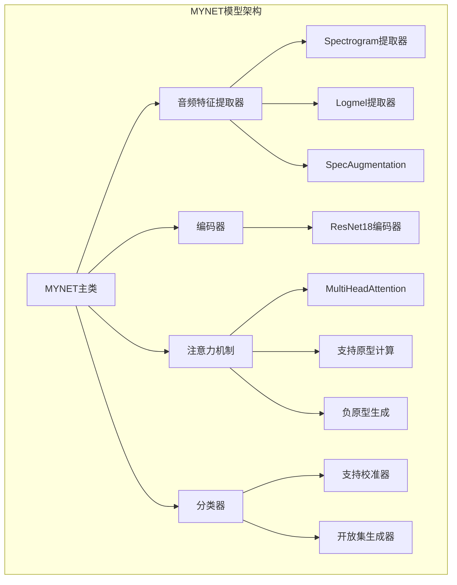
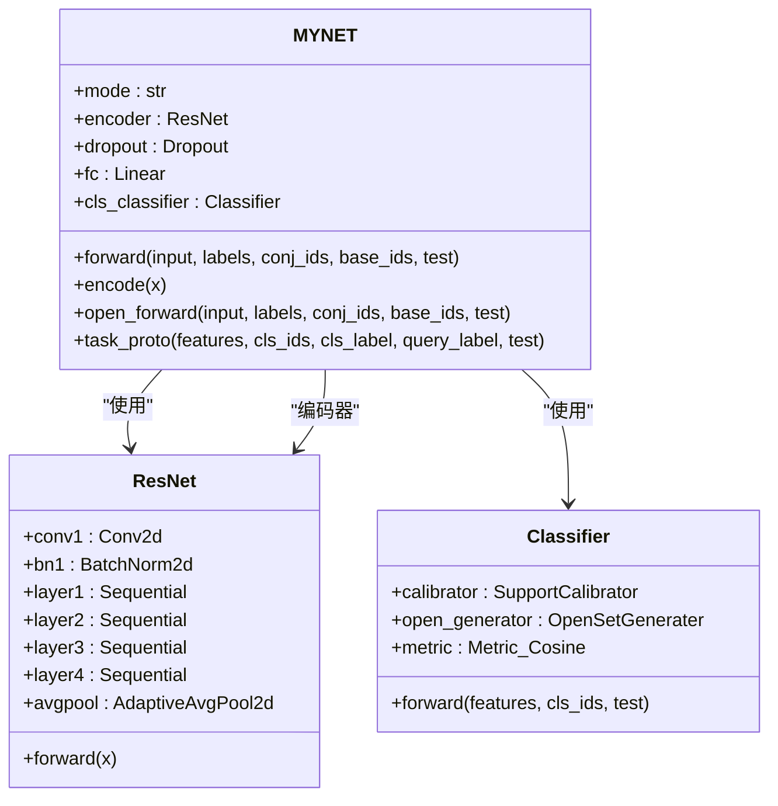
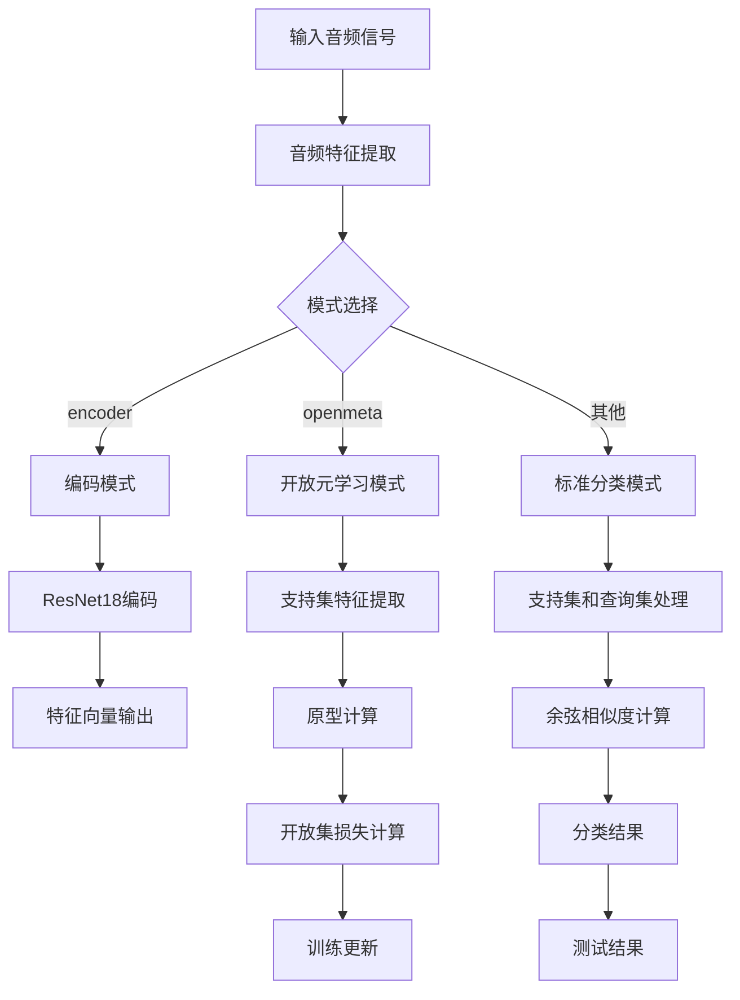
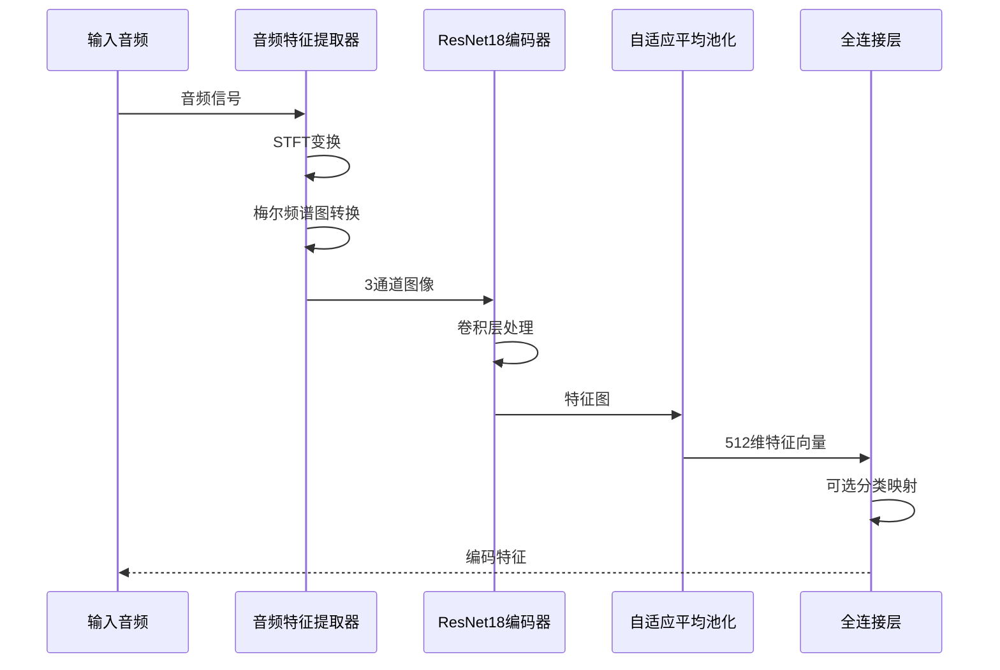
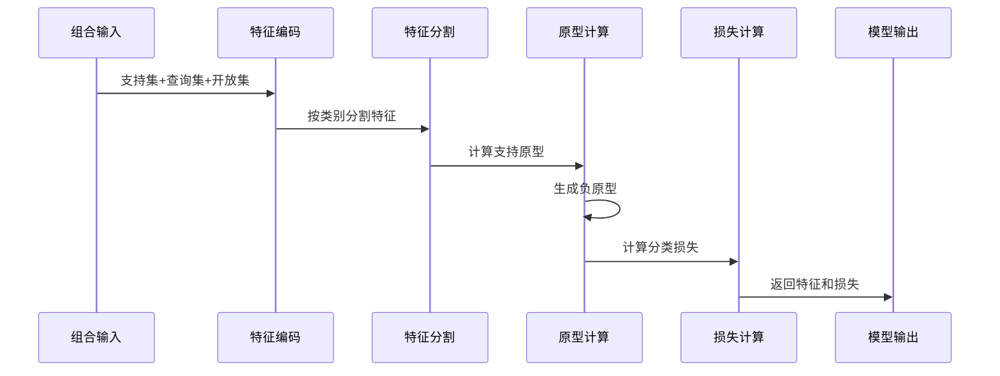
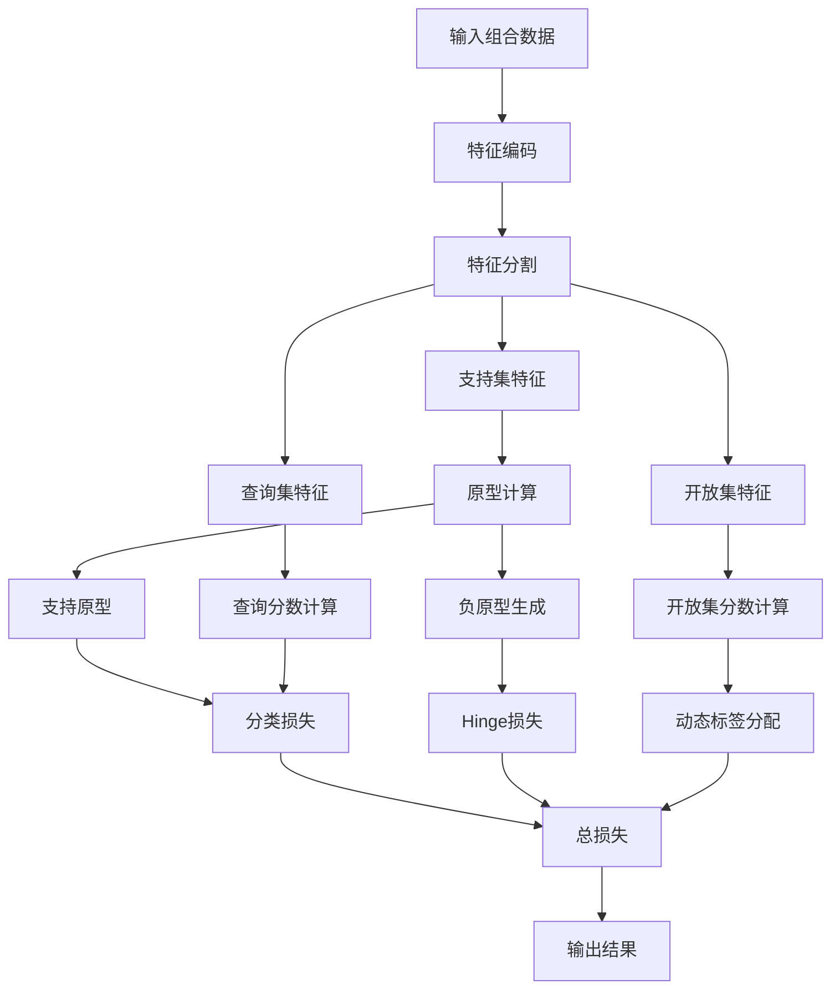
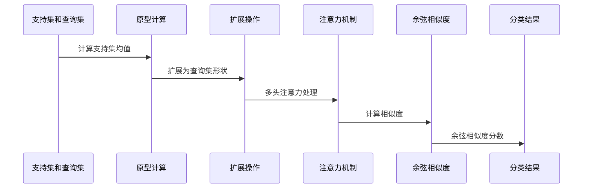
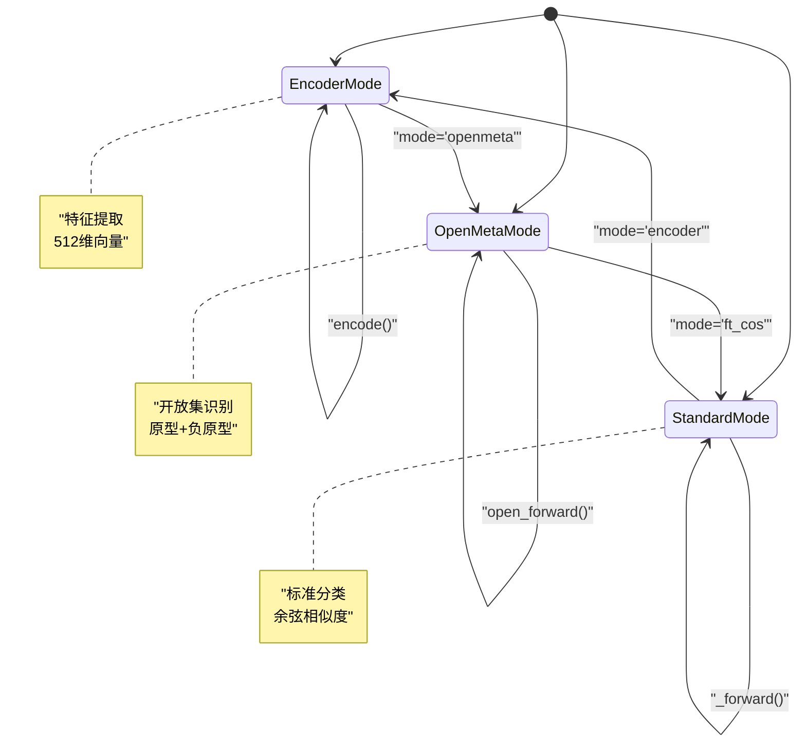
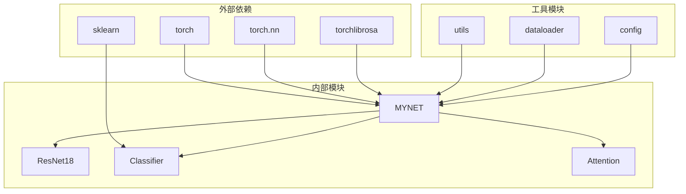

# 前向传播流程

<cite>
**本文档引用的文件**
- [network.py](file://network.py)
- [resnet18_encoder.py](file://models/resnet18_encoder.py)
- [AttnClassifier.py](file://models/AttnClassifier.py)
- [dataloader.py](file://data/dataloader.py)
- [default.yml](file://configs/default.yml)
- [train.py](file://train.py)
- [test.py](file://test.py)
</cite>

## 目录
1. [简介](#简介)
2. [项目结构](#项目结构)
3. [核心组件](#核心组件)
4. [架构概览](#架构概览)
5. [详细组件分析](#详细组件分析)
6. [依赖关系分析](#依赖关系分析)
7. [性能考虑](#性能考虑)
8. [故障排除指南](#故障排除指南)
9. [结论](#结论)

## 简介

本文档详细解释了MYNET模型的三种主要前向传播模式：encoder模式、openmeta模式、标准分类模式。这些模式代表了不同的应用场景和处理流程，具有独特的数据流向、中间特征变换和输出结果格式。文档将深入分析每种模式的实现差异、切换机制、状态管理和内存优化策略，并提供具体的使用示例。

## 项目结构

MYNET模型位于`network.py`文件中，是一个继承自`nn.Module`的复杂神经网络架构。该模型集成了多种功能模块，包括音频特征提取、注意力机制、分类器等。

**图表来源**
- [network.py:18-36](file://network.py#L18-L36)
- [resnet18_encoder.py:240-334](file://models/resnet18_encoder.py#L240-L334)

**章节来源**
- [network.py:18-36](file://network.py#L18-L36)
- [resnet18_encoder.py:240-334](file://models/resnet18_encoder.py#L240-L334)

## 核心组件

MYNET模型的核心组件包括：

### 主要组件概述

1. **音频特征提取模块**：负责将音频信号转换为梅尔频谱图
2. **ResNet18编码器**：提取高级特征表示
3. **注意力机制**：实现多头注意力计算
4. **分类器**：处理支持集和查询集的分类任务
5. **模式管理系统**：控制不同的前向传播模式

### 组件交互关系

**图表来源**
- [network.py:18-36](file://network.py#L18-L36)
- [resnet18_encoder.py:240-334](file://models/resnet18_encoder.py#L240-L334)
- [AttnClassifier.py:39-93](file://models/AttnClassifier.py#L39-L93)

**章节来源**
- [network.py:18-36](file://network.py#L18-L36)
- [resnet18_encoder.py:240-334](file://models/resnet18_encoder.py#L240-L334)
- [AttnClassifier.py:39-93](file://models/AttnClassifier.py#L39-L93)

## 架构概览

MYNET模型采用模块化设计，支持三种不同的前向传播模式：

**图表来源**
- [network.py:37-49](file://network.py#L37-L49)
- [network.py:102-151](file://network.py#L102-L151)

## 详细组件分析

### Encoder模式

Encoder模式是最简单的模式，主要用于特征提取和编码。

#### 数据流分析

**图表来源**
- [network.py:471-485](file://network.py#L471-L485)
- [network.py:486-503](file://network.py#L486-L503)

#### 实现特点

- **输入格式**：原始音频波形
- **输出格式**：512维特征向量
- **处理流程**：STFT → Logmel → ResNet18 → 平均池化 → 特征向量
- **应用场景**：特征提取、相似度计算、下游任务

**章节来源**
- [network.py:471-485](file://network.py#L471-L485)
- [network.py:486-503](file://network.py#L486-L503)

### OpenMeta模式

OpenMeta模式实现了开放集零样本识别的复杂前向传播流程。

#### 数据流分析

**图表来源**
- [network.py:102-151](file://network.py#L102-L151)
- [network.py:153-202](file://network.py#L153-L202)

#### 复杂逻辑流程

**图表来源**
- [network.py:102-151](file://network.py#L102-L151)
- [network.py:153-202](file://network.py#L153-L202)

#### 关键算法实现

1. **动态标签分配**：根据开放集样本与已知类别的相似度动态生成标签
2. **原型生成**：使用支持集特征生成正原型和负原型
3. **损失函数**：结合交叉熵损失和Hinge损失

**章节来源**
- [network.py:102-151](file://network.py#L102-L151)
- [network.py:153-202](file://network.py#L153-L202)

### 标准分类模式

标准分类模式处理传统的监督学习任务。

#### 数据流分析

**图表来源**
- [network.py:225-255](file://network.py#L225-L255)

#### 实现特点

- **输入格式**：支持集和查询集的嵌入向量
- **处理流程**：原型计算 → 注意力机制 → 余弦相似度
- **输出格式**：分类分数矩阵
- **应用场景**：少样本学习、元学习

**章节来源**
- [network.py:225-255](file://network.py#L225-L255)

### 模式切换机制

MYNET模型通过`mode`参数控制不同的前向传播模式：

**图表来源**
- [network.py:37-49](file://network.py#L37-L49)
- [train.py:854](file://train.py#L854)

#### 状态管理策略

1. **临时模式切换**：在不确定性估计时临时切换到`feature_extraction`模式
2. **持久模式设置**：通过构造函数设置初始模式
3. **运行时模式更新**：在训练过程中动态更新模式

**章节来源**
- [network.py:37-49](file://network.py#L37-L49)
- [network.py:50-101](file://network.py#L50-L101)
- [train.py:854](file://train.py#L854)

### 内存优化策略

MYNET模型采用了多种内存优化技术：

1. **特征缓存**：在不同模式下重用中间特征
2. **批量处理**：支持批量特征提取和处理
3. **动态内存管理**：根据模式需求调整内存使用
4. **设备迁移**：智能地在CPU和GPU之间迁移数据

## 依赖关系分析

MYNET模型的依赖关系如下：

**图表来源**
- [network.py:1-17](file://network.py#L1-L17)
- [resnet18_encoder.py:1-16](file://models/resnet18_encoder.py#L1-L16)

**章节来源**
- [network.py:1-17](file://network.py#L1-L17)
- [resnet18_encoder.py:1-16](file://models/resnet18_encoder.py#L1-L16)

## 性能考虑

### 计算复杂度分析

1. **Encoder模式**：O(T × F × C) - T为时间步数，F为频率bin数，C为通道数
2. **OpenMeta模式**：O(N × D × K) - N为样本数，D为特征维度，K为原型数量
3. **标准分类模式**：O(W × Q × D) - W为类别数，Q为查询样本数，D为特征维度

### 内存使用优化

1. **特征图池化**：使用自适应平均池化减少特征维度
2. **批处理优化**：合理设置批次大小平衡内存和速度
3. **半精度训练**：在支持的硬件上启用混合精度

## 故障排除指南

### 常见问题及解决方案

1. **模式切换错误**
   - 症状：模型在不同模式间切换时出现异常
   - 解决方案：确保在切换前后正确设置`mode`参数

2. **内存不足**
   - 症状：GPU内存溢出
   - 解决方案：减小批次大小或使用更高效的特征提取方法

3. **特征维度不匹配**
   - 症状：张量维度错误
   - 解决方案：检查输入数据的预处理和特征提取步骤

**章节来源**
- [network.py:50-101](file://network.py#L50-L101)
- [train.py:854](file://train.py#L854)

## 结论

MYNET模型通过其灵活的模式系统实现了多种前向传播流程，每种模式都有其特定的应用场景和优势。Encoder模式专注于特征提取，OpenMeta模式处理复杂的开放集识别任务，标准分类模式提供传统的监督学习能力。通过合理选择和切换模式，可以针对不同的任务需求优化性能和效率。

模型的设计充分考虑了内存优化和计算效率，在保持功能完整性的同时提供了良好的扩展性。对于开发者来说，理解不同模式的工作原理和适用场景是有效使用MYNET模型的关键。