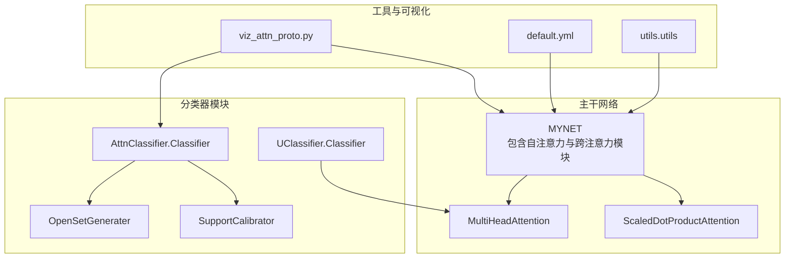
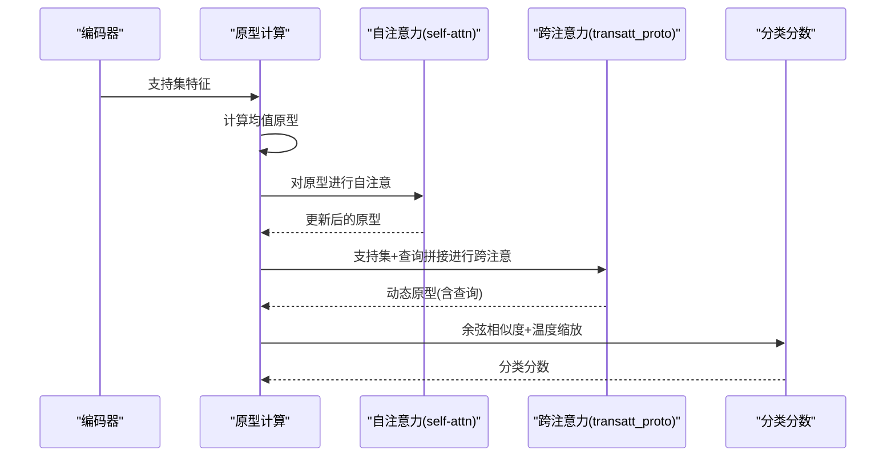
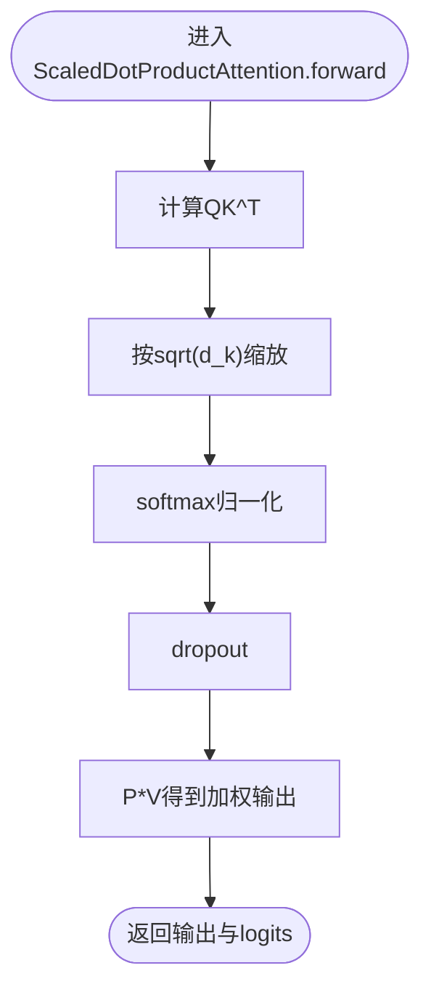
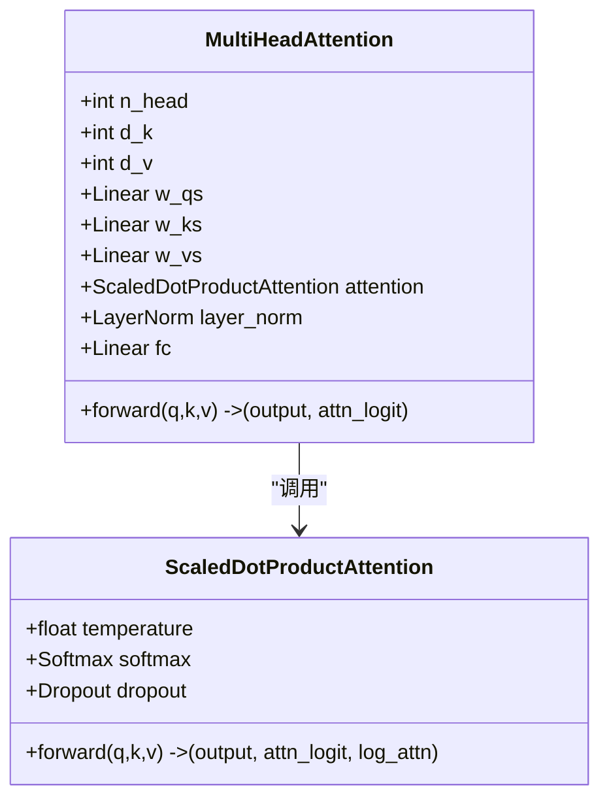
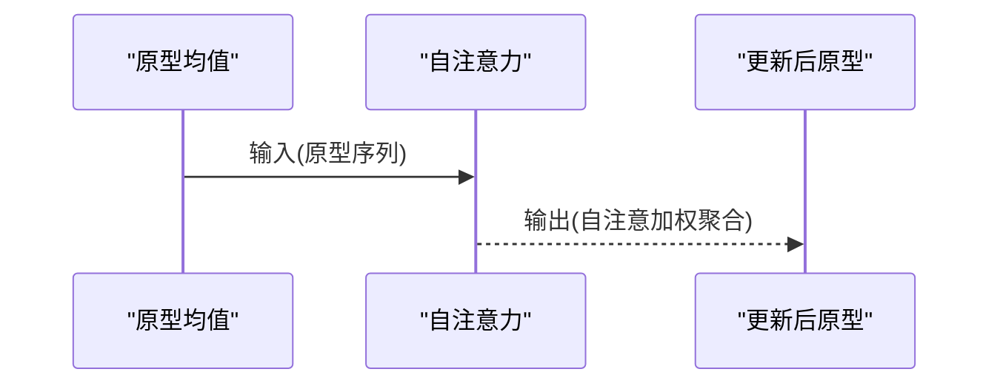
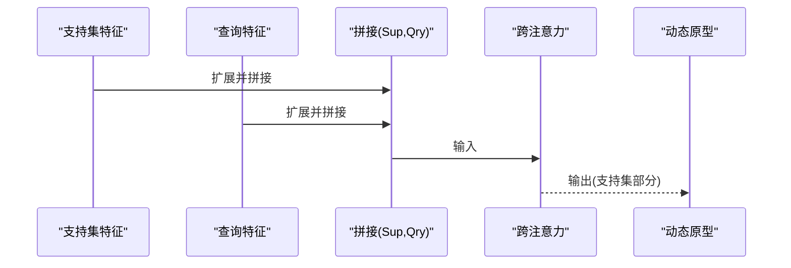
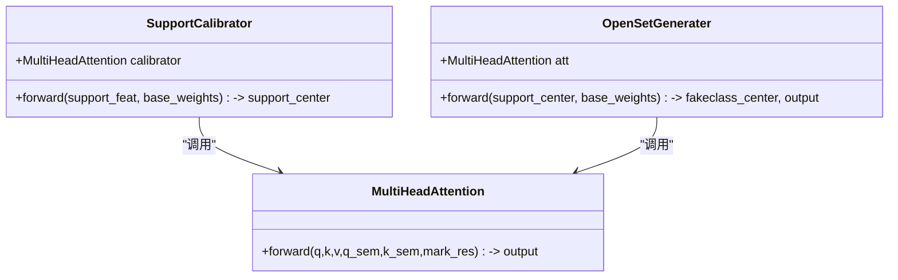
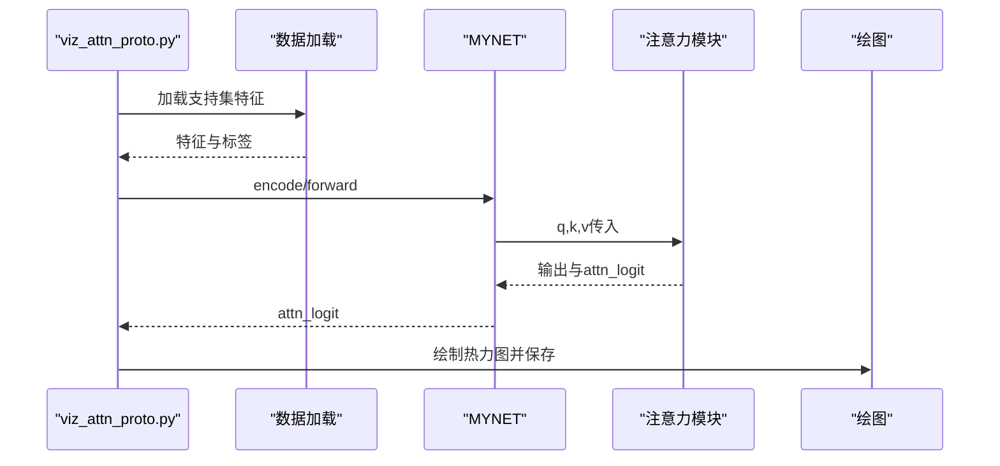
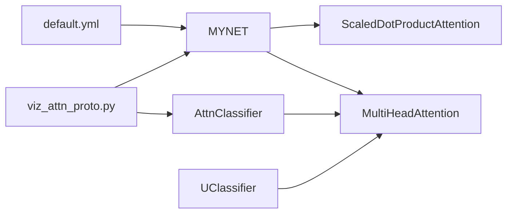

# 注意力机制设计

<cite>
**本文档引用的文件**
- [network.py](file://network.py)
- [AttnClassifier.py](file://models/AttnClassifier.py)
- [UClassifier.py](file://models/UClassifier.py)
- [viz_attn_proto.py](file://scripts/viz_attn_proto.py)
- [default.yml](file://configs/default.yml)
- [utils.py](file://utils/utils.py)
</cite>

## 目录
1. [简介](#简介)
2. [项目结构](#项目结构)
3. [核心组件](#核心组件)
4. [架构总览](#架构总览)
5. [详细组件分析](#详细组件分析)
6. [依赖关系分析](#依赖关系分析)
7. [性能考量](#性能考量)
8. [故障排查指南](#故障排查指南)
9. [结论](#结论)
10. [附录](#附录)

## 简介
本文件围绕仓库中的注意力机制实现进行全面技术文档化，重点覆盖多头注意力（MultiHeadAttention）与缩放点积注意力（ScaledDotProductAttention）的数学原理、实现细节、残差连接与层归一化流程，以及在原型学习场景下的两类注意力应用：自注意力（self-attn）与跨注意力（transatt_proto）。我们将解释注意力权重如何帮助模型聚焦重要特征区域，提升分类性能，并提供注意力权重计算路径、注意力分数解释方法及注意力可视化分析的实践指导。

## 项目结构
本项目将注意力机制嵌入到主干网络MYNET中，同时在分类器模块（AttnClassifier、UClassifier）中提供了面向原型学习的注意力变体。脚本viz_attn_proto.py用于可视化原型注意力热力图与自注意力权重图。

图表来源
- [network.py:31-32](file://network.py#L31-L32)
- [network.py:522-584](file://network.py#L522-L584)
- [models/AttnClassifier.py:39-93](file://models/AttnClassifier.py#L39-L93)
- [models/UClassifier.py:287-363](file://models/UClassifier.py#L287-L363)
- [scripts/viz_attn_proto.py:34-119](file://scripts/viz_attn_proto.py#L34-L119)
- [configs/default.yml:42-45](file://configs/default.yml#L42-L45)
- [utils/utils.py:86-115](file://utils/utils.py#L86-L115)

章节来源
- [network.py:18-50](file://network.py#L18-L50)
- [models/AttnClassifier.py:39-93](file://models/AttnClassifier.py#L39-L93)
- [models/UClassifier.py:287-363](file://models/UClassifier.py#L287-L363)
- [scripts/viz_attn_proto.py:34-119](file://scripts/viz_attn_proto.py#L34-L119)
- [configs/default.yml:42-45](file://configs/default.yml#L42-L45)
- [utils/utils.py:86-115](file://utils/utils.py#L86-L115)

## 核心组件
- ScaledDotProductAttention：实现缩放点积注意力的核心模块，负责计算注意力分数、softmax归一化与dropout，最终得到加权聚合的输出。
- MultiHeadAttention：多头注意力模块，对Q/K/V分别线性投影，按头切分与拼接，串联内部ScaledDotProductAttention，并集成残差连接与层归一化。
- MYNET中的自注意力（self-attn）与跨注意力（transatt_proto）：在原型学习中分别用于原型内部自注意与支持集-查询跨注意，以动态调整原型表示。
- AttnClassifier/UClassifier中的注意力：面向原型学习的注意力模块，支持语义与视觉特征融合，用于校准支持原型与生成负原型。

章节来源
- [network.py:522-584](file://network.py#L522-L584)
- [models/AttnClassifier.py:274-350](file://models/AttnClassifier.py#L274-L350)
- [models/UClassifier.py:287-363](file://models/UClassifier.py#L287-L363)

## 架构总览
下图展示了MYNET中注意力模块在原型学习流程中的位置与交互关系。

图表来源
- [network.py:225-279](file://network.py#L225-L279)
- [network.py:31-32](file://network.py#L31-L32)

章节来源
- [network.py:225-279](file://network.py#L225-L279)

## 详细组件分析

### ScaledDotProductAttention 数学与实现
- 数学公式
  - 注意力分数：$ \text{score}(Q,K) = QK^T $
  - 缩放：$ \text{logits} = \frac{\text{score}}{\sqrt{d_k}} $
  - 归一化：$ P = \text{softmax}(\text{logits}) $
  - 输出：$ \text{Output} = P V $
  - 最终还包含dropout与可选的log_softmax输出，便于后续分析。
- 实现要点
  - 使用batch矩阵乘法bmm计算QK^T
  - 温度缩放与softmax归一化
  - dropout防止过拟合
  - 返回加权输出与中间logits，便于可视化与分析

图表来源
- [network.py:528-535](file://network.py#L528-L535)

章节来源
- [network.py:522-535](file://network.py#L522-L535)

### MultiHeadAttention 实现与残差连接
- 多头机制
  - Q/K/V分别通过线性层投影到多头空间
  - 按头切分后展平为(b*h)批次，送入ScaledDotProductAttention
  - 多头结果按拼接并经全连接输出
- 残差与层归一化
  - 输出与输入残差相加
  - 层归一化稳定训练与数值稳定性

图表来源
- [network.py:538-584](file://network.py#L538-L584)
- [network.py:522-535](file://network.py#L522-L535)

章节来源
- [network.py:538-584](file://network.py#L538-L584)

### 自注意力（self-attn）在原型学习中的作用
- 场景描述
  - 对支持集原型进行自注意力，使同类原型之间相互增强，抑制噪声，形成更稳定的类别中心。
- 关键路径
  - 原型均值计算后，与自身进行自注意力，更新原型表示。
  - 可选地与查询拼接后进行自注意力，分离出更新后的原型与查询。

图表来源
- [network.py:244-251](file://network.py#L244-L251)

章节来源
- [network.py:225-255](file://network.py#L225-L255)

### 跨注意力（transatt_proto）在原型学习中的作用
- 场景描述
  - 将支持集特征与查询特征拼接，通过跨注意力对支持集进行加权，得到动态原型，突出与查询更相关的支持样本。
- 关键路径
  - 支持集扩展为与查询同批，拼接后进行跨注意力
  - 仅取支持集部分，按注意力分数加权求和，得到动态原型

图表来源
- [network.py:270-279](file://network.py#L270-L279)

章节来源
- [network.py:270-279](file://network.py#L270-L279)

### 语义-视觉融合注意力（AttnClassifier/UClassifier）
- 设计目标
  - 在原型学习中融合语义信息与视觉特征，通过门控机制调节语义与视觉的权重，提升原型校准与负原型生成质量。
- 关键模块
  - SupportCalibrator：对支持集原型进行语义-视觉融合校准
  - OpenSetGenerater：利用融合后的支持原型生成负原型
  - MultiHeadAttention：支持语义与视觉双分支的注意力计算

图表来源
- [models/AttnClassifier.py:121-185](file://models/AttnClassifier.py#L121-L185)
- [models/AttnClassifier.py:188-271](file://models/AttnClassifier.py#L188-L271)
- [models/AttnClassifier.py:274-350](file://models/AttnClassifier.py#L274-L350)

章节来源
- [models/AttnClassifier.py:121-271](file://models/AttnClassifier.py#L121-L271)
- [models/UClassifier.py:287-363](file://models/UClassifier.py#L287-L363)

### 注意力权重计算与可视化
- 权重计算路径
  - ScaledDotProductAttention返回注意力logits，可用于分析注意力分布
  - MYNET在自注意力与跨注意力中均返回attn_logit，便于可视化
- 可视化脚本
  - viz_attn_proto.py加载模型与数据，对支持集特征执行自注意力，绘制注意力权重热力图

图表来源
- [scripts/viz_attn_proto.py:92-115](file://scripts/viz_attn_proto.py#L92-L115)
- [network.py:528-535](file://network.py#L528-L535)

章节来源
- [scripts/viz_attn_proto.py:34-119](file://scripts/viz_attn_proto.py#L34-L119)
- [network.py:528-535](file://network.py#L528-L535)

## 依赖关系分析
- MYNET依赖MultiHeadAttention与ScaledDotProductAttention实现原型学习中的注意力
- AttnClassifier/UClassifier依赖MultiHeadAttention实现语义-视觉融合
- 可视化脚本依赖MYNET与分类器模块以提取注意力权重
- 配置文件提供温度等超参数，影响注意力归一化与分类分数尺度

图表来源
- [configs/default.yml:42-45](file://configs/default.yml#L42-L45)
- [network.py:31-32](file://network.py#L31-L32)
- [models/AttnClassifier.py:274-350](file://models/AttnClassifier.py#L274-L350)
- [models/UClassifier.py:287-363](file://models/UClassifier.py#L287-L363)
- [scripts/viz_attn_proto.py:34-119](file://scripts/viz_attn_proto.py#L34-L119)

章节来源
- [configs/default.yml:42-45](file://configs/default.yml#L42-L45)
- [network.py:31-32](file://network.py#L31-L32)
- [models/AttnClassifier.py:274-350](file://models/AttnClassifier.py#L274-L350)
- [models/UClassifier.py:287-363](file://models/UClassifier.py#L287-L363)
- [scripts/viz_attn_proto.py:34-119](file://scripts/viz_attn_proto.py#L34-L119)

## 性能考量
- 温度参数：配置文件中的temperature控制softmax缩放，影响注意力分布的锐利程度与数值稳定性
- 多头数量与维度：n_head与d_k/d_v影响计算复杂度与表达能力，需平衡性能与显存
- Dropout：在注意力与全连接层使用dropout，有助于正则化与泛化
- 层归一化：稳定训练过程，缓解梯度不稳定问题

章节来源
- [configs/default.yml:42-45](file://configs/default.yml#L42-L45)
- [network.py:541-559](file://network.py#L541-L559)

## 故障排查指南
- 注意力可视化失败
  - 检查是否存在cls.attn或cls.multihead_attn属性
  - 确认传入的q,k,v维度与类型符合forward要求
- 自注意力/跨注意力输出异常
  - 确认输入序列长度与批次维度一致
  - 检查温度缩放与softmax归一化是否正常
- 温度过高/过低导致注意力分布过于稀疏或均匀
  - 调整configs/default.yml中的temperature参数

章节来源
- [scripts/viz_attn_proto.py:96-115](file://scripts/viz_attn_proto.py#L96-L115)
- [configs/default.yml:42-45](file://configs/default.yml#L42-L45)

## 结论
本项目在原型学习框架中系统实现了自注意力与跨注意力机制，前者用于增强原型内部一致性，后者用于动态融合支持集与查询信息，显著提升了少样本分类性能。通过注意力权重可视化，可以直观分析模型对支持样本的关注程度，辅助调试与解释模型决策过程。建议在实际部署中结合任务需求合理选择注意力类型与超参数，并配合可视化工具进行持续监控与优化。

## 附录
- 注意力权重计算路径参考
  - [network.py:528-535](file://network.py#L528-L535)
  - [network.py:576-582](file://network.py#L576-L582)
- 自注意力与跨注意力调用路径参考
  - [network.py:244-251](file://network.py#L244-L251)
  - [network.py:270-279](file://network.py#L270-L279)
- 语义-视觉融合注意力路径参考
  - [models/AttnClassifier.py:121-185](file://models/AttnClassifier.py#L121-L185)
  - [models/AttnClassifier.py:188-271](file://models/AttnClassifier.py#L188-L271)
- 可视化脚本入口
  - [scripts/viz_attn_proto.py:34-119](file://scripts/viz_attn_proto.py#L34-L119)