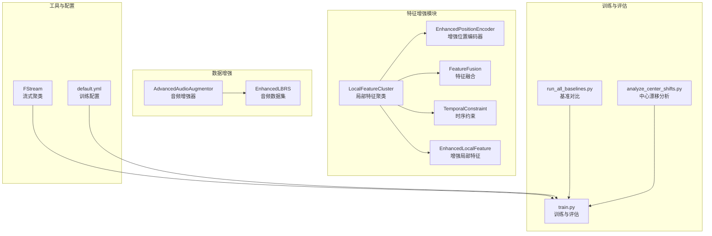
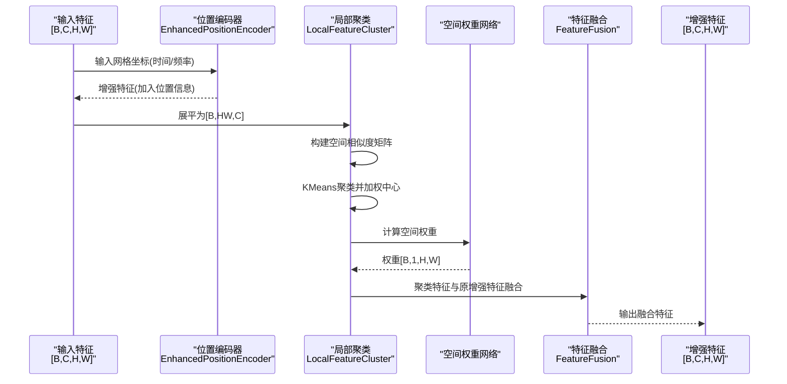
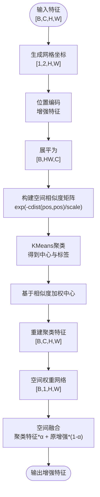
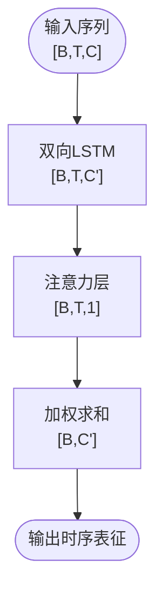
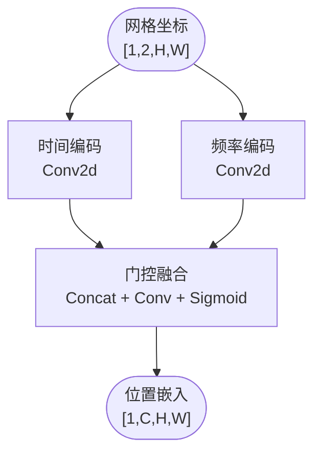
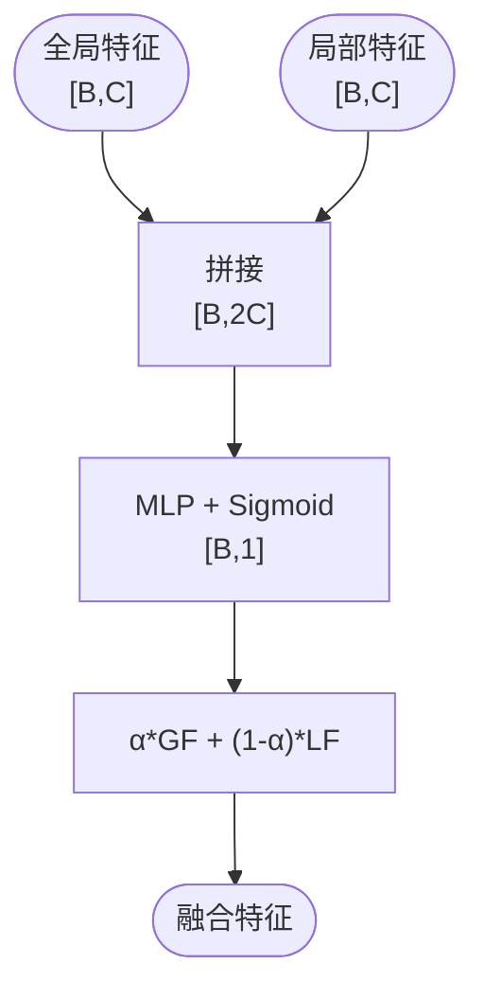
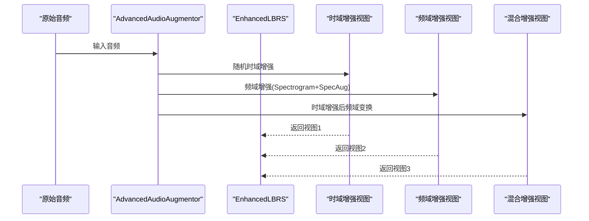
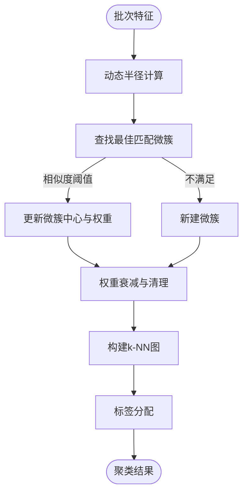
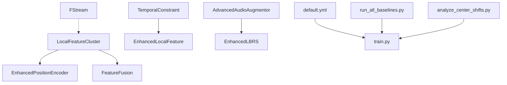

# 特征增强系统

<cite>
**本文档引用的文件**
- [models/feature_enhancer.py](file://models/feature_enhancer.py)
- [enhance_module.py](file://enhance_module.py)
- [models/resnet_enhancer.py](file://models/resnet_enhancer.py)
- [deepcluster.py](file://deepcluster.py)
- [utils/streamCluster.py](file://utils/streamCluster.py)
- [librispeech_enhance.py](file://librispeech_enhance.py)
- [configs/default.yml](file://configs/default.yml)
- [train.py](file://train.py)
- [scripts/run_all_baselines.py](file://scripts/run_all_baselines.py)
- [scripts/analyze_center_shifts.py](file://scripts/analyze_center_shifts.py)
</cite>

## 目录
1. [简介](#简介)
2. [项目结构](#项目结构)
3. [核心组件](#核心组件)
4. [架构总览](#架构总览)
5. [详细组件分析](#详细组件分析)
6. [依赖关系分析](#依赖关系分析)
7. [性能考量](#性能考量)
8. [故障排查指南](#故障排查指南)
9. [结论](#结论)
10. [附录](#附录)

## 简介
本文件面向特征增强系统，重点阐述“局部特征聚类”与“空间注意力机制”的设计原理与实现细节，涵盖以下内容：
- LocalFeatureCluster 的工作流程与数学原理
- 特征增强模块如何融合全局与局部信息以提升音频特征表示能力
- 不同增强策略（聚类增强、注意力增强、位置编码增强）的适用场景与效果差异
- 参数调节方法与评估增强效果对模型性能影响的实践路径

## 项目结构
该仓库围绕特征增强与增量学习展开，主要涉及以下模块：
- 特征增强核心模块：LocalFeatureCluster、EnhancedPositionEncoder、FeatureFusion、TemporalConstraint、EnhancedLocalFeature
- 数据增强与数据集：AdvancedAudioAugmentor、EnhancedLBRS
- 流式聚类工具：FStream
- 训练与评估：训练脚本、基准对比脚本、中心漂移分析脚本
- 配置文件：default.yml

图表来源
- [enhance_module.py:70-148](file://enhance_module.py#L70-L148)
- [models/resnet_enhancer.py:51-160](file://models/resnet_enhancer.py#L51-L160)
- [models/feature_enhancer.py:27-93](file://models/feature_enhancer.py#L27-L93)
- [librispeech_enhance.py:17-268](file://librispeech_enhance.py#L17-L268)
- [utils/streamCluster.py:5-132](file://utils/streamCluster.py#L5-L132)
- [configs/default.yml:1-88](file://configs/default.yml#L1-L88)
- [train.py:330-529](file://train.py#L330-L529)
- [scripts/run_all_baselines.py:1-282](file://scripts/run_all_baselines.py#L1-L282)
- [scripts/analyze_center_shifts.py:1-261](file://scripts/analyze_center_shifts.py#L1-L261)

章节来源
- [enhance_module.py:1-160](file://enhance_module.py#L1-L160)
- [models/resnet_enhancer.py:1-172](file://models/resnet_enhancer.py#L1-L172)
- [models/feature_enhancer.py:1-93](file://models/feature_enhancer.py#L1-L93)
- [librispeech_enhance.py:1-268](file://librispeech_enhance.py#L1-L268)
- [utils/streamCluster.py:1-132](file://utils/streamCluster.py#L1-L132)
- [configs/default.yml:1-88](file://configs/default.yml#L1-L88)
- [train.py:330-529](file://train.py#L330-L529)
- [scripts/run_all_baselines.py:1-282](file://scripts/run_all_baselines.py#L1-L282)
- [scripts/analyze_center_shifts.py:1-261](file://scripts/analyze_center_shifts.py#L1-L261)

## 核心组件
- LocalFeatureCluster：在空间网格上引入位置编码，通过KMeans进行局部聚类，结合时序相似度矩阵对聚类中心进行加权，再通过空间权重网络融合局部细节与全局结构，最终输出融合特征。
- EnhancedPositionEncoder：分别对时间轴与频率轴进行位置编码，通过动态门控融合两种编码，增强空间感知。
- FeatureFusion：将全局特征与局部特征进行动态加权融合，输出统一的增强特征。
- TemporalConstraint：使用LSTM与注意力机制对序列进行加权聚合，提取时序约束表征。
- EnhancedLocalFeature：在特征图上进行时序LSTM与注意力聚合，结合动态权重进行特征聚合与重构。
- AdvancedAudioAugmentor：提供多视图音频增强（时域、频域、混合），支持可配置的概率与参数。
- FStream：流式聚类器，适用于小批量音频特征的微簇维护与聚类。

章节来源
- [enhance_module.py:70-148](file://enhance_module.py#L70-L148)
- [models/resnet_enhancer.py:21-160](file://models/resnet_enhancer.py#L21-L160)
- [models/feature_enhancer.py:5-93](file://models/feature_enhancer.py#L5-L93)
- [librispeech_enhance.py:17-134](file://librispeech_enhance.py#L17-L134)
- [utils/streamCluster.py:5-132](file://utils/streamCluster.py#L5-L132)

## 架构总览
特征增强系统采用“空间位置增强 + 局部聚类 + 全局融合”的整体架构，既保留了全局结构信息，又增强了局部细节与时序约束，从而提升模型对音频特征的表示能力。

图表来源
- [enhance_module.py:70-148](file://enhance_module.py#L70-L148)
- [models/resnet_enhancer.py:51-160](file://models/resnet_enhancer.py#L51-L160)

## 详细组件分析

### LocalFeatureCluster 工作流程与数学原理
- 空间位置编码：通过网格坐标生成位置嵌入，分别对时间轴与频率轴编码并通过门控融合，增强空间感知。
- 局部聚类：将特征展平为[B, HW, C]，对每个样本独立执行KMeans聚类，得到聚类中心与标签；随后基于空间相似度矩阵对中心进行加权，形成更稳定的原型。
- 空间权重融合：通过空间权重网络计算每个位置的重要性，将聚类增强特征与原增强特征按权重融合，保留全局结构的同时注入局部细节。
- 全局-局部融合：可选地将全局特征与局部特征进行动态加权融合，输出统一的增强特征。

图表来源
- [enhance_module.py:95-148](file://enhance_module.py#L95-L148)
- [models/resnet_enhancer.py:73-160](file://models/resnet_enhancer.py#L73-L160)

章节来源
- [enhance_module.py:70-148](file://enhance_module.py#L70-L148)
- [models/resnet_enhancer.py:51-160](file://models/resnet_enhancer.py#L51-L160)

### TemporalConstraint 与 EnhancedLocalFeature 的时序约束与注意力机制
- TemporalConstraint：使用双向LSTM对序列进行建模，通过注意力层对时间步进行加权聚合，输出全局时序表征，有助于捕捉时序依赖。
- EnhancedLocalFeature：在特征图上进行时序LSTM与注意力聚合，结合动态权重进行特征聚合与重构，适合处理具有明显时序结构的特征图。

图表来源
- [models/feature_enhancer.py:5-25](file://models/feature_enhancer.py#L5-L25)
- [models/feature_enhancer.py:27-93](file://models/feature_enhancer.py#L27-L93)

章节来源
- [models/feature_enhancer.py:5-93](file://models/feature_enhancer.py#L5-L93)

### EnhancedPositionEncoder 的位置编码设计
- 时间轴编码：对时间维进行卷积编码，学习时间模式。
- 频率轴编码：对频率维进行卷积编码，学习频率模式。
- 动态门控融合：将两种编码拼接后通过门控网络动态融合，使模型自适应地选择时间或频率信息的权重。

图表来源
- [enhance_module.py:30-69](file://enhance_module.py#L30-L69)
- [models/resnet_enhancer.py:21-48](file://models/resnet_enhancer.py#L21-L48)

章节来源
- [enhance_module.py:30-69](file://enhance_module.py#L30-L69)
- [models/resnet_enhancer.py:21-48](file://models/resnet_enhancer.py#L21-L48)

### FeatureFusion 的全局-局部融合策略
- 输入：全局特征与局部特征（通常来自平均池化）。
- 动态权重：通过MLP预测融合权重，将两者按权重线性组合，实现自适应融合。

图表来源
- [enhance_module.py:14-29](file://enhance_module.py#L14-L29)
- [models/resnet_enhancer.py:6-19](file://models/resnet_enhancer.py#L6-L19)

章节来源
- [enhance_module.py:14-29](file://enhance_module.py#L14-L29)
- [models/resnet_enhancer.py:6-19](file://models/resnet_enhancer.py#L6-L19)

### 音频数据增强与数据集
- AdvancedAudioAugmentor：提供多种增强策略（随机裁剪、音高变换、时间拉伸、噪声添加、极性反转等），并支持可配置概率与参数，生成多视图（时域、频域、混合）增强样本。
- EnhancedLBRS：基于LibriSpeech的数据集加载器，支持few-shot场景与训练/验证/测试划分，训练阶段使用高级增强器生成多视图样本。

图表来源
- [librispeech_enhance.py:17-134](file://librispeech_enhance.py#L17-L134)
- [librispeech_enhance.py:135-216](file://librispeech_enhance.py#L135-L216)

章节来源
- [librispeech_enhance.py:17-216](file://librispeech_enhance.py#L17-L216)

### 流式聚类器 FStream
- 微簇维护：基于余弦相似度与动态半径，维护微簇中心与权重。
- k-NN图与标签分配：通过k-NN图与核心-边界分离策略进行标签分配。
- 适用于小批量音频特征的在线聚类场景。

图表来源
- [utils/streamCluster.py:58-126](file://utils/streamCluster.py#L58-L126)

章节来源
- [utils/streamCluster.py:5-132](file://utils/streamCluster.py#L5-L132)

## 依赖关系分析
- LocalFeatureCluster 依赖 EnhancedPositionEncoder 与 FeatureFusion 实现空间增强与全局-局部融合。
- TemporalConstraint 与 EnhancedLocalFeature 独立存在，分别用于时序约束与局部特征增强。
- AdvancedAudioAugmentor 与 EnhancedLBRS 为数据增强与数据集提供支撑。
- FStream 作为外部工具，可用于流式场景下的聚类任务。
- 训练与评估脚本通过配置文件与模型模块协同工作。

图表来源
- [enhance_module.py:70-148](file://enhance_module.py#L70-L148)
- [models/resnet_enhancer.py:51-160](file://models/resnet_enhancer.py#L51-L160)
- [models/feature_enhancer.py:5-93](file://models/feature_enhancer.py#L5-L93)
- [librispeech_enhance.py:17-216](file://librispeech_enhance.py#L17-L216)
- [utils/streamCluster.py:5-132](file://utils/streamCluster.py#L5-L132)
- [configs/default.yml:1-88](file://configs/default.yml#L1-L88)
- [train.py:330-529](file://train.py#L330-L529)
- [scripts/run_all_baselines.py:1-282](file://scripts/run_all_baselines.py#L1-L282)
- [scripts/analyze_center_shifts.py:1-261](file://scripts/analyze_center_shifts.py#L1-L261)

章节来源
- [enhance_module.py:70-148](file://enhance_module.py#L70-L148)
- [models/resnet_enhancer.py:51-160](file://models/resnet_enhancer.py#L51-L160)
- [models/feature_enhancer.py:5-93](file://models/feature_enhancer.py#L5-L93)
- [librispeech_enhance.py:17-216](file://librispeech_enhance.py#L17-L216)
- [utils/streamCluster.py:5-132](file://utils/streamCluster.py#L5-L132)
- [configs/default.yml:1-88](file://configs/default.yml#L1-L88)
- [train.py:330-529](file://train.py#L330-L529)
- [scripts/run_all_baselines.py:1-282](file://scripts/run_all_baselines.py#L1-L282)
- [scripts/analyze_center_shifts.py:1-261](file://scripts/analyze_center_shifts.py#L1-L261)

## 性能考量
- 计算复杂度：LocalFeatureCluster 的KMeans与空间相似度矩阵计算在GPU上执行，但需注意批内CPU-GPU交互与内存占用。
- 设备一致性：确保位置编码器与空间权重网络与输入特征在同一设备上，避免额外的设备迁移开销。
- 参数规模：k_ratio 控制聚类数量，temporal_scale 控制空间相似度的敏感度，需根据特征图尺寸与任务需求调节。
- 训练稳定性：通过残差连接与动态门控融合，减少梯度消失与特征破坏风险。

## 故障排查指南
- 维度不匹配：LocalFeatureCluster 在维度修正与安全reshape时可能因HW与C的关系导致异常，建议检查输入特征的H、W与C是否符合预期。
- 设备不一致：EnhancedPositionEncoder 与空间权重网络需确保与输入特征在同一设备上，可通过内部设备一致性检查函数进行验证。
- 聚类不稳定：若KMeans标签波动较大，可尝试降低k_ratio或调整temporal_scale，或在CPU上进行一次性聚类以减少交互。
- 内存溢出：大规模特征图或大批量数据可能导致显存不足，建议分批处理或降低k_ratio。

章节来源
- [enhance_module.py:149-160](file://enhance_module.py#L149-L160)
- [models/resnet_enhancer.py:168-172](file://models/resnet_enhancer.py#L168-L172)
- [models/feature_enhancer.py:49-93](file://models/feature_enhancer.py#L49-L93)

## 结论
特征增强系统通过“空间位置增强 + 局部聚类 + 全局融合”的设计，有效提升了模型对音频特征的表示能力。LocalFeatureCluster 在空间网格上引入位置编码，结合KMeans与空间相似度加权，实现了稳健的局部特征增强；TemporalConstraint 与 EnhancedLocalFeature 则分别从时序约束与局部特征聚合角度增强表示。AdvancedAudioAugmentor 与 EnhancedLBRS 提供了丰富的多视图数据增强策略，进一步提升模型鲁棒性。通过合理的参数调节与评估方法，可在增量学习与开放集识别任务中取得显著收益。

## 附录

### 参数调节方法与示例路径
- k_ratio：控制聚类数量的比例，建议从0.2~0.5之间尝试，依据特征图尺寸与任务复杂度调整。
- temporal_scale：控制空间相似度矩阵的敏感度，较小值更关注邻近位置，较大值更平滑。
- feat_dim：特征维度需与插入层通道数匹配，确保维度修正层正确工作。
- 增强策略选择：
  - 聚类增强：适用于需要保留局部细节的任务，如语音识别中的细粒度特征。
  - 注意力增强：适用于需要强调重要时间步的任务，如时序建模。
  - 位置编码增强：适用于需要增强空间感知的任务，如频谱图上的定位与分割。

章节来源
- [enhance_module.py:71-77](file://enhance_module.py#L71-L77)
- [models/resnet_enhancer.py:52-56](file://models/resnet_enhancer.py#L52-L56)
- [models/feature_enhancer.py:28-31](file://models/feature_enhancer.py#L28-L31)

### 评估增强效果对模型性能的影响
- 训练与评估：通过训练脚本对增强特征进行可视化与指标计算，包括决策边界对比、t-SNE/PCA可视化、特征分布与相关性热图等。
- 基准对比：使用 run_all_baselines.py 对不同CIL/OSR组合进行端到端评估，记录已知/未知准确率、增量准确率与F1分数。
- 中心漂移分析：使用 analyze_center_shifts.py 对模型原型中心的漂移进行分析，评估增强对类别中心稳定性的影响。

章节来源
- [train.py:330-529](file://train.py#L330-L529)
- [scripts/run_all_baselines.py:103-171](file://scripts/run_all_baselines.py#L103-L171)
- [scripts/analyze_center_shifts.py:136-261](file://scripts/analyze_center_shifts.py#L136-L261)