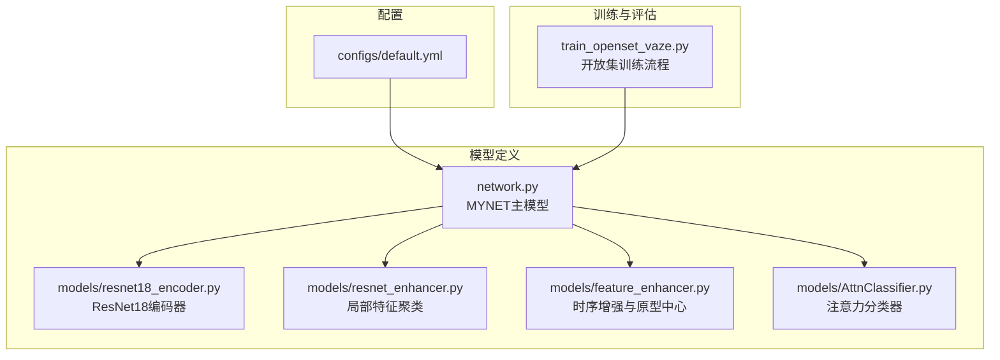
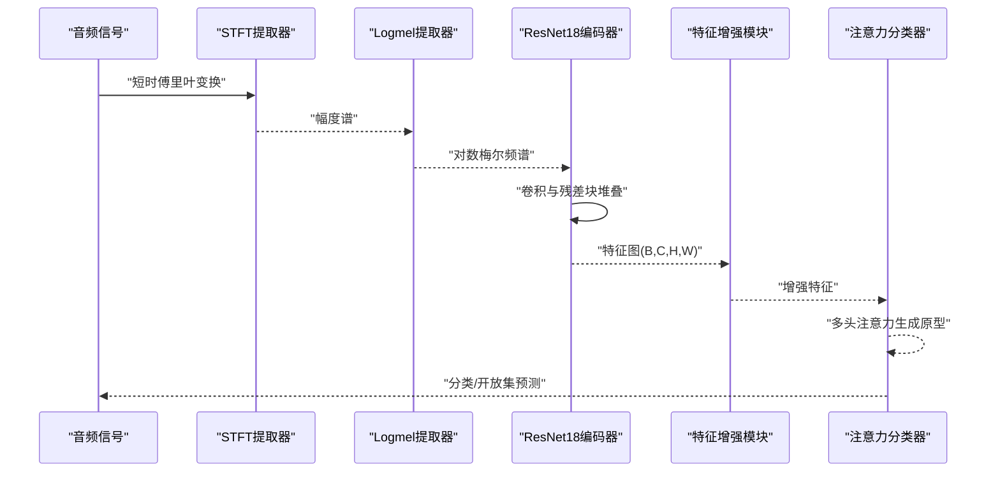
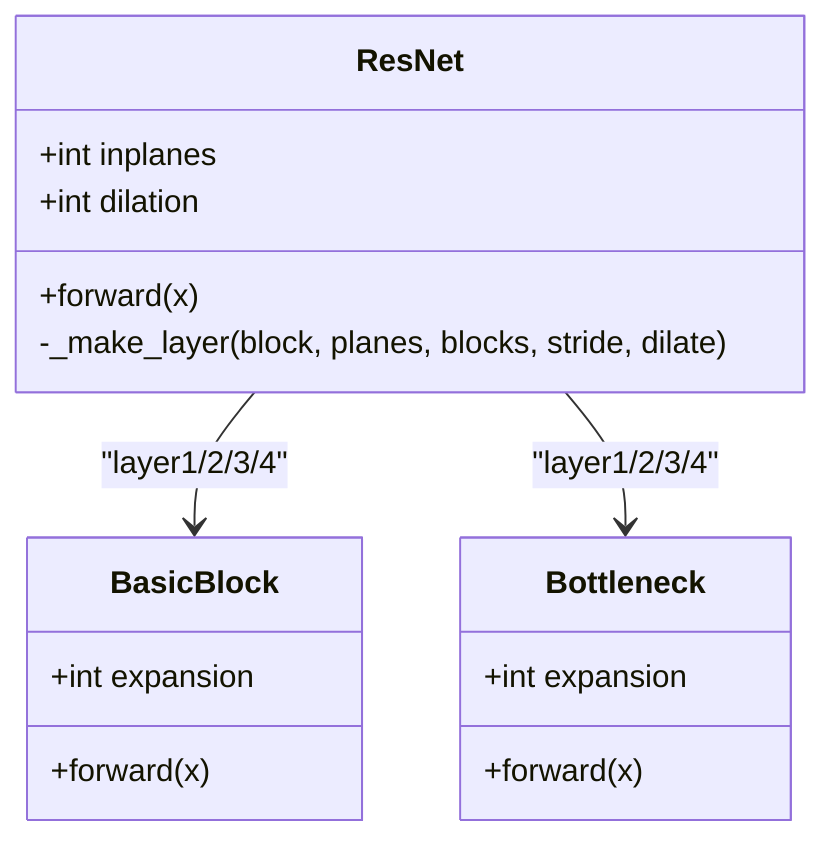
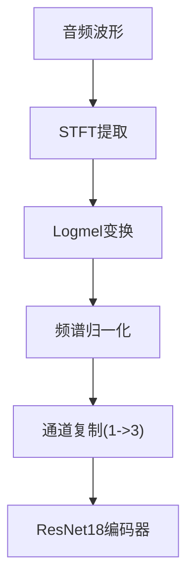
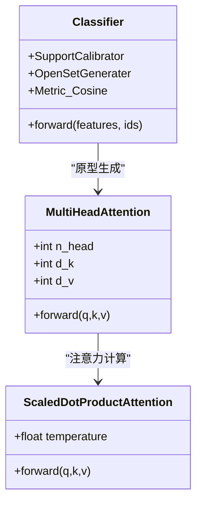
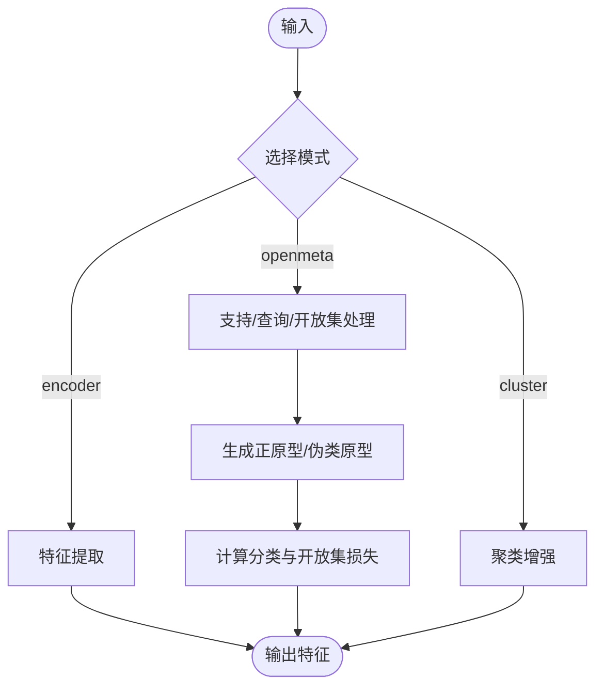
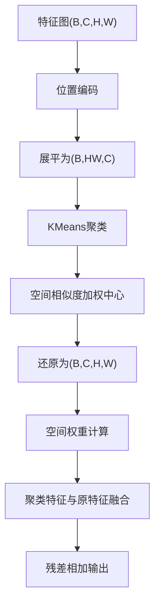
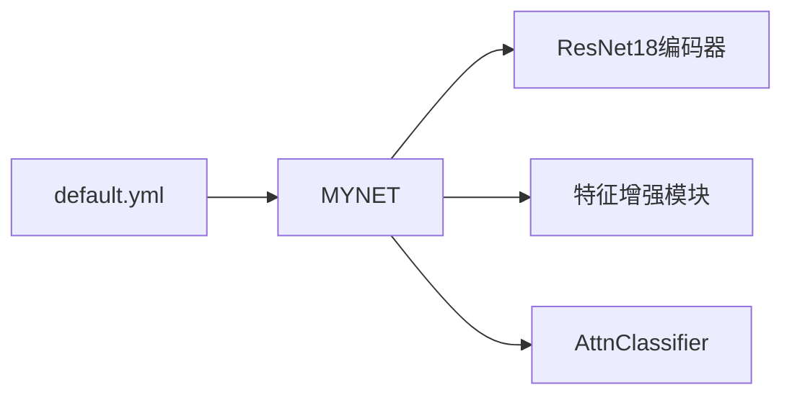

# 网络架构设计

<cite>
**本文档引用的文件**
- [network.py](file://network.py)
- [resnet18_encoder.py](file://models/resnet18_encoder.py)
- [resnet_enhancer.py](file://models/resnet_enhancer.py)
- [feature_enhancer.py](file://models/feature_enhancer.py)
- [AttnClassifier.py](file://models/AttnClassifier.py)
- [default.yml](file://configs/default.yml)
- [train_openset_vaze.py](file://train_openset_vaze.py)
</cite>

## 目录
1. [简介](#简介)
2. [项目结构](#项目结构)
3. [核心组件](#核心组件)
4. [架构总览](#架构总览)
5. [详细组件分析](#详细组件分析)
6. [依赖关系分析](#依赖关系分析)
7. [性能考虑](#性能考虑)
8. [故障排除指南](#故障排除指南)
9. [结论](#结论)

## 简介
本文件面向VAZE项目的网络架构设计，系统性阐述MYNET主模型的整体设计理念与实现细节。重点包括：
- ResNet18编码器的结构与预训练策略
- 音频特征提取模块（STFT与Logmel变换）的配置与数据流
- 多头注意力机制的设计原理与在分类器中的应用
- 前向传播流程（encoder、openmeta、cluster等模式）的实现差异
- 特征增强模块（局部特征聚类与空间注意力）的工作原理
- 通过配置参数调整网络行为的方法

## 项目结构
该项目采用按功能分层的组织方式，核心网络位于models目录，训练脚本位于根目录，配置文件位于configs目录。MYNET主模型位于network.py，负责整合音频特征提取、ResNet18编码器、特征增强模块以及分类器组件。

**图表来源**
- [network.py:18-35](file://network.py#L18-L35)
- [resnet18_encoder.py:240-334](file://models/resnet18_encoder.py#L240-L334)
- [resnet_enhancer.py:51-172](file://models/resnet_enhancer.py#L51-L172)
- [feature_enhancer.py:27-93](file://models/feature_enhancer.py#L27-L93)
- [AttnClassifier.py:39-101](file://models/AttnClassifier.py#L39-L101)
- [default.yml:77-85](file://configs/default.yml#L77-L85)

**章节来源**
- [network.py:18-35](file://network.py#L18-L35)
- [default.yml:77-85](file://configs/default.yml#L77-L85)

## 核心组件
- MYNET主模型：封装音频特征提取、ResNet18编码器、特征增强模块、多头注意力分类器，并提供多种前向传播模式（encoder/openmeta/cluster等）。
- ResNet18编码器：基于torchvision实现的ResNet18，支持预训练权重加载，作为图像化音频特征的骨干网络。
- 特征增强模块：
  - 局部特征聚类（LocalFeatureCluster）：结合空间网格位置编码与KMeans聚类，实现局部细节增强与全局结构融合。
  - 时序增强与原型中心（EnhancedLocalFeature）：通过LSTM与时序注意力计算动态权重，实现跨时间步的特征聚合。
- 多头注意力分类器（AttnClassifier）：包含SupportCalibrator与OpenSetGenerater，利用多头注意力生成正原型与负原型，支持开放集检测与增量学习。

**章节来源**
- [network.py:18-35](file://network.py#L18-L35)
- [resnet18_encoder.py:240-334](file://models/resnet18_encoder.py#L240-L334)
- [resnet_enhancer.py:51-172](file://models/resnet_enhancer.py#L51-L172)
- [feature_enhancer.py:27-93](file://models/feature_enhancer.py#L27-L93)
- [AttnClassifier.py:39-101](file://models/AttnClassifier.py#L39-L101)

## 架构总览
MYNET的总体数据流如下：
- 音频输入经STFT与Logmel变换，转为三通道图像特征
- ResNet18编码器提取空间特征图
- 特征增强模块对中间层特征进行局部聚类与空间注意力融合
- 分类器通过多头注意力生成支持原型与伪类原型，完成元学习阶段的分类任务

**图表来源**
- [network.py:326-353](file://network.py#L326-L353)
- [network.py:471-485](file://network.py#L471-L485)
- [network.py:290-311](file://network.py#L290-L311)
- [AttnClassifier.py:47-93](file://models/AttnClassifier.py#L47-L93)

## 详细组件分析

### ResNet18编码器实现细节
- 结构组成：基础卷积层、残差块堆叠（layer1-layer4）、全局平均池化与可选分类头。
- 预训练策略：支持从torchhub加载ImageNet预训练权重，自动过滤分类头参数并更新编码器权重。
- 前向传播：依次执行conv1-bn1-relu-maxpool-layer1-layer2-layer3-layer4，最终输出空间特征图。

**图表来源**
- [resnet18_encoder.py:240-334](file://models/resnet18_encoder.py#L240-L334)
- [resnet18_encoder.py:157-195](file://models/resnet18_encoder.py#L157-L195)
- [resnet18_encoder.py:197-238](file://models/resnet18_encoder.py#L197-L238)

**章节来源**
- [resnet18_encoder.py:240-334](file://models/resnet18_encoder.py#L240-L334)
- [resnet18_encoder.py:337-471](file://models/resnet18_encoder.py#L337-L471)

### 音频特征提取模块（STFT与Logmel）
- STFT提取器：基于torchlibrosa的Spectrogram，配置窗长、步长、窗口类型等参数。
- Logmel提取器：基于torchlibrosa的LogmelFilterBank，配置采样率、Mel滤波器数量、频率范围等。
- 数据预处理：对频谱进行批归一化与通道复制，使输出符合ResNet输入要求（三通道）。

**图表来源**
- [network.py:326-353](file://network.py#L326-L353)
- [network.py:471-485](file://network.py#L471-L485)

**章节来源**
- [network.py:326-353](file://network.py#L326-L353)
- [network.py:471-485](file://network.py#L471-L485)

### 多头注意力机制设计原理
- 核心组件：ScaledDotProductAttention与MultiHeadAttention，分别负责缩放点积注意力与多头投影融合。
- 在MYNET中，用于元学习阶段的原型生成与查询分类，提升支持与查询样本间的语义对齐。
- 在AttnClassifier中，SupportCalibrator与OpenSetGenerater进一步利用多头注意力生成正原型与负原型，支持开放集检测。

**图表来源**
- [network.py:538-584](file://network.py#L538-L584)
- [network.py:519-536](file://network.py#L519-L536)
- [AttnClassifier.py:274-327](file://models/AttnClassifier.py#L274-L327)
- [AttnClassifier.py:352-369](file://models/AttnClassifier.py#L352-L369)

**章节来源**
- [network.py:538-584](file://network.py#L538-L584)
- [AttnClassifier.py:274-327](file://models/AttnClassifier.py#L274-L327)
- [AttnClassifier.py:352-369](file://models/AttnClassifier.py#L352-L369)

### 前向传播流程与模式差异
- encoder模式：仅进行特征提取，输出512维特征或经线性分类器映射后的表示。
- openmeta模式：整合支持集、查询集与开放集特征，通过分类器生成正原型与伪类原型，计算分类损失与开放集Hinge损失。
- cluster模式：预留分支，可用于后续的聚类增强或增量学习。

**图表来源**
- [network.py:37-49](file://network.py#L37-L49)
- [network.py:102-151](file://network.py#L102-L151)

**章节来源**
- [network.py:37-49](file://network.py#L37-L49)
- [network.py:102-151](file://network.py#L102-L151)

### 特征增强模块工作原理
- 局部特征聚类（LocalFeatureCluster）：
  - 位置编码：通过时间与频率方向的卷积嵌入，生成与特征维度一致的位置表示。
  - 空间注意力：通过MLP计算空间权重，控制聚类特征与原增强特征的融合比例。
  - 聚类策略：对每个样本独立进行KMeans聚类，使用空间相似度矩阵加权聚类中心，避免跨样本干扰。
  - 残差融合：最终输出与输入特征相加，保证训练稳定性。
- 时序增强与原型中心（EnhancedLocalFeature）：
  - LSTM时序建模：对展平的空间特征进行双向LSTM编码，捕获时间依赖关系。
  - 动态权重：通过与原型中心的点积计算权重，实现跨时间步的特征聚合。
  - 维度适配：根据输入通道数动态调整维度，确保与后续层兼容。

**图表来源**
- [resnet_enhancer.py:73-160](file://models/resnet_enhancer.py#L73-L160)

**章节来源**
- [resnet_enhancer.py:51-172](file://models/resnet_enhancer.py#L51-L172)
- [feature_enhancer.py:27-93](file://models/feature_enhancer.py#L27-L93)

### 代码示例路径与数据流
- 音频特征提取与编码：
  - [network.py:471-485](file://network.py#L471-L485) encode函数
  - [network.py:326-353](file://network.py#L326-L353) set_module_for_audio函数
- 增强编码流程：
  - [network.py:290-311](file://network.py#L290-L311) enhance_encode函数
- 分类器前向：
  - [AttnClassifier.py:47-93](file://models/AttnClassifier.py#L47-L93) Classifier.forward
- 多头注意力：
  - [network.py:538-584](file://network.py#L538-L584) MultiHeadAttention.forward

**章节来源**
- [network.py:471-485](file://network.py#L471-L485)
- [network.py:326-353](file://network.py#L326-L353)
- [network.py:290-311](file://network.py#L290-L311)
- [AttnClassifier.py:47-93](file://models/AttnClassifier.py#L47-L93)
- [network.py:538-584](file://network.py#L538-L584)

## 依赖关系分析
MYNET对各组件的依赖关系如下：
- MYNET依赖ResNet18编码器进行特征提取
- MYNET依赖特征增强模块对中间层特征进行增强
- MYNET依赖AttnClassifier进行原型生成与分类
- 配置文件default.yml提供音频提取器参数与训练超参

**图表来源**
- [network.py:18-35](file://network.py#L18-L35)
- [default.yml:77-85](file://configs/default.yml#L77-L85)

**章节来源**
- [network.py:18-35](file://network.py#L18-L35)
- [default.yml:77-85](file://configs/default.yml#L77-L85)

## 性能考虑
- 预训练权重：使用ImageNet预训练的ResNet18可显著提升特征表达能力，减少训练初期的收敛时间。
- 批归一化：在Logmel频谱上进行批归一化，有助于稳定训练与加速收敛。
- 注意力温度参数：分类器中的温度参数可调节决策边界锐利程度，影响开放集检测阈值设定。
- 增量学习：通过聚类未知样本并添加原型中心，实现无监督的类别增量扩展。

[本节为通用指导，无需特定文件来源]

## 故障排除指南
- 预训练权重下载失败：检查TORCH_HOME环境变量与网络连通性，确保缓存目录可写。
- 维度不匹配：确认输入频谱的通道数与ResNet期望一致（三通道），并通过通道复制解决。
- 设备不一致：确保位置编码器与聚类中心在相同设备上，避免CUDA与CPU混合导致错误。
- 开放集阈值设置：根据训练集分布调整softmax阈值与余弦相似度阈值，平衡误检与漏检。

**章节来源**
- [resnet18_encoder.py:18-67](file://models/resnet18_encoder.py#L18-L67)
- [resnet_enhancer.py:168-172](file://models/resnet_enhancer.py#L168-L172)
- [train_openset_vaze.py:134-170](file://train_openset_vaze.py#L134-L170)

## 结论
VAZE项目的网络架构以ResNet18为核心，结合STFT/Logmel音频特征提取、局部特征聚类与空间注意力机制，构建了具备良好表征能力与开放集检测潜力的主模型MYNET。通过多头注意力生成支持原型与伪类原型，配合温度参数与阈值策略，实现了在少样本与开放集场景下的稳健表现。配置文件提供了灵活的参数调整空间，便于针对不同数据集与任务需求进行优化。