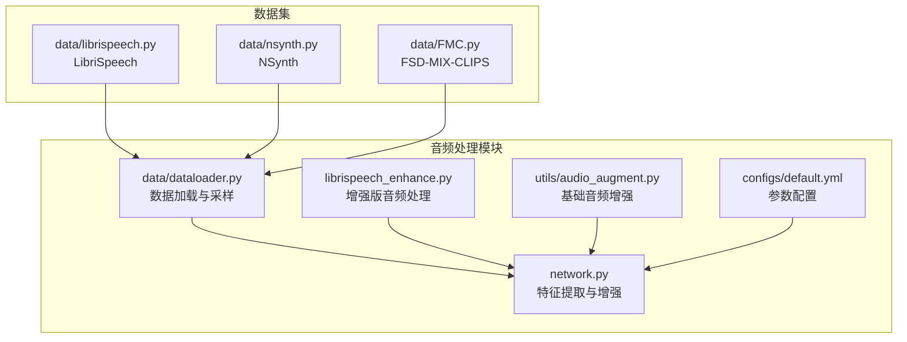
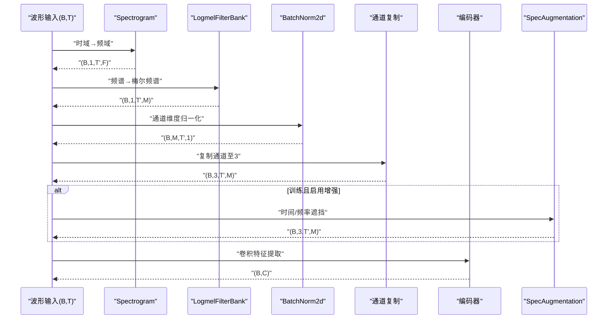
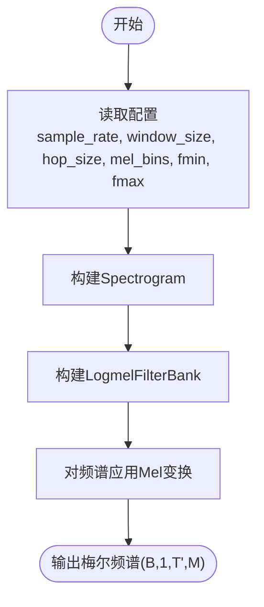
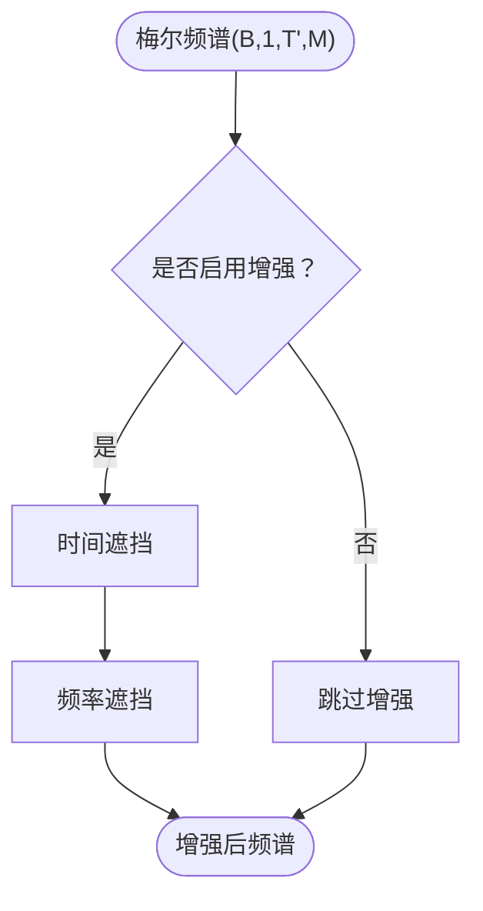
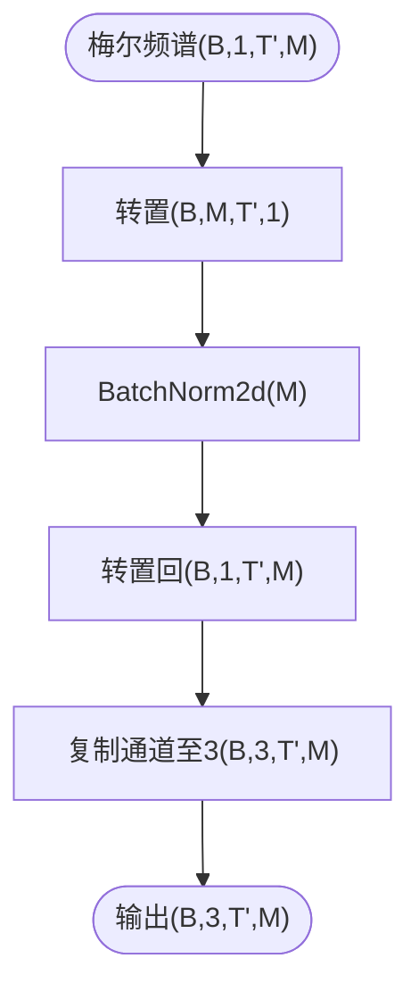
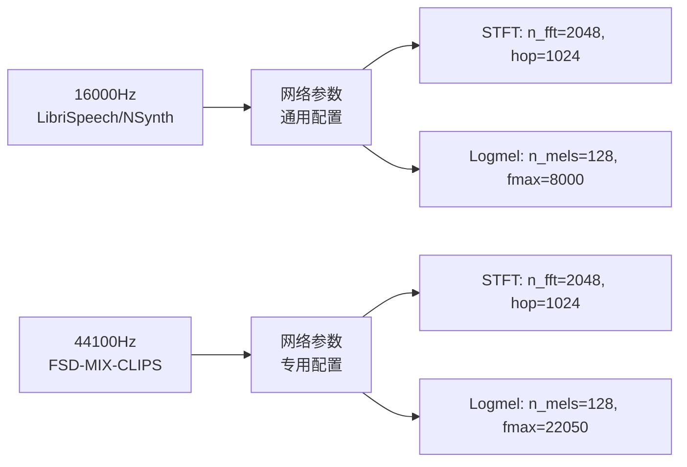
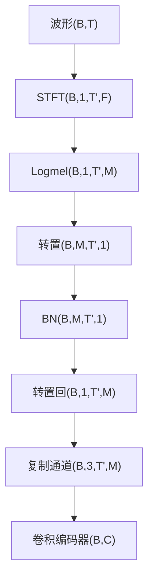
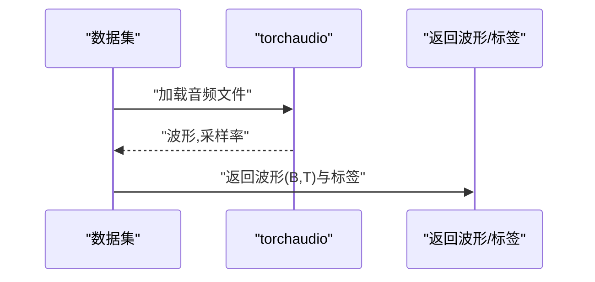
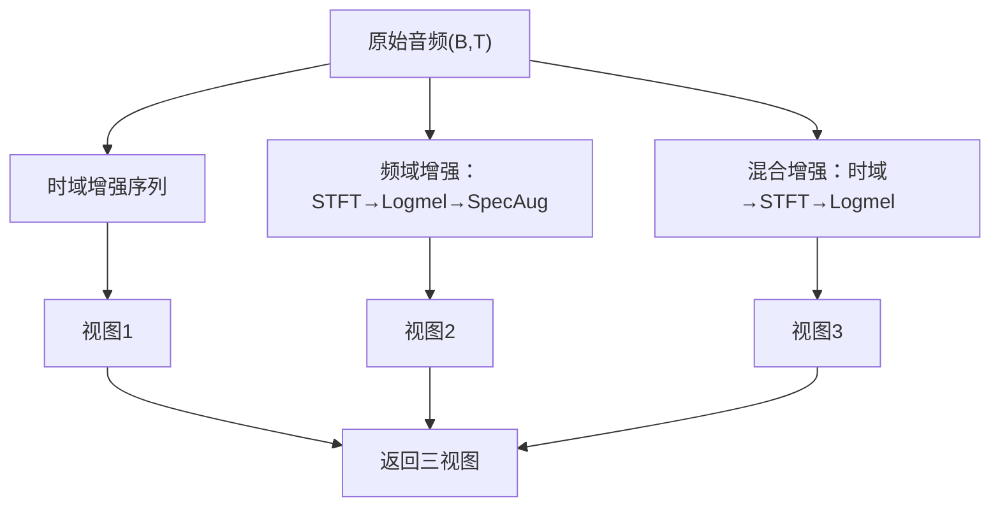
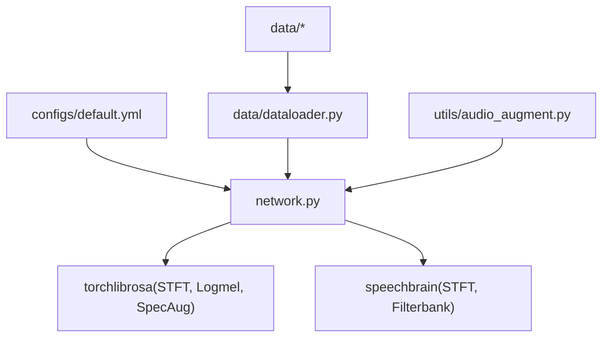

# 音频处理模块

<cite>
**本文引用的文件列表**
- [network.py](file://network.py)
- [librispeech_enhance.py](file://librispeech_enhance.py)
- [data/librispeech.py](file://data/librispeech.py)
- [data/nsynth.py](file://data/nsynth.py)
- [data/FMC.py](file://data/FMC.py)
- [data/dataloader.py](file://data/dataloader.py)
- [utils/audio_augment.py](file://utils/audio_augment.py)
- [configs/default.yml](file://configs/default.yml)
</cite>

## 目录
1. [简介](#简介)
2. [项目结构](#项目结构)
3. [核心组件](#核心组件)
4. [架构总览](#架构总览)
5. [详细组件分析](#详细组件分析)
6. [依赖关系分析](#依赖关系分析)
7. [性能考量](#性能考量)
8. [故障排查指南](#故障排查指南)
9. [结论](#结论)
10. [附录](#附录)

## 简介
本文件系统性梳理音频处理模块，围绕以下目标展开：
- 音频特征提取全流程：STFT变换、Logmel滤波器组、SpecAugmentation数据增强
- 多采样率配置差异：44100Hz与16000Hz下的窗口大小、跳跃长度、梅尔bin等参数
- 预处理管道设计：频谱图生成、批归一化、通道扩展等步骤
- 参数配置与使用示例：如何根据数据集需求调整参数

## 项目结构
音频处理模块主要分布在以下文件中：
- 网络与特征提取：network.py
- 增强版音频处理：librispeech_enhance.py
- 数据集与基础加载：data/librispeech.py、data/nsynth.py、data/FMC.py
- 数据加载器与采样：data/dataloader.py
- 基础音频增强工具：utils/audio_augment.py
- 配置文件：configs/default.yml

**图表来源**
- [network.py:326-352](file://network.py#L326-L352)
- [librispeech_enhance.py:17-53](file://librispeech_enhance.py#L17-L53)
- [data/dataloader.py:19-46](file://data/dataloader.py#L19-L46)
- [utils/audio_augment.py:4-31](file://utils/audio_augment.py#L4-L31)
- [configs/default.yml:77-85](file://configs/default.yml#L77-L85)

**章节来源**
- [network.py:18-352](file://network.py#L18-L352)
- [librispeech_enhance.py:17-133](file://librispeech_enhance.py#L17-L133)
- [data/dataloader.py:19-46](file://data/dataloader.py#L19-L46)
- [utils/audio_augment.py:4-31](file://utils/audio_augment.py#L4-L31)
- [configs/default.yml:77-85](file://configs/default.yml#L77-L85)

## 核心组件
- STFT变换器：基于torchlibrosa的Spectrogram，负责将时域波形转换为复频谱
- Logmel滤波器组：基于torchlibrosa的LogmelFilterBank，将频谱映射到梅尔尺度
- SpecAugmentation：基于torchlibrosa的SpecAugmentation，对频谱进行时间/频率遮挡增强
- 批归一化：对梅尔频谱的通道维度进行BN，稳定训练
- 通道扩展：将单通道梅尔频谱复制为三通道，适配下游卷积网络
- 增强工具：AudioAugment提供时域增强（时间拉伸、音高变换、加噪）

**章节来源**
- [network.py:333-345](file://network.py#L333-L345)
- [network.py:471-495](file://network.py#L471-L495)
- [utils/audio_augment.py:4-31](file://utils/audio_augment.py#L4-L31)

## 架构总览
音频特征提取的端到端流程如下：
- 输入：波形张量（B, T）
- 步骤1：STFT → 复频谱（B, 1, T', F）
- 步骤2：Logmel → 梅尔频谱（B, 1, T', M）
- 步骤3：转置与BN → 归一化（B, M, T', 1）
- 步骤4：转置回原格式并复制通道 → 三通道（B, 3, T', M）
- 步骤5：卷积编码器 → 特征（B, C）
- 可选：SpecAugmentation在梅尔频谱上进行遮挡增强

**图表来源**
- [network.py:471-495](file://network.py#L471-L495)
- [network.py:342-344](file://network.py#L342-L344)

**章节来源**
- [network.py:471-503](file://network.py#L471-L503)

## 详细组件分析

### STFT变换器与Logmel滤波器组
- 参数来源：来自配置文件中的extractor段，或在特定场景下（如S2S任务）为不同数据集设置专用参数
- 关键参数：
  - sample_rate：采样率（16000Hz或44100Hz）
  - window_size：FFT窗长
  - hop_size：跳跃长度
  - mel_bins：梅尔bin数量
  - fmin/fmax：频率范围
  - window：窗函数类型
- 作用：将波形映射到梅尔频谱，作为卷积网络的输入

**图表来源**
- [configs/default.yml:77-85](file://configs/default.yml#L77-L85)
- [network.py:333-340](file://network.py#L333-L340)

**章节来源**
- [configs/default.yml:77-85](file://configs/default.yml#L77-L85)
- [network.py:333-340](file://network.py#L333-L340)

### SpecAugmentation数据增强
- 在梅尔频谱上进行时间/频率遮挡，提升模型鲁棒性
- 参数：time_drop_width、time_stripes_num、freq_drop_width、freq_stripes_num
- 应用时机：训练阶段可选启用

**图表来源**
- [network.py:342-344](file://network.py#L342-L344)
- [network.py:486-503](file://network.py#L486-L503)

**章节来源**
- [network.py:342-344](file://network.py#L342-L344)
- [network.py:486-503](file://network.py#L486-L503)

### 批归一化与通道扩展
- BN：对梅尔bin通道进行归一化，稳定训练
- 通道扩展：将单通道复制为三通道，适配下游卷积网络

**图表来源**
- [network.py:475-478](file://network.py#L475-L478)

**章节来源**
- [network.py:475-478](file://network.py#L475-L478)

### 多采样率配置差异（44100Hz vs 16000Hz）
- 通用配置（default.yml）：sample_rate=16000，window_size=400，hop_size=160，mel_bins=128
- LibriSpeech（16000Hz）：在数据集侧直接加载音频，网络侧使用上述通用配置
- NSynth（16000Hz）：网络侧使用专用参数（window_size=2048，hop_size=1024，fmax=8000）
- FSD-MIX-CLIPS（44100Hz）：网络侧使用专用参数（window_size=2048，hop_size=1024，fmax=22050）

**图表来源**
- [configs/default.yml:77-85](file://configs/default.yml#L77-L85)
- [network.py:354-388](file://network.py#L354-L388)
- [data/FMC.py:116-134](file://data/FMC.py#L116-L134)
- [data/nsynth.py:124-142](file://data/nsynth.py#L124-L142)

**章节来源**
- [configs/default.yml:77-85](file://configs/default.yml#L77-L85)
- [network.py:354-388](file://network.py#L354-L388)
- [data/FMC.py:116-134](file://data/FMC.py#L116-L134)
- [data/nsynth.py:124-142](file://data/nsynth.py#L124-L142)

### 预处理管道设计原理
- 频谱图生成：STFT + Logmel
- 批归一化：BN稳定梯度
- 通道扩展：三通道适配卷积
- 可选增强：SpecAugmentation在训练时启用

**图表来源**
- [network.py:471-495](file://network.py#L471-L495)

**章节来源**
- [network.py:471-495](file://network.py#L471-L495)

### 数据集侧的音频加载与预处理
- LibriSpeech：直接加载音频，返回波形与标签
- NSynth：直接加载音频，提供fbank与自定义提取器方法
- FSD-MIX-CLIPS：直接加载音频，提供fbank与自定义提取器方法

**图表来源**
- [data/librispeech.py:76-79](file://data/librispeech.py#L76-L79)
- [data/nsynth.py:103-109](file://data/nsynth.py#L103-L109)
- [data/FMC.py:95-101](file://data/FMC.py#L95-L101)

**章节来源**
- [data/librispeech.py:76-79](file://data/librispeech.py#L76-L79)
- [data/nsynth.py:103-109](file://data/nsynth.py#L103-L109)
- [data/FMC.py:95-101](file://data/FMC.py#L95-L101)

### 增强版音频处理（多视图生成）
- AdvancedAudioAugmentor：支持三种视图（时域、频域、混合）
- 支持多种增强组合：随机裁剪、音高变换、时间拉伸、加噪、极性反转
- 可选噪声库：使用真实环境噪声或高斯噪声

**图表来源**
- [librispeech_enhance.py:61-133](file://librispeech_enhance.py#L61-L133)

**章节来源**
- [librispeech_enhance.py:17-133](file://librispeech_enhance.py#L17-L133)

### 基础音频增强工具
- AudioAugment：提供时域增强（时间拉伸、音高变换、加噪），自动处理批维度与设备

**章节来源**
- [utils/audio_augment.py:4-31](file://utils/audio_augment.py#L4-L31)

## 依赖关系分析
- 网络模块依赖torchlibrosa的STFT与Logmel，以及SpecAugmentation
- 数据加载器根据数据集类型选择对应Dataset，并通过DataLoader组织批次
- 配置文件统一管理采样率、窗口大小、跳跃长度、梅尔bin等参数

**图表来源**
- [configs/default.yml:77-85](file://configs/default.yml#L77-L85)
- [network.py:6-8](file://network.py#L6-L8)
- [data/dataloader.py:19-46](file://data/dataloader.py#L19-L46)

**章节来源**
- [configs/default.yml:77-85](file://configs/default.yml#L77-L85)
- [network.py:6-8](file://network.py#L6-L8)
- [data/dataloader.py:19-46](file://data/dataloader.py#L19-L46)

## 性能考量
- 计算复杂度：STFT复杂度与n_fft相关，Logmel复杂度与mel_bins相关
- 内存占用：梅尔频谱的T'×M维度随采样率与窗口参数变化
- 训练稳定性：BN有助于稳定训练；SpecAugmentation可提升泛化但增加计算开销
- 设备与批处理：建议在GPU上运行以加速STFT与卷积操作

## 故障排查指南
- 采样率不一致：确保数据加载的采样率与网络配置一致，避免频谱分辨率不匹配
- 参数越界：检查window_size与hop_size的关系，确保n_fft≥win_length
- 设备不匹配：确认输入张量与增强器设备一致
- 数据集路径：确认数据集CSV与音频路径正确

**章节来源**
- [configs/default.yml:77-85](file://configs/default.yml#L77-L85)
- [utils/audio_augment.py:4-31](file://utils/audio_augment.py#L4-L31)

## 结论
本模块通过标准化的STFT→Logmel→BN→通道扩展→卷积的预处理管道，结合SpecAugmentation增强，实现了对多数据集（LibriSpeech、NSynth、FSD-MIX-CLIPS）的统一特征提取。针对不同采样率（16000Hz/44100Hz）提供了灵活的参数配置，既保证了计算效率，又提升了模型鲁棒性。建议在实际使用中：
- 明确数据集采样率，选择对应的网络参数配置
- 在训练阶段启用SpecAugmentation，在推理阶段关闭
- 根据硬件资源调整n_fft与mel_bins，平衡精度与速度

## 附录

### 参数配置与使用示例（路径指引）
- 通用配置（16000Hz）：[configs/default.yml:77-85](file://configs/default.yml#L77-L85)
- 网络侧设置（通用）：[network.py:333-340](file://network.py#L333-L340)
- 网络侧设置（S2S专用，44100Hz）：[network.py:361-373](file://network.py#L361-L373)
- 网络侧设置（S2S专用，16000Hz）：[network.py:376-388](file://network.py#L376-L388)
- 数据集侧提取器（FSD-MIX-CLIPS，44100Hz）：[data/FMC.py:116-134](file://data/FMC.py#L116-L134)
- 数据集侧提取器（NSynth，16000Hz）：[data/nsynth.py:124-142](file://data/nsynth.py#L124-L142)
- 增强版音频处理（多视图）：[librispeech_enhance.py:17-133](file://librispeech_enhance.py#L17-L133)
- 基础音频增强工具：[utils/audio_augment.py:4-31](file://utils/audio_augment.py#L4-L31)