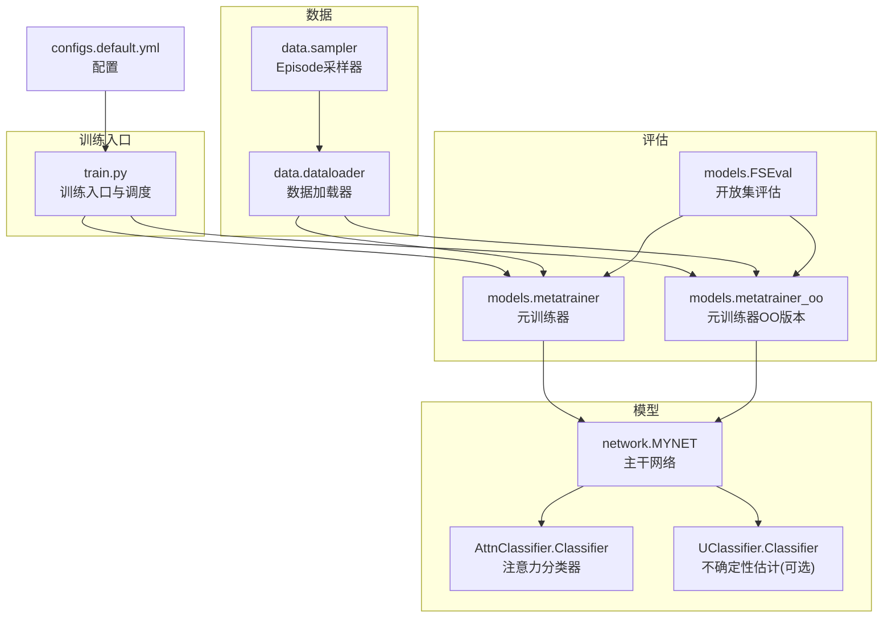
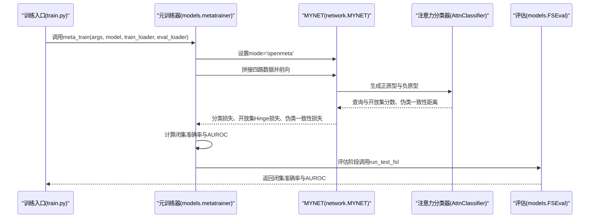
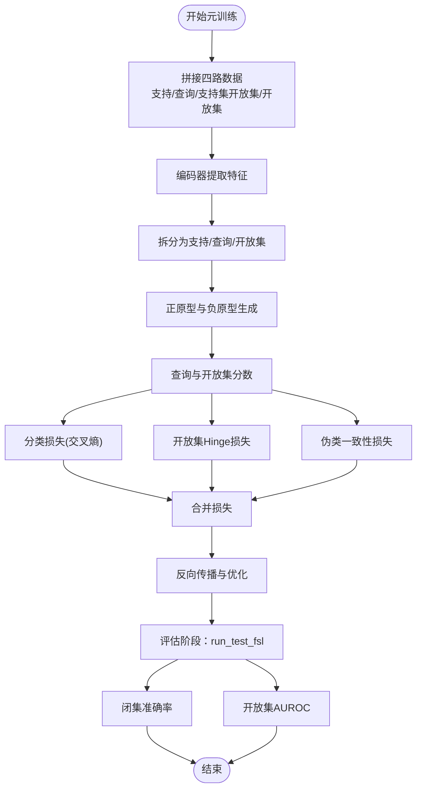
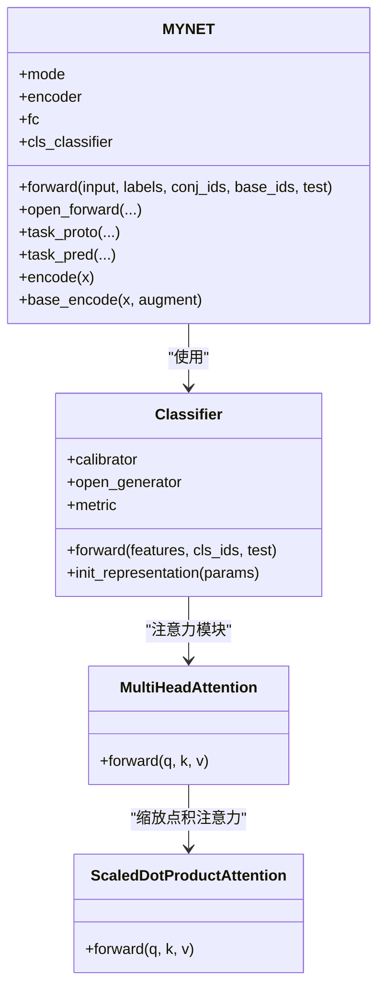
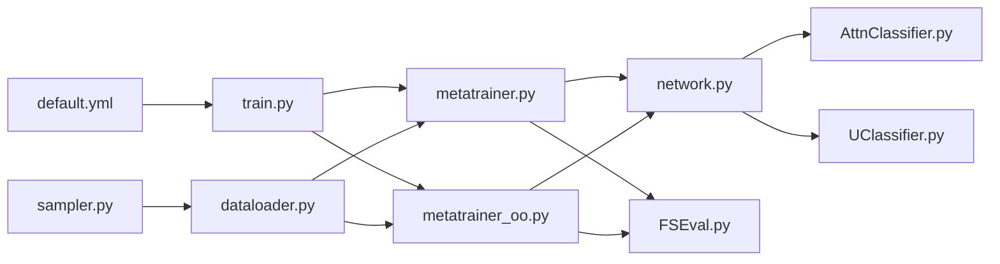

# 元训练器

<cite>
**本文引用的文件**
- [metatrainer.py](file://models/metatrainer.py)
- [metatrainer_oo.py](file://models/metatrainer_oo.py)
- [network.py](file://network.py)
- [AttnClassifier.py](file://models/AttnClassifier.py)
- [UClassifier.py](file://models/UClassifier.py)
- [FSEval.py](file://models/FSEval.py)
- [dataloader.py](file://data/dataloader.py)
- [sampler.py](file://data/sampler.py)
- [default.yml](file://configs/default.yml)
- [train.py](file://train.py)
</cite>

## 目录
1. [简介](#简介)
2. [项目结构](#项目结构)
3. [核心组件](#核心组件)
4. [架构总览](#架构总览)
5. [详细组件分析](#详细组件分析)
6. [依赖关系分析](#依赖关系分析)
7. [性能考量](#性能考量)
8. [故障排查指南](#故障排查指南)
9. [结论](#结论)
10. [附录](#附录)

## 简介
本文件系统性介绍元训练器（MetaTrainer）的设计理念与实现原理，覆盖支持集与查询集的处理机制、原型生成与更新策略、特征提取、注意力计算、损失函数设计等关键环节。同时对比元训练器与元训练器OO版本的差异与适用场景，并提供完整使用示例与配置参数说明，帮助在不同数据集上开展元训练。

## 项目结构
该项目围绕“音频开放集增量学习”目标构建，包含以下关键模块：
- 模型定义与网络：MYNET主干网络、注意力分类器、特征增强模块
- 训练流程：元训练器（含OO版本）、基线预训练、增量测试
- 数据加载与采样：支持多种数据集的Episode采样与课程学习
- 评估工具：开放集评估与置信区间统计

图表来源
- [train.py:800-1001](file://train.py#L800-L1001)
- [metatrainer.py:17-85](file://models/metatrainer.py#L17-L85)
- [metatrainer_oo.py:17-85](file://models/metatrainer_oo.py#L17-L85)
- [network.py:18-504](file://network.py#L18-L504)
- [AttnClassifier.py:38-120](file://models/AttnClassifier.py#L38-L120)
- [UClassifier.py:7-405](file://models/UClassifier.py#L7-L405)
- [FSEval.py:17-42](file://models/FSEval.py#L17-L42)
- [dataloader.py:19-46](file://data/dataloader.py#L19-L46)
- [sampler.py:6-140](file://data/sampler.py#L6-L140)
- [default.yml:1-88](file://configs/default.yml#L1-L88)

章节来源
- [train.py:800-1001](file://train.py#L800-L1001)
- [default.yml:1-88](file://configs/default.yml#L1-L88)

## 核心组件
- 元训练器（MetaTrainer）：负责在openmeta模式下，对支持集、查询集、支持集开放集与开放集四路数据进行联合训练，计算分类损失、开放集Hinge损失与伪类一致性损失，评估闭集准确率与开放集AUROC。
- 元训练器OO版本：与MetaTrainer类似，但在开放集AUROC计算上采用“1对1判决”的不确定性打分策略，更适合严格区分已知/未知的场景。
- MYNET主干网络：包含音频特征提取器（ResNet18）、分类头（注意力分类器）、温度缩放与多头注意力模块。
- 注意力分类器（AttnClassifier）：支持正原型校准、负原型（伪类）生成、余弦相似度度量与温度缩放。
- 不确定性估计（UClassifier）：提供MC Dropout与掩码增强的不确定性估计能力，支持增量学习中的重要性加权更新。
- 数据加载与采样：支持多种数据集的Episode采样，包含课程学习采样器。
- 开放集评估（FSEval）：在测试阶段对支持集、查询集与开放集进行特征提取与概率计算，输出闭集准确率与AUROC。

章节来源
- [metatrainer.py:17-85](file://models/metatrainer.py#L17-L85)
- [metatrainer_oo.py:17-85](file://models/metatrainer_oo.py#L17-L85)
- [network.py:18-504](file://network.py#L18-L504)
- [AttnClassifier.py:38-120](file://models/AttnClassifier.py#L38-L120)
- [UClassifier.py:7-405](file://models/UClassifier.py#L7-L405)
- [FSEval.py:17-42](file://models/FSEval.py#L17-L42)
- [dataloader.py:19-46](file://data/dataloader.py#L19-L46)
- [sampler.py:6-140](file://data/sampler.py#L6-L140)

## 架构总览
元训练流程的关键路径如下：
- 训练入口加载配置与数据，初始化MYNET并进入openmeta模式
- 元训练器将支持集、查询集、支持集开放集与开放集四路数据拼接后送入编码器
- 编码器输出特征后拆分为支持、查询、开放集三路，分别计算正原型与负原型
- 分类头输出查询与开放集的余弦分数，结合动态标签与温度缩放得到分类损失
- 开放集Hinge损失促使负原型与正原型拉开距离，伪类一致性损失约束生成器输出
- 评估阶段使用FSEval对支持、查询、开放集进行特征提取与概率计算，统计闭集准确率与AUROC

图表来源
- [train.py:800-821](file://train.py#L800-L821)
- [metatrainer.py:17-85](file://models/metatrainer.py#L17-L85)
- [network.py:102-151](file://network.py#L102-L151)
- [AttnClassifier.py:47-93](file://models/AttnClassifier.py#L47-L93)
- [FSEval.py:17-42](file://models/FSEval.py#L17-L42)

## 详细组件分析

### 元训练器（MetaTrainer）
- 支持集与查询集处理：将支持集与查询集拼接后送入编码器，分别拆分为支持特征与查询特征，用于正原型与查询分数计算。
- 支持集开放集与开放集：同样拼接后拆分，用于负原型生成与开放集分数计算。
- 模式切换：设置model.mode='openmeta'，使网络进入元训练模式。
- 损失函数设计：
  - 分类损失：对查询与开放集的动态标签计算交叉熵
  - 开放集Hinge损失：约束负原型与正原型之间的最小距离
  - 伪类一致性损失：通过二元交叉熵约束伪类判别
- 评估指标：
  - 闭集准确率：仅基于查询集的已知类预测
  - 开放集AUROC：基于查询与开放集的概率分数

图表来源
- [metatrainer.py:87-178](file://models/metatrainer.py#L87-L178)
- [network.py:102-151](file://network.py#L102-L151)
- [FSEval.py:17-42](file://models/FSEval.py#L17-L42)

章节来源
- [metatrainer.py:17-85](file://models/metatrainer.py#L17-L85)
- [metatrainer.py:87-178](file://models/metatrainer.py#L87-L178)

### 元训练器OO版本
- 主要差异在于开放集AUROC的计算策略：采用“1对1判决”的不确定性打分，即针对每个样本，比较其预测类别对应的正分与负分之差，作为未知度量，再进行AUROC计算。
- 更适合需要严格区分已知/未知样本的场景，提升开放集检测的稳健性。

章节来源
- [metatrainer_oo.py:17-85](file://models/metatrainer_oo.py#L17-L85)
- [metatrainer_oo.py:87-214](file://models/metatrainer_oo.py#L87-L214)

### MYNET主干网络
- 音频特征提取：基于ResNet18的Mel频谱特征提取，支持SpecAugment与时域增强。
- 分类头：注意力分类器负责正原型校准与负原型生成，余弦相似度度量与温度缩放。
- 多头注意力：用于原型与查询之间的注意力聚合，提升判别能力。
- 模式切换：支持'encoder'、'openmeta'等模式，便于不同阶段的前向传播。

图表来源
- [network.py:18-504](file://network.py#L18-L504)
- [AttnClassifier.py:38-120](file://models/AttnClassifier.py#L38-L120)
- [AttnClassifier.py:274-369](file://models/AttnClassifier.py#L274-L369)

章节来源
- [network.py:18-504](file://network.py#L18-L504)
- [AttnClassifier.py:38-120](file://models/AttnClassifier.py#L38-L120)

### 注意力分类器（AttnClassifier）
- 正原型校准：通过多头注意力聚合支持集特征，生成正原型
- 负原型（伪类）生成：基于正原型与基础原型库，生成负原型，用于开放集判别
- 余弦相似度度量：对查询与开放集特征进行余弦相似度计算，并通过温度参数缩放
- 温度参数：可学习的温度缩放参数，控制相似度分布的锐利程度

章节来源
- [AttnClassifier.py:38-120](file://models/AttnClassifier.py#L38-L120)
- [AttnClassifier.py:352-369](file://models/AttnClassifier.py#L352-L369)

### 不确定性估计（UClassifier）
- MC Dropout与掩码增强：通过多次前向传播与随机掩码，计算预测矩阵的核范数，作为不确定性度量
- 重要性权重缓存：支持增量学习中的重要性加权更新
- 与注意力分类器协同：在不确定性估计开启时，为训练提供鲁棒性

章节来源
- [UClassifier.py:7-405](file://models/UClassifier.py#L7-L405)

### 数据加载与采样
- Episode采样：支持固定way/shot与query数量的Episode构造，适用于元训练
- 课程学习采样：根据当前活跃类别集合动态调整采样池，实现从易到难的学习曲线
- 多数据集适配：支持FMC、NSynth、LibriSpeech等多种数据集

章节来源
- [dataloader.py:19-46](file://data/dataloader.py#L19-L46)
- [dataloader.py:263-351](file://data/dataloader.py#L263-L351)
- [sampler.py:6-140](file://data/sampler.py#L6-L140)

### 开放集评估（FSEval）
- 特征提取：对支持集、查询集与开放集分别提取特征并归一化
- 概率计算：对查询与开放集进行余弦相似度计算并softmax得到概率
- 指标统计：计算闭集准确率与AUROC（支持置信区间）

章节来源
- [FSEval.py:17-42](file://models/FSEval.py#L17-L42)
- [FSEval.py:46-73](file://models/FSEval.py#L46-L73)
- [FSEval.py:77-112](file://models/FSEval.py#L77-L112)

## 依赖关系分析
- 训练入口依赖配置文件与数据加载器，初始化MYNET并调用元训练器
- 元训练器依赖MYNET的openmeta前向与任务原型计算
- MYNET依赖注意力分类器与多头注意力模块
- 评估阶段依赖FSEval进行特征提取与概率计算

图表来源
- [default.yml:1-88](file://configs/default.yml#L1-L88)
- [train.py:800-1001](file://train.py#L800-L1001)
- [metatrainer.py:17-85](file://models/metatrainer.py#L17-L85)
- [metatrainer_oo.py:17-85](file://models/metatrainer_oo.py#L17-L85)
- [network.py:18-504](file://network.py#L18-L504)
- [AttnClassifier.py:38-120](file://models/AttnClassifier.py#L38-L120)
- [UClassifier.py:7-405](file://models/UClassifier.py#L7-L405)
- [FSEval.py:17-42](file://models/FSEval.py#L17-L42)
- [dataloader.py:19-46](file://data/dataloader.py#L19-L46)
- [sampler.py:6-140](file://data/sampler.py#L6-L140)

章节来源
- [train.py:800-1001](file://train.py#L800-L1001)
- [metatrainer.py:17-85](file://models/metatrainer.py#L17-L85)
- [metatrainer_oo.py:17-85](file://models/metatrainer_oo.py#L17-L85)
- [network.py:18-504](file://network.py#L18-L504)
- [AttnClassifier.py:38-120](file://models/AttnClassifier.py#L38-L120)
- [UClassifier.py:7-405](file://models/UClassifier.py#L7-L405)
- [FSEval.py:17-42](file://models/FSEval.py#L17-L42)
- [dataloader.py:19-46](file://data/dataloader.py#L19-L46)
- [sampler.py:6-140](file://data/sampler.py#L6-L140)

## 性能考量
- 训练稳定性：通过温度缩放与多头注意力提升判别能力；在生成负原型时引入噪声，缓解特征坍缩
- 开放集判别：Hinge损失与伪类一致性损失共同作用，提升未知样本的判别能力
- 评估效率：评估阶段使用FSEval进行批量特征提取与概率计算，支持置信区间统计
- 数据采样：课程学习采样器可根据活跃类别动态调整采样池，提高学习效率

## 故障排查指南
- 训练不收敛或AUROC偏低：检查温度参数是否合适，确认Hinge损失与伪类一致性损失权重设置
- 开放集判别效果不佳：确认负原型生成策略与注意力模块配置，适当调整margin与伪类聚合方式
- 数据加载异常：检查Episode采样器与数据集索引，确保way/shot/query数量与配置一致
- 评估指标异常：确认评估阶段的标签分配与概率计算逻辑，确保查询与开放集的标签正确拼接

章节来源
- [network.py:134-151](file://network.py#L134-L151)
- [metatrainer.py:132-154](file://models/metatrainer.py#L132-L154)
- [dataloader.py:263-351](file://data/dataloader.py#L263-L351)

## 结论
元训练器通过支持集与查询集的联合建模、正负原型的注意力生成与温度缩放，实现了在开放集场景下的稳健分类与未知判别。元训练器OO版本进一步提升了开放集AUROC的可靠性。配合课程学习采样与高效评估工具，可在多种音频数据集上实现良好的增量学习效果。

## 附录

### 使用示例与配置参数说明
- 基本使用流程
  - 配置参数：参考默认配置文件，设置way/shot/n_queries、n_ways/n_open_ways、学习率与优化器参数
  - 训练入口：运行训练脚本，自动完成基线预训练、元训练与增量测试
  - 元训练器调用：在训练入口中调用元训练器，传入模型、数据加载器与评估配置
- 关键参数
  - way/shot/n_queries：元训练的类别数、每类样本数与查询数
  - n_ways/n_open_ways：支持集与开放集的类别数
  - learning_rate/optimizer：学习率与优化器配置
  - cosine：是否使用余弦退火学习率调度
  - gamma/funit：开放集Hinge损失与伪类一致性损失的权重
  - hinge_margin：Hinge损失的阈值
- 适用场景
  - 元训练器：通用开放集增量学习，AUROC计算基于整体概率
  - 元训练器OO版本：需要严格区分已知/未知的场景，AUROC计算采用1对1判决

章节来源
- [default.yml:1-88](file://configs/default.yml#L1-L88)
- [train.py:800-1001](file://train.py#L800-L1001)
- [metatrainer.py:17-85](file://models/metatrainer.py#L17-L85)
- [metatrainer_oo.py:17-85](file://models/metatrainer_oo.py#L17-L85)