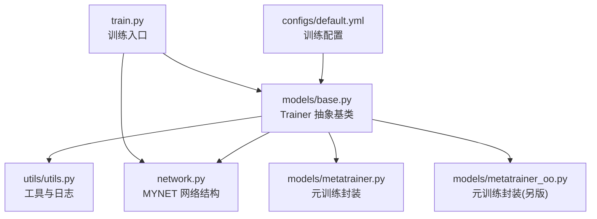
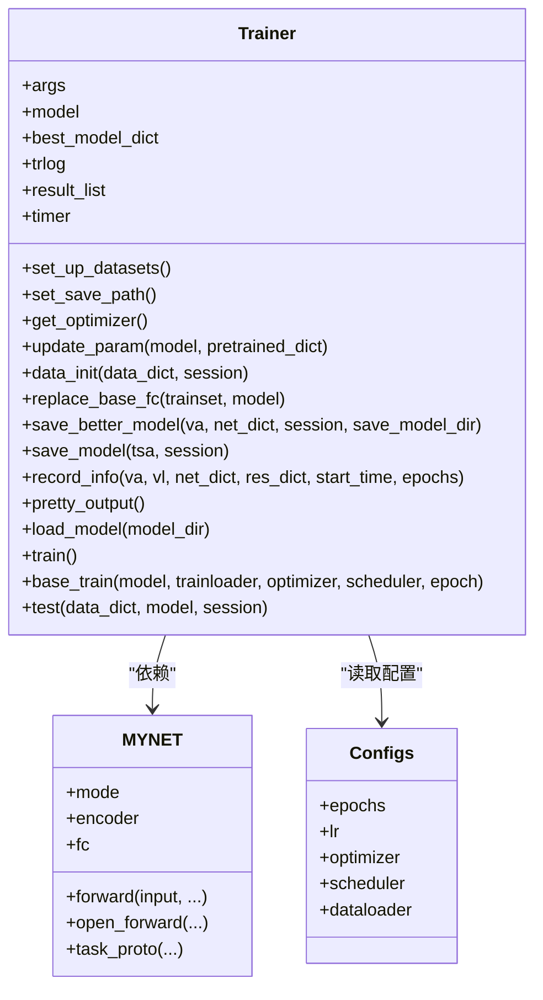
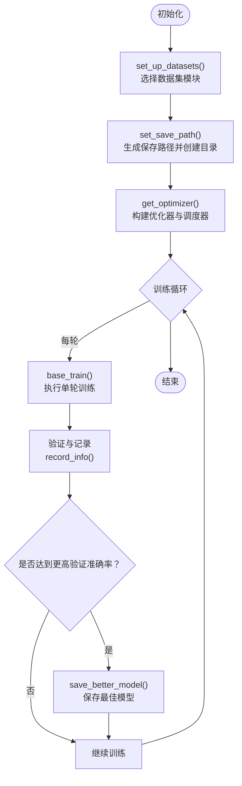
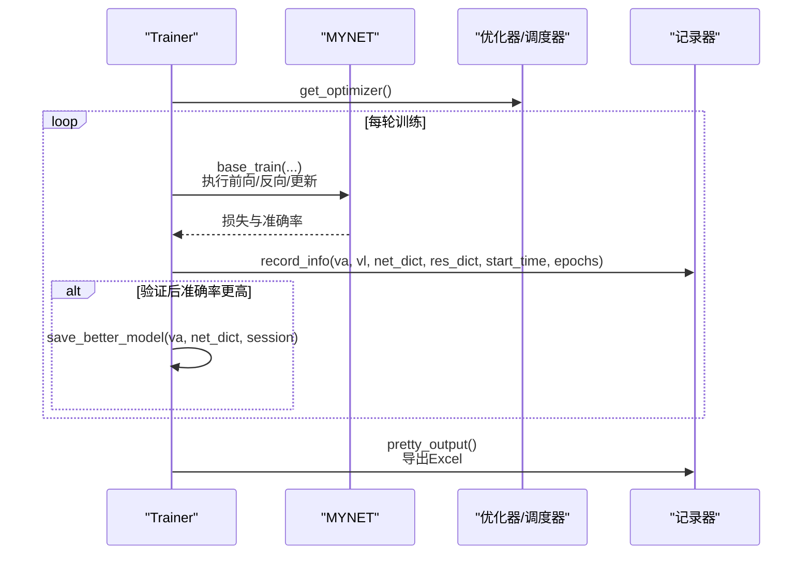
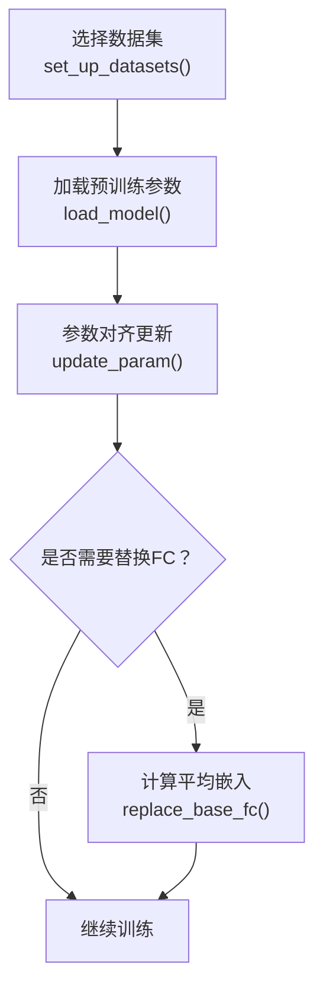
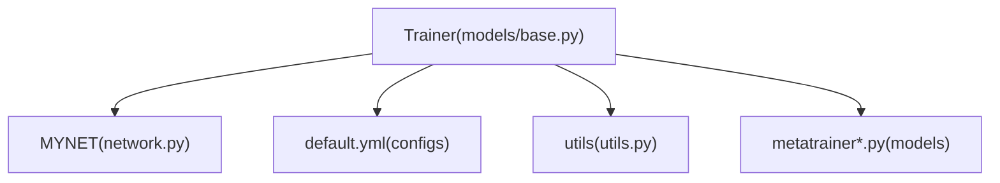

# 基础训练器

<cite>
**本文引用的文件**
- [models/base.py](file://models/base.py)
- [configs/default.yml](file://configs/default.yml)
- [network.py](file://network.py)
- [utils/utils.py](file://utils/utils.py)
- [models/metatrainer.py](file://models/metatrainer.py)
- [models/metatrainer_oo.py](file://models/metatrainer_oo.py)
- [train.py](file://train.py)
- [models/baselines/base.py](file://models/baselines/base.py)
- [models/baselines/cil_methods/amfo.py](file://models/baselines/cil_methods/amfo.py)
- [models/baselines/osr_methods/mls.py](file://models/baselines/osr_methods/mls.py)
</cite>

## 目录
1. [简介](#简介)
2. [项目结构](#项目结构)
3. [核心组件](#核心组件)
4. [架构总览](#架构总览)
5. [详细组件分析](#详细组件分析)
6. [依赖分析](#依赖分析)
7. [性能考虑](#性能考虑)
8. [故障排查指南](#故障排查指南)
9. [结论](#结论)
10. [附录](#附录)

## 简介
本文件围绕“基础训练器”（Trainer）展开，系统阐述其抽象基类的设计与实现要点，覆盖以下主题：
- 数据集初始化与切换机制
- 模型保存路径设置与命名规则
- 训练统计记录与结果导出
- 训练循环中的优化器与学习率调度配置
- 模型保存与加载策略
- 基类方法在不同场景下的职责与扩展点
- 使用示例与最佳实践
- 错误处理与调试技巧

Trainer 抽象基类位于 models/base.py，是增量/元学习等训练流程的统一入口，配合配置文件 configs/default.yml、网络结构 network.py 以及工具模块 utils/utils.py 实现完整的训练生命周期管理。

## 项目结构
与 Trainer 直接相关的关键目录与文件如下：
- models/base.py：Trainer 抽象基类，定义训练器骨架与通用能力
- configs/default.yml：训练超参、优化器、调度器、数据加载器等配置
- network.py：MYNET 网络结构，包含前向模式（encoder/openmeta 等）与分类器
- utils/utils.py：计数器、路径创建、日志打印等工具
- models/metatrainer*.py：元训练流程封装（与 Trainer 的协作）
- train.py：训练入口与脚手架（包含若干训练辅助函数）

**图表来源**
- [models/base.py:27-254](file://models/base.py#L27-L254)
- [configs/default.yml:1-88](file://configs/default.yml#L1-L88)
- [network.py:18-151](file://network.py#L18-L151)
- [utils/utils.py:182-200](file://utils/utils.py#L182-L200)
- [models/metatrainer.py:17-85](file://models/metatrainer.py#L17-L85)
- [models/metatrainer_oo.py:17-85](file://models/metatrainer_oo.py#L17-L85)
- [train.py:799-1313](file://train.py#L799-L1313)

**章节来源**
- [models/base.py:27-254](file://models/base.py#L27-L254)
- [configs/default.yml:1-88](file://configs/default.yml#L1-L88)
- [network.py:18-151](file://network.py#L18-L151)
- [utils/utils.py:182-200](file://utils/utils.py#L182-L200)
- [models/metatrainer.py:17-85](file://models/metatrainer.py#L17-L85)
- [models/metatrainer_oo.py:17-85](file://models/metatrainer_oo.py#L17-L85)
- [train.py:799-1313](file://train.py#L799-L1313)

## 核心组件
- Trainer 抽象基类
  - 负责：数据集初始化、保存路径设置、训练统计记录、模型保存与加载、学习率调度、基础训练循环钩子
  - 关键方法：set_up_datasets、set_save_path、get_optimizer、record_info、save_model、save_better_model、load_model、test、base_train 等
- 配置系统
  - 通过 configs/default.yml 提供训练超参、优化器与调度器策略、数据加载器参数等
- 网络结构
  - MYNET 支持多种模式（encoder/openmeta 等），并与 Trainer 的训练循环协同工作
- 工具模块
  - 提供路径创建、计数器、计时器、日志打印等基础设施

**章节来源**
- [models/base.py:27-254](file://models/base.py#L27-L254)
- [configs/default.yml:22-41](file://configs/default.yml#L22-L41)
- [network.py:18-49](file://network.py#L18-L49)
- [utils/utils.py:182-200](file://utils/utils.py#L182-L200)

## 架构总览
Trainer 作为抽象基类，向上承接训练入口（train.py），向下对接网络结构（network.py）、配置（configs/default.yml）与工具（utils/utils.py）。其核心职责是：
- 统一训练生命周期管理
- 统一模型保存/加载策略
- 统一训练统计与结果导出
- 提供可扩展的训练循环钩子（train/base_train/test）

**图表来源**
- [models/base.py:27-254](file://models/base.py#L27-L254)
- [network.py:18-151](file://network.py#L18-L151)
- [configs/default.yml:22-60](file://configs/default.yml#L22-L60)

## 详细组件分析

### Trainer 抽象基类设计与职责
- 数据集初始化
  - set_up_datasets：根据 args.dataset 动态导入对应的数据集模块，并写入 args.Dataset，便于后续数据加载器选择
- 保存路径设置
  - set_save_path：依据 debug 标志、数据集名、项目名、配置文件名及超参组合生成唯一保存路径，并确保目录存在
- 训练统计与结果导出
  - trlog：记录训练/验证/测试损失与准确率、各会话最高准确率与对应轮次
  - result_list：按轮次记录格式化信息
  - pretty_output：汇总输出到 Excel 文件，便于实验复盘
- 优化器与学习率调度
  - get_optimizer：默认使用 SGD 优化器，支持 Step/Milestone 两种调度策略
- 模型保存与加载
  - save_model/save_better_model：保存当前最高验证准确率对应的模型与优化器状态
  - load_model/update_param：从外部预训练权重加载并按键名对齐更新模型参数
- 基础训练循环钩子
  - base_train：占位方法，子类可覆盖实现标准分类训练循环
  - test：占位方法，子类可覆盖实现测试流程
- 基类 FC 替换
  - data_init/replace_base_fc：在增量场景下，用训练集平均嵌入替换分类头权重，形成“平均嵌入分类器”

**图表来源**
- [models/base.py:51-100](file://models/base.py#L51-L100)
- [models/base.py:177-191](file://models/base.py#L177-L191)
- [models/base.py:153-176](file://models/base.py#L153-L176)
- [models/base.py:250-254](file://models/base.py#L250-L254)

**章节来源**
- [models/base.py:51-100](file://models/base.py#L51-L100)
- [models/base.py:102-152](file://models/base.py#L102-L152)
- [models/base.py:153-176](file://models/base.py#L153-L176)
- [models/base.py:177-191](file://models/base.py#L177-L191)
- [models/base.py:236-254](file://models/base.py#L236-L254)

### 训练循环实现机制
- 优化器与调度器
  - 默认使用 SGD，权重衰减来自配置；调度器支持 Step 与 MultiStep 两种策略
- 训练统计
  - record_info：记录每轮学习率、训练/验证损失与准确率，并打印剩余预计耗时
- 模型保存策略
  - save_model：按会话保存最终模型
  - save_better_model：若验证准确率提升则覆盖保存，并记录最佳轮次
- 测试钩子
  - test：由子类实现具体测试逻辑（如增量测试、元测试等）

**图表来源**
- [models/base.py:91-100](file://models/base.py#L91-L100)
- [models/base.py:177-191](file://models/base.py#L177-L191)
- [models/base.py:153-176](file://models/base.py#L153-L176)
- [models/base.py:224-233](file://models/base.py#L224-L233)

**章节来源**
- [models/base.py:91-100](file://models/base.py#L91-L100)
- [models/base.py:177-191](file://models/base.py#L177-L191)
- [models/base.py:153-176](file://models/base.py#L153-L176)
- [models/base.py:224-233](file://models/base.py#L224-L233)

### 数据集切换机制与模型参数更新
- 数据集切换
  - set_up_datasets：根据 args.dataset 动态导入对应模块并写入 args.Dataset，便于后续数据加载器选择
- 模型参数更新
  - update_param：将外部预训练字典按键名对齐更新至当前模型 state_dict，并加载到模型
  - load_model：从指定路径加载预训练权重并调用 update_param 更新模型
- 增量场景下的 FC 替换
  - data_init/replace_base_fc：在增量会话开始前，用训练集平均嵌入替换分类头权重，形成“平均嵌入分类器”，便于后续增量学习

**图表来源**
- [models/base.py:51-66](file://models/base.py#L51-L66)
- [models/base.py:236-244](file://models/base.py#L236-L244)
- [models/base.py:102-109](file://models/base.py#L102-L109)
- [models/base.py:111-151](file://models/base.py#L111-L151)

**章节来源**
- [models/base.py:51-66](file://models/base.py#L51-L66)
- [models/base.py:236-244](file://models/base.py#L236-L244)
- [models/base.py:102-109](file://models/base.py#L102-L109)
- [models/base.py:111-151](file://models/base.py#L111-L151)

### 训练统计与结果导出
- trlog：维护训练/验证/测试损失与准确率序列，以及各会话最高准确率与对应轮次
- result_list：逐轮格式化输出，便于快速查看
- pretty_output：将最终结果与综合指标（如 CPI、PD、MSR、AR）写入 Excel，便于复盘

**章节来源**
- [models/base.py:37-49](file://models/base.py#L37-L49)
- [models/base.py:177-191](file://models/base.py#L177-L191)
- [models/base.py:224-233](file://models/base.py#L224-L233)

### 元训练与 Trainer 的协作
- models/metatrainer*.py 提供元训练流程封装，与 Trainer 的训练循环相辅相成
- 典型流程：加载预训练特征提取器权重，冻结特征提取器部分参数，仅训练分类头；结合学习率调度与定期保存策略

**章节来源**
- [models/metatrainer.py:17-85](file://models/metatrainer.py#L17-L85)
- [models/metatrainer_oo.py:17-85](file://models/metatrainer_oo.py#L17-L85)

### 使用示例：继承 Trainer 并实现自定义训练逻辑
- 步骤概览
  - 继承 Trainer，实现抽象方法 train/base_train/test
  - 在 __init__ 中调用父类构造，完成数据集初始化与保存路径设置
  - 在 base_train 中实现标准分类训练循环（前向、损失、反向、优化器步进、调度器步进）
  - 在 train 中组织多会话训练，调用 data_init/replace_base_fc（如需）与 save_better_model
  - 在 test 中实现测试逻辑（如增量测试）
- 参考路径
  - Trainer 抽象基类与方法定义：[models/base.py:27-254](file://models/base.py#L27-L254)
  - 训练入口与脚手架：[train.py:799-1313](file://train.py#L799-L1313)
  - 网络结构与模式切换：[network.py:18-151](file://network.py#L18-L151)
  - 配置项参考：[configs/default.yml:22-41](file://configs/default.yml#L22-L41)

**章节来源**
- [models/base.py:27-254](file://models/base.py#L27-L254)
- [train.py:799-1313](file://train.py#L799-L1313)
- [network.py:18-151](file://network.py#L18-L151)
- [configs/default.yml:22-41](file://configs/default.yml#L22-L41)

## 依赖分析
- Trainer 与 MYNET 的耦合
  - Trainer 通过 args.model 与 MYNET 协作，MYNET 的 mode 字段控制前向行为（encoder/openmeta 等）
- Trainer 与配置的耦合
  - 优化器、调度器、学习率、批大小等均来自 configs/default.yml
- Trainer 与工具模块的耦合
  - 路径创建、计数器、计时器等由 utils/utils.py 提供

**图表来源**
- [models/base.py:27-254](file://models/base.py#L27-L254)
- [network.py:18-151](file://network.py#L18-L151)
- [configs/default.yml:22-41](file://configs/default.yml#L22-L41)
- [utils/utils.py:182-200](file://utils/utils.py#L182-L200)
- [models/metatrainer.py:17-85](file://models/metatrainer.py#L17-L85)
- [models/metatrainer_oo.py:17-85](file://models/metatrainer_oo.py#L17-L85)

**章节来源**
- [models/base.py:27-254](file://models/base.py#L27-L254)
- [network.py:18-151](file://network.py#L18-L151)
- [configs/default.yml:22-41](file://configs/default.yml#L22-L41)
- [utils/utils.py:182-200](file://utils/utils.py#L182-L200)
- [models/metatrainer.py:17-85](file://models/metatrainer.py#L17-L85)
- [models/metatrainer_oo.py:17-85](file://models/metatrainer_oo.py#L17-L85)

## 性能考虑
- 优化器与调度器
  - 默认 SGD + Nesterov，权重衰减来自配置；Step/Milestone 调度器可按需调整步长与衰减因子
- 数据加载
  - dataloader 参数（num_workers、batch_size）在配置中集中管理，建议根据硬件资源合理设置
- 训练统计与 I/O
  - record_info 每轮打印耗时与剩余时间，有助于监控训练进度；pretty_output 导出 Excel 适合离线分析
- 模型保存
  - save_better_model 仅在验证准确率提升时保存，减少冗余 I/O；建议结合磁盘空间与实验周期合理规划

[本节为通用指导，无需特定文件引用]

## 故障排查指南
- 无法找到预训练模型
  - 现象：load_model 未传入 model_dir 或路径不存在
  - 处理：确保传入有效路径或允许空参数（基类会给出警告提示）
  - 参考：[models/base.py:236-244](file://models/base.py#L236-L244)
- 保存路径不存在或权限不足
  - 现象：set_save_path 创建目录失败
  - 处理：确认 checkpoints/* 目录可写，或调整 save_path
  - 参考：[models/base.py:68-83](file://models/base.py#L68-L83)、[utils/utils.py:182-188](file://utils/utils.py#L182-L188)
- 学习率调度未生效
  - 现象：训练中学习率未按计划下降
  - 处理：确认 scheduler.schedule 与配置一致（Step/Milestone），并在每轮结束后调用 scheduler.step()
  - 参考：[models/base.py:95-99](file://models/base.py#L95-L99)、[configs/default.yml:34-38](file://configs/default.yml#L34-L38)
- 增量场景 FC 替换异常
  - 现象：替换后分类头维度不匹配或类别数不一致
  - 处理：确保训练集类别数与 num_base 或 stdu.num_tmpb 一致；检查 replace_base_fc 的断言
  - 参考：[models/base.py:120-151](file://models/base.py#L120-L151)
- 训练统计缺失或不更新
  - 现象：trlog 为空或未记录
  - 处理：确认每轮调用 record_info；检查 args.num_session 与会话编号
  - 参考：[models/base.py:37-49](file://models/base.py#L37-L49)、[models/base.py:177-191](file://models/base.py#L177-L191)

**章节来源**
- [models/base.py:236-244](file://models/base.py#L236-L244)
- [models/base.py:68-83](file://models/base.py#L68-L83)
- [utils/utils.py:182-188](file://utils/utils.py#L182-L188)
- [models/base.py:95-99](file://models/base.py#L95-L99)
- [configs/default.yml:34-38](file://configs/default.yml#L34-L38)
- [models/base.py:120-151](file://models/base.py#L120-L151)
- [models/base.py:37-49](file://models/base.py#L37-L49)
- [models/base.py:177-191](file://models/base.py#L177-L191)

## 结论
Trainer 抽象基类提供了统一的训练生命周期管理框架，涵盖数据集初始化、保存路径设置、训练统计、优化器与调度器配置、模型保存与加载、以及增量场景下的 FC 替换等关键能力。通过与 configs/default.yml、network.py、utils/utils.py 的协作，Trainer 能够支撑从标准分类训练到增量/元学习等多种训练范式。建议在继承 Trainer 时遵循其方法约定，确保训练流程稳定可复现，并结合 pretty_output 与 save_better_model 等机制做好实验记录与模型管理。

[本节为总结性内容，无需特定文件引用]

## 附录
- 相关实现参考路径
  - Trainer 抽象基类与方法：[models/base.py:27-254](file://models/base.py#L27-L254)
  - 训练入口与脚手架：[train.py:799-1313](file://train.py#L799-L1313)
  - 网络结构与模式切换：[network.py:18-151](file://network.py#L18-L151)
  - 配置项参考：[configs/default.yml:22-41](file://configs/default.yml#L22-L41)
  - 工具模块：[utils/utils.py:182-200](file://utils/utils.py#L182-L200)
  - 元训练封装：[models/metatrainer.py:17-85](file://models/metatrainer.py#L17-L85)、[models/metatrainer_oo.py:17-85](file://models/metatrainer_oo.py#L17-L85)
  - 增量/开放集基类与示例：[models/baselines/base.py:11-76](file://models/baselines/base.py#L11-L76)、[models/baselines/cil_methods/amfo.py:19-65](file://models/baselines/cil_methods/amfo.py#L19-L65)、[models/baselines/osr_methods/mls.py:15-26](file://models/baselines/osr_methods/mls.py#L15-L26)