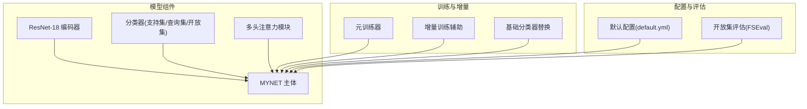
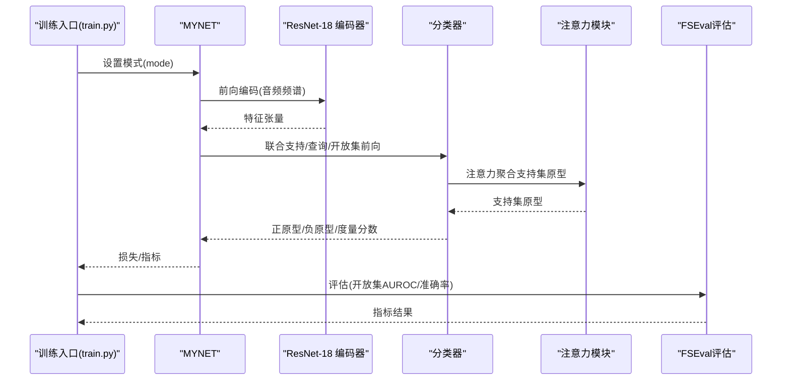
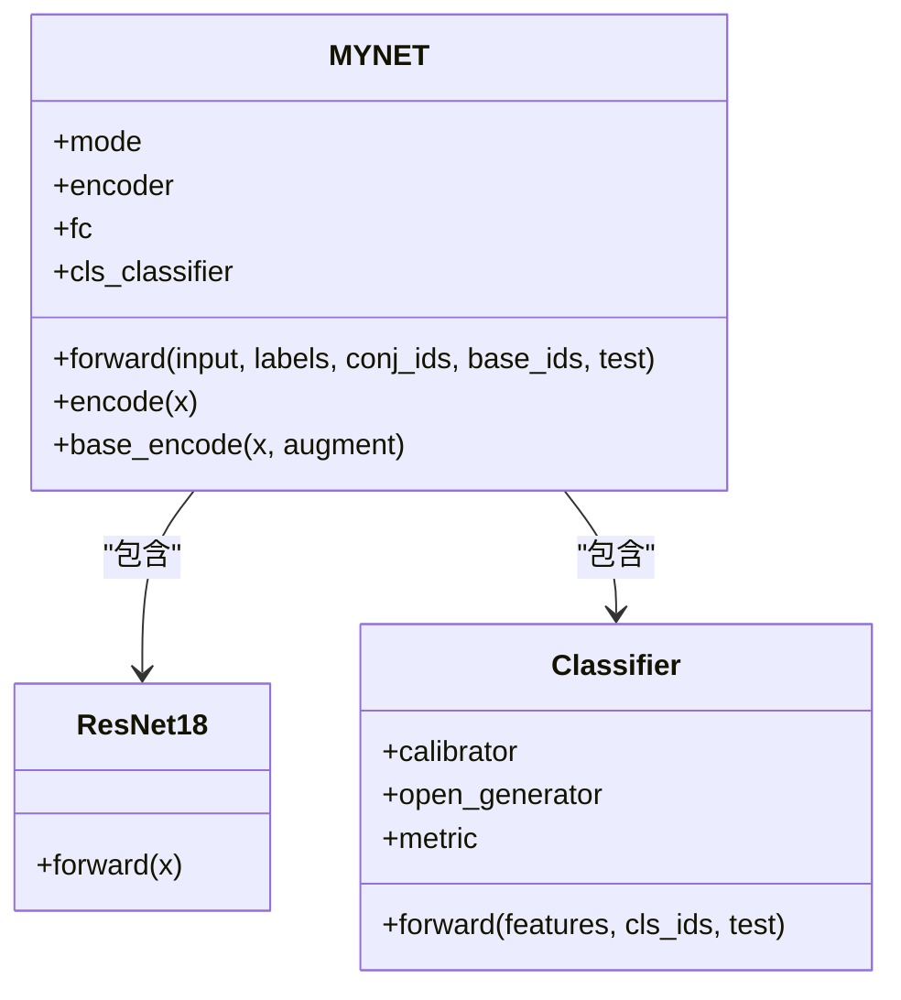
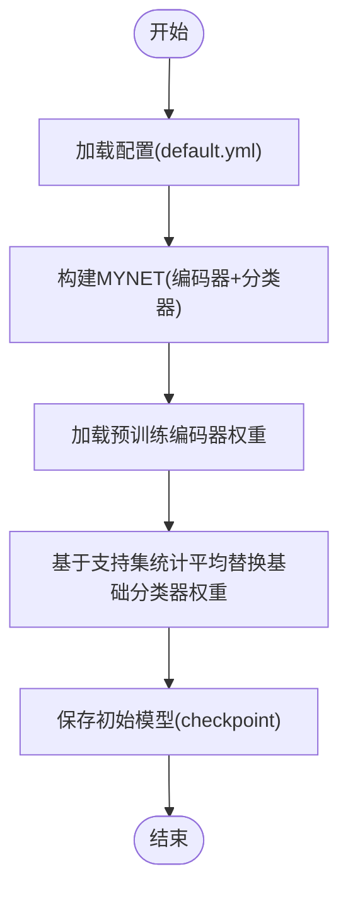
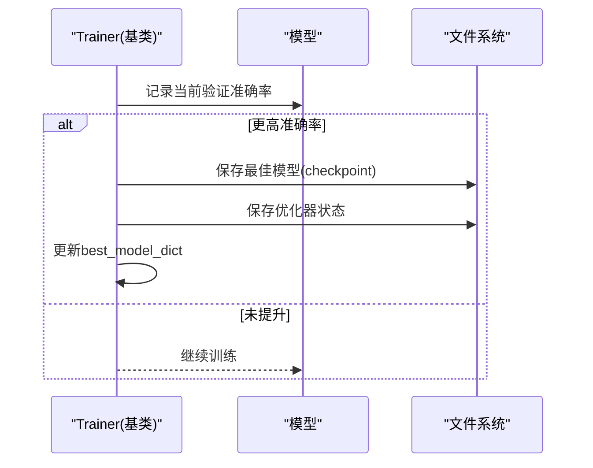
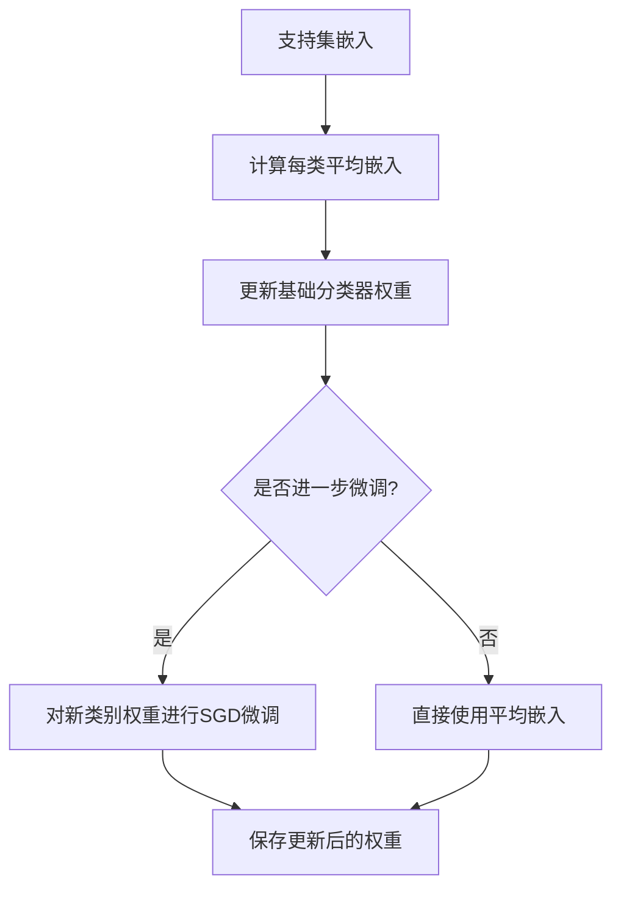
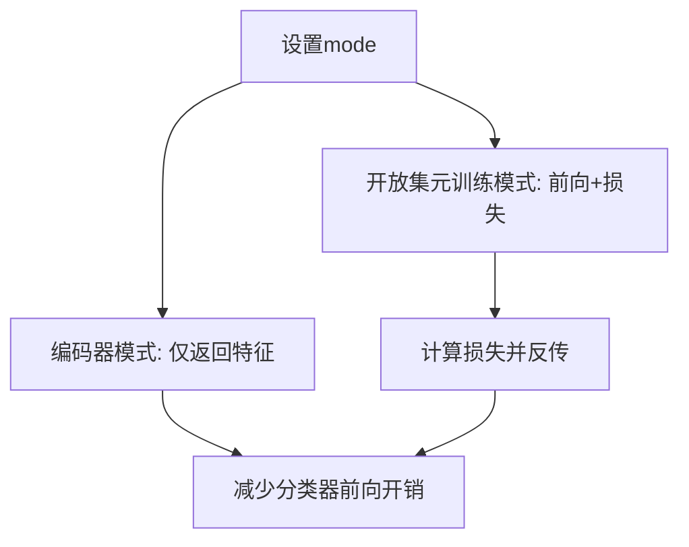
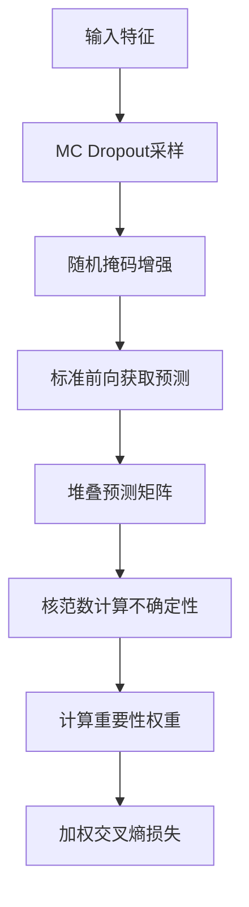
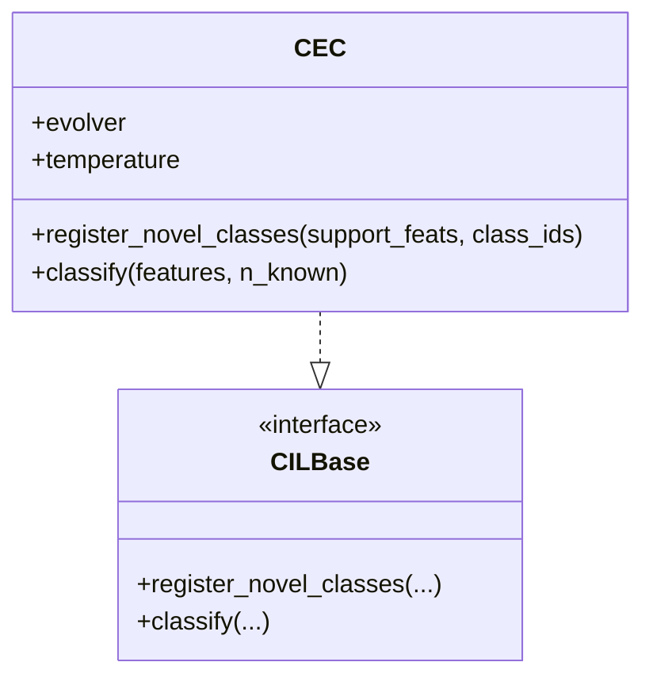
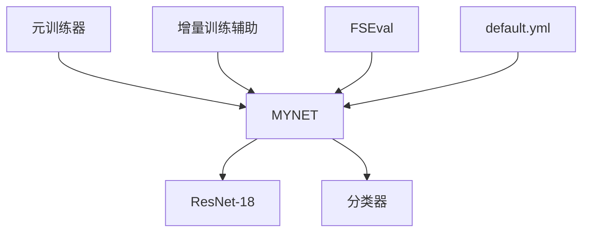

# 模型管理

<cite>
**本文引用的文件列表**
- [models/base.py](file://models/base.py)
- [models/resnet18_encoder.py](file://models/resnet18_encoder.py)
- [models/UClassifier.py](file://models/UClassifier.py)
- [models/AttnClassifier.py](file://models/AttnClassifier.py)
- [network.py](file://network.py)
- [models/metatrainer.py](file://models/metatrainer.py)
- [models/incremental_train_helper.py](file://models/incremental_train_helper.py)
- [configs/default.yml](file://configs/default.yml)
- [train.py](file://train.py)
- [models/FSEval.py](file://models/FSEval.py)
- [models/baselines/base.py](file://models/baselines/base.py)
- [models/baselines/cil_methods/cec.py](file://models/baselines/cil_methods/cec.py)
</cite>

## 目录
1. [简介](#简介)
2. [项目结构](#项目结构)
3. [核心组件](#核心组件)
4. [架构总览](#架构总览)
5. [详细组件分析](#详细组件分析)
6. [依赖关系分析](#依赖关系分析)
7. [性能与内存优化](#性能与内存优化)
8. [故障排查指南](#故障排查指南)
9. [结论](#结论)
10. [附录](#附录)

## 简介
本文件面向“模型管理系统”的使用者与维护者，系统性阐述模型的初始化流程、编码器与分类器的组合方式、模型保存与加载机制、最佳模型保存策略、模型参数更新方法、基础分类器的动态替换流程、模型状态管理、设备分配与内存优化策略，并提供最佳实践与常见问题解决方案。内容基于仓库中的网络结构、训练与增量训练辅助工具、配置文件与评估脚本进行归纳总结。

## 项目结构
该项目围绕“音频特征提取 + 支持集/查询集/开放集联合建模 + 原型与度量”的框架组织，核心模块包括：
- 编码器：ResNet-18 预训练骨干，负责将音频频谱图映射为特征表示
- 分类器：基于注意力与原型的分类器，支持开放集场景
- 网络主体：MYNET，封装编码器、分类器、注意力模块与前向流程
- 训练与增量：元训练、增量训练辅助函数、基础分类器替换
- 配置：default.yml 提供训练超参、学习率调度、数据增强等配置
- 评估：FSEval 提供开放集评估指标（AUROC、准确率等）

图表来源
- [network.py:18-50](file://network.py#L18-L50)
- [models/AttnClassifier.py:38-119](file://models/AttnClassifier.py#L38-L119)
- [models/metatrainer.py:17-85](file://models/metatrainer.py#L17-L85)
- [models/incremental_train_helper.py:28-111](file://models/incremental_train_helper.py#L28-L111)
- [configs/default.yml:1-88](file://configs/default.yml#L1-L88)
- [models/FSEval.py:17-42](file://models/FSEval.py#L17-L42)

章节来源
- [network.py:18-50](file://network.py#L18-L50)
- [configs/default.yml:1-88](file://configs/default.yml#L1-L88)

## 核心组件
- 编码器（ResNet-18）：提供音频频谱到特征的映射，支持预训练权重加载与冻结/微调策略
- 分类器（支持集/查询集/开放集）：通过注意力聚合支持集原型，生成正原型与负原型（伪类），并使用余弦相似度度量
- 网络主体（MYNET）：整合编码器、分类器与注意力模块，支持多种模式（编码器模式、开放集元训练模式）
- 训练与增量：元训练器负责开放集任务的端到端训练；增量训练辅助负责基础/新类原型更新与在线适配
- 基础分类器替换：在会话切换时，基于支持集统计平均得到的基础分类器权重，实现动态替换
- 评估：开放集评估脚本提供AUROC与准确率等指标

章节来源
- [models/resnet18_encoder.py:349-471](file://models/resnet18_encoder.py#L349-L471)
- [models/AttnClassifier.py:38-119](file://models/AttnClassifier.py#L38-L119)
- [network.py:18-50](file://network.py#L18-L50)
- [models/metatrainer.py:17-85](file://models/metatrainer.py#L17-L85)
- [models/incremental_train_helper.py:28-111](file://models/incremental_train_helper.py#L28-L111)
- [models/FSEval.py:17-42](file://models/FSEval.py#L17-L42)

## 架构总览
下图展示模型管理的关键交互：编码器负责特征提取，分类器负责原型与度量，MYNET串联二者并提供不同运行模式；训练阶段通过元训练器与增量训练辅助完成；评估阶段通过FSEval计算开放集指标。

图表来源
- [network.py:37-151](file://network.py#L37-L151)
- [models/AttnClassifier.py:47-101](file://models/AttnClassifier.py#L47-L101)
- [models/FSEval.py:17-42](file://models/FSEval.py#L17-L42)

章节来源
- [network.py:37-151](file://network.py#L37-L151)
- [models/AttnClassifier.py:47-101](file://models/AttnClassifier.py#L47-L101)
- [models/FSEval.py:17-42](file://models/FSEval.py#L17-L42)

## 详细组件分析

### 编码器与分类器的组合方式
- 编码器：MYNET 内部实例化 ResNet-18，并在音频预处理后进行卷积与池化，最终得到全局特征向量；在“编码器模式”下可直接输出分类层前的特征
- 分类器：支持集/查询集/开放集联合建模，通过注意力模块聚合支持集原型，生成正原型与负原型（伪类），使用余弦相似度度量并乘以温度参数
- MYNET 前向：根据模式选择编码器模式或开放集元训练模式；在开放集模式下，将支持/查询/开放集特征拼接后送入分类器，得到分数与损失

图表来源
- [network.py:18-50](file://network.py#L18-L50)
- [models/resnet18_encoder.py:240-335](file://models/resnet18_encoder.py#L240-L335)
- [models/AttnClassifier.py:38-119](file://models/AttnClassifier.py#L38-L119)

章节来源
- [network.py:18-50](file://network.py#L18-L50)
- [models/resnet18_encoder.py:240-335](file://models/resnet18_encoder.py#L240-L335)
- [models/AttnClassifier.py:38-119](file://models/AttnClassifier.py#L38-L119)

### 模型初始化与基础分类器替换
- 初始化路径：训练入口读取配置，构建 MYNET，随后加载预训练编码器权重；分类器的原型权重通过“基础分类器替换”流程从支持集统计得到
- 基础分类器替换：在会话开始前，基于支持集计算每个类别的平均嵌入，写入分类器的全连接层权重，形成新的基础分类器
- 参数更新：支持外部预训练参数与编码器参数的合并加载，保证模型状态一致

图表来源
- [configs/default.yml:1-88](file://configs/default.yml#L1-L88)
- [network.py:18-50](file://network.py#L18-L50)
- [models/base.py:111-151](file://models/base.py#L111-L151)

章节来源
- [models/base.py:111-151](file://models/base.py#L111-L151)
- [network.py:405-461](file://network.py#L405-L461)

### 模型保存与加载机制
- 保存策略：在验证集上达到更高准确率时保存模型；同时保存优化器状态；记录最佳模型字典以便后续会话初始化
- 加载策略：从指定路径加载最佳模型参数，更新当前模型的参数字典；支持在会话切换时加载上一阶段的最佳模型
- 最佳模型保存：按会话保存“最佳模型”文件，便于后续增量训练或测试

图表来源
- [models/base.py:153-175](file://models/base.py#L153-L175)
- [models/base.py:236-244](file://models/base.py#L236-L244)

章节来源
- [models/base.py:153-175](file://models/base.py#L153-L175)
- [models/base.py:236-244](file://models/base.py#L236-L244)

### 模型参数更新方法
- 基于平均嵌入的更新：在会话开始时，使用支持集的平均嵌入更新基础分类器权重，支持“进一步微调”策略
- 在线原型适配：通过度量学习与负样本权重，对分类器权重进行在线调整，提升开放集识别能力
- 元训练阶段：仅训练分类器参数，冻结编码器，以开放集任务为目标进行端到端优化

图表来源
- [network.py:405-461](file://network.py#L405-L461)
- [models/incremental_train_helper.py:113-156](file://models/incremental_train_helper.py#L113-L156)
- [models/metatrainer.py:17-85](file://models/metatrainer.py#L17-L85)

章节来源
- [network.py:405-461](file://network.py#L405-L461)
- [models/incremental_train_helper.py:113-156](file://models/incremental_train_helper.py#L113-L156)
- [models/metatrainer.py:17-85](file://models/metatrainer.py#L17-L85)

### 模型状态管理、设备分配与内存优化
- 模式管理：MYNET 通过 mode 字段控制运行模式（编码器模式、开放集元训练模式），避免不必要的计算
- 设备分配：所有张量与模块在进入前统一移动到 CUDA 设备，确保训练/推理一致性
- 内存优化：在编码器模式下仅返回特征，减少分类器前向开销；在评估阶段使用归一化特征与批量处理，降低显存占用

图表来源
- [network.py:37-50](file://network.py#L37-L50)
- [models/FSEval.py:77-112](file://models/FSEval.py#L77-L112)

章节来源
- [network.py:37-50](file://network.py#L37-L50)
- [models/FSEval.py:77-112](file://models/FSEval.py#L77-L112)

### 不确定性估计与增量学习（UNCG）
- 不确定性估计：通过MC Dropout与掩码增强生成预测矩阵，使用核范数衡量不确定性
- 重要性权重：基于不确定性计算样本重要性权重，用于增量学习中的加权更新
- 增量更新：在训练时启用不确定性估计，结合重要性权重进行加权交叉熵损失

图表来源
- [models/UClassifier.py:42-122](file://models/UClassifier.py#L42-L122)

章节来源
- [models/UClassifier.py:42-122](file://models/UClassifier.py#L42-L122)

### 基线方法对比（CEC）
- CEC：仅更新原型而不更新编码器，通过多头自注意力对原型进行刷新，适合持续学习场景
- 与本系统差异：本系统在元训练阶段冻结编码器，增量阶段可对分类器与原型进行更新

图表来源
- [models/baselines/cil_methods/cec.py:41-83](file://models/baselines/cil_methods/cec.py#L41-L83)
- [models/baselines/base.py:11-33](file://models/baselines/base.py#L11-L33)

章节来源
- [models/baselines/cil_methods/cec.py:41-83](file://models/baselines/cil_methods/cec.py#L41-L83)
- [models/baselines/base.py:11-33](file://models/baselines/base.py#L11-L33)

## 依赖关系分析
- MYNET 依赖 ResNet-18 编码器与分类器模块
- 训练流程依赖配置文件中的超参与调度策略
- 评估依赖 FSEval 提供的指标计算
- 增量训练依赖支持集统计与在线适配策略

图表来源
- [network.py:18-50](file://network.py#L18-L50)
- [models/metatrainer.py:17-85](file://models/metatrainer.py#L17-L85)
- [models/incremental_train_helper.py:28-111](file://models/incremental_train_helper.py#L28-L111)
- [models/FSEval.py:17-42](file://models/FSEval.py#L17-L42)
- [configs/default.yml:1-88](file://configs/default.yml#L1-L88)

章节来源
- [network.py:18-50](file://network.py#L18-L50)
- [models/metatrainer.py:17-85](file://models/metatrainer.py#L17-L85)
- [models/incremental_train_helper.py:28-111](file://models/incremental_train_helper.py#L28-L111)
- [models/FSEval.py:17-42](file://models/FSEval.py#L17-L42)
- [configs/default.yml:1-88](file://configs/default.yml#L1-L88)

## 性能与内存优化
- 减少前向开销：在“编码器模式”下仅返回特征，避免分类器前向
- 批量处理：使用 DataLoader 并行加载与预处理，减少 I/O 阻塞
- 归一化与温度：对特征与原型进行归一化，温度参数控制分布锐利度
- 显存优化：在评估阶段对特征进行归一化与批量处理，避免一次性加载过多数据

[本节为通用建议，无需特定文件引用]

## 故障排查指南
- 模型加载失败：检查模型保存路径与文件是否存在；确认加载时的设备与参数键名一致
- 训练不收敛：检查学习率、调度策略与损失函数权重；确认编码器是否按预期冻结或微调
- 开放集指标异常：检查开放集标签构造与动态标签分配逻辑；确保评估阶段的前向模式正确
- 增量训练不稳定：检查支持集统计是否合理；确认在线适配的度量与权重计算

章节来源
- [models/base.py:236-244](file://models/base.py#L236-L244)
- [models/incremental_train_helper.py:113-156](file://models/incremental_train_helper.py#L113-L156)
- [models/FSEval.py:46-73](file://models/FSEval.py#L46-L73)

## 结论
本模型管理系统通过“编码器 + 分类器 + 注意力 + 原型”的组合，实现了开放集与增量学习场景下的高效建模。系统提供了完善的模型保存/加载、基础分类器动态替换、参数更新与在线适配机制，并通过模式管理与内存优化保障训练与评估效率。建议在实际部署中严格遵循最佳实践，确保模型状态一致性与稳定性。

[本节为总结，无需特定文件引用]

## 附录
- 关键配置项参考：训练轮数、学习率、调度策略、批次大小、温度参数、数据增强等
- 评估指标：AUROC、准确率、置信区间等

章节来源
- [configs/default.yml:22-88](file://configs/default.yml#L22-L88)
- [models/FSEval.py:116-125](file://models/FSEval.py#L116-L125)