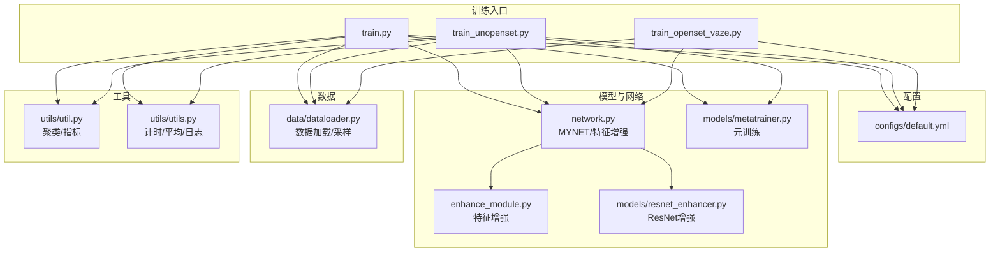
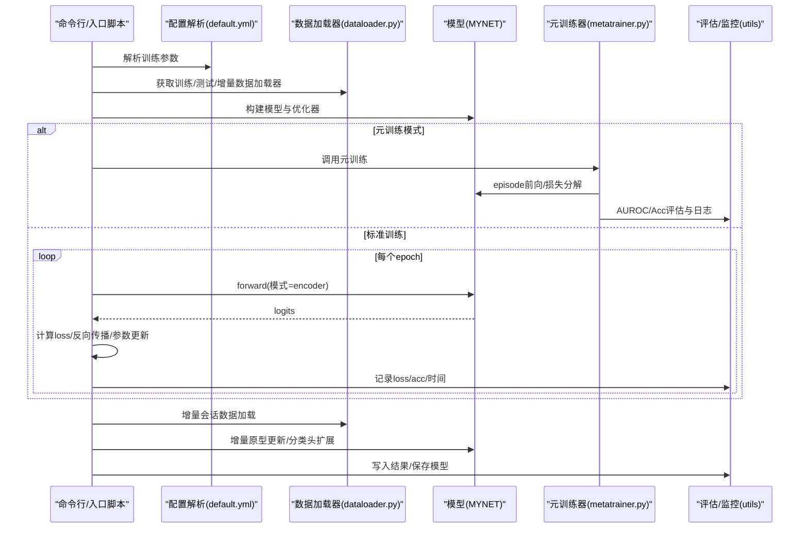
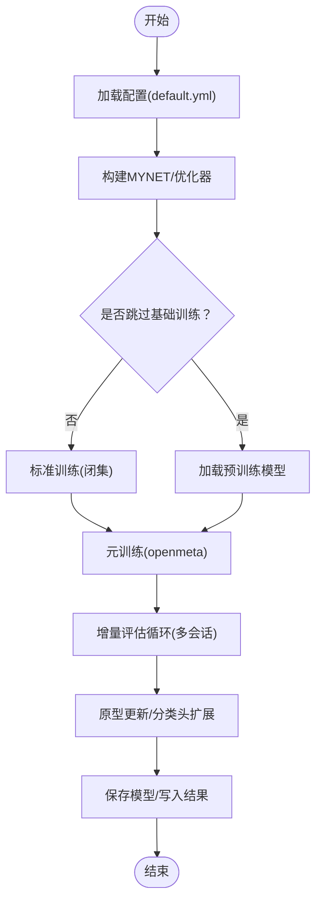
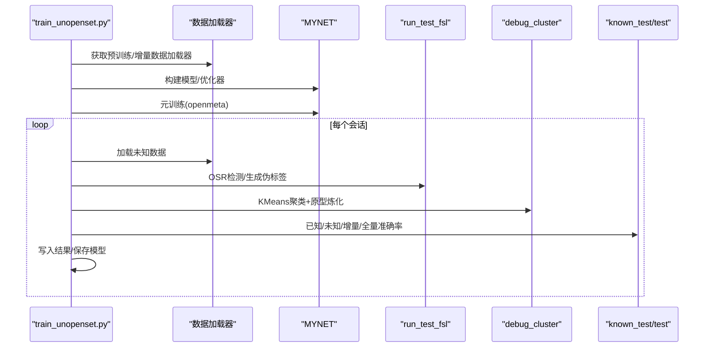
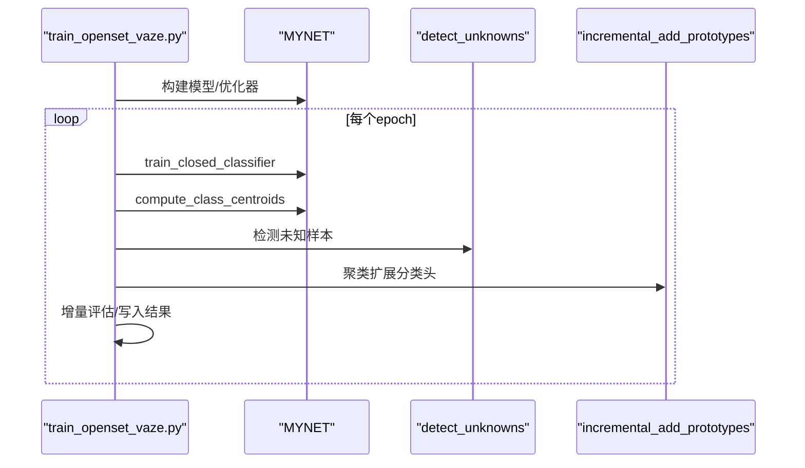
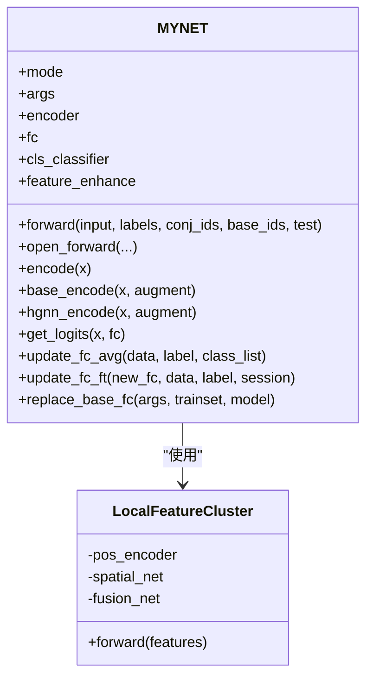
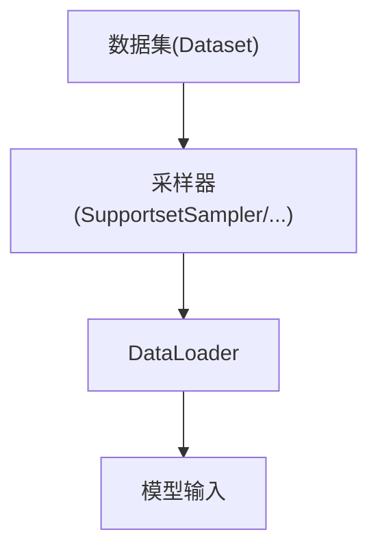
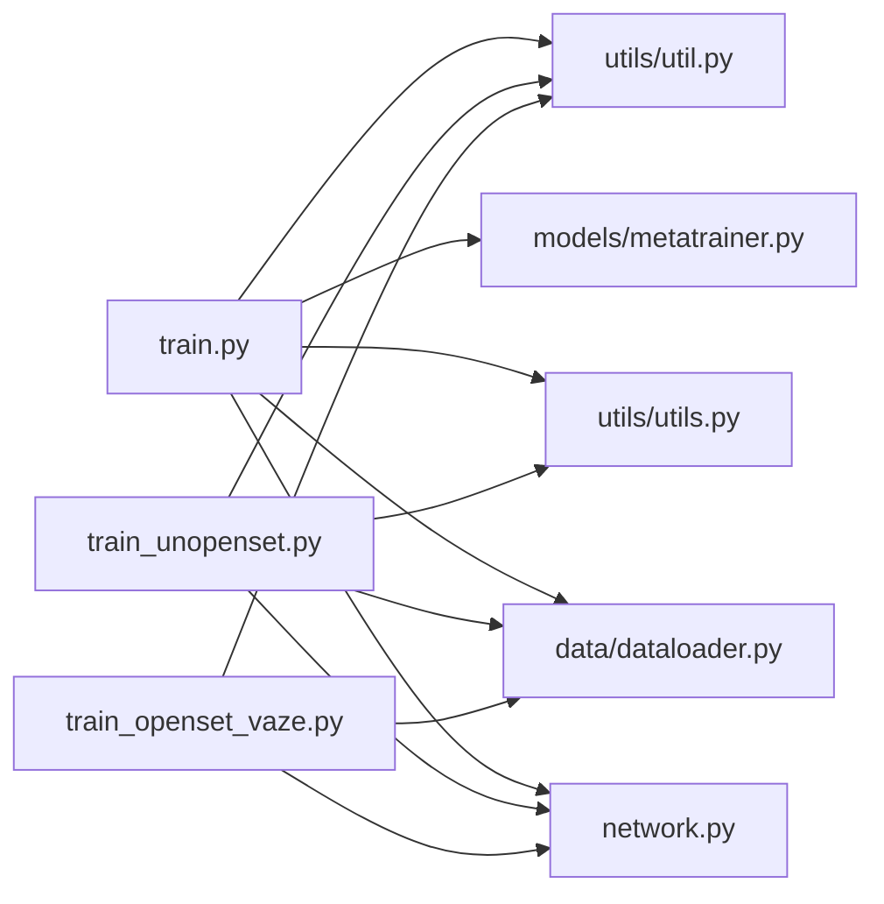

# 训练循环

<cite>
**本文引用的文件列表**
- [train.py](file://train.py)
- [train_openset_vaze.py](file://train_openset_vaze.py)
- [train_unopenset.py](file://train_unopenset.py)
- [configs/default.yml](file://configs/default.yml)
- [models/metatrainer.py](file://models/metatrainer.py)
- [network.py](file://network.py)
- [data/dataloader.py](file://data/dataloader.py)
- [utils/util.py](file://utils/util.py)
- [utils/utils.py](file://utils/utils.py)
- [enhance_module.py](file://enhance_module.py)
- [models/resnet_enhancer.py](file://models/resnet_enhancer.py)
</cite>

## 目录
1. [简介](#简介)
2. [项目结构](#项目结构)
3. [核心组件](#核心组件)
4. [架构总览](#架构总览)
5. [详细组件分析](#详细组件分析)
6. [依赖关系分析](#依赖关系分析)
7. [性能考量](#性能考量)
8. [故障排查指南](#故障排查指南)
9. [结论](#结论)
10. [附录](#附录)

## 简介
本文件面向训练循环系统，系统性梳理从数据加载、前向传播、反向传播、参数更新，到监控、持久化与恢复、不同训练模式差异、参数调优与性能监控、以及中断恢复与异常处理的完整流程。文档同时给出关键实现路径与可视化/评估工具，帮助读者快速定位与优化训练过程。

## 项目结构
- 训练入口与脚本
  - 闭集训练与增量评估：train.py
  - 开集训练与增量评估：train_unopenset.py
  - 开集Vaze风格训练：train_openset_vaze.py
- 配置与参数
  - 训练参数配置：configs/default.yml
- 模型与网络
  - 主干网络MYNET与特征增强：network.py
  - 元训练器：models/metatrainer.py
  - 特征增强模块：enhance_module.py、models/resnet_enhancer.py
- 数据与采样
  - 数据加载器与采样器：data/dataloader.py
- 工具与评估
  - 评估与指标：utils/util.py、utils/utils.py



图表来源
- [train.py:1-1296](file://train.py#L1-L1296)
- [train_unopenset.py:1-1158](file://train_unopenset.py#L1-L1158)
- [train_openset_vaze.py:1-481](file://train_openset_vaze.py#L1-L481)
- [configs/default.yml:1-88](file://configs/default.yml#L1-L88)
- [models/metatrainer.py:1-201](file://models/metatrainer.py#L1-L201)
- [network.py:1-724](file://network.py#L1-L724)
- [data/dataloader.py:1-351](file://data/dataloader.py#L1-L351)
- [utils/util.py:1-75](file://utils/util.py#L1-L75)
- [utils/utils.py:1-566](file://utils/utils.py#L1-L566)
- [enhance_module.py:1-160](file://enhance_module.py#L1-L160)
- [models/resnet_enhancer.py:1-172](file://models/resnet_enhancer.py#L1-L172)

章节来源
- [train.py:1-1296](file://train.py#L1-L1296)
- [train_unopenset.py:1-1158](file://train_unopenset.py#L1-L1158)
- [train_openset_vaze.py:1-481](file://train_openset_vaze.py#L1-L481)
- [configs/default.yml:1-88](file://configs/default.yml#L1-L88)
- [models/metatrainer.py:1-201](file://models/metatrainer.py#L1-L201)
- [network.py:1-724](file://network.py#L1-L724)
- [data/dataloader.py:1-351](file://data/dataloader.py#L1-L351)
- [utils/util.py:1-75](file://utils/util.py#L1-L75)
- [utils/utils.py:1-566](file://utils/utils.py#L1-L566)
- [enhance_module.py:1-160](file://enhance_module.py#L1-L160)
- [models/resnet_enhancer.py:1-172](file://models/resnet_enhancer.py#L1-L172)

## 核心组件
- 训练入口与主循环
  - 闭集/增量训练主循环：train.py
  - 开集/增量训练主循环：train_unopenset.py
  - 开集Vaze风格训练：train_openset_vaze.py
- 模型与网络
  - MYNET：特征提取器、分类头、任务前向（openmeta/encoder/incre）、原型更新、温度/余弦分类等
  - 元训练器metatrainer：基于episode的元训练，损失分解与AUROC评估
  - 特征增强模块：LocalFeatureCluster、EnhancedPositionEncoder、FeatureFusion等
- 数据加载与采样
  - 采样器：SupportsetSampler、TrueIncreTrainCategoriesSampler
  - 数据加载器：get_*_dataloader系列、get_dataloaders
- 评估与监控
  - 聚类准确率、F1、AUROC/Acc等指标
  - 计时器、平均值记录、日志输出

章节来源
- [train.py:799-1296](file://train.py#L799-L1296)
- [train_unopenset.py:491-1158](file://train_unopenset.py#L491-L1158)
- [train_openset_vaze.py:86-481](file://train_openset_vaze.py#L86-L481)
- [network.py:18-724](file://network.py#L18-L724)
- [models/metatrainer.py:17-201](file://models/metatrainer.py#L17-L201)
- [data/dataloader.py:13-351](file://data/dataloader.py#L13-L351)
- [utils/util.py:12-75](file://utils/util.py#L12-L75)
- [utils/utils.py:368-488](file://utils/utils.py#L368-L488)

## 架构总览
训练循环由“配置解析—数据加载—模型构建—训练/评估—监控/持久化”构成。不同入口脚本分别覆盖闭集、开集与增量场景，核心逻辑围绕MYNET的模式切换（encoder/openmeta/incre）与元训练器的episode训练展开。



图表来源
- [configs/default.yml:1-88](file://configs/default.yml#L1-L88)
- [data/dataloader.py:13-351](file://data/dataloader.py#L13-L351)
- [network.py:18-724](file://network.py#L18-L724)
- [models/metatrainer.py:17-201](file://models/metatrainer.py#L17-L201)
- [utils/utils.py:368-488](file://utils/utils.py#L368-L488)

## 详细组件分析

### 训练入口与主循环（train.py）
- 主循环职责
  - 基础会话训练（可跳过/加载预训练）
  - 元训练（openmeta）与增量评估
  - 会话间原型更新与分类头扩展
- 关键流程
  - 模式切换：model.mode = 'encoder'/'openmeta'/'incre'
  - 增量评估：known_test/test/run_test_fsl/debug_cluster
  - 结果写入：按opt版本目录输出test_result*.txt
- 监控与持久化
  - 计时器、平均值记录、AUROC/Acc日志
  - 模型保存：最佳/定期保存



图表来源
- [train.py:799-1296](file://train.py#L799-L1296)
- [configs/default.yml:1-88](file://configs/default.yml#L1-L88)
- [network.py:18-724](file://network.py#L18-L724)
- [utils/utils.py:368-488](file://utils/utils.py#L368-L488)

章节来源
- [train.py:799-1296](file://train.py#L799-L1296)

### 训练入口与主循环（train_unopenset.py）
- 主循环职责
  - 基础训练/加载预训练
  - 元训练（openmeta）
  - 开集检测与增量聚类（debug_cluster）
  - 已知/未知/增量/全量准确率与F1统计
- 关键流程
  - run_test_fsl：OSR检测与伪标签生成
  - debug_cluster：KMeans聚类+原型炼化（prototype compaction）
  - known_test/test：已知类准确率与F1
- 监控与持久化
  - 多轮测试均值/std/PD（性能下降）统计
  - 结果写入opt_version子目录



图表来源
- [train_unopenset.py:491-1158](file://train_unopenset.py#L491-L1158)
- [data/dataloader.py:13-351](file://data/dataloader.py#L13-L351)
- [network.py:18-724](file://network.py#L18-L724)

章节来源
- [train_unopenset.py:491-1158](file://train_unopenset.py#L491-L1158)

### 训练入口与主循环（train_openset_vaze.py）
- 主循环职责
  - 闭集训练（标准分类）
  - 开集检测（softmax阈值+特征与原型余弦相似度）
  - 增量聚类（KMeans）扩展分类头
  - 与闭集基线一致的增量评估与结果输出
- 关键流程
  - train_closed_classifier：标准分类训练
  - compute_class_centroids：计算类原型
  - detect_unknowns：未知样本检测
  - incremental_add_prototypes：聚类扩展分类头
  - run_incremental_eval_like_baseline：增量评估与结果文件



图表来源
- [train_openset_vaze.py:86-481](file://train_openset_vaze.py#L86-L481)
- [network.py:18-724](file://network.py#L18-L724)

章节来源
- [train_openset_vaze.py:86-481](file://train_openset_vaze.py#L86-L481)

### 模型与网络（MYNET）
- 模式与前向
  - encoder：仅编码，返回特征
  - openmeta：episode任务，支持/查询/开放集联合前向，计算余弦分数与损失
  - incre：增量模式，cosine相似度分类
- 原型与分类
  - get_logits：dot/cosine/温度缩放
  - update_fc_avg/update_fc_ft：原型均值初始化与微调
  - replace_base_fc：替换分类头权重为训练集均值原型
- 特征增强
  - hgnn_encode/base_encode：带/不带SpecAug的特征提取
  - feature_enhance：LocalFeatureCluster（空间位置编码+动态聚类+融合）



图表来源
- [network.py:18-724](file://network.py#L18-L724)
- [enhance_module.py:70-160](file://enhance_module.py#L70-L160)
- [models/resnet_enhancer.py:51-172](file://models/resnet_enhancer.py#L51-L172)

章节来源
- [network.py:18-724](file://network.py#L18-L724)
- [enhance_module.py:70-160](file://enhance_module.py#L70-L160)
- [models/resnet_enhancer.py:51-172](file://models/resnet_enhancer.py#L51-L172)

### 元训练器（metatrainer）
- 任务
  - episode训练：支持/查询/开放集联合任务
  - 损失分解：分类CE、开放集Hinge、伪类对比损失
  - 评估：AUROC/Acc，周期性保存
- 关键流程
  - train_episode：前向、损失分解、反向、日志
  - adjust_learning_rate：阶梯/余弦调度
  - save_model：周期性保存

```mermaid
sequenceDiagram
participant EP as "train_episode"
participant NET as "MYNET"
participant LOSS as "损失分解"
participant OPT as "优化器"
EP->>NET : open_forward(支持/查询/开放集)
NET-->>EP : scores, protos, probs, (loss_cls, loss_open_hinge, loss_funit)
EP->>LOSS : 组合总损失
EP->>OPT : zero_grad/backward/step
EP->>EP : 记录Acc/AUROC/loss
```

图表来源
- [models/metatrainer.py:17-201](file://models/metatrainer.py#L17-L201)

章节来源
- [models/metatrainer.py:17-201](file://models/metatrainer.py#L17-L201)

### 数据加载与采样（dataloader）
- 采样器
  - SupportsetSampler：支持/查询采样
  - TrueIncreTrainCategoriesSampler：增量类别采样
- 数据加载器
  - get_pretrain_dataloader/get_base_dataloader_stdu/get_new_dataloader
  - get_testloader/get_inc_testloader/get_know_dataloader/get_unknow_dataloader
  - CurriculumMetaDataset：课程化元数据集（Easy/Medium/Hard）



图表来源
- [data/dataloader.py:13-351](file://data/dataloader.py#L13-L351)

章节来源
- [data/dataloader.py:13-351](file://data/dataloader.py#L13-L351)

### 评估与监控（utils）
- 指标
  - cluster_acc：聚类准确率（匈牙利匹配）
  - calc：二分类F1（已知/未知）
  - count_acc/count_acc_topk/count_acc_taskIL：准确率
  - confmatrix：混淆矩阵可视化
- 计时与日志
  - Timer：秒/分/小时格式化计时
  - AverageMeter/LAverageMeter/DAverageMeter：多维度平均值
  - Logger：文件+控制台日志

章节来源
- [utils/util.py:12-75](file://utils/util.py#L12-L75)
- [utils/utils.py:368-488](file://utils/utils.py#L368-L488)

## 依赖关系分析
- 训练入口依赖
  - train.py/train_unopenset.py依赖：network.py、data/dataloader.py、models/metatrainer.py、utils/util.py、utils/utils.py
  - train_openset_vaze.py依赖：network.py、data/dataloader.py、utils/util.py
- 模块耦合
  - MYNET与特征增强模块解耦，通过forward/hgnn_encode接口交互
  - 元训练器与MYNET通过open_forward接口耦合
  - 数据加载器与采样器通过Dataset接口耦合



图表来源
- [train.py:1-1296](file://train.py#L1-L1296)
- [train_unopenset.py:1-1158](file://train_unopenset.py#L1-L1158)
- [train_openset_vaze.py:1-481](file://train_openset_vaze.py#L1-L481)
- [network.py:1-724](file://network.py#L1-L724)
- [data/dataloader.py:1-351](file://data/dataloader.py#L1-L351)
- [utils/util.py:1-75](file://utils/util.py#L1-L75)
- [utils/utils.py:1-566](file://utils/utils.py#L1-L566)

章节来源
- [train.py:1-1296](file://train.py#L1-L1296)
- [train_unopenset.py:1-1158](file://train_unopenset.py#L1-L1158)
- [train_openset_vaze.py:1-481](file://train_openset_vaze.py#L1-L481)
- [network.py:1-724](file://network.py#L1-L724)
- [data/dataloader.py:1-351](file://data/dataloader.py#L1-L351)
- [utils/util.py:1-75](file://utils/util.py#L1-L75)
- [utils/utils.py:1-566](file://utils/utils.py#L1-L566)

## 性能考量
- 训练效率
  - 使用torch.utils.data.DataLoader的pin_memory与num_workers提升IO吞吐
  - 采样器支持batch_sampler，减少数据重复加载
- 内存与显存
  - 采用特征平均池化与温度缩放降低内存占用
  - 增量会话中仅扩展分类头，避免重建全模型
- 训练稳定性
  - cosine/温度缩放、余弦相似度分类、Hinge损失抑制灾难性遗忘
  - Prototype compaction防止新类原型被压缩到已知原型附近
- 可视化与诊断
  - t-SNE/热力图/分布对比等特征可视化
  - AUROC/Acc曲线与混淆矩阵

[本节为通用指导，无需特定文件引用]

## 故障排查指南
- 随机性与可复现
  - set_seed/set_gpu：固定随机种子与GPU可见性
  - check_randomness：验证随机种子是否生效
- 模式切换导致的错误
  - MYNET.mode需与任务匹配（encoder/openmeta/incre）
  - get_uncertainty中临时切换mode并恢复
- 设备一致性
  - LocalFeatureCluster确保参数与输入在同一设备
- 模型保存与恢复
  - 保存state_dict/参数字典，加载时严格或宽松匹配
  - 增量会话保存最佳模型与结果文件
- 异常处理
  - DataLoader worker初始化：seed_worker保证可复现
  - 计时器Timer：measure输出格式化时间
  - 日志Logger：文件+控制台双通道

章节来源
- [train.py:114-147](file://train.py#L114-L147)
- [network.py:50-101](file://network.py#L50-L101)
- [utils/utils.py:160-179](file://utils/utils.py#L160-L179)
- [data/dataloader.py:5-12](file://data/dataloader.py#L5-L12)
- [utils/utils.py:368-380](file://utils/utils.py#L368-L380)
- [utils/utils.py:534-553](file://utils/utils.py#L534-L553)

## 结论
本训练循环系统通过清晰的入口脚本、可插拔的模型与增强模块、规范的数据加载与采样、完善的评估与监控，实现了从闭集到开集再到增量场景的统一训练框架。通过合理的模式切换、损失分解与原型更新策略，系统在增量学习与开集检测方面具备良好的鲁棒性与可扩展性。建议在实际部署中结合配置文件与日志体系，持续监控AUROC/Acc与F1，配合特征可视化与混淆矩阵进行诊断与调优。

[本节为总结性内容，无需特定文件引用]

## 附录
- 训练参数调优要点
  - 学习率与调度：Step/Milestone/余弦退火
  - 温度缩放与余弦分类：影响原型相似度分布
  - Hinge损失与margin：控制开放集负原型分离
  - Prototype compaction：防止新类原型与已知原型重叠
- 性能监控方法
  - AUROC/Acc曲线、混淆矩阵、t-SNE/热力图
  - 多轮测试均值/std/PD（性能下降）统计
- 中断恢复与异常处理
  - 模型保存与加载、worker初始化、计时与日志

[本节为通用指导，无需特定文件引用]