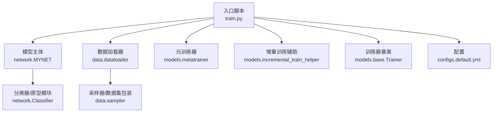
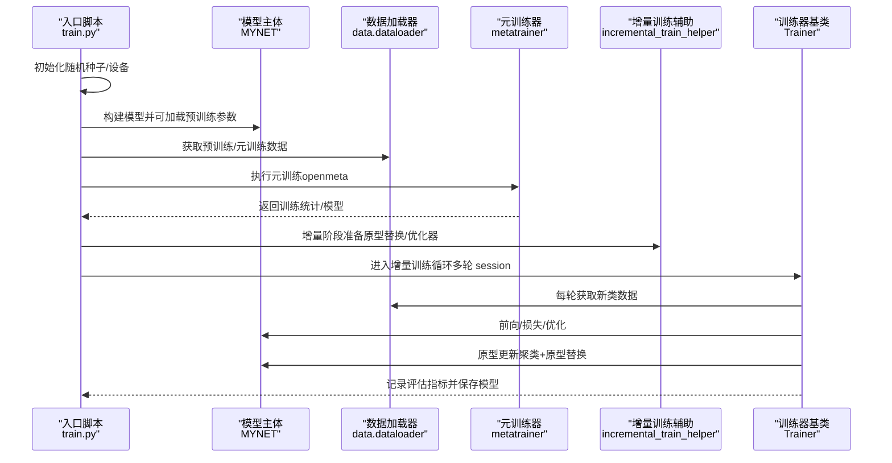
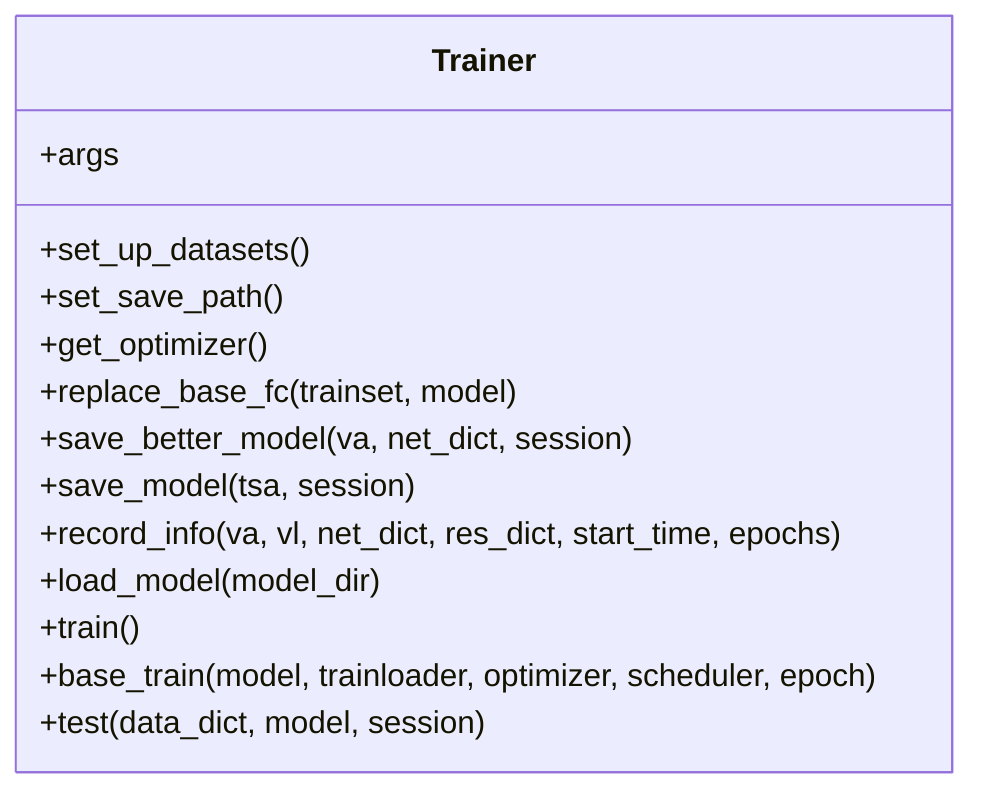
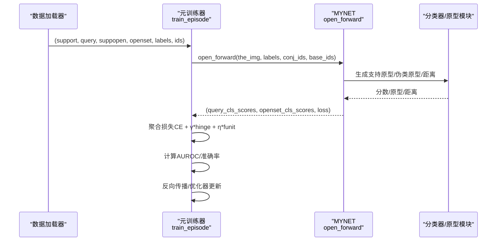
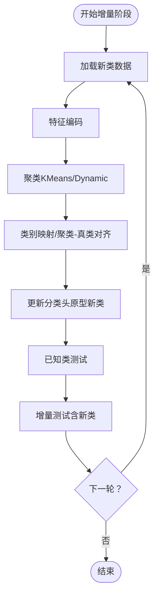
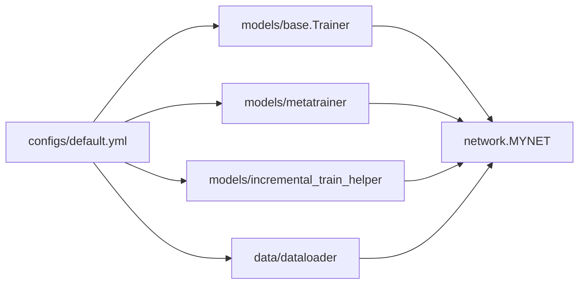

# 训练框架

<cite>
**本文引用的文件**
- [train.py](file://train.py)
- [models/base.py](file://models/base.py)
- [models/metatrainer.py](file://models/metatrainer.py)
- [models/metatrainer_oo.py](file://models/metatrainer_oo.py)
- [models/incremental_train_helper.py](file://models/incremental_train_helper.py)
- [network.py](file://network.py)
- [data/dataloader.py](file://data/dataloader.py)
- [configs/default.yml](file://configs/default.yml)
</cite>

## 目录
1. [简介](#简介)
2. [项目结构](#项目结构)
3. [核心组件](#核心组件)
4. [架构总览](#架构总览)
5. [详细组件分析](#详细组件分析)
6. [依赖分析](#依赖分析)
7. [性能考虑](#性能考虑)
8. [故障排查指南](#故障排查指南)
9. [结论](#结论)
10. [附录](#附录)

## 简介
本文件系统性梳理 VAZE 项目的训练框架，围绕以下目标展开：
- Trainers 基类的设计与职责边界
- 训练循环、模型保存与加载、增量学习支持
- 元训练器（MetaTrainer）工作原理：支持集/查询集处理、原型生成与更新策略
- 训练流程关键步骤：损失计算、优化器配置、学习率调度
- 训练配置示例与最佳实践
- 如何扩展训练框架以支持新的算法变体

## 项目结构
项目采用“功能域+层次”的组织方式：
- configs：训练配置（YAML）
- data：数据加载与采样器
- models：训练器基类、元训练器、增量训练辅助、网络主体等
- utils：通用工具
- scripts：实验分析脚本
- save/save_result：中间产物与结果存储
- train.py/test.py：入口脚本

图表来源
- [train.py:1-1296](file://train.py#L1-L1296)
- [network.py:1-724](file://network.py#L1-L724)
- [data/dataloader.py:1-351](file://data/dataloader.py#L1-L351)
- [models/metatrainer.py:1-201](file://models/metatrainer.py#L1-L201)
- [models/incremental_train_helper.py:1-156](file://models/incremental_train_helper.py#L1-L156)
- [models/base.py:1-254](file://models/base.py#L1-L254)
- [configs/default.yml:1-88](file://configs/default.yml#L1-L88)

章节来源
- [train.py:1-1296](file://train.py#L1-L1296)
- [configs/default.yml:1-88](file://configs/default.yml#L1-L88)

## 核心组件
- Trainer 基类：定义训练生命周期、数据集初始化、模型保存/加载、增量阶段的原型替换与评估记录
- MetaTrainer：负责元训练阶段的训练循环、损失聚合、AUROC 评估与模型保存
- MYNET：模型主体，封装编码器、分类器、原型计算、前向流程与增量更新
- 数据加载器与采样器：支持小样本任务的 support/query/open-set 采样与 curriculum 包装
- 增量训练辅助：提供增量阶段的优化器配置、原型适配与在线原型更新

章节来源
- [models/base.py:27-254](file://models/base.py#L27-L254)
- [models/metatrainer.py:17-201](file://models/metatrainer.py#L17-L201)
- [network.py:18-724](file://network.py#L18-L724)
- [data/dataloader.py:19-351](file://data/dataloader.py#L19-L351)
- [models/incremental_train_helper.py:11-156](file://models/incremental_train_helper.py#L11-L156)

## 架构总览
VAZE 的训练框架由“入口脚本 → 模型主体 → 数据加载 → 元训练器/增量训练辅助 → 训练器基类”构成的流水线。入口脚本负责：
- 初始化模型与随机种子
- 加载预训练参数（可选）
- 执行元训练（openmeta）
- 进入增量学习阶段：每轮 session 增加若干新类，执行聚类与原型更新，再进行增量测试

图表来源
- [train.py:800-981](file://train.py#L800-L981)
- [models/metatrainer.py:17-85](file://models/metatrainer.py#L17-L85)
- [models/incremental_train_helper.py:28-111](file://models/incremental_train_helper.py#L28-L111)
- [models/base.py:111-176](file://models/base.py#L111-L176)

## 详细组件分析

### Trainer 基类设计与训练循环
- 职责边界
  - 数据集初始化与保存路径管理
  - 标准训练阶段的优化器与学习率调度器构建
  - 增量阶段的原型替换（基于平均嵌入）
  - 模型保存/加载与最佳模型记录
  - 训练日志与结果汇总输出
- 训练循环要点
  - 标准训练：分类交叉熵损失，逐 batch 反向传播与优化
  - 增量阶段：支持已知类与新类的联合推理，原型替换后进行增量测试
- 模型保存/加载
  - 保存：按 session 记录最佳模型与优化器状态
  - 加载：从 checkpoint 文件恢复参数，更新模型字典

图表来源
- [models/base.py:27-254](file://models/base.py#L27-L254)

章节来源
- [models/base.py:27-254](file://models/base.py#L27-L254)

### 元训练器（MetaTrainer）工作原理
- 支持集/查询集处理
  - 输入为拼接后的图像块（支持集+查询集+开放集），标签分别为支持/查询/开放集标签
  - 通过模式切换进入 openmeta 前向，得到支持/查询/开放集特征
- 原型生成与更新策略
  - 支持原型：来自支持集的平均特征
  - 伪类原型：由分类器模块生成，用于开放集判别
  - 开放集损失：Hinge 损失约束伪类原型与支持原型之间的距离
  - 伪类一致性损失：二元交叉熵，鼓励开放集样本被判定为“未知”
- 训练流程
  - 每步计算分类 CE、开放集 hinge 与伪类一致性损失
  - 聚合损失并反向传播
  - 每轮评估 AUROC 与准确率，定期保存模型

图表来源
- [models/metatrainer.py:87-178](file://models/metatrainer.py#L87-L178)
- [network.py:102-151](file://network.py#L102-L151)

章节来源
- [models/metatrainer.py:17-201](file://models/metatrainer.py#L17-L201)
- [network.py:102-224](file://network.py#L102-L224)

### 训练流程关键步骤
- 损失计算
  - 分类损失：交叉熵（支持集+查询集）
  - 开放集损失：Hinge 损失（约束伪类原型与支持原型距离）
  - 伪类一致性损失：二元交叉熵（开放集样本应被判定为未知）
- 优化器配置
  - SGD，动量 0.9，Nesterov，权重衰减
  - 可选 Cosine 调度（ReduceLROnPlateau）或阶梯式调度
- 学习率调度
  - Step/Milestone 调度器，支持自定义步长与衰减率
  - 元训练阶段可使用 ReduceLROnPlateau 根据验证指标调整

章节来源
- [models/metatrainer.py:27-48](file://models/metatrainer.py#L27-L48)
- [models/metatrainer.py:195-201](file://models/metatrainer.py#L195-L201)
- [network.py:586-608](file://network.py#L586-L608)

### 增量学习与原型更新
- 增量阶段流程
  - 每轮新增若干新类（way 个），先进行已知类测试，再进行未知类聚类
  - 聚类后更新模型分类头权重（新类原型），随后进行增量测试
- 原型替换
  - 基于预训练/增量阶段数据计算平均嵌入，替换分类头权重
- 在线原型更新
  - 增量阶段可结合距离度量与负样本点策略，进一步微调原型

图表来源
- [train.py:851-890](file://train.py#L851-L890)
- [models/incremental_train_helper.py:28-111](file://models/incremental_train_helper.py#L28-L111)
- [models/base.py:120-151](file://models/base.py#L120-L151)

章节来源
- [train.py:851-890](file://train.py#L851-L890)
- [models/incremental_train_helper.py:28-111](file://models/incremental_train_helper.py#L28-L111)
- [models/base.py:120-151](file://models/base.py#L120-L151)

### 数据加载与采样
- CurriculumMetaDataset：将“已知/当前/未知”三段数据打包为一个 episode，支持 openmeta 模式
- SupportsetSampler/TrueIncreTrainCategoriesSampler：支持小样本采样（支持/查询/开放集）
- 多数据集适配：FMC、NSynth、LibriSpeech、S2S 等

章节来源
- [data/dataloader.py:263-351](file://data/dataloader.py#L263-L351)
- [data/dataloader.py:19-168](file://data/dataloader.py#L19-L168)

## 依赖分析
- 入口脚本依赖
  - 模型主体：MYNET（编码器、分类器、原型模块）
  - 元训练器：metatrainer（openmeta 训练循环）
  - 增量训练辅助：incremental_train_helper（优化器、原型适配）
  - 训练器基类：base.Trainer（保存/加载、原型替换）
  - 数据加载器：dataloader（采样器、数据集包装）
- 配置依赖
  - configs/default.yml：训练超参（way、shot、num_session、学习率、调度器、优化器等）

图表来源
- [configs/default.yml:1-88](file://configs/default.yml#L1-L88)
- [models/base.py:27-254](file://models/base.py#L27-L254)
- [models/metatrainer.py:17-201](file://models/metatrainer.py#L17-L201)
- [models/incremental_train_helper.py:11-156](file://models/incremental_train_helper.py#L11-L156)
- [data/dataloader.py:19-351](file://data/dataloader.py#L19-L351)
- [network.py:18-724](file://network.py#L18-L724)

章节来源
- [configs/default.yml:1-88](file://configs/default.yml#L1-L88)
- [models/base.py:27-254](file://models/base.py#L27-L254)
- [models/metatrainer.py:17-201](file://models/metatrainer.py#L17-L201)
- [models/incremental_train_helper.py:11-156](file://models/incremental_train_helper.py#L11-L156)
- [data/dataloader.py:19-351](file://data/dataloader.py#L19-L351)
- [network.py:18-724](file://network.py#L18-L724)

## 性能考虑
- 训练稳定性
  - 使用固定随机种子与确定性后端，减少实验波动
  - 采用 Cosine 调度或阶梯式调度，避免过早收敛
- 计算效率
  - 采用 ReduceLROnPlateau 在元训练阶段自适应调整学习率
  - 优化器参数按模块分组（encoder、attention、criterion），提升收敛效率
- 内存与显存
  - 使用固定 batch size 与 pinned memory，加速数据传输
  - 在线原型更新与聚类尽量在 CPU 上完成，减少 GPU 占用

## 故障排查指南
- 随机性与可复现
  - 确认 set_seed 与 check_randomness 的调用顺序
  - 检查环境变量（PYTHONHASHSEED、CUBLAS_WORKSPACE_CONFIG）
- 模型保存/加载
  - 确认保存路径与文件名格式（按 epoch 或最佳模型命名）
  - 加载时注意 keys 名称（params/cls_params/state_dict）
- 数据加载
  - 确认采样器与 batch_sampler 的参数与数据集大小匹配
  - CurriculumMetaDataset 的类别映射与索引切片正确性
- 元训练损失
  - 检查标签拼接与维度一致性（query_label 与 openset_label）
  - Hinge 损失的 margin 设置与距离计算

章节来源
- [train.py:114-134](file://train.py#L114-L134)
- [models/metatrainer.py:180-191](file://models/metatrainer.py#L180-L191)
- [data/dataloader.py:263-351](file://data/dataloader.py#L263-L351)

## 结论
VAZE 的训练框架通过 Trainer 基类统一训练生命周期，结合 MetaTrainer 的元训练与增量训练辅助，实现了从预训练到增量学习的完整闭环。其关键优势在于：
- 明确的职责划分与可扩展的训练器基类
- 元训练阶段的开放集判别与原型约束
- 增量阶段的聚类与原型更新策略
- 清晰的配置与数据加载体系

## 附录

### 训练配置示例与最佳实践
- 基本配置
  - way、shot、num_session、num_base、num_novel、num_all
  - 学习率与调度器：Step/Milestone，支持自定义步长与衰减率
  - 优化器：SGD，动量 0.9，Nesterov，权重衰减
- 最佳实践
  - 元训练阶段启用 ReduceLROnPlateau，以 AUROC/Acc 为监控指标
  - 增量阶段每轮先进行已知类测试，再进行未知类聚类与原型更新
  - 使用固定随机种子与确定性后端，确保结果可复现
  - 在线原型更新时，结合距离度量与负样本点策略，提升鲁棒性

章节来源
- [configs/default.yml:1-88](file://configs/default.yml#L1-L88)
- [models/metatrainer.py:27-48](file://models/metatrainer.py#L27-L48)
- [models/incremental_train_helper.py:113-156](file://models/incremental_train_helper.py#L113-L156)

### 扩展训练框架以支持新算法变体
- 新增元训练损失
  - 在 task_proto 中扩展损失项（如对比学习、互信息等），并在元训练器中聚合
- 新增分类器/原型模块
  - 在 Classifier 中实现新的原型生成策略（如动态权重、多头注意力）
- 新增数据采样策略
  - 在 CurriculumMetaDataset 中扩展 episode 组合逻辑（如多难度级别）
- 新增增量策略
  - 在 incremental_train_helper 中新增优化器配置与原型适配逻辑

章节来源
- [network.py:153-224](file://network.py#L153-L224)
- [models/metatrainer.py:87-178](file://models/metatrainer.py#L87-L178)
- [data/dataloader.py:263-351](file://data/dataloader.py#L263-L351)