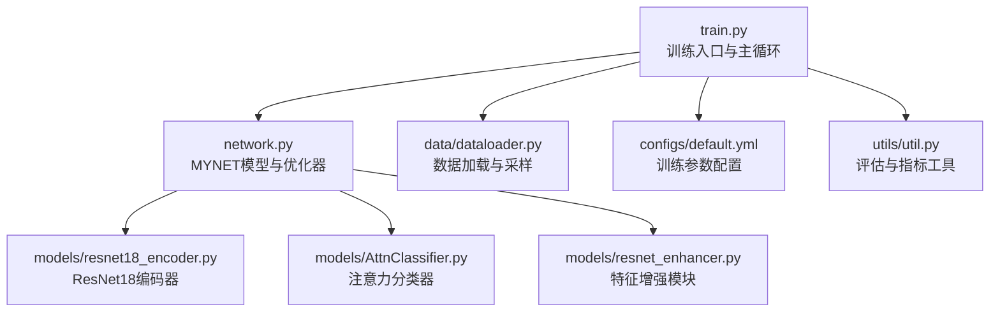
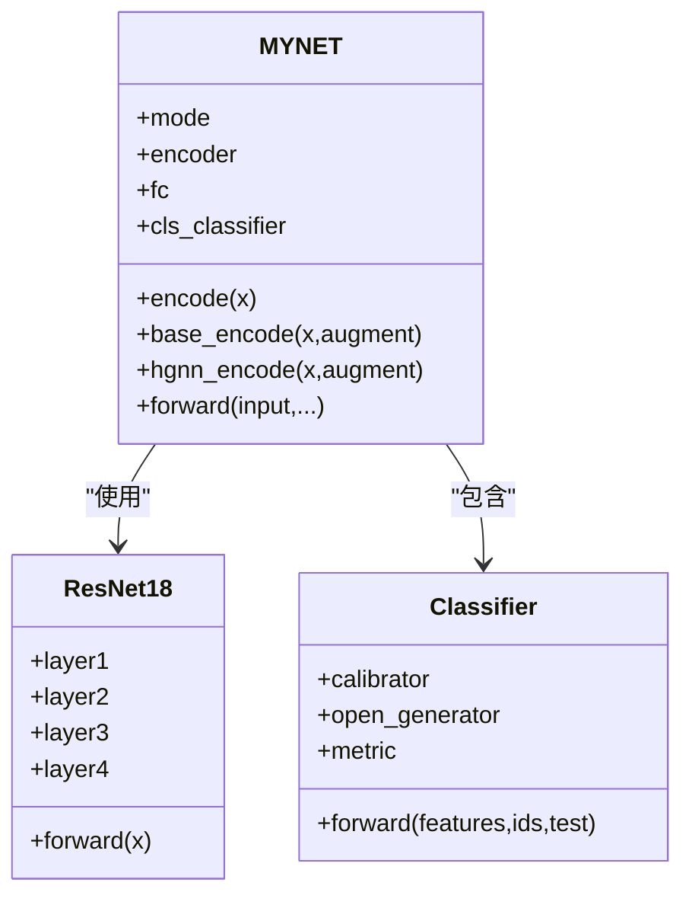
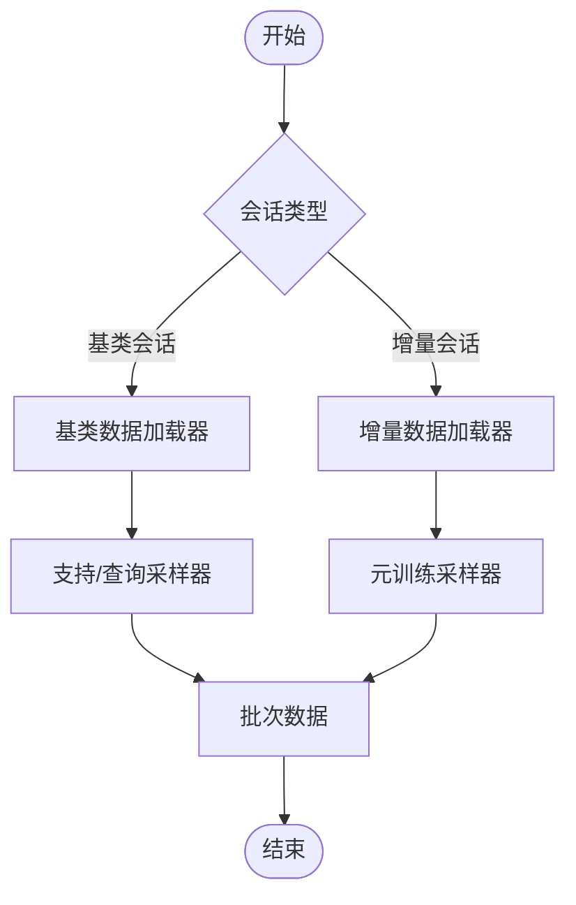
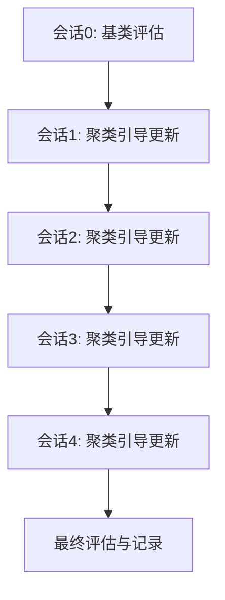
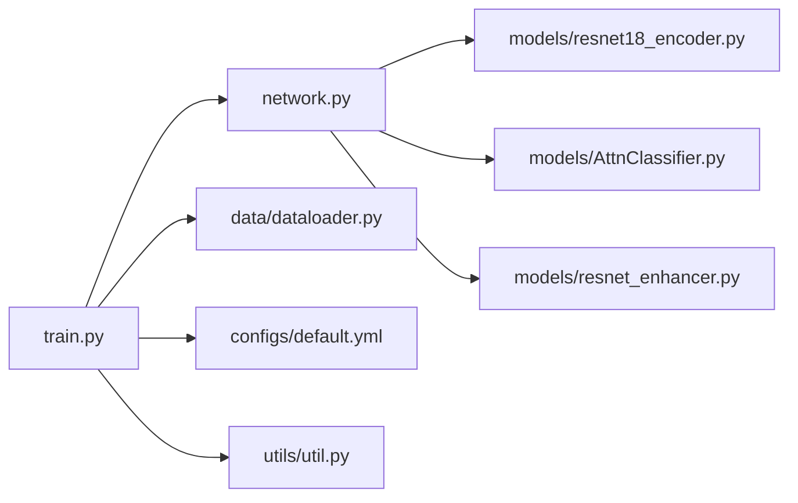

# 基础训练流程

<cite>
**本文引用的文件列表**
- [train.py](file://train.py)
- [network.py](file://network.py)
- [models/resnet18_encoder.py](file://models/resnet18_encoder.py)
- [models/resnet_enhancer.py](file://models/resnet_enhancer.py)
- [models/AttnClassifier.py](file://models/AttnClassifier.py)
- [data/dataloader.py](file://data/dataloader.py)
- [configs/default.yml](file://configs/default.yml)
- [utils/util.py](file://utils/util.py)
</cite>

## 目录
1. [简介](#简介)
2. [项目结构](#项目结构)
3. [核心组件](#核心组件)
4. [架构总览](#架构总览)
5. [详细组件分析](#详细组件分析)
6. [依赖关系分析](#依赖关系分析)
7. [性能考量](#性能考量)
8. [故障排查指南](#故障排查指南)
9. [结论](#结论)
10. [附录](#附录)

## 简介
本文件面向VAZE项目的基础训练流程，系统性阐述标准监督训练过程，包括数据加载、前向传播、损失计算与反向传播的实现细节，并聚焦MYNET模型的初始化、分类器与优化器配置，以及训练参数的设置与调整方法。文档同时提供完整的训练流程图与关键实现路径，帮助读者快速理解并复现基础训练。

## 项目结构
VAZE项目采用模块化组织，训练主流程位于train.py，模型定义位于network.py及models目录，数据加载与采样在data/dataloader.py，训练参数由configs/default.yml提供默认配置，工具函数位于utils目录。



图表来源
- [train.py:1-1296](file://train.py#L1-L1296)
- [network.py:1-724](file://network.py#L1-L724)
- [data/dataloader.py:1-351](file://data/dataloader.py#L1-L351)
- [configs/default.yml:1-88](file://configs/default.yml#L1-L88)
- [models/resnet18_encoder.py:1-471](file://models/resnet18_encoder.py#L1-L471)
- [models/AttnClassifier.py:1-369](file://models/AttnClassifier.py#L1-L369)
- [models/resnet_enhancer.py:1-172](file://models/resnet_enhancer.py#L1-L172)
- [utils/util.py:1-75](file://utils/util.py#L1-L75)

章节来源
- [train.py:1-1296](file://train.py#L1-L1296)
- [data/dataloader.py:1-351](file://data/dataloader.py#L1-L351)
- [configs/default.yml:1-88](file://configs/default.yml#L1-L88)

## 核心组件
- MYNET模型：封装ResNet18编码器、分类器、注意力模块与音频特征提取链路，支持多种训练模式（如encoder、openmeta）。
- 数据加载器：提供基类会话与增量会话的数据加载，支持元训练采样器与测试采样器。
- 优化器与调度器：基于SGD配置，支持Step/Milestone学习率调度。
- 训练循环：标准监督训练、增量会话训练与聚类引导的原型更新。

章节来源
- [network.py:18-504](file://network.py#L18-L504)
- [data/dataloader.py:13-254](file://data/dataloader.py#L13-L254)
- [train.py:931-981](file://train.py#L931-L981)

## 架构总览
下图展示了基础训练的端到端流程：数据加载、模型前向、损失计算、反向传播与优化器更新。

```mermaid
sequenceDiagram
participant Loader as "数据加载器"
participant Model as "MYNET模型"
participant Loss as "交叉熵损失"
participant Opt as "优化器/调度器"
Loader->>Model : "输入音频批次"
Model->>Model : "音频特征提取与编码"
Model-->>Model : "前向传播得到logits"
Model->>Loss : "计算交叉熵损失"
Loss-->>Opt : "反向传播梯度"
Opt->>Model : "参数更新"
Opt-->>Opt : "学习率调度"
```

图表来源
- [train.py:948-981](file://train.py#L948-L981)
- [network.py:471-503](file://network.py#L471-L503)
- [data/dataloader.py:128-132](file://data/dataloader.py#L128-L132)

## 详细组件分析

### MYNET模型与ResNet18编码器
- ResNet18编码器：提供512维特征输出，支持预训练权重加载与自定义初始化。
- 模型前向：支持多种模式，如encoder模式直接返回编码特征，openmeta模式执行元训练前向。
- 分类器：使用线性分类器将特征映射到类别空间，支持温度缩放与余弦相似度分类。
- 优化器：SGD优化器，支持动量与权重衰减，学习率可按Step/Milestone策略调度。



图表来源
- [network.py:18-504](file://network.py#L18-L504)
- [models/resnet18_encoder.py:240-334](file://models/resnet18_encoder.py#L240-L334)
- [models/AttnClassifier.py:39-101](file://models/AttnClassifier.py#L39-L101)

章节来源
- [network.py:18-504](file://network.py#L18-L504)
- [models/resnet18_encoder.py:349-358](file://models/resnet18_encoder.py#L349-L358)

### 数据加载与采样
- 基类会话与增量会话：分别提供不同的采样策略与数据集划分。
- 元训练采样器：支持支持集/查询集/开放集三段式采样，满足元训练需求。
- 测试加载器：按会话动态扩展测试类别范围。



图表来源
- [data/dataloader.py:134-230](file://data/dataloader.py#L134-L230)
- [data/dataloader.py:263-351](file://data/dataloader.py#L263-L351)

章节来源
- [data/dataloader.py:134-230](file://data/dataloader.py#L134-L230)
- [data/dataloader.py:263-351](file://data/dataloader.py#L263-L351)

### 训练参数与优化器配置
- 学习率与调度：默认学习率为0.005，支持Step与Milestone两种调度策略。
- 批次大小：默认128，可按显存与数据规模调整。
- 训练轮数：标准监督训练30轮，增量会话每会话5轮。
- 优化器：SGD，动量0.9，Nesterov加速，权重衰减0.0005。

章节来源
- [configs/default.yml:22-41](file://configs/default.yml#L22-L41)
- [network.py:598-608](file://network.py#L598-L608)
- [train.py:940-946](file://train.py#L940-L946)

### 标准监督训练流程
- 初始化：构建MYNET模型，设置随机种子，加载数据。
- 前向传播：音频经特征提取与ResNet编码，得到512维特征，再经线性分类器得到logits。
- 损失计算：使用交叉熵损失，仅对基类类别进行分类。
- 反向传播：清零梯度，反向传播，优化器更新参数。
- 调度：按步长或里程碑调整学习率。

```mermaid
sequenceDiagram
participant Train as "训练循环"
participant Loader as "数据加载器"
participant Model as "MYNET"
participant Loss as "交叉熵"
participant Opt as "优化器"
loop 每个epoch
Loader->>Model : "批次数据"
Model->>Model : "encode() -> 特征"
Model-->>Model : "fc -> logits"
Model->>Loss : "cross_entropy(logits, label)"
Loss-->>Opt : "backward()"
Opt->>Model : "step() 更新参数"
Opt-->>Opt : "step()/milestone() 调整学习率"
end
```

图表来源
- [train.py:948-981](file://train.py#L948-L981)
- [network.py:471-503](file://network.py#L471-L503)

章节来源
- [train.py:948-981](file://train.py#L948-L981)
- [network.py:586-608](file://network.py#L586-L608)

### 增量会话与聚类引导的原型更新
- 会话推进：每轮会话新增若干类别，模型逐步扩展分类能力。
- 聚类引导：对未知样本进行聚类，计算聚类准确性并更新分类头权重。
- 测试评估：在已知/未知/增量三类指标上进行评估。



图表来源
- [train.py:831-930](file://train.py#L831-L930)
- [train.py:851-879](file://train.py#L851-L879)

章节来源
- [train.py:831-930](file://train.py#L831-L930)
- [train.py:851-879](file://train.py#L851-L879)

## 依赖关系分析
- train.py依赖network.py中的MYNET与优化器函数，依赖data/dataloader.py提供的数据加载器，依赖configs/default.yml中的训练配置。
- network.py依赖models/resnet18_encoder.py与models/AttnClassifier.py，内部还包含特征增强模块。
- utils/util.py提供聚类准确性与F1评分等评估工具。



图表来源
- [train.py:1-1296](file://train.py#L1-L1296)
- [network.py:1-724](file://network.py#L1-L724)
- [data/dataloader.py:1-351](file://data/dataloader.py#L1-L351)
- [configs/default.yml:1-88](file://configs/default.yml#L1-L88)
- [models/resnet18_encoder.py:1-471](file://models/resnet18_encoder.py#L1-L471)
- [models/AttnClassifier.py:1-369](file://models/AttnClassifier.py#L1-L369)
- [models/resnet_enhancer.py:1-172](file://models/resnet_enhancer.py#L1-L172)
- [utils/util.py:1-75](file://utils/util.py#L1-L75)

章节来源
- [train.py:1-1296](file://train.py#L1-L1296)
- [network.py:1-724](file://network.py#L1-L724)

## 性能考量
- 批次大小与显存：默认128，可根据GPU显存调整，过大可能导致内存溢出，过小影响吞吐。
- 学习率调度：Step与Milestone策略在不同数据集上表现不同，建议结合验证集观察收敛曲线。
- 数据增强：音频特征提取链路包含SpecAugment，可在训练时启用以提升鲁棒性。
- 多头注意力与特征融合：注意模块的计算开销，必要时可降低头数或裁剪特征维度。

## 故障排查指南
- 训练不收敛或Acc过低
  - 检查学习率是否过高或过低，确认调度策略配置。
  - 确认数据加载器的标签范围与类别数一致。
- 显存不足
  - 降低批次大小或关闭不必要的数据增强。
- 分类头不更新
  - 确认替换基类分类头逻辑已执行，检查类别索引范围。
- 聚类效果差
  - 调整聚类比例k_ratio，或尝试不同的聚类算法与距离度量。

章节来源
- [utils/util.py:12-57](file://utils/util.py#L12-L57)
- [train.py:931-946](file://train.py#L931-L946)

## 结论
VAZE项目的基础训练流程围绕MYNET模型展开，通过ResNet18编码器与线性分类器实现标准监督训练，并结合聚类引导在增量会话中持续扩展分类能力。训练参数与优化器配置清晰明确，数据加载与采样策略覆盖基类与增量场景。遵循本文档的流程与参数建议，可稳定复现基础训练并为进一步的元训练与开放集识别奠定基础。

## 附录
- 关键实现路径参考
  - 标准训练循环：[train.py:948-981](file://train.py#L948-L981)
  - 模型前向与编码：[network.py:471-503](file://network.py#L471-L503)
  - ResNet18编码器：[models/resnet18_encoder.py:349-358](file://models/resnet18_encoder.py#L349-L358)
  - 分类器与注意力模块：[models/AttnClassifier.py:39-101](file://models/AttnClassifier.py#L39-L101)
  - 数据加载与采样：[data/dataloader.py:134-230](file://data/dataloader.py#L134-L230)
  - 训练参数配置：[configs/default.yml:22-41](file://configs/default.yml#L22-L41)
  - 评估工具：[utils/util.py:12-57](file://utils/util.py#L12-L57)