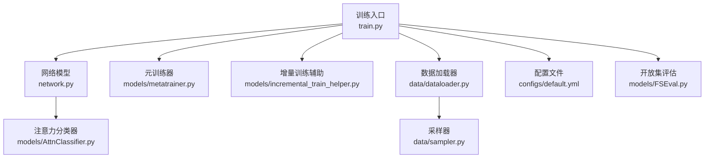
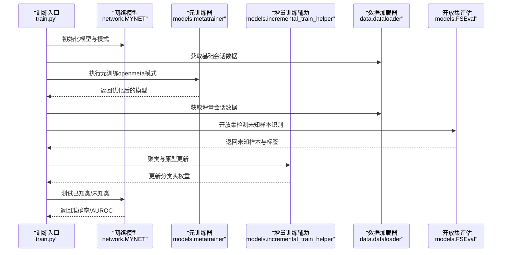
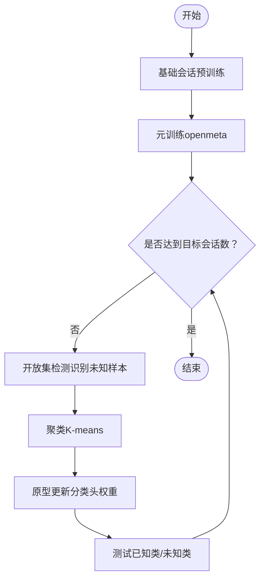
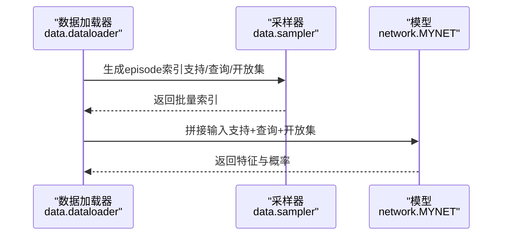
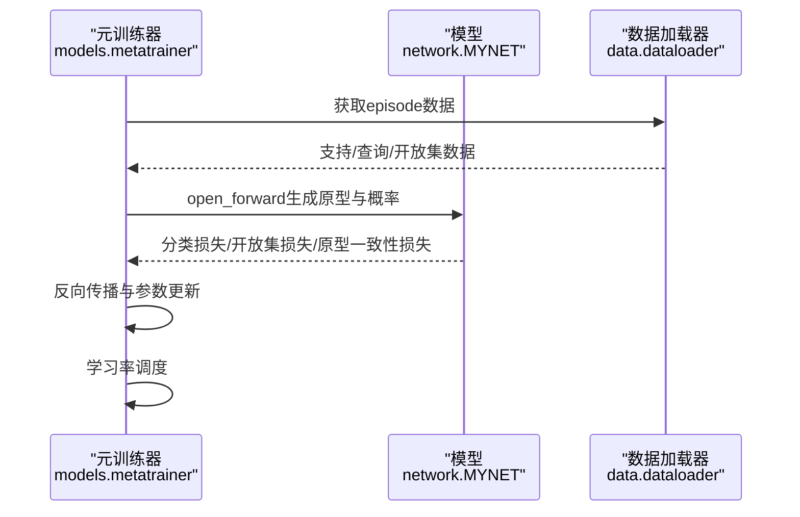
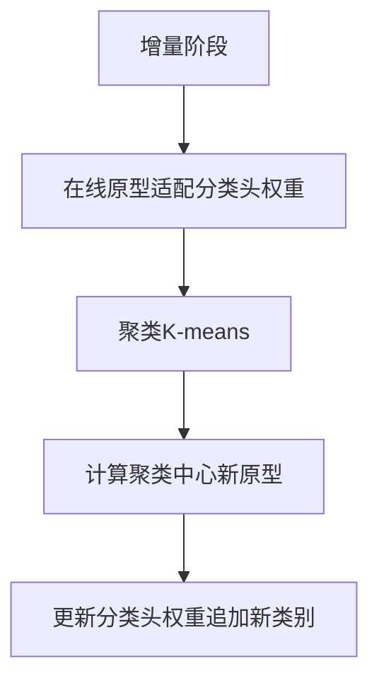
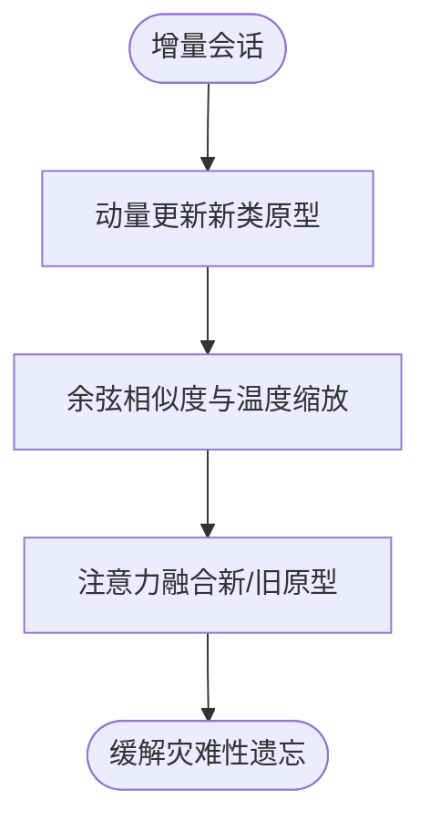
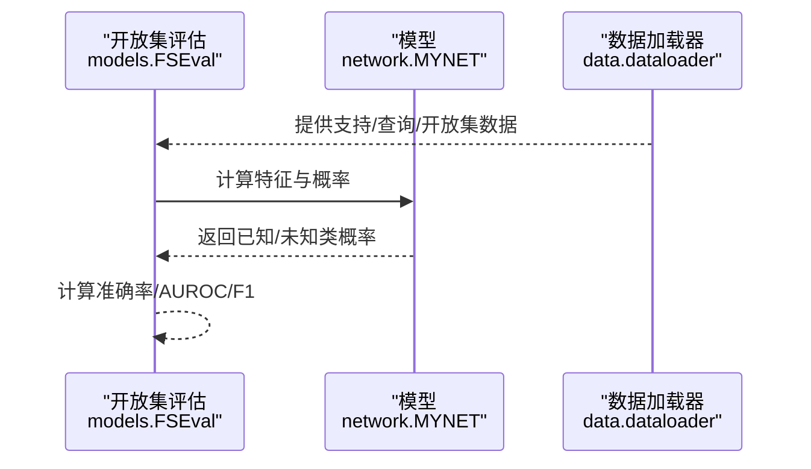
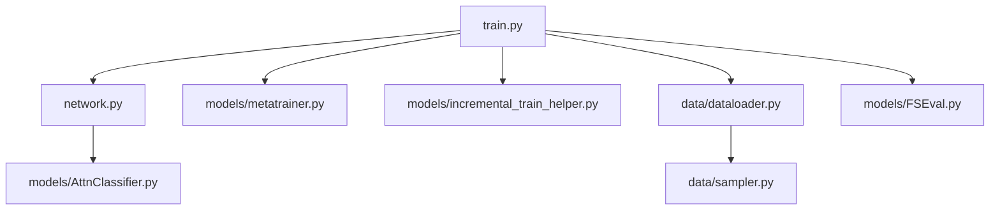

# 增量学习训练

<cite>
**本文引用的文件**
- [train.py](file://train.py)
- [network.py](file://network.py)
- [metatrainer.py](file://models/metatrainer.py)
- [FSEval.py](file://models/FSEval.py)
- [incremental_train_helper.py](file://models/incremental_train_helper.py)
- [default.yml](file://configs/default.yml)
- [dataloader.py](file://data/dataloader.py)
- [sampler.py](file://data/sampler.py)
- [AttnClassifier.py](file://models/AttnClassifier.py)
</cite>

## 目录
1. [简介](#简介)
2. [项目结构](#项目结构)
3. [核心组件](#核心组件)
4. [架构总览](#架构总览)
5. [详细组件分析](#详细组件分析)
6. [依赖关系分析](#依赖关系分析)
7. [性能考量](#性能考量)
8. [故障排查指南](#故障排查指南)
9. [结论](#结论)
10. [附录](#附录)

## 简介
本文件系统化梳理 VAZE 项目的增量学习训练实现，围绕“会话化增量学习”的完整流程展开，重点覆盖以下方面：
- 新类别的动态添加与原型更新策略
- 灾难性遗忘的缓解方法
- 增量训练的数据流（支持集与查询集构建、类别扩展时机与策略）
- 元训练器的使用（内/外循环设置、学习率调整与模型参数更新机制）
- 增量学习配置参数说明与最佳实践建议（会话间隔、类别增长模式、性能监控）

VAZE 在本仓库中采用“会话驱动”的增量学习范式：先进行基础会话（已知类别）的预训练与元训练，随后在每个增量会话中通过开放集检测识别未知类别样本，利用聚类与原型更新策略扩展分类器，同时在测试阶段评估已知类与未知类的性能。

## 项目结构
仓库采用按功能分层的组织方式：
- configs：训练配置（默认配置文件）
- data：数据加载与采样器
- models：模型定义与增量训练辅助模块
- utils：通用工具函数
- save/save_result：模型与实验结果存储
- scripts：可视化与分析脚本
- 根目录脚本：训练入口与评估流程

图表来源
- [train.py:800-930](file://train.py#L800-L930)
- [network.py:18-50](file://network.py#L18-L50)
- [metatrainer.py:17-85](file://models/metatrainer.py#L17-L85)
- [incremental_train_helper.py:11-25](file://models/incremental_train_helper.py#L11-L25)
- [dataloader.py:19-81](file://data/dataloader.py#L19-L81)
- [sampler.py:38-93](file://data/sampler.py#L38-L93)
- [default.yml:1-88](file://configs/default.yml#L1-L88)
- [FSEval.py:17-42](file://models/FSEval.py#L17-L42)
- [AttnClassifier.py:39-101](file://models/AttnClassifier.py#L39-L101)

章节来源
- [train.py:800-930](file://train.py#L800-L930)
- [network.py:18-50](file://network.py#L18-L50)
- [metatrainer.py:17-85](file://models/metatrainer.py#L17-L85)
- [incremental_train_helper.py:11-25](file://models/incremental_train_helper.py#L11-L25)
- [dataloader.py:19-81](file://data/dataloader.py#L19-L81)
- [sampler.py:38-93](file://data/sampler.py#L38-L93)
- [default.yml:1-88](file://configs/default.yml#L1-L88)
- [FSEval.py:17-42](file://models/FSEval.py#L17-L42)
- [AttnClassifier.py:39-101](file://models/AttnClassifier.py#L39-L101)

## 核心组件
- 训练入口与会话调度：负责基础会话预训练、元训练、增量会话的循环与评估。
- 网络模型（MYNET）：包含特征编码器、分类头、注意力模块与任务前向逻辑。
- 元训练器（meta_train）：在开放集场景下进行元训练，优化原型与分类器。
- 增量训练辅助（incremental_train_helper）：提供增量阶段的优化器与原型适配流程。
- 数据加载与采样（dataloader/sampler）：支持基础与增量会话的 episode 构建与类别采样。
- 开放集评估（FSEval）：在开放集测试中计算 AUROC 与准确率等指标。
- 注意力分类器（AttnClassifier）：支持正原型校准与负原型生成，用于开放集任务。

章节来源
- [train.py:800-930](file://train.py#L800-L930)
- [network.py:18-50](file://network.py#L18-L50)
- [metatrainer.py:17-85](file://models/metatrainer.py#L17-L85)
- [incremental_train_helper.py:11-25](file://models/incremental_train_helper.py#L11-L25)
- [dataloader.py:19-81](file://data/dataloader.py#L19-L81)
- [sampler.py:38-93](file://data/sampler.py#L38-L93)
- [FSEval.py:17-42](file://models/FSEval.py#L17-L42)
- [AttnClassifier.py:39-101](file://models/AttnClassifier.py#L39-L101)

## 架构总览
VAZE 的增量学习训练采用“基础会话 + 元训练 + 增量会话”三段式架构：
- 基础会话：标准分类预训练，冻结特征提取器或微调部分层，得到稳定的特征表示。
- 元训练：在开放集设置下，通过元训练器优化原型与分类器，提升开放集判别能力。
- 增量会话：每轮会话中，先进行开放集检测，识别未知类别样本，再进行聚类与原型更新，最后在测试集上评估已知类与未知类性能。

图表来源
- [train.py:800-930](file://train.py#L800-L930)
- [metatrainer.py:17-85](file://models/metatrainer.py#L17-L85)
- [incremental_train_helper.py:113-156](file://models/incremental_train_helper.py#L113-L156)
- [dataloader.py:48-81](file://data/dataloader.py#L48-L81)
- [FSEval.py:17-42](file://models/FSEval.py#L17-L42)

章节来源
- [train.py:800-930](file://train.py#L800-L930)
- [metatrainer.py:17-85](file://models/metatrainer.py#L17-L85)
- [incremental_train_helper.py:113-156](file://models/incremental_train_helper.py#L113-L156)
- [dataloader.py:48-81](file://data/dataloader.py#L48-L81)
- [FSEval.py:17-42](file://models/FSEval.py#L17-L42)

## 详细组件分析

### 1) 会话化增量学习流程
- 基础会话（Session 0）：执行标准分类预训练，得到稳定特征表示；随后进行元训练，使模型具备开放集判别能力。
- 增量会话（Session ≥ 1）：每轮会话中，先通过开放集检测识别未知类别样本，再进行聚类与原型更新，最后在测试集上评估已知类与未知类性能。
- 会话间类别增长：每轮会话新增 args.way 个新类别，累计类别数为 args.num_base + session × args.way。

图表来源
- [train.py:831-890](file://train.py#L831-L890)
- [train.py:851-879](file://train.py#L851-L879)

章节来源
- [train.py:831-890](file://train.py#L831-L890)
- [train.py:851-879](file://train.py#L851-L879)

### 2) 数据流与支持集/查询集构建
- 数据加载：根据会话号选择基础或增量数据集，构造 episode（支持集 + 查询集 + 开放集）。
- 采样策略：支持随机与顺序采样，确保每轮 episode 包含指定数量的支持样本、查询样本与开放集样本。
- 标签处理：支持集与查询集标签保持原类索引，开放集样本标签统一为 n_ways，便于开放集判别。

图表来源
- [dataloader.py:48-81](file://data/dataloader.py#L48-L81)
- [sampler.py:38-93](file://data/sampler.py#L38-L93)
- [network.py:102-151](file://network.py#L102-L151)

章节来源
- [dataloader.py:48-81](file://data/dataloader.py#L48-L81)
- [sampler.py:38-93](file://data/sampler.py#L38-L93)
- [network.py:102-151](file://network.py#L102-L151)

### 3) 元训练器与内外循环
- 外循环：在开放集数据上进行 episode 训练，计算分类损失与开放集 hinge 损失，以及原型一致性损失。
- 内循环：通过注意力模块与分类器生成正原型与负原型，结合温度缩放与余弦相似度进行分类。
- 学习率策略：支持余弦退火与阶梯衰减，按验证指标动态调整学习率。

图表来源
- [metatrainer.py:87-178](file://models/metatrainer.py#L87-L178)
- [network.py:102-202](file://network.py#L102-L202)

章节来源
- [metatrainer.py:87-178](file://models/metatrainer.py#L87-L178)
- [network.py:102-202](file://network.py#L102-L202)

### 4) 增量训练与原型更新策略
- 增量阶段优化器：分别对编码器、注意力模块与分类器设置不同学习率，采用 SGD+Nesterov 正则化。
- 在线原型适配：在增量阶段对分类头权重进行在线更新，结合余弦相似度与距离度量，提升对新类别的判别能力。
- 原型更新：通过聚类（K-means）将未知样本聚类为新类别，计算聚类中心作为新原型，更新分类头权重。

图表来源
- [incremental_train_helper.py:11-25](file://models/incremental_train_helper.py#L11-L25)
- [incremental_train_helper.py:113-156](file://models/incremental_train_helper.py#L113-L156)
- [train.py:858-860](file://train.py#L858-L860)

章节来源
- [incremental_train_helper.py:11-25](file://models/incremental_train_helper.py#L11-L25)
- [incremental_train_helper.py:113-156](file://models/incremental_train_helper.py#L113-L156)
- [train.py:858-860](file://train.py#L858-L860)

### 5) 灾难性遗忘缓解
- 动量更新：在增量阶段对新类原型采用动量更新策略，缓解对旧类权重的覆盖。
- 温度缩放与余弦相似度：通过温度参数与余弦相似度，提升分类稳定性与泛化能力。
- 注意力融合：在增量阶段对新类原型与旧类原型进行注意力融合，平衡新旧知识。

图表来源
- [network.py:236-255](file://network.py#L236-L255)
- [network.py:436-460](file://network.py#L436-L460)

章节来源
- [network.py:236-255](file://network.py#L236-L255)
- [network.py:436-460](file://network.py#L436-L460)

### 6) 开放集评估与指标
- 评估流程：在开放集测试中，计算已知类准确率与未知类 AUROC，支持置信度阈值与 F1 分数。
- 指标输出：记录每轮会话的已知类准确率、未知类准确率、F1 分数与增量准确率，并写入结果文件。

图表来源
- [FSEval.py:17-42](file://models/FSEval.py#L17-L42)
- [FSEval.py:77-112](file://models/FSEval.py#L77-L112)

章节来源
- [FSEval.py:17-42](file://models/FSEval.py#L17-L42)
- [FSEval.py:77-112](file://models/FSEval.py#L77-L112)

## 依赖关系分析
- 训练入口依赖网络模型、元训练器、数据加载器与评估模块。
- 网络模型依赖注意力分类器与特征编码器。
- 数据加载器依赖采样器与数据集接口。
- 增量训练辅助模块依赖数据加载器与距离度量。

图表来源
- [train.py:800-930](file://train.py#L800-L930)
- [network.py:18-50](file://network.py#L18-L50)
- [metatrainer.py:17-85](file://models/metatrainer.py#L17-L85)
- [incremental_train_helper.py:11-25](file://models/incremental_train_helper.py#L11-L25)
- [dataloader.py:19-81](file://data/dataloader.py#L19-L81)
- [sampler.py:38-93](file://data/sampler.py#L38-L93)
- [AttnClassifier.py:39-101](file://models/AttnClassifier.py#L39-L101)
- [FSEval.py:17-42](file://models/FSEval.py#L17-L42)

章节来源
- [train.py:800-930](file://train.py#L800-L930)
- [network.py:18-50](file://network.py#L18-L50)
- [metatrainer.py:17-85](file://models/metatrainer.py#L17-L85)
- [incremental_train_helper.py:11-25](file://models/incremental_train_helper.py#L11-L25)
- [dataloader.py:19-81](file://data/dataloader.py#L19-L81)
- [sampler.py:38-93](file://data/sampler.py#L38-L93)
- [AttnClassifier.py:39-101](file://models/AttnClassifier.py#L39-L101)
- [FSEval.py:17-42](file://models/FSEval.py#L17-L42)

## 性能考量
- 训练稳定性：采用余弦相似度与温度缩放，有助于提升分类稳定性与收敛速度。
- 计算效率：注意力融合与原型平均操作在内存与计算上较为高效，适合大规模增量场景。
- 学习率调度：余弦退火与阶梯衰减相结合，可在不同阶段自适应调整学习率，提升泛化性能。
- 评估开销：开放集评估引入 AUROC 计算，建议在验证集上进行快速评估，减少全量测试成本。

## 故障排查指南
- 开放集检测异常：检查数据加载器中的标签处理逻辑，确保开放集样本标签与已知类标签区分明确。
- 原型更新失败：确认聚类中心维度与分类头权重维度一致，必要时进行填充或截断。
- 学习率不下降：检查学习率调度器配置与验证指标触发条件，确保在验证指标不再提升时进行衰减。
- 内存不足：适当降低批次大小或查询样本数量，减少注意力融合与原型计算的内存占用。

章节来源
- [dataloader.py:48-81](file://data/dataloader.py#L48-L81)
- [incremental_train_helper.py:113-156](file://models/incremental_train_helper.py#L113-L156)
- [metatrainer.py:29-48](file://models/metatrainer.py#L29-L48)

## 结论
VAZE 的增量学习训练通过“基础会话 + 元训练 + 增量会话”的三段式流程，实现了在开放集场景下的动态类别扩展与原型更新。借助注意力融合、余弦相似度与温度缩放等技术，有效缓解了灾难性遗忘；通过聚类与动量更新策略，实现了新类别的稳健加入。配合灵活的学习率调度与开放集评估指标，整体训练流程具备良好的可扩展性与实用性。

## 附录

### A. 增量学习配置参数说明
- 会话与类别
  - num_session：总会话数
  - num_base：基础类别数
  - way：每会话新增类别数
  - num_all：总类别上限
- 训练与优化
  - epochs：基础/元训练/增量会话的训练轮数
  - lr：学习率（基础、增量、增量会话等）
  - scheduler：学习率调度策略（Step/Milestone）
  - optimizer：优化器超参（动量、权重衰减）
- 数据与采样
  - episode：episode 的 way、shot、query 等
  - dataloader：批大小、工作进程数
- 网络与策略
  - network：温度缩放、模式（ft_cos/ft_dot/avg_cos）
  - strategy：数据初始化开关、验证集开关、序列采样开关
- 提取器
  - extractor：音频特征提取器参数（采样率、窗长、步长、Mel-bin 等）

章节来源
- [default.yml:1-88](file://configs/default.yml#L1-L88)

### B. 最佳实践建议
- 会话间隔：建议在每轮会话之间进行充分的开放集检测与聚类，确保未知类样本被有效识别后再进行原型更新。
- 类别增长模式：优先采用“每会话新增固定数量类别”的模式，便于控制增量复杂度与资源消耗。
- 性能监控：在验证集上定期评估 AUROC 与准确率，结合学习率调度策略进行动态调整。
- 数据质量：确保支持集与查询集的样本分布均衡，避免类别不平衡导致的性能波动。
- 计算资源：在大规模增量场景下，优先使用余弦相似度与注意力融合，减少显存占用与计算开销。