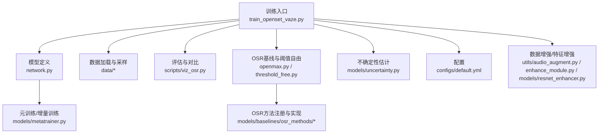
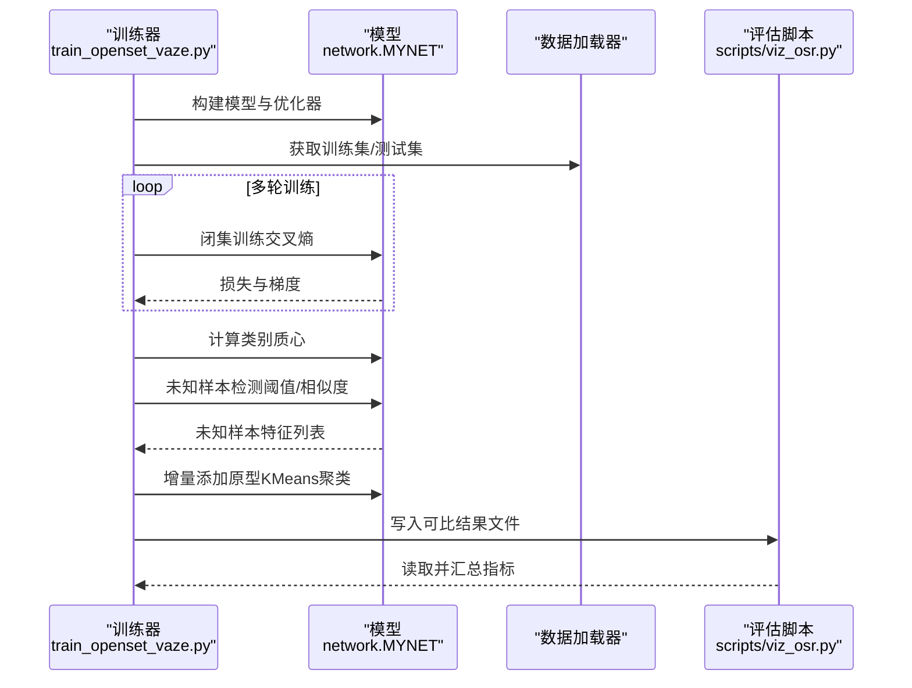
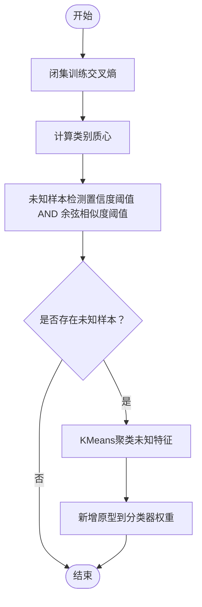
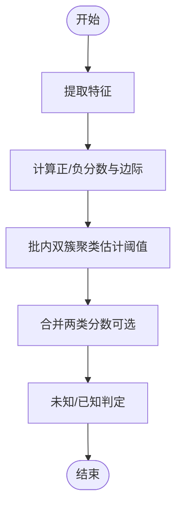
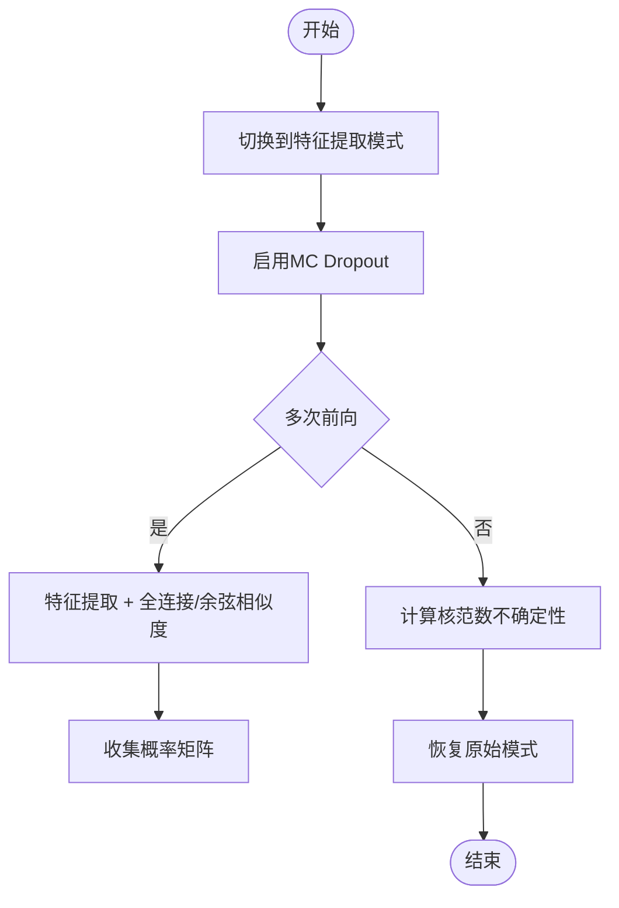
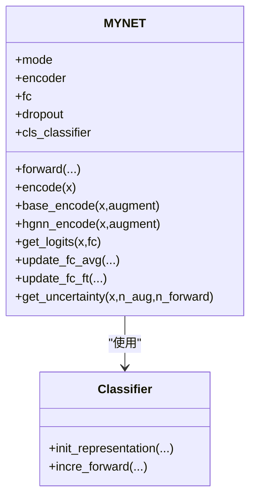
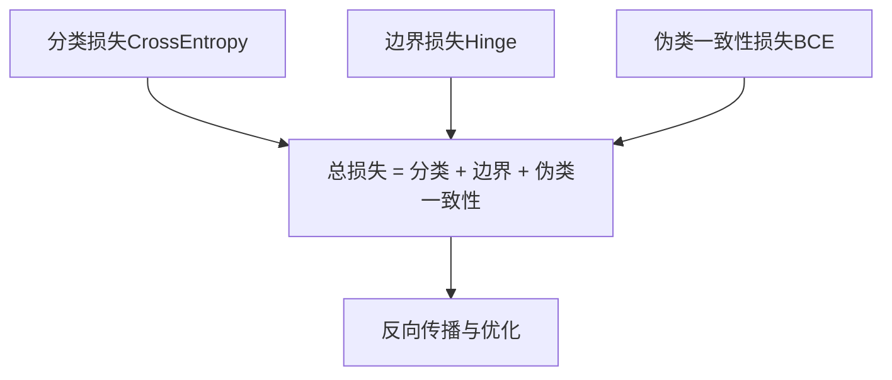
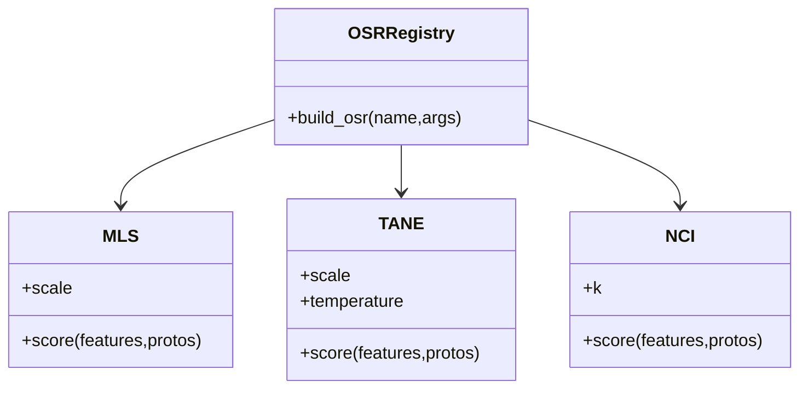
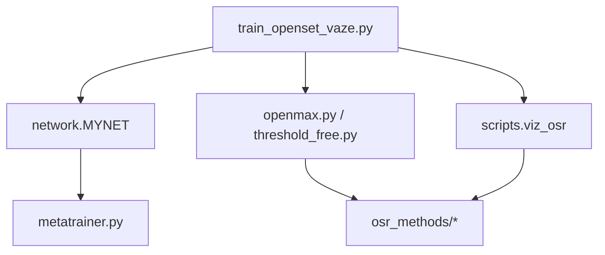

# 开放集识别训练

<cite>
**本文引用的文件**
- [train_openset_vaze.py](file://train_openset_vaze.py)
- [openmax.py](file://openmax.py)
- [threshold_free.py](file://threshold_free.py)
- [models/uncertainty.py](file://models/uncertainty.py)
- [network.py](file://network.py)
- [models/metatrainer.py](file://models/metatrainer.py)
- [configs/default.yml](file://configs/default.yml)
- [scripts/viz_osr.py](file://scripts/viz_osr.py)
- [models/baselines/osr_methods/__init__.py](file://models/baselines/osr_methods/__init__.py)
- [models/baselines/osr_methods/mls.py](file://models/baselines/osr_methods/mls.py)
- [models/baselines/osr_methods/tane.py](file://models/baselines/osr_methods/tane.py)
- [models/baselines/osr_methods/nci.py](file://models/baselines/osr_methods/nci.py)
- [utils/audio_augment.py](file://utils/audio_augment.py)
- [enhance_module.py](file://enhance_module.py)
- [models/resnet_enhancer.py](file://models/resnet_enhancer.py)
</cite>

## 目录
1. [简介](#简介)
2. [项目结构](#项目结构)
3. [核心组件](#核心组件)
4. [架构总览](#架构总览)
5. [详细组件分析](#详细组件分析)
6. [依赖分析](#依赖分析)
7. [性能考虑](#性能考虑)
8. [故障排查指南](#故障排查指南)
9. [结论](#结论)
10. [附录](#附录)

## 简介
本文件面向VAZE项目的开放集识别训练，围绕以下目标展开：  
- 解释未知类别识别的训练策略，包括阈值自由方法与不确定性估计的结合；  
- 说明开放集训练的数据准备与增强、噪声注入；  
- 阐述损失函数设计（分类损失、边界损失、正则化）与模型泛化能力提升；  
- 提供评估指标与性能分析方法（FAR/FRR曲线、AUROC/AUPRC、阈值优化策略）。

VAZE采用“闭集分类器 + 阈值/不确定性/距离策略 + 增量原型”的思路，既兼容现有元学习/增量训练框架，又通过阈值自由与不确定性估计提升未知样本检测的鲁棒性。

## 项目结构
仓库围绕“训练脚本、模型定义、数据与采样、评估与可视化”组织，开放集相关的关键路径如下：
- 训练入口与VAZE流程：train_openset_vaze.py
- 开放集基线与阈值自由方法：openmax.py、threshold_free.py
- 不确定性估计：models/uncertainty.py
- 模型与特征抽取：network.py
- 元训练与增量训练：models/metatrainer.py
- 配置：configs/default.yml
- OSR可视化与指标：scripts/viz_osr.py
- OSR方法注册与实现：models/baselines/osr_methods/*
- 数据增强与特征增强：utils/audio_augment.py、enhance_module.py、models/resnet_enhancer.py

图表来源
- [train_openset_vaze.py:1-481](file://train_openset_vaze.py#L1-L481)
- [network.py:1-724](file://network.py#L1-L724)
- [models/metatrainer.py:1-201](file://models/metatrainer.py#L1-L201)
- [openmax.py:1-109](file://openmax.py#L1-L109)
- [threshold_free.py:1-394](file://threshold_free.py#L1-L394)
- [models/uncertainty.py:1-55](file://models/uncertainty.py#L1-L55)
- [scripts/viz_osr.py:1-100](file://scripts/viz_osr.py#L1-L100)
- [models/baselines/osr_methods/__init__.py:1-22](file://models/baselines/osr_methods/__init__.py#L1-L22)
- [configs/default.yml:1-88](file://configs/default.yml#L1-L88)
- [utils/audio_augment.py:1-31](file://utils/audio_augment.py#L1-L31)
- [enhance_module.py:1-160](file://enhance_module.py#L1-L160)
- [models/resnet_enhancer.py:1-172](file://models/resnet_enhancer.py#L1-L172)

章节来源
- [train_openset_vaze.py:1-481](file://train_openset_vaze.py#L1-L481)
- [configs/default.yml:1-88](file://configs/default.yml#L1-L88)

## 核心组件
- VAZE训练流程（闭集训练 + 未知检测 + 增量原型）：见训练主流程与评估写入逻辑。
- 开放集阈值自由方法：基于批内双簇聚类估计阈值，避免手工调参。
- 不确定性估计：基于MC Dropout与核范数的不确定性打分。
- 模型与特征抽取：支持多种模式（encoder/openmeta/feature_extraction），并内置音频特征提取与增强模块。
- 元训练/增量训练：提供分类损失、边界损失（Hinge）、伪类一致性损失等。
- OSR基线与可视化：提供MLS/TANE/NCI等阈值自由方法，以及ROC/AUPRC可视化。

章节来源
- [train_openset_vaze.py:86-198](file://train_openset_vaze.py#L86-L198)
- [threshold_free.py:16-56](file://threshold_free.py#L16-L56)
- [models/uncertainty.py:5-55](file://models/uncertainty.py#L5-L55)
- [network.py:18-518](file://network.py#L18-L518)
- [models/metatrainer.py:17-178](file://models/metatrainer.py#L17-L178)
- [models/baselines/osr_methods/__init__.py:1-22](file://models/baselines/osr_methods/__init__.py#L1-L22)

## 架构总览
VAZE的整体训练与评估流程如下：

图表来源
- [train_openset_vaze.py:86-198](file://train_openset_vaze.py#L86-L198)
- [network.py:471-518](file://network.py#L471-L518)
- [scripts/viz_osr.py:24-96](file://scripts/viz_osr.py#L24-L96)

## 详细组件分析

### VAZE训练流程与增量原型
- 闭集训练：使用交叉熵损失在已知类上进行标准训练，支持学习率调度。
- 质心计算：在训练集上抽取特征并按类别求均值得到质心。
- 未知检测：同时基于分类置信度阈值与特征-质心余弦相似度阈值进行二选一判定。
- 增量原型：对检测到的未知样本特征执行KMeans聚类，将聚类中心作为新类原型加入分类器权重。

图表来源
- [train_openset_vaze.py:86-198](file://train_openset_vaze.py#L86-L198)

章节来源
- [train_openset_vaze.py:86-198](file://train_openset_vaze.py#L86-L198)

### 阈值自由方法（基于批内双簇聚类）
- 思路：利用批内样本的“正/负”边际分布进行自适应阈值估计，避免手工设定阈值。
- 正负边际：正类分数减去同类负原型分数，形成正负边际；类内区分边际为Top-1与Top-2之差。
- 自适应阈值：对正负边际进行KMeans二簇聚类，阈值为两簇中心的中点；可结合分位点裁剪以稳定阈值。
- Session感知：对历史分位点进行轻度收缩，缓解跨会话漂移。

图表来源
- [threshold_free.py:16-56](file://threshold_free.py#L16-L56)
- [threshold_free.py:178-230](file://threshold_free.py#L178-L230)

章节来源
- [threshold_free.py:16-56](file://threshold_free.py#L16-L56)
- [threshold_free.py:178-230](file://threshold_free.py#L178-L230)

### 不确定性估计（MC Dropout + 核范数）
- 方法：在模型开启Dropout的情况下多次前向，计算概率矩阵的核范数作为不确定性得分。
- 应用：可用于基础类的平均不确定性统计，辅助未知检测或阈值估计。

图表来源
- [network.py:50-101](file://network.py#L50-L101)
- [models/uncertainty.py:5-55](file://models/uncertainty.py#L5-L55)

章节来源
- [network.py:50-101](file://network.py#L50-L101)
- [models/uncertainty.py:5-55](file://models/uncertainty.py#L5-L55)

### 模型与特征抽取（MYNET）
- 模式切换：encoder/openmeta/feature_extraction等模式满足不同阶段需求。
- 特征提取：音频经STFT/Logmel转换后进入编码器，支持SpecAugment与时频增强。
- 分类器：支持余弦分类与温度缩放；提供增量更新与原型替换功能。
- 注意力与增强：内置多头注意力与局部特征聚类模块，提升特征表达。

图表来源
- [network.py:18-518](file://network.py#L18-L518)

章节来源
- [network.py:18-518](file://network.py#L18-L518)

### 元训练与增量训练（损失设计）
- 分类损失：交叉熵，限定在已知类范围内。
- 边界损失：Hinge损失，鼓励伪类原型与支持原型拉开距离。
- 伪类一致性损失：二元交叉熵，约束伪类判别器输出与真实标签一致。
- 温度缩放与余弦分类：提升特征分布的判别性与稳定性。

图表来源
- [models/metatrainer.py:136-163](file://models/metatrainer.py#L136-L163)
- [network.py:102-151](file://network.py#L102-L151)

章节来源
- [models/metatrainer.py:136-163](file://models/metatrainer.py#L136-L163)
- [network.py:102-151](file://network.py#L102-L151)

### OSR基线与阈值自由方法
- 注册表：提供MLS/TANE/NCI三种开放集方法的注册与构建。
- MLS：基于最大余弦分数的负值作为未知分数。
- TANE：能量分数减去Top-1分数，强调置信度差异。
- NCI：最近k类原型的距离比值，衡量歧义性。

图表来源
- [models/baselines/osr_methods/__init__.py:1-22](file://models/baselines/osr_methods/__init__.py#L1-L22)
- [models/baselines/osr_methods/mls.py:15-26](file://models/baselines/osr_methods/mls.py#L15-L26)
- [models/baselines/osr_methods/tane.py:15-29](file://models/baselines/osr_methods/tane.py#L15-L29)
- [models/baselines/osr_methods/nci.py:15-31](file://models/baselines/osr_methods/nci.py#L15-L31)

章节来源
- [models/baselines/osr_methods/__init__.py:1-22](file://models/baselines/osr_methods/__init__.py#L1-L22)
- [models/baselines/osr_methods/mls.py:15-26](file://models/baselines/osr_methods/mls.py#L15-L26)
- [models/baselines/osr_methods/tane.py:15-29](file://models/baselines/osr_methods/tane.py#L15-L29)
- [models/baselines/osr_methods/nci.py:15-31](file://models/baselines/osr_methods/nci.py#L15-L31)

### 数据准备、增强与噪声注入
- 数据准备：支持LibriSpeech/NSynth等数据集，提供FSL采样器与会话式增量采样。
- 音频增强：时间拉伸、音高变换、加噪等随机增强，提升鲁棒性。
- 特征增强：局部特征聚类（KMeans + 空间权重融合），位置编码增强空间感知。
- ResNet增强模块：提供更复杂的特征融合与位置编码模块。

章节来源
- [utils/audio_augment.py:1-31](file://utils/audio_augment.py#L1-L31)
- [enhance_module.py:70-160](file://enhance_module.py#L70-L160)
- [models/resnet_enhancer.py:51-172](file://models/resnet_enhancer.py#L51-L172)

### 评估指标与性能分析
- 指标：已知/未知准确率、F1分数、增量准确率、整体准确率；支持多次测试取均值与标准差。
- 曲线：AUROC/AUPRC；可通过OSR可视化脚本绘制ROC曲线与分数直方图。
- 阈值优化：阈值自由方法自动估计阈值，避免手工调参；也可结合分位点裁剪提升稳定性。

章节来源
- [train_openset_vaze.py:248-417](file://train_openset_vaze.py#L248-L417)
- [scripts/viz_osr.py:24-96](file://scripts/viz_osr.py#L24-L96)

## 依赖分析
- 训练入口依赖模型与数据加载器，评估脚本依赖OSR方法与模型权重。
- 模型内部依赖音频特征提取、分类器、注意力与增强模块。
- OSR方法独立于训练流程，可直接对特征与原型进行评分。

图表来源
- [train_openset_vaze.py:420-481](file://train_openset_vaze.py#L420-L481)
- [network.py:18-518](file://network.py#L18-L518)
- [models/metatrainer.py:17-178](file://models/metatrainer.py#L17-L178)
- [openmax.py:1-109](file://openmax.py#L1-109)
- [threshold_free.py:1-394](file://threshold_free.py#L1-L394)
- [scripts/viz_osr.py:18-21](file://scripts/viz_osr.py#L18-L21)
- [models/baselines/osr_methods/__init__.py:1-22](file://models/baselines/osr_methods/__init__.py#L1-L22)

章节来源
- [train_openset_vaze.py:420-481](file://train_openset_vaze.py#L420-L481)
- [network.py:18-518](file://network.py#L18-L518)
- [models/metatrainer.py:17-178](file://models/metatrainer.py#L17-L178)
- [openmax.py:1-109](file://openmax.py#L1-109)
- [threshold_free.py:1-394](file://threshold_free.py#L1-L394)
- [scripts/viz_osr.py:18-21](file://scripts/viz_osr.py#L18-L21)
- [models/baselines/osr_methods/__init__.py:1-22](file://models/baselines/osr_methods/__init__.py#L1-L22)

## 性能考虑
- 模式切换与内存：MC Dropout与特征提取模式切换需注意设备与模式一致性，避免后续训练崩溃。
- 聚类规模：未知样本聚类的簇数应与样本规模自适应，避免过拟合或欠拟合。
- 阈值估计：双簇聚类对小样本或低方差可能失效，建议结合分位点裁剪与历史会话统计。
- 训练稳定性：温度缩放与余弦分类有助于提升边界清晰度；Hinge损失可强化边界。

## 故障排查指南
- 模式错误导致崩溃：确保在调用不确定性估计后恢复原始模式。
- 设备不一致：确认增强模块与聚类中心在相同设备上。
- 阈值估计异常：检查边际分布是否过于集中或样本过少，必要时增加分位点裁剪或历史会话平滑。
- 评估文件未生成：确认保存目录存在且权限允许，检查评估写入逻辑。

章节来源
- [network.py:50-101](file://network.py#L50-L101)
- [enhance_module.py:149-160](file://enhance_module.py#L149-L160)
- [threshold_free.py:16-56](file://threshold_free.py#L16-L56)
- [train_openset_vaze.py:464-474](file://train_openset_vaze.py#L464-L474)

## 结论
VAZE通过“闭集训练 + 阈值自由/不确定性 + 增量原型”的组合，在不显著改变现有元学习框架的前提下，实现了稳健的开放集识别。其优势在于：
- 阈值自由降低调参成本；
- 不确定性估计提供额外判别依据；
- 增量原型使模型具备持续学习未知类的能力；
- 丰富的OSR基线与可视化工具便于评估与优化。

## 附录
- 配置要点：way、shot、num_session、num_base、num_novel、epochs_std/epochs_meta、温度缩放、学习率与调度策略等。
- 数据准备：确保已知/未知类别平衡与会话式采样；使用音频增强与特征增强提升泛化。
- 评估建议：AUROC/AUPRC、F1分数、增量准确率与整体准确率综合评估；阈值自由方法与不确定性估计可作为对比基线。

章节来源
- [configs/default.yml:1-88](file://configs/default.yml#L1-L88)
- [train_openset_vaze.py:31-83](file://train_openset_vaze.py#L31-L83)