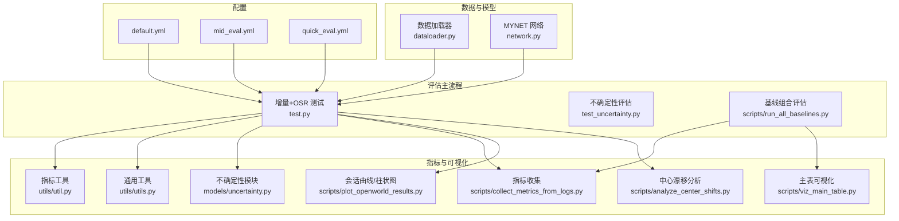
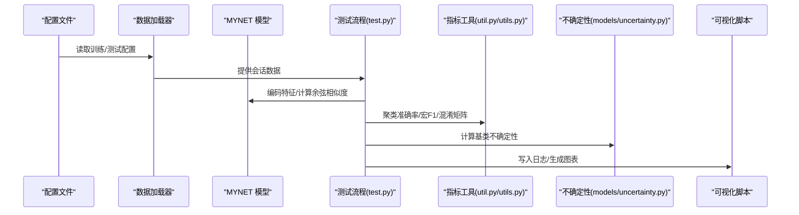
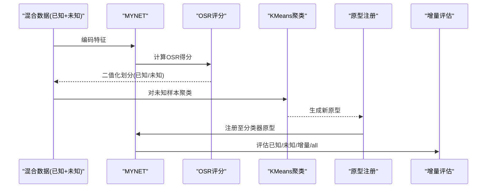
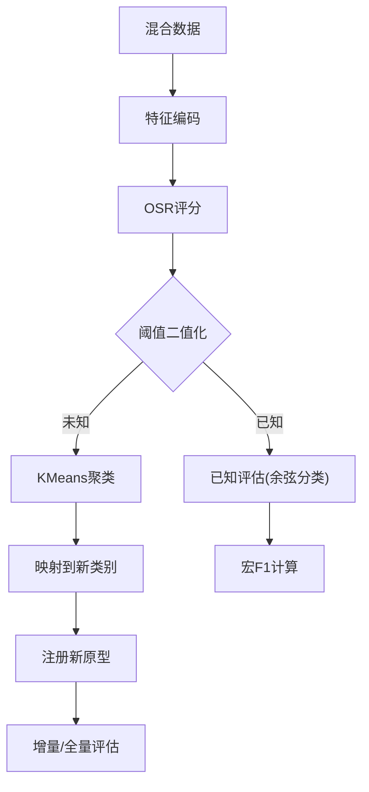
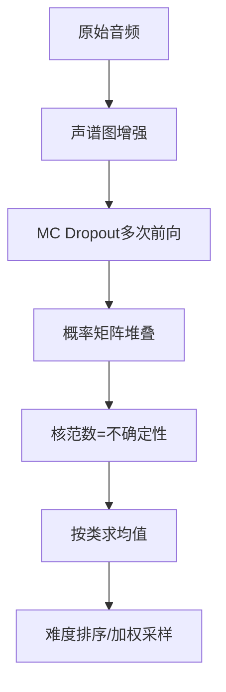
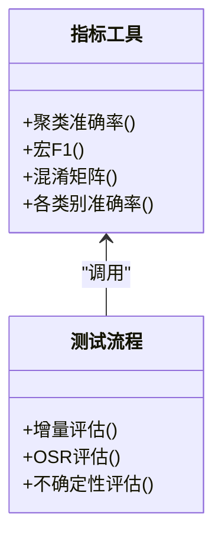
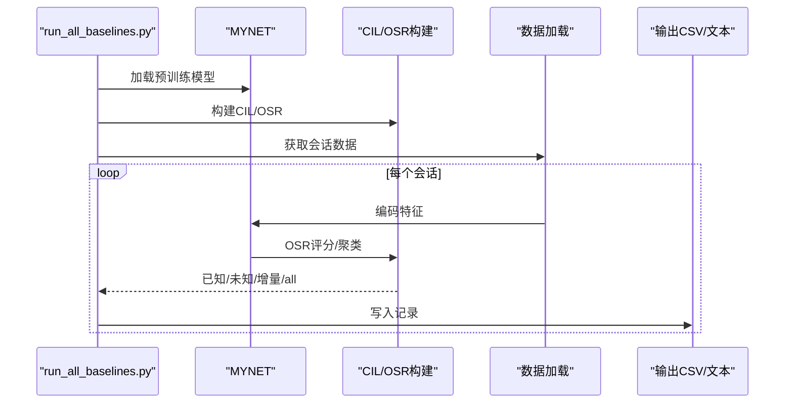

# 测试和评估

<cite>
**本文引用的文件**
- [test.py](file://test.py)
- [test_uncertainty.py](file://test_uncertainty.py)
- [run_all_baselines.py](file://scripts/run_all_baselines.py)
- [default.yml](file://configs/default.yml)
- [mid_eval.yml](file://configs/mid_eval.yml)
- [quick_eval.yml](file://configs/quick_eval.yml)
- [util.py](file://utils/util.py)
- [utils.py](file://utils/utils.py)
- [uncertainty.py](file://models/uncertainty.py)
- [collect_metrics_from_logs.py](file://scripts/collect_metrics_from_logs.py)
- [plot_openworld_results.py](file://scripts/plot_openworld_results.py)
- [viz_main_table.py](file://scripts/viz_main_table.py)
- [analyze_center_shifts.py](file://scripts/analyze_center_shifts.py)
- [network.py](file://network.py)
</cite>

## 目录
1. [简介](#简介)
2. [项目结构](#项目结构)
3. [核心组件](#核心组件)
4. [架构总览](#架构总览)
5. [详细组件分析](#详细组件分析)
6. [依赖分析](#依赖分析)
7. [性能考量](#性能考量)
8. [故障排查指南](#故障排查指南)
9. [结论](#结论)
10. [附录](#附录)

## 简介
本文件系统化梳理 VAZE 项目的测试与评估流程，覆盖增量学习会话测试、开放集识别（OSR）未知类别测试、以及不确定性估计验证三大场景。文档详细说明准确率计算、混淆矩阵分析与性能指标评估的实现方式，并给出不同测试场景的评估方法、指标选择与计算逻辑、可视化与报告生成流程，帮助读者快速理解并复现实验。

## 项目结构
- 配置文件：通过 YAML 控制训练/测试会话数、批次大小、类别数等超参。
- 数据加载：统一的数据管线负责增量会话的训练/测试/开放集混合加载。
- 模型与网络：MYNET 提供编码器、分类器、原型注册与不确定性估计接口。
- 评估脚本：包含增量学习与开放世界联合评估、基线组合评估、指标收集与可视化。
- 工具模块：提供聚类准确率、宏平均 F1、混淆矩阵、各类别准确率统计等实用函数。

**图表来源**
- [default.yml](file://configs/default.yml)
- [mid_eval.yml](file://configs/mid_eval.yml)
- [quick_eval.yml](file://configs/quick_eval.yml)
- [test.py](file://test.py)
- [test_uncertainty.py](file://test_uncertainty.py)
- [run_all_baselines.py](file://scripts/run_all_baselines.py)
- [util.py](file://utils/util.py)
- [utils.py](file://utils/utils.py)
- [uncertainty.py](file://models/uncertainty.py)
- [collect_metrics_from_logs.py](file://scripts/collect_metrics_from_logs.py)
- [plot_openworld_results.py](file://scripts/plot_openworld_results.py)
- [viz_main_table.py](file://scripts/viz_main_table.py)
- [analyze_center_shifts.py](file://scripts/analyze_center_shifts.py)
- [network.py](file://network.py)

**章节来源**
- [default.yml](file://configs/default.yml)
- [mid_eval.yml](file://configs/mid_eval.yml)
- [quick_eval.yml](file://configs/quick_eval.yml)
- [test.py](file://test.py)
- [test_uncertainty.py](file://test_uncertainty.py)
- [run_all_baselines.py](file://scripts/run_all_baselines.py)
- [util.py](file://utils/util.py)
- [utils.py](file://utils/utils.py)
- [uncertainty.py](file://models/uncertainty.py)
- [collect_metrics_from_logs.py](file://scripts/collect_metrics_from_logs.py)
- [plot_openworld_results.py](file://scripts/plot_openworld_results.py)
- [viz_main_table.py](file://scripts/viz_main_table.py)
- [analyze_center_shifts.py](file://scripts/analyze_center_shifts.py)
- [network.py](file://network.py)

## 核心组件
- 增量学习会话测试：在每个会话中对已知类与新增类进行联合评估，计算 all acc 与 incremental acc。
- 开放集识别（OSR）未知类别测试：对混合数据进行 OSR 得分，二值化划分已知/未知，聚类未知样本并注册新原型。
- 不确定性估计验证：基于蒙特卡洛 Dropout 与特征掩码计算样本不确定性，用于难度排序与课程设计。
- 指标与可视化：提供宏平均 F1、各类别准确率、混淆矩阵热力图、会话曲线与汇总柱状图。

**章节来源**
- [test.py](file://test.py)
- [test_uncertainty.py](file://test_uncertainty.py)
- [util.py](file://utils/util.py)
- [utils.py](file://utils/utils.py)
- [uncertainty.py](file://models/uncertainty.py)

## 架构总览
下图展示从配置到数据、模型、评估再到指标与可视化的完整链路。

**图表来源**
- [test.py](file://test.py)
- [util.py](file://utils/util.py)
- [utils.py](file://utils/utils.py)
- [uncertainty.py](file://models/uncertainty.py)
- [default.yml](file://configs/default.yml)

## 详细组件分析

### 增量学习会话测试
- 会话内评估：对当前类池（已知类 + 新增类）进行余弦分类器推理，计算 top-1 准确率。
- 增量准确率：仅对新增类评估，衡量灾难性遗忘。
- 已知/未知拆分：对混合数据进行 OSR 得分，二值化划分后分别评估。
- 聚类与原型注册：对未知样本聚类，映射到新类别并更新分类器原型。

**图表来源**
- [test.py](file://test.py)
- [utils/util.py](file://utils/util.py)

**章节来源**
- [test.py](file://test.py)
- [utils/util.py](file://utils/util.py)

### 开放集识别（OSR）未知类别测试
- OSR 得分：基于已知类原型计算样本得分，设定阈值二值化。
- 未知聚类：对未知样本聚类，计算聚类准确率，映射到新类别。
- 已知评估：对已知样本进行余弦分类器评估，计算宏平均 F1。

**图表来源**
- [test.py](file://test.py)
- [utils/util.py](file://utils/util.py)

**章节来源**
- [test.py](file://test.py)
- [utils/util.py](file://utils/util.py)

### 不确定性估计验证
- 不确定性计算：启用 MC Dropout，对同一样本多次前向，计算概率矩阵的核范数作为不确定性。
- 基类难度排序：抽取少量批次计算每个类的平均不确定性，用于课程排序与困难加权采样。
- 零样本难度评估：利用预训练特征分布的紧凑性进行初始难度排序。

**图表来源**
- [test_uncertainty.py](file://test_uncertainty.py)
- [uncertainty.py](file://models/uncertainty.py)
- [network.py](file://network.py)

**章节来源**
- [test_uncertainty.py](file://test_uncertainty.py)
- [uncertainty.py](file://models/uncertainty.py)
- [network.py](file://network.py)

### 指标与统计分析
- 准确率计算：top-1 准确率通过余弦相似度分类器计算。
- 宏平均 F1：对已知/未知二分类任务计算宏平均 F1。
- 混淆矩阵：提供标准化的混淆矩阵热力图与带色标版本。
- 各类别准确率：按类别统计准确率与样本数量，便于分析类别不平衡影响。

**图表来源**
- [utils/util.py](file://utils/util.py)
- [utils/utils.py](file://utils/utils.py)
- [test.py](file://test.py)

**章节来源**
- [utils/util.py](file://utils/util.py)
- [utils/utils.py](file://utils/utils.py)
- [test.py](file://test.py)

### 基线组合评估（对比实验）
- 自动化遍历 CIL/OSR 方法组合，执行完整会话增量流程，记录各指标。
- 输出统一格式文本与汇总 CSV，便于横向对比。

**图表来源**
- [run_all_baselines.py](file://scripts/run_all_baselines.py)

**章节来源**
- [run_all_baselines.py](file://scripts/run_all_baselines.py)

## 依赖分析
- 配置驱动：通过 YAML 控制会话数、类别数、批次大小、学习率等。
- 数据依赖：统一的数据加载器为增量会话提供训练/测试/开放集混合数据。
- 模型依赖：MYNET 提供编码器、分类器、原型注册与不确定性接口。
- 工具依赖：util 与 utils 提供指标与可视化工具；scripts 提供指标收集与图表生成。

**图表来源**
- [default.yml](file://configs/default.yml)
- [mid_eval.yml](file://configs/mid_eval.yml)
- [quick_eval.yml](file://configs/quick_eval.yml)
- [test.py](file://test.py)
- [utils/util.py](file://utils/util.py)
- [utils/utils.py](file://utils/utils.py)

**章节来源**
- [default.yml](file://configs/default.yml)
- [mid_eval.yml](file://configs/mid_eval.yml)
- [quick_eval.yml](file://configs/quick_eval.yml)
- [test.py](file://test.py)
- [utils/util.py](file://utils/util.py)
- [utils/utils.py](file://utils/utils.py)

## 性能考量
- 随机性控制：固定随机种子与确定性后端，确保结果可复现。
- 不确定性估计：合理设置 MC Dropout 采样次数与掩码增强次数，平衡速度与稳定性。
- 聚类与原型更新：KMeans 初始化与簇内加权有助于减少噪声影响。
- 可视化与日志：定期保存会话曲线与汇总指标，便于监控性能退化（PD）。

[本节为通用指导，无需特定文件引用]

## 故障排查指南
- 随机性问题：若结果不稳定，检查随机种子设置与确定性后端配置。
- 指标异常：确认标签范围与类别映射，确保已知/未知划分与聚类映射一致。
- 可视化缺失：检查输出目录权限与 Matplotlib 后端配置。
- 日志解析失败：确认输出日志格式与正则表达式匹配项一致。

**章节来源**
- [test.py](file://test.py)
- [utils/utils.py](file://utils/utils.py)
- [collect_metrics_from_logs.py](file://scripts/collect_metrics_from_logs.py)

## 结论
VAZE 的测试与评估体系围绕增量学习与开放集识别两条主线展开，结合不确定性估计与可视化手段，形成闭环的性能监控与报告生成流程。通过统一的配置、数据与指标工具，研究者可在不同场景下快速复现实验并进行横向对比。

[本节为总结，无需特定文件引用]

## 附录

### 评估指标与计算
- top-1 准确率：余弦相似度分类器预测的类别准确率。
- 宏平均 F1：对已知/未知二分类任务计算宏平均 F1。
- 混淆矩阵：标准化混淆矩阵热力图，支持带色标版本。
- 各类别准确率：按类别统计准确率与样本数量。

**章节来源**
- [utils/util.py](file://utils/util.py)
- [utils/utils.py](file://utils/utils.py)
- [test.py](file://test.py)

### 测试结果可视化与报告生成
- 会话曲线：绘制已知/未知/F1/增量/all 随会话变化的折线图。
- 汇总柱状图：展示 AA 与 PD 指标。
- 主表可视化：按方法组合绘制会话曲线与聚合指标柱状图。
- 中心漂移分析：计算基类原型中心的 L2 漂移并可视化。

**章节来源**
- [plot_openworld_results.py](file://scripts/plot_openworld_results.py)
- [viz_main_table.py](file://scripts/viz_main_table.py)
- [analyze_center_shifts.py](file://scripts/analyze_center_shifts.py)