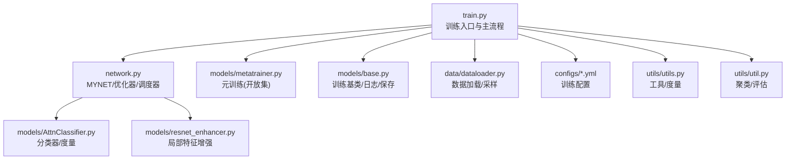
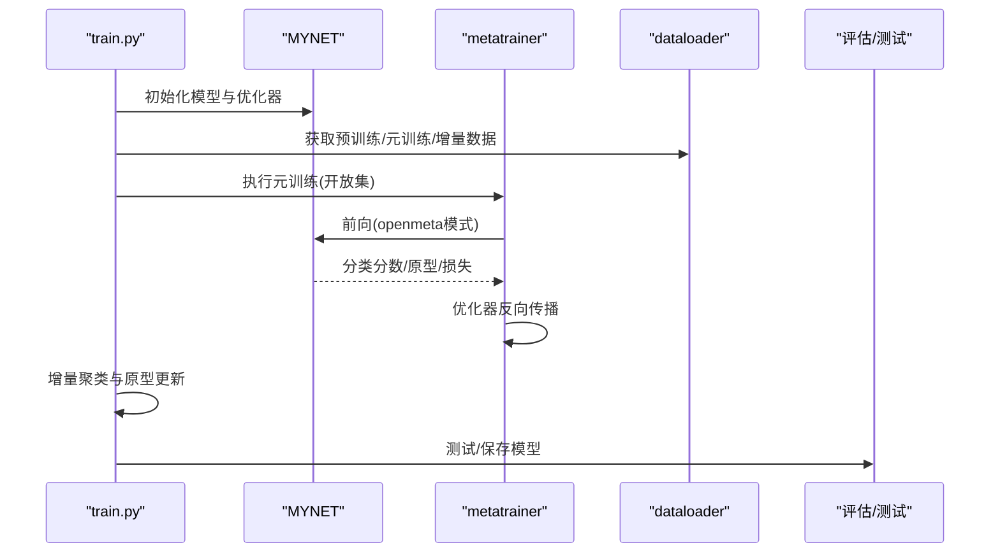
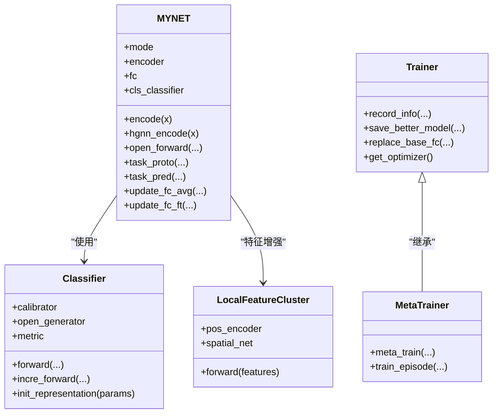

# 训练优化和调参

<cite>
**本文引用的文件**
- [train.py](file://train.py)
- [network.py](file://network.py)
- [models/base.py](file://models/base.py)
- [models/metatrainer.py](file://models/metatrainer.py)
- [models/AttnClassifier.py](file://models/AttnClassifier.py)
- [models/resnet_enhancer.py](file://models/resnet_enhancer.py)
- [configs/default.yml](file://configs/default.yml)
- [configs/mid_eval.yml](file://configs/mid_eval.yml)
- [data/dataloader.py](file://data/dataloader.py)
- [utils/utils.py](file://utils/utils.py)
- [utils/util.py](file://utils/util.py)
</cite>

## 目录
1. [简介](#简介)
2. [项目结构](#项目结构)
3. [核心组件](#核心组件)
4. [架构总览](#架构总览)
5. [详细组件分析](#详细组件分析)
6. [依赖关系分析](#依赖关系分析)
7. [性能考虑](#性能考虑)
8. [故障排查指南](#故障排查指南)
9. [结论](#结论)
10. [附录](#附录)

## 简介
本文件面向VAZE项目的训练优化与参数调优，系统梳理训练流程、关键参数设置、稳定性与性能优化策略、监控与调试方法，并给出常见问题的解决方案与最佳实践。内容覆盖学习率调度、批量大小、正则化、网络架构超参数、梯度裁剪与预热、初始化策略、特征增强、分布式与混合精度等主题，帮助读者在增量开放集场景下获得稳定且高效的训练效果。

## 项目结构
- 训练入口与主流程：train.py
- 网络与优化器：network.py
- 训练基类与日志：models/base.py
- 元训练（开放集）：models/metatrainer.py
- 分类器与度量：models/AttnClassifier.py
- 局部特征增强：models/resnet_enhancer.py
- 配置文件：configs/default.yml、configs/mid_eval.yml
- 数据加载与采样：data/dataloader.py
- 工具与评估：utils/utils.py、utils/util.py

图表来源
- [train.py:1-1296](file://train.py#L1-L1296)
- [network.py:1-724](file://network.py#L1-L724)
- [models/base.py:1-254](file://models/base.py#L1-L254)
- [models/metatrainer.py:1-201](file://models/metatrainer.py#L1-L201)
- [models/AttnClassifier.py:1-369](file://models/AttnClassifier.py#L1-L369)
- [models/resnet_enhancer.py:1-172](file://models/resnet_enhancer.py#L1-L172)
- [data/dataloader.py:1-351](file://data/dataloader.py#L1-L351)
- [configs/default.yml:1-88](file://configs/default.yml#L1-L88)
- [configs/mid_eval.yml:1-88](file://configs/mid_eval.yml#L1-L88)
- [utils/utils.py:1-566](file://utils/utils.py#L1-L566)
- [utils/util.py:1-75](file://utils/util.py#L1-L75)

章节来源
- [train.py:1-1296](file://train.py#L1-L1296)
- [network.py:1-724](file://network.py#L1-L724)
- [models/base.py:1-254](file://models/base.py#L1-L254)
- [models/metatrainer.py:1-201](file://models/metatrainer.py#L1-L201)
- [models/AttnClassifier.py:1-369](file://models/AttnClassifier.py#L1-L369)
- [models/resnet_enhancer.py:1-172](file://models/resnet_enhancer.py#L1-L172)
- [data/dataloader.py:1-351](file://data/dataloader.py#L1-L351)
- [configs/default.yml:1-88](file://configs/default.yml#L1-L88)
- [configs/mid_eval.yml:1-88](file://configs/mid_eval.yml#L1-L88)
- [utils/utils.py:1-566](file://utils/utils.py#L1-L566)
- [utils/util.py:1-75](file://utils/util.py#L1-L75)

## 核心组件
- MYNET：主干网络，包含音频特征提取器、分类头、注意力模块、温度参数、以及增量更新原型的接口。
- 优化器与调度器：SGD+Nesterov，支持Step/MultiStep学习率调度；元训练阶段支持ReduceLROnPlateau。
- 分类器与度量：基于余弦相似度的度量，支持温度参数可调；支持开放集负原型生成与校准。
- 局部特征增强：基于KMeans的空间聚类与位置编码增强，融合全局与局部特征。
- 数据加载：支持多种数据集，采用自定义采样器，支持课程式采样与批次级采样。
- 训练基类：封装训练统计、模型保存、验证记录、日志输出等通用逻辑。

章节来源
- [network.py:18-518](file://network.py#L18-L518)
- [models/AttnClassifier.py:39-120](file://models/AttnClassifier.py#L39-L120)
- [models/resnet_enhancer.py:51-172](file://models/resnet_enhancer.py#L51-L172)
- [data/dataloader.py:108-230](file://data/dataloader.py#L108-L230)
- [models/base.py:27-176](file://models/base.py#L27-L176)

## 架构总览
VAZE训练由“基础预训练—元训练—增量开放集—测试评估”构成。基础预训练使用标准分类损失；元训练引入开放集任务，结合支持/查询/开放集三路数据，计算分类损失与Hinge损失；增量阶段通过聚类与原型更新逐步扩展类别空间。

图表来源
- [train.py:800-981](file://train.py#L800-L981)
- [models/metatrainer.py:17-85](file://models/metatrainer.py#L17-L85)
- [network.py:102-151](file://network.py#L102-L151)
- [data/dataloader.py:19-81](file://data/dataloader.py#L19-L81)

章节来源
- [train.py:800-981](file://train.py#L800-L981)
- [models/metatrainer.py:17-85](file://models/metatrainer.py#L17-L85)
- [network.py:102-151](file://network.py#L102-L151)
- [data/dataloader.py:19-81](file://data/dataloader.py#L19-L81)

## 详细组件分析

### 1) 训练流程与关键参数
- 基础预训练：标准分类损失，使用SGD+Nesterov，支持Step/MultiStep调度。
- 元训练（开放集）：分类CE损失与Hinge损失组合，支持ReduceLROnPlateau。
- 增量阶段：聚类未知样本，更新分类头原型，支持温度参数与cosine分类。
- 数据加载：支持课程式采样与批次级采样，多进程加载，pin_memory加速。

章节来源
- [train.py:931-981](file://train.py#L931-L981)
- [models/metatrainer.py:17-85](file://models/metatrainer.py#L17-L85)
- [network.py:586-608](file://network.py#L586-L608)
- [data/dataloader.py:108-230](file://data/dataloader.py#L108-L230)

### 2) 学习率调度与优化器
- SGD+Nesterov，momentum=0.9，weight_decay=配置项。
- StepLR：step_size=配置项，gamma=配置项。
- MultiStepLR：milestones=配置项，gamma=配置项。
- 元训练：ReduceLROnPlateau（基于最大准确率）或自定义MultiStep衰减。

章节来源
- [network.py:586-608](file://network.py#L586-L608)
- [models/metatrainer.py:28-48](file://models/metatrainer.py#L28-L48)
- [configs/default.yml:34-38](file://configs/default.yml#L34-L38)
- [configs/mid_eval.yml:34-38](file://configs/mid_eval.yml#L34-L38)

### 3) 批量大小与数据加载
- 训练批大小：train_batch_size=128；测试批大小：test_batch_size=100。
- num_workers=8，pin_memory=True，worker_init_fn绑定随机种子，保证可复现。
- 自定义采样器：SupportsetSampler、TrueIncreTrainCategoriesSampler，支持n-way、n-shot、n-query。

章节来源
- [configs/default.yml:58-60](file://configs/default.yml#L58-L60)
- [configs/mid_eval.yml:58-60](file://configs/mid_eval.yml#L58-L60)
- [data/dataloader.py:158-167](file://data/dataloader.py#L158-L167)
- [data/dataloader.py:222-227](file://data/dataloader.py#L222-L227)

### 4) 正则化与网络架构超参数
- Dropout：在不确定性估计时启用，训练时关闭。
- 温度参数：Metric_Cosine中可学习温度，影响余弦相似度的锐利程度。
- 分类头：Linear或Cosine分类，支持ft_dot/ft_cos模式。
- 注意力：MultiHeadAttention，头数与维度可配置。

章节来源
- [network.py:26](file://network.py#L26)
- [models/AttnClassifier.py:353-369](file://models/AttnClassifier.py#L353-L369)
- [network.py:42-46](file://network.py#L42-L46)
- [network.py:538-584](file://network.py#L538-L584)

### 5) 梯度裁剪、学习率预热与初始化
- 梯度裁剪：未在代码中显式出现，可在自定义训练循环中加入梯度裁剪。
- 预热：未实现显式Warmup，可通过课程学习（Curriculum）策略分阶段训练。
- 初始化：Xavier初始化用于线性层，随机种子固定，CUDNN确定性设置。

章节来源
- [train.py:142-147](file://train.py#L142-L147)
- [train.py:114-134](file://train.py#L114-L134)
- [data/dataloader.py:5-12](file://data/dataloader.py#L5-L12)

### 6) 特征增强与原型更新
- 局部特征增强：LocalFeatureCluster，基于KMeans与位置编码，融合全局与局部特征。
- 原型更新：聚类后仅更新未知类原型，支持动量更新与平均嵌入更新。

章节来源
- [models/resnet_enhancer.py:51-172](file://models/resnet_enhancer.py#L51-L172)
- [train.py:416-503](file://train.py#L416-L503)
- [network.py:405-461](file://network.py#L405-L461)

### 7) 混合精度、分布式与内存优化
- 混合精度：未在代码中使用AMP，可在训练循环中加入GradScaler。
- 分布式：未见DDP实现，可按PyTorch官方模式接入。
- 内存优化：pin_memory、num_workers、数据预处理（SpecAugment）与特征池化。

章节来源
- [network.py:486-503](file://network.py#L486-L503)
- [configs/default.yml:58](file://configs/default.yml#L58)

### 8) 训练监控与调试
- 日志与保存：Trainer基类记录训练/验证损失与准确率，保存最佳模型。
- 指标：F1、AUROC（元训练）、聚类指标（轮廓系数、类内/类间距离比）。
- 可视化：t-SNE、相关性热图、特征分布、决策边界。

章节来源
- [models/base.py:37-47](file://models/base.py#L37-L47)
- [models/base.py:153-176](file://models/base.py#L153-L176)
- [train.py:238-377](file://train.py#L238-L377)
- [models/metatrainer.py:54-80](file://models/metatrainer.py#L54-L80)

## 依赖关系分析

图表来源
- [network.py:18-518](file://network.py#L18-L518)
- [models/AttnClassifier.py:39-120](file://models/AttnClassifier.py#L39-L120)
- [models/resnet_enhancer.py:51-172](file://models/resnet_enhancer.py#L51-L172)
- [models/base.py:27-176](file://models/base.py#L27-L176)
- [models/metatrainer.py:17-85](file://models/metatrainer.py#L17-L85)

章节来源
- [network.py:18-518](file://network.py#L18-L518)
- [models/AttnClassifier.py:39-120](file://models/AttnClassifier.py#L39-L120)
- [models/resnet_enhancer.py:51-172](file://models/resnet_enhancer.py#L51-L172)
- [models/base.py:27-176](file://models/base.py#L27-L176)
- [models/metatrainer.py:17-85](file://models/metatrainer.py#L17-L85)

## 性能考虑
- 批大小与吞吐：合理设置train_batch_size与num_workers，在GPU显存与CPU I/O之间平衡。
- 数据管道：pin_memory、worker_init_fn、固定随机种子，避免数据加载成为瓶颈。
- 计算热点：余弦相似度与注意力计算，可考虑降低维度或减少头数。
- I/O与存储：定期保存模型与日志，避免长时间训练中断导致的损失。

章节来源
- [configs/default.yml:58-60](file://configs/default.yml#L58-L60)
- [data/dataloader.py:128-132](file://data/dataloader.py#L128-L132)
- [models/base.py:153-176](file://models/base.py#L153-L176)

## 故障排查指南
- 随机性与可复现：检查set_seed与CUDNN确定性设置；确认worker_init_fn与随机种子。
- 学习率不下降：确认scheduler类型与step/milestones设置；元训练使用ReduceLROnPlateau时关注指标。
- 梯度爆炸/消失：检查损失函数与温度参数；必要时加入梯度裁剪。
- 过拟合：观察训练/验证曲线差异；可尝试降低学习率、增加正则或早停。
- 聚类不稳定：调整k_ratio、聚类中心初始化与权重融合比例；使用动量更新原型。

章节来源
- [train.py:114-134](file://train.py#L114-L134)
- [models/metatrainer.py:28-48](file://models/metatrainer.py#L28-L48)
- [train.py:416-503](file://train.py#L416-L503)
- [network.py:405-461](file://network.py#L405-L461)

## 结论
VAZE在增量开放集场景下提供了清晰的训练框架：基础预训练、元训练开放集、增量聚类与原型更新。通过合理设置学习率调度、批量大小、正则化与网络超参数，并结合特征增强与训练监控，可在不同数据集上取得稳定且可扩展的性能。建议在实际部署中引入混合精度、分布式训练与梯度裁剪等手段进一步提升效率与稳定性。

## 附录
- 常用调参建议
  - 学习率：从配置文件默认值出发，若收敛慢可尝试Cosine预热或ReduceLROnPlateau。
  - 批大小：在显存允许前提下尽量增大，观察损失曲线稳定性。
  - 正则化：适度提高weight_decay，谨慎使用Dropout（仅在不确定性估计时启用）。
  - 网络超参：温度参数影响分类锐利度；注意ft_dot/ft_cos模式的选择。
  - 增量策略：聚类k_ratio与融合权重可随session动态调整；动量更新有助于稳定增量学习。
- 监控指标
  - 训练/验证损失与准确率、AUROC、F1、聚类轮廓系数、类内/类间距离比。
  - 可视化：t-SNE、相关性热图、特征分布、决策边界。

章节来源
- [configs/default.yml:22-45](file://configs/default.yml#L22-L45)
- [configs/mid_eval.yml:22-45](file://configs/mid_eval.yml#L22-L45)
- [models/AttnClassifier.py:353-369](file://models/AttnClassifier.py#L353-L369)
- [train.py:238-377](file://train.py#L238-L377)