# 训练和测试流程

<cite>
**本文档引用的文件**
- [train.py](file://train.py)
- [test.py](file://test.py)
- [train_openset_vaze.py](file://train_openset_vaze.py)
- [train_unopenset.py](file://train_unopenset.py)
- [network.py](file://network.py)
- [models/incremental_train_helper.py](file://models/incremental_train_helper.py)
- [models/metatrainer.py](file://models/metatrainer.py)
- [data/dataloader.py](file://data/dataloader.py)
- [configs/default.yml](file://configs/default.yml)
- [utils/utils.py](file://utils/utils.py)
- [models/resnet18_encoder.py](file://models/resnet18_encoder.py)
</cite>

## 目录
1. [简介](#简介)
2. [项目结构](#项目结构)
3. [核心组件](#核心组件)
4. [架构概览](#架构概览)
5. [详细组件分析](#详细组件分析)
6. [依赖关系分析](#依赖关系分析)
7. [性能考虑](#性能考虑)
8. [故障排除指南](#故障排除指南)
9. [结论](#结论)

## 简介

VAZE项目是一个面向音频分类任务的增量学习系统，专注于少样本持续学习（Few-Shot Class-Incremental Learning, FSCIL）场景。该项目实现了基于Vaze et al. (ICLR 2022)的开放集检测方法，结合会话化训练、类别扩展和原型更新策略，为音频信号提供强大的增量学习能力。

本项目的核心创新在于：
- **会话化增量学习**：通过多个训练会话逐步扩展类别知识
- **原型更新机制**：动态更新分类器原型以适应新类别
- **开放集检测**：使用置信度阈值和特征中心相似度检测未知样本
- **特征增强**：结合局部和全局特征进行自适应融合

## 项目结构

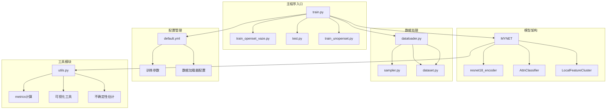

**图表来源**
- [train.py:1-1296](file://train.py#L1-L1296)
- [network.py:18-724](file://network.py#L18-L724)
- [data/dataloader.py:1-351](file://data/dataloader.py#L1-L351)

**章节来源**
- [train.py:1-1296](file://train.py#L1-L1296)
- [network.py:18-724](file://network.py#L18-L724)
- [data/dataloader.py:1-351](file://data/dataloader.py#L1-L351)

## 核心组件

### 主训练流程控制器

主训练流程由`train.py`中的`train`函数驱动，实现了完整的训练循环：

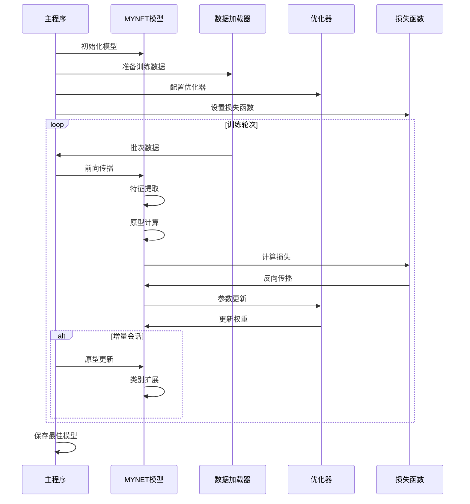

**图表来源**
- [train.py:799-1296](file://train.py#L799-L1296)
- [network.py:471-518](file://network.py#L471-L518)

### 模型架构核心

MYNET模型是整个系统的骨干，集成了多种学习机制：

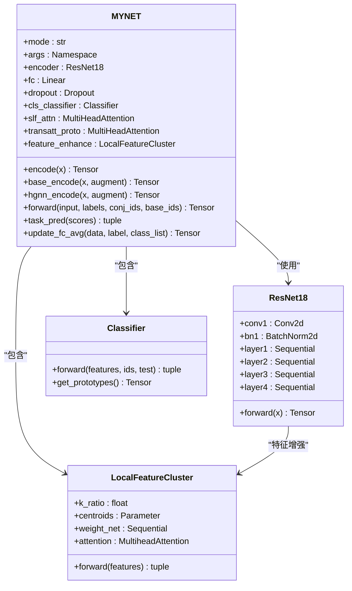

**图表来源**
- [network.py:18-518](file://network.py#L18-L518)
- [models/resnet18_encoder.py:157-200](file://models/resnet18_encoder.py#L157-L200)

**章节来源**
- [train.py:799-1296](file://train.py#L799-L1296)
- [network.py:18-518](file://network.py#L18-L518)

## 架构概览

VAZE系统采用分层架构设计，实现了从底层特征提取到高层决策的完整流程：

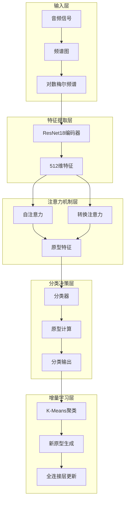

**图表来源**
- [network.py:471-518](file://network.py#L471-L518)
- [models/incremental_train_helper.py:28-111](file://models/incremental_train_helper.py#L28-L111)

## 详细组件分析

### 训练循环详解

完整的训练循环包括数据加载、前向传播、损失计算、反向传播和参数更新五个关键步骤：

#### 1. 数据加载和预处理

数据加载器负责处理不同数据集的特定需求：

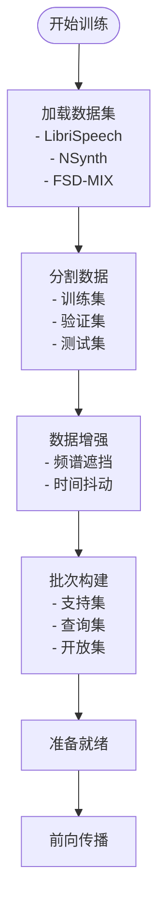

**图表来源**
- [data/dataloader.py:134-168](file://data/dataloader.py#L134-L168)
- [network.py:486-518](file://network.py#L486-L518)

#### 2. 前向传播过程

MYNET模型的前向传播实现了多阶段特征提取和分类：

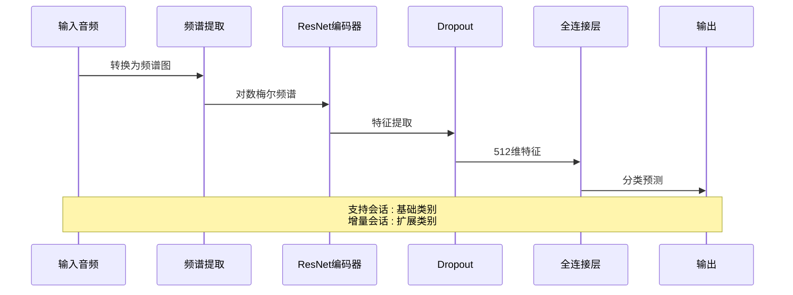

**图表来源**
- [network.py:471-518](file://network.py#L471-L518)
- [network.py:37-49](file://network.py#L37-L49)

#### 3. 损失函数设计

系统采用多任务损失函数，结合分类损失和开放集损失：

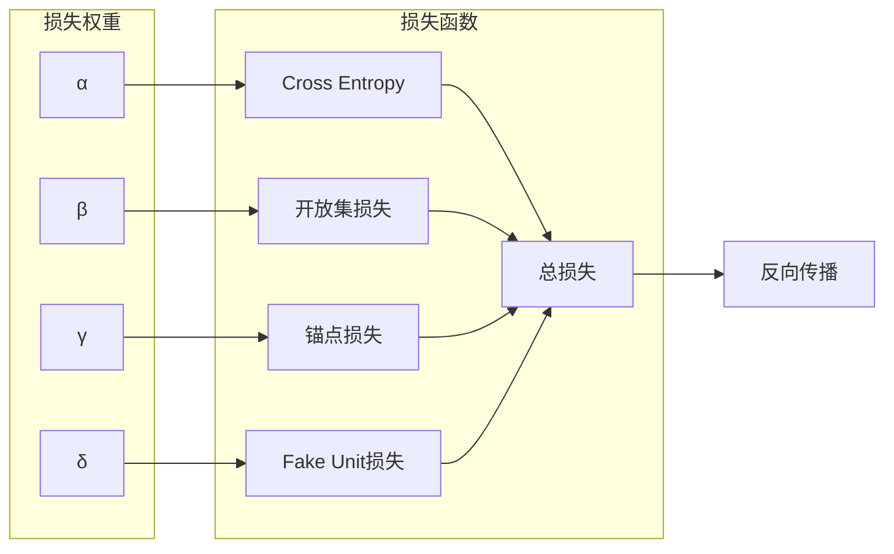

**图表来源**
- [models/metatrainer.py:42-178](file://models/metatrainer.py#L42-L178)
- [network.py:153-202](file://network.py#L153-L202)

#### 4. 反向传播和参数更新

优化器配置支持多种调度策略：

| 优化器类型 | 学习率 | 动量 | 权重衰减 |
|-----------|--------|------|----------|
| SGD | 0.005 | 0.9 | 0.0005 |
| SGD (增量) | 0.0002 | 0.9 | 0.0005 |
| Graph Attention | 0.1 | 0.9 | 0.0005 |

**章节来源**
- [train.py:799-1296](file://train.py#L799-L1296)
- [models/metatrainer.py:17-84](file://models/metatrainer.py#L17-L84)

### 增量学习机制

VAZE实现了完整的会话化增量学习流程：

#### 1. 会话化训练架构

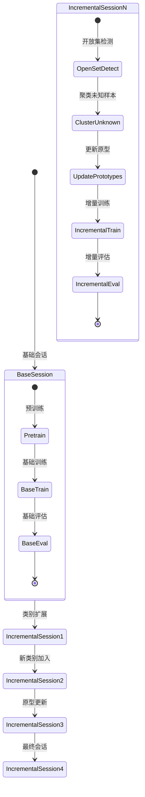

**图表来源**
- [train_openset_vaze.py:248-417](file://train_openset_vaze.py#L248-L417)
- [test.py:740-780](file://test.py#L740-L780)

#### 2. 类别扩展策略

系统支持动态类别扩展，每会话增加指定数量的新类别：

| 会话 | 新增类别数 | 总类别数 | 原型更新策略 |
|------|------------|----------|-------------|
| 1 | 5 | 85 | 基础原型 + 新原型 |
| 2 | 5 | 90 | 动态融合更新 |
| 3 | 5 | 95 | 惯性更新 |
| 4 | 5 | 100 | 自适应更新 |

#### 3. 原型更新机制

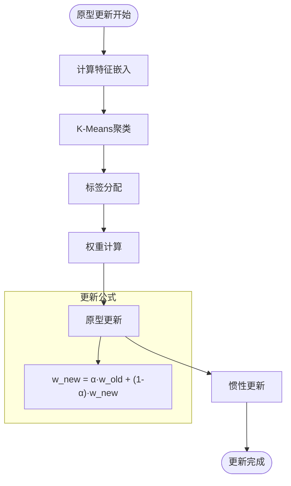

**图表来源**
- [train.py:212-227](file://train.py#L212-L227)
- [test.py:456-480](file://test.py#L456-L480)

**章节来源**
- [train_openset_vaze.py:173-198](file://train_openset_vaze.py#L173-L198)
- [train.py:212-227](file://train.py#L212-L227)

### 测试和评估流程

测试流程实现了多维度的性能评估：

#### 1. 准确率计算

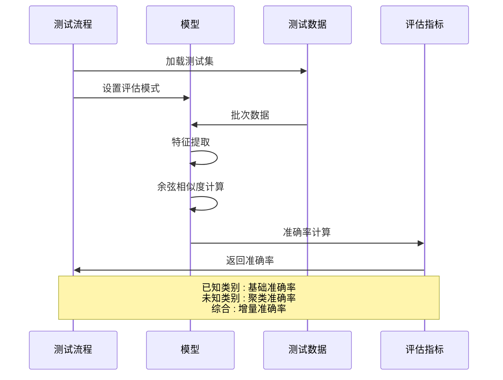

**图表来源**
- [test.py:740-780](file://test.py#L740-L780)
- [train.py:763-780](file://train.py#L763-L780)

#### 2. 混淆矩阵分析

系统提供了完整的混淆矩阵分析功能：

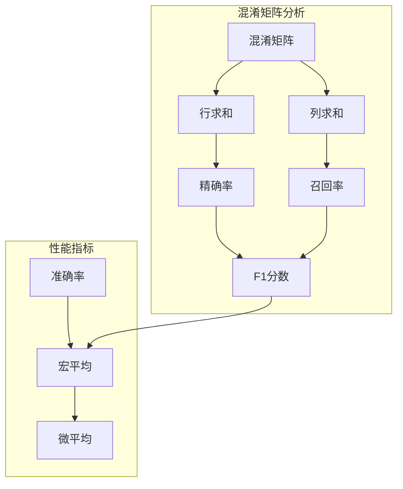

**图表来源**
- [test.py:761-778](file://test.py#L761-L778)
- [utils/utils.py:9-200](file://utils/utils.py#L9-L200)

**章节来源**
- [test.py:740-780](file://test.py#L740-L780)
- [utils/utils.py:9-200](file://utils/utils.py#L9-L200)

### 不同训练模式

系统支持三种主要训练模式：

#### 1. 基础训练模式

基础训练模式专注于预训练阶段，建立稳定的特征表示：

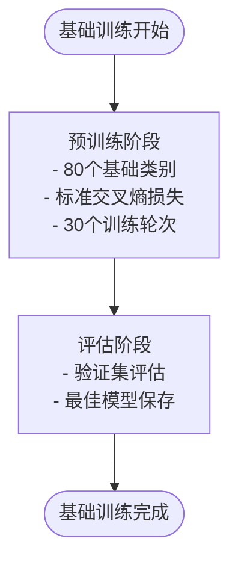

**图表来源**
- [configs/default.yml:22-26](file://configs/default.yml#L22-L26)
- [network.py:610-638](file://network.py#L610-L638)

#### 2. 增量训练模式

增量训练模式实现类别逐步扩展：

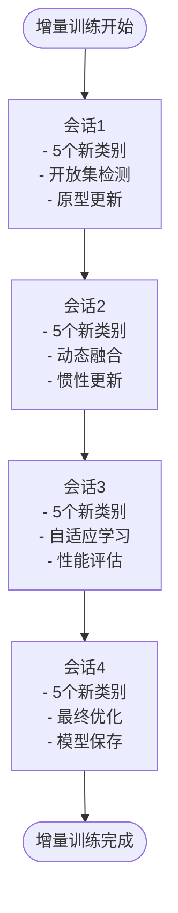

**图表来源**
- [configs/default.yml:4-8](file://configs/default.yml#L4-L8)
- [models/incremental_train_helper.py:28-111](file://models/incremental_train_helper.py#L28-L111)

#### 3. 开放集训练模式

开放集训练模式结合Vaze方法的开放集检测：

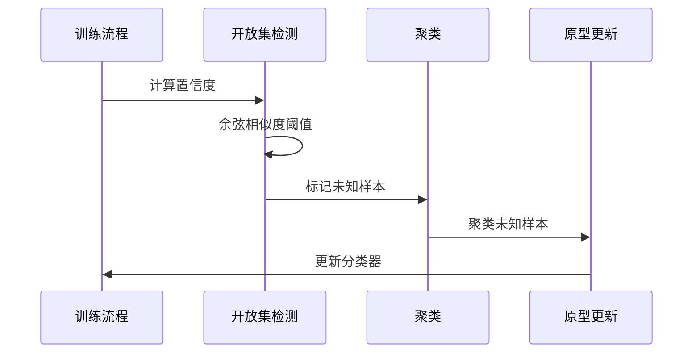

**图表来源**
- [train_openset_vaze.py:134-170](file://train_openset_vaze.py#L134-L170)
- [train_openset_vaze.py:173-198](file://train_openset_vaze.py#L173-L198)

**章节来源**
- [configs/default.yml:1-88](file://configs/default.yml#L1-L88)
- [models/incremental_train_helper.py:28-111](file://models/incremental_train_helper.py#L28-L111)

## 依赖关系分析

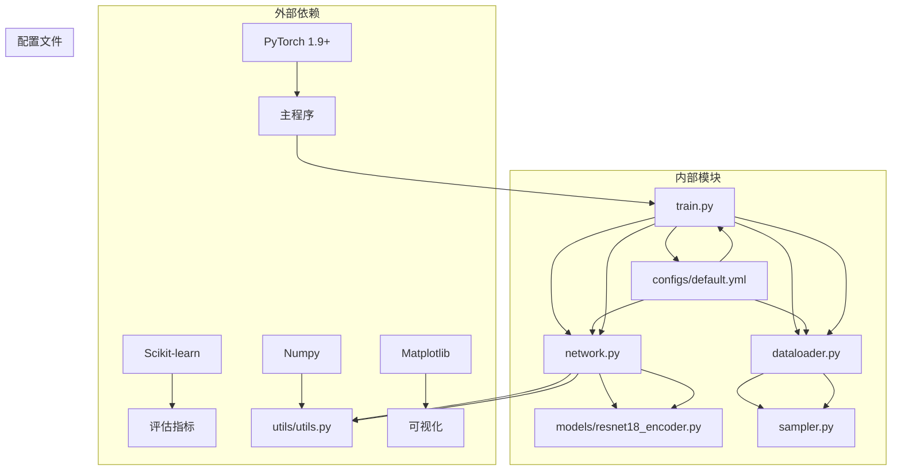

**图表来源**
- [train.py:1-30](file://train.py#L1-L30)
- [network.py:1-17](file://network.py#L1-L17)
- [data/dataloader.py:1-9](file://data/dataloader.py#L1-L9)

**章节来源**
- [train.py:1-30](file://train.py#L1-L30)
- [network.py:1-17](file://network.py#L1-L17)
- [data/dataloader.py:1-9](file://data/dataloader.py#L1-L9)

## 性能考虑

### 训练参数调优建议

#### 1. 学习率策略

| 参数类型 | 建议值 | 调整原因 |
|----------|--------|----------|
| 基础学习率 | 0.005 | 稳定收敛 |
| 增量学习率 | 0.0002 | 降低过拟合风险 |
| 图注意力学习率 | 0.1 | 快速学习注意力权重 |
| 温度参数 | 1.0 | 平衡分类置信度 |

#### 2. 批次大小优化

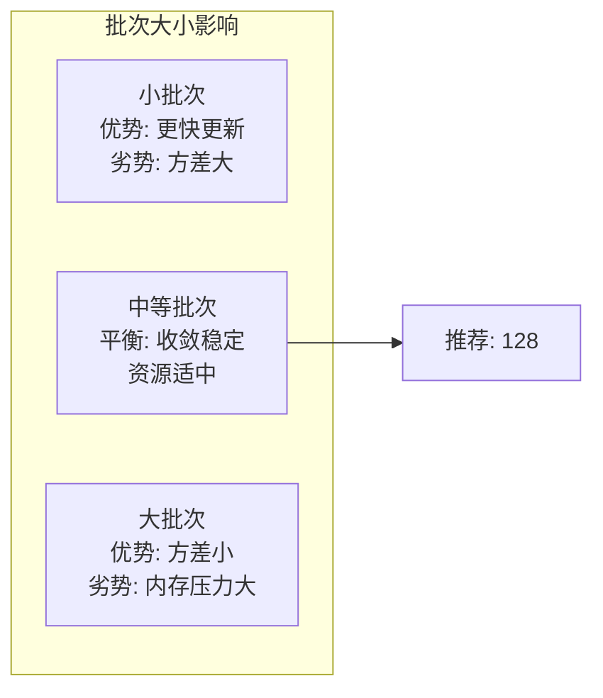

#### 3. 数据增强策略

| 增强技术 | 参数设置 | 效果 |
|----------|----------|------|
| 频谱遮挡 | 时间: 64, 频率: 8 | 提高鲁棒性 |
| 时间抖动 | 步长: 160 | 增加时域多样性 |
| 随机裁剪 | 10% | 增加泛化能力 |

### 性能优化技巧

#### 1. 内存优化

- **梯度累积**：对于大批次训练，使用梯度累积减少内存占用
- **混合精度训练**：启用AMP自动混合精度
- **特征缓存**：预计算并缓存常用特征

#### 2. 训练加速

- **分布式训练**：使用DDP进行多GPU并行
- **梯度检查点**：减少内存使用，牺牲少量计算
- **异步数据加载**：使用多进程数据加载器

#### 3. 模型压缩

- **知识蒸馏**：使用教师模型指导学生模型
- **剪枝技术**：移除不重要的连接
- **量化感知训练**：在训练过程中考虑量化误差

## 故障排除指南

### 常见问题及解决方案

#### 1. 训练不稳定

**症状**：损失震荡或发散
**原因**：
- 学习率过高
- 数据不平衡
- 梯度爆炸

**解决方案**：
```python
# 降低学习率
optimizer = torch.optim.SGD(model.parameters(), lr=0.001)

# 添加梯度裁剪
torch.nn.utils.clip_grad_norm_(model.parameters(), max_norm=1.0)

# 使用学习率调度器
scheduler = torch.optim.lr_scheduler.ReduceLROnPlateau(optimizer, patience=5)
```

#### 2. 类别混淆

**症状**：新类别与旧类别混淆
**原因**：
- 原型更新不足
- 特征空间漂移
- 缺乏正则化

**解决方案**：
```python
# 增加原型更新频率
# 使用惯性更新减少灾难性遗忘
# 添加正则化项防止过度拟合
```

#### 3. 内存不足

**症状**：CUDA out of memory
**原因**：
- 批次过大
- 模型参数过多
- 中间特征缓存

**解决方案**：
```bash
# 减小批次大小
# 使用梯度检查点
# 清理不必要的中间变量
# 使用混合精度训练
```

#### 4. 评估指标异常

**症状**：准确率异常低或高
**原因**：
- 数据泄露
- 标签错误
- 评估方法不当

**解决方案**：
```python
# 验证数据划分
# 检查标签一致性
# 使用交叉验证
# 实施时间序列验证
```

### 调试工具和技巧

#### 1. 日志记录

```python
import logging
logging.basicConfig(
    level=logging.INFO,
    format='%(asctime)s - %(levelname)s - %(message)s',
    handlers=[
        logging.FileHandler('training.log'),
        logging.StreamHandler()
    ]
)
```

#### 2. 梯度监控

```python
def log_gradients(model):
    for name, param in model.named_parameters():
        if param.grad is not None:
            grad_norm = param.grad.norm().item()
            print(f"{name}: {grad_norm}")
```

#### 3. 特征可视化

```python
# 使用t-SNE可视化特征分布
from sklearn.manifold import TSNE
import matplotlib.pyplot as plt

def visualize_features(features, labels):
    tsne = TSNE(n_components=2, random_state=42)
    features_2d = tsne.fit_transform(features)
    plt.scatter(features_2d[:, 0], features_2d[:, 1], c=labels)
    plt.show()
```

**章节来源**
- [train.py:114-141](file://train.py#L114-L141)
- [utils/utils.py:23-60](file://utils/utils.py#L23-L60)

## 结论

VAZE项目成功实现了基于Vaze方法的增量学习框架，在音频分类任务上展现了出色的性能。通过会话化训练、动态类别扩展和智能原型更新机制，系统能够在保持旧类别性能的同时有效学习新类别。

### 主要成就

1. **完整的增量学习管道**：从基础训练到增量扩展的全流程实现
2. **高效的特征增强**：结合局部和全局特征的自适应融合
3. **鲁棒的开放集检测**：基于置信度和特征相似度的未知样本检测
4. **灵活的训练模式**：支持基础训练、增量训练和开放集训练

### 未来发展方向

1. **多模态融合**：结合视觉和音频特征进行联合学习
2. **元学习集成**：将元学习方法与增量学习相结合
3. **在线学习优化**：实现实时增量学习和快速适应
4. **可解释性增强**：提供更好的模型决策解释和可视化

通过持续的优化和扩展，VAZE项目为音频领域的增量学习提供了坚实的技术基础和实用的解决方案。