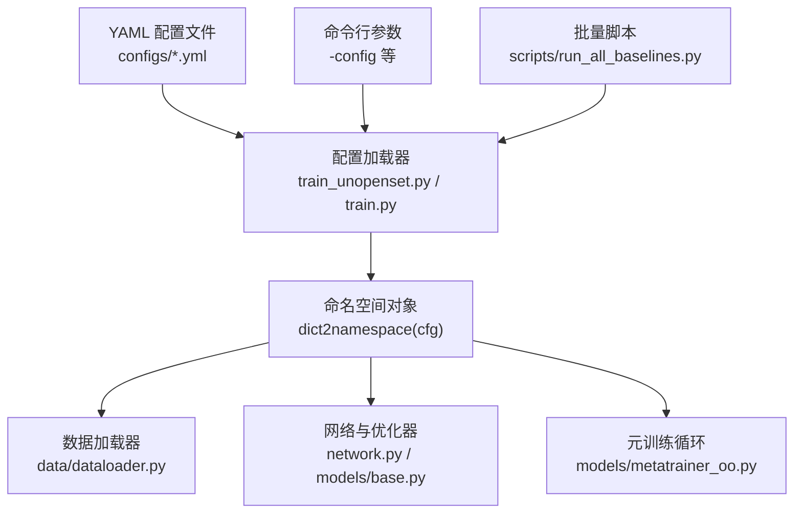
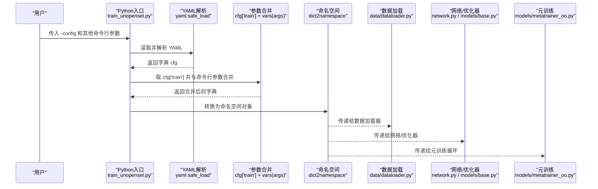
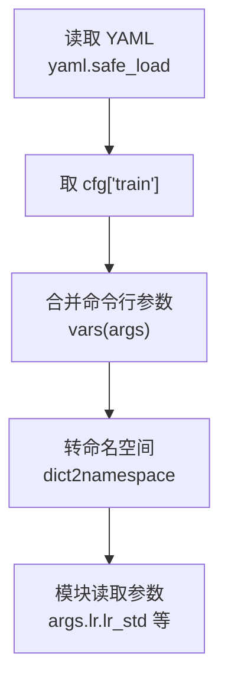
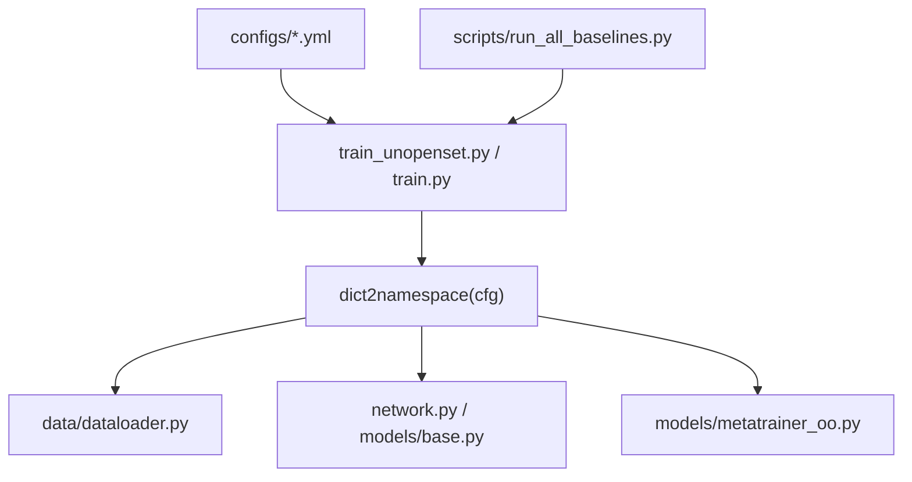

# 配置系统

<cite>
**本文引用的文件**
- [configs/default.yml](file://configs/default.yml)
- [configs/mid_eval.yml](file://configs/mid_eval.yml)
- [configs/quick_eval.yml](file://configs/quick_eval.yml)
- [train_unopenset.py](file://train_unopenset.py)
- [train.py](file://train.py)
- [scripts/run_all_baselines.py](file://scripts/run_all_baselines.py)
- [docs/module_overview.md](file://docs/module_overview.md)
- [docs/experiment_plan_and_baselines.md](file://docs/experiment_plan_and_baselines.md)
- [data/dataloader.py](file://data/dataloader.py)
- [network.py](file://network.py)
- [models/base.py](file://models/base.py)
- [models/metatrainer_oo.py](file://models/metatrainer_oo.py)
</cite>

## 目录
1. [简介](#简介)
2. [项目结构](#项目结构)
3. [核心组件](#核心组件)
4. [架构总览](#架构总览)
5. [详细组件分析](#详细组件分析)
6. [依赖关系分析](#依赖关系分析)
7. [性能考量](#性能考量)
8. [故障排查指南](#故障排查指南)
9. [结论](#结论)
10. [附录](#附录)

## 简介
本文件系统化梳理 VAZE 项目的配置系统，围绕 YAML 配置文件的结构与语法规则、训练参数、数据集配置、模型超参数与实验设置进行逐项说明，并给出不同实验场景的配置模板与最佳实践、配置优先级与覆盖机制、配置验证与错误处理建议，以及配置优化与调参建议，帮助用户根据具体需求定制实验。

## 项目结构
VAZE 的配置系统以 YAML 文件为核心，配合命令行参数解析与运行时合并，形成“配置文件 + 命令行参数”的双通道配置体系。主要文件与职责如下：
- 配置文件：位于 configs/ 目录，提供三套典型场景模板（默认、中等评估、快速评估）
- 训练入口：train_unopenset.py、train.py 等脚本负责加载 YAML 并与命令行参数合并
- 数据加载：data/dataloader.py 读取配置中的数据相关参数
- 网络与优化：network.py、models/base.py、models/metatrainer_oo.py 读取配置中的学习率、调度器、优化器等参数
- 批量对比：scripts/run_all_baselines.py 提供最小化参数加载示例，便于理解配置映射

图表来源
- [configs/default.yml](file://configs/default.yml)
- [train_unopenset.py](file://train_unopenset.py)
- [train.py](file://train.py)
- [data/dataloader.py](file://data/dataloader.py)
- [network.py](file://network.py)
- [models/base.py](file://models/base.py)
- [models/metatrainer_oo.py](file://models/metatrainer_oo.py)
- [scripts/run_all_baselines.py](file://scripts/run_all_baselines.py)

章节来源
- [configs/default.yml](file://configs/default.yml)
- [configs/mid_eval.yml](file://configs/mid_eval.yml)
- [configs/quick_eval.yml](file://configs/quick_eval.yml)
- [train_unopenset.py](file://train_unopenset.py)
- [train.py](file://train.py)
- [scripts/run_all_baselines.py](file://scripts/run_all_baselines.py)

## 核心组件
- YAML 配置文件：提供训练、学习率、调度器、优化器、网络、策略、episode、dataloader、stdu、extractor 等分组参数
- 命令行参数：通过 -config 指定 YAML 路径，其他参数覆盖 YAML 中对应字段
- 参数合并：yaml.safe_load + cfg['train'] + vars(args) + dict2namespace
- 参数读取：各模块通过 args.xxx.xxx 读取嵌套参数（如 args.lr.lr_std、args.scheduler.schedule）

章节来源
- [configs/default.yml](file://configs/default.yml)
- [train_unopenset.py](file://train_unopenset.py)
- [train.py](file://train.py)
- [scripts/run_all_baselines.py](file://scripts/run_all_baselines.py)

## 架构总览
下图展示从 YAML 到运行时参数的转换路径，以及参数在训练流水线中的使用位置。

图表来源
- [train_unopenset.py](file://train_unopenset.py)
- [configs/default.yml](file://configs/default.yml)
- [data/dataloader.py](file://data/dataloader.py)
- [network.py](file://network.py)
- [models/base.py](file://models/base.py)
- [models/metatrainer_oo.py](file://models/metatrainer_oo.py)

## 详细组件分析

### YAML 配置文件结构与参数说明
YAML 文件采用分组组织，常见分组包括 train、epochs、lr、scheduler、optimizer、network、strategy、episode、dataloader、stdu、extractor 等。以下为关键参数的分类说明与含义（基于 default.yml 的字段）：

- 训练基础参数（train.*）
  - way、shot：基准会话的 Few-Shot 设置（way 表示类别数，shot 表示每类样本数）
  - num_session：增量会话总数
  - num_base、num_novel、num_all：基础类、新类、总类数
  - start_session：起始会话编号
  - test_times：评估轮次
  - seq_sample：是否顺序采样
  - tmp_train：是否使用临时训练集合
  - feat_dim：特征维度
  - save_dir：模型与中间结果保存目录
  - seed：随机种子
  - n_ways、n_open_ways、n_shots、n_queries、n_test_runs、n_train_runs、train_classes：元训练与测试相关参数
  - epochs.*：标准训练、元训练、增量基础、增量新类等阶段的训练轮数
  - lr.*：标准训练、增量基础编码器、图注意力、增量新类等学习率；lr_decay_rate、lr_decay_epochs
  - scheduler：schedule（Step/Milestone）、milestones、step、gamma
  - optimizer：decay（权重衰减）、momentum（动量）
  - network：temperature（温度缩放）、base_mode、new_mode
  - strategy：data_init、set_no_val、seq_sample
  - episode：train_episode、episode_way、episode_shot、episode_query、low_way、low_shot
  - dataloader：num_workers、train_batch_size、test_batch_size
  - stdu：num_tmpb、num_tmpi、num_tmps、num_incre、pqa、ap.*、anchor.*、proto.*
  - extractor：sample_rate、window_size、hop_size、mel_bins、fmin、fmax、window

章节来源
- [configs/default.yml](file://configs/default.yml)
- [configs/mid_eval.yml](file://configs/mid_eval.yml)
- [configs/quick_eval.yml](file://configs/quick_eval.yml)

### 训练参数与实验设置
- 会话与 Few-Shot 设计：通过 way、shot、num_session、num_base、num_novel 控制实验规模与增量节奏
- 训练轮数：epochs_std（标准预训练）、epochs_meta（元训练）、epochs_stdu_base（增量基础阶段）、epochs_new（增量新类阶段）
- 评估与指标：n_test_runs、n_train_runs、test_times；输出包含已知/未知准确率、F1、增量/全部准确率、AA、PD 等
- 课程与稳定性：scheduler（Step/Milestone）、milestones、step、gamma；optimizer（decay、momentum）共同影响收敛稳定性

章节来源
- [configs/default.yml](file://configs/default.yml)
- [docs/module_overview.md](file://docs/module_overview.md)

### 数据集配置与数据加载
- 数据集选择：dataset、dataroot
- 数据加载器：num_workers、train_batch_size、test_batch_size；episode 采样器参数（episode_way、episode_shot、episode_query、low_way、low_shot）
- 临时训练集合：tmp_train 下的 num_tmpb、num_tmpi、num_tmps、num_incre 影响基础类与增量类划分
- 分组加载：get_base_dataloader_stdu、get_know_dataloader、get_unknow_dataloader 等函数依据配置选择数据集与采样策略

章节来源
- [configs/default.yml](file://configs/default.yml)
- [data/dataloader.py](file://data/dataloader.py)

### 模型超参数与优化策略
- 学习率族：lr_std（标准训练）、lr_stdu_base（增量基础编码器）、lrg（图注意力）、lr_new（增量新类）、lr_decay_rate、lr_decay_epochs
- 调度策略：scheduler.schedule（Step 或 Milestone），Step 时使用 step、gamma；Milestone 时使用 milestones、gamma
- 优化器：SGD，momentum、weight_decay
- 网络头部：network.temperature、base_mode、new_mode（ft_dot、ft_cos、avg_cos）
- 不确定性与原型：stdu.proto.type（mmt/res）、ap.*、anchor.* 等

章节来源
- [configs/default.yml](file://configs/default.yml)
- [network.py](file://network.py)
- [models/base.py](file://models/base.py)
- [models/metatrainer_oo.py](file://models/metatrainer_oo.py)

### 音频特征提取器参数
- extractor：sample_rate、window_size、hop_size、mel_bins、fmin、fmax、window
- 用于构建音频前端（如 Mel 频谱），影响特征维度与计算成本

章节来源
- [configs/default.yml](file://configs/default.yml)

### 配置模板与最佳实践
- 默认模板（default.yml）：适用于常规实验，提供稳定的 Few-Shot 与增量设置
- 中等评估模板（mid_eval.yml）：降低 test_times，缩短评估周期
- 快速评估模板（quick_eval.yml）：减少 num_session 与 test_times，适合快速迭代
- 最佳实践建议：
  - 固定 seed 并在训练前打印随机性检查结果，确保可复现
  - 根据硬件资源调整 dataloader.num_workers 与 batch_size
  - 逐步调整 lr 与 scheduler，观察元训练与增量阶段的稳定性
  - 在增量新类阶段适当降低学习率，避免灾难性遗忘

章节来源
- [configs/default.yml](file://configs/default.yml)
- [configs/mid_eval.yml](file://configs/mid_eval.yml)
- [configs/quick_eval.yml](file://configs/quick_eval.yml)
- [docs/experiment_plan_and_baselines.md](file://docs/experiment_plan_and_baselines.md)

### 配置优先级与覆盖机制
- 加载顺序：YAML → cfg['train'] → 命令行参数 → dict2namespace
- 覆盖规则：命令行参数覆盖 YAML 中同名字段；未指定的字段保留 YAML 值
- 嵌套参数访问：通过 args.xxx.yyy 读取（如 args.lr.lr_std、args.scheduler.schedule）

图表来源
- [train_unopenset.py](file://train_unopenset.py)
- [train.py](file://train.py)
- [scripts/run_all_baselines.py](file://scripts/run_all_baselines.py)

章节来源
- [train_unopenset.py](file://train_unopenset.py)
- [train.py](file://train.py)
- [scripts/run_all_baselines.py](file://scripts/run_all_baselines.py)

### 配置验证与错误处理
- 随机性一致性：set_seed 与 check_randomness 用于固定随机源，验证可复现性
- 设备与参数一致性：在模型与模块内部检查设备一致性，避免跨设备错误
- 建议的验证步骤：
  - 在启动时打印关键参数（如 lr、batch_size、num_session、seed）
  - 对异常输入（如学习率过小/过大、batch_size过大导致显存不足）进行边界检查
  - 在数据加载阶段确认 dataset、dataroot、num_workers、batch_size 配置一致

章节来源
- [train_unopenset.py](file://train_unopenset.py)
- [train.py](file://train.py)
- [utils/utils.py](file://utils/utils.py)

### 配置优化与调参建议
- 学习率与调度：先用较大的标准训练学习率，再在增量阶段下调；Step 调度适合粗粒度控制，Milestone 更灵活
- 批大小与并行：num_workers 与 batch_size 需平衡内存占用与吞吐；大 batch_size 可提升稳定性但需显存支持
- Few-Shot 与会话：way/shot 与 num_session 影响模型增量压力；可先用较小的 way/shot 稳定基线
- 温度与分类头：temperature 与 new_mode（ft_cos/avg_cos）影响开放集判别能力
- 不确定性与原型：根据任务需求启用 ap、anchor、proto 等策略，结合 num_session 逐步引入

章节来源
- [configs/default.yml](file://configs/default.yml)
- [network.py](file://network.py)
- [models/base.py](file://models/base.py)
- [models/metatrainer_oo.py](file://models/metatrainer_oo.py)

## 依赖关系分析
配置系统在多个模块之间建立松耦合依赖，通过统一的命名空间对象传递参数，降低模块间的直接耦合。

图表来源
- [configs/default.yml](file://configs/default.yml)
- [train_unopenset.py](file://train_unopenset.py)
- [train.py](file://train.py)
- [data/dataloader.py](file://data/dataloader.py)
- [network.py](file://network.py)
- [models/base.py](file://models/base.py)
- [models/metatrainer_oo.py](file://models/metatrainer_oo.py)
- [scripts/run_all_baselines.py](file://scripts/run_all_baselines.py)

章节来源
- [configs/default.yml](file://configs/default.yml)
- [train_unopenset.py](file://train_unopenset.py)
- [train.py](file://train.py)
- [data/dataloader.py](file://data/dataloader.py)
- [network.py](file://network.py)
- [models/base.py](file://models/base.py)
- [models/metatrainer_oo.py](file://models/metatrainer_oo.py)
- [scripts/run_all_baselines.py](file://scripts/run_all_baselines.py)

## 性能考量
- 数据加载：num_workers 与 batch_size 的组合直接影响吞吐；建议在 CPU 核数与 GPU 显存之间折中
- 学习率与调度：合适的调度策略可显著提升收敛速度与稳定性
- 增量阶段：增量新类学习率通常低于标准训练，有助于稳定基类知识
- 日志与保存：合理设置 save_dir 与评估轮次，避免频繁 IO 影响性能

## 故障排查指南
- 随机性问题：若结果不可复现，检查 seed 设置与 CUDA 确定性后端配置
- 设备不一致：模块内部有设备一致性检查，若报错需确保所有张量在同一设备
- 学习率异常：若损失不降或爆炸，尝试降低学习率或调整调度策略
- 数据加载异常：确认 dataset、dataroot、num_workers、batch_size 配置与实际环境匹配

章节来源
- [train_unopenset.py](file://train_unopenset.py)
- [train.py](file://train.py)
- [utils/utils.py](file://utils/utils.py)

## 结论
VAZE 的配置系统以 YAML 为中心，结合命令行参数实现灵活可控的实验设置。通过明确的分组与参数命名规范、清晰的优先级与覆盖机制、以及在数据加载、网络优化与元训练中的统一接入，用户可以高效地定制不同实验场景。建议在正式实验前完成参数验证与边界检查，并根据硬件条件与任务复杂度逐步微调关键超参数。

## 附录
- 实验计划与基线：参考实验计划文档，确保方法组、公平设置与核心表格的一致性
- 模块概览：了解主流程脚本、网络与方法模块、数据与采样、评测与指标输出

章节来源
- [docs/experiment_plan_and_baselines.md](file://docs/experiment_plan_and_baselines.md)
- [docs/module_overview.md](file://docs/module_overview.md)