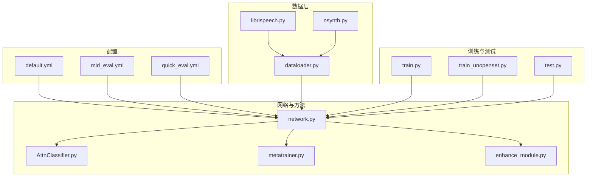
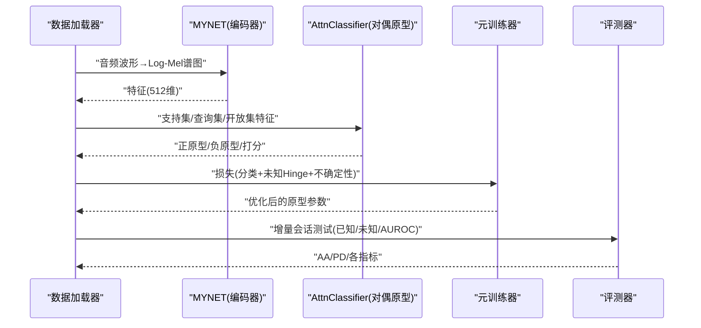
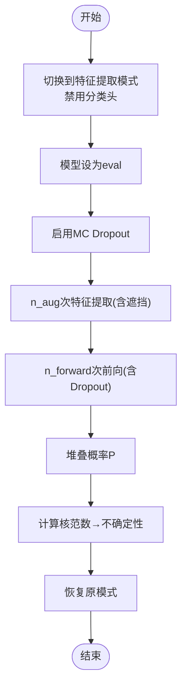
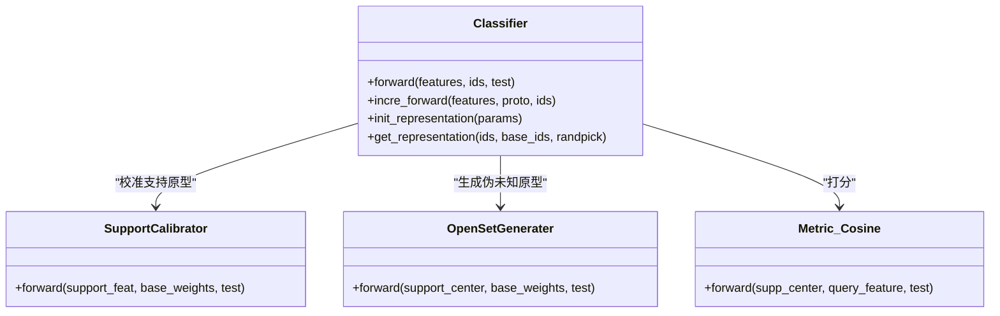
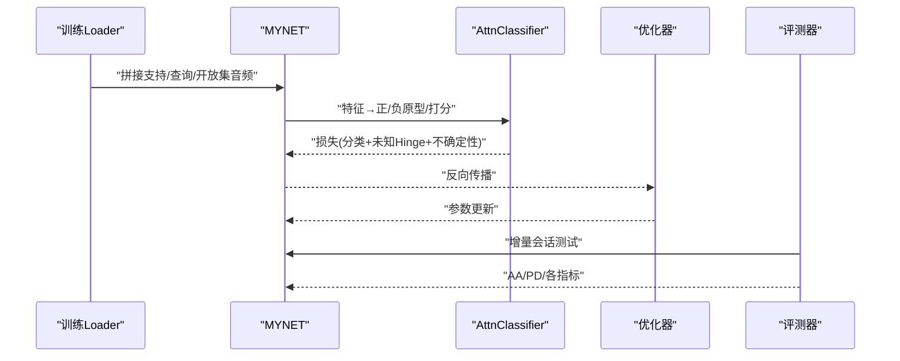
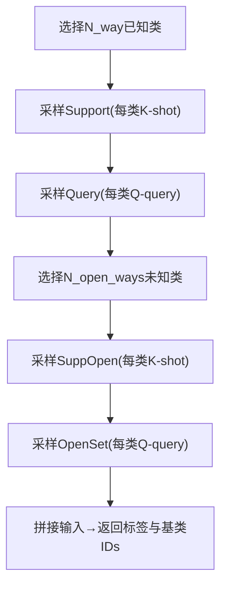
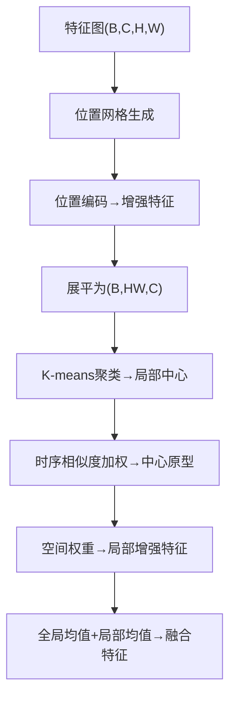
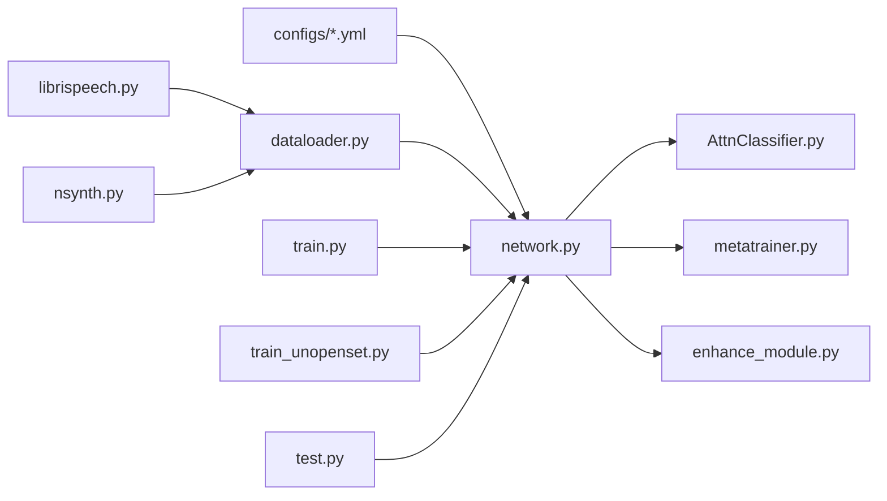

# 应用场景

<cite>
**本文引用的文件**   
- [docs/experiment_plan_and_baselines.md](file://docs/experiment_plan_and_baselines.md)
- [docs/module_overview.md](file://docs/module_overview.md)
- [configs/default.yml](file://configs/default.yml)
- [configs/mid_eval.yml](file://configs/mid_eval.yml)
- [configs/quick_eval.yml](file://configs/quick_eval.yml)
- [network.py](file://network.py)
- [models/AttnClassifier.py](file://models/AttnClassifier.py)
- [models/metatrainer.py](file://models/metatrainer.py)
- [data/dataloader.py](file://data/dataloader.py)
- [data/librispeech.py](file://data/librispeech.py)
- [data/nsynth.py](file://data/nsynth.py)
- [enhance_module.py](file://enhance_module.py)
- [test.py](file://test.py)
- [train_unopenset.py](file://train_unopenset.py)
- [train.py](file://train.py)
- [center_shifts.csv](file://center_shifts.csv)
- [center_shifts_10.csv](file://center_shifts_10.csv)
</cite>

## 目录
1. [简介](#简介)
2. [项目结构](#项目结构)
3. [核心组件](#核心组件)
4. [架构总览](#架构总览)
5. [详细组件分析](#详细组件分析)
6. [依赖关系分析](#依赖关系分析)
7. [性能考量](#性能考量)
8. [故障排查指南](#故障排查指南)
9. [结论](#结论)
10. [附录](#附录)

## 简介
VAZE系统是一个面向音频的开放世界持续学习框架，结合对偶原型元训练、不确定性估计与原型校准，实现对已知类的高精度分类与对未知类的稳健拒绝。系统支持多种音频数据集（如LibriSpeech、NSynth等），并提供统一的增量会话评测流程与公平对比实验设置。本文档聚焦VAZE在不同音频领域的真实应用场景，给出需求特点、技术挑战、解决方案、实施指南、实验结果与局限性说明，帮助不同背景用户正确评估与落地。

## 项目结构
- 文档与模块概览：docs/module_overview.md、docs/experiment_plan_and_baselines.md
- 配置：configs/default.yml、configs/mid_eval.yml、configs/quick_eval.yml
- 网络与方法：network.py、models/AttnClassifier.py、models/metatrainer.py
- 数据与采样：data/dataloader.py、data/librispeech.py、data/nsynth.py
- 特征增强：enhance_module.py
- 训练与测试入口：train.py、train_unopenset.py、test.py
- 结果与指标：多个save_result/*.txt与center_shifts*.csv

图表来源
- [configs/default.yml:1-88](file://configs/default.yml#L1-L88)
- [data/dataloader.py:1-351](file://data/dataloader.py#L1-L351)
- [network.py:1-724](file://network.py#L1-L724)
- [models/AttnClassifier.py:1-369](file://models/AttnClassifier.py#L1-L369)
- [models/metatrainer.py:1-201](file://models/metatrainer.py#L1-L201)
- [enhance_module.py:1-160](file://enhance_module.py#L1-L160)
- [train.py:1-800](file://train.py#L1-L800)
- [train_unopenset.py](file://train_unopenset.py)
- [test.py:1-800](file://test.py#L1-L800)

章节来源
- [docs/module_overview.md:1-51](file://docs/module_overview.md#L1-L51)
- [configs/default.yml:1-88](file://configs/default.yml#L1-L88)
- [data/dataloader.py:1-351](file://data/dataloader.py#L1-L351)

## 核心组件
- 主干网络MYNET：Log-Mel前端 + ResNet18编码 + 余弦分类头；支持openmeta模式与增量推理模式；提供不确定性估计接口。
- 对偶原型分类器AttnClassifier：支持集校准、未知原型生成、余弦度量打分；支持语义融合与注意力聚合。
- 元训练引擎metatrainer：在openmeta模式下进行已知/未知联合优化，输出闭集准确率与AUROC。
- 数据加载与采样：支持多数据集协议、episode采样、已知/未知/开放集划分。
- 特征增强模块：局部特征聚类与空间位置编码，提升特征判别力与鲁棒性。
- 不确定性估计：MC Dropout + 多视角特征变换，用于无标注样本的不确定性量化。

章节来源
- [network.py:18-518](file://network.py#L18-L518)
- [models/AttnClassifier.py:39-118](file://models/AttnClassifier.py#L39-L118)
- [models/metatrainer.py:17-178](file://models/metatrainer.py#L17-L178)
- [data/dataloader.py:19-351](file://data/dataloader.py#L19-L351)
- [enhance_module.py:70-160](file://enhance_module.py#L70-L160)

## 架构总览
VAZE采用“特征提取-原型校准-未知生成-度量打分”的流水线。训练阶段在openmeta模式下联合优化已知分类与未知拒绝；测试阶段在incre模式下进行增量分类与未知拒绝评估。系统通过谱图增强、不确定性估计与原型动态更新，实现跨会话的稳定泛化。

图表来源
- [network.py:102-151](file://network.py#L102-L151)
- [models/AttnClassifier.py:47-93](file://models/AttnClassifier.py#L47-L93)
- [models/metatrainer.py:87-178](file://models/metatrainer.py#L87-L178)

## 详细组件分析

### 组件A：MYNET（主干网络与不确定性估计）
- 功能要点
  - 音频前端：STFT + Logmel滤波器组，批归一化与SpecAugment。
  - 编码器：ResNet18，输出空间特征图，经自适应池化降维至512维。
  - 分类头：余弦分类器，温度缩放，支持ft_cos/ft_dot模式。
  - 不确定性估计：MC Dropout模式下多次前向，计算概率核范数作为不确定性度量。
  - 开集元训练：open_forward中计算正/负原型与Hinge损失，动态标签分配。
- 关键流程图（不确定性估计）

图表来源
- [network.py:50-101](file://network.py#L50-L101)

章节来源
- [network.py:18-518](file://network.py#L18-L518)

### 组件B：AttnClassifier（对偶原型与未知生成）
- 功能要点
  - SupportCalibrator：支持集特征与基类原型的语义/视觉融合校准。
  - OpenSetGenerater：基于支持原型与基类原型生成伪未知原型。
  - Metric_Cosine：余弦相似度打分，温度可学习。
- 关键类图

图表来源
- [models/AttnClassifier.py:39-118](file://models/AttnClassifier.py#L39-L118)
- [models/AttnClassifier.py:188-271](file://models/AttnClassifier.py#L188-L271)
- [models/AttnClassifier.py:352-369](file://models/AttnClassifier.py#L352-L369)

章节来源
- [models/AttnClassifier.py:1-369](file://models/AttnClassifier.py#L1-L369)

### 组件C：元训练流程（metatrainer）
- 功能要点
  - 加载预训练特征权重，初始化分类器原型表示。
  - openmeta模式下联合优化分类交叉熵、未知Hinge损失与不确定性损失。
  - 评测闭集准确率与AUROC，记录最佳模型。
- 关键序列图

图表来源
- [models/metatrainer.py:17-178](file://models/metatrainer.py#L17-L178)
- [network.py:102-151](file://network.py#L102-L151)

章节来源
- [models/metatrainer.py:1-201](file://models/metatrainer.py#L1-L201)

### 组件D：数据加载与采样（多数据集协议）
- 功能要点
  - 支持LibriSpeech、NSynth、FMC等数据集，统一训练/验证/测试划分。
  - episode采样：支持/查询/开放集三段式，支持已知/未知类别分离。
  - CurriculumMetaDataset：按难度分层的课程式采样（易/中/难）。
- 关键流程图（Episode构建）

图表来源
- [data/dataloader.py:263-346](file://data/dataloader.py#L263-L346)
- [data/librispeech.py:149-261](file://data/librispeech.py#L149-L261)
- [data/nsynth.py:222-272](file://data/nsynth.py#L222-L272)

章节来源
- [data/dataloader.py:1-351](file://data/dataloader.py#L1-L351)
- [data/librispeech.py:1-278](file://data/librispeech.py#L1-L278)
- [data/nsynth.py:1-287](file://data/nsynth.py#L1-L287)

### 组件E：特征增强（局部聚类与位置编码）
- 功能要点
  - LocalFeatureCluster：对特征图进行K-means聚类，生成局部中心并加权融合全局特征。
  - EnhancedPositionEncoder：对时间/频率位置进行编码并动态融合。
  - FeatureFusion：基于MLP预测融合权重，实现全局-局部特征的自适应融合。
- 关键流程图（特征增强）

图表来源
- [enhance_module.py:70-160](file://enhance_module.py#L70-L160)

章节来源
- [enhance_module.py:1-160](file://enhance_module.py#L1-L160)

## 依赖关系分析
- 配置驱动：configs/*.yml统一控制训练轮数、学习率、采样方式、数据增强参数。
- 数据依赖：dataloader.py依赖各数据集实现（librispeech.py、nsynth.py），提供episode采样与课程采样。
- 模块耦合：network.py依赖AttnClassifier进行原型生成与打分；metatrainer.py驱动openmeta训练；test.py提供增量测试与不确定性估计。
- 外部依赖：torchaudio、torchlibrosa、sklearn、tqdm等。

图表来源
- [configs/default.yml:1-88](file://configs/default.yml#L1-L88)
- [data/dataloader.py:1-351](file://data/dataloader.py#L1-L351)
- [network.py:1-724](file://network.py#L1-L724)
- [models/AttnClassifier.py:1-369](file://models/AttnClassifier.py#L1-L369)
- [models/metatrainer.py:1-201](file://models/metatrainer.py#L1-L201)
- [enhance_module.py:1-160](file://enhance_module.py#L1-L160)
- [train.py:1-800](file://train.py#L1-L800)
- [train_unopenset.py](file://train_unopenset.py)
- [test.py:1-800](file://test.py#L1-L800)

章节来源
- [docs/module_overview.md:9-29](file://docs/module_overview.md#L9-L29)
- [configs/default.yml:1-88](file://configs/default.yml#L1-L88)

## 性能考量
- 训练稳定性：使用余弦分类器与温度缩放，有助于稳定原型学习；SpecAugment与Dropout降低过拟合风险。
- 不确定性估计：MC Dropout + 多视角特征变换，适合无标注样本的不确定性量化；注意计算开销。
- 原型更新：支持集校准与未知原型生成的语义/视觉融合，提升边界判别能力。
- 评测指标：AA（平均准确率）、PD（性能下降）、AUROC（未知拒绝能力）等综合评估。

## 故障排查指南
- 随机性与可复现：检查随机种子设置与Deterministic算法开关，确保结果可复现。
- 设备一致性：确保增强模块与模型在同一设备上，避免张量设备不一致导致的错误。
- 数据路径与标签：确认数据集CSV路径与标签映射正确，避免类别索引越界。
- 不确定性估计异常：检查MC Dropout模式切换与遮挡增强开关，确保在评估时关闭分类头。

章节来源
- [train.py:114-134](file://train.py#L114-L134)
- [test.py:37-85](file://test.py#L37-L85)
- [data/librispeech.py:31-71](file://data/librispeech.py#L31-L71)
- [data/nsynth.py:31-98](file://data/nsynth.py#L31-L98)

## 结论
VAZE系统通过“对偶原型+不确定性+课程采样”的组合，在音频持续学习场景中实现了稳健的已知分类与未知拒绝。其模块化设计便于扩展到更多数据集与任务，同时提供统一的评测指标与公平对比设置。建议在实际部署中关注数据质量、设备一致性与不确定性阈值调优，以获得更稳定的性能表现。

## 附录

### A. 应用场景与实施指南

- 场景一：音频分类（已知类）
  - 需求特点：明确的类别集合，追求高闭集准确率与低遗忘。
  - 技术挑战：类别不平衡、长尾分布、跨会话域迁移。
  - 解决方案：余弦分类器+温度缩放、支持集校准、增量微调。
  - 实施步骤
    - 数据准备：使用dataloader.py提供的数据集接口，选择目标数据集（如LibriSpeech）。
    - 模型训练：运行元训练流程（metatrainer），在openmeta模式下联合优化。
    - 增量测试：在incre模式下进行增量会话测试，记录AA/PD。
  - 参考文件
    - [data/dataloader.py:19-168](file://data/dataloader.py#L19-L168)
    - [models/metatrainer.py:17-178](file://models/metatrainer.py#L17-L178)
    - [network.py:102-151](file://network.py#L102-L151)

- 场景二：语音识别（受限词汇）
  - 需求特点：限定词汇表，强调鲁棒性与实时性。
  - 技术挑战：噪声干扰、说话人变化、词汇外词。
  - 解决方案：谱图增强+不确定性估计，未知词拒绝。
  - 实施步骤
    - 数据准备：准备受限词汇的训练/验证/测试集。
    - 不确定性评估：使用test.py中的不确定性估计接口，对未知样本进行拒绝。
    - 部署：在推理阶段启用未知拒绝阈值。
  - 参考文件
    - [test.py:37-85](file://test.py#L37-L85)
    - [enhance_module.py:70-160](file://enhance_module.py#L70-L160)

- 场景三：音乐分类（乐器/风格）
  - 需求特点：乐器类别多、风格变化丰富。
  - 技术挑战：乐器相似度高、风格混叠。
  - 解决方案：语义融合校准+未知原型生成，提升边界判别。
  - 实施步骤
    - 数据准备：使用NSynth数据集接口，划分已知/未知类别。
    - 训练：在openmeta模式下进行元训练，评测AUROC。
  - 参考文件
    - [data/nsynth.py:21-98](file://data/nsynth.py#L21-L98)
    - [models/AttnClassifier.py:121-185](file://models/AttnClassifier.py#L121-L185)

- 场景四：环境声音监测（事件检测）
  - 需求特点：实时监测、快速拒绝未知事件。
  - 技术挑战：背景噪声、事件稀疏、类别扩展。
  - 解决方案：课程采样+不确定性估计，渐进式类别扩展。
  - 实施步骤
    - 数据准备：构建课程式数据集（易/中/难）。
    - 训练：使用CurriculumMetaDataset进行课程训练。
    - 测试：记录AA/PD与AUROC，评估扩展性能。
  - 参考文件
    - [data/dataloader.py:263-346](file://data/dataloader.py#L263-L346)

### B. 实验与结果示例
- 对比实验执行清单与公平设置
  - 方法组：FSCIL-only、OSR-only、Open-world、Ours-Base、Ours-Full。
  - 公平设置：统一backbone、数据协议、种子、评测轮数。
  - 关键结论：Ours-Full在AA Unknown与AA F1上优于FSCIL-only；在PD Known上优于OSR-only。
- 指标输出
  - Session级：Known Acc、Unknown Acc、F1、Incremental Acc、All Acc。
  - 汇总级：AA（4个增量session的平均值）、PD（Session1-Session4的性能下降）。
- 参考文件
  - [docs/experiment_plan_and_baselines.md:1-30](file://docs/experiment_plan_and_baselines.md#L1-L30)
  - [docs/module_overview.md:44-51](file://docs/module_overview.md#L44-L51)

### C. 配置与部署要点
- 训练配置
  - 训练轮数、学习率、调度策略、优化器参数由configs/*.yml统一管理。
  - 推荐先在quick_eval.yml上进行小规模验证，再切换到default.yml进行完整训练。
- 数据准备
  - 确认数据集CSV路径与类别映射，避免标签不一致。
  - 使用dataloader.py提供的采样器，确保episode构造符合预期。
- 部署与性能优化
  - 推理阶段建议使用余弦分类器与温度缩放，减少显存占用。
  - 不确定性估计可在GPU上批量执行，注意内存峰值。
- 参考文件
  - [configs/default.yml:1-88](file://configs/default.yml#L1-L88)
  - [configs/mid_eval.yml:1-88](file://configs/mid_eval.yml#L1-L88)
  - [configs/quick_eval.yml:1-88](file://configs/quick_eval.yml#L1-L88)
  - [data/dataloader.py:19-351](file://data/dataloader.py#L19-L351)

### D. 局限性与适用边界
- 局限性
  - 对偶原型依赖支持集质量，小样本场景需谨慎。
  - 不确定性估计依赖Dropout与遮挡增强，需平衡计算成本。
  - 未知拒绝效果受阈值影响，需结合业务场景调优。
- 适用边界
  - 更适用于类别相对稳定、谱图特征显著的音频任务。
  - 对于极端噪声或严重域偏移的任务，建议结合更强的预训练与领域自适应策略。