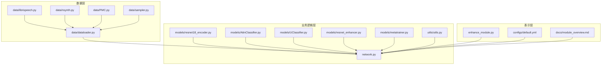
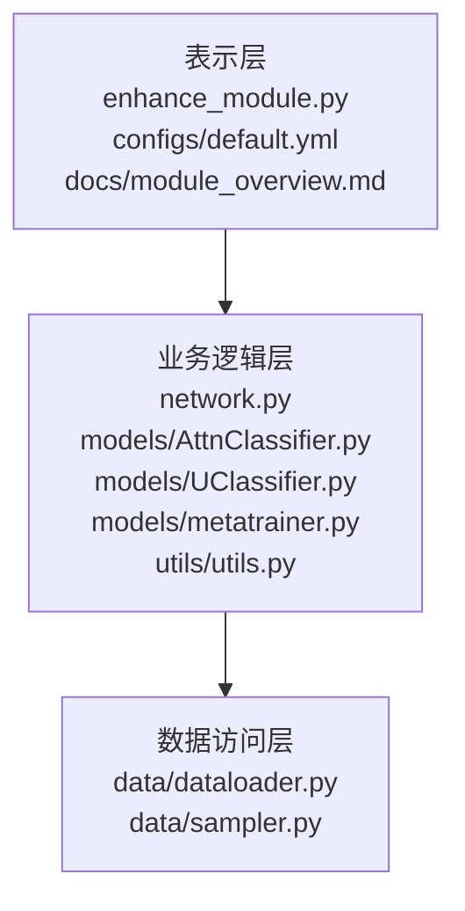
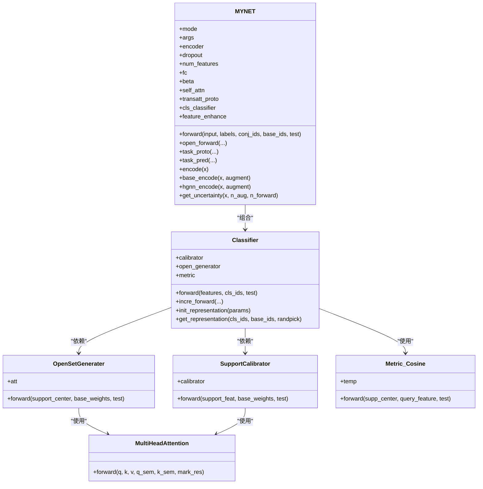
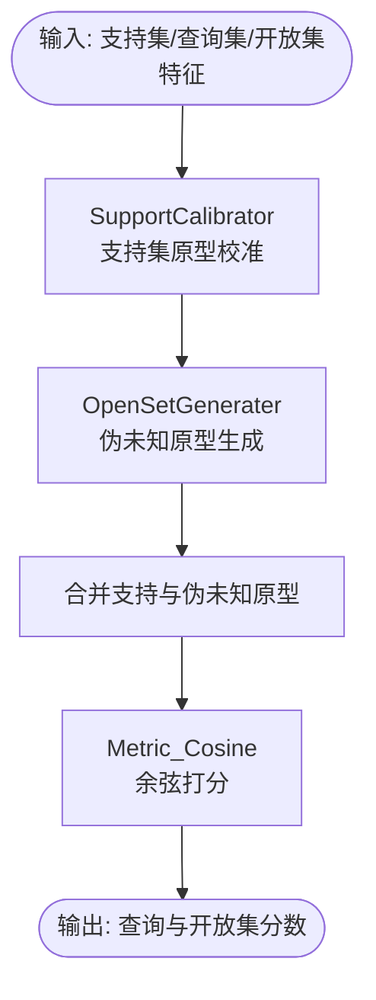
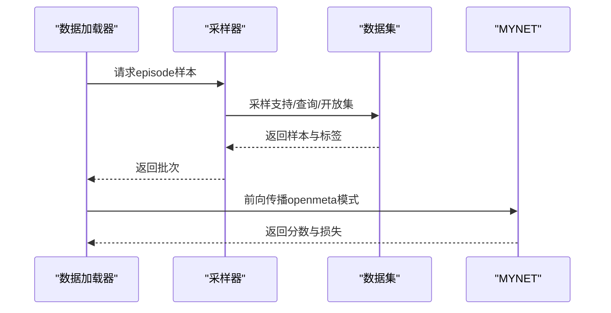
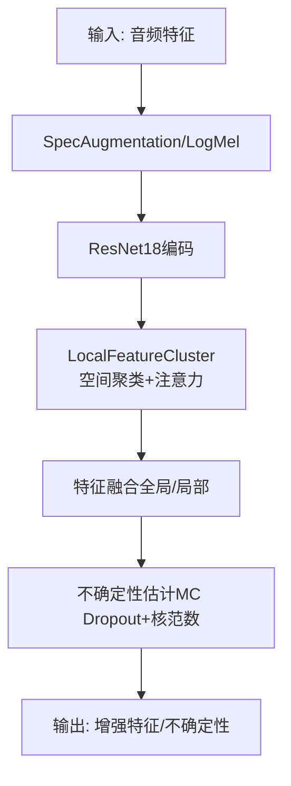
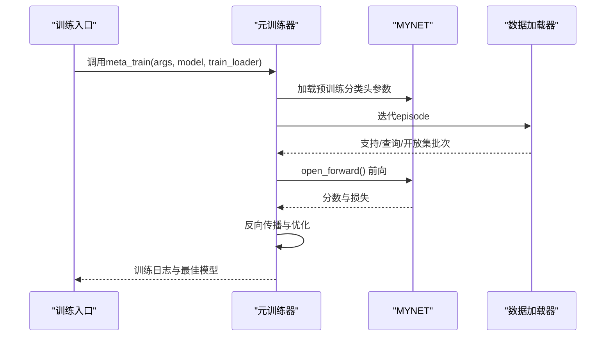
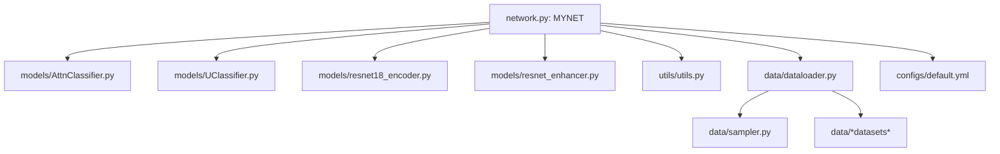

# 技术架构

<cite>
**本文档引用的文件**
- [network.py](file://network.py)
- [models/base.py](file://models/base.py)
- [models/AttnClassifier.py](file://models/AttnClassifier.py)
- [models/UClassifier.py](file://models/UClassifier.py)
- [models/resnet18_encoder.py](file://models/resnet18_encoder.py)
- [models/resnet_enhancer.py](file://models/resnet_enhancer.py)
- [data/dataloader.py](file://data/dataloader.py)
- [utils/utils.py](file://utils/utils.py)
- [enhance_module.py](file://enhance_module.py)
- [configs/default.yml](file://configs/default.yml)
- [docs/module_overview.md](file://docs/module_overview.md)
- [models/metatrainer.py](file://models/metatrainer.py)
- [train.py](file://train.py)
</cite>

## 目录
1. [简介](#简介)
2. [项目结构](#项目结构)
3. [核心组件](#核心组件)
4. [架构总览](#架构总览)
5. [详细组件分析](#详细组件分析)
6. [依赖关系分析](#依赖关系分析)
7. [性能考量](#性能考量)
8. [故障排查指南](#故障排查指南)
9. [结论](#结论)
10. [附录](#附录)

## 简介
VAZE系统是一个面向少样本开放集学习（Open-World Few-Shot Learning）的音频分类系统，采用元学习与原型对偶机制，结合注意力与不确定性估计，实现从音频输入到特征提取、原型构建、分类决策与增量学习的完整流水线。系统采用模块化设计，清晰分离数据访问层、业务逻辑层与表示层，便于扩展与维护。

## 项目结构
仓库采用按功能域划分的模块化组织方式：
- models：模型定义与分类器组件（编码器、注意力分类器、不确定性估计等）
- data：数据加载与采样器
- utils：通用工具与评估指标
- configs：训练配置
- scripts：可视化与分析脚本
- docs：模块概览与实验计划
- 根目录：训练入口与网络主干

**图表来源**
- [network.py:18-518](file://network.py#L18-L518)
- [models/AttnClassifier.py:38-120](file://models/AttnClassifier.py#L38-L120)
- [models/UClassifier.py:7-133](file://models/UClassifier.py#L7-L133)
- [models/resnet18_encoder.py:240-334](file://models/resnet18_encoder.py#L240-L334)
- [models/resnet_enhancer.py:51-160](file://models/resnet_enhancer.py#L51-L160)
- [data/dataloader.py:19-254](file://data/dataloader.py#L19-L254)
- [utils/utils.py:190-286](file://utils/utils.py#L190-L286)
- [enhance_module.py:14-160](file://enhance_module.py#L14-L160)
- [configs/default.yml:1-88](file://configs/default.yml#L1-L88)
- [docs/module_overview.md:1-51](file://docs/module_overview.md#L1-L51)

**章节来源**
- [docs/module_overview.md:1-51](file://docs/module_overview.md#L1-L51)

## 核心组件
- 网络主干MYNET：集成音频前端（STFT/LogMel）、ResNet18编码器、注意力与分类器模块，支持多种模式（编码、元训练、增量）。
- AttnClassifier/UClassifier：支持集原型校准、伪未知原型生成、余弦度量与不确定性估计。
- 数据加载与采样：支持多数据集与episode采样，提供基础与增量会话的数据流。
- 工具与评估：包含计数器、指标计算、日志与可视化工具。
- 配置系统：统一的训练超参与数据加载配置。

**章节来源**
- [network.py:18-518](file://network.py#L18-L518)
- [models/AttnClassifier.py:38-120](file://models/AttnClassifier.py#L38-L120)
- [models/UClassifier.py:7-133](file://models/UClassifier.py#L7-L133)
- [data/dataloader.py:19-254](file://data/dataloader.py#L19-L254)
- [utils/utils.py:190-286](file://utils/utils.py#L190-L286)
- [configs/default.yml:1-88](file://configs/default.yml#L1-L88)

## 架构总览
系统采用分层架构：
- 表示层：可视化与配置（enhance_module.py、configs/default.yml、docs/module_overview.md）
- 业务逻辑层：网络主干（network.py）、分类器（Attn/UClassifier）、元训练（metatrainer.py）、工具（utils/utils.py）
- 数据访问层：数据加载与采样（data/dataloader.py、data/sampler.py）

**图表来源**
- [network.py:18-518](file://network.py#L18-L518)
- [models/AttnClassifier.py:38-120](file://models/AttnClassifier.py#L38-L120)
- [models/UClassifier.py:7-133](file://models/UClassifier.py#L7-L133)
- [models/metatrainer.py:17-84](file://models/metatrainer.py#L17-L84)
- [utils/utils.py:190-286](file://utils/utils.py#L190-L286)
- [data/dataloader.py:19-254](file://data/dataloader.py#L19-L254)
- [enhance_module.py:14-160](file://enhance_module.py#L14-L160)
- [configs/default.yml:1-88](file://configs/default.yml#L1-L88)
- [docs/module_overview.md:1-51](file://docs/module_overview.md#L1-L51)

## 详细组件分析

### 网络主干MYNET
MYNET整合音频前端、ResNet18编码器与分类器模块，支持多模式前向传播：
- 音频前端：STFT与LogMel提取，SpecAugmentation增强，BN归一化。
- 编码器：ResNet18（可加载预训练权重），支持空间特征增强（LocalFeatureCluster）。
- 分类器：AttnClassifier/UClassifier（支持集校准、伪未知原型生成、余弦度量）。
- 不确定性估计：MC Dropout与核范数不确定性评分。
- 模式切换：encoder/openmeta/incre等模式用于不同阶段。

**图表来源**
- [network.py:18-518](file://network.py#L18-L518)
- [models/AttnClassifier.py:38-120](file://models/AttnClassifier.py#L38-L120)
- [models/AttnClassifier.py:121-185](file://models/AttnClassifier.py#L121-L185)
- [models/AttnClassifier.py:188-271](file://models/AttnClassifier.py#L188-L271)
- [models/AttnClassifier.py:274-367](file://models/AttnClassifier.py#L274-L367)

**章节来源**
- [network.py:18-518](file://network.py#L18-L518)
- [models/AttnClassifier.py:38-120](file://models/AttnClassifier.py#L38-L120)

### 分类器组件（Attn/UClassifier）
- SupportCalibrator：支持集特征与语义嵌入融合，通过多头注意力生成支持原型。
- OpenSetGenerater：基于支持原型与基类权重生成伪未知原型，支持多种聚合策略。
- Metric_Cosine：余弦相似度打分，温度参数可调。
- UClassifier：新增不确定性估计模块（MC Dropout、掩码增强、核范数不确定性）。

**图表来源**
- [models/AttnClassifier.py:38-120](file://models/AttnClassifier.py#L38-L120)
- [models/AttnClassifier.py:121-185](file://models/AttnClassifier.py#L121-L185)
- [models/AttnClassifier.py:188-271](file://models/AttnClassifier.py#L188-L271)
- [models/AttnClassifier.py:274-367](file://models/AttnClassifier.py#L274-L367)

**章节来源**
- [models/AttnClassifier.py:38-120](file://models/AttnClassifier.py#L38-L120)
- [models/UClassifier.py:7-133](file://models/UClassifier.py#L7-L133)

### 数据加载与采样
- get_dataloader/get_testloader：按会话返回训练/测试数据加载器。
- SupportsetSampler/TrueIncreTrainCategoriesSampler：episode采样策略，支持基础与增量会话。
- CurriculumMetaDataset：课程学习元数据集，按难度分层（已知/当前/未知）。

**图表来源**
- [data/dataloader.py:19-254](file://data/dataloader.py#L19-L254)
- [data/dataloader.py:263-351](file://data/dataloader.py#L263-L351)

**章节来源**
- [data/dataloader.py:19-254](file://data/dataloader.py#L19-L254)
- [data/dataloader.py:263-351](file://data/dataloader.py#L263-L351)

### 不确定性估计与特征增强
- MYNET.get_uncertainty：MC Dropout + 多视角特征 + 核范数不确定性评分。
- LocalFeatureCluster（resnet_enhancer.py）：基于KMeans的空间聚类与注意力融合，增强局部细节。
- enhance_module.py：位置编码、空间权重与动态融合，提升特征表达能力。

**图表来源**
- [network.py:486-518](file://network.py#L486-L518)
- [models/resnet_enhancer.py:51-160](file://models/resnet_enhancer.py#L51-L160)
- [enhance_module.py:70-160](file://enhance_module.py#L70-L160)

**章节来源**
- [network.py:486-518](file://network.py#L486-L518)
- [models/resnet_enhancer.py:51-160](file://models/resnet_enhancer.py#L51-L160)
- [enhance_module.py:70-160](file://enhance_module.py#L70-L160)

### 元训练与增量学习
- metatrainer.meta_train：加载预训练分类头参数，冻结特征提取器，仅训练分类器。
- train_unopenset（train.py）：基础会话训练、元训练、增量会话评测与指标汇总。

**图表来源**
- [models/metatrainer.py:17-84](file://models/metatrainer.py#L17-L84)
- [models/metatrainer.py:87-178](file://models/metatrainer.py#L87-L178)
- [train.py:799-800](file://train.py#L799-L800)

**章节来源**
- [models/metatrainer.py:17-84](file://models/metatrainer.py#L17-L84)
- [models/metatrainer.py:87-178](file://models/metatrainer.py#L87-L178)
- [train.py:799-800](file://train.py#L799-L800)

## 依赖关系分析
- 模块耦合：MYNET依赖Attn/UClassifier与ResNet18编码器；数据加载器依赖采样器与数据集协议。
- 外部依赖：PyTorch、NumPy、Scikit-learn、Matplotlib、TorchLibrosa等。
- 配置驱动：default.yml集中管理训练超参、数据加载与网络参数。

**图表来源**
- [network.py:18-518](file://network.py#L18-L518)
- [models/AttnClassifier.py:38-120](file://models/AttnClassifier.py#L38-L120)
- [models/UClassifier.py:7-133](file://models/UClassifier.py#L7-L133)
- [models/resnet18_encoder.py:240-334](file://models/resnet18_encoder.py#L240-L334)
- [models/resnet_enhancer.py:51-160](file://models/resnet_enhancer.py#L51-L160)
- [utils/utils.py:190-286](file://utils/utils.py#L190-L286)
- [data/dataloader.py:19-254](file://data/dataloader.py#L19-L254)
- [configs/default.yml:1-88](file://configs/default.yml#L1-L88)

**章节来源**
- [network.py:18-518](file://network.py#L18-L518)
- [data/dataloader.py:19-254](file://data/dataloader.py#L19-L254)
- [configs/default.yml:1-88](file://configs/default.yml#L1-L88)

## 性能考量
- 计算效率：ResNet18轻量化设计，注意力模块批内并行，减少冗余计算。
- 内存占用：动态聚类与注意力融合在GPU上完成，减少CPU-GPU频繁传输。
- 不确定性估计：MC Dropout与核范数在推理时可关闭，降低运行时开销。
- 数据加载：多worker并行与pin_memory提升I/O吞吐。

[本节为通用性能讨论，无需特定文件引用]

## 故障排查指南
- 训练不收敛：检查学习率调度、温度参数与余弦度量；确认数据加载器批次大小与采样策略。
- 不确定性估计异常：确保get_uncertainty中模式切换与Dropout启用正确。
- 设备不一致：LocalFeatureCluster与EnhancedPositionEncoder需确保参数与输入在同一设备。
- 指标异常：核对动态标签分配与AUROC计算逻辑。

**章节来源**
- [utils/utils.py:23-60](file://utils/utils.py#L23-L60)
- [models/resnet_enhancer.py:168-172](file://models/resnet_enhancer.py#L168-L172)
- [enhance_module.py:154-160](file://enhance_module.py#L154-L160)

## 结论
VAZE系统通过模块化设计与清晰的分层架构，实现了从音频输入到特征提取、原型构建与分类决策的完整流水线。系统在元训练阶段采用对偶原型与注意力机制，在增量阶段结合不确定性估计与课程学习策略，兼顾性能与稳定性。配置驱动的设计使得系统易于扩展与维护，适合进一步探索开放世界少样本学习场景。

[本节为总结性内容，无需特定文件引用]

## 附录
- 关键设计决策与权衡
  - 选择PyTorch：生态成熟、动态图调试友好、丰富的音频处理库支持。
  - 注意力机制：多头注意力用于支持集与基类权重的融合，提升原型表达能力。
  - 不确定性估计：MC Dropout与核范数结合，为增量学习提供样本重要性权重。
  - ResNet18：在保证精度的同时降低计算成本，适合实时推理场景。
- 架构图表与组件关系图已在前述章节中给出，便于理解系统各部分的连接方式与数据流向。

[本节为补充说明，无需特定文件引用]