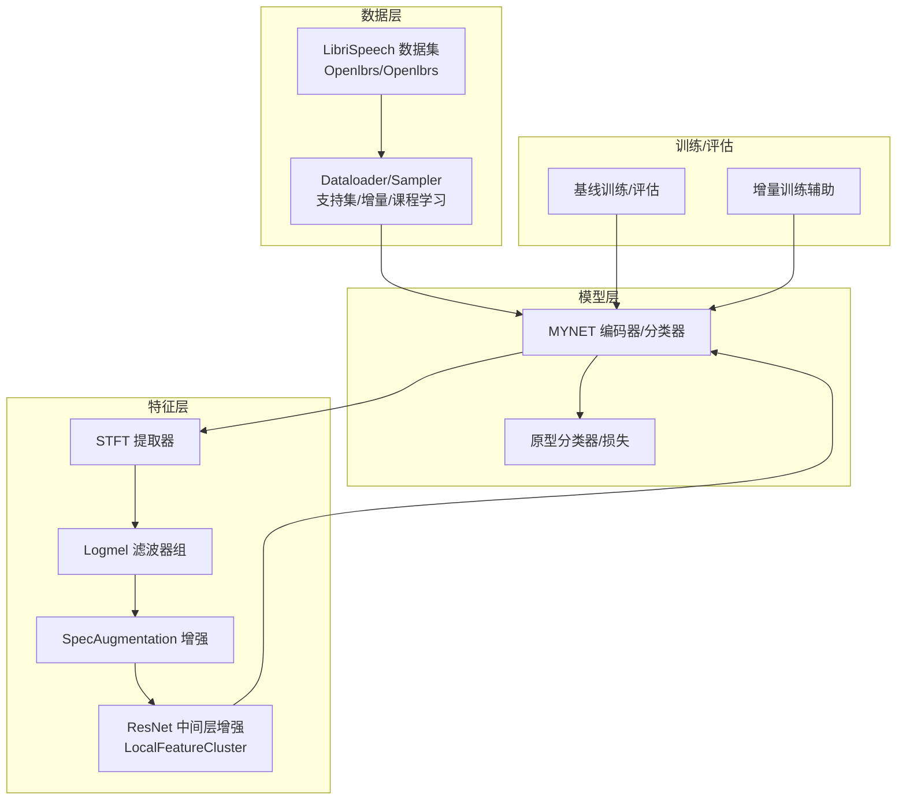
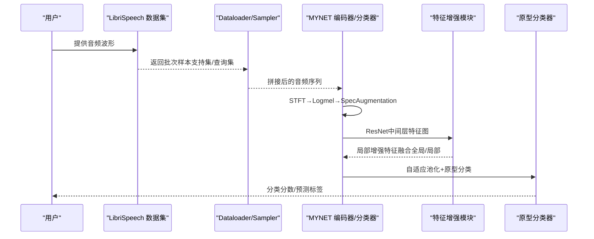
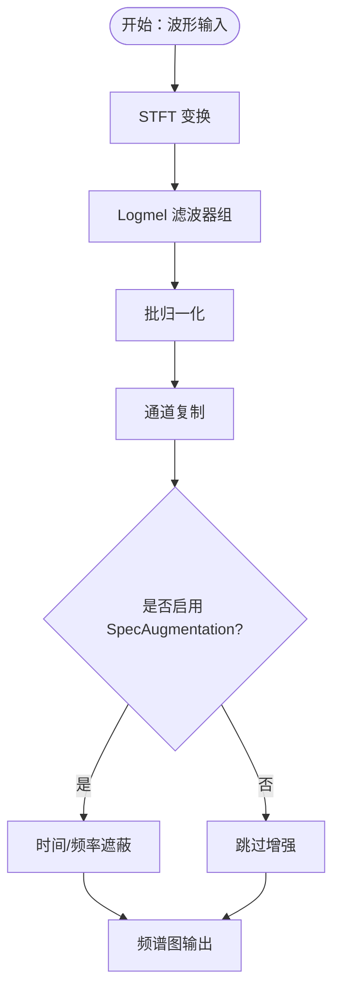
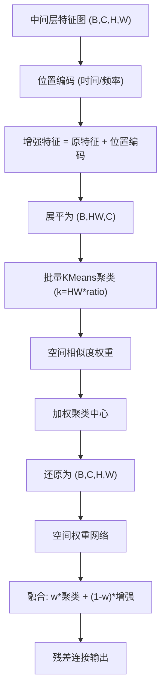
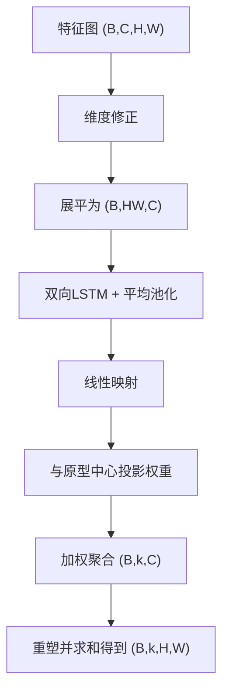
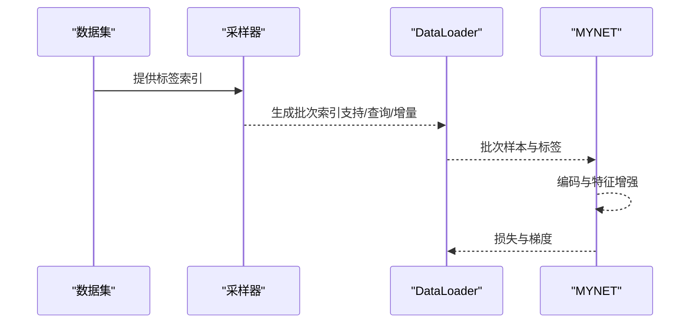
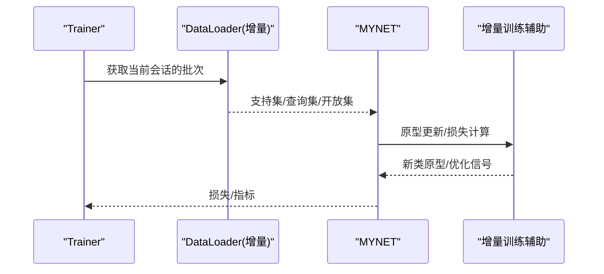
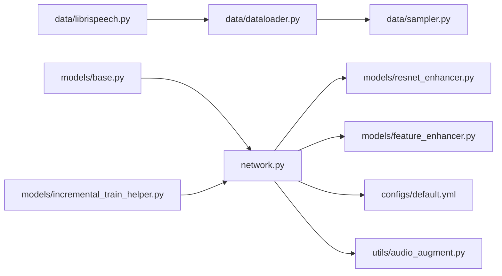

# 数据流设计

<cite>
**本文引用的文件**
- [network.py](file://network.py)
- [models/resnet_enhancer.py](file://models/resnet_enhancer.py)
- [models/feature_enhancer.py](file://models/feature_enhancer.py)
- [data/librispeech.py](file://data/librispeech.py)
- [data/dataloader.py](file://data/dataloader.py)
- [data/sampler.py](file://data/sampler.py)
- [configs/default.yml](file://configs/default.yml)
- [utils/audio_augment.py](file://utils/audio_augment.py)
- [models/base.py](file://models/base.py)
- [models/incremental_train_helper.py](file://models/incremental_train_helper.py)
</cite>

## 目录
1. [简介](#简介)
2. [项目结构](#项目结构)
3. [核心组件](#核心组件)
4. [架构总览](#架构总览)
5. [详细组件分析](#详细组件分析)
6. [依赖分析](#依赖分析)
7. [性能考虑](#性能考虑)
8. [故障排查指南](#故障排查指南)
9. [结论](#结论)
10. [附录](#附录)

## 简介
本文件面向VAZE系统，提供从音频输入到特征提取再到分类决策的完整数据流设计文档。重点覆盖以下方面：
- 音频数据从输入到特征提取的多阶段处理：STFT变换、Logmel滤波器组、SpecAugmentation数据增强。
- 特征增强策略：全局特征与局部特征的融合机制，包括基于ResNet中间层的空间位置感知增强与聚类加权融合。
- 增量学习场景下的数据流变化：支持集与查询集的动态组织、课程学习采样器与分阶段训练流程。
- 关键节点的数据结构变化与处理逻辑，配合时序图与数据流图帮助数据工程师与算法工程师快速定位实现。

## 项目结构
VAZE系统围绕“音频→频谱→特征→原型/分类”的主干流程构建，核心模块分布如下：
- 数据层：LibriSpeech数据集加载、采样器（支持集/增量采样/课程学习）、测试/增量专用数据加载器。
- 特征层：STFT与Logmel提取器、SpecAugmentation增强器、ResNet中间层特征增强模块。
- 模型层：VAZE主网络MYNET，包含编码器、原型分类器、增量更新与不确定性估计接口。
- 训练与评估：基线训练、增量训练辅助工具、测试与评估流程。

图表来源
- [data/librispeech.py:76-200](file://data/librispeech.py#L76-L200)
- [data/dataloader.py:134-230](file://data/dataloader.py#L134-L230)
- [data/sampler.py:38-140](file://data/sampler.py#L38-L140)
- [network.py:326-499](file://network.py#L326-L499)
- [models/resnet_enhancer.py:51-172](file://models/resnet_enhancer.py#L51-L172)
- [models/base.py:111-151](file://models/base.py#L111-L151)
- [models/incremental_train_helper.py:28-92](file://models/incremental_train_helper.py#L28-L92)

章节来源
- [data/librispeech.py:76-200](file://data/librispeech.py#L76-L200)
- [data/dataloader.py:134-230](file://data/dataloader.py#L134-L230)
- [data/sampler.py:38-140](file://data/sampler.py#L38-L140)
- [network.py:326-499](file://network.py#L326-L499)
- [models/resnet_enhancer.py:51-172](file://models/resnet_enhancer.py#L51-L172)
- [models/base.py:111-151](file://models/base.py#L111-L151)
- [models/incremental_train_helper.py:28-92](file://models/incremental_train_helper.py#L28-L92)

## 核心组件
- 音频特征提取器
  - STFT提取器与Logmel滤波器组：负责将波形转换为对数梅尔频谱图，并进行批归一化与通道扩展。
  - SpecAugmentation：在频域与时域进行条带遮蔽，提升模型鲁棒性。
- 局部特征增强模块
  - ResNet中间层特征增强：引入时间/频率位置编码、空间权重门控与KMeans动态聚类，实现局部细节与全局结构的融合。
- 增强局部特征模块
  - LSTM时序聚合与原型中心动态加权，实现跨空间位置的特征聚合与降维。
- 数据加载与采样
  - 支持集采样器、增量采样器、课程学习采样器，支撑元训练与增量场景。
- 增量训练辅助
  - 基于原型的增量更新、学习率调度与损失函数集成。

章节来源
- [network.py:326-499](file://network.py#L326-L499)
- [models/resnet_enhancer.py:51-172](file://models/resnet_enhancer.py#L51-L172)
- [models/feature_enhancer.py:27-93](file://models/feature_enhancer.py#L27-L93)
- [data/dataloader.py:134-230](file://data/dataloader.py#L134-L230)
- [data/sampler.py:38-140](file://data/sampler.py#L38-L140)
- [models/incremental_train_helper.py:28-92](file://models/incremental_train_helper.py#L28-L92)

## 架构总览
VAZE的端到端数据流如下：
- 输入音频（波形）经STFT→Logmel→SpecAugmentation，得到频谱图。
- 频谱图送入ResNet编码器，保留中间层特征（空间特征图）。
- 中间层特征进入局部特征增强模块，结合位置编码与动态聚类，融合全局与局部特征。
- 增强后的特征经自适应池化与分类器，得到原型分数与分类结果。
- 增量场景下，支持集与查询集动态组织，课程学习采样器逐步扩大难度。

图表来源
- [data/librispeech.py:143-261](file://data/librispeech.py#L143-L261)
- [data/dataloader.py:134-230](file://data/dataloader.py#L134-L230)
- [network.py:471-499](file://network.py#L471-L499)
- [models/resnet_enhancer.py:73-160](file://models/resnet_enhancer.py#L73-L160)

章节来源
- [data/librispeech.py:143-261](file://data/librispeech.py#L143-L261)
- [data/dataloader.py:134-230](file://data/dataloader.py#L134-L230)
- [network.py:471-499](file://network.py#L471-L499)
- [models/resnet_enhancer.py:73-160](file://models/resnet_enhancer.py#L73-L160)

## 详细组件分析

### 音频特征提取与增强
- STFT与Logmel
  - 使用torchlibrosa的Spectrogram与LogmelFilterBank，配置采样率、窗长、步长、Mel bins等参数。
  - 输出频谱图经批归一化与通道复制，作为ResNet输入。
- SpecAugmentation
  - 在Logmel域进行时间/频率条带遮蔽，提升对时频扰动的鲁棒性。
- 时域增强（可选）
  - AudioAugment提供时移与音高变换，适合基线对比实验。

图表来源
- [network.py:326-352](file://network.py#L326-L352)
- [network.py:461-499](file://network.py#L461-L499)
- [utils/audio_augment.py:4-31](file://utils/audio_augment.py#L4-L31)

章节来源
- [network.py:326-352](file://network.py#L326-L352)
- [network.py:461-499](file://network.py#L461-L499)
- [utils/audio_augment.py:4-31](file://utils/audio_augment.py#L4-L31)

### 局部特征增强与全局融合
- 位置编码
  - 时间与频率方向分别嵌入位置特征，通过门控融合，增强空间感知。
- 动态聚类
  - 基于坐标距离构造空间相似度矩阵，使用KMeans对展平特征进行批量聚类，按空间权重加权聚类中心。
- 空间权重融合
  - 通过MLP计算空间权重，控制局部聚类特征与全局增强特征的融合比例。
- 残差连接
  - 保证增强前后特征维度一致，稳定训练。

图表来源
- [models/resnet_enhancer.py:51-172](file://models/resnet_enhancer.py#L51-L172)

章节来源
- [models/resnet_enhancer.py:51-172](file://models/resnet_enhancer.py#L51-L172)

### 增强局部特征（原型中心加权）
- LSTM时序聚合
  - 将展平特征映射至双向LSTM，平均池化后线性映射，得到时序上下文特征。
- 原型中心动态加权
  - 通过与可学习原型中心的投影计算权重，实现跨空间位置的特征聚合。
- 维度安全转换
  - 对齐HW与C的整除关系，必要时进行填充与重排，确保输出形状正确。

图表来源
- [models/feature_enhancer.py:27-93](file://models/feature_enhancer.py#L27-L93)

章节来源
- [models/feature_enhancer.py:27-93](file://models/feature_enhancer.py#L27-L93)

### 数据加载与采样（支持集/查询集/增量）
- 支持集采样器
  - 从指定类别中随机采样固定数量样本，形成支持集与查询集。
- 增量采样器
  - 针对增量会话，动态扩展支持集与查询集，支持序列采样与随机采样。
- 课程学习采样器
  - 根据当前活跃类别集合，逐步扩大难度，实现从易到难的学习路径。

图表来源
- [data/sampler.py:38-140](file://data/sampler.py#L38-L140)
- [data/dataloader.py:134-230](file://data/dataloader.py#L134-L230)

章节来源
- [data/sampler.py:38-140](file://data/sampler.py#L38-L140)
- [data/dataloader.py:134-230](file://data/dataloader.py#L134-L230)

### 增量学习场景下的数据流变化
- 支持集与查询集动态处理
  - 基础会话：仅使用已知类；增量会话：逐步加入新类，支持集与查询集同步扩展。
- 课程学习采样器
  - 通过设置活跃类别集合，控制每轮采样的难度范围，实现“易-难”递进。
- 增量训练辅助
  - 基于原型的增量更新、学习率调度与损失函数集成，确保旧知识不遗忘且新类可学。

图表来源
- [models/base.py:111-151](file://models/base.py#L111-L151)
- [models/incremental_train_helper.py:28-92](file://models/incremental_train_helper.py#L28-L92)
- [data/dataloader.py:206-230](file://data/dataloader.py#L206-L230)

章节来源
- [models/base.py:111-151](file://models/base.py#L111-L151)
- [models/incremental_train_helper.py:28-92](file://models/incremental_train_helper.py#L28-L92)
- [data/dataloader.py:206-230](file://data/dataloader.py#L206-L230)

## 依赖分析
- 模块耦合
  - network.py依赖torchlibrosa的STFT/Logmel与SpecAugmentation，以及speechbrain的STFT/Filterbank。
  - models/resnet_enhancer.py与models/feature_enhancer.py作为特征增强子模块被network.py调用。
  - data/dataloader.py与data/sampler.py为训练提供数据组织与采样策略。
- 外部依赖
  - torchaudio、librosa、sklearn(KMeans)、numpy等。
- 潜在环依赖
  - 未发现直接环依赖；数据与模型解耦良好，通过函数接口交互。

图表来源
- [data/librispeech.py:76-200](file://data/librispeech.py#L76-L200)
- [data/dataloader.py:134-230](file://data/dataloader.py#L134-L230)
- [data/sampler.py:38-140](file://data/sampler.py#L38-L140)
- [network.py:326-499](file://network.py#L326-L499)
- [models/resnet_enhancer.py:51-172](file://models/resnet_enhancer.py#L51-L172)
- [models/feature_enhancer.py:27-93](file://models/feature_enhancer.py#L27-L93)
- [configs/default.yml:1-88](file://configs/default.yml#L1-L88)
- [utils/audio_augment.py:4-31](file://utils/audio_augment.py#L4-L31)
- [models/base.py:111-151](file://models/base.py#L111-L151)
- [models/incremental_train_helper.py:28-92](file://models/incremental_train_helper.py#L28-L92)

章节来源
- [data/librispeech.py:76-200](file://data/librispeech.py#L76-L200)
- [data/dataloader.py:134-230](file://data/dataloader.py#L134-L230)
- [data/sampler.py:38-140](file://data/sampler.py#L38-L140)
- [network.py:326-499](file://network.py#L326-L499)
- [models/resnet_enhancer.py:51-172](file://models/resnet_enhancer.py#L51-L172)
- [models/feature_enhancer.py:27-93](file://models/feature_enhancer.py#L27-L93)
- [configs/default.yml:1-88](file://configs/default.yml#L1-L88)
- [utils/audio_augment.py:4-31](file://utils/audio_augment.py#L4-L31)
- [models/base.py:111-151](file://models/base.py#L111-L151)
- [models/incremental_train_helper.py:28-92](file://models/incremental_train_helper.py#L28-L92)

## 性能考虑
- 计算复杂度
  - STFT/Logmel与SpecAugmentation为O(T×F)级，ResNet中间层特征图的空间复杂度为O(H×W)。
  - KMeans聚类在GPU上进行，但存在CPU↔GPU交互成本；建议批量处理与设备一致性管理。
- 内存占用
  - 中间层特征图(B,C,H,W)较大，注意显存峰值；可通过减小batch或降低分辨率缓解。
- 速度优化
  - 使用pin_memory与多进程加载；SpecAugmentation与位置编码尽量向量化实现。
  - 课程学习采样器在活跃类别不足时自动填充，避免采样失败。

## 故障排查指南
- 形状不匹配
  - 局部特征增强模块在维度修正与重塑时有严格断言与异常提示，检查输入特征图的C与HW关系。
- 设备不一致
  - 位置编码与KMeans聚类需与当前设备一致，确保模块内设备一致性检查生效。
- 采样错误
  - 增量采样器在类别数量不足时会触发填充或随机选择，确认n_cls与活跃类别集合设置。
- 增量更新失败
  - 原型更新与学习率调度需与当前会话一致，检查类别列表与fc权重拼接逻辑。

章节来源
- [models/resnet_enhancer.py:168-172](file://models/resnet_enhancer.py#L168-L172)
- [models/feature_enhancer.py:49-93](file://models/feature_enhancer.py#L49-L93)
- [data/sampler.py:161-179](file://data/sampler.py#L161-L179)
- [models/incremental_train_helper.py:40-92](file://models/incremental_train_helper.py#L40-L92)

## 结论
VAZE系统通过“STFT→Logmel→SpecAugmentation→ResNet中间层→局部特征增强→原型分类”的多阶段设计，实现了稳健的音频特征提取与分类决策。局部特征增强模块有效融合了全局结构与局部细节，提升了模型对时频变化的鲁棒性。在增量学习场景下，支持集与查询集的动态组织、课程学习采样器与原型增量更新机制共同保障了持续学习能力。建议在部署时关注设备一致性、内存峰值与采样器活跃类别设置，以获得最佳性能与稳定性。

## 附录
- 关键配置项（节选）
  - 训练超参：way、shot、n_ways、n_queries、epochs、lr、scheduler等。
  - 音频特征提取器：sample_rate、window_size、hop_size、mel_bins、fmin、fmax、window等。
- 数据工程建议
  - 优先使用多进程DataLoader与pin_memory；在GPU资源紧张时降低batch或分辨率。
  - 对于课程学习，合理设置活跃类别集合，避免采样失败。
  - 在增量会话中，确保类别列表与fc权重拼接顺序一致。

章节来源
- [configs/default.yml:1-88](file://configs/default.yml#L1-L88)