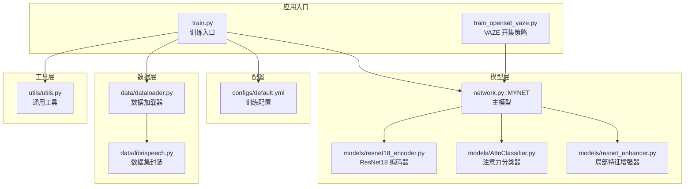
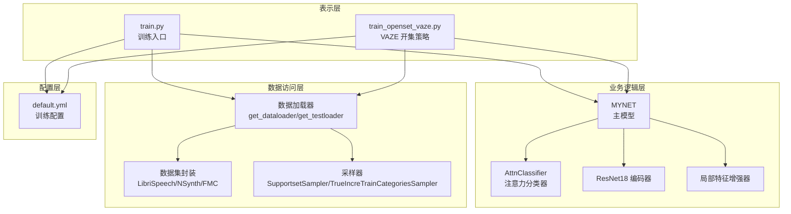
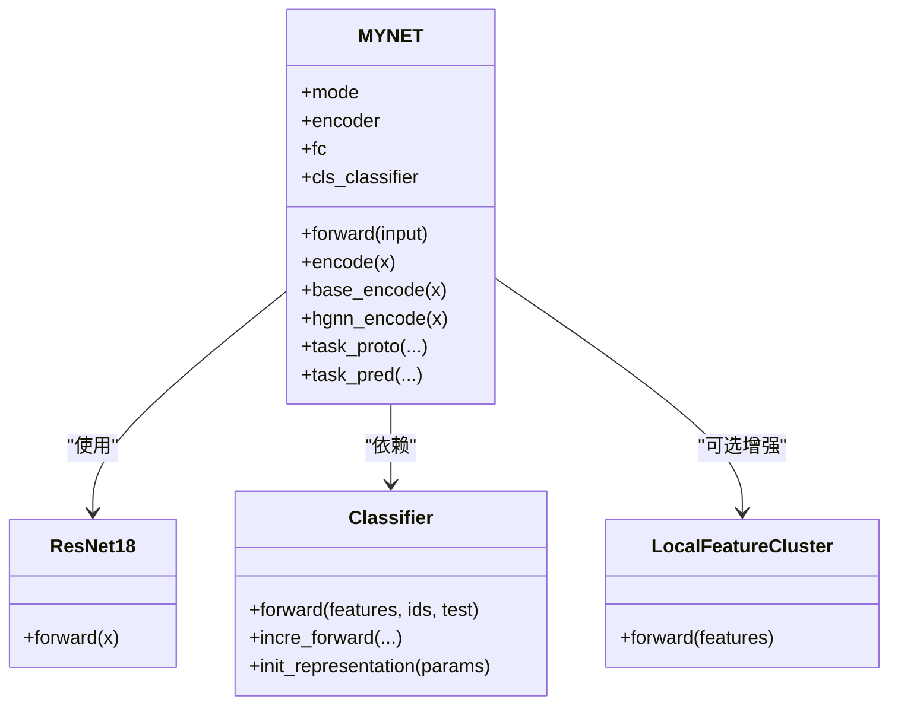
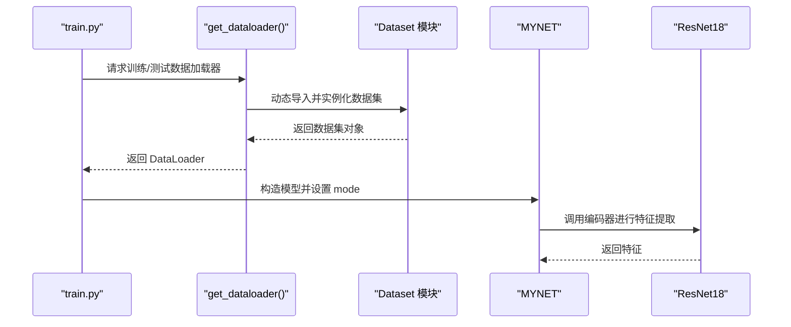
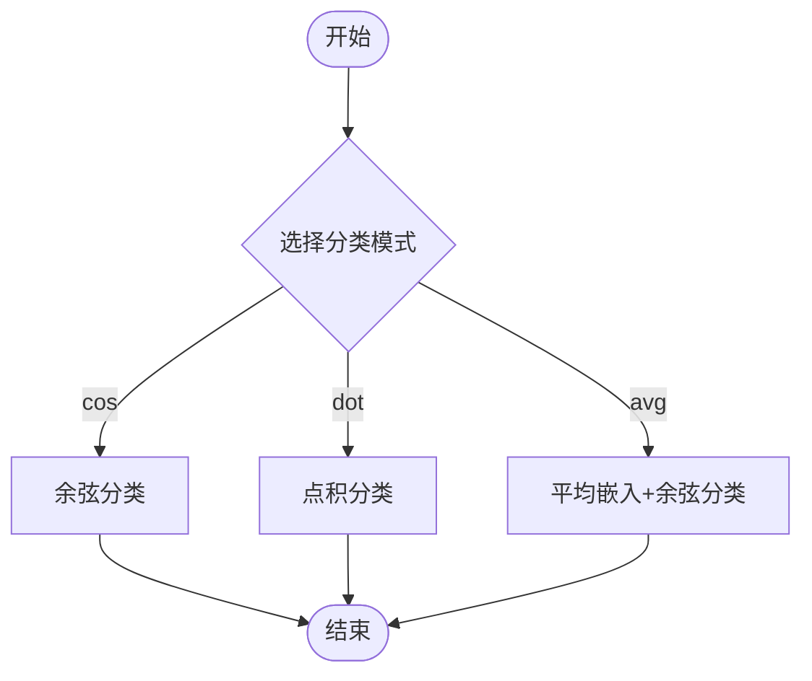
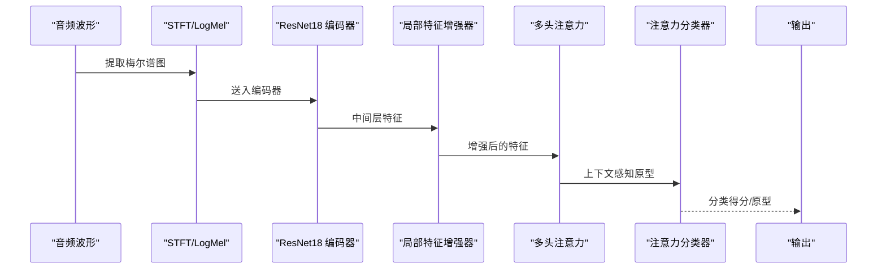
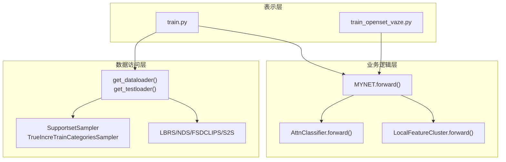
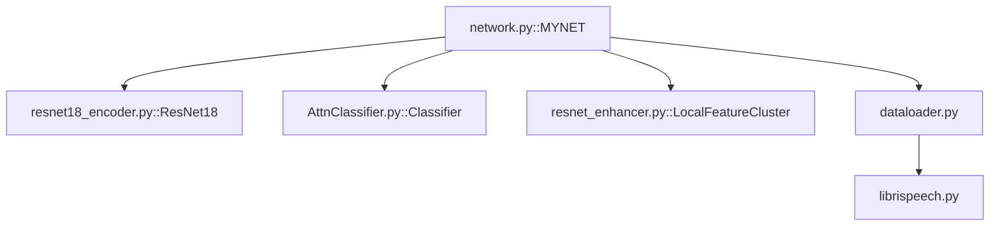

# 整体架构设计

<cite>
**本文档引用的文件**
- [network.py](file://network.py)
- [models/base.py](file://models/base.py)
- [models/resnet18_encoder.py](file://models/resnet18_encoder.py)
- [models/AttnClassifier.py](file://models/AttnClassifier.py)
- [models/resnet_enhancer.py](file://models/resnet_enhancer.py)
- [data/dataloader.py](file://data/dataloader.py)
- [data/librispeech.py](file://data/librispeech.py)
- [configs/default.yml](file://configs/default.yml)
- [train.py](file://train.py)
- [train_openset_vaze.py](file://train_openset_vaze.py)
- [utils/utils.py](file://utils/utils.py)
</cite>

## 目录
1. [简介](#简介)
2. [项目结构](#项目结构)
3. [核心组件](#核心组件)
4. [架构总览](#架构总览)
5. [详细组件分析](#详细组件分析)
6. [依赖关系分析](#依赖关系分析)
7. [性能考量](#性能考量)
8. [故障排查指南](#故障排查指南)
9. [结论](#结论)

## 简介
本文件面向架构师与高级开发者，系统化梳理 VAZE 系统的整体架构设计。重点阐述：
- 高层架构模式：MVC 模式、工厂模式、策略模式在系统中的具体体现
- MYNET 主模型设计理念：模块化组件职责划分与交互关系
- 分层架构：数据访问层、业务逻辑层、表示层的职责边界
- 关键架构决策：为何选择 ResNet18 作为编码器、多头注意力机制的设计思路
- 系统架构图与组件关系图：音频处理流水线从输入到输出的完整数据流
- 为后续演进与维护提供可操作的指导

## 项目结构
仓库采用按功能域组织的模块化布局：
- models：模型定义与组件（编码器、分类器、增强器等）
- data：数据加载与采样器（LibriSpeech、NSynth、FMC 等）
- configs：训练配置（默认配置）
- utils：通用工具与评估指标
- scripts：实验分析脚本
- save/save_result：训练产物与结果存储
- train.py、train_openset_vaze.py：训练入口与 VAZE 开集策略集成

图表来源
- [train.py:1-200](file://train.py#L1-L200)
- [train_openset_vaze.py:1-120](file://train_openset_vaze.py#L1-L120)
- [configs/default.yml:1-88](file://configs/default.yml#L1-L88)
- [data/dataloader.py:1-120](file://data/dataloader.py#L1-L120)
- [data/librispeech.py:1-120](file://data/librispeech.py#L1-L120)
- [network.py:18-120](file://network.py#L18-L120)
- [models/resnet18_encoder.py:349-360](file://models/resnet18_encoder.py#L349-L360)
- [models/AttnClassifier.py:38-120](file://models/AttnClassifier.py#L38-L120)
- [models/resnet_enhancer.py:51-172](file://models/resnet_enhancer.py#L51-L172)
- [utils/utils.py:190-287](file://utils/utils.py#L190-L287)

章节来源
- [train.py:156-200](file://train.py#L156-L200)
- [configs/default.yml:1-88](file://configs/default.yml#L1-L88)

## 核心组件
- MYNET 主模型：统一的音频特征提取、分类与开集识别框架，内含编码器、注意力模块、分类器与不确定性估计能力
- ResNet18 编码器：轻量级卷积特征提取器，负责将梅尔谱图映射到高维特征空间
- 注意力分类器：基于多头注意力的原型生成与分类模块，支持语义校准与负原型生成
- 局部特征增强器：基于 KMeans 的空间感知增强，提升局部细节与鲁棒性
- 数据加载器：支持元学习采样、增量学习与开集测试的数据管线
- 工具模块：计数、日志、评估与可视化等通用能力

章节来源
- [network.py:18-120](file://network.py#L18-L120)
- [models/resnet18_encoder.py:240-335](file://models/resnet18_encoder.py#L240-L335)
- [models/AttnClassifier.py:38-120](file://models/AttnClassifier.py#L38-L120)
- [models/resnet_enhancer.py:51-172](file://models/resnet_enhancer.py#L51-L172)
- [data/dataloader.py:13-82](file://data/dataloader.py#L13-L82)
- [utils/utils.py:190-287](file://utils/utils.py#L190-L287)

## 架构总览
系统采用“配置驱动 + 模块化组件”的分层架构：
- 表示层：训练入口与评估脚本（train.py、train_openset_vaze.py）
- 业务逻辑层：MYNET 主模型、注意力分类器、增强器
- 数据访问层：数据集封装、采样器、数据加载器
- 配置层：统一的 YAML 配置文件，驱动超参与训练流程

图表来源
- [train.py:156-200](file://train.py#L156-L200)
- [train_openset_vaze.py:420-481](file://train_openset_vaze.py#L420-L481)
- [network.py:18-120](file://network.py#L18-L120)
- [models/AttnClassifier.py:38-120](file://models/AttnClassifier.py#L38-L120)
- [models/resnet18_encoder.py:349-360](file://models/resnet18_encoder.py#L349-L360)
- [models/resnet_enhancer.py:51-172](file://models/resnet_enhancer.py#L51-L172)
- [data/dataloader.py:13-82](file://data/dataloader.py#L13-L82)
- [configs/default.yml:1-88](file://configs/default.yml#L1-L88)

## 详细组件分析

### MVC 模式在系统中的实现
- Model（模型层）：MYNET、ResNet18 编码器、AttnClassifier、增强器
- View（视图/表示层）：训练入口与评估脚本（train.py、train_openset_vaze.py）
- Controller（控制器）：数据加载器与采样器协调训练流程，配置文件驱动超参

图表来源
- [network.py:18-120](file://network.py#L18-L120)
- [models/resnet18_encoder.py:240-335](file://models/resnet18_encoder.py#L240-L335)
- [models/AttnClassifier.py:38-120](file://models/AttnClassifier.py#L38-L120)
- [models/resnet_enhancer.py:51-172](file://models/resnet_enhancer.py#L51-L172)

章节来源
- [network.py:18-120](file://network.py#L18-L120)
- [models/AttnClassifier.py:38-120](file://models/AttnClassifier.py#L38-L120)
- [models/resnet_enhancer.py:51-172](file://models/resnet_enhancer.py#L51-L172)

### 工厂模式的应用
- 数据集工厂：根据配置动态导入不同数据集模块（FMC、NSynth、LibriSpeech、S2S），在运行时决定数据源与加载方式
- 模型工厂：MYNET 根据 mode 参数切换不同工作模式（encoder/openmeta 等），实现“同一接口，多种行为”

图表来源
- [train.py:156-200](file://train.py#L156-L200)
- [data/dataloader.py:13-82](file://data/dataloader.py#L13-L82)
- [data/librispeech.py:21-80](file://data/librispeech.py#L21-L80)
- [network.py:18-120](file://network.py#L18-L120)
- [models/resnet18_encoder.py:349-360](file://models/resnet18_encoder.py#L349-L360)

章节来源
- [train.py:156-200](file://train.py#L156-L200)
- [data/dataloader.py:13-82](file://data/dataloader.py#L13-L82)
- [data/librispeech.py:21-80](file://data/librispeech.py#L21-L80)

### 策略模式的应用
- 分类策略：MYNET 支持多种分类模式（cos、dot、avg），通过配置切换
- 注意力策略：AttnClassifier 支持多种负原型生成策略（semang、attg、att、mlp），通过配置选择
- 开集检测策略：train_openset_vaze.py 提供 VAZE 开集检测与增量原型扩展策略

图表来源
- [configs/default.yml:42-46](file://configs/default.yml#L42-L46)
- [network.py:436-441](file://network.py#L436-L441)
- [models/AttnClassifier.py:188-271](file://models/AttnClassifier.py#L188-L271)

章节来源
- [configs/default.yml:42-46](file://configs/default.yml#L42-L46)
- [network.py:436-441](file://network.py#L436-L441)
- [models/AttnClassifier.py:188-271](file://models/AttnClassifier.py#L188-L271)

### MYNET 主模型设计与模块化职责
- 编码器模块：ResNet18 将梅尔谱图转换为 512 维特征，支持预训练权重加载
- 注意力模块：MultiHeadAttention 用于原型聚合与上下文建模
- 分类器模块：AttnClassifier 生成正原型与负原型，计算余弦相似度得分
- 增强模块：LocalFeatureCluster 对中间层特征进行空间感知增强
- 不确定性模块：MC Dropout + 核范数估计，用于 VAZE 开集策略

图表来源
- [network.py:471-518](file://network.py#L471-L518)
- [models/resnet18_encoder.py:240-335](file://models/resnet18_encoder.py#L240-L335)
- [models/resnet_enhancer.py:51-172](file://models/resnet_enhancer.py#L51-L172)
- [models/AttnClassifier.py:38-120](file://models/AttnClassifier.py#L38-L120)

章节来源
- [network.py:18-120](file://network.py#L18-L120)
- [models/resnet18_encoder.py:240-335](file://models/resnet18_encoder.py#L240-L335)
- [models/resnet_enhancer.py:51-172](file://models/resnet_enhancer.py#L51-L172)
- [models/AttnClassifier.py:38-120](file://models/AttnClassifier.py#L38-L120)

### 分层架构与职责边界
- 数据访问层：负责数据加载、采样与批构建，屏蔽数据源差异
- 业务逻辑层：封装模型、注意力与增强逻辑，提供统一接口
- 表示层：训练入口与评估脚本，协调配置与流程控制

图表来源
- [data/dataloader.py:13-82](file://data/dataloader.py#L13-L82)
- [data/librispeech.py:21-80](file://data/librispeech.py#L21-L80)
- [network.py:18-120](file://network.py#L18-L120)
- [models/AttnClassifier.py:38-120](file://models/AttnClassifier.py#L38-L120)
- [models/resnet_enhancer.py:51-172](file://models/resnet_enhancer.py#L51-L172)
- [train.py:156-200](file://train.py#L156-L200)
- [train_openset_vaze.py:420-481](file://train_openset_vaze.py#L420-L481)

章节来源
- [data/dataloader.py:13-82](file://data/dataloader.py#L13-L82)
- [data/librispeech.py:21-80](file://data/librispeech.py#L21-L80)
- [network.py:18-120](file://network.py#L18-L120)
- [models/AttnClassifier.py:38-120](file://models/AttnClassifier.py#L38-L120)
- [models/resnet_enhancer.py:51-172](file://models/resnet_enhancer.py#L51-L172)
- [train.py:156-200](file://train.py#L156-L200)
- [train_openset_vaze.py:420-481](file://train_openset_vaze.py#L420-L481)

### 关键架构决策说明
- 选择 ResNet18 作为编码器的原因
  - 轻量化与高效：适合音频特征提取，参数规模适中，推理速度快
  - 预训练权重可用：可快速迁移至下游任务，提升收敛稳定性
  - 与梅尔谱图兼容：输入通道经三次复制后适配 ResNet 的三通道期望
- 多头注意力机制的设计
  - 原型聚合：通过注意力对支持集原型进行加权聚合，提升判别能力
  - 语义校准：结合语义信息进行门控融合，增强跨模态一致性
  - 负原型生成：利用注意力生成负原型，缓解已知类边界收缩问题

章节来源
- [models/resnet18_encoder.py:349-360](file://models/resnet18_encoder.py#L349-L360)
- [models/AttnClassifier.py:121-271](file://models/AttnClassifier.py#L121-L271)
- [network.py:538-584](file://network.py#L538-L584)

## 依赖关系分析
- 模块耦合与内聚
  - MYNET 与 ResNet18 强耦合（编码器依赖），与 AttnClassifier 弱耦合（通过接口）
  - 数据加载器与数据集模块弱耦合，通过统一接口抽象
- 外部依赖
  - PyTorch/Torchaudio：深度学习与音频处理
  - SpeechBrain/TorchLibrosa：STFT、梅尔滤波器与增强
  - Scikit-learn：KMeans、聚类与评估指标

图表来源
- [network.py:18-120](file://network.py#L18-L120)
- [models/resnet18_encoder.py:240-335](file://models/resnet18_encoder.py#L240-L335)
- [models/AttnClassifier.py:38-120](file://models/AttnClassifier.py#L38-L120)
- [models/resnet_enhancer.py:51-172](file://models/resnet_enhancer.py#L51-L172)
- [data/dataloader.py:13-82](file://data/dataloader.py#L13-L82)
- [data/librispeech.py:21-80](file://data/librispeech.py#L21-L80)

章节来源
- [network.py:18-120](file://network.py#L18-L120)
- [models/resnet18_encoder.py:240-335](file://models/resnet18_encoder.py#L240-L335)
- [models/AttnClassifier.py:38-120](file://models/AttnClassifier.py#L38-L120)
- [models/resnet_enhancer.py:51-172](file://models/resnet_enhancer.py#L51-L172)
- [data/dataloader.py:13-82](file://data/dataloader.py#L13-L82)
- [data/librispeech.py:21-80](file://data/librispeech.py#L21-L80)

## 性能考量
- 计算复杂度
  - 编码器：ResNet18 前向计算 O(N·C·H·W)，受输入分辨率影响
  - 注意力模块：多头注意力 O(N^2·d)，在支持集规模受限时可控
- 内存占用
  - 中间特征缓存与注意力权重矩阵是主要内存消耗点
- 推理加速
  - 使用预训练权重与固定特征提取器，减少训练成本
  - 在 VAZE 策略中，可利用不确定性估计与聚类减少无效推理

## 故障排查指南
- 常见问题
  - 数据加载异常：确认数据路径与 CSV 文件存在，检查采样器参数
  - 设备不一致：确保增强器与模型在同一设备上
  - 模式错误：MYNET 的 mode 必须在合适阶段切换（如 openmeta/encoder）
- 调试建议
  - 使用 utils 中的 Averager/Timer 等工具统计训练进度
  - 在 VAZE 策略中，先进行闭集训练再启用开集检测与增量原型扩展

章节来源
- [utils/utils.py:190-287](file://utils/utils.py#L190-L287)
- [train_openset_vaze.py:86-100](file://train_openset_vaze.py#L86-L100)
- [network.py:18-120](file://network.py#L18-L120)

## 结论
VAZE 系统通过清晰的分层架构与模块化设计，实现了从音频输入到分类输出的完整流水线，并在开集场景下提供了可扩展的增量学习能力。MYNET 主模型以 ResNet18 为核心编码器，结合多头注意力与语义校准，形成强大的原型建模能力；工厂与策略模式贯穿配置与运行时行为选择，提升了系统的灵活性与可维护性。建议在后续开发中持续关注特征增强与不确定性估计的工程化落地，以进一步提升系统在真实场景中的鲁棒性与泛化能力。