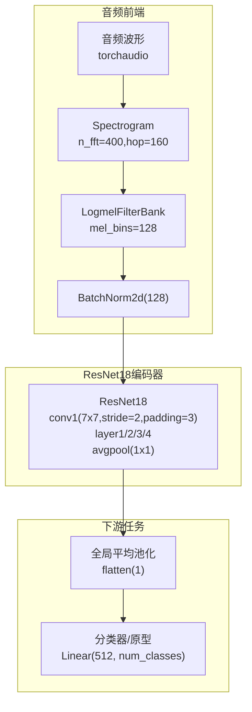
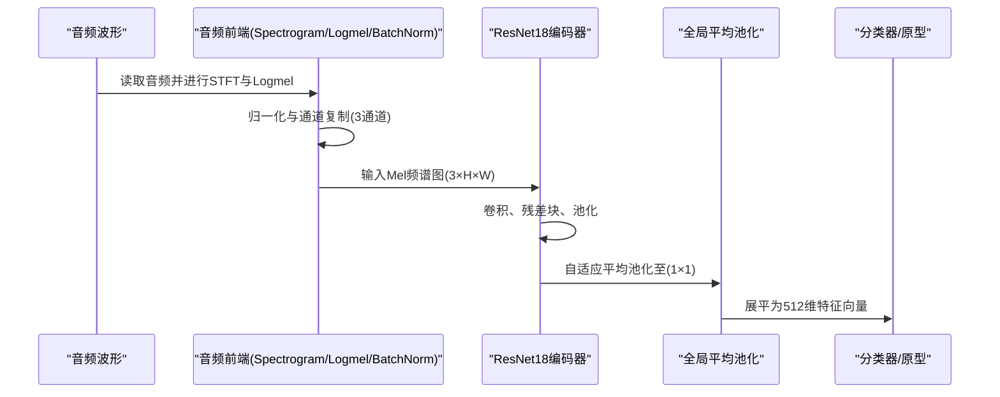
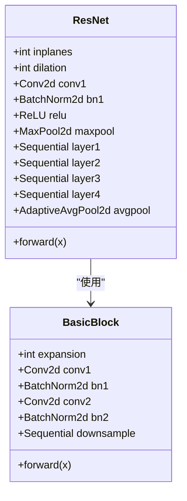
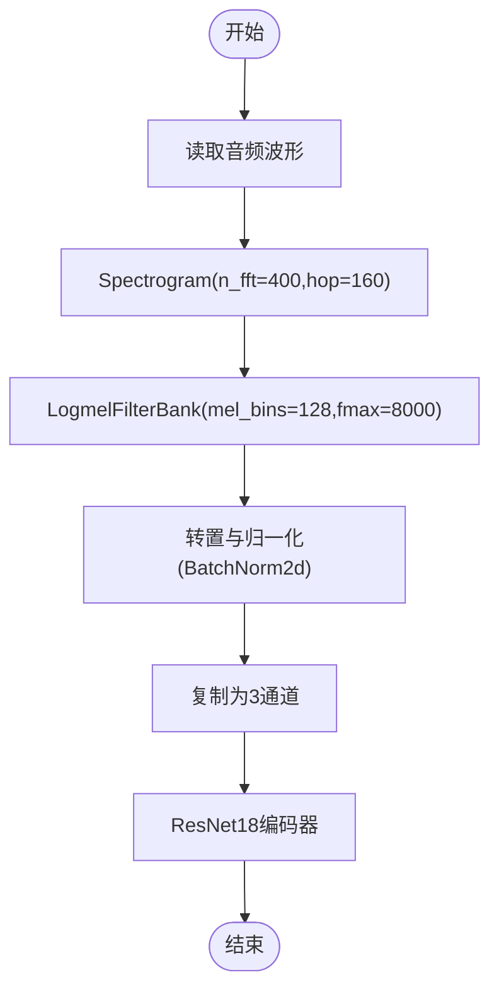
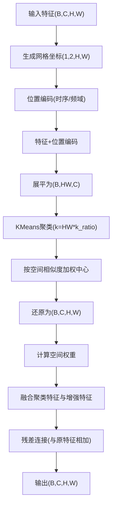
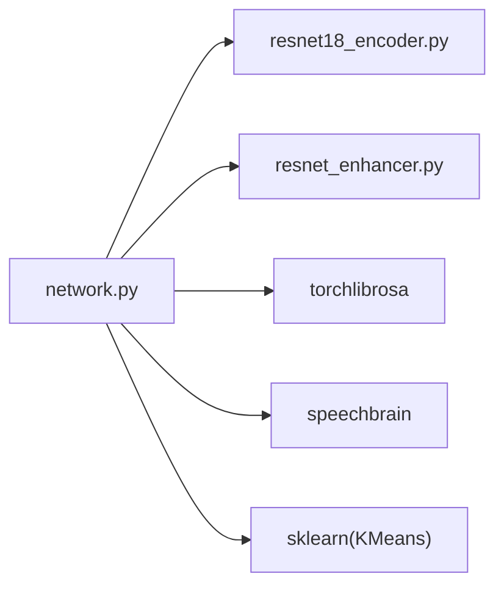

# ResNet18编码器

<cite>
**本文档引用的文件**
- [resnet18_encoder.py](file://models/resnet18_encoder.py)
- [resnet_enhancer.py](file://models/resnet_enhancer.py)
- [network.py](file://network.py)
- [default.yml](file://configs/default.yml)
- [librispeech.py](file://data/librispeech.py)
- [dataloader.py](file://data/dataloader.py)
- [test.py](file://test.py)
</cite>

## 目录
1. [简介](#简介)
2. [项目结构](#项目结构)
3. [核心组件](#核心组件)
4. [架构总览](#架构总览)
5. [详细组件分析](#详细组件分析)
6. [依赖关系分析](#依赖关系分析)
7. [性能考虑](#性能考虑)
8. [故障排除指南](#故障排除指南)
9. [结论](#结论)
10. [附录](#附录)

## 简介
本文件为ResNet18编码器的详细模块文档，面向开发者与研究者，系统阐述ResNet18在音频特征提取中的设计原理与实现细节。重点涵盖：
- ResNet18架构与残差连接机制
- 从音频波形到Mel频谱图再到512维特征向量的完整处理流程
- 编码器的可配置参数、预训练策略与性能特点
- 与音频前端（STFT、Logmel）及下游任务（增量学习、开放集识别）的集成方法

## 项目结构
ResNet18编码器位于models目录，配合音频前端与网络主干在network.py中统一调度，配置参数由configs/default.yml提供，数据加载与音频处理由data目录下的相关模块完成。

图表来源
- [network.py:471-485](file://network.py#L471-L485)
- [resnet18_encoder.py:240-334](file://models/resnet18_encoder.py#L240-L334)

章节来源
- [network.py:326-352](file://network.py#L326-L352)
- [configs/default.yml:78-84](file://configs/default.yml#L78-L84)

## 核心组件
- ResNet18编码器：基于BasicBlock的四层残差网络，输出512维通道的特征图，经全局平均池化得到512维特征向量。
- 音频前端：Spectrogram + LogmelFilterBank + BatchNorm，将音频波形转为Mel频谱图。
- 增强模块：LocalFeatureCluster对中间层特征进行位置感知增强与聚类融合，提升空间细节与鲁棒性。
- 网络主干MYNET：封装音频前端、ResNet18编码器与分类器，提供多种模式（encoder/openmeta/incre等）。

章节来源
- [resnet18_encoder.py:157-194](file://models/resnet18_encoder.py#L157-L194)
- [resnet18_encoder.py:240-334](file://models/resnet18_encoder.py#L240-L334)
- [network.py:18-34](file://network.py#L18-L34)
- [resnet_enhancer.py:51-160](file://models/resnet_enhancer.py#L51-L160)

## 架构总览
ResNet18编码器在整体系统中的位置如下：

图表来源
- [network.py:471-485](file://network.py#L471-L485)
- [resnet18_encoder.py:240-334](file://models/resnet18_encoder.py#L240-L334)

## 详细组件分析

### ResNet18编码器实现
- 结构组成
  - 第一层卷积：7×7卷积，stride=2，padding=3，输出通道64
  - 四层残差块：[2,2,2,2] BasicBlock，通道数逐步增至512
  - 全局平均池化：自适应池化至1×1
- 残差连接
  - 每个BasicBlock包含两个3×3卷积，输出与输入相加，缓解梯度消失
  - 下采样时通过1×1卷积调整维度并保持恒等映射
- 参数初始化
  - 卷积层采用Kaiming初始化，BN层权重置1，偏置置0
  - 可选零初始化残差BN，进一步稳定训练

图表来源
- [resnet18_encoder.py:240-334](file://models/resnet18_encoder.py#L240-L334)
- [resnet18_encoder.py:157-194](file://models/resnet18_encoder.py#L157-L194)

章节来源
- [resnet18_encoder.py:240-334](file://models/resnet18_encoder.py#L240-L334)
- [resnet18_encoder.py:157-194](file://models/resnet18_encoder.py#L157-L194)

### 音频特征提取与Mel频谱图
- 配置参数
  - 采样率：16kHz
  - 窗口大小：400
  - 步长：160
  - Mel频带：128
  - 频段范围：0–8000Hz
- 处理流程
  - 读取音频波形，计算Spectrogram与LogmelFilterBank
  - 通道归一化后复制为3通道，满足图像输入格式
  - 送入ResNet18编码器

图表来源
- [network.py:326-352](file://network.py#L326-L352)
- [network.py:471-485](file://network.py#L471-L485)
- [configs/default.yml:78-84](file://configs/default.yml#L78-L84)

章节来源
- [network.py:326-352](file://network.py#L326-L352)
- [network.py:471-485](file://network.py#L471-L485)
- [configs/default.yml:78-84](file://configs/default.yml#L78-L84)

### 特征增强模块（LocalFeatureCluster）
- 目标
  - 在中间层特征上引入位置感知与聚类融合，提升空间细节与鲁棒性
- 关键步骤
  - 位置编码：基于网格坐标的时序与频域嵌入，通过门控融合
  - 动态聚类：对展平特征按空间位置相似度加权聚类，得到加权中心
  - 空间权重融合：根据原特征的重要性计算空间权重，融合聚类特征与增强特征
  - 残差连接：最终输出与原特征相加，保持稳定性
- 参数
  - feat_dim：特征通道数（如64/256）
  - k_ratio：聚类数占空间像素的比例
  - temporal_scale：空间相似度的尺度参数

图表来源
- [resnet_enhancer.py:51-160](file://models/resnet_enhancer.py#L51-L160)

章节来源
- [resnet_enhancer.py:51-160](file://models/resnet_enhancer.py#L51-L160)

### 预训练策略与可配置参数
- 预训练策略
  - 支持加载ImageNet预训练权重，自动过滤分类头参数并注入编码器
- 可配置参数
  - 网络模式：encoder/openmeta/incre等
  - 温度参数：用于余弦分类器的温度缩放
  - 采样率、窗口大小、步长、Mel频带、频率范围等音频前端参数
- 使用方式
  - 在MYNET中实例化resnet18(pretrained=True)，随后可继续微调或直接用于特征提取

章节来源
- [resnet18_encoder.py:337-346](file://models/resnet18_encoder.py#L337-L346)
- [network.py:18-34](file://network.py#L18-L34)
- [configs/default.yml:78-84](file://configs/default.yml#L78-L84)

### 从音频到512维特征的完整流程
- 数据准备
  - 通过数据加载器读取音频路径与标签
  - LibriSpeech数据集示例：读取音频并返回波形
- 特征提取
  - 音频前端：Spectrogram → Logmel → 归一化 → 3通道复制
  - 编码器：ResNet18 → 全局平均池化 → 展平为512维
- 应用场景
  - 分类任务：直接过分类器
  - 开放集/增量学习：返回特征向量供原型学习或注意力模块使用

章节来源
- [librispeech.py:76-79](file://data/librispeech.py#L76-L79)
- [network.py:471-485](file://network.py#L471-L485)

## 依赖关系分析
- 模块耦合
  - network.py依赖models/resnet18_encoder.py与models/resnet_enhancer.py
  - 音频前端依赖torchlibrosa与speechbrain
- 外部依赖
  - torchaudio：音频读取与STFT/Logmel
  - sklearn：KMeans聚类
  - tqdm：下载进度显示

图表来源
- [network.py:8-17](file://network.py#L8-L17)
- [resnet_enhancer.py:4](file://models/resnet_enhancer.py#L4)

章节来源
- [network.py:8-17](file://network.py#L8-L17)
- [resnet_enhancer.py:4](file://models/resnet_enhancer.py#L4)

## 性能考虑
- 计算复杂度
  - ResNet18在Mel频谱图上逐层下采样，空间分辨率逐步降低，通道数逐步增加，最终在1×1池化后得到512维特征
- 内存占用
  - 中间层特征图尺寸较大（如layer3/4），可通过增强模块进行聚类融合以平衡细节与内存
- 训练稳定性
  - 使用BatchNorm与残差连接，结合零初始化BN，有助于收敛稳定
- 推理效率
  - Mel频谱图尺寸固定，推理时可批量化处理，适合实时应用

## 故障排除指南
- 预训练权重加载失败
  - 检查网络连通性与缓存目录权限
  - 确认URL与哈希校验一致
- Mel频谱图维度不匹配
  - 确认采样率、窗口大小、步长与配置一致
  - 检查通道复制逻辑是否正确
- 增强模块设备不一致
  - 确保LocalFeatureCluster与输入特征在同一设备上
- 分类器维度不匹配
  - 确认fc层输出维度与类别数一致

章节来源
- [resnet18_encoder.py:18-67](file://models/resnet18_encoder.py#L18-L67)
- [resnet_enhancer.py:168-172](file://models/resnet_enhancer.py#L168-L172)
- [network.py:471-485](file://network.py#L471-L485)

## 结论
ResNet18编码器通过残差连接与多层卷积，在Mel频谱图上高效提取空间-时间特征，最终输出稳定的512维特征向量。配合音频前端与增强模块，可在增量学习与开放集识别等场景中取得良好性能。开发者可根据任务需求调整音频参数、增强策略与分类器模式，灵活集成到现有系统中。

## 附录

### 使用指南与集成方法
- 基本用法
  - 在MYNET中实例化编码器并设置音频前端参数
  - 通过encode/base_encode获取特征，或直接使用hgnn_encode进行增强
- 集成步骤
  - 配置音频参数（采样率、窗口大小、步长、Mel频带）
  - 加载预训练权重（可选）
  - 将音频前端输出送入ResNet18编码器
  - 使用全局平均池化得到512维特征向量
  - 根据任务选择分类器或原型学习

章节来源
- [network.py:18-34](file://network.py#L18-L34)
- [network.py:471-518](file://network.py#L471-L518)
- [test.py:780-800](file://test.py#L780-L800)