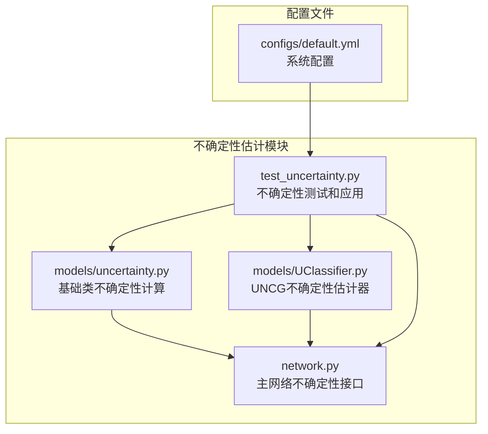
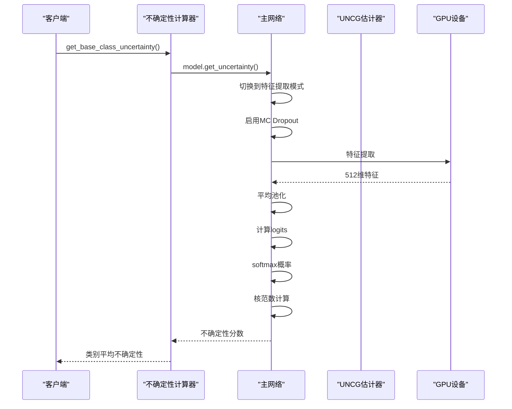
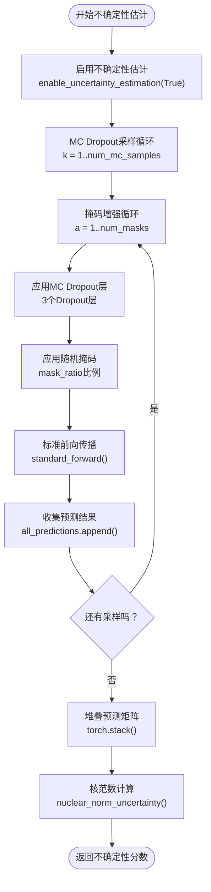
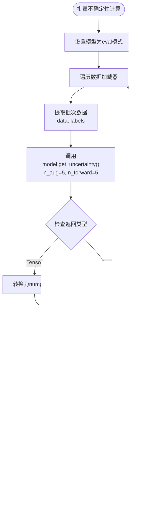
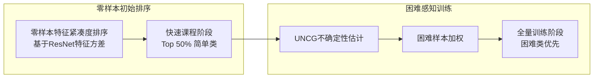
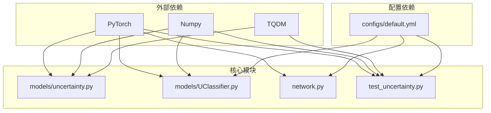

# 不确定性估计模块

<cite>
**本文档引用的文件**
- [models/uncertainty.py](file://models/uncertainty.py)
- [models/UClassifier.py](file://models/UClassifier.py)
- [network.py](file://network.py)
- [test_uncertainty.py](file://test_uncertainty.py)
- [configs/default.yml](file://configs/default.yml)
</cite>

## 目录
1. [简介](#简介)
2. [项目结构](#项目结构)
3. [核心组件](#核心组件)
4. [架构概览](#架构概览)
5. [详细组件分析](#详细组件分析)
6. [依赖关系分析](#依赖关系分析)
7. [性能考虑](#性能考虑)
8. [故障排除指南](#故障排除指南)
9. [结论](#结论)
10. [附录](#附录)

## 简介

不确定性估计模块是本项目中的一个重要功能模块，专门用于计算和分析模型输出的不确定性。该模块实现了基于蒙特卡洛Dropout（MC Dropout）的不确定性估计方法，结合核范数评估和掩码增强技术，为增量学习提供了强大的不确定性度量能力。

该模块的核心目标是：
- 为增量学习场景提供可靠的不确定性度量
- 支持类级和样本级的不确定性估计
- 实现基于不确定性的课程排序和样本选择
- 提供核范数作为不确定性度量的标准

## 项目结构

不确定性估计模块主要分布在以下几个文件中：



**图表来源**
- [models/uncertainty.py:1-55](file://models/uncertainty.py#L1-L55)
- [models/UClassifier.py:1-405](file://models/UClassifier.py#L1-L405)
- [network.py:50-101](file://network.py#L50-L101)
- [test_uncertainty.py:38-85](file://test_uncertainty.py#L38-L85)

**章节来源**
- [models/uncertainty.py:1-55](file://models/uncertainty.py#L1-L55)
- [models/UClassifier.py:1-405](file://models/UClassifier.py#L1-L405)
- [network.py:1-200](file://network.py#L1-L200)

## 核心组件

### 1. 基础类不确定性计算器

`get_base_class_uncertainty`函数提供了批量的基础类不确定性计算能力：

- **输入**: 模型实例、数据加载器、设备、MC Dropout采样次数、掩码增强次数
- **输出**: 每个类别的平均不确定性分数
- **特点**: 自动处理DataParallel包装的模型，支持批量处理

### 2. UNCG不确定性估计器

`UClassifier`类实现了完整的UNCG不确定性估计框架：

- **MC Dropout层**: 3个Dropout层用于随机性注入
- **配置参数**: 可调节的采样次数、掩码比率等
- **核范数计算**: 基于奇异值分解的不确定性度量

### 3. 主网络不确定性接口

`MYNET`类的`get_uncertainty`方法提供了统一的不确定性计算接口：

- **模式切换**: 临时切换到特征提取模式
- **MC Dropout集成**: 自动处理Dropout状态
- **核范数评估**: 计算预测矩阵的核范数

**章节来源**
- [models/uncertainty.py:5-55](file://models/uncertainty.py#L5-L55)
- [models/UClassifier.py:7-41](file://models/UClassifier.py#L7-L41)
- [network.py:50-101](file://network.py#L50-L101)

## 架构概览

不确定性估计模块采用分层架构设计，实现了从底层特征到高层决策的完整不确定性计算链路：



**图表来源**
- [models/uncertainty.py:11-55](file://models/uncertainty.py#L11-L55)
- [network.py:50-101](file://network.py#L50-L101)

## 详细组件分析

### MC Dropout不确定性估计器

#### 核心算法实现

UNCG不确定性估计器基于以下核心算法：



**图表来源**
- [models/UClassifier.py:42-76](file://models/UClassifier.py#L42-L76)
- [models/UClassifier.py:97-112](file://models/UClassifier.py#L97-L112)

#### 数学原理分析

**核范数作为不确定性度量**：
- 核范数定义：矩阵所有奇异值之和
- 数学表达：$||X||_* = \sum_{i=1}^{\min(m,n)} \sigma_i$
- 不确定性解释：核范数越大，预测分布越分散，不确定性越高

**MC Dropout理论基础**：
- 通过在前向传播中随机关闭神经元引入随机性
- 多次采样得到不同权重组合下的预测分布
- 预测分布的方差作为不确定性度量

**掩码增强机制**：
- 随机掩码不同特征维度，模拟数据缺失
- 增强模型对输入变化的鲁棒性
- 提高不确定性估计的可靠性

**章节来源**
- [models/UClassifier.py:42-112](file://models/UClassifier.py#L42-L112)

### 基础类不确定性计算

#### 批量处理流程



**图表来源**
- [models/uncertainty.py:11-55](file://models/uncertainty.py#L11-L55)

#### 参数调优策略

**MC Dropout采样次数 (num_mc_samples)**：
- 默认值：10次
- 调整范围：5-20次
- 影响：采样次数越多，不确定性估计越稳定，但计算成本增加

**掩码增强次数 (num_masks)**：
- 默认值：5次
- 调整范围：3-10次
- 影响：掩码次数影响模型对输入变化的敏感度

**掩码比率 (mask_ratio)**：
- 默认值：0.15（15%）
- 调整范围：0.1-0.3
- 影响：掩码比率控制特征维度的随机性程度

**章节来源**
- [models/uncertainty.py:5-55](file://models/uncertainty.py#L5-L55)
- [models/UClassifier.py:24-30](file://models/UClassifier.py#L24-L30)

### 不确定性度量的数学原理

#### 概率分布稳定性分析

**预测分布方差**：
- $Var[p] = \frac{1}{K} \sum_{k=1}^{K} (p_k - \bar{p})^2$
- 其中 $\bar{p} = \frac{1}{K} \sum_{k=1}^{K} p_k$

**核范数与方差的关系**：
- 核范数作为预测分布的全局度量
- 与方差相比，核范数对异常值更稳健
- 更适合处理高维概率分布

#### 不确定性与模型置信度的关系

**置信度定义**：
- $Confidence = \max(p)$
- 最大概率对应类别的置信度

**不确定性与置信度的反比关系**：
- $Uncertainty \propto \frac{1}{Confidence}$
- 当模型高度自信时，不确定性较低
- 当模型犹豫不决时，不确定性较高

**章节来源**
- [models/UClassifier.py:97-112](file://models/UClassifier.py#L97-L112)

### 增量学习中的应用场景

#### 1. 课程排序（Curriculum Learning）



**图表来源**
- [test_uncertainty.py:613-706](file://test_uncertainty.py#L613-L706)

#### 2. 样本选择策略

**困难样本识别**：
- 基于不确定性分数排序
- 高不确定性样本优先学习
- 动态调整学习重点

**重要性权重计算**：
- $Weight_i = \frac{Max(Unc)}{Unc_i + \epsilon}$
- 不确定性越高，权重越大

**章节来源**
- [test_uncertainty.py:655-706](file://test_uncertainty.py#L655-L706)

## 依赖关系分析

不确定性估计模块的依赖关系如下：



**图表来源**
- [models/uncertainty.py:1-3](file://models/uncertainty.py#L1-L3)
- [models/UClassifier.py:1-4](file://models/UClassifier.py#L1-L4)
- [network.py:1-17](file://network.py#L1-L17)
- [test_uncertainty.py:1-36](file://test_uncertainty.py#L1-L36)

**章节来源**
- [models/uncertainty.py:1-55](file://models/uncertainty.py#L1-L55)
- [models/UClassifier.py:1-405](file://models/UClassifier.py#L1-L405)
- [network.py:1-200](file://network.py#L1-L200)

## 性能考虑

### 计算复杂度分析

**时间复杂度**：
- 单样本不确定性计算：$O(K \times A \times D \times C)$
- 其中：K为MC采样次数，A为掩码增强次数，D为特征维度，C为类别数

**空间复杂度**：
- 预测矩阵存储：$O(K \times A \times C)$
- 核范数计算：$O(D^3)$（奇异值分解）

### 优化策略

**1. 批量处理优化**
- 使用DataLoader进行批量数据处理
- GPU并行计算提高效率
- 内存管理避免溢出

**2. 参数调优建议**
- **小规模实验**：使用较小的K和A值进行快速验证
- **渐进式增加**：从K=5, A=3开始，逐步增加到默认值
- **硬件适配**：根据GPU内存调整批大小

**3. 内存优化**
- 及时释放中间结果
- 使用半精度浮点数
- 分批处理大型数据集

## 故障排除指南

### 常见问题及解决方案

#### 1. CUDA内存不足

**症状**：运行时出现CUDA out of memory错误

**解决方案**：
- 减少MC采样次数（K值）
- 降低掩码增强次数（A值）
- 减小批大小
- 使用更小的特征维度

#### 2. 不确定性估计不稳定

**症状**：相同输入产生不同不确定性分数

**解决方案**：
- 设置随机种子确保可重复性
- 检查Dropout状态是否正确切换
- 验证MC Dropout模式是否启用

#### 3. 模型模式冲突

**症状**：get_uncertainty方法报错或返回错误结果

**解决方案**：
- 确保在调用前正确设置模型模式
- 检查DataParallel包装的模型访问方式
- 验证特征提取模式的正确性

**章节来源**
- [test_uncertainty.py:87-111](file://test_uncertainty.py#L87-L111)
- [network.py:54-92](file://network.py#L54-L92)

### 调试工具

#### 随机性验证

```python
def check_randomness():
    """验证随机种子是否生效"""
    print(f"Python random: {random.randint(0, 100)}")
    print(f"Numpy random: {np.random.randint(0, 100)}")
    print(f"PyTorch random: {torch.rand(1).item()}")
```

#### 确定性设置

```python
def set_seed(seed=42):
    """设置确定性环境"""
    random.seed(seed)
    np.random.seed(seed)
    torch.manual_seed(seed)
    torch.cuda.manual_seed_all(seed)
    torch.backends.cudnn.deterministic = True
    torch.backends.cudnn.benchmark = False
    torch.use_deterministic_algorithms(True)
```

**章节来源**
- [test_uncertainty.py:87-111](file://test_uncertainty.py#L87-L111)
- [test_uncertainty.py:87-103](file://test_uncertainty.py#L87-L103)

## 结论

不确定性估计模块为增量学习提供了强大的理论基础和实用工具。通过MC Dropout、核范数评估和掩码增强的有机结合，该模块能够：

1. **准确量化模型不确定性**：基于预测分布的统计特性
2. **支持增量学习场景**：为课程排序和样本选择提供依据
3. **保证计算效率**：通过合理的参数配置平衡准确性与性能
4. **提供可扩展架构**：模块化设计便于进一步改进和扩展

该模块的成功实施为后续的增量学习研究奠定了坚实基础，特别是在处理概念漂移和持续学习挑战方面具有重要价值。

## 附录

### 使用指南

#### 基础使用

```python
# 基础类不确定性计算
unc_scores = get_base_class_uncertainty(
    model, 
    data_loader, 
    device, 
    k_dropout=5, 
    a_mask=4
)

# 单样本不确定性估计
uncertainty = model.get_uncertainty(
    audio_data, 
    n_aug=5, 
    n_forward=5
)
```

#### 参数调优建议

**默认参数**：
- `num_mc_samples`: 10
- `num_masks`: 5  
- `mask_ratio`: 0.15
- `dropout_rate`: 0.3

**调优策略**：
- 从较小值开始，逐步增加
- 根据GPU内存调整批大小
- 验证随机性设置确保可重复性