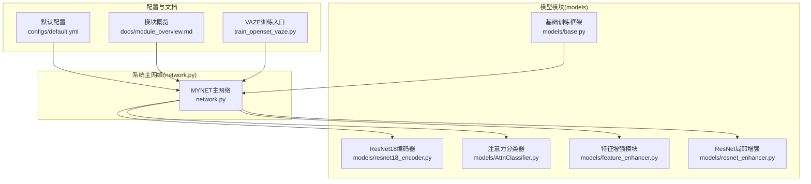
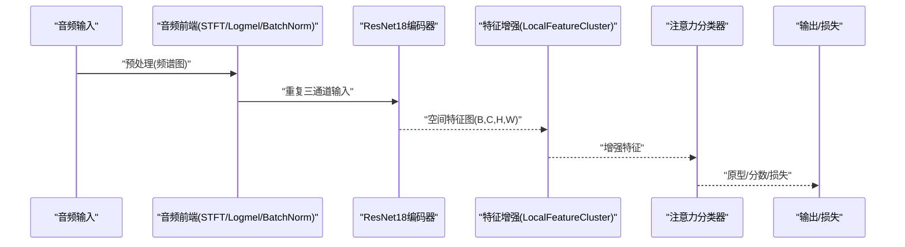
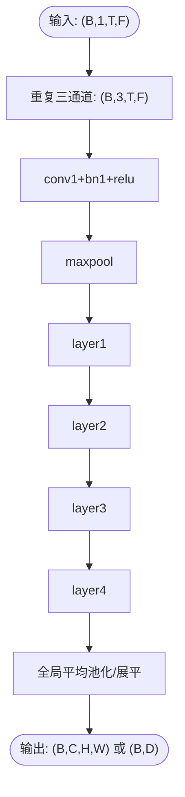
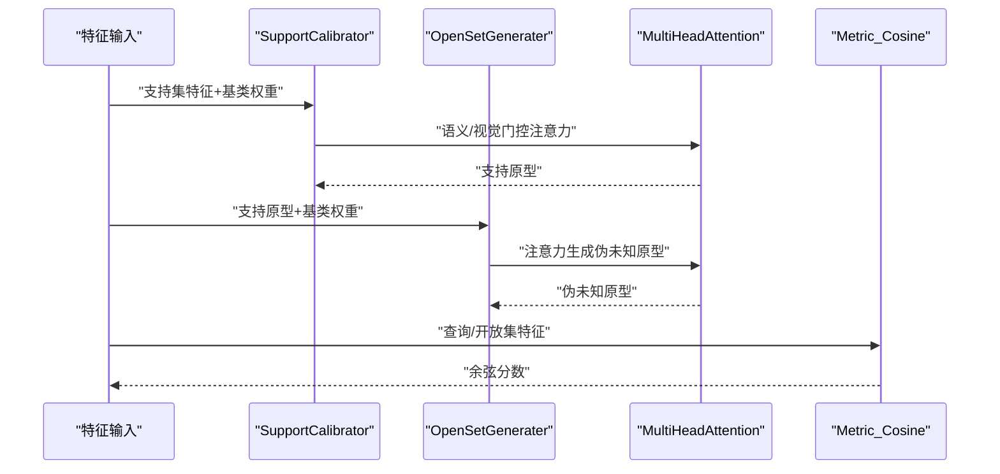
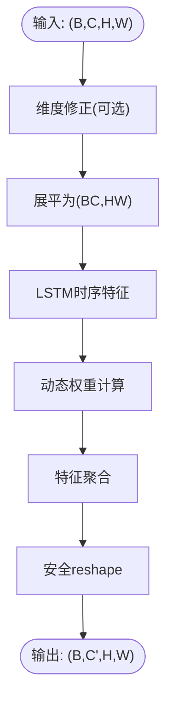
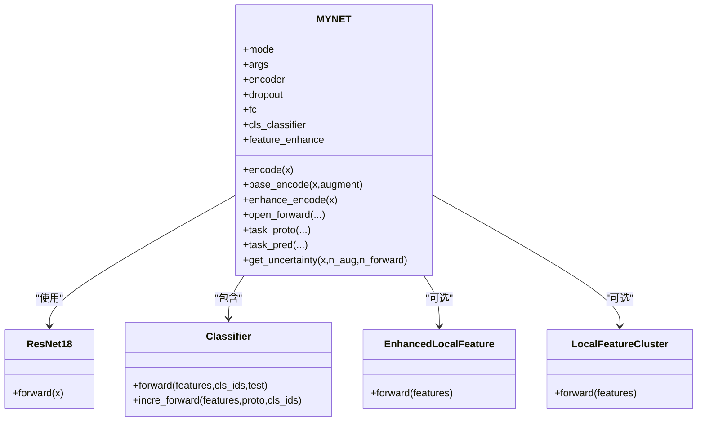
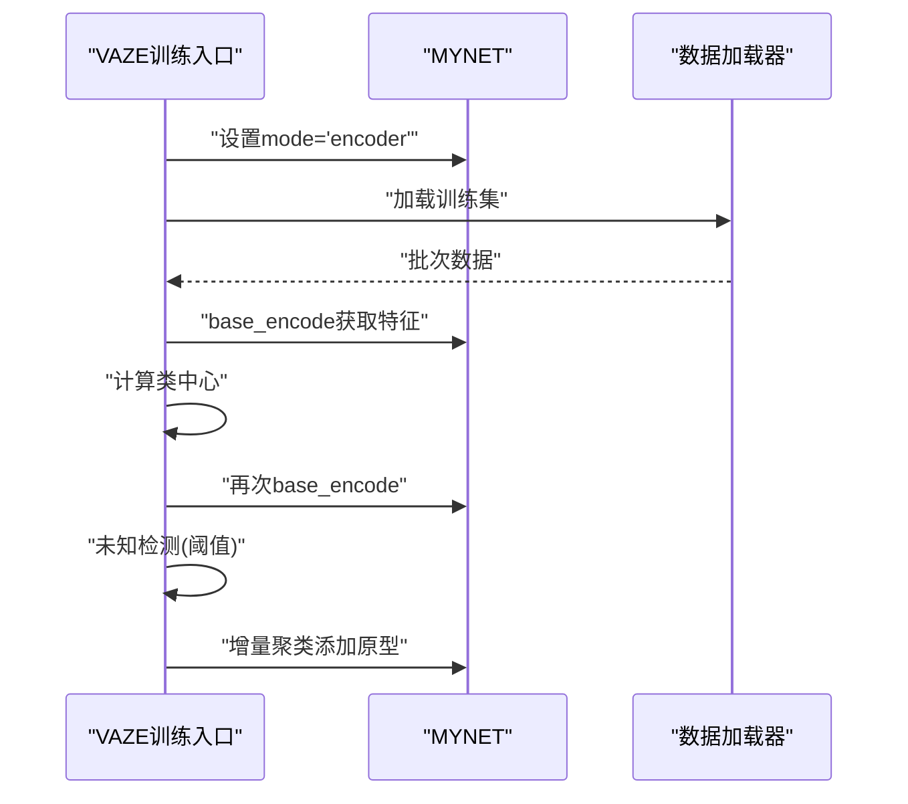
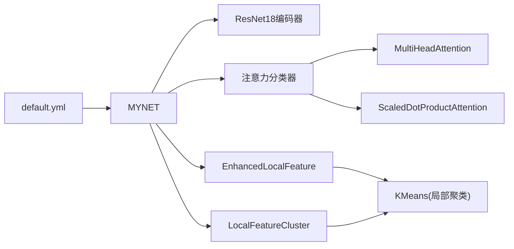

# 模块设计

<cite>
**本文引用的文件列表**
- [resnet18_encoder.py](file://models/resnet18_encoder.py)
- [AttnClassifier.py](file://models/AttnClassifier.py)
- [feature_enhancer.py](file://models/feature_enhancer.py)
- [resnet_enhancer.py](file://models/resnet_enhancer.py)
- [network.py](file://network.py)
- [base.py](file://models/base.py)
- [module_overview.md](file://docs/module_overview.md)
- [default.yml](file://configs/default.yml)
- [train_openset_vaze.py](file://train_openset_vaze.py)
</cite>

## 目录
1. [简介](#简介)
2. [项目结构](#项目结构)
3. [核心组件](#核心组件)
4. [架构总览](#架构总览)
5. [详细组件分析](#详细组件分析)
6. [依赖关系分析](#依赖关系分析)
7. [性能考量](#性能考量)
8. [故障排查指南](#故障排查指南)
9. [结论](#结论)
10. [附录](#附录)

## 简介
本文件面向VAZE系统的模块设计，聚焦以下核心模块及其协作关系：
- ResNet18编码器：图像域卷积骨干，将Mel频谱图映射为高维特征。
- 注意力分类器：多头注意力与语义门控结合的原型学习与未知原型生成。
- 特征增强模块：局部聚类与时空一致性增强，提升空间细节与时序稳定性。
- 系统主网络MYNET：音频前端、编码器、原型分类器与推理模式的统一调度。

文档将从接口设计、数据流、处理流程、性能特性与可扩展性等方面进行系统化说明，并提供模块级技术参考与集成指南。

## 项目结构
- models目录包含骨干网络、注意力分类器、特征增强与基础训练框架。
- network.py定义MYNET主网络，整合音频前端、编码器与分类器。
- configs提供默认超参，docs给出模块概览与实验计划。
- train_openset_vaze.py提供开集VAZE思路的训练与评估入口。

图表来源
- [network.py:18-36](file://network.py#L18-L36)
- [resnet18_encoder.py:128-143](file://models/resnet18_encoder.py#L128-L143)
- [AttnClassifier.py:38-118](file://models/AttnClassifier.py#L38-L118)
- [feature_enhancer.py:27-93](file://models/feature_enhancer.py#L27-L93)
- [resnet_enhancer.py:51-172](file://models/resnet_enhancer.py#L51-L172)
- [base.py:27-254](file://models/base.py#L27-L254)
- [default.yml:1-88](file://configs/default.yml#L1-L88)
- [module_overview.md:1-51](file://docs/module_overview.md#L1-L51)
- [train_openset_vaze.py:420-481](file://train_openset_vaze.py#L420-L481)

章节来源
- [module_overview.md:1-51](file://docs/module_overview.md#L1-L51)
- [default.yml:1-88](file://configs/default.yml#L1-L88)

## 核心组件
- ResNet18编码器：提供预训练卷积骨干，支持多种变体，输出空间特征图。
- 注意力分类器：支持集原型校准、未知原型生成、余弦度量打分与增量推理。
- 特征增强模块：时序约束与局部聚类，提升空间细节与时序稳定性。
- MYNET主网络：音频前端（STFT/Logmel）、编码器、原型分类器与多模式推理。

章节来源
- [resnet18_encoder.py:240-334](file://models/resnet18_encoder.py#L240-L334)
- [AttnClassifier.py:38-118](file://models/AttnClassifier.py#L38-L118)
- [feature_enhancer.py:27-93](file://models/feature_enhancer.py#L27-L93)
- [network.py:18-36](file://network.py#L18-L36)

## 架构总览
MYNET将音频信号经STFT与Logmel转为频谱图，重复三通道后送入ResNet18编码器，得到空间特征图。根据模式选择，可进入“encoder”“openmeta”等模式，分别进行特征提取与开集元训练。注意力分类器在开集场景下生成支持原型与伪未知原型，结合余弦度量进行分类与未知检测。

图表来源
- [network.py:471-503](file://network.py#L471-L503)
- [network.py:290-311](file://network.py#L290-L311)
- [resnet_enhancer.py:51-172](file://models/resnet_enhancer.py#L51-L172)
- [AttnClassifier.py:38-118](file://models/AttnClassifier.py#L38-L118)

## 详细组件分析

### ResNet18编码器
- 结构要点
  - 基础块与瓶颈块可选，支持替换步幅为膨胀卷积。
  - 默认包含四层残差堆叠，输出空间特征图。
  - 支持加载ImageNet预训练权重（移除分类头）。
- 接口与数据流
  - 输入：(B, 1, T, F) → 重复三通道 → (B, 3, T, F)
  - 输出：(B, C, H, W)，可进一步池化或送入分类器。
- 性能与可扩展性
  - 预训练权重加速收敛；可替换为其他ResNet变体。
  - 通过插桩可在中间层进行特征增强（如layer3）。

图表来源
- [resnet18_encoder.py:240-334](file://models/resnet18_encoder.py#L240-L334)
- [network.py:471-503](file://network.py#L471-L503)

章节来源
- [resnet18_encoder.py:240-334](file://models/resnet18_encoder.py#L240-L334)
- [resnet18_encoder.py:337-471](file://models/resnet18_encoder.py#L337-L471)

### 注意力分类器（多头注意力与原型学习）
- 组件构成
  - SupportCalibrator：支持集原型校准，支持语义门控与注意力融合。
  - OpenSetGenerater：伪未知原型生成，支持不同聚合策略。
  - MultiHeadAttention：多头缩放点积注意力，支持语义分支。
  - Metric_Cosine：余弦相似度打分，温度参数可学习。
- 接口与数据流
  - 输入：支持集特征、查询集特征、开放集特征、基类权重。
  - 输出：支持原型、伪未知原型、查询/开放集分数、功能单位距离损失。
- 处理流程
  - 支持集均值与噪声注入，生成支持原型。
  - 基于支持原型与基类权重，生成伪未知原型。
  - 余弦度量打分，结合功能单位距离损失进行分类与未知检测。

图表来源
- [AttnClassifier.py:121-186](file://models/AttnClassifier.py#L121-L186)
- [AttnClassifier.py:188-271](file://models/AttnClassifier.py#L188-L271)
- [AttnClassifier.py:274-327](file://models/AttnClassifier.py#L274-L327)
- [AttnClassifier.py:352-369](file://models/AttnClassifier.py#L352-L369)

章节来源
- [AttnClassifier.py:38-118](file://models/AttnClassifier.py#L38-L118)
- [AttnClassifier.py:121-186](file://models/AttnClassifier.py#L121-L186)
- [AttnClassifier.py:188-271](file://models/AttnClassifier.py#L188-L271)
- [AttnClassifier.py:274-327](file://models/AttnClassifier.py#L274-L327)
- [AttnClassifier.py:352-369](file://models/AttnClassifier.py#L352-L369)

### 特征增强模块（局部聚类与时空一致性）
- EnhancedLocalFeature
  - LSTM时序特征提取，线性映射至特征维。
  - 动态聚类权重计算，基于时序与空间相似度。
  - 聚合增强特征并安全reshape，保持空间结构。
- TemporalConstraint
  - LSTM+注意力的时序约束，对序列进行加权聚合。
- LocalFeatureCluster（ResNet增强）
  - 增强位置编码，空间权重网络，残差融合。
  - 批量KMeans聚类，基于空间相似度加权中心。
  - 融合聚类特征与原增强特征，稳定训练。

图表来源
- [feature_enhancer.py:27-93](file://models/feature_enhancer.py#L27-L93)
- [resnet_enhancer.py:51-172](file://models/resnet_enhancer.py#L51-L172)

章节来源
- [feature_enhancer.py:27-93](file://models/feature_enhancer.py#L27-L93)
- [resnet_enhancer.py:51-172](file://models/resnet_enhancer.py#L51-L172)

### MYNET主网络与模式
- 模式
  - encoder：仅特征提取，输出全局特征或原型头。
  - openmeta：开集元训练，动态标签分配与未知检测。
- 关键流程
  - 音频前端：STFT/Logmel/BatchNorm，重复三通道。
  - 编码器：ResNet18，可插桩中间层增强。
  - 分类器：注意力分类器，支持原型学习与未知生成。
  - 不确定性：MC Dropout估计，用于课程学习或重加权。

图表来源
- [network.py:18-36](file://network.py#L18-L36)
- [network.py:471-503](file://network.py#L471-L503)
- [AttnClassifier.py:38-118](file://models/AttnClassifier.py#L38-L118)
- [feature_enhancer.py:27-93](file://models/feature_enhancer.py#L27-L93)
- [resnet_enhancer.py:51-172](file://models/resnet_enhancer.py#L51-L172)

章节来源
- [network.py:18-36](file://network.py#L18-L36)
- [network.py:102-151](file://network.py#L102-L151)
- [network.py:153-202](file://network.py#L153-L202)
- [network.py:471-503](file://network.py#L471-L503)

### VAZE开集思路与集成
- VAZE训练入口提供闭集分类训练、类中心计算、未知样本检测与增量原型添加的流水线。
- 与MYNET配合，可直接使用其base_encode获取特征，再进行VAZE的阈值判定与聚类增量。

图表来源
- [train_openset_vaze.py:86-198](file://train_openset_vaze.py#L86-L198)
- [network.py:486-503](file://network.py#L486-L503)

章节来源
- [train_openset_vaze.py:86-198](file://train_openset_vaze.py#L86-L198)

## 依赖关系分析
- MYNET依赖ResNet18编码器、注意力分类器与特征增强模块。
- 注意力分类器内部使用多头注意力与缩放点积注意力。
- 特征增强模块依赖KMeans进行局部聚类。
- 配置文件default.yml提供训练、网络与数据加载器的关键超参。

图表来源
- [network.py:18-36](file://network.py#L18-L36)
- [AttnClassifier.py:274-327](file://models/AttnClassifier.py#L274-L327)
- [feature_enhancer.py:27-93](file://models/feature_enhancer.py#L27-L93)
- [resnet_enhancer.py:51-172](file://models/resnet_enhancer.py#L51-L172)
- [default.yml:1-88](file://configs/default.yml#L1-L88)

章节来源
- [default.yml:1-88](file://configs/default.yml#L1-L88)

## 性能考量
- 计算复杂度
  - ResNet18编码器：主要瓶颈在卷积与池化，适合批处理加速。
  - 多头注意力：O(B*H*W*(H*W+C))，注意显存与内存峰值。
  - 局部聚类：KMeans在GPU上需谨慎处理CPU-GPU传输。
- 内存与显存
  - 使用自适应池化减少全连接层参数。
  - 特征增强模块中批量KMeans减少CPU交互次数。
- 不确定性估计
  - MC Dropout在推理时启用Dropout，提高不确定性估计稳定性。

## 故障排查指南
- 形状不匹配
  - 确认输入频谱图经重复三通道后与编码器期望一致。
  - 特征增强模块中维度修正与安全reshape路径。
- 设备一致性
  - 局部聚类模块在首次使用时会将参数移动到设备，确保后续输入在同一设备。
- 未知检测阈值
  - VAZE入口提供概率阈值与余弦阈值，可根据数据集微调。

章节来源
- [feature_enhancer.py:49-93](file://models/feature_enhancer.py#L49-L93)
- [resnet_enhancer.py:168-172](file://models/resnet_enhancer.py#L168-L172)
- [train_openset_vaze.py:134-170](file://train_openset_vaze.py#L134-L170)

## 结论
VAZE系统通过ResNet18编码器、注意力分类器与特征增强模块的协同，实现了稳健的特征提取、原型学习与未知检测。MYNET统一调度各模块，支持多种模式与增量场景。模块间接口清晰、数据流明确，具备良好的可重用性与扩展性，便于在不同数据集与任务中快速集成与迭代。

## 附录
- 集成指南
  - 在现有训练脚本中引入MYNET，设置mode为'encoder'或'openmeta'。
  - 使用base_encode获取特征，结合VAZE入口进行未知检测与增量原型添加。
  - 调整default.yml中的网络与训练超参，适配具体任务。

章节来源
- [module_overview.md:1-51](file://docs/module_overview.md#L1-L51)
- [default.yml:1-88](file://configs/default.yml#L1-L88)
- [train_openset_vaze.py:420-481](file://train_openset_vaze.py#L420-L481)