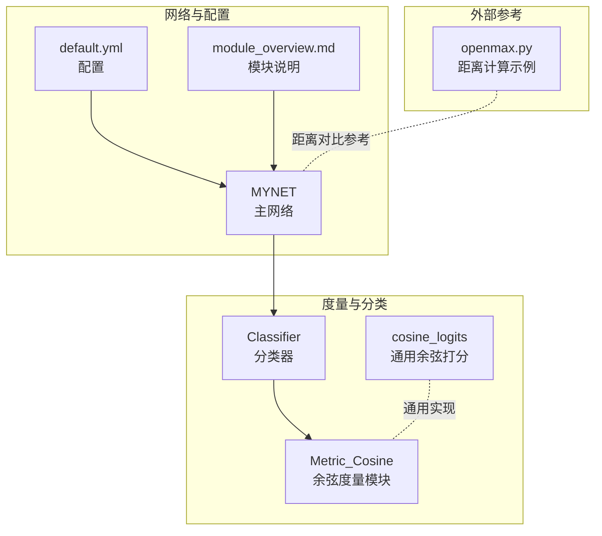
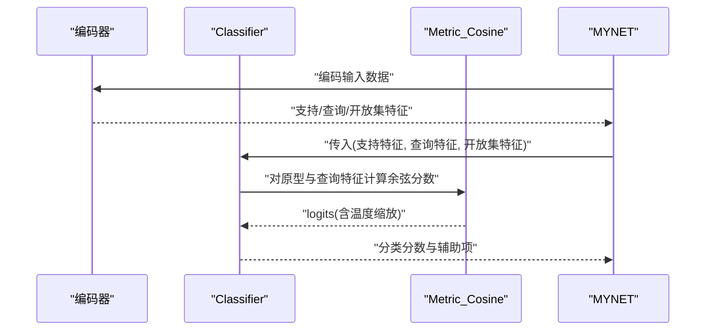
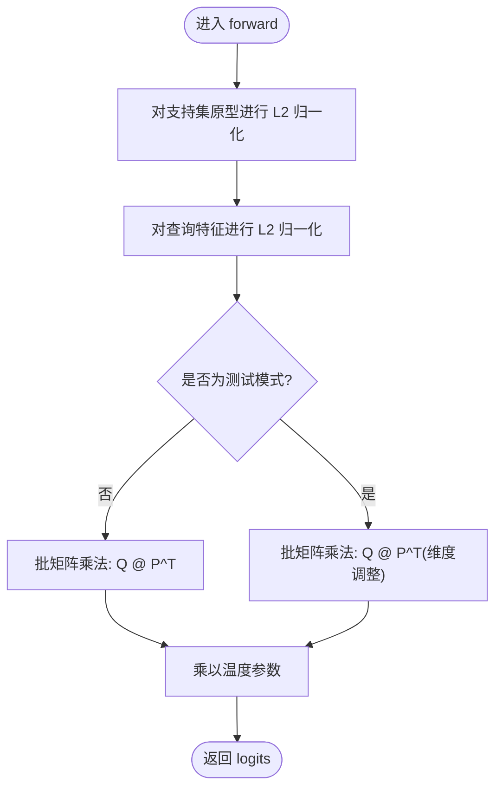
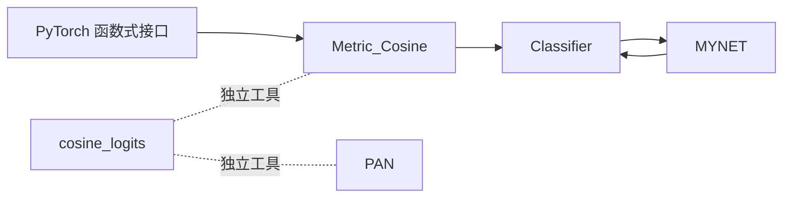

# 余弦距离度量

<cite>
**本文引用的文件**   
- [models/AttnClassifier.py](file://models/AttnClassifier.py)
- [models/baselines/base.py](file://models/baselines/base.py)
- [models/baselines/cil_methods/pan.py](file://models/baselines/cil_methods/pan.py)
- [network.py](file://network.py)
- [configs/default.yml](file://configs/default.yml)
- [docs/module_overview.md](file://docs/module_overview.md)
- [openmax.py](file://openmax.py)
</cite>

## 目录
1. [简介](#简介)
2. [项目结构](#项目结构)
3. [核心组件](#核心组件)
4. [架构总览](#架构总览)
5. [详细组件分析](#详细组件分析)
6. [依赖分析](#依赖分析)
7. [性能考量](#性能考量)
8. [故障排查指南](#故障排查指南)
9. [结论](#结论)
10. [附录](#附录)

## 简介
本技术文档围绕余弦距离度量模块展开，重点解析 Metric_Cosine 如何计算特征向量之间的余弦相似度，涵盖以下主题：
- 特征归一化与温度参数的作用
- 训练与测试模式下 logit 计算的差异（张量维度变换与批量处理）
- 温度参数对分类置信度的影响与调优策略
- 余弦相似度在原型分类中的优势与应用场景
- 数学公式与实现细节
- 度量模块的配置参数与使用方法

## 项目结构
与余弦度量相关的核心代码分布在如下模块：
- 余弦度量实现：models/AttnClassifier.py 中的 Metric_Cosine
- 通用余弦打分函数：models/baselines/base.py 中的 cosine_logits
- 典型使用示例：models/baselines/cil_methods/pan.py 中的 classify 调用
- 网络集成与前向流程：network.py 中的 MYNET 与 Classifier
- 配置项：configs/default.yml 中的 temperature 与分类模式
- 文档概览：docs/module_overview.md

**图表来源**
- [models/AttnClassifier.py:352-368](file://models/AttnClassifier.py#L352-L368)
- [models/baselines/base.py:61-65](file://models/baselines/base.py#L61-L65)
- [models/baselines/cil_methods/pan.py:105-108](file://models/baselines/cil_methods/pan.py#L105-L108)
- [network.py:18-36](file://network.py#L18-L36)
- [configs/default.yml:42-45](file://configs/default.yml#L42-L45)
- [docs/module_overview.md:17-21](file://docs/module_overview.md#L17-L21)
- [openmax.py:7-32](file://openmax.py#L7-L32)

**章节来源**
- [models/AttnClassifier.py:352-368](file://models/AttnClassifier.py#L352-L368)
- [models/baselines/base.py:61-65](file://models/baselines/base.py#L61-L65)
- [models/baselines/cil_methods/pan.py:105-108](file://models/baselines/cil_methods/pan.py#L105-L108)
- [network.py:18-36](file://network.py#L18-L36)
- [configs/default.yml:42-45](file://configs/default.yml#L42-L45)
- [docs/module_overview.md:17-21](file://docs/module_overview.md#L17-L21)
- [openmax.py:7-32](file://openmax.py#L7-L32)

## 核心组件
- Metric_Cosine：基于余弦相似度的度量模块，负责对支持集原型与查询特征进行打分，并应用温度参数缩放。
- cosine_logits：通用的余弦打分函数，提供标准化后的特征与原型的内积乘以温度。
- Classifier：在开集元训练框架中调用 Metric_Cosine，整合支持集原型、伪未知原型与查询特征，输出分类分数。
- MYNET：主网络封装，集成编码器、分类器与任务前向逻辑。

**章节来源**
- [models/AttnClassifier.py:352-368](file://models/AttnClassifier.py#L352-L368)
- [models/baselines/base.py:61-65](file://models/baselines/base.py#L61-L65)
- [network.py:18-36](file://network.py#L18-L36)

## 架构总览
余弦度量在系统中的调用链路如下：
- 支持集与查询集经编码器提取特征
- Classifier 调用 Metric_Cosine 对原型与查询特征进行余弦打分
- 温度参数对 logits 进行缩放，影响分类置信度分布
- 在开集场景中，结合伪未知原型与动态标签分配提升判别能力

**图表来源**
- [network.py:102-151](file://network.py#L102-L151)
- [models/AttnClassifier.py:47-93](file://models/AttnClassifier.py#L47-L93)
- [models/AttnClassifier.py:352-368](file://models/AttnClassifier.py#L352-L368)

## 详细组件分析

### Metric_Cosine 实现与数学原理
- 特征归一化：对支持集原型与查询特征沿最后一维进行 L2 归一化，确保余弦相似度仅由夹角决定。
- 余弦相似度计算：使用批矩阵乘法计算查询特征与原型的余弦相似度（即标准化后的内积）。
- 温度缩放：将 logits 乘以温度参数，控制分布的锐利程度与置信度范围。
- 训练与测试差异：
  - 训练模式：查询特征与原型按批次维度进行匹配，logits 形状为 [B, N_query, N_way]。
  - 测试模式：对原型进行转置与维度调整，适配推理时的批处理结构，logits 形状保持一致但内部维度变换不同。

**图表来源**
- [models/AttnClassifier.py:357-367](file://models/AttnClassifier.py#L357-L367)

**章节来源**
- [models/AttnClassifier.py:352-368](file://models/AttnClassifier.py#L352-L368)

### 通用余弦打分函数 cosine_logits
- 输入：features（查询特征）、protos（原型）、temperature（温度）
- 处理：分别对 features 与 protos 进行 L2 归一化，再计算 temperature * (f @ p^T)
- 适用场景：无需额外模块封装的快速余弦打分，常用于增量学习与开集评分

**章节来源**
- [models/baselines/base.py:61-65](file://models/baselines/base.py#L61-L65)

### 在 PAN 方法中的使用
- PAN 在分类阶段使用 cosine_logits 对已知类原型进行余弦打分，并通过温度参数控制置信度分布
- 温度参数在 PAN 中默认较高，有助于提升判别锐利度

**章节来源**
- [models/baselines/cil_methods/pan.py:105-108](file://models/baselines/cil_methods/pan.py#L105-L108)

### 网络集成与前向流程
- MYNET 在 open_forward 中组织支持/查询/开放集特征，调用 Classifier 获取余弦分数与原型
- Classifier 在训练与测试模式下分别处理原型与查询特征的维度与转置，确保 logits 形状一致

**章节来源**
- [network.py:102-151](file://network.py#L102-L151)
- [models/AttnClassifier.py:47-93](file://models/AttnClassifier.py#L47-L93)

## 依赖分析
- Metric_Cosine 依赖 PyTorch 的函数式接口进行归一化与矩阵乘法
- Classifier 依赖 Metric_Cosine 与支持集/伪未知原型的组织方式
- MYNET 依赖 Classifier 并在 open_forward 中协调各阶段的特征与标签
- cosine_logits 作为独立工具函数，被多个方法模块复用

**图表来源**
- [models/AttnClassifier.py:352-368](file://models/AttnClassifier.py#L352-L368)
- [models/baselines/base.py:61-65](file://models/baselines/base.py#L61-L65)
- [models/baselines/cil_methods/pan.py:105-108](file://models/baselines/cil_methods/pan.py#L105-L108)
- [network.py:18-36](file://network.py#L18-L36)

**章节来源**
- [models/AttnClassifier.py:352-368](file://models/AttnClassifier.py#L352-L368)
- [models/baselines/base.py:61-65](file://models/baselines/base.py#L61-L65)
- [models/baselines/cil_methods/pan.py:105-108](file://models/baselines/cil_methods/pan.py#L105-L108)
- [network.py:18-36](file://network.py#L18-L36)

## 性能考量
- 归一化成本：L2 归一化在特征维度上进行，对高维特征（如 512 维）计算开销可控
- 矩阵乘法复杂度：批矩阵乘法 O(B * N_query * N_way * D)，受 D 与 N_way 影响较大
- 温度缩放：温度过大导致分布更尖锐、置信度更高但可能过拟合；温度过小导致分布平坦、泛化更好但置信度降低
- 批处理与内存：在大规模 n-way/n-query 场景下，注意 logits 的显存占用与梯度回传

[本节为通用性能讨论，不直接分析具体文件]

## 故障排查指南
- 归一化异常：若出现 NaN 或 Inf，检查输入特征是否存在零向量或极端数值
- 维度不匹配：确认支持集与查询特征的最后维度一致，且 batch/way/query 维度符合预期
- 温度过大/过小：根据验证集表现调整温度参数，观察 AUROC 与 Acc 的平衡
- 与距离度量对比：可参考 openmax.py 中的欧氏距离与余弦距离计算，辅助理解度量差异

**章节来源**
- [openmax.py:7-32](file://openmax.py#L7-L32)

## 结论
Metric_Cosine 通过特征归一化与温度缩放，实现了稳健的余弦相似度打分，在原型分类与开集元训练中具有良好的判别能力。合理设置温度参数与批处理维度，可在准确率与置信度之间取得平衡。cosine_logits 作为通用实现，便于在多种方法中统一使用余弦度量。

[本节为总结性内容，不直接分析具体文件]

## 附录

### 数学公式与实现要点
- 余弦相似度：对向量 x 与 y 进行 L2 归一化后计算其内积
- 温度缩放：logits ← temperature × cos(features, protos)
- 批矩阵乘法：查询特征与原型的余弦相似度通过矩阵乘法高效计算

**章节来源**
- [models/AttnClassifier.py:357-367](file://models/AttnClassifier.py#L357-L367)
- [models/baselines/base.py:61-65](file://models/baselines/base.py#L61-L65)

### 配置参数与使用方法
- 温度参数：在 configs/default.yml 中设置 network.temperature，默认为 1
- 分类模式：network.base_mode 与 network.new_mode 支持 ft_cos（余弦分类器）
- 使用方法：在 MYNET 的 Classifier 中直接调用 Metric_Cosine，或在 PAN 等方法中使用 cosine_logits

**章节来源**
- [configs/default.yml:42-45](file://configs/default.yml#L42-L45)
- [docs/module_overview.md:17-21](file://docs/module_overview.md#L17-L21)