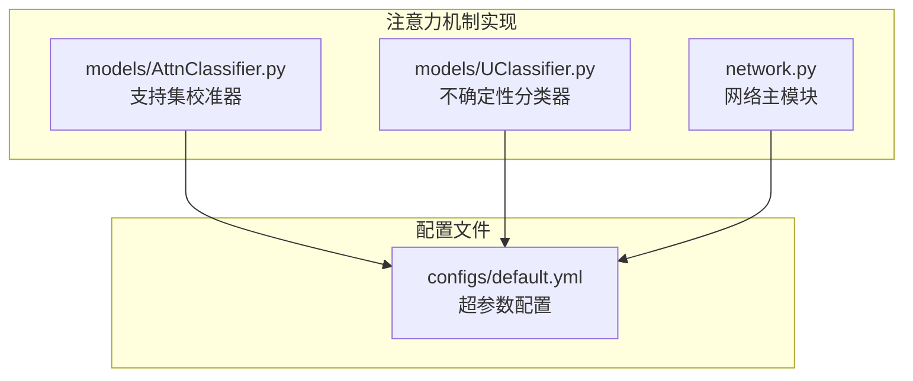
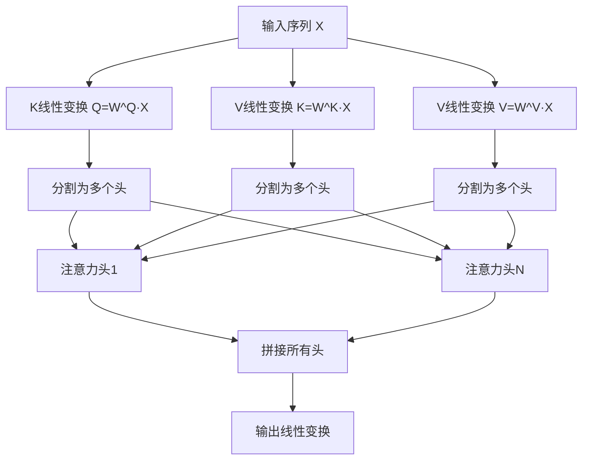
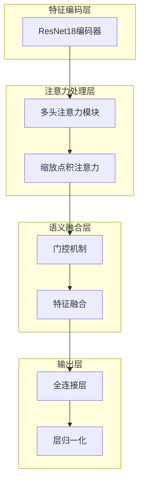
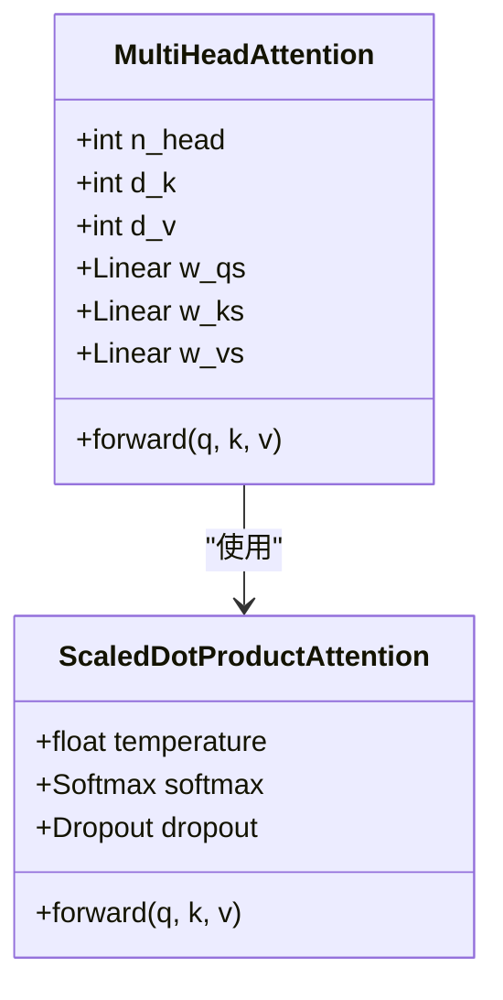
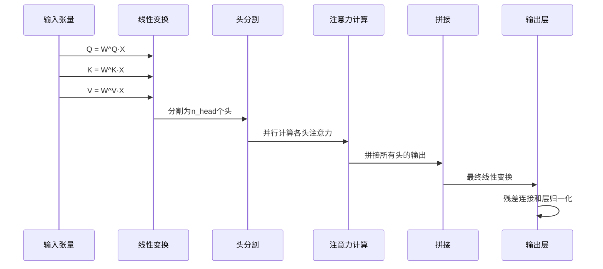
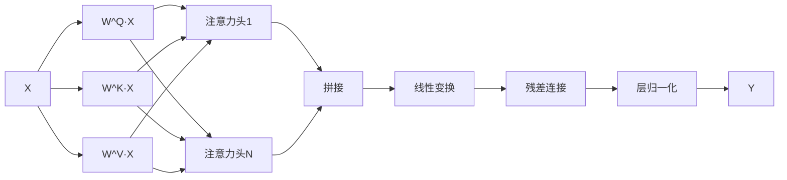
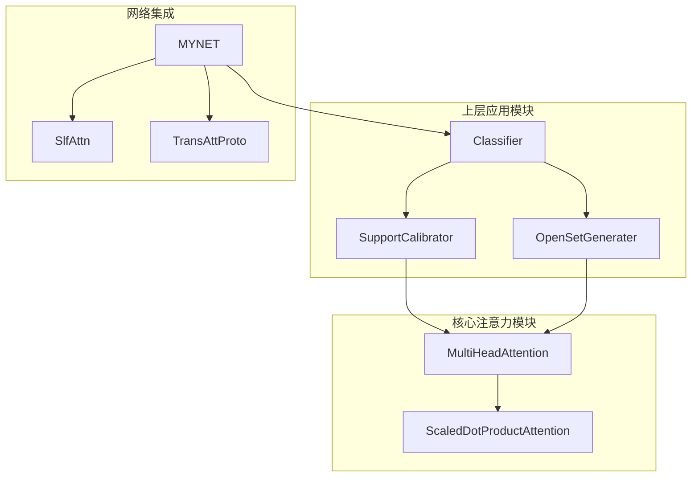

# 多头注意力机制

<cite>
**本文档引用的文件**
- [models/AttnClassifier.py](file://models/AttnClassifier.py)
- [models/UClassifier.py](file://models/UClassifier.py)
- [network.py](file://network.py)
- [configs/default.yml](file://configs/default.yml)
</cite>

## 目录
1. [简介](#简介)
2. [项目结构](#项目结构)
3. [核心组件](#核心组件)
4. [架构概览](#架构概览)
5. [详细组件分析](#详细组件分析)
6. [依赖关系分析](#依赖关系分析)
7. [性能考虑](#性能考虑)
8. [故障排除指南](#故障排除指南)
9. [结论](#结论)

## 简介

本文件详细阐述了代码库中实现的多头注意力机制，重点分析了Scaled Dot-Product Attention的数学原理和实现细节。多头注意力机制是Transformer架构的核心组件，通过并行计算多个注意力头来捕获不同子空间的信息，显著提升了模型的表达能力。

该实现包含了完整的Q、K、V矩阵线性变换过程，多头投影机制，注意力分数计算，softmax归一化，以及输出拼接等关键步骤。文档将为开发者提供深入的技术理解，并包含可视化图解和性能优化建议。

## 项目结构

多头注意力机制在该项目中主要分布在三个核心文件中：



**图表来源**
- [models/AttnClassifier.py:274-350](file://models/AttnClassifier.py#L274-L350)
- [models/UClassifier.py:287-363](file://models/UClassifier.py#L287-L363)
- [network.py:538-585](file://network.py#L538-L585)

**章节来源**
- [models/AttnClassifier.py:1-369](file://models/AttnClassifier.py#L1-L369)
- [models/UClassifier.py:1-405](file://models/UClassifier.py#L1-L405)
- [network.py:1-724](file://network.py#L1-L724)

## 核心组件

### Scaled Dot-Product Attention

Scaled Dot-Product Attention是注意力机制的基础计算单元，其数学公式为：

```
Attention(Q, K, V) = softmax((QK^T) / sqrt(d_k)) * V
```

其中：
- Q ∈ R^(m×d_k) 是查询矩阵
- K ∈ R^(n×d_k) 是键矩阵  
- V ∈ R^(n×d_v) 是值矩阵
- d_k 和 d_v 分别是键/查询维度和值维度

**章节来源**
- [models/AttnClassifier.py:331-350](file://models/AttnClassifier.py#L331-L350)
- [models/UClassifier.py:344-363](file://models/UClassifier.py#L344-L363)
- [network.py:519-536](file://network.py#L519-L536)

### Multi-Head Attention

Multi-Head Attention通过并行计算多个注意力头来增强模型的表示能力：



**图表来源**
- [models/AttnClassifier.py:299-326](file://models/AttnClassifier.py#L299-L326)
- [models/UClassifier.py:312-339](file://models/UClassifier.py#L312-L339)
- [network.py:561-584](file://network.py#L561-L584)

**章节来源**
- [models/AttnClassifier.py:274-327](file://models/AttnClassifier.py#L274-L327)
- [models/UClassifier.py:287-340](file://models/UClassifier.py#L287-L340)
- [network.py:538-585](file://network.py#L538-L585)

## 架构概览

多头注意力机制在整个系统中的位置和作用：



**图表来源**
- [network.py:18-34](file://network.py#L18-L34)
- [models/AttnClassifier.py:121-186](file://models/AttnClassifier.py#L121-L186)
- [models/UClassifier.py:134-199](file://models/UClassifier.py#L134-L199)

## 详细组件分析

### 数学原理详解

#### 1. 线性变换过程

每个注意力头都包含三个独立的线性变换：



**图表来源**
- [models/AttnClassifier.py:274-350](file://models/AttnClassifier.py#L274-L350)
- [models/UClassifier.py:287-363](file://models/UClassifier.py#L287-L363)

#### 2. 注意力权重计算

注意力权重的计算公式为：

```
Attention(Q, K, V) = softmax((QK^T) / √d_k) * V
```

其中温度参数控制softmax的饱和程度，防止点积值过大导致梯度消失。

#### 3. 多头并行计算

多头注意力的并行计算流程：



**图表来源**
- [models/AttnClassifier.py:308-321](file://models/AttnClassifier.py#L308-L321)
- [models/UClassifier.py:321-333](file://models/UClassifier.py#L321-L333)
- [network.py:568-579](file://network.py#L568-L579)

**章节来源**
- [models/AttnClassifier.py:299-326](file://models/AttnClassifier.py#L299-L326)
- [models/UClassifier.py:312-339](file://models/UClassifier.py#L312-L339)
- [network.py:561-584](file://network.py#L561-L584)

### 实现细节分析

#### 1. 参数初始化策略

实现采用了精心设计的参数初始化策略：

- **权重初始化**: 使用正态分布初始化，标准差为 `sqrt(2.0/(d_in + d_out))`
- **输出层初始化**: 使用Xavier初始化，确保梯度的稳定传播
- **温度参数**: 设置为 `sqrt(d_k)`，平衡注意力分布的锐利程度

#### 2. 内存优化策略

实现采用了高效的内存管理技术：

- **视图操作**: 使用 `.view()` 和 `.contiguous()` 减少内存拷贝
- **张量重排**: 通过 `.permute()` 实现高效的数据重排
- **批处理优化**: 将多个头的计算合并到单个批处理中

#### 3. 残差连接和层归一化



**图表来源**
- [models/AttnClassifier.py:306-325](file://models/AttnClassifier.py#L306-L325)
- [models/UClassifier.py:319-338](file://models/UClassifier.py#L319-L338)
- [network.py:567-582](file://network.py#L567-L582)

**章节来源**
- [models/AttnClassifier.py:284-297](file://models/AttnClassifier.py#L284-L297)
- [models/UClassifier.py:296-309](file://models/UClassifier.py#L296-L309)
- [network.py:547-559](file://network.py#L547-L559)

## 依赖关系分析

多头注意力机制在项目中的依赖关系：



**图表来源**
- [models/AttnClassifier.py:121-186](file://models/AttnClassifier.py#L121-L186)
- [models/UClassifier.py:134-199](file://models/UClassifier.py#L134-L199)
- [network.py:18-34](file://network.py#L18-L34)

**章节来源**
- [models/AttnClassifier.py:121-186](file://models/AttnClassifier.py#L121-L186)
- [models/UClassifier.py:134-199](file://models/UClassifier.py#L134-L199)
- [network.py:18-34](file://network.py#L18-L34)

## 性能考虑

### 参数配置指南

基于项目中的实际实现，推荐的注意力机制配置参数：

| 参数类型 | 推荐值 | 说明 |
|---------|--------|------|
| 注意力头数(n_head) | 1 | 根据项目需求调整，1适合基础实现 |
| 查询/键维度(d_k) | 512 | 与特征维度保持一致 |
| 值维度(d_v) | 512 | 与特征维度保持一致 |
| 温度参数 | sqrt(d_k) | 默认实现使用此值 |
| Dropout比率 | 0.1-0.3 | 控制过拟合程度 |
| 层归一化 | 启用 | 改善训练稳定性 |

### 性能优化建议

#### 1. 内存优化
- 使用 `.contiguous()` 确保张量内存连续性
- 合理使用 `.view()` 替代 `.reshape()` 以避免不必要的拷贝
- 批处理大小与注意力头数的平衡

#### 2. 计算效率
- 利用矩阵乘法的并行特性
- 避免不必要的张量复制
- 使用适当的数值精度（FP32 vs FP16）

#### 3. 训练稳定性
- 合理设置温度参数防止softmax饱和
- 使用层归一化改善梯度流动
- 适当的dropout比率防止过拟合

**章节来源**
- [configs/default.yml:42-45](file://configs/default.yml#L42-L45)
- [network.py:522-536](file://network.py#L522-L536)

## 故障排除指南

### 常见问题及解决方案

#### 1. 维度不匹配错误
**症状**: 张量维度不兼容导致运行时错误
**解决方案**: 
- 检查 `d_model[0]`, `d_model[1]`, `d_model[-1]` 是否正确传递
- 确认线性变换层的输入输出维度匹配

#### 2. 内存溢出问题
**症状**: GPU内存不足导致程序崩溃
**解决方案**:
- 减少批量大小或注意力头数
- 使用梯度检查点技术
- 优化张量操作减少中间变量

#### 3. 训练不稳定
**症状**: 损失函数震荡或收敛困难
**解决方案**:
- 调整温度参数和学习率
- 检查层归一化的使用
- 确保适当的梯度裁剪

#### 4. 注意力权重异常
**症状**: 注意力权重过于集中或分散
**解决方案**:
- 调整温度参数 `sqrt(d_k)`
- 检查softmax输入的数值范围
- 验证Q、K、V的线性变换正确性

**章节来源**
- [models/AttnClassifier.py:277-297](file://models/AttnClassifier.py#L277-L297)
- [models/UClassifier.py:290-309](file://models/UClassifier.py#L290-L309)
- [network.py:541-559](file://network.py#L541-L559)

## 结论

多头注意力机制在该项目中实现了完整的Scaled Dot-Product Attention功能，包括：

1. **完整的数学实现**: 准确实现了注意力机制的数学公式
2. **高效的并行计算**: 通过多头机制提升计算效率
3. **稳健的工程实现**: 包含适当的初始化、归一化和残差连接
4. **灵活的应用集成**: 可嵌入到不同的上层任务模块中

该实现为开发者提供了清晰的注意力机制参考实现，具有良好的可扩展性和实用性。通过合理配置参数和遵循性能优化建议，可以在各种下游任务中获得稳定的性能表现。