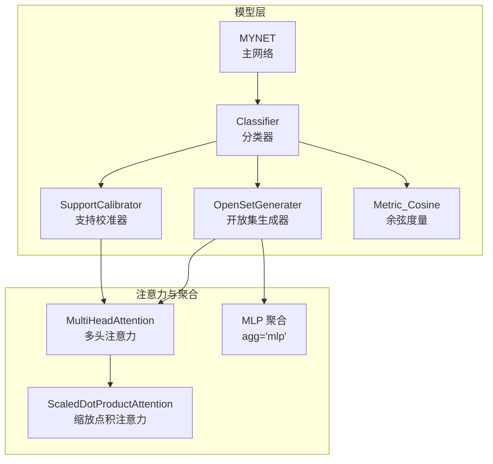
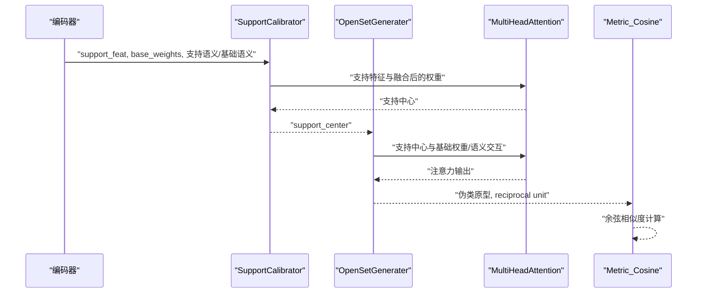
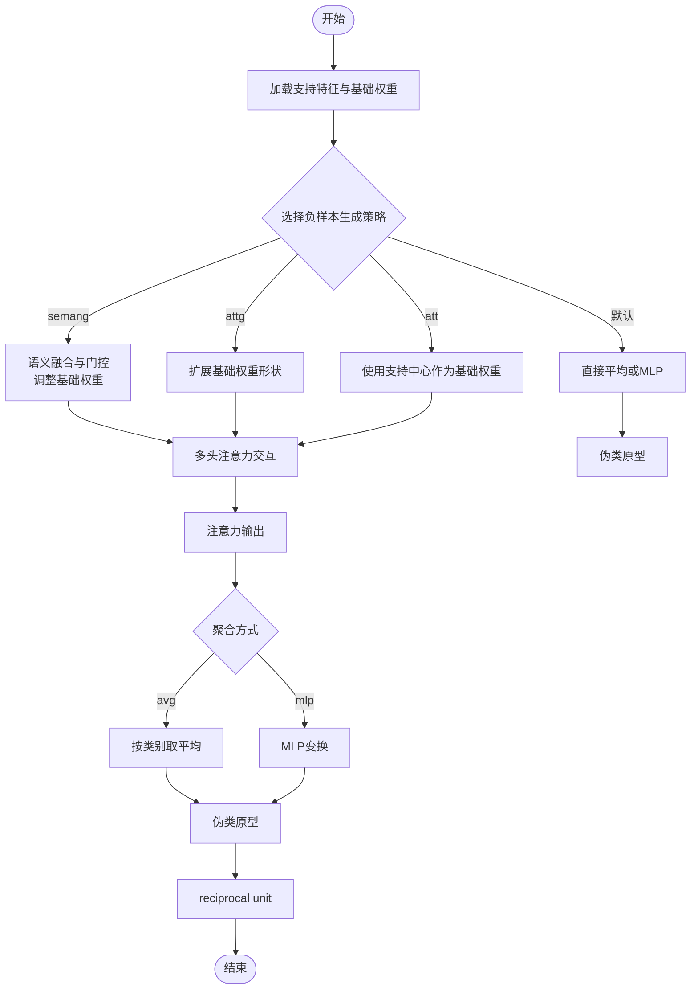
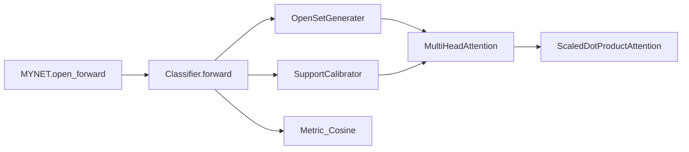

# 开放集生成器

<cite>
**本文引用的文件列表**
- [models/AttnClassifier.py](file://models/AttnClassifier.py)
- [models/UClassifier.py](file://models/UClassifier.py)
- [network.py](file://network.py)
- [train_openset_vaze.py](file://train_openset_vaze.py)
- [configs/default.yml](file://configs/default.yml)
- [test.py](file://test.py)
- [test_uncertainty.py](file://test_uncertainty.py)
</cite>

## 目录
1. [简介](#简介)
2. [项目结构](#项目结构)
3. [核心组件](#核心组件)
4. [架构总览](#架构总览)
5. [详细组件分析](#详细组件分析)
6. [依赖关系分析](#依赖关系分析)
7. [性能考量](#性能考量)
8. [故障排查指南](#故障排查指南)
9. [结论](#结论)
10. [附录](#附录)

## 简介
本技术文档围绕开放集生成器（OpenSetGenerater）展开，系统阐述其在开放集识别中的作用与实现细节。重点包括：
- 三种负样本生成策略（'semang'、'attg'、'att'）的实现原理与差异
- 支持中心与基础权重的注意力交互机制
- 聚合函数（agg='avg'或'mlp'）对生成结果的影响
- reciprocal unit（伪类原型单位）的计算与作用机制
- 开放集生成的完整算法流程图与参数配置指南
- 面向开发者的使用场景与性能调优建议

## 项目结构
该项目采用模块化设计，开放集生成器位于分类器模块中，与注意力机制、度量函数等协同工作。整体结构如下：

图表来源
- [models/AttnClassifier.py:188-369](file://models/AttnClassifier.py#L188-L369)
- [models/UClassifier.py:201-405](file://models/UClassifier.py#L201-L405)
- [network.py:18-504](file://network.py#L18-L504)

章节来源
- [models/AttnClassifier.py:188-369](file://models/AttnClassifier.py#L188-L369)
- [models/UClassifier.py:201-405](file://models/UClassifier.py#L201-L405)
- [network.py:18-504](file://network.py#L18-L504)

## 核心组件
- SupportCalibrator：基于多头注意力的支持特征校准，融合语义信息与视觉特征，生成支持中心。
- OpenSetGenerater：根据策略生成负样本（伪类）原型，并通过注意力机制与基础权重交互，得到伪类原型与reciprocal unit。
- MultiHeadAttention/ScaledDotProductAttention：实现注意力计算，支持语义分支与视觉分支的交互。
- Metric_Cosine：余弦相似度度量，用于分类与距离计算。

章节来源
- [models/AttnClassifier.py:121-369](file://models/AttnClassifier.py#L121-L369)
- [models/UClassifier.py:134-405](file://models/UClassifier.py#L134-L405)
- [network.py:519-584](file://network.py#L519-L584)

## 架构总览
下图展示了从支持集特征到伪类原型与reciprocal unit的端到端流程，以及与度量函数的结合：

图表来源
- [models/AttnClassifier.py:47-93](file://models/AttnClassifier.py#L47-L93)
- [models/AttnClassifier.py:140-185](file://models/AttnClassifier.py#L140-L185)
- [models/AttnClassifier.py:212-271](file://models/AttnClassifier.py#L212-L271)
- [models/AttnClassifier.py:352-369](file://models/AttnClassifier.py#L352-L369)

## 详细组件分析

### OpenSetGenerater 组件详解
OpenSetGenerater负责根据不同的负样本生成策略生成伪类原型，并在必要时输出reciprocal unit用于后续的距离度量。

- 参数与初始化
  - nway：支持类别数
  - featdim：特征维度
  - n_head：注意力头数
  - neg_gen_type：负样本生成策略（'semang'、'attg'、'att'）
  - agg：聚合方式（'avg'、'mlp'）

- 策略分支与注意力交互
  - semang：融合语义与视觉信息，通过门控机制调整基础权重，再经注意力得到输出。
  - attg：仅使用基础权重，重复扩展为与支持类别一致的形状，再进行注意力交互。
  - att：使用支持中心作为基础权重，形成自注意力交互。
  - 默认分支：直接对支持中心做平均或MLP变换，返回伪类中心与支持中心视图。

- 聚合函数影响
  - avg：对注意力输出按类别维度取平均，得到伪类原型。
  - mlp：通过MLP对注意力输出进行非线性变换，提升判别能力。

- reciprocal unit 的作用
  - 在分类器前向中，reciprocal unit用于与查询/开放集特征计算距离，辅助未知样本检测与阈值决策。

章节来源
- [models/AttnClassifier.py:188-271](file://models/AttnClassifier.py#L188-L271)
- [models/UClassifier.py:201-284](file://models/UClassifier.py#L201-L284)

### SupportCalibrator 组件详解
SupportCalibrator负责将支持集特征与基础权重进行融合与校准，生成支持中心。

- 语义融合（semang）
  - 将支持语义与基础语义映射到统一空间，计算任务级平均特征，通过门控（sigmoid）对视觉与语义分支进行加权融合，得到融合后的基础权重。

- 注意力计算
  - 使用MultiHeadAttention对支持特征与融合后的权重进行注意力交互，输出支持中心。

- attg/att 策略
  - attg：基础权重重复扩展，形成与支持类别一致的形状。
  - att：基础权重设为支持特征，形成自注意力。

章节来源
- [models/AttnClassifier.py:121-185](file://models/AttnClassifier.py#L121-L185)
- [models/UClassifier.py:134-198](file://models/UClassifier.py#L134-L198)

### MultiHeadAttention 与 ScaledDotProductAttention
- MultiHeadAttention
  - 实现多头注意力，分别对Q、K、V进行线性投影与重组，调用ScaledDotProductAttention计算注意力权重，再通过全连接层与残差连接输出。
- ScaledDotProductAttention
  - 计算缩放点积注意力，softmax归一化后与V相乘，得到加权特征。

章节来源
- [models/AttnClassifier.py:274-369](file://models/AttnClassifier.py#L274-L369)
- [models/UClassifier.py:287-363](file://models/UClassifier.py#L287-L363)
- [network.py:519-584](file://network.py#L519-L584)

### 算法流程图（开放集生成）

图表来源
- [models/AttnClassifier.py:188-271](file://models/AttnClassifier.py#L188-L271)
- [models/AttnClassifier.py:274-369](file://models/AttnClassifier.py#L274-L369)

## 依赖关系分析
- Classifier 依赖 SupportCalibrator 与 OpenSetGenerater，前者生成支持中心，后者生成伪类原型与reciprocal unit。
- OpenSetGenerater 与 SupportCalibrator 共享 MultiHeadAttention 与 ScaledDotProductAttention。
- MYNET 在 open_forward 中调用 Classifier，整合支持原型与伪类原型，计算分类分数与开放集损失。

图表来源
- [network.py:102-202](file://network.py#L102-L202)
- [models/AttnClassifier.py:38-93](file://models/AttnClassifier.py#L38-L93)
- [models/AttnClassifier.py:188-369](file://models/AttnClassifier.py#L188-L369)

章节来源
- [network.py:102-202](file://network.py#L102-L202)
- [models/AttnClassifier.py:38-93](file://models/AttnClassifier.py#L38-L93)
- [models/AttnClassifier.py:188-369](file://models/AttnClassifier.py#L188-L369)

## 性能考量
- 注意力头数与温度参数
  - 多头注意力的头数与温度控制影响特征交互的粒度与稳定性，需结合任务规模与显存进行权衡。
- 聚合方式选择
  - avg：计算开销小，适合快速收敛；mlp：引入非线性变换，可能提升判别能力但增加计算成本。
- 语义融合门控
  - semang 策略通过门控融合语义与视觉，有助于在跨模态场景中提升泛化能力，但需注意语义表征质量。
- Reciprocal unit 的距离度量
  - 通过与查询/开放集特征的距离辅助未知样本检测，建议结合阈值策略进行调优。

[本节为通用指导，无需特定文件来源]

## 故障排查指南
- 伪类原型过拟合或退化
  - 现象：伪类原型集中在支持中心附近，导致开放集检测效果差。
  - 排查：检查注意力温度、聚合方式与语义融合门控是否合理；确认是否启用噪声注入与MLP聚合。
- 支持中心不稳定
  - 现象：支持中心在不同批次波动较大。
  - 排查：确认SupportCalibrator的语义融合是否稳定；检查基础权重初始化与冻结策略。
- Reciprocal unit 未生效
  - 现象：未知样本检测阈值无法区分。
  - 排查：确认reciprocal unit在分类器前向中被正确传入度量函数；检查温度参数与距离计算逻辑。

章节来源
- [models/AttnClassifier.py:47-93](file://models/AttnClassifier.py#L47-L93)
- [models/AttnClassifier.py:188-271](file://models/AttnClassifier.py#L188-L271)
- [models/AttnClassifier.py:352-369](file://models/AttnClassifier.py#L352-L369)

## 结论
OpenSetGenerater通过三种策略将支持中心与基础权重进行注意力交互，生成伪类原型并输出reciprocal unit，为开放集识别提供稳健的负样本表示。合理选择策略与聚合方式、优化注意力参数与语义融合门控，可显著提升开放集检测性能与鲁棒性。

[本节为总结，无需特定文件来源]

## 附录

### 参数配置指南
- 关键参数
  - neg_gen_type：负样本生成策略（'semang'、'attg'、'att'）
  - agg：聚合方式（'avg'、'mlp'）
  - base_seman_calib：是否对基础语义进行校准
  - temperature：度量温度参数
- 配置示例
  - 训练脚本默认参数可在训练脚本中查看，如 neg_gen_type='att'、agg='avg'、base_seman_calib=True。
  - 测试脚本中同样提供相应参数选项，便于快速切换策略与聚合方式。

章节来源
- [train_openset_vaze.py:54-56](file://train_openset_vaze.py#L54-L56)
- [test.py:310-311](file://test.py#L310-L311)
- [test_uncertainty.py:164-165](file://test_uncertainty.py#L164-L165)
- [configs/default.yml:42-45](file://configs/default.yml#L42-L45)

### 使用场景与调优建议
- 使用场景
  - 开放集识别：通过伪类原型与reciprocal unit辅助未知样本检测与阈值决策。
  - 增量学习：在会话式增量学习中，结合聚类与原型扩展策略，逐步增加新类别。
- 调优建议
  - 策略选择：在跨模态或语义丰富的场景优先尝试 semang；在语义缺失或追求简洁时可考虑 attg/att。
  - 聚合方式：若追求稳定性与速度，使用 avg；若追求更强判别能力，使用 mlp 并适当降低温度。
  - 注意力参数：根据任务规模调整头数与温度，避免过拟合或欠拟合。
  - Reciprocal unit：结合阈值策略进行调优，确保未知样本与已知样本的可分性。

[本节为通用指导，无需特定文件来源]