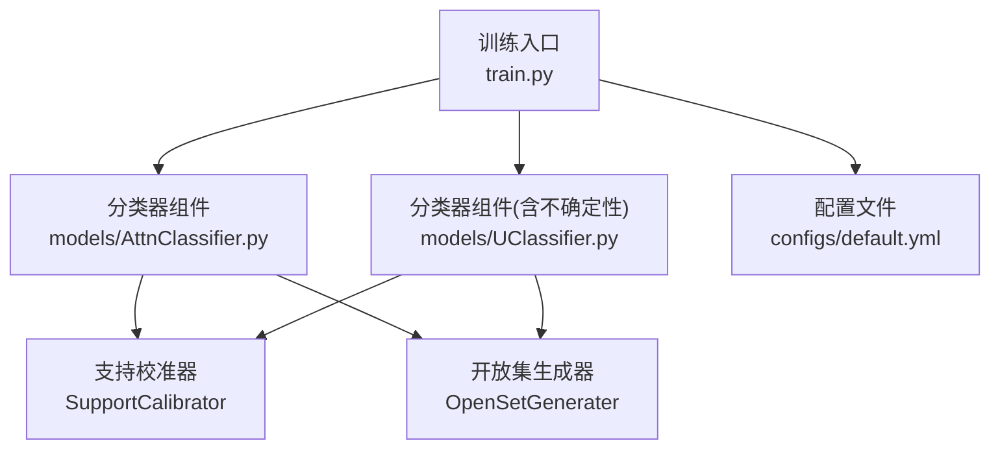
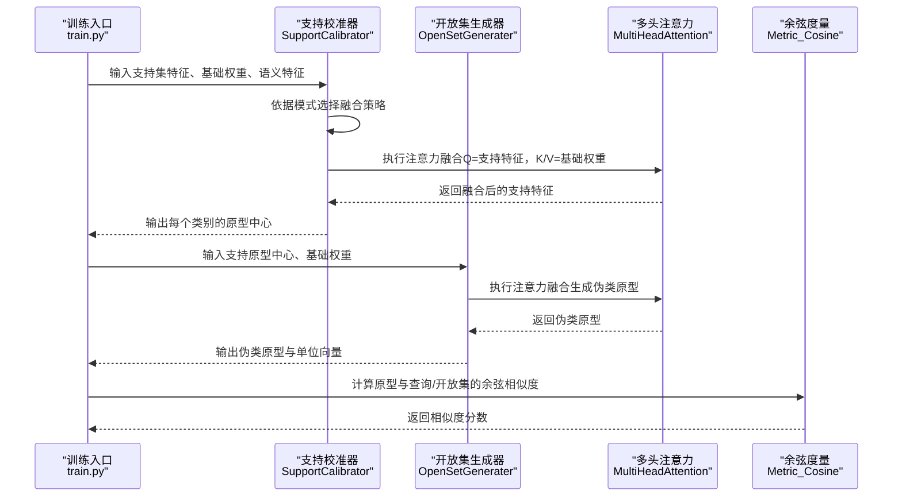
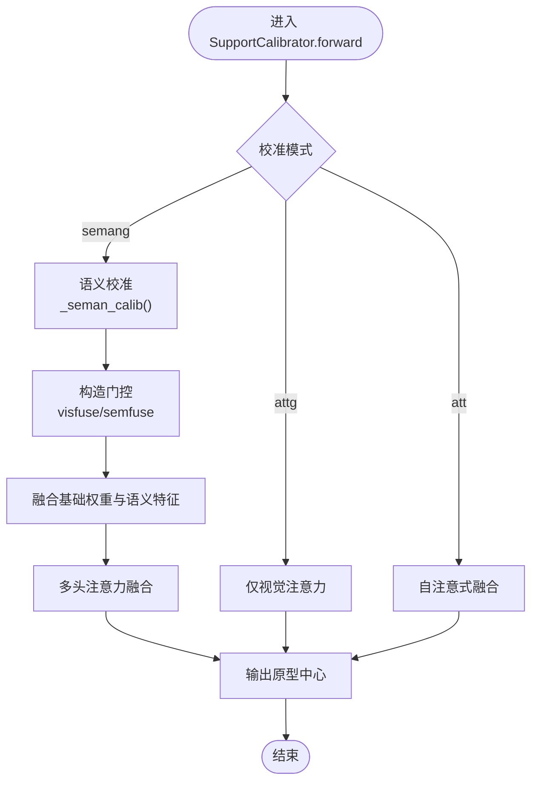
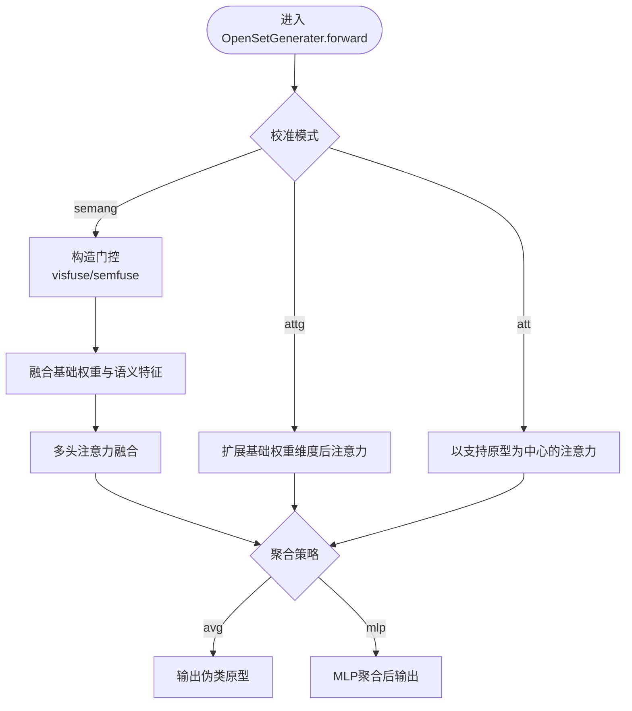
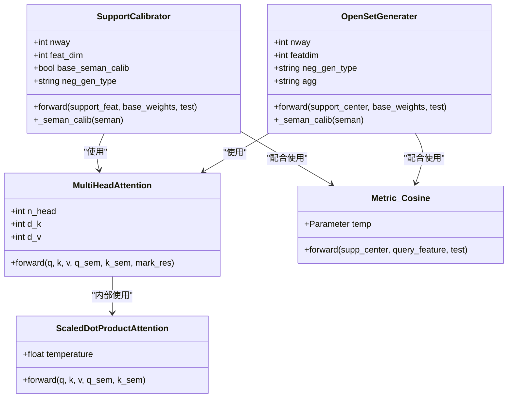
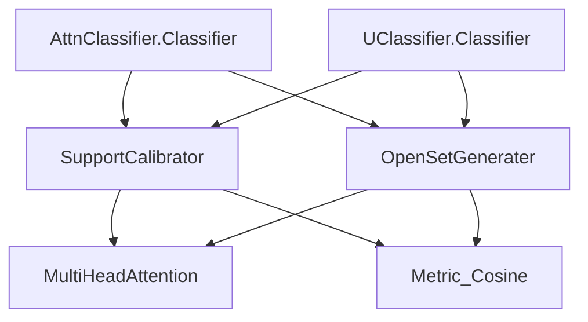

# 支持校准器

<cite>
**本文引用的文件**   
- [models/AttnClassifier.py](file://models/AttnClassifier.py)
- [models/UClassifier.py](file://models/UClassifier.py)
- [train.py](file://train.py)
- [configs/default.yml](file://configs/default.yml)
</cite>

## 目录
1. [简介](#简介)
2. [项目结构](#项目结构)
3. [核心组件](#核心组件)
4. [架构总览](#架构总览)
5. [详细组件分析](#详细组件分析)
6. [依赖分析](#依赖分析)
7. [性能考虑](#性能考虑)
8. [故障排查指南](#故障排查指南)
9. [结论](#结论)
10. [附录](#附录)

## 简介
本文件面向开发者，系统性阐述支持校准器（SupportCalibrator）在少样本开放集识别中的作用与实现细节。重点覆盖以下方面：
- 如何利用语义信息与视觉特征进行原型校准
- 不同校准模式（'semang'、'attg'、'att'）的实现差异
- 语义校准过程中的门控机制（visfuse、semfuse线性层）
- 支持特征如何通过注意力机制与基础权重融合，以及原型中心的计算过程
- 支持校准的流程图与参数配置说明
- 开发者使用方法与参数调优建议

## 项目结构
与支持校准器相关的核心文件位于 models/ 目录中，分别在 AttnClassifier 和 UClassifier 中提供了两套实现；训练入口在 train.py 中通过命令行参数控制校准模式与聚合策略；默认配置在 configs/default.yml 中。

图表来源
- [train.py:173-200](file://train.py#L173-L200)
- [models/AttnClassifier.py:121-186](file://models/AttnClassifier.py#L121-L186)
- [models/UClassifier.py:134-199](file://models/UClassifier.py#L134-L199)
- [configs/default.yml:1-88](file://configs/default.yml#L1-88)

章节来源
- [train.py:173-200](file://train.py#L173-L200)
- [models/AttnClassifier.py:121-186](file://models/AttnClassifier.py#L121-L186)
- [models/UClassifier.py:134-199](file://models/UClassifier.py#L134-L199)
- [configs/default.yml:1-88](file://configs/default.yml#L1-88)

## 核心组件
- 支持校准器（SupportCalibrator）：对支持集特征进行语义与视觉融合校准，并通过多头注意力得到每个类别的原型中心。
- 开放集生成器（OpenSetGenerater）：基于支持原型与基础权重生成伪类原型，用于开放集判定。
- 多头注意力（MultiHeadAttention）：在语义与视觉通道上执行注意力融合，实现支持特征与基础权重的动态融合。
- 余弦度量（Metric_Cosine）：对原型与查询特征进行归一化后的余弦相似度计算，并乘以温度参数。

章节来源
- [models/AttnClassifier.py:121-186](file://models/AttnClassifier.py#L121-L186)
- [models/AttnClassifier.py:188-271](file://models/AttnClassifier.py#L188-L271)
- [models/AttnClassifier.py:274-369](file://models/AttnClassifier.py#L274-L369)
- [models/UClassifier.py:134-199](file://models/UClassifier.py#L134-L199)
- [models/UClassifier.py:201-284](file://models/UClassifier.py#L201-L284)
- [models/UClassifier.py:287-381](file://models/UClassifier.py#L287-L381)

## 架构总览
支持校准器与开放集生成器协同工作：前者将支持集特征与基础权重在语义与视觉两个模态上进行融合校准，得到更稳健的原型中心；后者则在支持原型基础上，利用基础权重生成伪类原型，提升开放集判别能力。

图表来源
- [models/AttnClassifier.py:47-93](file://models/AttnClassifier.py#L47-L93)
- [models/AttnClassifier.py:121-186](file://models/AttnClassifier.py#L121-L186)
- [models/AttnClassifier.py:188-271](file://models/AttnClassifier.py#L188-L271)
- [models/AttnClassifier.py:352-369](file://models/AttnClassifier.py#L352-L369)

## 详细组件分析

### 支持校准器（SupportCalibrator）
- 负载类型（neg_gen_type）决定融合与注意力路径：
  - semang：同时使用视觉与语义信息，通过 visfuse 与 semfuse 线性层构造门控，对基础权重与语义特征进行加权融合，再经多头注意力得到原型中心。
  - attg：仅使用视觉特征，基础权重作为 K/V，不引入语义门控。
  - att：将支持集特征直接作为 Q，基础权重作为 K/V，形成自注意式融合。
- 语义校准（_seman_calib）：通过映射函数对语义特征进行统一化处理，可选择是否对基础语义也进行校准。
- 原型中心计算：多头注意力输出即为每个类别的原型中心，训练阶段保持批次与类别维度以便后续损失计算。

图表来源
- [models/AttnClassifier.py:140-185](file://models/AttnClassifier.py#L140-L185)
- [models/UClassifier.py:153-198](file://models/UClassifier.py#L153-L198)

章节来源
- [models/AttnClassifier.py:121-186](file://models/AttnClassifier.py#L121-L186)
- [models/UClassifier.py:134-199](file://models/UClassifier.py#L134-L199)

### 开放集生成器（OpenSetGenerater）
- 与支持校准器一致的三种模式：
  - semang：同样使用 visfuse/semfuse 门控，融合后通过多头注意力生成伪类原型。
  - attg：扩展基础权重维度后进行注意力，生成伪类原型。
  - att：以支持原型为中心，与基础权重进行注意力融合生成伪类原型。
- 聚合策略（agg）：
  - avg：直接取注意力输出的平均作为伪类原型。
  - mlp：通过MLP对注意力输出进行非线性变换后再聚合。

图表来源
- [models/AttnClassifier.py:212-271](file://models/AttnClassifier.py#L212-L271)
- [models/UClassifier.py:225-284](file://models/UClassifier.py#L225-L284)

章节来源
- [models/AttnClassifier.py:188-271](file://models/AttnClassifier.py#L188-L271)
- [models/UClassifier.py:201-284](file://models/UClassifier.py#L201-L284)

### 多头注意力（MultiHeadAttention）与门控机制
- 多头注意力模块负责将支持特征（Q）与基础权重（K/V）进行融合，支持传入语义特征（q_sem/k_sem）以实现跨模态融合。
- 门控机制（visfuse、semfuse）：
  - 将任务与基础记忆的拼接平均作为门控输入，分别生成视觉与语义门控权重。
  - 通过 sigmoid 变换并平移，得到 [0,1] 区间内的门控权重，用于对基础权重与语义特征进行加权融合。

图表来源
- [models/AttnClassifier.py:121-186](file://models/AttnClassifier.py#L121-L186)
- [models/AttnClassifier.py:188-271](file://models/AttnClassifier.py#L188-L271)
- [models/AttnClassifier.py:274-369](file://models/AttnClassifier.py#L274-L369)
- [models/UClassifier.py:134-199](file://models/UClassifier.py#L134-L199)
- [models/UClassifier.py:201-284](file://models/UClassifier.py#L201-L284)
- [models/UClassifier.py:287-381](file://models/UClassifier.py#L287-L381)

章节来源
- [models/AttnClassifier.py:274-369](file://models/AttnClassifier.py#L274-L369)
- [models/UClassifier.py:287-381](file://models/UClassifier.py#L287-L381)

## 依赖分析
- 支持校准器与开放集生成器共享多头注意力与门控机制，二者在不同模式下对输入进行差异化处理。
- 分类器（AttnClassifier 或 UClassifier）负责组织支持校准与开放集生成的整体流程，并通过余弦度量进行相似度计算。

图表来源
- [models/AttnClassifier.py:121-186](file://models/AttnClassifier.py#L121-L186)
- [models/AttnClassifier.py:188-271](file://models/AttnClassifier.py#L188-L271)
- [models/AttnClassifier.py:352-369](file://models/AttnClassifier.py#L352-L369)
- [models/UClassifier.py:134-199](file://models/UClassifier.py#L134-L199)
- [models/UClassifier.py:201-284](file://models/UClassifier.py#L201-L284)
- [models/UClassifier.py:365-381](file://models/UClassifier.py#L365-L381)

章节来源
- [models/AttnClassifier.py:121-186](file://models/AttnClassifier.py#L121-L186)
- [models/AttnClassifier.py:188-271](file://models/AttnClassifier.py#L188-L271)
- [models/UClassifier.py:134-199](file://models/UClassifier.py#L134-L199)
- [models/UClassifier.py:201-284](file://models/UClassifier.py#L201-L284)

## 性能考虑
- 训练阶段对支持原型进行维度展开，便于后续损失计算；测试阶段对输出进行适配，保证推理一致性。
- 通过在支持特征与原型上添加噪声，缓解中心塌缩问题，提升生成器的边界建模能力。
- 余弦度量中的温度参数可调节相似度分布的锐利程度，影响开放集判别阈值的设定。

章节来源
- [models/AttnClassifier.py:47-93](file://models/AttnClassifier.py#L47-L93)
- [models/AttnClassifier.py:352-369](file://models/AttnClassifier.py#L352-L369)
- [models/UClassifier.py:365-381](file://models/UClassifier.py#L365-L381)

## 故障排查指南
- 语义特征维度不匹配：确保语义特征维度为300，且与视觉特征维度一致，否则门控拼接与线性层会报错。
- 模式参数错误：neg_gen_type 必须在 ['semang', 'attg', 'att', 'mlp'] 中选择，否则无法正确分支。
- 温度参数过大或过小：可能导致相似度过于尖锐或平滑，影响开放集阈值设定与最终指标。
- 设备与dtype：若模型与输入张量不在同一设备，需检查映射函数与门控层的设备一致性。

章节来源
- [models/AttnClassifier.py:140-185](file://models/AttnClassifier.py#L140-L185)
- [models/UClassifier.py:153-198](file://models/UClassifier.py#L153-L198)
- [models/AttnClassifier.py:352-369](file://models/AttnClassifier.py#L352-L369)
- [models/UClassifier.py:365-381](file://models/UClassifier.py#L365-L381)

## 结论
支持校准器通过语义与视觉双模态融合与门控机制，显著提升了少样本场景下原型的稳健性；结合开放集生成器与多头注意力，实现了从支持集到伪类原型的端到端建模。开发者可根据任务需求选择合适的校准模式与聚合策略，并通过温度与噪声注入等手段进行调优。

## 附录

### 参数配置说明
- 关键参数（来自训练入口与配置文件）：
  - base_seman_calib：是否对基础语义进行校准（1启用，0关闭）
  - neg_gen_type：校准模式（'semang'、'attg'、'att'、'mlp'）
  - agg：开放集生成聚合策略（'avg'、'mlp'）
  - temperature：余弦度量温度参数
  - n_ways / n_shots：元训练的类别数与每类样本数
  - num_base / num_novel：基础类与新类数量
  - feat_dim：特征维度

章节来源
- [train.py:191-193](file://train.py#L191-L193)
- [configs/default.yml:1-88](file://configs/default.yml#L1-88)

### 使用方法与调优建议
- 使用方法（以 AttnClassifier 为例）：
  - 初始化分类器时传入 n_ways、feat_dim、base_seman_calib、neg_gen_type、agg 等参数
  - 前向时传入 (support_feat, query_feat, openset_feat) 与 (supp_ids, base_ids)
  - 训练阶段对支持特征与原型添加噪声，提升生成器边界建模能力
- 调优建议：
  - 若语义可用且质量高，优先选择 'semang' 模式并开启 base_seman_calib
  - 当语义不可用或不稳定时，选择 'attg' 或 'att' 模式
  - 聚合策略 'mlp' 更适合复杂分布，'avg' 更稳定
  - 适当增大温度参数以提升判别锐度，但需结合阈值策略调整

章节来源
- [models/AttnClassifier.py:38-118](file://models/AttnClassifier.py#L38-L118)
- [models/UClassifier.py:7-35](file://models/UClassifier.py#L7-L35)
- [configs/default.yml:42-46](file://configs/default.yml#L42-L46)