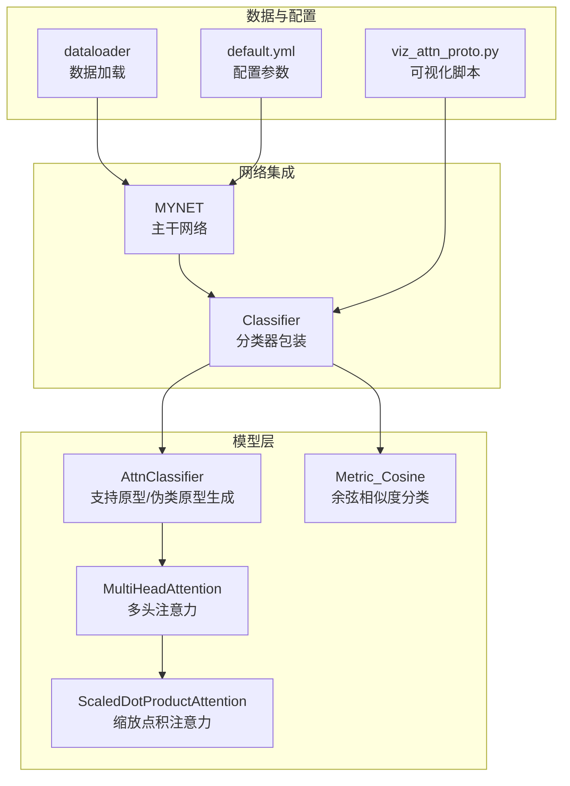
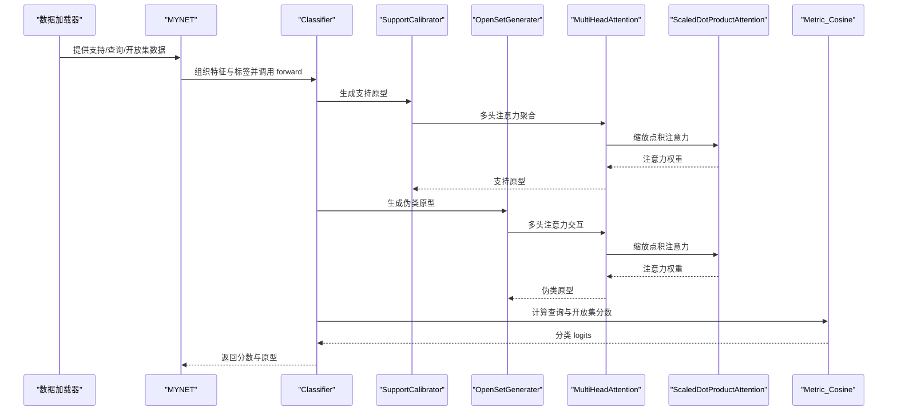
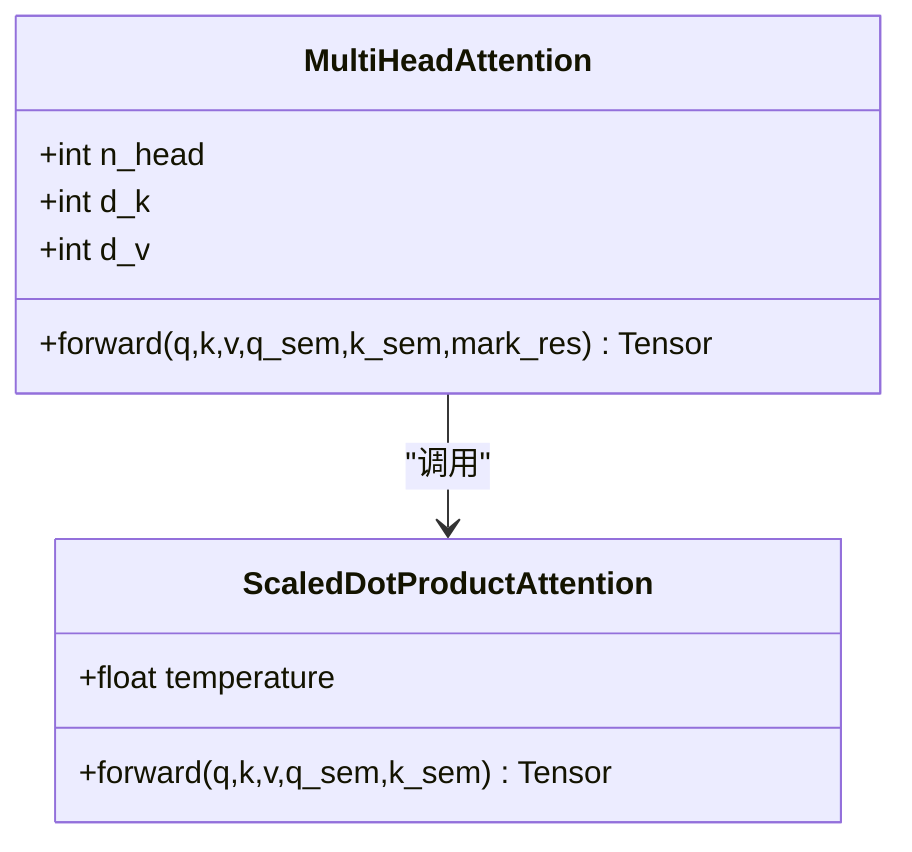
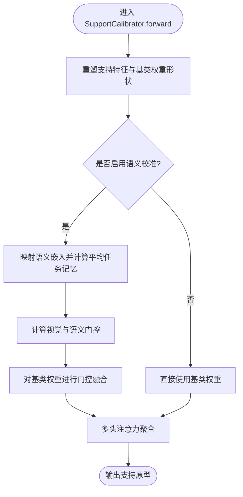
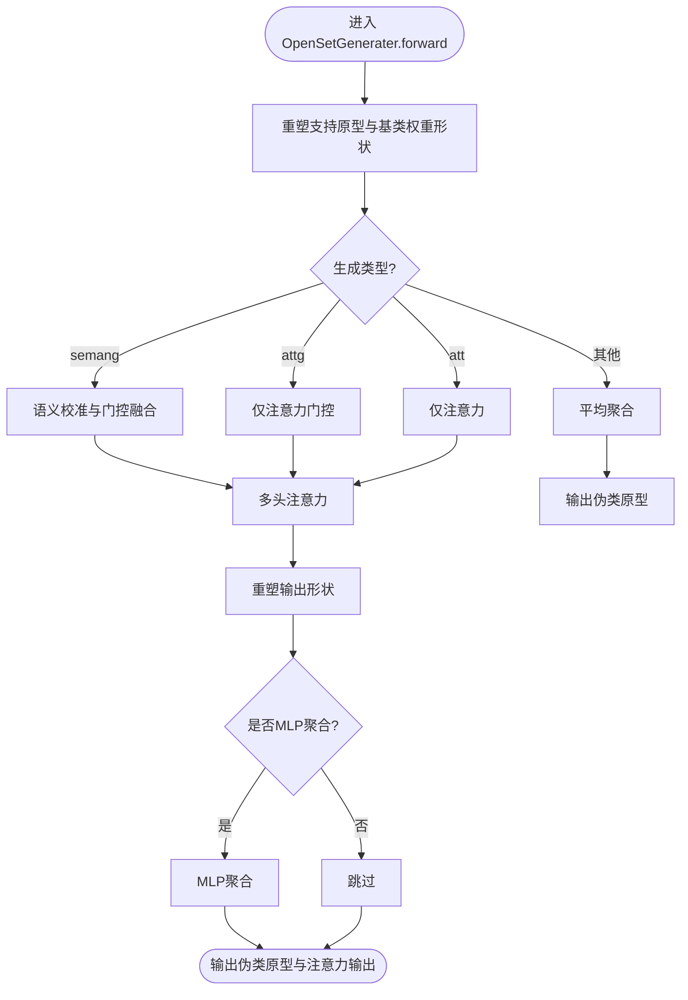
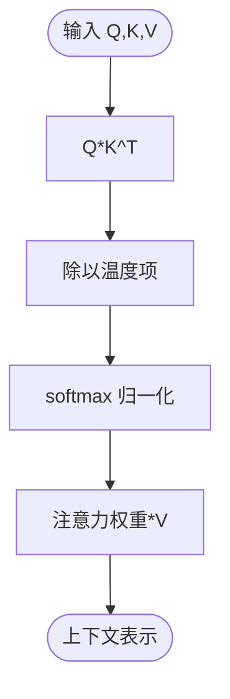
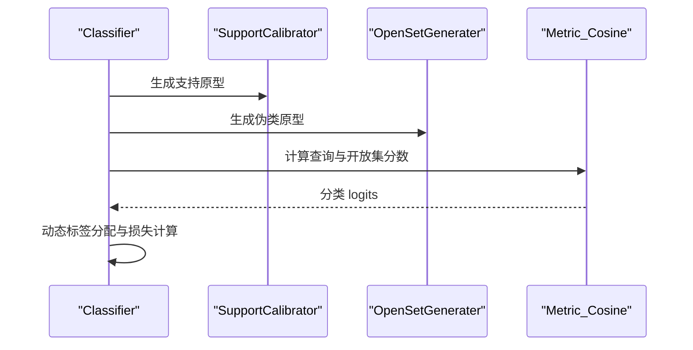
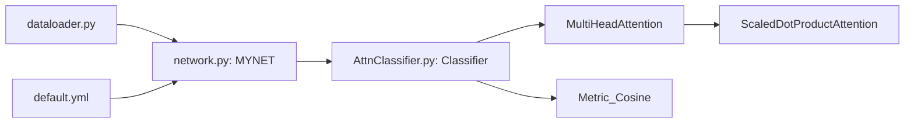

# 注意力分类器

<cite>
**本文引用的文件列表**
- [AttnClassifier.py](file://models/AttnClassifier.py)
- [network.py](file://network.py)
- [default.yml](file://configs/default.yml)
- [dataloader.py](file://data/dataloader.py)
- [viz_attn_proto.py](file://scripts/viz_attn_proto.py)
</cite>

## 目录
1. [简介](#简介)
2. [项目结构](#项目结构)
3. [核心组件](#核心组件)
4. [架构总览](#架构总览)
5. [详细组件分析](#详细组件分析)
6. [依赖关系分析](#依赖关系分析)
7. [性能考量](#性能考量)
8. [故障排查指南](#故障排查指南)
9. [结论](#结论)
10. [附录](#附录)

## 简介
本模块围绕“注意力分类器”展开，重点阐述多头注意力机制与原型学习在开放集识别中的应用。内容涵盖：
- Scaled Dot-Product Attention 与 Multi-Head Attention 的实现细节与数学原理
- 支持原型与伪类原型的生成流程与语义校准机制
- 注意力权重的计算方式与特征重要性评估
- 可视化方法与原型热力图、注意力权重图的生成
- 配置参数与使用方法，帮助开发者快速上手

## 项目结构
注意力分类器位于 models/AttnClassifier.py，与主干网络 network.py 协同工作，数据加载由 data/dataloader.py 提供，可视化脚本位于 scripts/viz_attn_proto.py，配置参数集中在 configs/default.yml。

图表来源
- [AttnClassifier.py:1-369](file://models/AttnClassifier.py#L1-L369)
- [network.py:18-200](file://network.py#L18-L200)
- [dataloader.py:1-200](file://data/dataloader.py#L1-L200)
- [default.yml:1-88](file://configs/default.yml#L1-L88)
- [viz_attn_proto.py:1-120](file://scripts/viz_attn_proto.py#L1-L120)

章节来源
- [AttnClassifier.py:1-369](file://models/AttnClassifier.py#L1-L369)
- [network.py:18-200](file://network.py#L18-L200)
- [dataloader.py:1-200](file://data/dataloader.py#L1-L200)
- [default.yml:1-88](file://configs/default.yml#L1-L88)
- [viz_attn_proto.py:1-120](file://scripts/viz_attn_proto.py#L1-L120)

## 核心组件
- 支持原型生成器 SupportCalibrator：基于多头注意力对支持集特征进行聚合，得到支持原型，并可结合语义信息进行门控融合。
- 伪类原型生成器 OpenSetGenerater：利用多头注意力对基类原型与支持原型进行交互，生成伪类原型（负原型），并可选择 MLP 聚合策略。
- 多头注意力 MultiHeadAttention：将 Q/K/V 投影到多头空间，执行缩放点积注意力，再拼接多头输出并通过线性层融合。
- 缩放点积注意力 ScaledDotProductAttention：计算注意力分数并进行 softmax 归一化，然后对 V 加权求和。
- 余弦度量 Metric_Cosine：对原型与查询特征进行归一化后做批量余弦相似度，乘以温度参数得到分类 logits。

章节来源
- [AttnClassifier.py:121-369](file://models/AttnClassifier.py#L121-L369)

## 架构总览
注意力分类器在主干网络 MYNET 中被调用，负责：
- 将支持集与查询集特征按任务组织
- 通过 SupportCalibrator 生成支持原型
- 通过 OpenSetGenerater 生成伪类原型
- 使用 Metric_Cosine 计算分类分数
- 在训练阶段引入 hinge 边界损失与伪类单位距离损失，提升开放集判别能力

图表来源
- [network.py:102-151](file://network.py#L102-L151)
- [AttnClassifier.py:47-93](file://models/AttnClassifier.py#L47-L93)
- [AttnClassifier.py:121-271](file://models/AttnClassifier.py#L121-L271)

章节来源
- [network.py:102-151](file://network.py#L102-L151)
- [AttnClassifier.py:47-93](file://models/AttnClassifier.py#L47-L93)

## 详细组件分析

### 多头注意力与缩放点积注意力
- 数学基础
  - 缩放点积注意力：对 Q 与 K 的矩阵乘得到注意力分数，除以温度项并 softmax 归一化，再与 V 相乘得到加权和。
  - 多头注意力：将 Q/K/V 分别投影到多个头，分别计算注意力，最后拼接并经线性层融合。
- 实现要点
  - 线性投影矩阵初始化采用正态分布与 Xavier 初始化，保证数值稳定。
  - 注意力输出可选择残差连接，有助于深层网络训练稳定性。
  - 温度项与头维度影响注意力分布的锐利程度，头数越多表达能力越强但计算开销更大。

图表来源
- [AttnClassifier.py:274-350](file://models/AttnClassifier.py#L274-L350)

章节来源
- [AttnClassifier.py:274-350](file://models/AttnClassifier.py#L274-L350)

### 支持原型生成与语义校准
- 功能概述
  - 对支持集特征进行平均后，通过多头注意力聚合基类语义与视觉特征，得到支持原型。
  - 支持语义校准（可选）：对语义嵌入进行映射与门控融合，使原型更贴合任务需求。
- 关键流程
  - 将支持特征与基类权重重塑为注意力输入格式
  - 若启用语义校准，计算平均任务记忆，生成视觉与语义门控，对基类权重进行加权融合
  - 通过注意力模块输出支持原型

图表来源
- [AttnClassifier.py:140-185](file://models/AttnClassifier.py#L140-L185)

章节来源
- [AttnClassifier.py:121-185](file://models/AttnClassifier.py#L121-L185)

### 伪类原型生成与边界强化
- 功能概述
  - 基于支持原型与基类权重，通过多头注意力生成伪类原型（负原型），用于开放集判别。
  - 可选 MLP 聚合策略，进一步调整伪类原型的分布特性。
- 关键流程
  - 将支持原型与基类权重重塑为注意力输入格式
  - 若启用语义校准，计算门控并融合基类权重
  - 通过注意力模块输出伪类原型
  - 可选 MLP 聚合，得到最终伪类原型与注意力输出

图表来源
- [AttnClassifier.py:188-271](file://models/AttnClassifier.py#L188-L271)

章节来源
- [AttnClassifier.py:188-271](file://models/AttnClassifier.py#L188-L271)

### 注意力权重计算与特征重要性评估
- 注意力权重计算
  - 对 Q 与 K 的矩阵乘得到注意力分数，除以温度项并 softmax 归一化，得到注意力权重矩阵。
  - 使用注意力权重对 V 进行加权求和，得到上下文表示。
- 特征重要性评估
  - 注意力权重反映了查询特征对支持/基类特征的关注程度，可用于解释模型决策。
  - 可通过可视化脚本生成注意力权重热力图，辅助分析模型关注区域。

图表来源
- [AttnClassifier.py:331-350](file://models/AttnClassifier.py#L331-L350)

章节来源
- [AttnClassifier.py:331-350](file://models/AttnClassifier.py#L331-L350)

### 分类器与损失函数
- 分类器 Classifier
  - 对支持集特征进行平均，注入噪声以缓解中心损失导致的特征坍缩。
  - 通过 SupportCalibrator 生成支持原型，通过 OpenSetGenerater 生成伪类原型。
  - 使用 Metric_Cosine 计算查询与开放集分数。
- 损失函数
  - 分类交叉熵：使用动态标签分配，将开放集样本分配到其最像的支持类对应的伪类。
  - 开放集 hinge 边界损失：强制伪类原型与支持原型之间的距离大于阈值，提升判别边界。
  - 伪类单位距离损失：通过 recip_unit 评估伪类原型与支持原型的距离一致性。

图表来源
- [AttnClassifier.py:47-93](file://models/AttnClassifier.py#L47-L93)
- [network.py:153-200](file://network.py#L153-L200)

章节来源
- [AttnClassifier.py:47-93](file://models/AttnClassifier.py#L47-L93)
- [network.py:153-200](file://network.py#L153-L200)

## 依赖关系分析
- AttnClassifier.py 与 network.py 的耦合
  - MYNET 在 open_forward 中组织数据，调用 Classifier 完成原型生成与分类。
  - Classifier 依赖 MultiHeadAttention 与 ScaledDotProductAttention 实现注意力聚合。
- 数据依赖
  - dataloader.py 提供支持/查询/开放集数据，batch 维度与注意力模块的期望输入一致。
- 配置依赖
  - default.yml 中的 n_ways、n_shots、n_queries 等参数决定注意力输入的序列长度与类别数。

图表来源
- [network.py:18-200](file://network.py#L18-L200)
- [AttnClassifier.py:1-369](file://models/AttnClassifier.py#L1-L369)
- [dataloader.py:1-200](file://data/dataloader.py#L1-L200)
- [default.yml:1-88](file://configs/default.yml#L1-L88)

章节来源
- [network.py:18-200](file://network.py#L18-L200)
- [AttnClassifier.py:1-369](file://models/AttnClassifier.py#L1-L369)
- [dataloader.py:1-200](file://data/dataloader.py#L1-L200)
- [default.yml:1-88](file://configs/default.yml#L1-L88)

## 性能考量
- 多头注意力的头数与维度
  - 头数越多，表达能力越强，但计算复杂度增加；需根据显存与速度平衡选择。
- 温度参数与归一化
  - 温度控制注意力分布的锐利程度；cosine 归一化与温度参数共同影响分类稳定性。
- 噪声注入策略
  - 在训练阶段对支持原型与支持特征注入噪声，有助于缓解特征坍缩，提升生成器的鲁棒性。
- 聚合策略
  - MLP 聚合可进一步调整伪类原型分布，但会增加额外计算成本。

## 故障排查指南
- 注意力模块未找到
  - 可视化脚本在找不到注意力模块时会跳过注意力图绘制，检查 cls 是否包含 attn 或 multihead_attn 属性。
- 原型维度不匹配
  - 确认支持/查询/开放集的 batch 维度与 n_ways、n_shots、n_queries 设置一致。
- 温度参数过大或过小
  - 温度过大会导致注意力分布过于尖锐，过小会导致分布过于平坦，影响分类效果。
- 语义校准未生效
  - 检查 neg_gen_type 与 base_seman_calib 参数设置，确认语义门控是否正确计算与融合。

章节来源
- [viz_attn_proto.py:96-116](file://scripts/viz_attn_proto.py#L96-L116)
- [AttnClassifier.py:121-271](file://models/AttnClassifier.py#L121-L271)

## 结论
注意力分类器通过多头注意力实现了对支持集与基类特征的深度融合，支持原型与伪类原型的生成有效提升了开放集识别的判别能力。语义校准与噪声注入策略进一步增强了模型的鲁棒性与泛化性能。配合可视化工具，开发者可以直观地理解注意力权重与原型分布，优化模型配置与训练策略。

## 附录

### 配置参数与使用方法
- 关键配置项（来自 default.yml）
  - n_ways、n_shots、n_queries：决定注意力输入序列长度与类别数
  - feat_dim：特征维度，需与编码器输出一致
  - network.temperature：余弦分类温度参数
  - dataloader.train_batch_size/test_batch_size：训练与测试批大小
  - scheduler/milestones/gamma：学习率调度策略
- 使用方法
  - 在 MYNET 的 open_forward 中组织支持/查询/开放集数据，调用 Classifier 完成原型生成与分类。
  - 训练阶段使用动态标签分配与 hinge 边界损失，测试阶段返回分数与原型以便后续分析。

章节来源
- [default.yml:1-88](file://configs/default.yml#L1-L88)
- [network.py:102-151](file://network.py#L102-L151)

### 可视化与原型生成流程
- 原型热力图
  - 使用 viz_attn_proto.py 读取训练好的模型，提取正/负原型并绘制热力图。
- 注意力权重图
  - 对支持特征进行自注意力，输出注意力权重并绘制热力图，辅助解释模型关注区域。

章节来源
- [viz_attn_proto.py:34-120](file://scripts/viz_attn_proto.py#L34-L120)