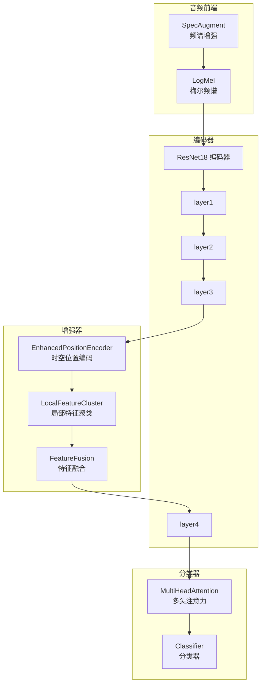
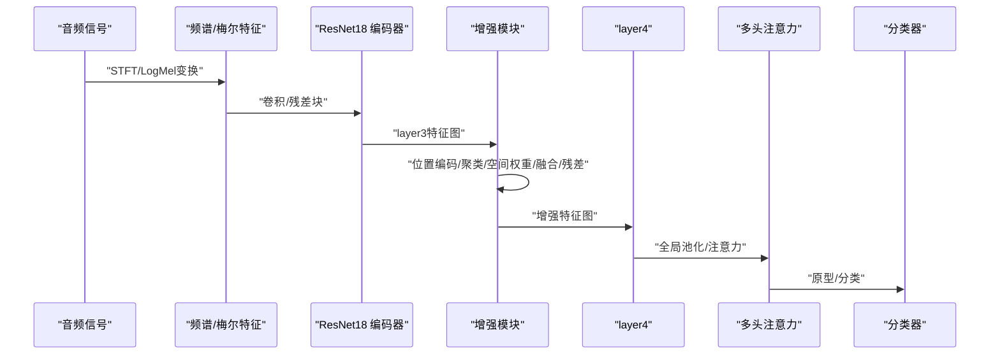
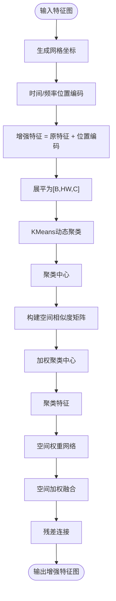
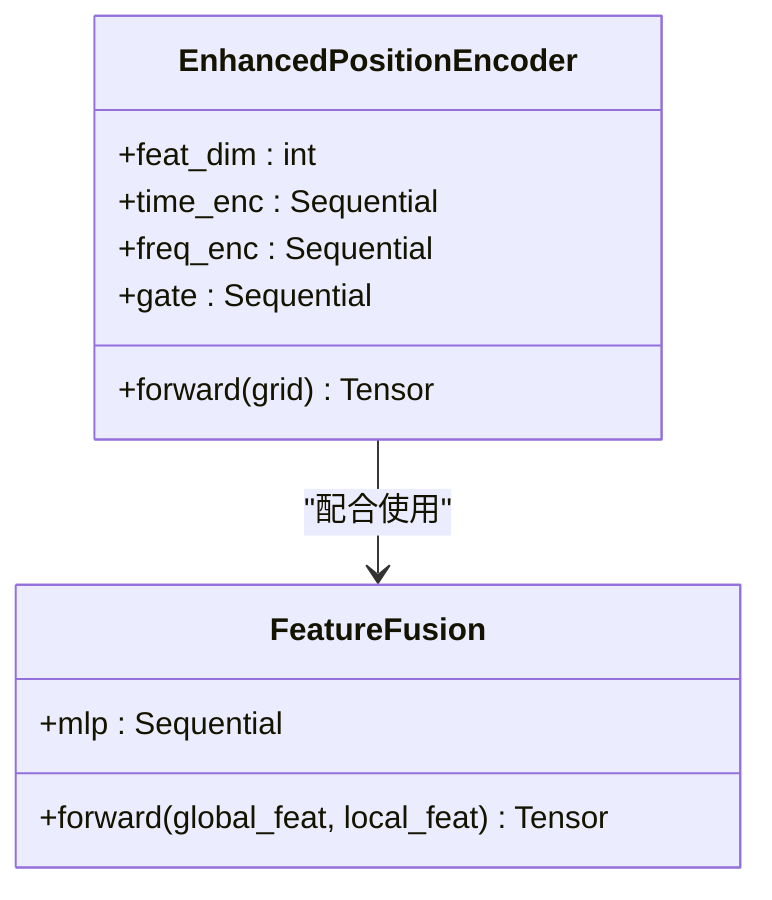
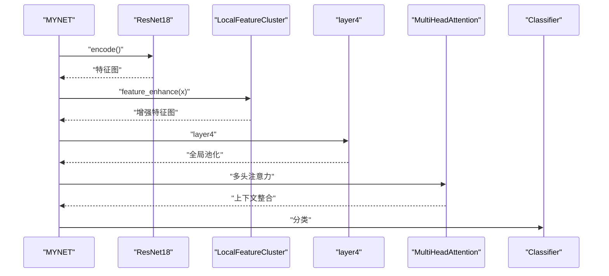
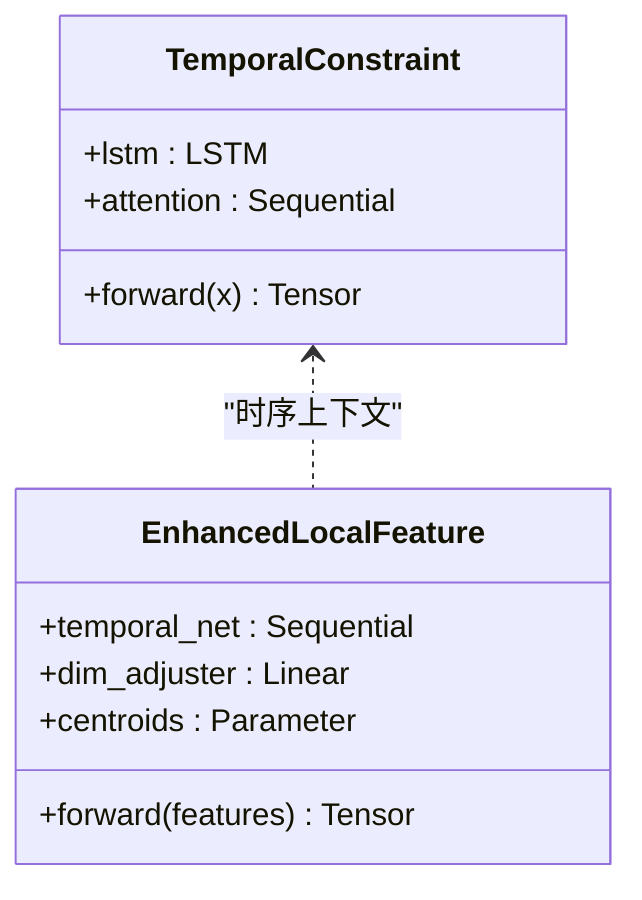
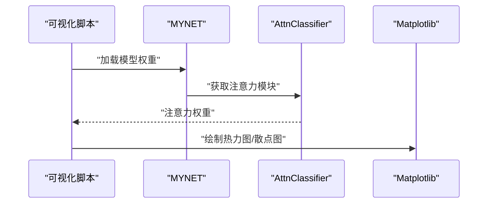
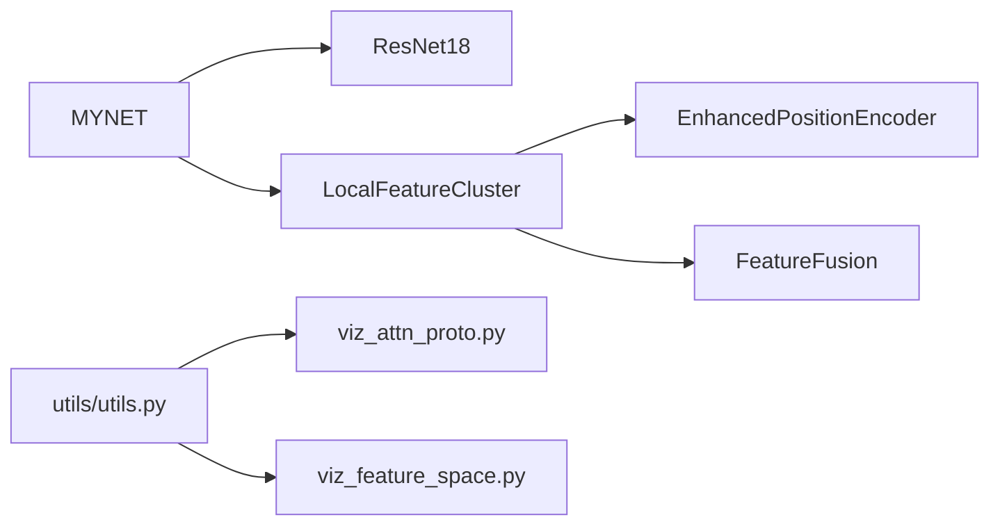

# 全局特征增强

<cite>
**本文引用的文件列表**
- [models/resnet_enhancer.py](file://models/resnet_enhancer.py)
- [enhance_module.py](file://enhance_module.py)
- [models/resnet18_encoder.py](file://models/resnet18_encoder.py)
- [network.py](file://network.py)
- [models/feature_enhancer.py](file://models/feature_enhancer.py)
- [utils/utils.py](file://utils/utils.py)
- [librispeech_enhance.py](file://librispeech_enhance.py)
- [scripts/viz_attn_proto.py](file://scripts/viz_attn_proto.py)
- [scripts/viz_feature_space.py](file://scripts/viz_feature_space.py)
</cite>

## 目录
1. [简介](#简介)
2. [项目结构](#项目结构)
3. [核心组件](#核心组件)
4. [架构总览](#架构总览)
5. [详细组件分析](#详细组件分析)
6. [依赖关系分析](#依赖关系分析)
7. [性能考量](#性能考量)
8. [故障排查指南](#故障排查指南)
9. [结论](#结论)
10. [附录](#附录)

## 简介
本技术文档围绕“全局特征增强”功能展开，重点阐述ResNet增强器的网络架构设计与实现，包括：
- 残差连接、特征金字塔与多尺度融合机制
- 全局上下文信息的提取与利用（空间注意力与通道注意力的协同）
- 增强模块与主网络的集成方式与特征传递路径
- 增强前后特征分布对比与注意力权重可视化方法
- 增强策略选择指南与模型性能影响分析

## 项目结构
与全局特征增强直接相关的模块主要分布在以下文件：
- ResNet增强器与位置编码：models/resnet_enhancer.py
- 增强模块（融合与位置编码）：enhance_module.py
- ResNet18编码器：models/resnet18_encoder.py
- 主网络MYNET及其特征增强集成：network.py
- 本地特征增强（LSTM+原型）：models/feature_enhancer.py
- 工具与注意力可视化：utils/utils.py、scripts/viz_attn_proto.py、scripts/viz_feature_space.py
- LibriSpeech音频增强（对比参考）：librispeech_enhance.py

图表来源
- [network.py:24-36](file://network.py#L24-L36)
- [models/resnet_enhancer.py:21-48](file://models/resnet_enhancer.py#L21-L48)
- [models/resnet_enhancer.py:51-160](file://models/resnet_enhancer.py#L51-L160)
- [models/resnet18_encoder.py:240-334](file://models/resnet18_encoder.py#L240-L334)

章节来源
- [models/resnet_enhancer.py:1-172](file://models/resnet_enhancer.py#L1-L172)
- [enhance_module.py:1-160](file://enhance_module.py#L1-L160)
- [models/resnet18_encoder.py:1-471](file://models/resnet18_encoder.py#L1-L471)
- [network.py:18-518](file://network.py#L18-L518)

## 核心组件
- 增强器核心模块
  - EnhancedPositionEncoder：分别对时间轴与频率轴进行位置编码，并通过动态门控融合，提升时空感知能力。
  - LocalFeatureCluster：在空间网格上进行动态聚类，结合空间权重网络与残差连接，实现局部细节与全局结构的融合。
  - FeatureFusion：在通道级对全局与局部特征进行动态加权融合。
- 主网络集成
  - MYNET在编码器之后插入增强模块，形成“编码-增强-分类”的流水线。
  - 通过自注意力模块进一步整合上下文信息，实现全局上下文与局部细节的协同。

章节来源
- [models/resnet_enhancer.py:6-19](file://models/resnet_enhancer.py#L6-L19)
- [models/resnet_enhancer.py:21-48](file://models/resnet_enhancer.py#L21-L48)
- [models/resnet_enhancer.py:51-160](file://models/resnet_enhancer.py#L51-L160)
- [network.py:36-36](file://network.py#L36-L36)

## 架构总览
全局特征增强的整体流程如下：
- 音频经频谱与梅尔变换后，送入ResNet编码器提取特征图
- 在layer3阶段插入增强模块：位置编码→聚类→空间权重→融合→残差
- 增强后的特征图进入layer4并进行全局池化，随后进入分类器与注意力模块

图表来源
- [network.py:290-311](file://network.py#L290-L311)
- [models/resnet_enhancer.py:73-160](file://models/resnet_enhancer.py#L73-L160)

章节来源
- [network.py:290-311](file://network.py#L290-L311)
- [models/resnet_enhancer.py:73-160](file://models/resnet_enhancer.py#L73-L160)

## 详细组件分析

### ResNet增强器（LocalFeatureCluster）
- 残差连接：保留原始特征，增强后与残差相加，保证稳定性与收敛性。
- 位置编码：生成二维网格坐标，分别对时间轴与频率轴进行卷积编码，再通过动态门控融合。
- 动态聚类：对展平的空间特征进行KMeans聚类，结合空间相似度矩阵进行加权中心计算。
- 空间权重：通过MLP预测每个空间位置的融合权重，控制局部细节与全局结构的比例。
- 特征融合：将聚类后的特征与增强特征按权重融合，并通过残差连接输出。

图表来源
- [models/resnet_enhancer.py:73-160](file://models/resnet_enhancer.py#L73-L160)

章节来源
- [models/resnet_enhancer.py:51-160](file://models/resnet_enhancer.py#L51-L160)

### 增强模块（FeatureFusion + EnhancedPositionEncoder）
- EnhancedPositionEncoder：分别对时间与频率维度进行卷积编码，再通过门控网络动态融合，提升跨维度的上下文感知。
- FeatureFusion：在通道维度对全局与局部特征进行动态加权融合，实现全局上下文与局部细节的互补。

图表来源
- [models/resnet_enhancer.py:21-48](file://models/resnet_enhancer.py#L21-L48)
- [models/resnet_enhancer.py:6-19](file://models/resnet_enhancer.py#L6-L19)

章节来源
- [models/resnet_enhancer.py:6-19](file://models/resnet_enhancer.py#L6-L19)
- [models/resnet_enhancer.py:21-48](file://models/resnet_enhancer.py#L21-L48)

### 主网络集成（MYNET）
- MYNET在编码器基础上增加增强模块，并在分类前引入多头注意力模块，实现全局上下文与局部细节的协同。
- 增强模块插入在layer3之后、layer4之前，确保在深层语义特征上进行增强。

图表来源
- [network.py:36-36](file://network.py#L36-L36)
- [network.py:290-311](file://network.py#L290-L311)
- [network.py:312-324](file://network.py#L312-L324)

章节来源
- [network.py:36-36](file://network.py#L36-L36)
- [network.py:290-311](file://network.py#L290-L311)
- [network.py:312-324](file://network.py#L312-L324)

### 本地特征增强（LSTM+原型）
- TemporalConstraint：通过双向LSTM与注意力机制，对序列特征进行时序约束，提取全局时序上下文。
- EnhancedLocalFeature：将空间特征展平为序列，通过LSTM与时序原型进行动态加权聚合，实现多尺度融合。

图表来源
- [models/feature_enhancer.py:5-25](file://models/feature_enhancer.py#L5-L25)
- [models/feature_enhancer.py:27-93](file://models/feature_enhancer.py#L27-L93)

章节来源
- [models/feature_enhancer.py:5-25](file://models/feature_enhancer.py#L5-L25)
- [models/feature_enhancer.py:27-93](file://models/feature_enhancer.py#L27-L93)

### 注意力与可视化
- 空间注意力与通道注意力协同：通过多头注意力模块对支持集特征进行自注意力，生成注意力权重图，辅助理解模型决策。
- 特征空间可视化：通过t-SNE/UMAP对特征与原型进行降维可视化，观察原型漂移与聚类分布。

图表来源
- [scripts/viz_attn_proto.py:92-115](file://scripts/viz_attn_proto.py#L92-L115)
- [scripts/viz_feature_space.py:83-128](file://scripts/viz_feature_space.py#L83-L128)

章节来源
- [scripts/viz_attn_proto.py:92-115](file://scripts/viz_attn_proto.py#L92-L115)
- [scripts/viz_feature_space.py:83-128](file://scripts/viz_feature_space.py#L83-L128)

## 依赖关系分析
- MYNET依赖ResNet18编码器与增强模块，增强模块又依赖位置编码与融合网络。
- 工具模块提供注意力可视化与特征空间可视化能力，支撑增强效果评估。

图表来源
- [network.py:17-17](file://network.py#L17-L17)
- [models/resnet_enhancer.py:21-48](file://models/resnet_enhancer.py#L21-L48)
- [models/resnet_enhancer.py:6-19](file://models/resnet_enhancer.py#L6-L19)
- [utils/utils.py:132-155](file://utils/utils.py#L132-L155)
- [scripts/viz_attn_proto.py:18-24](file://scripts/viz_attn_proto.py#L18-L24)
- [scripts/viz_feature_space.py:23-33](file://scripts/viz_feature_space.py#L23-L33)

章节来源
- [network.py:17-17](file://network.py#L17-L17)
- [models/resnet_enhancer.py:21-48](file://models/resnet_enhancer.py#L21-L48)
- [models/resnet_enhancer.py:6-19](file://models/resnet_enhancer.py#L6-L19)
- [utils/utils.py:132-155](file://utils/utils.py#L132-L155)
- [scripts/viz_attn_proto.py:18-24](file://scripts/viz_attn_proto.py#L18-L24)
- [scripts/viz_feature_space.py:23-33](file://scripts/viz_feature_space.py#L23-L33)

## 性能考量
- 计算复杂度
  - 位置编码与动态门控：O(B·H·W·C)（卷积与门控）
  - KMeans聚类：O(B·HW·C·k)，其中k为聚类数，受k_ratio控制
  - 空间权重网络：O(B·HW·C)
  - 多头注意力：O(B·HW·HW·C/n_head)
- 内存占用
  - 聚类中心与权重矩阵需驻留显存，建议合理设置k_ratio与批大小
- 训练稳定性
  - 残差连接与门控融合有助于缓解梯度消失，提升收敛稳定性
  - 注意力模块的温度参数与dropout可调节模型泛化能力

[本节为通用性能讨论，无需列出具体文件来源]

## 故障排查指南
- 设备一致性问题
  - 增强模块内部维护_current_device并在forward中校验设备一致性，若出现设备不匹配，检查模块是否正确移动至目标设备。
- 维度不匹配
  - LocalFeatureCluster在forward中对输入特征进行展平与重排，若维度异常，检查输入特征图的通道数与空间尺寸是否符合预期。
- 聚类失败
  - 若KMeans报错或聚类中心为空，检查k_ratio是否过大导致空聚类，或特征张量是否为非NaN/无穷。
- 注意力可视化失败
  - 若注意力权重为空或形状异常，检查AttnClassifier模块是否存在以及输入张量维度是否正确。

章节来源
- [models/resnet_enhancer.py:168-172](file://models/resnet_enhancer.py#L168-L172)
- [utils/utils.py:118-131](file://utils/utils.py#L118-L131)

## 结论
全局特征增强通过“位置编码+动态聚类+空间权重+残差融合”的设计，在ResNet的深层特征上实现了全局上下文与局部细节的协同增强。结合多头注意力模块，进一步提升了模型对复杂时序与频谱特征的建模能力。该增强策略在LibriSpeech Few-Shot任务中具有良好的泛化潜力，可通过合理设置k_ratio与注意力参数获得更优性能。

[本节为总结性内容，无需列出具体文件来源]

## 附录

### 增强策略选择指南
- k_ratio：控制聚类数与局部细节保留程度，建议从0.2~0.4区间尝试
- temporal_scale：控制空间相似度矩阵的锐度，影响聚类中心的稳定性
- 注意力头数与dropout：在多头注意力模块中平衡上下文建模与正则化
- 增强插入层：layer3增强适合中等尺度特征，layer2增强可引入更多局部细节

[本节为策略建议，无需列出具体文件来源]

### 模型性能影响分析
- 增强前特征分布：关注层3特征图的均值与方差分布，观察增强对特征稀疏性与分布的影响
- 增强后特征分布：对比增强前后特征的统计特性，评估增强对判别性的提升
- 注意力权重可视化：通过注意力热力图观察模型对关键区域的关注程度

章节来源
- [scripts/viz_feature_space.py:83-128](file://scripts/viz_feature_space.py#L83-L128)
- [scripts/viz_attn_proto.py:92-115](file://scripts/viz_attn_proto.py#L92-L115)