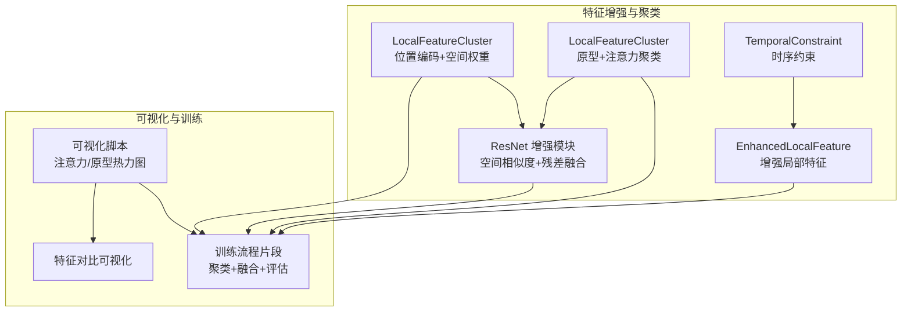
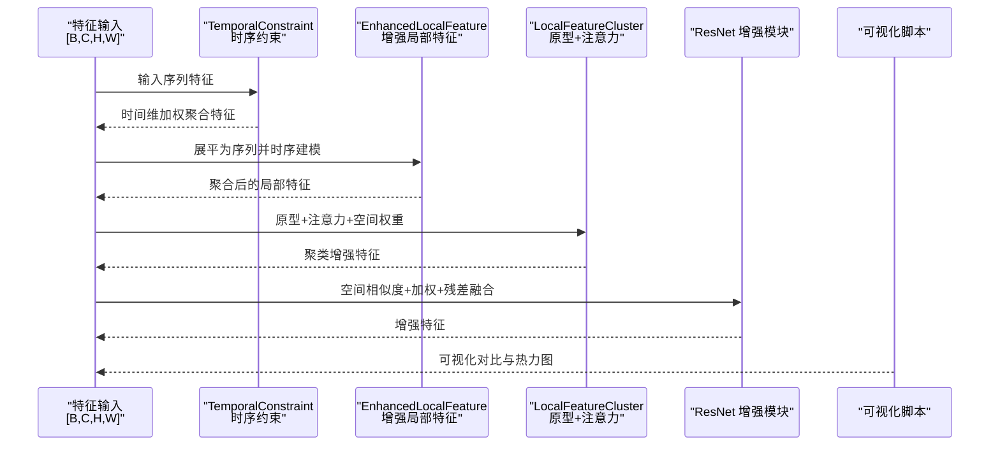
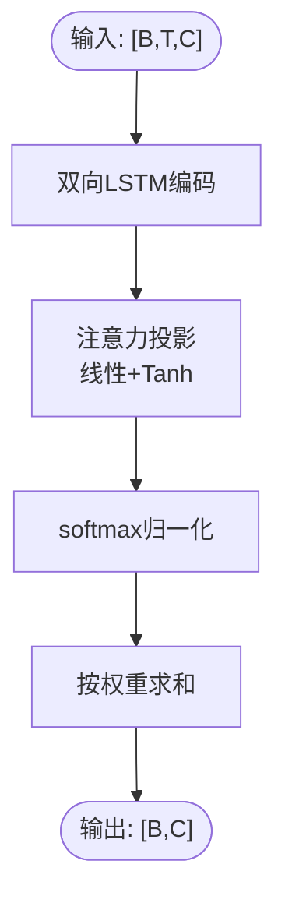
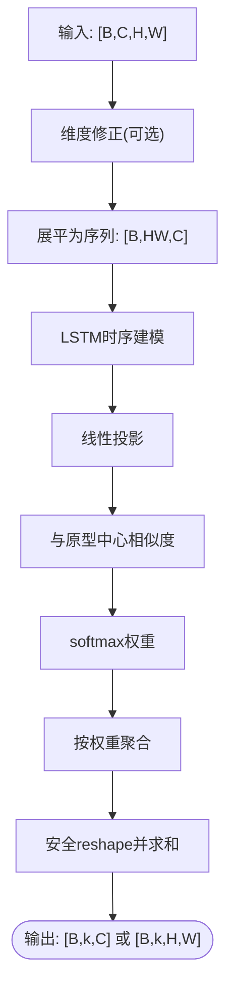
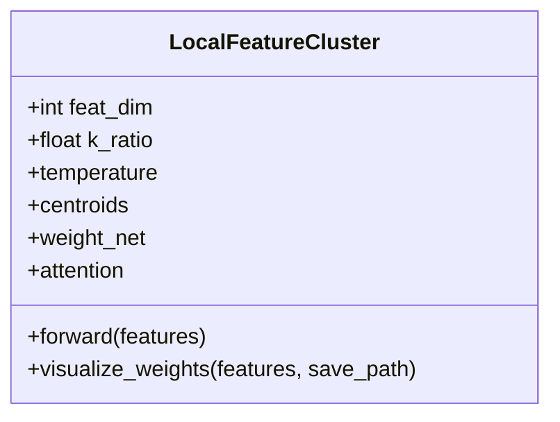
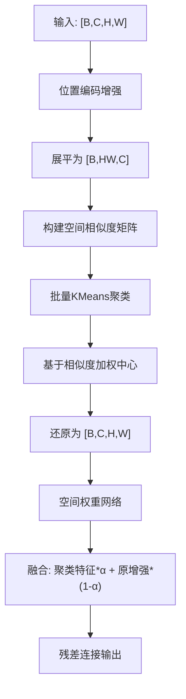
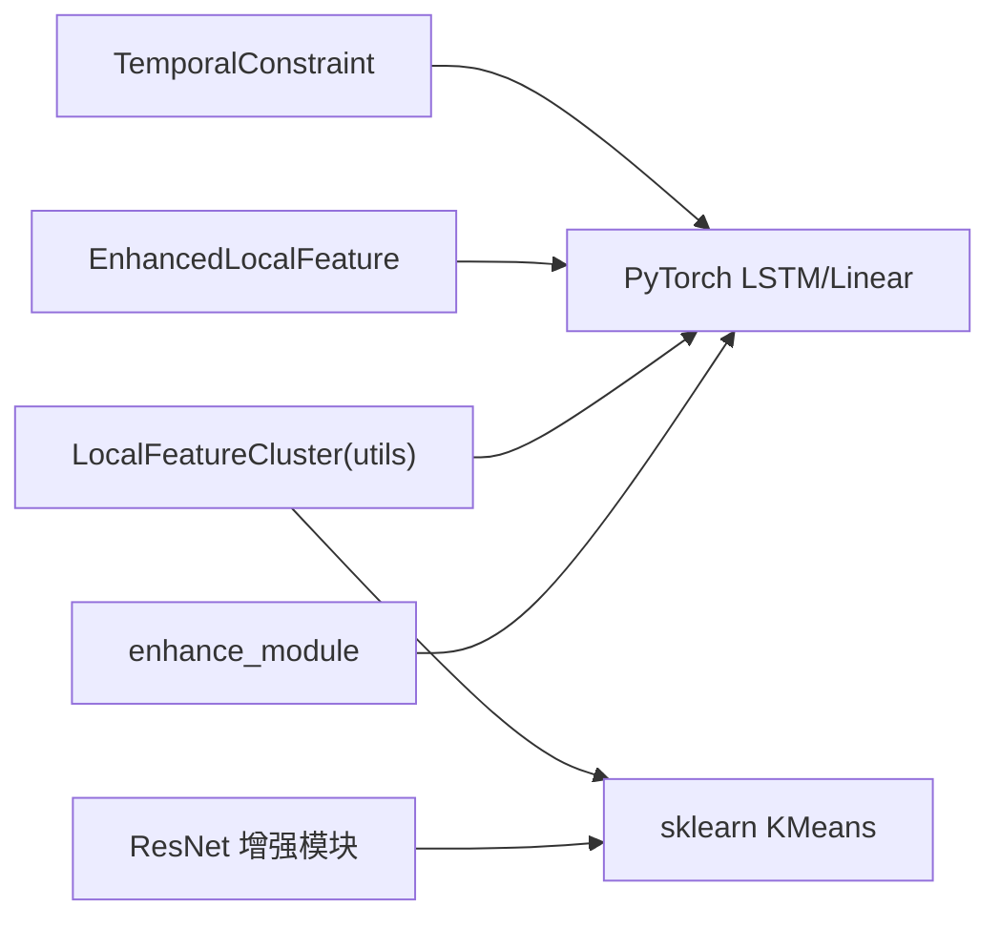

# 局部特征聚类

<cite>
**本文引用的文件**
- [models/feature_enhancer.py](file://models/feature_enhancer.py)
- [utils/utils.py](file://utils/utils.py)
- [models/resnet_enhancer.py](file://models/resnet_enhancer.py)
- [enhance_module.py](file://enhance_module.py)
- [deepcluster.py](file://deepcluster.py)
- [train.py](file://train.py)
- [scripts/viz_attn_proto.py](file://scripts/viz_attn_proto.py)
- [scripts/plot_separate_embeddings.py](file://scripts/plot_separate_embeddings.py)
</cite>

## 目录
1. [简介](#简介)
2. [项目结构](#项目结构)
3. [核心组件](#核心组件)
4. [架构总览](#架构总览)
5. [详细组件分析](#详细组件分析)
6. [依赖分析](#依赖分析)
7. [性能考量](#性能考量)
8. [故障排查指南](#故障排查指南)
9. [结论](#结论)
10. [附录](#附录)

## 简介
本技术文档聚焦“局部特征聚类”能力，系统阐述以下内容：
- TemporalConstraint 模块的时序约束机制：双向 LSTM 的时序建模与注意力权重计算。
- 增强局部特征（EnhancedLocalFeature）的实现原理：原型中心初始化、动态权重计算、特征聚合过程。
- 聚类算法选择依据（k_ratio 参数）与维度调整机制。
- 时序约束前后特征变化的可视化对比思路与聚类权重热力图的生成方法。
- 面向开发者的参数调优指南与性能优化建议。

## 项目结构
围绕局部特征聚类的相关模块主要分布在以下文件：
- models/feature_enhancer.py：定义 TemporalConstraint 与 EnhancedLocalFeature。
- utils/utils.py：定义 LocalFeatureCluster（基于原型与注意力的增强聚类）及其权重可视化工具。
- models/resnet_enhancer.py：ResNet 中间层的局部特征聚类增强模块，含空间相似度加权与残差融合。
- enhance_module.py：通用的局部特征聚类模块（LocalFeatureCluster），含位置编码、空间权重与特征融合。
- deepcluster.py：包含对 LocalFeatureCluster 的使用与可视化流程示例。
- train.py：包含聚类增强与特征融合的训练流程片段与可视化辅助函数。
- scripts/viz_attn_proto.py：注意力与原型热力图可视化脚本。
- scripts/plot_separate_embeddings.py：特征嵌入前后对比可视化脚本。

**图表来源**
- [models/feature_enhancer.py:5-26](file://models/feature_enhancer.py#L5-L26)
- [models/feature_enhancer.py:27-93](file://models/feature_enhancer.py#L27-L93)
- [utils/utils.py:61-116](file://utils/utils.py#L61-L116)
- [models/resnet_enhancer.py:51-160](file://models/resnet_enhancer.py#L51-L160)
- [enhance_module.py:70-148](file://enhance_module.py#L70-L148)
- [deepcluster.py:178-233](file://deepcluster.py#L178-L233)
- [train.py:359-464](file://train.py#L359-L464)

**章节来源**
- [models/feature_enhancer.py:1-93](file://models/feature_enhancer.py#L1-L93)
- [utils/utils.py:61-131](file://utils/utils.py#L61-L131)
- [models/resnet_enhancer.py:1-172](file://models/resnet_enhancer.py#L1-L172)
- [enhance_module.py:1-160](file://enhance_module.py#L1-L160)
- [deepcluster.py:178-233](file://deepcluster.py#L178-L233)
- [train.py:359-464](file://train.py#L359-L464)

## 核心组件
- TemporalConstraint：对序列特征进行双向 LSTM 编码，并通过注意力层计算时间维权重，实现时序上下文的加权聚合。
- EnhancedLocalFeature：将局部特征展平为序列，经 LSTM 时序建模与线性投影，结合原型中心计算动态权重，完成特征聚合与维度修正。
- LocalFeatureCluster（原型+注意力）：在 utils/utils.py 中实现，包含可学习原型中心、空间权重网络与多头注意力，支持权重热力图可视化。
- ResNet 增强模块：在中间层特征上执行局部聚类，利用空间相似度矩阵对聚类中心进行加权，再与原特征按空间权重融合并残差连接。
- 位置编码与空间权重：enhance_module.py 中的 LocalFeatureCluster 采用位置编码增强空间感知，通过空间权重网络控制局部细节与全局结构的融合比例。

**章节来源**
- [models/feature_enhancer.py:5-26](file://models/feature_enhancer.py#L5-L26)
- [models/feature_enhancer.py:27-93](file://models/feature_enhancer.py#L27-L93)
- [utils/utils.py:61-116](file://utils/utils.py#L61-L116)
- [models/resnet_enhancer.py:51-160](file://models/resnet_enhancer.py#L51-L160)
- [enhance_module.py:70-148](file://enhance_module.py#L70-L148)

## 架构总览
下图展示了局部特征聚类在不同模块中的交互关系与数据流：

**图表来源**
- [models/feature_enhancer.py:5-26](file://models/feature_enhancer.py#L5-L26)
- [models/feature_enhancer.py:27-93](file://models/feature_enhancer.py#L27-L93)
- [utils/utils.py:61-116](file://utils/utils.py#L61-L116)
- [models/resnet_enhancer.py:51-160](file://models/resnet_enhancer.py#L51-L160)
- [enhance_module.py:70-148](file://enhance_module.py#L70-L148)
- [scripts/viz_attn_proto.py:1-120](file://scripts/viz_attn_proto.py#L1-L120)

## 详细组件分析

### TemporalConstraint 模块（时序约束）
- 双向 LSTM 时序建模：将展平后的空间特征序列作为输入，通过双向 LSTM 捕获时间上下文信息。
- 注意力权重计算：使用两层线性映射与非线性激活，输出每个时间步的注意力分数，经 softmax 归一化后对 LSTM 输出进行加权求和，得到全局时序表征。

**图表来源**
- [models/feature_enhancer.py:5-26](file://models/feature_enhancer.py#L5-L26)

**章节来源**
- [models/feature_enhancer.py:5-26](file://models/feature_enhancer.py#L5-L26)

### EnhancedLocalFeature（增强局部特征）
- 维度修正：若通道数与目标维度不一致，通过线性层将特征映射至目标维度。
- 时序特征提取：将展平后的特征序列送入 LSTM，再通过线性层对平均池化后的输出进行投影。
- 动态权重计算：以时间步特征与原型中心的相似度为基础，经温度缩放与 clamp 限制后 softmax 得到权重。
- 特征聚合：通过批量矩阵乘法将空间特征按权重聚合，得到每个原型中心对应的局部表征，最后安全 reshape 并求和。

**图表来源**
- [models/feature_enhancer.py:27-93](file://models/feature_enhancer.py#L27-L93)

**章节来源**
- [models/feature_enhancer.py:27-93](file://models/feature_enhancer.py#L27-L93)

### LocalFeatureCluster（原型+注意力聚类）
- 原型中心初始化：可学习的原型参数，用于衡量空间位置与语义特征的相似度。
- 动态权重计算：基础权重由特征与原型中心的相似度决定，再与空间权重网络输出相乘，形成动态权重。
- 注意力增强：使用多头注意力对特征进行增强，再与原始特征加权融合。
- 聚类增强输出：返回每个样本的聚类中心表征与原型中心集合；提供权重热力图可视化接口。

**图表来源**
- [utils/utils.py:61-116](file://utils/utils.py#L61-L116)

**章节来源**
- [utils/utils.py:61-116](file://utils/utils.py#L61-L116)

### ResNet 增强模块（空间相似度+残差融合）
- 空间位置相似度：构建坐标网格，计算空间位置之间的相似度矩阵，用于对聚类中心进行加权。
- 批量聚类：一次性将所有样本的展平特征迁移到 CPU 进行聚类，减少 GPU/CPU 交互。
- 加权中心计算：对每个聚类使用空间相似度进行加权，得到更稳定的聚类中心。
- 融合与残差：按空间权重融合聚类特征与原增强特征，并通过残差连接保持输入形状一致。

**图表来源**
- [models/resnet_enhancer.py:51-160](file://models/resnet_enhancer.py#L51-L160)

**章节来源**
- [models/resnet_enhancer.py:51-160](file://models/resnet_enhancer.py#L51-L160)

### 位置编码与空间权重（enhance_module.py）
- 位置编码：分别对时间轴与频率轴进行卷积编码，通过动态门控融合两类编码，增强空间感知。
- 空间权重网络：对展平特征进行映射，输出空间权重，控制局部细节与全局结构的融合比例。
- 特征融合：将聚类增强特征与原特征按空间权重融合，并通过 MLP 动态融合全局与局部表征。

**章节来源**
- [enhance_module.py:70-148](file://enhance_module.py#L70-L148)

## 依赖分析
- TemporalConstraint 与 EnhancedLocalFeature 依赖 PyTorch 的 LSTM 与线性层，实现时序约束与局部特征增强。
- LocalFeatureCluster（utils/utils.py）依赖可学习原型中心、空间权重网络与多头注意力，实现原型驱动的聚类增强。
- ResNet 增强模块依赖 sklearn 的 KMeans，实现高效批量聚类；并通过 einsum 与掩码向量化计算加权中心。
- enhance_module.py 依赖位置编码器与空间权重网络，实现空间感知与特征融合。

**图表来源**
- [models/feature_enhancer.py:5-26](file://models/feature_enhancer.py#L5-L26)
- [models/feature_enhancer.py:27-93](file://models/feature_enhancer.py#L27-L93)
- [utils/utils.py:61-116](file://utils/utils.py#L61-L116)
- [models/resnet_enhancer.py:51-160](file://models/resnet_enhancer.py#L51-L160)
- [enhance_module.py:70-148](file://enhance_module.py#L70-L148)

**章节来源**
- [models/feature_enhancer.py:1-93](file://models/feature_enhancer.py#L1-L93)
- [utils/utils.py:61-116](file://utils/utils.py#L61-L116)
- [models/resnet_enhancer.py:1-172](file://models/resnet_enhancer.py#L1-L172)
- [enhance_module.py:1-160](file://enhance_module.py#L1-L160)

## 性能考量
- 批量聚类与设备一致性：ResNet 增强模块通过一次性迁移展平特征到 CPU 进行聚类，减少 GPU/CPU 交互；LocalFeatureCluster（utils）在 forward 中统一管理设备，确保参数与输入在同一设备上。
- 数值稳定性：注意力权重在 softmax 前进行 clamp 限制，防止极端值导致数值不稳定；温度参数用于控制权重分布的锐利程度。
- 维度匹配与安全 reshape：EnhancedLocalFeature 在维度不匹配时进行线性映射，并在聚合后进行安全 reshape 与填充，避免形状不一致引发的异常。
- 空间相似度加权：ResNet 增强模块使用空间相似度对聚类中心进行加权，提高中心稳定性，降低空聚类的影响。

**章节来源**
- [models/resnet_enhancer.py:100-140](file://models/resnet_enhancer.py#L100-L140)
- [utils/utils.py:86-116](file://utils/utils.py#L86-L116)
- [models/feature_enhancer.py:67-93](file://models/feature_enhancer.py#L67-L93)

## 故障排查指南
- 维度不匹配错误：EnhancedLocalFeature 在通道数与目标维度不一致时会触发维度修正；若仍报错，检查输入特征的通道数与 feat_dim 是否一致。
- 设备不一致：LocalFeatureCluster（utils）会在 forward 中强制迁移参数到目标设备；若出现设备不一致，确认输入张量与模型参数在同一设备上。
- 聚类失败或空聚类：ResNet 增强模块对空聚类进行掩码过滤与中心回退；若聚类结果异常，检查 k_ratio 与特征尺度是否合理。
- 权重可视化失败：LocalFeatureCluster（utils）提供 visualize_weights 接口；若热力图显示异常，检查保存路径权限与特征形状。

**章节来源**
- [models/feature_enhancer.py:50-93](file://models/feature_enhancer.py#L50-L93)
- [utils/utils.py:86-131](file://utils/utils.py#L86-L131)
- [models/resnet_enhancer.py:111-147](file://models/resnet_enhancer.py#L111-L147)

## 结论
本文档系统梳理了局部特征聚类的关键模块与实现细节，重点覆盖：
- TemporalConstraint 的双向时序建模与注意力权重计算；
- EnhancedLocalFeature 的原型中心初始化、动态权重与特征聚合；
- LocalFeatureCluster 的原型+注意力增强与权重热力图可视化；
- ResNet 增强模块的空间相似度加权与残差融合；
- 参数调优与性能优化建议。

这些组件共同构成了从时序约束、原型驱动聚类到空间感知融合的完整链路，为后续的特征增强与下游任务提供稳定且可解释的局部表征。

## 附录

### 参数调优指南
- k_ratio：控制聚类簇数量与局部细节保留程度。较小值保留更多全局结构，较大值增强局部细节；可在训练过程中按会话动态调整。
- temperature（LocalFeatureCluster）：控制相似度权重的分布锐利程度；较高温度使权重更均匀，较低温度增强峰值响应。
- temporal_scale（位置编码相关）：影响空间相似度矩阵的构造；较大的 temporal_scale 会使远距离位置的相似度衰减更快。
- feat_dim：确保输入特征通道与目标维度一致；不一致时启用维度修正层。

**章节来源**
- [enhance_module.py:70-80](file://enhance_module.py#L70-L80)
- [utils/utils.py:61-67](file://utils/utils.py#L61-L67)
- [models/resnet_enhancer.py:51-57](file://models/resnet_enhancer.py#L51-L57)

### 可视化与评估建议
- 时序约束前后对比：参考 deepcluster.py 中的特征分布与聚类前后对比可视化流程，生成原始与增强特征的热力图与分布图。
- 聚类权重热力图：使用 utils/utils.py 中的 visualize_weights 接口，输出动态权重的热力图并保存到指定路径。
- 特征嵌入对比：使用 scripts/plot_separate_embeddings.py 对比不同检查点下的 t-SNE 嵌入，观察聚类增强带来的分布变化。
- 决策边界可视化：参考 train.py 中的可视化函数，基于前两维特征绘制决策边界变化，直观评估增强效果。

**章节来源**
- [deepcluster.py:178-233](file://deepcluster.py#L178-L233)
- [utils/utils.py:131-156](file://utils/utils.py#L131-L156)
- [scripts/plot_separate_embeddings.py:126-148](file://scripts/plot_separate_embeddings.py#L126-L148)
- [train.py:377-464](file://train.py#L377-L464)