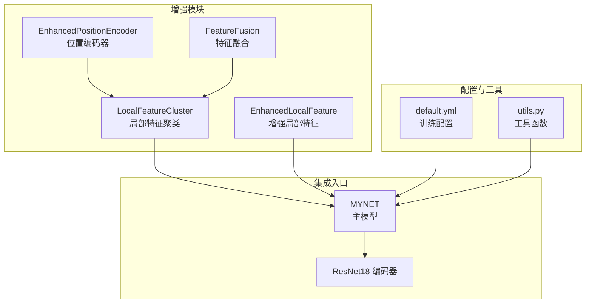
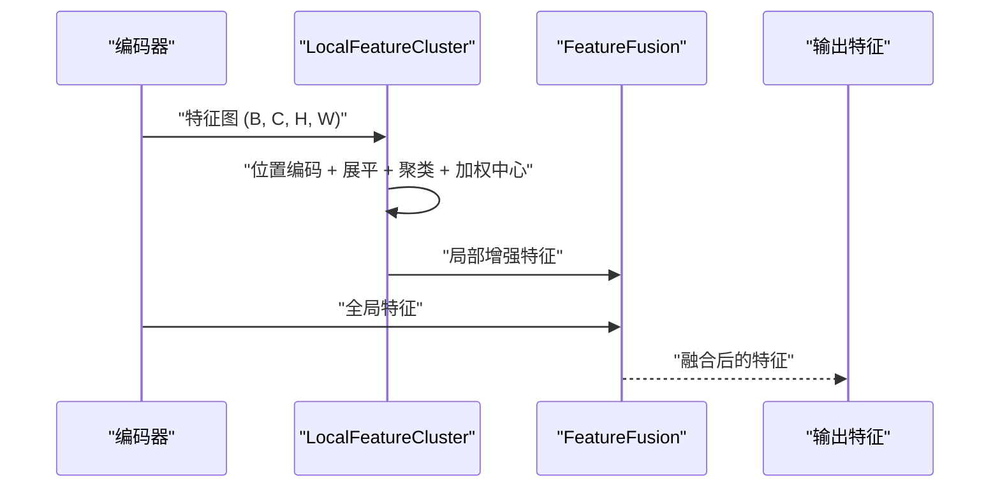
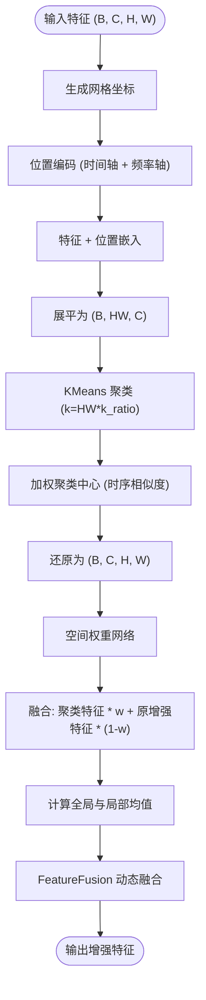
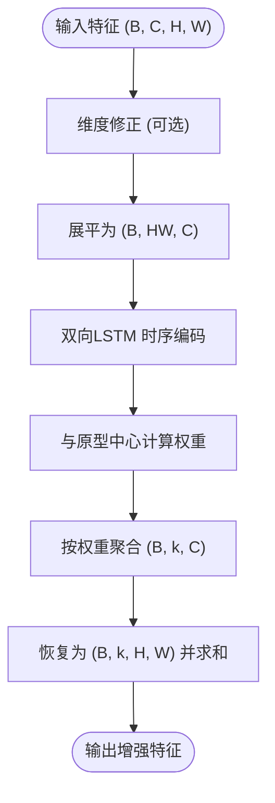
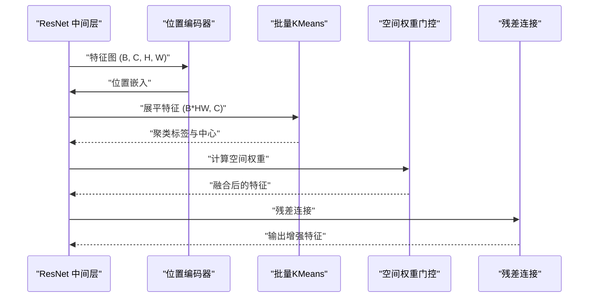
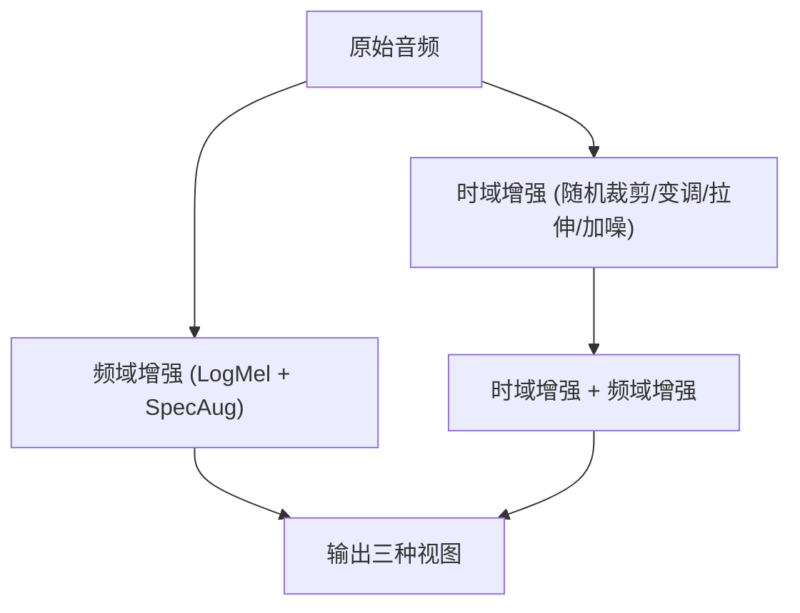
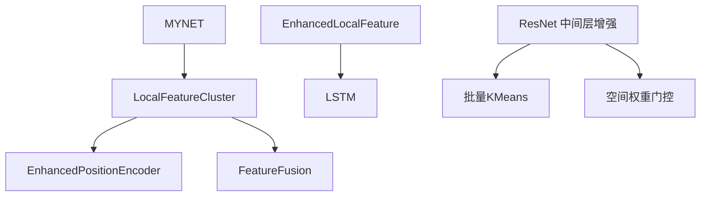

# 特征增强模块

<cite>
**本文档引用的文件**
- [enhance_module.py](file://enhance_module.py)
- [librispeech_enhance.py](file://librispeech_enhance.py)
- [models/feature_enhancer.py](file://models/feature_enhancer.py)
- [models/resnet_enhancer.py](file://models/resnet_enhancer.py)
- [utils/utils.py](file://utils/utils.py)
- [network.py](file://network.py)
- [train.py](file://train.py)
- [test.py](file://test.py)
- [configs/default.yml](file://configs/default.yml)
</cite>

## 目录
1. [简介](#简介)
2. [项目结构](#项目结构)
3. [核心组件](#核心组件)
4. [架构总览](#架构总览)
5. [详细组件分析](#详细组件分析)
6. [依赖关系分析](#依赖关系分析)
7. [性能考虑](#性能考虑)
8. [故障排除指南](#故障排除指南)
9. [结论](#结论)
10. [附录](#附录)

## 简介
本模块专注于提升特征表示质量与判别能力，通过结合局部特征聚类与全局上下文信息，实现对特征空间的增强。模块包含两类增强策略：
- 局部特征聚类：在空间维度上对特征进行动态聚类，利用时序相似度矩阵构建加权原型，从而增强局部细节与空间相关性。
- 全局特征增强：通过位置编码与空间权重网络，将全局上下文信息融入局部特征，实现跨尺度的特征融合。

模块同时提供两种实现路径：
- 基于 ResNet 中间层的空间特征增强（适合卷积特征图）
- 基于时序 LSTM 的局部特征增强（适合序列特征）

## 项目结构
特征增强模块分布在多个文件中，分别负责不同层面的增强策略与集成方式：
- enhance_module.py：定义了增强模块的核心组件（位置编码器、特征融合、局部特征聚类等）
- models/resnet_enhancer.py：面向 ResNet 中间层特征的增强实现
- models/feature_enhancer.py：面向时序特征的增强实现
- utils/utils.py：通用工具与早期版本的局部特征聚类实现
- network.py：模型集成入口，展示如何在编码器中集成增强模块
- train.py/test.py：训练与测试脚本中对增强模块的使用示例
- configs/default.yml：训练配置，包含特征维度等关键参数

**图表来源**
- [enhance_module.py:14-160](file://enhance_module.py#L14-L160)
- [models/resnet_enhancer.py:51-172](file://models/resnet_enhancer.py#L51-L172)
- [models/feature_enhancer.py:27-93](file://models/feature_enhancer.py#L27-L93)
- [network.py:18-518](file://network.py#L18-L518)
- [configs/default.yml:1-88](file://configs/default.yml#L1-L88)
- [utils/utils.py:61-131](file://utils/utils.py#L61-L131)

**章节来源**
- [enhance_module.py:14-160](file://enhance_module.py#L14-L160)
- [models/resnet_enhancer.py:51-172](file://models/resnet_enhancer.py#L51-L172)
- [models/feature_enhancer.py:27-93](file://models/feature_enhancer.py#L27-L93)
- [utils/utils.py:61-131](file://utils/utils.py#L61-L131)
- [network.py:18-518](file://network.py#L18-L518)
- [configs/default.yml:1-88](file://configs/default.yml#L1-L88)

## 核心组件
- 位置编码器（EnhancedPositionEncoder）：对网格坐标进行时间轴与频率轴的独立编码，并通过动态门控融合，生成与特征维度一致的位置嵌入。
- 特征融合（FeatureFusion）：基于 MLP 的动态权重计算，融合全局特征与局部特征，输出融合后的特征表示。
- 局部特征聚类（LocalFeatureCluster）：对空间特征进行展平与聚类，利用时序相似度矩阵对聚类中心进行加权，再通过空间权重网络与原特征融合。
- 增强局部特征（EnhancedLocalFeature）：对时序特征进行 LSTM 编码，结合动态权重与原型中心，实现时序增强与降维聚合。

**章节来源**
- [enhance_module.py:14-160](file://enhance_module.py#L14-L160)
- [models/resnet_enhancer.py:51-172](file://models/resnet_enhancer.py#L51-L172)
- [models/feature_enhancer.py:27-93](file://models/feature_enhancer.py#L27-L93)

## 架构总览
增强模块在模型中的集成路径如下：
- 在编码器的中间层（如 layer3）插入 LocalFeatureCluster，对特征图进行空间增强与融合。
- 在时序特征路径中使用 EnhancedLocalFeature，对展平后的时序特征进行 LSTM 编码与原型聚类。
- 通过 FeatureFusion 将全局与局部特征进行动态融合，提升判别能力。

**图表来源**
- [network.py:290-311](file://network.py#L290-L311)
- [enhance_module.py:70-148](file://enhance_module.py#L70-L148)
- [models/resnet_enhancer.py:73-160](file://models/resnet_enhancer.py#L73-L160)

**章节来源**
- [network.py:290-311](file://network.py#L290-L311)
- [enhance_module.py:70-148](file://enhance_module.py#L70-L148)
- [models/resnet_enhancer.py:73-160](file://models/resnet_enhancer.py#L73-L160)

## 详细组件分析

### 局部特征聚类（LocalFeatureCluster）
工作机制：
- 位置编码：生成网格坐标，分别对时间轴与频率轴进行编码，并通过动态门控融合。
- 特征增强：将位置嵌入加到原特征上，提升空间感知。
- 动态聚类：对展平后的特征进行 KMeans 聚类，利用时序相似度矩阵对聚类中心进行加权，形成更稳定的原型。
- 空间权重增强：通过 MLP 计算空间权重，融合聚类特征与原增强特征。
- 全局-局部融合：计算全局特征与局部增强特征的均值，通过 FeatureFusion 进行动态融合。

**图表来源**
- [enhance_module.py:95-148](file://enhance_module.py#L95-L148)

**章节来源**
- [enhance_module.py:70-148](file://enhance_module.py#L70-L148)

### 增强局部特征（EnhancedLocalFeature）
工作机制：
- 维度修正：若输入通道数与目标维度不一致，通过线性层进行维度对齐。
- 时序特征提取：将空间特征展平为时序序列，使用双向 LSTM 提取时序特征。
- 动态权重计算：通过与原型中心的内积计算权重，进行软聚类。
- 特征聚合：按权重对空间特征进行聚合，恢复为 (B, k, H, W) 并进行求和降维。

**图表来源**
- [models/feature_enhancer.py:49-93](file://models/feature_enhancer.py#L49-L93)

**章节来源**
- [models/feature_enhancer.py:27-93](file://models/feature_enhancer.py#L27-L93)

### ResNet 中间层增强（LocalFeatureCluster）
工作机制：
- 位置编码：与上述类似，但针对 ResNet 中间层的通道数进行适配。
- 批量聚类：将所有样本的特征一次性迁移到 CPU 进行聚类，减少 CPU-GPU 交互次数。
- 空间相似度加权：对聚类中心进行空间相似度加权，提升稳定性。
- 残差连接：保留原特征并通过空间权重融合，确保增强不破坏原特征。

**图表来源**
- [models/resnet_enhancer.py:73-160](file://models/resnet_enhancer.py#L73-L160)

**章节来源**
- [models/resnet_enhancer.py:51-172](file://models/resnet_enhancer.py#L51-L172)

### 音频增强（AdvancedAudioAugmentor）
工作机制：
- 多视图生成：提供时域、频域与混合增强三种视图，丰富训练样本的多样性。
- 配置驱动：通过配置文件控制增强强度与概率，支持噪声库与 SpecAugmentation。
- 可视化：提供增强效果的波形与频谱对比可视化。

**图表来源**
- [librispeech_enhance.py:17-134](file://librispeech_enhance.py#L17-L134)

**章节来源**
- [librispeech_enhance.py:17-134](file://librispeech_enhance.py#L17-L134)

## 依赖关系分析
- LocalFeatureCluster 依赖位置编码器与特征融合模块，实现空间增强与全局-局部融合。
- EnhancedLocalFeature 依赖 LSTM 与时序注意力机制，实现时序增强与原型聚类。
- ResNet 中间层增强依赖批量 KMeans 与空间权重门控，实现高效的空间聚类与融合。
- MYNET 在编码器中集成 LocalFeatureCluster，实现端到端的特征增强。

**图表来源**
- [enhance_module.py:70-148](file://enhance_module.py#L70-L148)
- [models/feature_enhancer.py:27-93](file://models/feature_enhancer.py#L27-L93)
- [models/resnet_enhancer.py:51-172](file://models/resnet_enhancer.py#L51-L172)
- [network.py:18-518](file://network.py#L18-L518)

**章节来源**
- [enhance_module.py:70-148](file://enhance_module.py#L70-L148)
- [models/feature_enhancer.py:27-93](file://models/feature_enhancer.py#L27-L93)
- [models/resnet_enhancer.py:51-172](file://models/resnet_enhancer.py#L51-L172)
- [network.py:18-518](file://network.py#L18-L518)

## 性能考虑
- 设备一致性：所有模块在前向过程中确保参数与输入在同一设备上，避免设备迁移开销。
- 批量聚类：ResNet 中间层增强采用批量聚类，减少 CPU-GPU 交互次数，提高聚类效率。
- 动态权重：通过 MLP 或注意力机制计算动态权重，避免固定权重导致的信息丢失。
- 维度修正：对输入维度与目标维度不一致的情况进行自动修正，确保网络兼容性。
- 可视化与调试：提供权重分布可视化与不确定性估计，便于调试与调优。

[本节为通用性能讨论，无需特定文件来源]

## 故障排除指南
- 设备不一致：若出现设备不一致错误，检查模块的设备一致性管理逻辑，确保参数与输入在同一设备上。
- 维度不匹配：若维度不匹配，检查维度修正层与输入维度，确保维度对齐。
- 聚类失败：若聚类失败，检查 k_ratio 参数与特征维度，确保聚类数合理。
- 不确定性估计：若不确定性估计异常，检查 MC Dropout 模式与增强开关，确保增强模块正常工作。

**章节来源**
- [utils/utils.py:23-60](file://utils/utils.py#L23-L60)
- [models/resnet_enhancer.py:168-172](file://models/resnet_enhancer.py#L168-L172)
- [enhance_module.py:154-160](file://enhance_module.py#L154-L160)

## 结论
特征增强模块通过局部聚类与全局上下文的融合，显著提升了特征表示的质量与判别能力。模块提供了多种实现路径，既能适配卷积特征图，也能处理时序特征，满足不同任务需求。通过合理的参数配置与性能优化策略，模块能够在保持高效的同时获得更好的增强效果。

[本节为总结性内容，无需特定文件来源]

## 附录

### 参数配置与调优建议
- feat_dim：特征维度，需与编码器输出一致。默认值见配置文件。
- k_ratio：聚类比例，控制聚类数与增强强度。建议在 0.2-0.5 之间调整。
- temporal_scale：时序相似度权重，影响聚类中心的加权程度。建议根据数据特性调整。
- 使用 ResNet 中间层增强时，注意通道数与 feat_dim 的匹配，必要时启用维度修正层。
- 在音频任务中，可通过配置文件调整增强强度与概率，平衡多样性与稳定性。

**章节来源**
- [configs/default.yml:12-88](file://configs/default.yml#L12-L88)
- [models/resnet_enhancer.py:52-56](file://models/resnet_enhancer.py#L52-L56)
- [enhance_module.py:71-75](file://enhance_module.py#L71-L75)

### 集成指南
- 在 MYNET 中集成 LocalFeatureCluster：在编码器的中间层插入增强模块，确保输出形状与后续层兼容。
- 在训练脚本中使用增强模块：通过调用增强模块对特征进行增强，并在损失函数中使用增强后的特征。
- 在测试脚本中使用增强模块：通过不确定性估计与可视化工具，评估增强效果并进行调优。

**章节来源**
- [network.py:290-311](file://network.py#L290-L311)
- [train.py:439-465](file://train.py#L439-L465)
- [test.py:449-563](file://test.py#L449-L563)