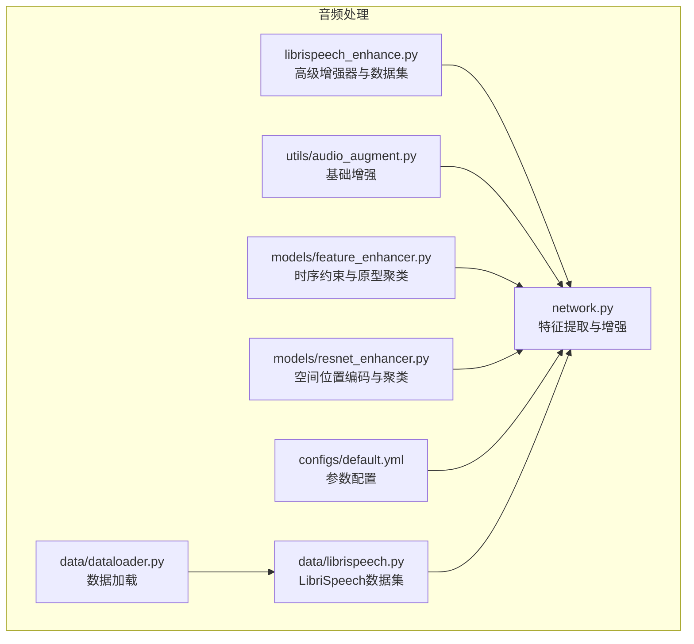
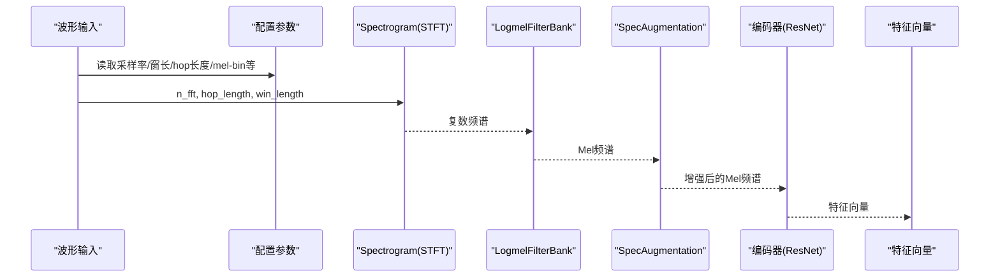
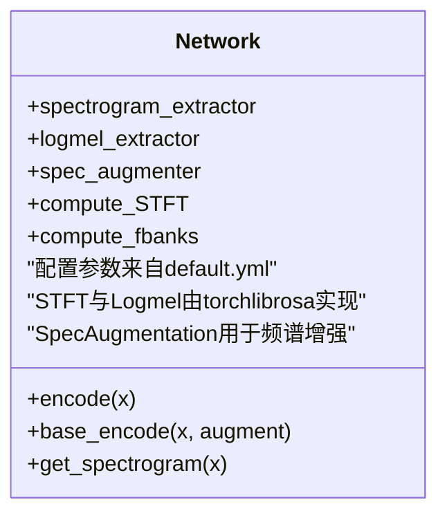
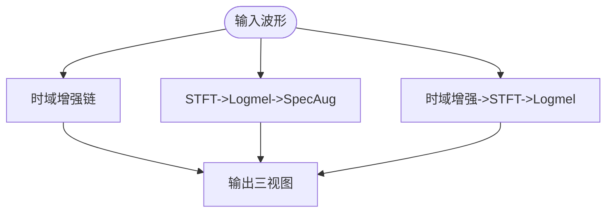
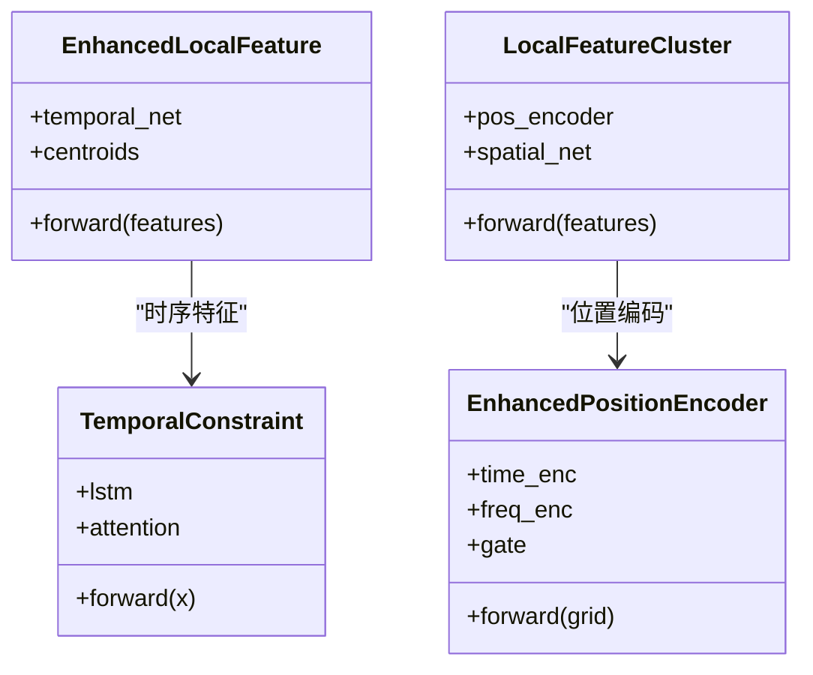
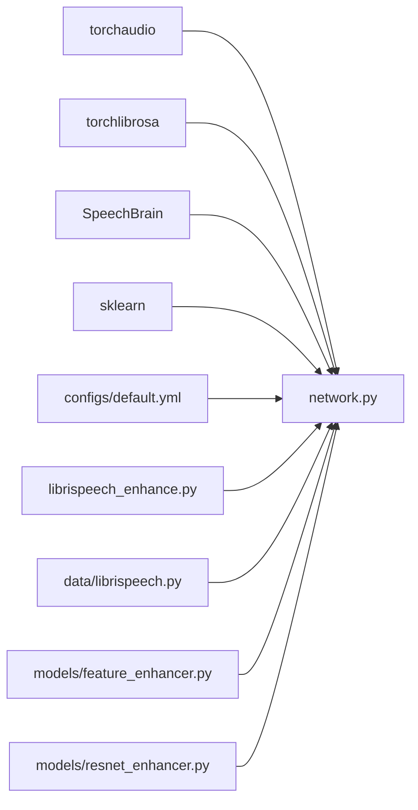
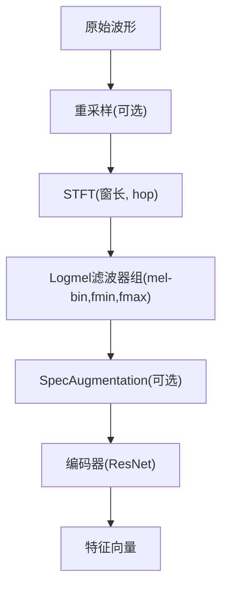

# 音频处理模块

<cite>
**本文引用的文件列表**
- [network.py](file://network.py)
- [librispeech_enhance.py](file://librispeech_enhance.py)
- [utils/audio_augment.py](file://utils/audio_augment.py)
- [models/feature_enhancer.py](file://models/feature_enhancer.py)
- [models/resnet_enhancer.py](file://models/resnet_enhancer.py)
- [configs/default.yml](file://configs/default.yml)
- [data/dataloader.py](file://data/dataloader.py)
- [data/librispeech.py](file://data/librispeech.py)
</cite>

## 目录
1. [简介](#简介)
2. [项目结构](#项目结构)
3. [核心组件](#核心组件)
4. [架构总览](#架构总览)
5. [详细组件分析](#详细组件分析)
6. [依赖关系分析](#依赖关系分析)
7. [性能考量](#性能考量)
8. [故障排查指南](#故障排查指南)
9. [结论](#结论)
10. [附录](#附录)

## 简介
本模块围绕音频特征提取与增强展开，覆盖从原始波形到Mel频谱的完整处理管线，并结合多种增强策略（时域、频域、混合视图）。模块同时支持多采样率场景（如16kHz与44.1kHz），并通过配置文件统一管理关键参数（如窗长、hop长度、mel-bin数量、频率范围等）。文档将系统阐述：
- STFT变换与Logmel滤波器组的实现与参数影响
- 不同采样率下的处理策略与SpeechBrain/TorchAudio集成
- 预处理参数配置对特征质量与模型性能的影响
- 音频处理管道图与特征提取流程图
- 开发者配置指南与性能优化建议

## 项目结构
该仓库以“功能域”组织，音频处理相关代码主要分布在以下位置：
- 网络与特征提取：network.py
- 增强与数据集：librispeech_enhance.py、data/librispeech.py
- 基础增强工具：utils/audio_augment.py
- 局部特征增强与聚类：models/feature_enhancer.py、models/resnet_enhancer.py
- 配置：configs/default.yml
- 数据加载器：data/dataloader.py

图表来源
- [network.py:326-503](file://network.py#L326-L503)
- [librispeech_enhance.py:17-134](file://librispeech_enhance.py#L17-L134)
- [utils/audio_augment.py:1-31](file://utils/audio_augment.py#L1-L31)
- [models/feature_enhancer.py:1-93](file://models/feature_enhancer.py#L1-L93)
- [models/resnet_enhancer.py:1-172](file://models/resnet_enhancer.py#L1-L172)
- [configs/default.yml:77-84](file://configs/default.yml#L77-L84)
- [data/dataloader.py:19-81](file://data/dataloader.py#L19-L81)
- [data/librispeech.py:21-79](file://data/librispeech.py#L21-L79)

章节来源
- [network.py:326-503](file://network.py#L326-L503)
- [librispeech_enhance.py:17-134](file://librispeech_enhance.py#L17-L134)
- [utils/audio_augment.py:1-31](file://utils/audio_augment.py#L1-L31)
- [models/feature_enhancer.py:1-93](file://models/feature_enhancer.py#L1-L93)
- [models/resnet_enhancer.py:1-172](file://models/resnet_enhancer.py#L1-L172)
- [configs/default.yml:77-84](file://configs/default.yml#L77-L84)
- [data/dataloader.py:19-81](file://data/dataloader.py#L19-L81)
- [data/librispeech.py:21-79](file://data/librispeech.py#L21-L79)

## 核心组件
- 特征提取与增强模块（network.py）
  - STFT与Logmel提取器：通过torchlibrosa的Spectrogram与LogmelFilterBank实现，支持配置化参数（n_fft、hop_length、win_length、n_mels、fmin/fmax等）
  - SpeechBrain集成：compute_STFT与Filterbank用于兼容不同采样率场景
  - 频谱增强：SpecAugmentation用于时域/频域遮挡
  - 编码流程：先提取Mel频谱，再经卷积网络编码为特征向量
- 高级音频增强器（librispeech_enhance.py）
  - 多视图增强：时域增强、频域增强、混合增强，输出三路视图
  - 可配置参数：n_fft、n_mels、SpecAug参数、各类增强概率
  - 噪声库支持：可选加载真实环境噪声
- 基础增强工具（utils/audio_augment.py）
  - 时间拉伸与时域音高变换，便于快速增强
- 局部特征增强与聚类（models/feature_enhancer.py、models/resnet_enhancer.py）
  - 时序约束：LSTM+注意力聚合
  - 空间位置编码：时间/频率两轴独立编码与动态融合
  - 原型聚类：基于KMeans与空间相似度的加权聚类，空间权重融合
- 配置（configs/default.yml）
  - 关键参数：sample_rate、window_size、hop_size、mel_bins、fmin、fmax、window
- 数据加载（data/dataloader.py、data/librispeech.py）
  - LibriSpeech数据集封装，支持few-shot与开放集测试
  - 数据加载器支持多进程与固定种子

章节来源
- [network.py:326-503](file://network.py#L326-L503)
- [librispeech_enhance.py:17-134](file://librispeech_enhance.py#L17-L134)
- [utils/audio_augment.py:1-31](file://utils/audio_augment.py#L1-L31)
- [models/feature_enhancer.py:1-93](file://models/feature_enhancer.py#L1-L93)
- [models/resnet_enhancer.py:1-172](file://models/resnet_enhancer.py#L1-L172)
- [configs/default.yml:77-84](file://configs/default.yml#L77-L84)
- [data/dataloader.py:19-81](file://data/dataloader.py#L19-L81)
- [data/librispeech.py:21-79](file://data/librispeech.py#L21-L79)

## 架构总览
音频处理的整体流程如下：
- 输入波形经torchaudio加载
- 依据配置参数执行STFT与Logmel滤波器组
- 可选SpecAugmentation进行频谱增强
- 将Mel频谱送入编码器（ResNet）提取特征
- 可选局部特征增强（原型聚类、位置编码、空间权重融合）

图表来源
- [network.py:326-503](file://network.py#L326-L503)
- [configs/default.yml:77-84](file://configs/default.yml#L77-L84)

章节来源
- [network.py:326-503](file://network.py#L326-L503)
- [configs/default.yml:77-84](file://configs/default.yml#L77-L84)

## 详细组件分析

### 组件A：特征提取与增强（network.py）
- STFT与Logmel提取器
  - 参数来源：extractor配置（sample_rate、window_size、hop_size、mel_bins、fmin、fmax、window）
  - 作用：将波形映射到Mel频谱，作为后续卷积编码的基础
- SpeechBrain集成
  - compute_STFT与Filterbank用于不同采样率场景（如44.1kHz与16kHz）
  - 通过win_length与hop_length的采样率换算保证时域步长一致
- 频谱增强
  - SpecAugmentation：时域/频域遮挡，提升模型鲁棒性
- 编码流程
  - 先做Mel频谱，再经BN与通道扩展，最后进入ResNet编码

图表来源
- [network.py:326-503](file://network.py#L326-L503)
- [configs/default.yml:77-84](file://configs/default.yml#L77-L84)

章节来源
- [network.py:326-503](file://network.py#L326-L503)
- [configs/default.yml:77-84](file://configs/default.yml#L77-L84)

### 组件B：高级音频增强器（librispeech_enhance.py）
- 多视图增强
  - 视图1：纯时域增强（随机裁剪、音高变换、时间拉伸、极性反转、噪声叠加）
  - 视图2：纯频域增强（先STFT再Logmel，随后SpecAugmentation）
  - 视图3：混合增强（先时域增强，再STFT与Logmel）
- 可配置参数
  - n_fft、n_mels、SpecAug参数、各类增强概率、是否启用噪声库
- 噪声库
  - 可选加载真实环境噪声，按SNR混合

图表来源
- [librispeech_enhance.py:17-134](file://librispeech_enhance.py#L17-L134)

章节来源
- [librispeech_enhance.py:17-134](file://librispeech_enhance.py#L17-L134)

### 组件C：基础增强工具（utils/audio_augment.py）
- 时间拉伸与时域音高变换
  - 保持批处理维度，随机选择增强策略
- 适用场景
  - 快速增强与轻量实验

章节来源
- [utils/audio_augment.py:1-31](file://utils/audio_augment.py#L1-L31)

### 组件D：局部特征增强与聚类（models/feature_enhancer.py、models/resnet_enhancer.py）
- 时序约束（feature_enhancer.py）
  - LSTM双向编码+注意力聚合，保留时序上下文
- 空间位置编码与聚类（resnet_enhancer.py）
  - 时间/频率两轴独立编码，动态融合门控
  - KMeans聚类，基于空间相似度加权中心，空间权重融合
  - 残差连接，稳定训练

图表来源
- [models/feature_enhancer.py:1-93](file://models/feature_enhancer.py#L1-L93)
- [models/resnet_enhancer.py:1-172](file://models/resnet_enhancer.py#L1-L172)

章节来源
- [models/feature_enhancer.py:1-93](file://models/feature_enhancer.py#L1-L93)
- [models/resnet_enhancer.py:1-172](file://models/resnet_enhancer.py#L1-L172)

### 组件E：配置与数据加载（configs/default.yml、data/dataloader.py、data/librispeech.py）
- 配置项
  - extractor.sample_rate、window_size、hop_size、mel_bins、fmin、fmax、window
- 数据加载
  - LibriSpeech数据集封装，支持few-shot与开放集测试
  - 数据加载器支持多进程、固定种子，便于复现实验

章节来源
- [configs/default.yml:77-84](file://configs/default.yml#L77-L84)
- [data/dataloader.py:19-81](file://data/dataloader.py#L19-L81)
- [data/librispeech.py:21-79](file://data/librispeech.py#L21-L79)

## 依赖关系分析
- 外部库依赖
  - torchaudio：音频加载、时间拉伸、音高变换
  - torchlibrosa：STFT与Logmel滤波器组、SpecAugmentation
  - SpeechBrain：STFT与Filterbank（多采样率场景）
  - scikit-learn：RobustScaler、KMeans
- 内部模块耦合
  - network.py依赖configs/default.yml中的extractor参数
  - librispeech_enhance.py与data/librispeech.py共同构成数据增强与加载闭环
  - models/*模块可与编码器配合，形成端到端特征增强链

图表来源
- [network.py:326-503](file://network.py#L326-L503)
- [librispeech_enhance.py:17-134](file://librispeech_enhance.py#L17-L134)
- [data/librispeech.py:21-79](file://data/librispeech.py#L21-L79)
- [configs/default.yml:77-84](file://configs/default.yml#L77-L84)
- [models/feature_enhancer.py:1-93](file://models/feature_enhancer.py#L1-L93)
- [models/resnet_enhancer.py:1-172](file://models/resnet_enhancer.py#L1-L172)

章节来源
- [network.py:326-503](file://network.py#L326-L503)
- [librispeech_enhance.py:17-134](file://librispeech_enhance.py#L17-L134)
- [data/librispeech.py:21-79](file://data/librispeech.py#L21-L79)
- [configs/default.yml:77-84](file://configs/default.yml#L77-L84)
- [models/feature_enhancer.py:1-93](file://models/feature_enhancer.py#L1-L93)
- [models/resnet_enhancer.py:1-172](file://models/resnet_enhancer.py#L1-L172)

## 性能考量
- 窗长与hop长度
  - 窗长越大，频率分辨率越高但时间分辨率降低；hop长度越小，时序重叠越多，计算量增大
  - 建议根据任务需求平衡时间分辨率与计算成本
- mel-bin数量
  - mel-bin越多，频率分辨率越高，但会增加特征维度与计算开销
  - 在资源受限场景可适当减小mel-bin数量
- SpecAugmentation
  - 适度的遮挡能提升鲁棒性，过度遮挡可能丢失关键信息
  - 建议在验证集上搜索最优参数
- 多采样率处理
  - 通过SpeechBrain的STFT与Filterbank实现跨采样率一致性
  - 注意win_length与hop_length的采样率换算，避免时域步长不一致
- 数据加载
  - 使用多进程与固定种子提升复现性与吞吐量
  - 合理设置num_workers与pin_memory

[本节为通用指导，无需列出具体文件来源]

## 故障排查指南
- Mel频谱维度异常
  - 检查n_fft、hop_length、win_length与采样率换算是否一致
  - 确认LogmelFilterBank的n_mels与fmin/fmax设置
- 设备不一致导致的错误
  - 确保EnhancedPositionEncoder与SpatialNet等模块与特征张量在同一设备
- KMeans聚类失败
  - 检查特征展平维度与聚类数k是否合理
  - 对于大尺寸特征，考虑批量CPU-GPU交互策略
- SpecAugmentation无效
  - 确认频谱已转为(B,1,T,M)格式后再应用
- 增强器概率未生效
  - 检查aug_prob配置与随机采样逻辑

章节来源
- [models/resnet_enhancer.py:73-172](file://models/resnet_enhancer.py#L73-L172)
- [librispeech_enhance.py:17-134](file://librispeech_enhance.py#L17-L134)
- [network.py:326-503](file://network.py#L326-L503)

## 结论
本模块通过配置化的STFT与Logmel提取、可插拔的增强策略以及局部特征增强机制，构建了灵活高效的音频特征提取与增强体系。结合多采样率支持与数据加载优化，能够满足从基础实验到复杂场景的多样化需求。建议在实际部署中优先校准关键参数（窗长、hop长度、mel-bin数量），并在验证集上微调增强强度，以获得最佳性能与鲁棒性。

[本节为总结性内容，无需列出具体文件来源]

## 附录

### 音频处理管道图（概念示意）

[本图为概念示意，无需列出具体文件来源]

### 配置项对照表
- extractor.sample_rate：采样率
- extractor.window_size：窗长（FFT点数）
- extractor.hop_size：hop长度
- extractor.mel_bins：mel-bin数量
- extractor.fmin/fmax：频率范围
- extractor.window：窗函数类型

章节来源
- [configs/default.yml:77-84](file://configs/default.yml#L77-L84)