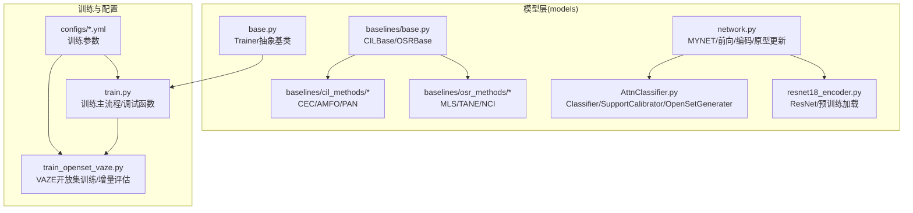
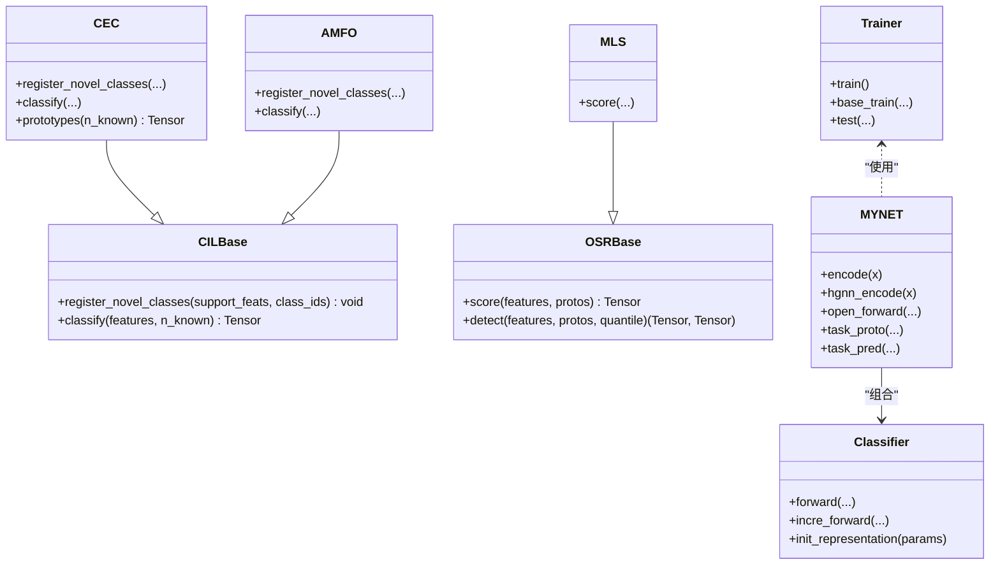
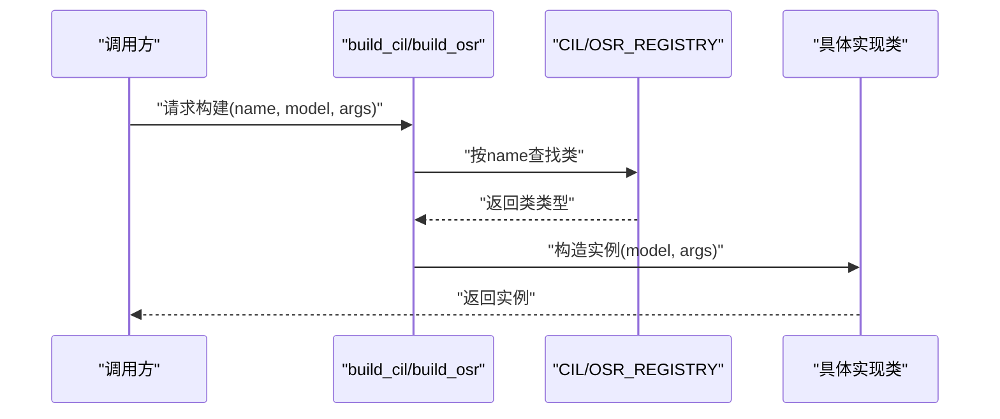
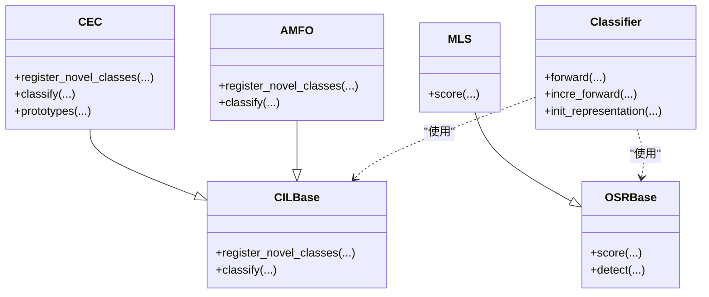
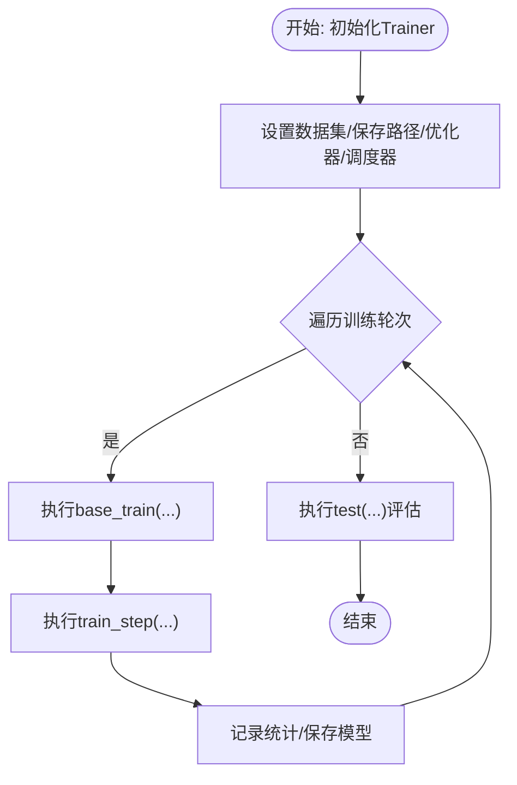
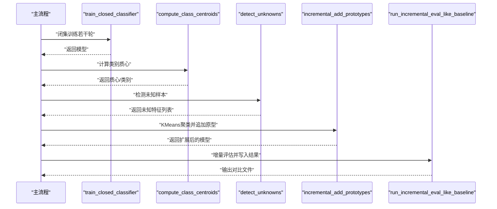
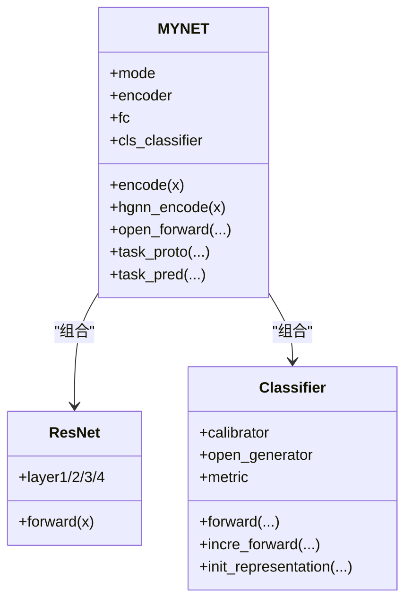
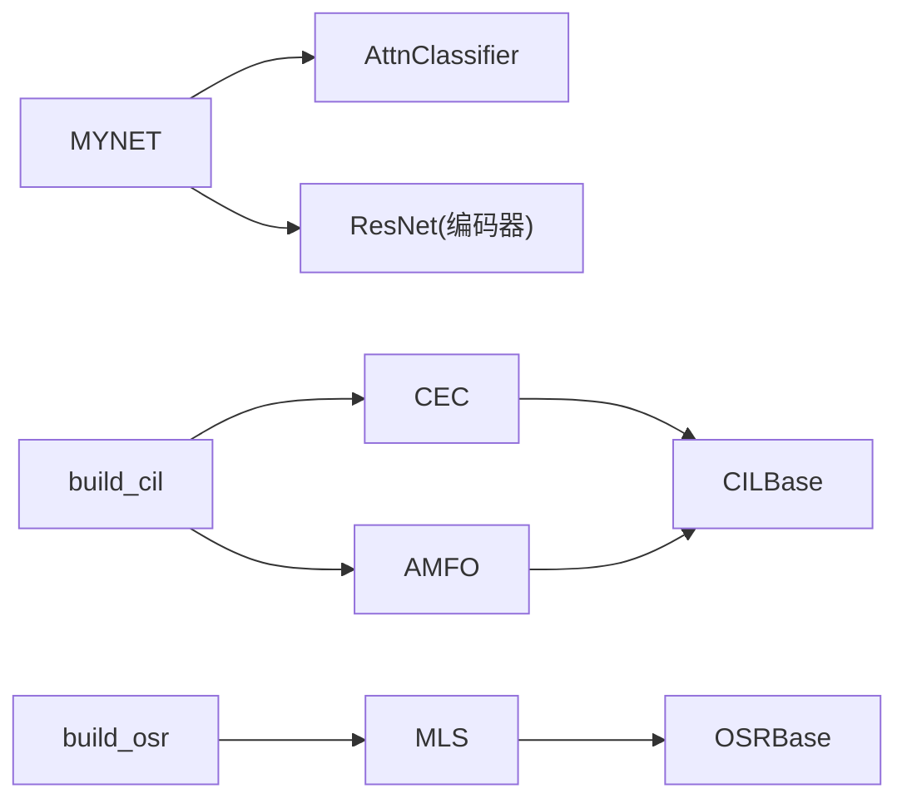

# 设计模式应用

<cite>
**本文引用的文件**   
- [models/baselines/base.py](file://models/baselines/base.py)
- [models/baselines/__init__.py](file://models/baselines/__init__.py)
- [models/baselines/cil_methods/__init__.py](file://models/baselines/cil_methods/__init__.py)
- [models/baselines/cil_methods/cec.py](file://models/baselines/cil_methods/cec.py)
- [models/baselines/cil_methods/amfo.py](file://models/baselines/cil_methods/amfo.py)
- [models/baselines/osr_methods/__init__.py](file://models/baselines/osr_methods/__init__.py)
- [models/baselines/osr_methods/mls.py](file://models/baselines/osr_methods/mls.py)
- [models/base.py](file://models/base.py)
- [network.py](file://network.py)
- [train_openset_vaze.py](file://train_openset_vaze.py)
- [train.py](file://train.py)
- [models/AttnClassifier.py](file://models/AttnClassifier.py)
- [models/resnet18_encoder.py](file://models/resnet18_encoder.py)
- [configs/quick_eval.yml](file://configs/quick_eval.yml)
</cite>

## 目录
1. [简介](#简介)
2. [项目结构](#项目结构)
3. [核心组件](#核心组件)
4. [架构总览](#架构总览)
5. [详细组件分析](#详细组件分析)
6. [依赖分析](#依赖分析)
7. [性能考量](#性能考量)
8. [故障排查指南](#故障排查指南)
9. [结论](#结论)
10. [附录](#附录)

## 简介
本文件聚焦VAZE系统中设计模式的应用与落地，围绕以下主题展开：
- 工厂模式：在增量学习与开放集识别方法的注册与构建中使用注册表（Registry）实现“按名构建”。
- 策略模式：在分类器与未知检测策略中通过统一接口抽象不同算法行为，运行期选择具体策略。
- 模板方法模式：在训练框架中定义训练流程骨架，由子类填充具体步骤（如数据准备、损失计算、评估）。

同时结合音频处理领域的特点（如梅尔频谱、STFT、ResNet编码器、原型聚类与增量更新），给出可扩展的设计建议与最佳实践。

## 项目结构
VAZE系统采用分层与功能域划分相结合的组织方式：
- models：核心模型与训练框架，包含基类、增量学习与开放集识别基线、注意力分类器、编码器等。
- data：数据加载与采样器，支撑few-shot与增量场景。
- configs：训练配置（YAML）。
- scripts：实验分析与可视化脚本。
- train.py、train_openset_vaze.py：训练入口与VAZE开放集训练流程。

**图表来源**
- [models/baselines/base.py:11-76](file://models/baselines/base.py#L11-L76)
- [models/baselines/cil_methods/__init__.py:7-18](file://models/baselines/cil_methods/__init__.py#L7-L18)
- [models/baselines/osr_methods/__init__.py:7-18](file://models/baselines/osr_methods/__init__.py#L7-L18)
- [models/AttnClassifier.py:38-101](file://models/AttnClassifier.py#L38-L101)
- [models/resnet18_encoder.py:240-334](file://models/resnet18_encoder.py#L240-L334)
- [network.py:18-670](file://network.py#L18-L670)
- [models/base.py:27-253](file://models/base.py#L27-L253)
- [train.py:799-800](file://train.py#L799-L800)
- [train_openset_vaze.py:420-477](file://train_openset_vaze.py#L420-L477)
- [configs/quick_eval.yml:1-51](file://configs/quick_eval.yml#L1-L51)

**章节来源**
- [models/baselines/base.py:11-76](file://models/baselines/base.py#L11-L76)
- [models/baselines/__init__.py:1-16](file://models/baselines/__init__.py#L1-L16)
- [models/baselines/cil_methods/__init__.py:7-18](file://models/baselines/cil_methods/__init__.py#L7-L18)
- [models/baselines/osr_methods/__init__.py:7-18](file://models/baselines/osr_methods/__init__.py#L7-L18)
- [models/AttnClassifier.py:38-101](file://models/AttnClassifier.py#L38-L101)
- [models/resnet18_encoder.py:240-334](file://models/resnet18_encoder.py#L240-L334)
- [network.py:18-670](file://network.py#L18-L670)
- [models/base.py:27-253](file://models/base.py#L27-L253)
- [train.py:799-800](file://train.py#L799-L800)
- [train_openset_vaze.py:420-477](file://train_openset_vaze.py#L420-L477)
- [configs/quick_eval.yml:1-51](file://configs/quick_eval.yml#L1-L51)

## 核心组件
- 增量学习基类与工具
  - CILBase：定义“注册新类原型”和“分类”的统一接口，供CEC、AMFO等实现。
  - OSRBase：定义“未知打分”和“批量自适应阈值检测”的统一接口，供MLS等实现。
  - 公共工具：余弦logits计算、从支持集构建原型。
- 方法注册与工厂
  - CIL_REGISTRY/OSR_REGISTRY：以名称到类的映射，配合build_cil/build_osr实现按名构建。
- 训练框架
  - Trainer抽象类：封装数据集初始化、保存路径、优化器/调度器、模型保存/加载、训练统计与记录等通用流程。
- 网络与特征
  - MYNET：集成ResNet编码器、音频前端（STFT/Logmel）、分类器（含注意力原型生成与伪类生成）、原型更新与温度控制。
  - AttnClassifier：支持校准器（SupportCalibrator）与开放集生成器（OpenSetGenerater），统一余弦度量与温度参数。
- 训练入口
  - train.py：标准训练主流程、调试聚类与特征增强可视化、测试函数等。
  - train_openset_vaze.py：VAZE风格的闭集训练+未知检测+增量原型扩展的完整流程。

**章节来源**
- [models/baselines/base.py:11-76](file://models/baselines/base.py#L11-L76)
- [models/baselines/cil_methods/__init__.py:7-18](file://models/baselines/cil_methods/__init__.py#L7-L18)
- [models/baselines/osr_methods/__init__.py:7-18](file://models/baselines/osr_methods/__init__.py#L7-L18)
- [models/base.py:27-253](file://models/base.py#L27-L253)
- [network.py:18-670](file://network.py#L18-L670)
- [models/AttnClassifier.py:38-101](file://models/AttnClassifier.py#L38-L101)
- [train.py:799-800](file://train.py#L799-L800)
- [train_openset_vaze.py:420-477](file://train_openset_vaze.py#L420-L477)

## 架构总览
VAZE系统采用“注册表+抽象基类+具体实现”的分层设计：
- 接口层：CILBase/OSRBase定义算法契约。
- 实现层：CEC/AMFO等实现增量学习策略；MLS等实现开放集打分策略。
- 工厂层：build_cil/build_osr通过注册表按名称构造实例。
- 训练层：Trainer定义训练流程骨架；MYNET/AttnClassifier负责特征与分类逻辑。
- 数据层：dataloader与采样器支撑few-shot与增量采样。

**图表来源**
- [models/baselines/base.py:11-76](file://models/baselines/base.py#L11-L76)
- [models/baselines/cil_methods/cec.py:41-83](file://models/baselines/cil_methods/cec.py#L41-L83)
- [models/baselines/cil_methods/amfo.py:19-65](file://models/baselines/cil_methods/amfo.py#L19-L65)
- [models/baselines/osr_methods/mls.py:15-26](file://models/baselines/osr_methods/mls.py#L15-L26)
- [models/base.py:27-253](file://models/base.py#L27-L253)
- [network.py:18-670](file://network.py#L18-L670)
- [models/AttnClassifier.py:38-101](file://models/AttnClassifier.py#L38-L101)

## 详细组件分析

### 工厂模式：按名构建增量学习与开放集识别方法
- 设计动机
  - 需要在配置驱动下灵活切换不同的增量学习或开放集识别策略，避免在调用端硬编码分支。
- 实现要点
  - 注册表：CIL_REGISTRY/OSR_REGISTRY以字符串名为键，映射到具体类。
  - 构建函数：build_cil/build_osr根据名称查找并实例化对应类，传入model与args。
- 优势
  - 易扩展：新增方法只需在注册表登记并实现接口。
  - 易配置：通过配置文件或命令行指定名称即可切换策略。
- 音频领域特殊考虑
  - 增量学习方法（如CEC/AMFO）与开放集方法（如MLS）均以“特征+原型”为核心，适配音频特征维度与语义信息融合（见AttnClassifier）。

**图表来源**
- [models/baselines/cil_methods/__init__.py:7-18](file://models/baselines/cil_methods/__init__.py#L7-L18)
- [models/baselines/osr_methods/__init__.py:7-18](file://models/baselines/osr_methods/__init__.py#L7-L18)

**章节来源**
- [models/baselines/cil_methods/__init__.py:7-18](file://models/baselines/cil_methods/__init__.py#L7-L18)
- [models/baselines/osr_methods/__init__.py:7-18](file://models/baselines/osr_methods/__init__.py#L7-L18)

### 策略模式：分类与未知检测策略
- 设计动机
  - 不同算法在“如何计算分类分数/如何打未知分”上有差异化需求，需通过统一接口屏蔽差异。
- 实现要点
  - CILBase/COSBase定义统一接口；具体策略实现各自逻辑。
  - MYNET的Classifier组合SupportCalibrator与OpenSetGenerater，形成“支持校准+伪类生成”的策略组合。
- 优势
  - 策略可替换：在训练/推理阶段按需切换或组合。
  - 便于扩展：新增策略只需实现接口并接入现有流程。
- 音频领域特殊考虑
  - 余弦相似与温度缩放在音频分类中稳定且高效；语义融合（如semang）可提升跨域泛化。

**图表来源**
- [models/baselines/base.py:11-76](file://models/baselines/base.py#L11-L76)
- [models/baselines/cil_methods/cec.py:41-83](file://models/baselines/cil_methods/cec.py#L41-L83)
- [models/baselines/cil_methods/amfo.py:19-65](file://models/baselines/cil_methods/amfo.py#L19-L65)
- [models/baselines/osr_methods/mls.py:15-26](file://models/baselines/osr_methods/mls.py#L15-L26)
- [models/AttnClassifier.py:38-101](file://models/AttnClassifier.py#L38-L101)

**章节来源**
- [models/baselines/base.py:11-76](file://models/baselines/base.py#L11-L76)
- [models/baselines/cil_methods/cec.py:41-83](file://models/baselines/cil_methods/cec.py#L41-L83)
- [models/baselines/cil_methods/amfo.py:19-65](file://models/baselines/cil_methods/amfo.py#L19-L65)
- [models/baselines/osr_methods/mls.py:15-26](file://models/baselines/osr_methods/mls.py#L15-L26)
- [models/AttnClassifier.py:38-101](file://models/AttnClassifier.py#L38-L101)

### 模板方法模式：训练流程骨架
- 设计动机
  - 多次实验需要一致的训练/验证/测试流程，但各阶段细节（如损失、评估指标）可变。
- 实现要点
  - Trainer抽象类定义通用流程（数据集初始化、保存路径、优化器/调度器、统计记录、模型保存/加载）。
  - 子类覆盖train/base_train/test等方法，注入具体逻辑。
- 优势
  - 减少重复代码，保证流程一致性。
  - 易于扩展新的训练阶段或评估指标。
- 音频领域特殊考虑
  - 音频数据的梅尔谱与时域变换、编码器的冻结/微调、原型更新策略等均可在子类中定制。

**图表来源**
- [models/base.py:27-253](file://models/base.py#L27-L253)

**章节来源**
- [models/base.py:27-253](file://models/base.py#L27-L253)

### VAZE开放集训练流程（模板方法+策略组合）
- 设计动机
  - 在VAZE框架中，先以闭集训练得到良好分类器，再用未知检测策略与增量聚类扩展原型，形成“闭集+开放集”的混合流程。
- 实现要点
  - 闭集训练：train_closed_classifier按标准交叉熵训练。
  - 未知检测：compute_class_centroids计算类别质心；detect_unknowns用置信度与余弦相似度双重阈值判断未知样本。
  - 增量扩展：incremental_add_prototypes对未知样本聚类并追加到分类器权重。
  - 评估：run_incremental_eval_like_baseline复用既有评估协议，输出对比结果。
- 优势
  - 流程清晰、可复现；与基线方法对比公平。
- 音频领域特殊考虑
  - 音频特征经MYNET编码后，余弦相似与温度缩放更稳健；未知检测阈值需结合音频域特性调优。

**图表来源**
- [train_openset_vaze.py:86-198](file://train_openset_vaze.py#L86-L198)
- [train_openset_vaze.py:248-417](file://train_openset_vaze.py#L248-L417)

**章节来源**
- [train_openset_vaze.py:86-198](file://train_openset_vaze.py#L86-L198)
- [train_openset_vaze.py:248-417](file://train_openset_vaze.py#L248-L417)

### MYNET与注意力分类器（组合与策略）
- 设计动机
  - 将编码器、音频前端、分类器与原型管理解耦，便于替换与组合。
- 实现要点
  - MYNET组合ResNet编码器与音频前端，提供多种模式（encoder/openmeta等）。
  - Classifier组合SupportCalibrator与OpenSetGenerater，统一余弦度量与温度参数。
- 优势
  - 模块化程度高，易于扩展新特征工程或新分类策略。
- 音频领域特殊考虑
  - STFT/Logmel参数与ResNet预训练权重需与数据集匹配；温度与余弦相似在音频域表现稳定。

**图表来源**
- [network.py:18-670](file://network.py#L18-L670)
- [models/resnet18_encoder.py:240-334](file://models/resnet18_encoder.py#L240-L334)
- [models/AttnClassifier.py:38-101](file://models/AttnClassifier.py#L38-L101)

**章节来源**
- [network.py:18-670](file://network.py#L18-L670)
- [models/resnet18_encoder.py:240-334](file://models/resnet18_encoder.py#L240-L334)
- [models/AttnClassifier.py:38-101](file://models/AttnClassifier.py#L38-L101)

## 依赖分析
- 组件耦合
  - MYNET与AttnClassifier强耦合（组合关系），MYNET在open_forward中调用Classifier完成原型与分数计算。
  - 增量学习与开放集识别通过CILBase/OSRBase与注册表弱耦合，便于替换。
- 外部依赖
  - 音频处理依赖torchlibrosa与speechbrain；ResNet预训练权重来自torch hub。
- 潜在循环依赖
  - 当前未发现循环导入；若未来在AttnClassifier中引入MYNET内部逻辑，需谨慎避免循环。

**图表来源**
- [network.py:18-670](file://network.py#L18-L670)
- [models/AttnClassifier.py:38-101](file://models/AttnClassifier.py#L38-L101)
- [models/resnet18_encoder.py:240-334](file://models/resnet18_encoder.py#L240-L334)
- [models/baselines/base.py:11-76](file://models/baselines/base.py#L11-L76)
- [models/baselines/cil_methods/__init__.py:7-18](file://models/baselines/cil_methods/__init__.py#L7-L18)
- [models/baselines/osr_methods/__init__.py:7-18](file://models/baselines/osr_methods/__init__.py#L7-L18)

**章节来源**
- [network.py:18-670](file://network.py#L18-L670)
- [models/AttnClassifier.py:38-101](file://models/AttnClassifier.py#L38-L101)
- [models/resnet18_encoder.py:240-334](file://models/resnet18_encoder.py#L240-L334)
- [models/baselines/base.py:11-76](file://models/baselines/base.py#L11-L76)
- [models/baselines/cil_methods/__init__.py:7-18](file://models/baselines/cil_methods/__init__.py#L7-L18)
- [models/baselines/osr_methods/__init__.py:7-18](file://models/baselines/osr_methods/__init__.py#L7-L18)

## 性能考量
- 计算复杂度
  - 增量学习：register_novel_classes与classify主要受特征维度与类别数影响；余弦相似与温度缩放开销低。
  - 开放集：detect_unknowns需对每个样本计算softmax与余弦相似，复杂度与批大小和类别数线性相关。
- 内存占用
  - 原型存储与分类器权重随类别数增长；聚类阶段需临时存储未知样本特征。
- 音频处理优化
  - 使用预训练ResNet与冻结编码器可显著降低训练成本；温度参数与余弦相似在音频域表现稳定，减少额外计算。
- 调度与收敛
  - 训练配置（学习率、调度器、正则）通过YAML集中管理，便于快速迭代。

[本节为通用性能讨论，无需特定文件来源]

## 故障排查指南
- 增量学习原型未更新
  - 检查register_novel_classes是否被调用、是否正确扩展fc权重尺寸。
  - 确认n_known参数与当前会话类别数一致。
- 开放集检测阈值不当
  - 调整detect_unknowns中的置信度与余弦阈值；可通过quantile自适应阈值。
- 模型保存/加载异常
  - 确认save_model/load_model路径与格式；检查best_model_dict同步。
- 训练不稳定
  - 检查学习率与温度参数；确认数据增强与SpecAugment配置与数据集匹配。

**章节来源**
- [models/baselines/base.py:27-55](file://models/baselines/base.py#L27-L55)
- [train_openset_vaze.py:134-170](file://train_openset_vaze.py#L134-L170)
- [models/base.py:153-175](file://models/base.py#L153-L175)

## 结论
VAZE系统通过注册表工厂、抽象基类与策略组合，实现了增量学习与开放集识别的高内聚、低耦合设计；借助模板方法模式，训练流程骨架清晰、可扩展性强。在音频处理领域，该设计充分利用余弦相似、温度缩放与预训练编码器的优势，既保证了性能，又便于进一步扩展与优化。

[本节为总结性内容，无需特定文件来源]

## 附录
- 配置参考
  - 训练参数（如温度、批次、学习率、调度器、网络模式）可在YAML中集中配置，便于快速切换与复现实验。

**章节来源**
- [configs/quick_eval.yml:1-51](file://configs/quick_eval.yml#L1-L51)