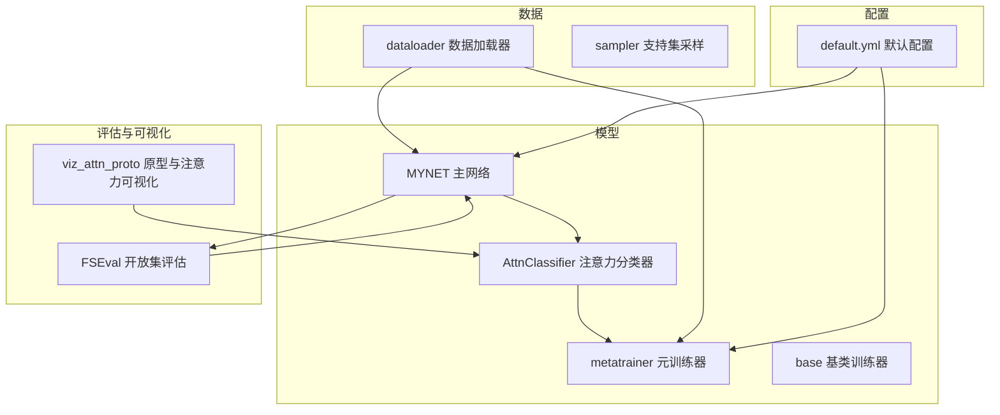
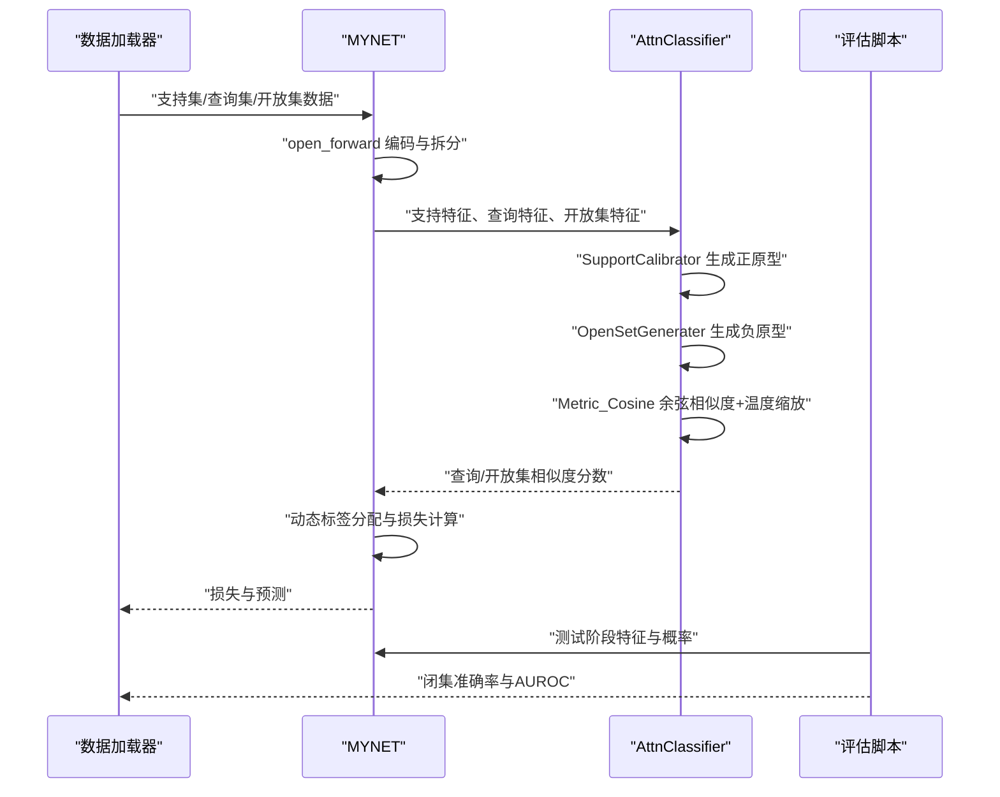
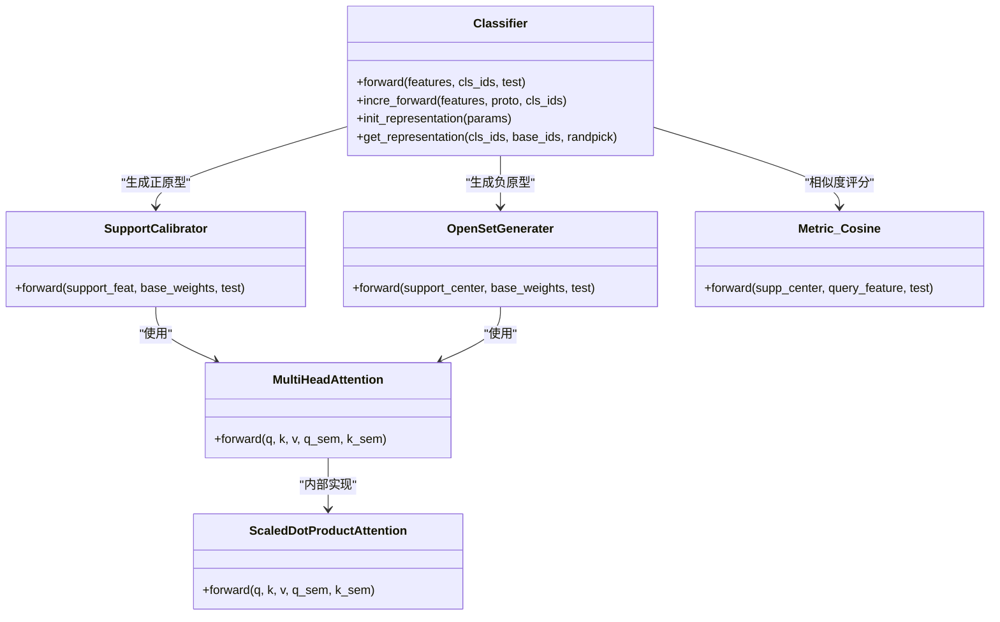
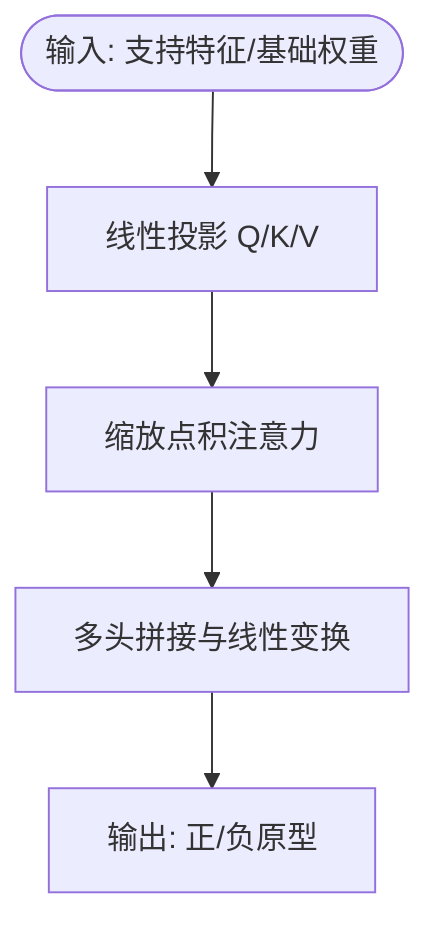
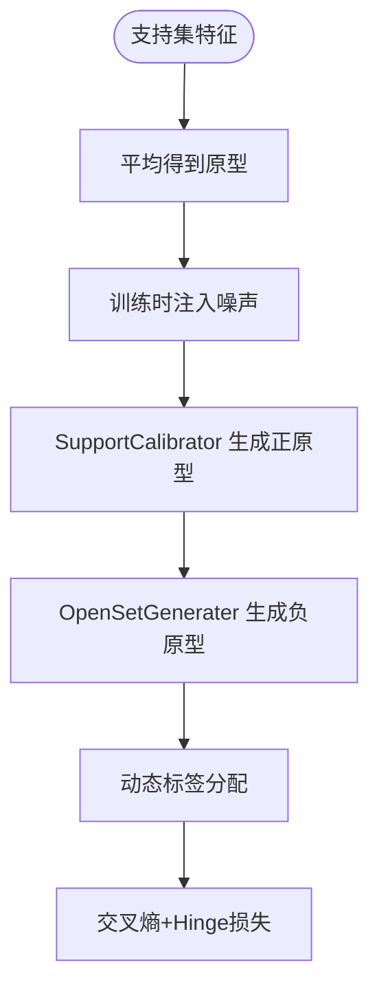
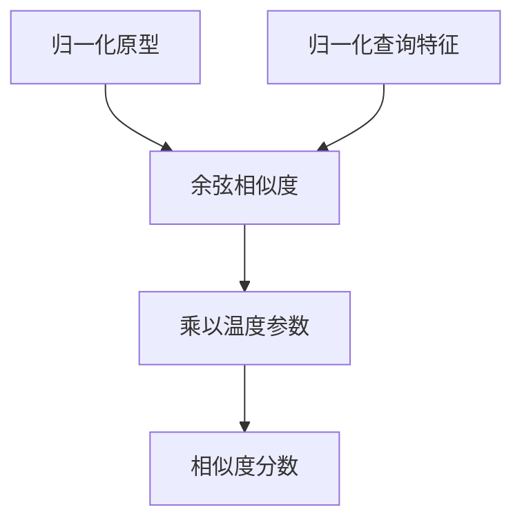
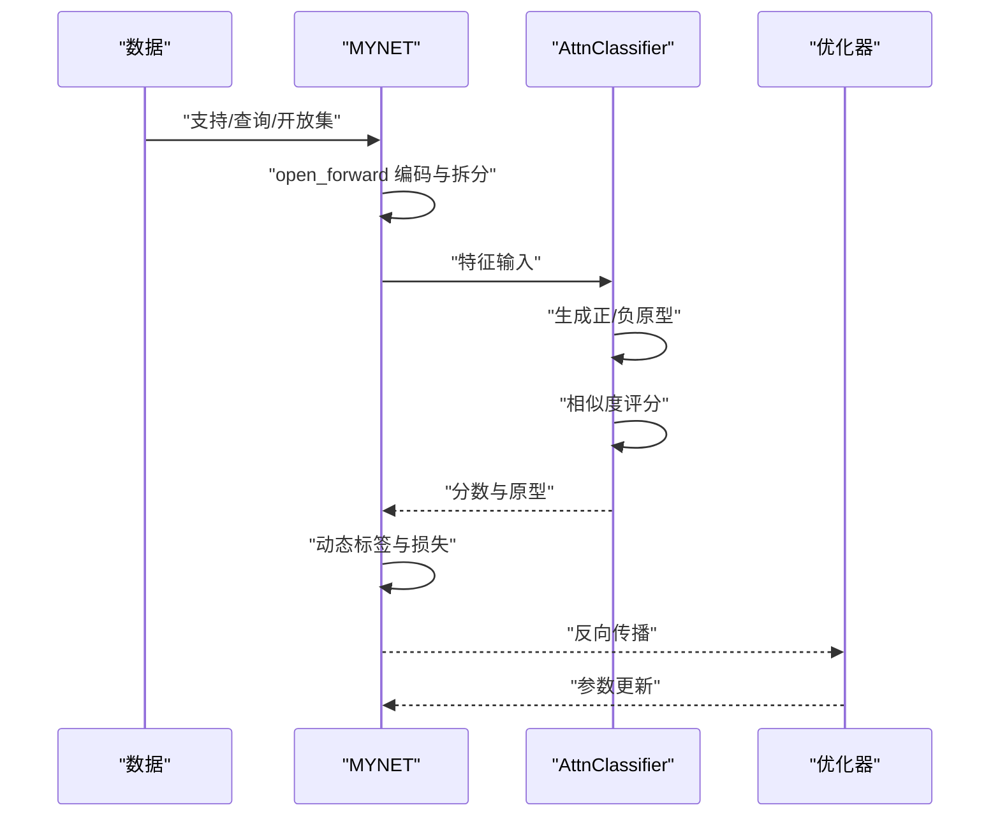
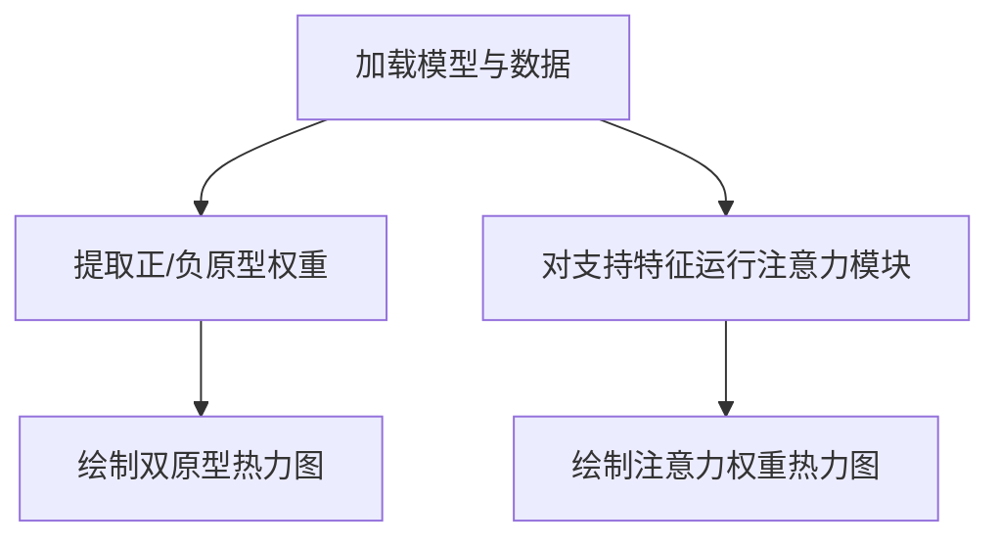
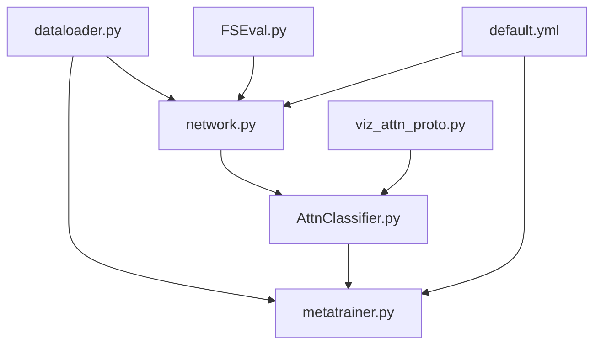

# 原型学习系统

<cite>
**本文引用的文件列表**
- [AttnClassifier.py](file://models/AttnClassifier.py)
- [metatrainer.py](file://models/metatrainer.py)
- [base.py](file://models/base.py)
- [network.py](file://network.py)
- [viz_attn_proto.py](file://scripts/viz_attn_proto.py)
- [default.yml](file://configs/default.yml)
- [dataloader.py](file://data/dataloader.py)
- [FSEval.py](file://models/FSEval.py)
</cite>

## 目录
1. [简介](#简介)
2. [项目结构](#项目结构)
3. [核心组件](#核心组件)
4. [架构总览](#架构总览)
5. [详细组件分析](#详细组件分析)
6. [依赖关系分析](#依赖关系分析)
7. [性能考量](#性能考量)
8. [故障排查指南](#故障排查指南)
9. [结论](#结论)
10. [附录](#附录)

## 简介
本文件面向VAZE系统的原型学习系统，围绕“通过类别原型进行分类决策”的基本原理展开，系统性阐述注意力分类器设计、多头注意力在原型生成中的作用、原型的动态生成与更新、相似度计算（余弦相似度与温度缩放）、少样本学习优势、完整实现流程、原型可视化技术，以及算法改进与扩展建议。文档旨在帮助读者快速理解并高效使用该原型学习框架。

## 项目结构
该项目采用模块化组织方式，核心模块包括：
- 模型定义与训练：MYNET主网络、AttnClassifier注意力分类器、元训练器
- 数据与采样：数据加载器、增量采样策略
- 评估与可视化：开放集评估脚本、原型与注意力热力图可视化脚本
- 配置：默认配置文件

图表来源
- [network.py:18-50](file://network.py#L18-L50)
- [AttnClassifier.py:38-93](file://models/AttnClassifier.py#L38-L93)
- [metatrainer.py:17-85](file://models/metatrainer.py#L17-L85)
- [dataloader.py:19-81](file://data/dataloader.py#L19-L81)
- [FSEval.py:17-42](file://models/FSEval.py#L17-L42)
- [viz_attn_proto.py:34-120](file://scripts/viz_attn_proto.py#L34-L120)
- [default.yml:1-88](file://configs/default.yml#L1-L88)

章节来源
- [network.py:18-50](file://network.py#L18-L50)
- [AttnClassifier.py:38-93](file://models/AttnClassifier.py#L38-L93)
- [metatrainer.py:17-85](file://models/metatrainer.py#L17-L85)
- [dataloader.py:19-81](file://data/dataloader.py#L19-L81)
- [FSEval.py:17-42](file://models/FSEval.py#L17-L42)
- [viz_attn_proto.py:34-120](file://scripts/viz_attn_proto.py#L34-L120)
- [default.yml:1-88](file://configs/default.yml#L1-L88)

## 核心组件
- MYNET主网络：负责音频特征提取、编码、以及在openmeta模式下的前向传播与损失计算；内置多头注意力模块用于原型与查询特征的融合。
- AttnClassifier注意力分类器：包含SupportCalibrator（支持集校准器）与OpenSetGenerater（开放集生成器），通过多头注意力生成正原型与负原型，并使用余弦相似度与温度缩放进行相似度评分。
- 元训练器metatrainer：加载预训练参数，初始化分类器表示，执行元训练周期，计算闭集准确率与开放集AUROC，并保存最佳模型。
- 数据加载器与采样：提供支持集/查询集/开放集的批量数据，支持增量学习场景下的类别序列与采样策略。
- 评估与可视化：开放集评估脚本用于统计闭集准确率与AUROC；可视化脚本用于生成正/负原型热力图与注意力权重热力图。

章节来源
- [network.py:18-50](file://network.py#L18-L50)
- [AttnClassifier.py:38-93](file://models/AttnClassifier.py#L38-L93)
- [metatrainer.py:17-85](file://models/metatrainer.py#L17-L85)
- [dataloader.py:19-81](file://data/dataloader.py#L19-L81)
- [FSEval.py:17-42](file://models/FSEval.py#L17-L42)
- [viz_attn_proto.py:34-120](file://scripts/viz_attn_proto.py#L34-L120)

## 架构总览
下图展示了VAZE原型学习系统的核心交互流程：数据进入MYNET编码，随后在openmeta模式下由AttnClassifier生成正/负原型，计算余弦相似度与温度缩放，得到查询与开放集的分类得分，结合动态标签与损失函数完成元训练。

图表来源
- [network.py:102-151](file://network.py#L102-L151)
- [AttnClassifier.py:47-93](file://models/AttnClassifier.py#L47-L93)
- [FSEval.py:77-112](file://models/FSEval.py#L77-L112)

## 详细组件分析

### 注意力分类器与原型生成
- SupportCalibrator：接收支持集特征与基础类别权重，通过多头注意力聚合支持样本，生成正原型；可选语义门控融合（semang）以增强语义一致性。
- OpenSetGenerater：基于支持原型与基础权重，利用多头注意力生成负原型（伪类），并提供聚合策略（如MLP）以稳定边界原型。
- Metric_Cosine：对原型与查询特征进行L2归一化，计算余弦相似度，并通过可学习温度参数进行缩放，提升判别能力。

图表来源
- [AttnClassifier.py:38-93](file://models/AttnClassifier.py#L38-L93)
- [AttnClassifier.py:121-185](file://models/AttnClassifier.py#L121-L185)
- [AttnClassifier.py:188-271](file://models/AttnClassifier.py#L188-L271)
- [AttnClassifier.py:274-350](file://models/AttnClassifier.py#L274-L350)
- [AttnClassifier.py:352-368](file://models/AttnClassifier.py#L352-L368)

章节来源
- [AttnClassifier.py:38-93](file://models/AttnClassifier.py#L38-L93)
- [AttnClassifier.py:121-185](file://models/AttnClassifier.py#L121-L185)
- [AttnClassifier.py:188-271](file://models/AttnClassifier.py#L188-L271)
- [AttnClassifier.py:274-350](file://models/AttnClassifier.py#L274-L350)
- [AttnClassifier.py:352-368](file://models/AttnClassifier.py#L352-L368)

### 多头注意力机制在原型生成中的作用
- 多头注意力将支持样本与基础记忆进行交互，通过Q/K/V投影与缩放点积注意力计算，实现跨样本与跨模态（视觉+语义）的融合，从而生成更具判别性的原型。
- 支持集校准器与开放集生成器分别在不同阶段使用注意力，前者聚焦于支持样本内部的一致性，后者将支持原型与基础记忆融合以生成边界原型。

图表来源
- [AttnClassifier.py:274-350](file://models/AttnClassifier.py#L274-L350)

章节来源
- [AttnClassifier.py:274-350](file://models/AttnClassifier.py#L274-L350)

### 原型的动态生成与更新
- 支持集均值：在训练阶段对支持集样本进行平均，得到初始原型。
- 注入噪声：在训练时对支持原型注入噪声，缓解中心损失导致的特征坍缩，提升生成器对边界原型的稳定性。
- 动态标签分配：在开放集测试阶段，根据开放集样本与支持原型的正类分数，选择硬正例并生成动态标签，使开放集样本被映射到对应的负原型。

图表来源
- [AttnClassifier.py:54-80](file://models/AttnClassifier.py#L54-L80)
- [network.py:153-202](file://network.py#L153-L202)

章节来源
- [AttnClassifier.py:54-80](file://models/AttnClassifier.py#L54-L80)
- [network.py:153-202](file://network.py#L153-L202)

### 相似度计算与温度缩放
- 余弦相似度：对原型与查询特征进行L2归一化后计算余弦相似度，避免特征尺度影响。
- 温度缩放：通过可学习温度参数对相似度进行缩放，提高决策边界锐利度，改善分类性能。

图表来源
- [AttnClassifier.py:352-368](file://models/AttnClassifier.py#L352-L368)

章节来源
- [AttnClassifier.py:352-368](file://models/AttnClassifier.py#L352-L368)

### 少样本学习优势
- 原型学习在少样本场景中具有以下优势：
  - 原型天然具备类别判别性，减少对大量标注样本的依赖；
  - 多头注意力融合支持样本与基础记忆，提升泛化能力；
  - 温度缩放与动态标签分配增强决策边界，提高开放集识别性能。

### 完整实现流程
- 数据准备：支持集/查询集/开放集打包，标签处理与索引管理。
- 编码与拆分：MYNET在openmeta模式下对拼接数据进行编码并拆分为三部分。
- 原型生成：AttnClassifier生成正/负原型，合并为类别原型集合。
- 相似度评分：使用余弦相似度与温度缩放计算查询与开放集分数。
- 动态标签与损失：根据开放集正类分数生成动态标签，计算交叉熵与Hinge损失。
- 元训练：优化器更新，记录闭集准确率与AUROC，保存最佳模型。

图表来源
- [network.py:102-151](file://network.py#L102-L151)
- [AttnClassifier.py:47-93](file://models/AttnClassifier.py#L47-L93)
- [metatrainer.py:87-178](file://models/metatrainer.py#L87-L178)

章节来源
- [network.py:102-151](file://network.py#L102-L151)
- [AttnClassifier.py:47-93](file://models/AttnClassifier.py#L47-L93)
- [metatrainer.py:87-178](file://models/metatrainer.py#L87-L178)

### 原型可视化技术
- 双原型热力图：将正/负原型权重矩阵可视化为热力图，直观展示原型分布与差异。
- 注意力权重热力图：对支持特征通过注意力模块计算注意力权重，生成热力图，辅助理解注意力焦点。

图表来源
- [viz_attn_proto.py:34-120](file://scripts/viz_attn_proto.py#L34-L120)

章节来源
- [viz_attn_proto.py:34-120](file://scripts/viz_attn_proto.py#L34-L120)

## 依赖关系分析
- MYNET依赖AttnClassifier进行原型生成与相似度评分；同时依赖数据加载器提供的支持/查询/开放集数据。
- AttnClassifier内部依赖MultiHeadAttention与ScaledDotProductAttention实现注意力机制。
- metatrainer依赖MYNET与数据加载器进行元训练，依赖FSEval进行开放集评估。
- 配置文件default.yml为训练与网络参数提供统一入口。

图表来源
- [dataloader.py:19-81](file://data/dataloader.py#L19-L81)
- [metatrainer.py:17-85](file://models/metatrainer.py#L17-L85)
- [network.py:18-50](file://network.py#L18-L50)
- [AttnClassifier.py:38-93](file://models/AttnClassifier.py#L38-L93)
- [FSEval.py:17-42](file://models/FSEval.py#L17-L42)
- [viz_attn_proto.py:34-120](file://scripts/viz_attn_proto.py#L34-L120)
- [default.yml:1-88](file://configs/default.yml#L1-L88)

章节来源
- [dataloader.py:19-81](file://data/dataloader.py#L19-L81)
- [metatrainer.py:17-85](file://models/metatrainer.py#L17-L85)
- [network.py:18-50](file://network.py#L18-L50)
- [AttnClassifier.py:38-93](file://models/AttnClassifier.py#L38-L93)
- [FSEval.py:17-42](file://models/FSEval.py#L17-L42)
- [viz_attn_proto.py:34-120](file://scripts/viz_attn_proto.py#L34-L120)
- [default.yml:1-88](file://configs/default.yml#L1-L88)

## 性能考量
- 计算复杂度：多头注意力的Q/K/V投影与缩放点积注意力计算复杂度与序列长度呈二次关系；可通过降低头数或序列长度优化。
- 内存占用：原型与注意力权重的存储与归一化操作需注意显存；可考虑混合精度训练与梯度累积。
- 温度参数：可学习温度有助于提升判别性，但过大可能导致过拟合；建议在验证集上进行搜索。
- 噪声注入：训练时的噪声注入有助于缓解特征坍缩，但需平衡噪声强度与稳定性。

## 故障排查指南
- 开放集AUROC异常：检查动态标签分配逻辑是否正确，确认开放集正类分数与硬正例索引一致。
- 原型不稳定：检查SupportCalibrator与OpenSetGenerater的注意力门控是否生效，确认基础权重与语义融合配置。
- 训练不收敛：调整学习率调度策略，检查损失权重（如gamma、funit）与温度参数初始化。
- 可视化失败：确认模型保存路径与权重存在，检查可视化脚本中的设备与目录权限。

章节来源
- [network.py:153-202](file://network.py#L153-L202)
- [AttnClassifier.py:54-80](file://models/AttnClassifier.py#L54-L80)
- [metatrainer.py:195-201](file://models/metatrainer.py#L195-L201)
- [viz_attn_proto.py:34-120](file://scripts/viz_attn_proto.py#L34-L120)

## 结论
VAZE原型学习系统通过多头注意力机制生成正/负原型，结合余弦相似度与温度缩放，在少样本与开放集场景下实现了稳健的分类决策。系统提供了完整的元训练流程、开放集评估与可视化工具，便于理解与扩展。未来可在语义融合、不确定性估计与增量学习方面进一步优化。

## 附录
- 关键配置项参考：网络温度、基类/新类数量、训练轮次、学习率与调度策略等。
- 数据加载策略：支持集/查询集/开放集的批量采样与类别序列控制。

章节来源
- [default.yml:1-88](file://configs/default.yml#L1-L88)
- [dataloader.py:19-81](file://data/dataloader.py#L19-L81)