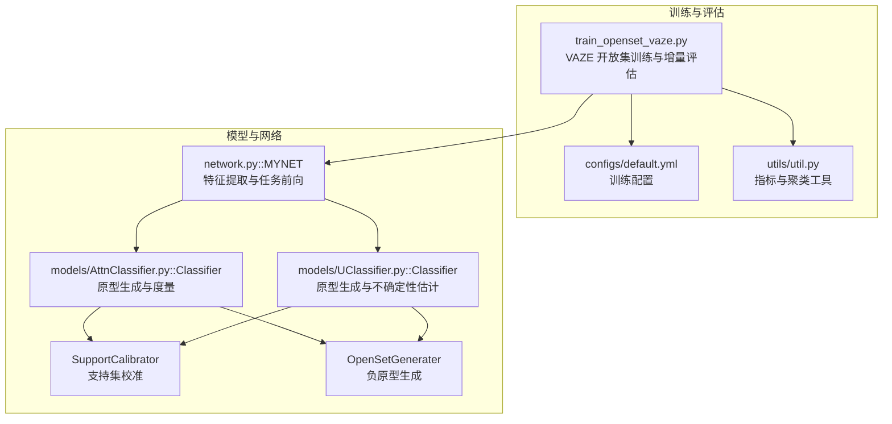
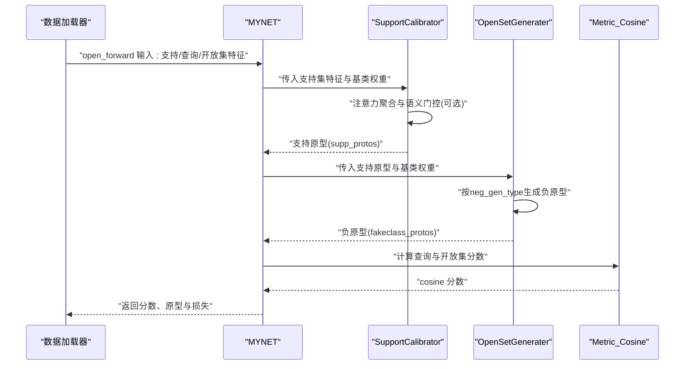
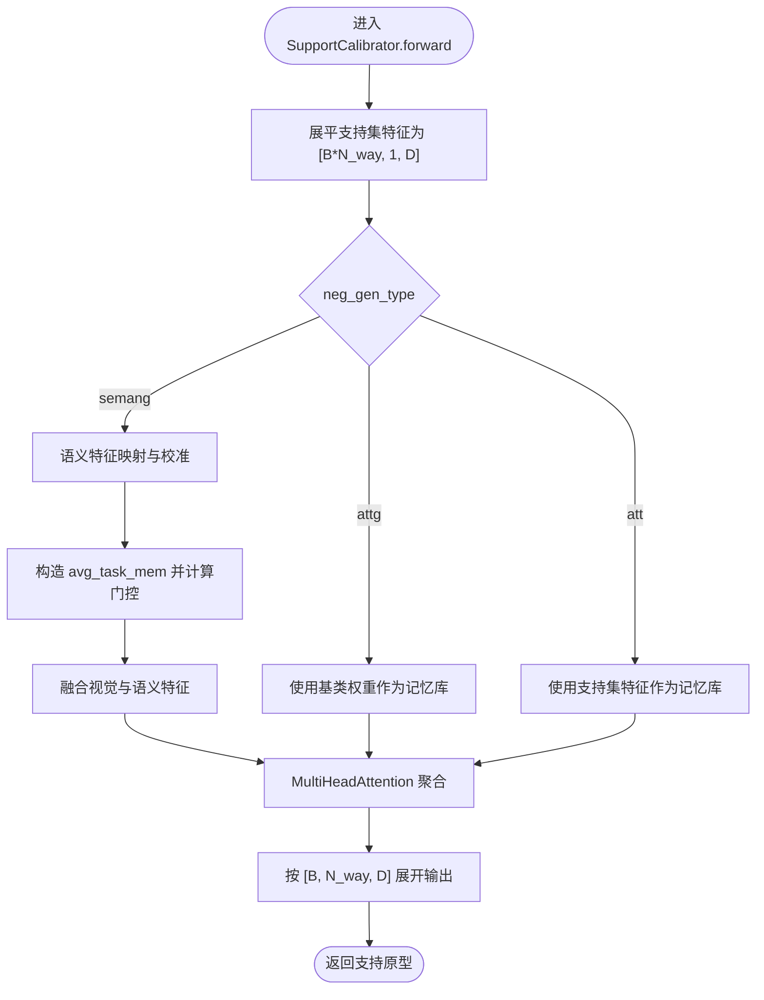
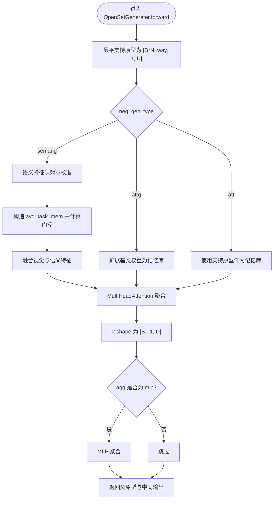
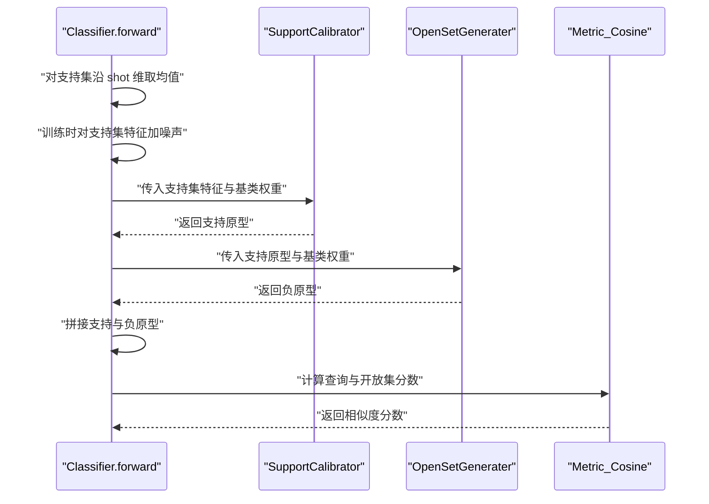
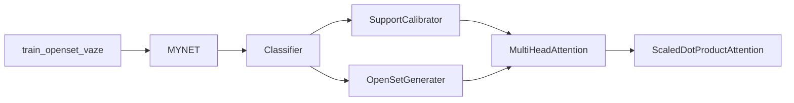

# 原型生成与优化

<cite>
**本文引用的文件**
- [train_openset_vaze.py](file://train_openset_vaze.py)
- [models/AttnClassifier.py](file://models/AttnClassifier.py)
- [models/UClassifier.py](file://models/UClassifier.py)
- [network.py](file://network.py)
- [configs/default.yml](file://configs/default.yml)
- [utils/util.py](file://utils/util.py)
</cite>

## 目录
1. [简介](#简介)
2. [项目结构](#项目结构)
3. [核心组件](#核心组件)
4. [架构总览](#架构总览)
5. [详细组件分析](#详细组件分析)
6. [依赖关系分析](#依赖关系分析)
7. [性能考量](#性能考量)
8. [故障排查指南](#故障排查指南)
9. [结论](#结论)
10. [附录](#附录)

## 简介
本文件围绕 VAZE 系统的原型生成与优化机制，系统化梳理以下内容：
- SupportCalibrator 的支持集特征注意力聚合与语义校准流程
- OpenSetGenerater 的负原型（伪类）生成机制及三种负生成类型（semang、attg、att）的差异与适用场景
- 原型优化策略：语义融合门控机制与视觉-语义特征交互融合
- 原型动态更新流程：从支持集特征到最终原型向量的计算链路
- 原型质量评估与稳定性分析的技术实现
- 增量学习中的原型更新策略与知识迁移机制

## 项目结构
本项目采用“模型-网络-训练脚本-配置-工具”的分层组织方式。与原型生成与优化直接相关的核心文件如下：
- 支持集与负原型生成：SupportCalibrator、OpenSetGenerater（位于 AttnClassifier 与 UClassifier 两个实现中）
- 系统主网络：MYNET，负责特征提取、任务前向与损失计算
- 开放集训练脚本：train_openset_vaze.py，提供 VAZE 开放集检测与增量原型添加流程
- 配置：default.yml，定义训练与增量会话的关键超参
- 工具：util.py，提供聚类与指标计算等辅助能力

图表来源
- [train_openset_vaze.py:1-481](file://train_openset_vaze.py#L1-L481)
- [models/AttnClassifier.py:1-369](file://models/AttnClassifier.py#L1-L369)
- [models/UClassifier.py:1-405](file://models/UClassifier.py#L1-L405)
- [network.py:18-202](file://network.py#L18-L202)
- [configs/default.yml:1-88](file://configs/default.yml#L1-L88)
- [utils/util.py:1-75](file://utils/util.py#L1-L75)

章节来源
- [train_openset_vaze.py:1-481](file://train_openset_vaze.py#L1-L481)
- [models/AttnClassifier.py:1-369](file://models/AttnClassifier.py#L1-L369)
- [models/UClassifier.py:1-405](file://models/UClassifier.py#L1-L405)
- [network.py:18-202](file://network.py#L18-L202)
- [configs/default.yml:1-88](file://configs/default.yml#L1-L88)
- [utils/util.py:1-75](file://utils/util.py#L1-L75)

## 核心组件
- SupportCalibrator：对支持集特征进行注意力聚合，并在 semang 模式下引入语义校准与门控融合，生成更稳健的支持原型
- OpenSetGenerater：基于支持原型与基类权重，按不同负生成类型生成负原型（伪类），并可选 MLP 聚合
- MYNET：封装编码器、原型度量与任务前向，负责在 openmeta 模式下执行原型生成与损失计算
- train_openset_vaze：提供 VAZE 开放集检测规则与增量原型添加流程，便于与现有评估协议对接

章节来源
- [models/AttnClassifier.py:121-186](file://models/AttnClassifier.py#L121-L186)
- [models/AttnClassifier.py:188-271](file://models/AttnClassifier.py#L188-L271)
- [models/UClassifier.py:134-199](file://models/UClassifier.py#L134-L199)
- [models/UClassifier.py:201-284](file://models/UClassifier.py#L201-L284)
- [network.py:102-202](file://network.py#L102-L202)
- [train_openset_vaze.py:134-198](file://train_openset_vaze.py#L134-L198)

## 架构总览
VAZE 的原型生成与优化由“支持集校准 + 负原型生成 + 度量与损失”三部分构成。整体流程如下：

图表来源
- [network.py:102-202](file://network.py#L102-L202)
- [models/AttnClassifier.py:47-93](file://models/AttnClassifier.py#L47-L93)
- [models/AttnClassifier.py:121-186](file://models/AttnClassifier.py#L121-L186)
- [models/AttnClassifier.py:188-271](file://models/AttnClassifier.py#L188-L271)
- [models/UClassifier.py:7-16](file://models/UClassifier.py#L7-L16)
- [models/UClassifier.py:134-199](file://models/UClassifier.py#L134-L199)
- [models/UClassifier.py:201-284](file://models/UClassifier.py#L201-L284)

## 详细组件分析

### SupportCalibrator：支持集特征的注意力聚合与语义校准
- 输入
  - 支持集特征 support_feat：形状为 [B, N_way, D]
  - 基类权重 base_weights：形状为 [B, N_base, D]
  - 语义特征 support_seman/base_seman（可选）：形状为 [B, N_way, 300]/[B, N_base, 300]
- 关键流程
  - 将支持集特征展平为 [B*N_way, 1, D]，便于注意力计算
  - 根据 neg_gen_type 选择处理路径：
    - semang：对语义特征进行映射与校准，构造任务级平均特征 avg_task_mem，通过门控（sigmoid 线性层）融合视觉与语义，再送入 MultiHeadAttention
    - attg：仅使用基类权重作为记忆库，不引入语义
    - att：将支持集特征自身作为记忆库，不使用基类权重
  - MultiHeadAttention 对支持集与记忆库进行注意力聚合，得到支持原型
- 输出
  - 支持原型：形状为 [B, N_way, D]（训练时展开，测试时可按需调整）

图表来源
- [models/AttnClassifier.py:140-185](file://models/AttnClassifier.py#L140-L185)
- [models/UClassifier.py:153-198](file://models/UClassifier.py#L153-L198)

章节来源
- [models/AttnClassifier.py:121-186](file://models/AttnClassifier.py#L121-L186)
- [models/UClassifier.py:134-199](file://models/UClassifier.py#L134-L199)

### OpenSetGenerater：负原型（伪类）生成机制
- 输入
  - 支持原型 support_center：形状为 [B, N_way, D]
  - 基类权重 base_weights：形状为 [B, N_base, D]
- 关键流程
  - 根据 neg_gen_type 选择：
    - semang：与 SupportCalibrator 类似，进行语义校准与门控融合，再经 MultiHeadAttention 得到输出
    - attg：将基类权重重复扩展为 [B*N_way, N_base, D]，作为记忆库
    - att：将支持原型自身作为记忆库
  - 输出
    - 负原型 fakeclass_center：形状为 [B, N_way, D]（训练时按 way 维求均值得到 [B, 1, D]，测试时保持 [B, N_way, D]）
    - recip_unit：中间注意力输出，用于后续对比损失
- 聚合策略
  - agg='mlp' 时，对负原型进一步通过 MLP 聚合，提升判别性

图表来源
- [models/AttnClassifier.py:212-284](file://models/AttnClassifier.py#L212-L284)
- [models/UClassifier.py:225-284](file://models/UClassifier.py#L225-L284)

章节来源
- [models/AttnClassifier.py:188-271](file://models/AttnClassifier.py#L188-L271)
- [models/UClassifier.py:201-284](file://models/UClassifier.py#L201-L284)

### 语义融合门控机制与视觉-语义交互融合
- 语义校准
  - 对 support_seman/base_seman 进行映射（map_sem），统一到任务嵌入空间
- 任务级平均
  - 将任务级视觉与语义特征拼接后取平均，得到 avg_task_mem
- 门控融合
  - 通过两套线性层分别计算视觉门控与语义门控，采用 sigmoid+常数偏移，控制融合强度
  - 视觉与语义分支分别与门控相乘，实现自适应融合
- 注意力聚合
  - MultiHeadAttention 对融合后的特征进行注意力聚合，得到最终原型

章节来源
- [models/AttnClassifier.py:135-185](file://models/AttnClassifier.py#L135-L185)
- [models/UClassifier.py:148-198](file://models/UClassifier.py#L148-L198)

### 不同负生成类型的实现差异
- semang
  - 引入语义校准与门控融合，适合具备语义特征的任务
  - 优点：语义先验增强，原型更具判别性
  - 适用：支持集与基类均具备语义表征
- attg
  - 仅使用基类权重作为记忆库，不引入语义
  - 优点：计算轻量，避免语义不一致带来的干扰
  - 适用：无语义特征或语义不可靠场景
- att
  - 使用支持集特征自身作为记忆库
  - 优点：直接利用支持集内部一致性
  - 适用：支持集内部结构清晰、噪声较少

章节来源
- [models/AttnClassifier.py:167-177](file://models/AttnClassifier.py#L167-L177)
- [models/UClassifier.py:180-189](file://models/UClassifier.py#L180-L189)

### 原型动态更新流程（从支持集特征到最终原型向量）
- 支持集特征预处理
  - 在 Classifier.forward 中对 support_feat 沿 shot 维取均值得到支持集特征
  - 训练时对支持集特征注入噪声，防止中心坍缩
- 支持原型生成
  - SupportCalibrator 对支持集特征与基类权重进行注意力聚合，得到支持原型
- 负原型生成
  - OpenSetGenerater 基于支持原型与基类权重生成负原型（伪类）
- 原型合并与度量
  - 将支持原型与负原型拼接，作为最终原型集合
  - 使用 Metric_Cosine 计算查询与开放集样本的相似度分数

图表来源
- [models/AttnClassifier.py:47-93](file://models/AttnClassifier.py#L47-L93)
- [models/AttnClassifier.py:121-186](file://models/AttnClassifier.py#L121-L186)
- [models/AttnClassifier.py:188-271](file://models/AttnClassifier.py#L188-L271)
- [models/AttnClassifier.py:352-368](file://models/AttnClassifier.py#L352-L368)

章节来源
- [models/AttnClassifier.py:39-93](file://models/AttnClassifier.py#L39-L93)
- [models/AttnClassifier.py:121-186](file://models/AttnClassifier.py#L121-L186)
- [models/AttnClassifier.py:188-271](file://models/AttnClassifier.py#L188-L271)

### 原型质量评估与稳定性分析
- 聚类评估
  - 使用聚类准确率与 F1 分数评估未知样本聚类效果（用于 VAZE 增量评估）
- 不确定性估计（UClassifier）
  - 通过 MC Dropout 与掩码增强，构建预测矩阵，使用核范数衡量不确定性
  - 重要性权重根据不确定性反比计算，用于增量学习中的样本加权
- 稳定性保障
  - 训练时对支持集特征与原型注入噪声，缓解中心坍缩
  - hinge 边界损失约束负原型与支持原型的距离，提升分离度

章节来源
- [utils/util.py:12-57](file://utils/util.py#L12-L57)
- [models/UClassifier.py:42-121](file://models/UClassifier.py#L42-L121)
- [models/AttnClassifier.py:56-65](file://models/AttnClassifier.py#L56-L65)
- [network.py:134-146](file://network.py#L134-L146)

### 增量学习中的更新策略与知识迁移
- VAZE 增量流程
  - 使用闭集分类器进行训练，计算类中心
  - 使用阈值规则识别未知样本，对未知特征聚类并添加新原型
- 知识迁移
  - 通过替换基类全连接层权重，将旧类原型迁移到新分类器
  - 在增量会话中，逐步扩展分类器输出维度，新增类别的原型初始化策略可结合平均嵌入

章节来源
- [train_openset_vaze.py:86-99](file://train_openset_vaze.py#L86-L99)
- [train_openset_vaze.py:102-131](file://train_openset_vaze.py#L102-L131)
- [train_openset_vaze.py:134-170](file://train_openset_vaze.py#L134-L170)
- [train_openset_vaze.py:173-198](file://train_openset_vaze.py#L173-L198)
- [network.py:639-670](file://network.py#L639-L670)

## 依赖关系分析
- SupportCalibrator 与 OpenSetGenerater 依赖 MultiHeadAttention 与 ScaledDotProductAttention 实现注意力聚合
- Classifier 将 SupportCalibrator 与 OpenSetGenerater 组合，形成完整的原型生成流水线
- MYNET 在 open_forward 中协调特征提取、原型生成与损失计算
- train_openset_vaze.py 提供 VAZE 开放集检测与增量评估流程，依赖 MYNET 与评估工具

图表来源
- [models/AttnClassifier.py:274-368](file://models/AttnClassifier.py#L274-L368)
- [models/UClassifier.py:287-381](file://models/UClassifier.py#L287-L381)
- [network.py:102-202](file://network.py#L102-L202)
- [train_openset_vaze.py:1-481](file://train_openset_vaze.py#L1-L481)

章节来源
- [models/AttnClassifier.py:274-368](file://models/AttnClassifier.py#L274-L368)
- [models/UClassifier.py:287-381](file://models/UClassifier.py#L287-L381)
- [network.py:102-202](file://network.py#L102-L202)
- [train_openset_vaze.py:1-481](file://train_openset_vaze.py#L1-L481)

## 性能考量
- 注意力头与温度参数
  - MultiHeadAttention 的头数与温度控制影响注意力分布与原型判别性
- 聚合策略
  - mlp 聚合可提升负原型判别性，但增加计算开销
- 噪声注入
  - 训练时对支持集特征与原型注入噪声，有助于缓解中心坍缩，提升泛化
- hinge 边界损失
  - 强制负原型与支持原型保持最小距离，提升原型分离度

章节来源
- [models/AttnClassifier.py:274-368](file://models/AttnClassifier.py#L274-L368)
- [models/AttnClassifier.py:56-65](file://models/AttnClassifier.py#L56-L65)
- [network.py:134-146](file://network.py#L134-L146)

## 故障排查指南
- 语义特征缺失
  - 若未提供语义特征，neg_gen_type='semang' 将无法生效，建议切换为 'attg' 或 'att'
- 维度不匹配
  - 语义维度需与配置一致（如 300），否则在门控融合时会报错
- 渐近不稳定
  - 增加噪声注入强度或调整温度参数，观察原型分离度变化
- 增量评估异常
  - 确认基类全连接层权重替换逻辑与类别编号一致

章节来源
- [models/AttnClassifier.py:135-185](file://models/AttnClassifier.py#L135-L185)
- [models/UClassifier.py:148-198](file://models/UClassifier.py#L148-L198)
- [network.py:639-670](file://network.py#L639-L670)

## 结论
VAZE 的原型生成与优化机制通过“支持集注意力聚合 + 语义融合门控 + 负原型生成”的组合，实现了稳健且可解释的原型表示。在不同任务场景下，可通过选择合适的负生成类型（semang/attg/att）与聚合策略（avg/mlp）来平衡性能与效率。结合 VAZE 的开放集检测与增量评估流程，系统能够在持续学习中动态更新原型并维持稳定性。

## 附录
- 关键配置项参考
  - 训练轮次、批次大小、温度、增量会话数等由 default.yml 提供
- 评估指标
  - 聚类准确率、F1 分数、核范数不确定性等

章节来源
- [configs/default.yml:1-88](file://configs/default.yml#L1-L88)
- [utils/util.py:12-57](file://utils/util.py#L12-L57)