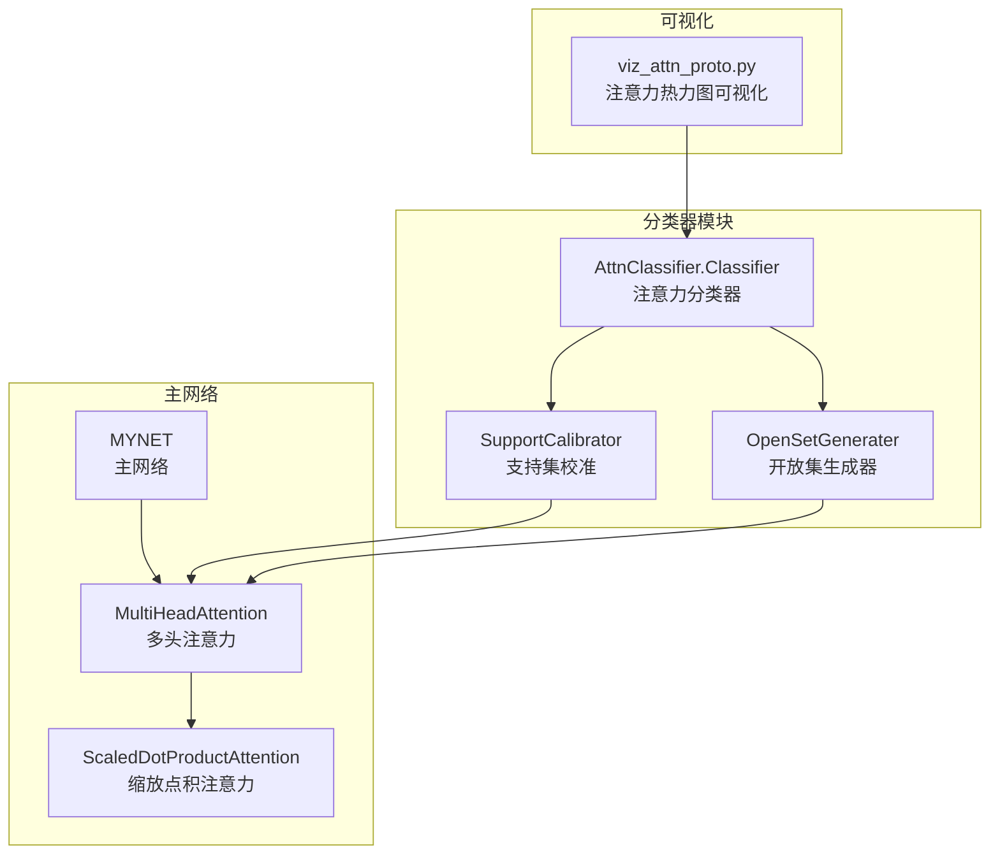
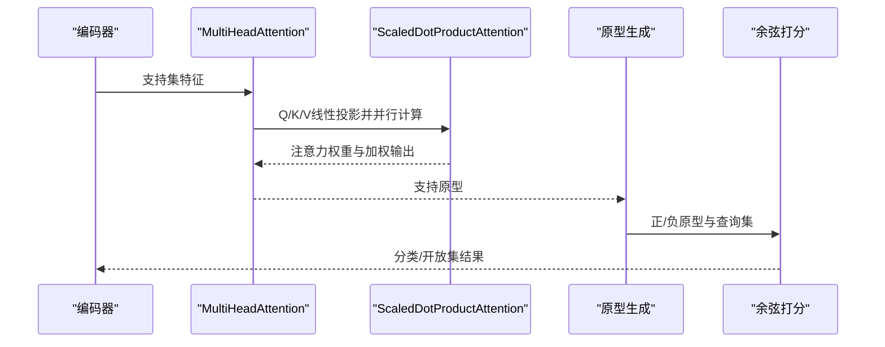
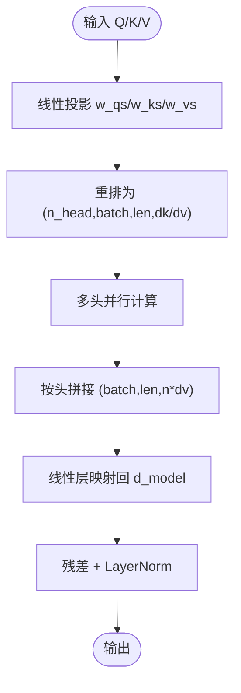
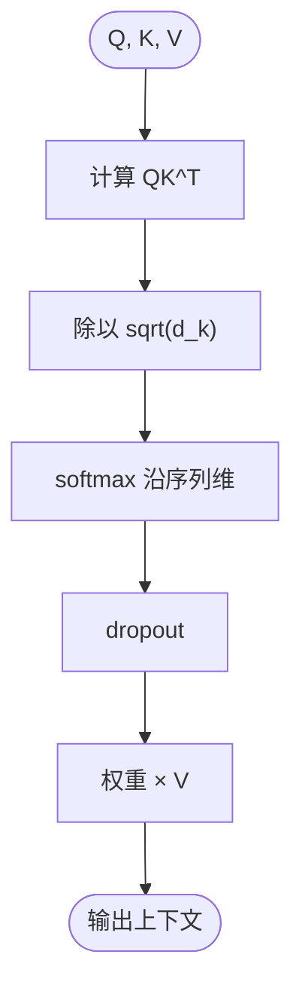
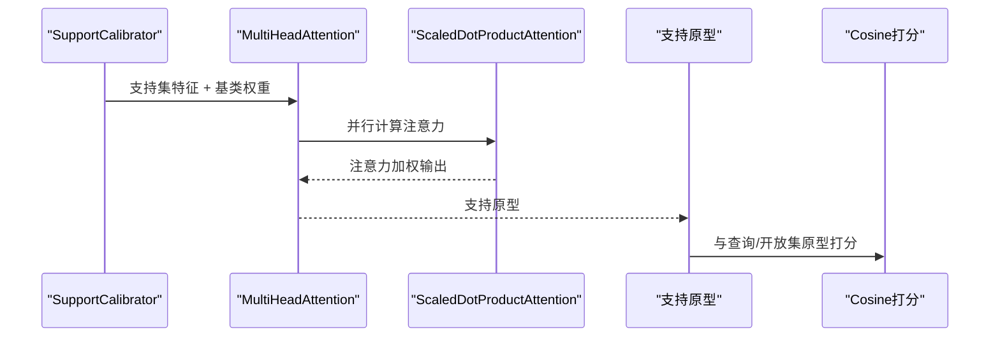
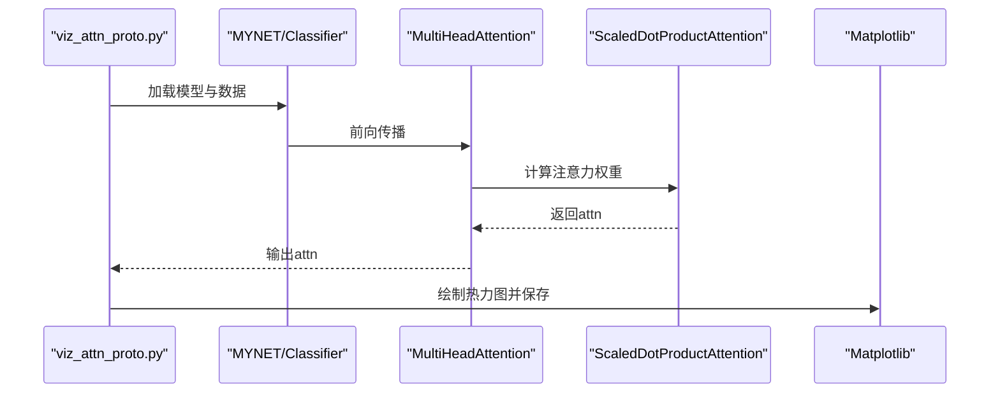
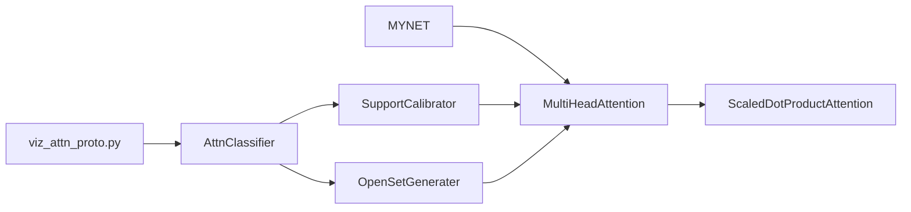

# 多头注意力机制

<cite>
**本文引用的文件**
- [network.py](file://network.py)
- [viz_attn_proto.py](file://scripts/viz_attn_proto.py)
- [AttnClassifier.py](file://models/AttnClassifier.py)
- [UClassifier.py](file://models/UClassifier.py)
- [train_unopenset.py](file://train_unopenset.py)
</cite>

## 目录
1. [简介](#简介)
2. [项目结构](#项目结构)
3. [核心组件](#核心组件)
4. [架构总览](#架构总览)
5. [详细组件分析](#详细组件分析)
6. [依赖关系分析](#依赖关系分析)
7. [性能考量](#性能考量)
8. [故障排查指南](#故障排查指南)
9. [结论](#结论)
10. [附录](#附录)

## 简介
本文件聚焦VAZE系统中的多头注意力机制，系统性解析MultiHeadAttention与ScaledDotProductAttention的实现原理与数学基础，详述Q/K/V线性变换、多头并行计算、缩放点积注意力的softmax归一化流程，以及多头输出拼接与线性变换的融合过程。同时结合VAZE在原型学习中的应用场景，说明支持集到原型的注意力聚合与查询集到原型的注意力匹配，并提供注意力权重可视化与热力图分析的技术实现路径。

## 项目结构
VAZE系统将注意力机制嵌入到主网络MYNET中，并通过AttnClassifier/UClassifier等模块在原型学习任务中使用注意力进行支持集校准与负原型生成。可视化工具提供注意力权重热力图的生成能力。

图表来源
- [network.py:31-33](file://network.py#L31-L33)
- [network.py:538-584](file://network.py#L538-L584)
- [network.py:522-535](file://network.py#L522-L535)
- [AttnClassifier.py:38-93](file://models/AttnClassifier.py#L38-L93)
- [AttnClassifier.py:121-185](file://models/AttnClassifier.py#L121-L185)
- [AttnClassifier.py:188-200](file://models/AttnClassifier.py#L188-L200)
- [viz_attn_proto.py:92-116](file://scripts/viz_attn_proto.py#L92-L116)

章节来源
- [network.py:18-35](file://network.py#L18-L35)
- [AttnClassifier.py:38-93](file://models/AttnClassifier.py#L38-L93)
- [viz_attn_proto.py:34-116](file://scripts/viz_attn_proto.py#L34-L116)

## 核心组件
- MultiHeadAttention：实现多头注意力的完整流程，包括Q/K/V线性投影、多头并行计算、拼接与线性变换。
- ScaledDotProductAttention：实现缩放点积注意力，包含注意力分数计算、缩放因子、softmax归一化与dropout。
- MYNET：在VAZE主网络中集成多头注意力，用于支持集到原型的聚合与查询到原型的匹配。
- AttnClassifier/UClassifier：在原型学习场景中，使用注意力对支持集进行校准，生成正/负原型，并进行分类打分。

章节来源
- [network.py:538-584](file://network.py#L538-L584)
- [network.py:522-535](file://network.py#L522-L535)
- [network.py:18-35](file://network.py#L18-L35)
- [AttnClassifier.py:38-93](file://models/AttnClassifier.py#L38-L93)

## 架构总览
VAZE系统中，注意力机制贯穿特征编码后的支持集与查询集处理链路。支持集经由注意力模块进行语义/视觉融合与聚合，生成支持原型；随后与查询集共同参与余弦相似度打分，完成开放集识别任务。

图表来源
- [network.py:31-33](file://network.py#L31-L33)
- [network.py:538-584](file://network.py#L538-L584)
- [network.py:522-535](file://network.py#L522-L535)
- [AttnClassifier.py:121-185](file://models/AttnClassifier.py#L121-L185)

## 详细组件分析

### MultiHeadAttention实现原理
- Q/K/V线性变换：分别通过独立的线性层将输入映射到多头空间，维度为(n_head × d_k)或(n_head × d_v)。
- 多头并行计算：将张量重排为(n_head, batch, length, head_dim)，对每个头执行缩放点积注意力，随后按头拼接。
- 拼接与线性变换：将多头输出按头拼接为(batch, length, n_head × d_v)，再通过线性层映射回目标维度，并与残差相加。
- 层归一化与dropout：在输出后进行dropout与LayerNorm，提升稳定性与泛化。

图表来源
- [network.py:547-559](file://network.py#L547-L559)
- [network.py:561-584](file://network.py#L561-L584)

章节来源
- [network.py:538-584](file://network.py#L538-L584)

### ScaledDotProductAttention数学原理与实现
- 注意力分数：通过批矩阵乘法计算QK^T，得到注意力分数矩阵。
- 缩放因子：除以sqrt(d_k)，抑制大维度下的数值溢出并稳定softmax。
- softmax归一化：沿序列维进行softmax，得到注意力权重分布。
- 加权求和：注意力权重与V相乘，得到上下文表示。
- Dropout：在softmax后应用dropout，缓解过拟合并提升鲁棒性。

图表来源
- [network.py:528-535](file://network.py#L528-L535)

章节来源
- [network.py:522-535](file://network.py#L522-L535)

### 多头注意力的拼接与线性变换融合
- 多头输出维度：每个头输出为(batch, length, d_v)，拼接后为(batch, length, n_head × d_v)。
- 线性变换：通过全连接层将拼接后的特征映射回d_model，保证与残差维度一致。
- 残差与归一化：输出与输入残差相加，并通过LayerNorm稳定训练。

章节来源
- [network.py:576-584](file://network.py#L576-L584)

### VAZE原型学习中的注意力应用
- 支持集到原型的注意力聚合：在SupportCalibrator中，使用MultiHeadAttention对支持集特征与基类权重进行注意力融合，生成支持原型。
- 查询集到原型的注意力匹配：在AttnClassifier.forward中，使用余弦相似度对支持/伪类原型与查询集进行打分，实现匹配。
- 开放集负原型生成：OpenSetGenerater通过注意力对支持原型与基类权重进行交互，生成负原型，辅助开放集识别。

图表来源
- [AttnClassifier.py:121-185](file://models/AttnClassifier.py#L121-L185)
- [AttnClassifier.py:188-200](file://models/AttnClassifier.py#L188-L200)
- [network.py:538-584](file://network.py#L538-L584)
- [network.py:522-535](file://network.py#L522-L535)

章节来源
- [AttnClassifier.py:38-93](file://models/AttnClassifier.py#L38-L93)
- [AttnClassifier.py:121-185](file://models/AttnClassifier.py#L121-L185)
- [AttnClassifier.py:188-200](file://models/AttnClassifier.py#L188-L200)

### 注意力权重可视化与热力图分析
- 双原型热力图：可视化正/负原型的特征分布，帮助理解原型的空间结构。
- 自注意力热力图：对支持批次特征喂入注意力模块，获取注意力权重attn，绘制热力图以观察支持样本间的交互强度。
- 可视化脚本：通过命令行参数加载模型与数据，提取注意力权重并保存热力图。

图表来源
- [viz_attn_proto.py:34-116](file://scripts/viz_attn_proto.py#L34-L116)
- [network.py:538-584](file://network.py#L538-L584)
- [network.py:522-535](file://network.py#L522-L535)

章节来源
- [viz_attn_proto.py:34-116](file://scripts/viz_attn_proto.py#L34-L116)

## 依赖关系分析
- MYNET依赖MultiHeadAttention与ScaledDotProductAttention实现特征层面的注意力聚合。
- AttnClassifier/UClassifier通过SupportCalibrator与OpenSetGenerater间接依赖MultiHeadAttention，用于原型学习场景。
- 可视化脚本依赖MYNET/Classifier的注意力模块，提取attn权重进行热力图绘制。

图表来源
- [network.py:31-33](file://network.py#L31-L33)
- [network.py:538-584](file://network.py#L538-L584)
- [network.py:522-535](file://network.py#L522-L535)
- [AttnClassifier.py:38-93](file://models/AttnClassifier.py#L38-L93)
- [viz_attn_proto.py:92-116](file://scripts/viz_attn_proto.py#L92-L116)

章节来源
- [network.py:18-35](file://network.py#L18-L35)
- [AttnClassifier.py:38-93](file://models/AttnClassifier.py#L38-L93)
- [viz_attn_proto.py:34-116](file://scripts/viz_attn_proto.py#L34-L116)

## 性能考量
- 计算复杂度：多头注意力的Q/K/V线性投影与并行计算在长序列上开销较大，建议合理设置n_head与d_k/d_v，平衡表达能力与速度。
- 内存占用：多头拼接与中间张量重排会增加显存压力，可通过降低序列长度或批量大小缓解。
- 稳定性：缩放因子与softmax归一化有助于数值稳定；dropout可缓解过拟合，但需注意推理时关闭。

## 故障排查指南
- 注意力权重为空或异常：检查输入张量维度与线性层初始化，确认Q/K/V投影正确。
- 热力图显示异常：确认可视化脚本中attn的维度与索引，确保attn来自注意力模块而非其他分支。
- 训练不稳定：适当调整温度因子、dropout率与学习率，观察损失收敛情况。

章节来源
- [network.py:522-535](file://network.py#L522-L535)
- [network.py:538-584](file://network.py#L538-L584)
- [viz_attn_proto.py:92-116](file://scripts/viz_attn_proto.py#L92-L116)

## 结论
VAZE系统中的多头注意力机制通过Q/K/V线性变换与缩放点积注意力，实现了对支持集的聚合与对查询集的匹配。在原型学习场景中，注意力不仅提升了支持集到原型的聚合质量，还为开放集负原型生成提供了有效的交互机制。配合可视化工具，可直观分析注意力权重分布，辅助模型调试与理解。

## 附录
- 参数与配置：训练参数如注意力头数、温度因子、dropout率等可在训练脚本中统一管理，便于对比实验与调参。
- 可视化扩展：可将注意力权重与原型特征进行联合分析，探索不同类别间的注意力偏好与交互模式。

章节来源
- [train_unopenset.py:200-265](file://train_unopenset.py#L200-L265)
- [viz_attn_proto.py:34-116](file://scripts/viz_attn_proto.py#L34-L116)