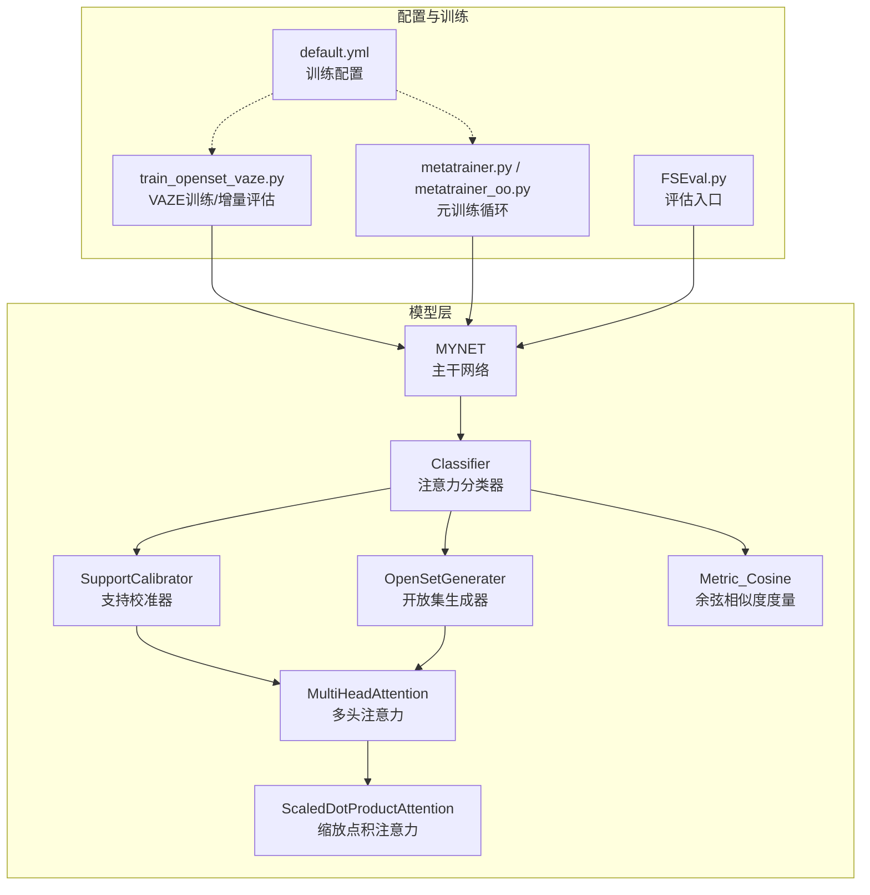
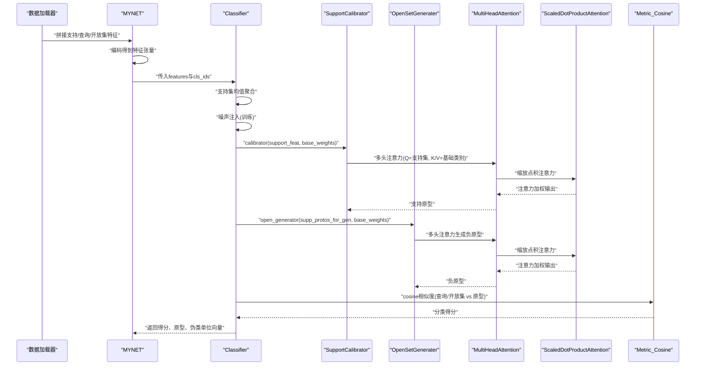
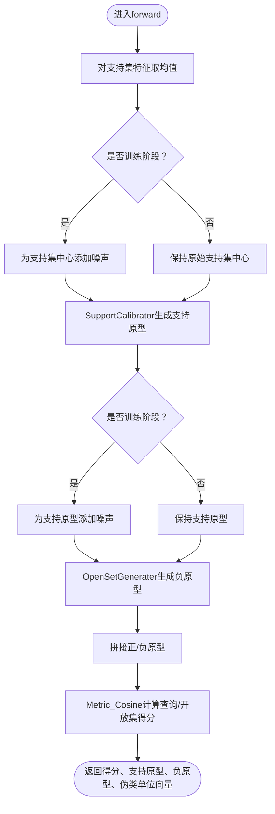
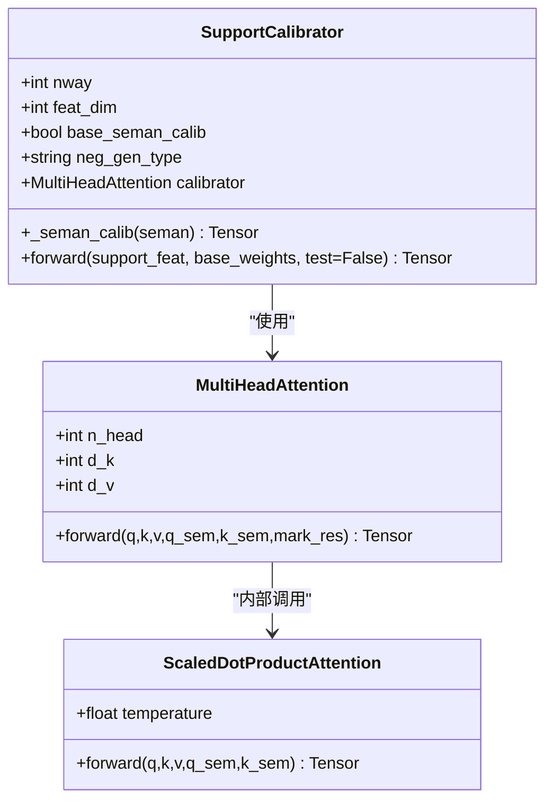
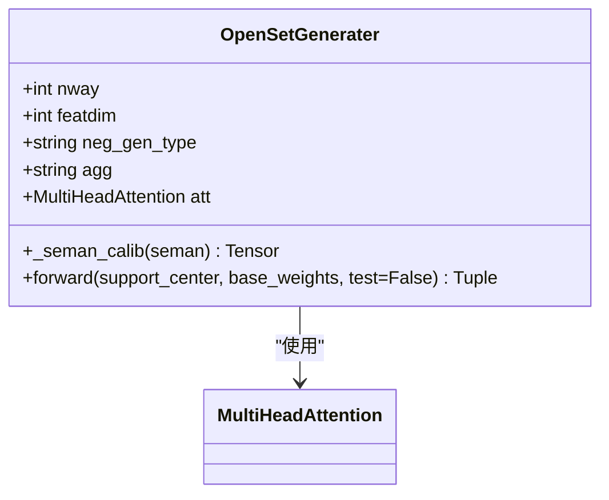
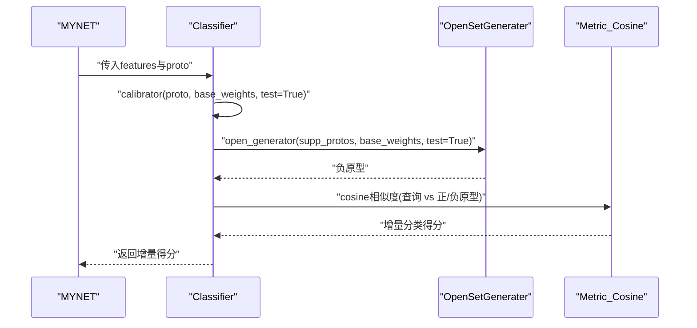
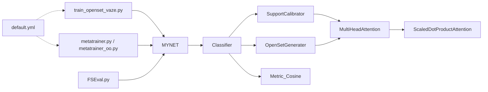

# 注意力分类器

<cite>
**本文引用的文件列表**
- [AttnClassifier.py](file://models/AttnClassifier.py)
- [network.py](file://network.py)
- [default.yml](file://configs/default.yml)
- [train_openset_vaze.py](file://train_openset_vaze.py)
- [metatrainer.py](file://models/metatrainer.py)
- [metatrainer_oo.py](file://models/metatrainer_oo.py)
- [FSEval.py](file://models/FSEval.py)
- [base.py](file://models/base.py)
</cite>

## 目录
1. [简介](#简介)
2. [项目结构](#项目结构)
3. [核心组件](#核心组件)
4. [架构总览](#架构总览)
5. [详细组件分析](#详细组件分析)
6. [依赖关系分析](#依赖关系分析)
7. [性能考量](#性能考量)
8. [故障排查指南](#故障排查指南)
9. [结论](#结论)
10. [附录](#附录)

## 简介
本文件面向VAZE系统中的注意力分类器，系统性梳理Classifier类的设计与实现，重点解析以下内容：
- SupportCalibrator与OpenSetGenerater两个核心组件的作用与交互
- 多头注意力机制在原型生成中的应用，以及如何通过注意力权重聚合支持集特征
- 分类器的前向传播流程：从支持集特征处理到查询集分类得分计算的完整过程
- 噪声注入机制在防止特征坍缩方面的作用，以及在训练与测试阶段的不同处理策略
- 注意力分类器在增量学习场景下的具体实现，包括原型更新与相似度计算的步骤
- 分类器初始化、表示获取与增量前向传播的完整接口说明

## 项目结构
VAZE注意力分类器位于models子目录中，与主干网络、训练与评估脚本协同工作：
- models/AttnClassifier.py：定义Classifier、SupportCalibrator、OpenSetGenerater、MultiHeadAttention、ScaledDotProductAttention、Metric_Cosine等核心模块
- network.py：主干网络MYNET，封装编码器、分类器、任务前向逻辑与损失计算
- configs/default.yml：默认训练配置，包含n_ways、n_shots、n_queries等元学习超参
- train_openset_vaze.py：VAZE开放集训练与增量评估流程
- models/metatrainer.py、models/metatrainer_oo.py：元训练与开放集训练的训练循环
- models/FSEval.py：评估阶段的特征打包与推理入口
- models/base.py：通用Trainer基类与工具函数

图表来源
- [network.py:18-50](file://network.py#L18-L50)
- [AttnClassifier.py:38-118](file://models/AttnClassifier.py#L38-L118)
- [default.yml:1-88](file://configs/default.yml#L1-L88)
- [train_openset_vaze.py:445-477](file://train_openset_vaze.py#L445-L477)
- [metatrainer.py:130-158](file://models/metatrainer.py#L130-L158)
- [FSEval.py:82-95](file://models/FSEval.py#L82-L95)

章节来源
- [network.py:18-50](file://network.py#L18-L50)
- [AttnClassifier.py:38-118](file://models/AttnClassifier.py#L38-L118)
- [default.yml:1-88](file://configs/default.yml#L1-L88)

## 核心组件
本节聚焦Classifier类及其两大核心子模块SupportCalibrator与OpenSetGenerater，以及注意力与度量模块。

- Classifier
  - 职责：整合支持集特征、基础类别表示与语义信息，生成正原型与负原型，计算查询与开放集的分类得分，并输出伪类单位向量用于距离度量
  - 关键方法：
    - forward(features, cls_ids, test=False)：支持集均值、噪声注入、正原型生成、负原型生成、分类得分与伪类单位向量计算
    - incre_forward(features, proto, cls_ids)：增量阶段的前向传播，直接对已有原型进行分类
    - init_representation(params)：初始化基础类别表示（来自预训练分类器的fc权重）
    - get_representation(cls_ids, base_ids, randpick=False)：按需抽取基础类别表示

- SupportCalibrator
  - 职责：基于多头注意力对支持集特征与基础类别表示进行融合，生成支持原型
  - 支持三种生成类型：
    - semang：视觉与语义联合门控融合
    - attg：仅注意力聚合基础类别表示
    - att：以支持集特征作为查询/键/值进行注意力
  - 关键方法：forward(support_feat, base_weights, test=False)

- OpenSetGenerater
  - 职责：基于多头注意力生成负原型（伪类），并可选择MLP聚合
  - 支持三种生成类型：semang、attg、att
  - 关键方法：forward(support_center, base_weights, test=False)

- MultiHeadAttention与ScaledDotProductAttention
  - MultiHeadAttention：多头缩放点积注意力，支持可选语义分支的门控融合
  - ScaledDotProductAttention：缩放点积注意力，计算注意力权重并加权求和

- Metric_Cosine
  - 职责：余弦相似度度量，支持温度缩放，区分训练与测试的矩阵转置方式

章节来源
- [AttnClassifier.py:38-118](file://models/AttnClassifier.py#L38-L118)
- [AttnClassifier.py:121-185](file://models/AttnClassifier.py#L121-L185)
- [AttnClassifier.py:188-271](file://models/AttnClassifier.py#L188-L271)
- [AttnClassifier.py:274-350](file://models/AttnClassifier.py#L274-L350)
- [AttnClassifier.py:352-369](file://models/AttnClassifier.py#L352-L369)

## 架构总览
VAZE注意力分类器在MYNET中被集成，形成完整的前向与损失计算链路。训练时，MYNET的open_forward负责组织支持/查询/开放集特征，调用Classifier生成原型与分数；测试时，FSEval负责特征打包与推理。

图表来源
- [network.py:102-151](file://network.py#L102-L151)
- [AttnClassifier.py:47-93](file://models/AttnClassifier.py#L47-L93)
- [AttnClassifier.py:140-185](file://models/AttnClassifier.py#L140-L185)
- [AttnClassifier.py:212-271](file://models/AttnClassifier.py#L212-L271)
- [AttnClassifier.py:299-326](file://models/AttnClassifier.py#L299-L326)
- [AttnClassifier.py:340-349](file://models/AttnClassifier.py#L340-L349)
- [AttnClassifier.py:357-367](file://models/AttnClassifier.py#L357-L367)

## 详细组件分析

### Classifier类设计与前向传播
- 支持集特征处理
  - 对支持集特征沿样本维取均值，得到每类的中心表示
  - 训练阶段对支持集中心添加噪声，防止特征坍缩；测试阶段保持原始特征
- 正原型生成
  - 通过SupportCalibrator结合基础类别表示与语义信息（可选）进行门控融合，输出支持原型
- 负原型生成
  - 通过OpenSetGenerater对支持原型进行注意力聚合，生成负原型（伪类）
  - 可选使用MLP对负原型进行非线性聚合
- 分类得分计算
  - 使用Metric_Cosine对查询与开放集特征分别与所有原型（正+负）计算余弦相似度，并乘以温度参数
- 伪类单位向量
  - 返回recip_unit用于后续距离度量（如未知检测）

图表来源
- [AttnClassifier.py:47-93](file://models/AttnClassifier.py#L47-L93)

章节来源
- [AttnClassifier.py:47-93](file://models/AttnClassifier.py#L47-L93)

### SupportCalibrator：多头注意力在支持集原型生成中的作用
- 输入
  - support_feat：支持集特征（bs×nway×feat_dim）
  - base_weights：基础类别表示（bs×nbase×feat_dim）
  - support_seman/base_seman：可选语义特征（bs×nway×300）
- 多头注意力
  - Q=支持集特征，K/V=基础类别表示（或语义表示）
  - 通过门控融合（semang）将视觉与语义信息融合，得到加权的基础类别表示
- 输出
  - 支持原型（bs×nway×feat_dim），训练时保持二维结构便于后续处理

图表来源
- [AttnClassifier.py:121-185](file://models/AttnClassifier.py#L121-L185)
- [AttnClassifier.py:274-350](file://models/AttnClassifier.py#L274-L350)

章节来源
- [AttnClassifier.py:121-185](file://models/AttnClassifier.py#L121-L185)
- [AttnClassifier.py:274-350](file://models/AttnClassifier.py#L274-L350)

### OpenSetGenerater：多头注意力在负原型生成中的作用
- 输入
  - support_center：支持原型（bs×nway×feat_dim）
  - base_weights：基础类别表示（bs×nbase×feat_dim）
  - support_seman/base_seman：可选语义特征
- 多头注意力
  - Q=支持原型，K/V=基础类别表示（或语义表示）
  - 通过门控融合生成负原型（伪类）
- 聚合策略
  - 默认按注意力输出直接作为负原型
  - 可选agg='mlp'，对负原型进行MLP非线性变换

图表来源
- [AttnClassifier.py:188-271](file://models/AttnClassifier.py#L188-L271)
- [AttnClassifier.py:274-350](file://models/AttnClassifier.py#L274-L350)

章节来源
- [AttnClassifier.py:188-271](file://models/AttnClassifier.py#L188-L271)
- [AttnClassifier.py:274-350](file://models/AttnClassifier.py#L274-L350)

### 增量学习场景下的实现
- 增量前向
  - 使用已有的支持原型（supp_protos）与基础类别表示，生成负原型并拼接
  - 对查询特征计算余弦相似度，得到增量阶段的分类得分
- 原型更新
  - 在VAZE框架中，通过检测开放集中的未知样本并聚类，新增原型至分类器的fc权重中
  - 该过程由train_openset_vaze.py与相关工具函数完成，Classifier本身提供incred_forward接口

图表来源
- [AttnClassifier.py:94-101](file://models/AttnClassifier.py#L94-L101)
- [network.py:153-200](file://network.py#L153-L200)
- [train_openset_vaze.py:248-282](file://train_openset_vaze.py#L248-L282)

章节来源
- [AttnClassifier.py:94-101](file://models/AttnClassifier.py#L94-L101)
- [network.py:153-200](file://network.py#L153-L200)
- [train_openset_vaze.py:248-282](file://train_openset_vaze.py#L248-L282)

### 接口说明
- 初始化与表示获取
  - init_representation(params)：从预训练分类器的fc权重初始化基础类别表示
  - get_representation(cls_ids, base_ids, randpick=False)：按需抽取基础类别表示，支持随机采样
- 前向传播
  - forward(features, cls_ids, test=False)：支持集均值、噪声注入、正/负原型生成、分类得分与伪类单位向量
  - incre_forward(features, proto, cls_ids)：增量阶段的分类得分计算
- 训练与测试
  - 训练阶段：支持集中心与原型均添加噪声，增强泛化
  - 测试阶段：保持确定性，仅使用原始特征

章节来源
- [AttnClassifier.py:103-118](file://models/AttnClassifier.py#L103-L118)
- [AttnClassifier.py:47-93](file://models/AttnClassifier.py#L47-L93)
- [AttnClassifier.py:94-101](file://models/AttnClassifier.py#L94-L101)

## 依赖关系分析
- Classifier依赖SupportCalibrator与OpenSetGenerater，二者共同依赖MultiHeadAttention与ScaledDotProductAttention
- MYNET在open_forward中调用Classifier，形成端到端的前向与损失计算
- 训练与评估脚本通过配置文件default.yml控制元学习超参，驱动Classifier的训练与增量评估

图表来源
- [network.py:102-151](file://network.py#L102-L151)
- [AttnClassifier.py:38-118](file://models/AttnClassifier.py#L38-L118)
- [default.yml:1-88](file://configs/default.yml#L1-L88)
- [train_openset_vaze.py:445-477](file://train_openset_vaze.py#L445-L477)
- [metatrainer.py:130-158](file://models/metatrainer.py#L130-L158)
- [FSEval.py:82-95](file://models/FSEval.py#L82-L95)

章节来源
- [network.py:102-151](file://network.py#L102-L151)
- [AttnClassifier.py:38-118](file://models/AttnClassifier.py#L38-L118)
- [default.yml:1-88](file://configs/default.yml#L1-L88)

## 性能考量
- 多头注意力的温度缩放与残差连接有助于稳定梯度传播
- 训练阶段的噪声注入可缓解特征坍缩，提升原型稳定性
- Metric_Cosine的温度参数可调节决策边界锐利程度，影响开集检测阈值设定
- 增量阶段使用确定性前向，避免噪声引入的不确定性

## 故障排查指南
- 形状不匹配
  - 支持集与基础类别表示的batch维需一致；若randpick导致基础类别数量变化，需确保后续张量拼接与注意力输入一致
- 温度参数异常
  - 若cosine得分过大或过小，检查Metric_Cosine的温度参数是否合理
- 未知检测阈值
  - VAZE框架中通过动态标签分配与阈值策略进行未知检测，若阈值不当可调整相关参数

章节来源
- [AttnClassifier.py:357-367](file://models/AttnClassifier.py#L357-L367)
- [network.py:153-200](file://network.py#L153-L200)

## 结论
VAZE注意力分类器通过SupportCalibrator与OpenSetGenerater的协作，利用多头注意力在支持集与基础类别表示之间建立语义与视觉融合的原型生成机制。噪声注入有效防止特征坍缩，训练与测试阶段的差异化处理保证了模型的鲁棒性与可重复性。在增量学习场景下，Classifier提供简洁的增量前向接口，配合VAZE的聚类与原型更新流程，实现开放集检测与持续学习的统一框架。

## 附录
- 训练配置要点
  - n_ways、n_shots、n_queries等元学习超参在default.yml中定义，直接影响Classifier的输入形状与原型生成规模
- 训练与评估脚本
  - train_openset_vaze.py：VAZE训练与增量评估流程
  - metatrainer.py、metatrainer_oo.py：元训练循环与开放集训练
  - FSEval.py：评估阶段的特征打包与推理入口

章节来源
- [default.yml:1-88](file://configs/default.yml#L1-L88)
- [train_openset_vaze.py:445-477](file://train_openset_vaze.py#L445-L477)
- [metatrainer.py:130-158](file://models/metatrainer.py#L130-L158)
- [FSEval.py:82-95](file://models/FSEval.py#L82-L95)